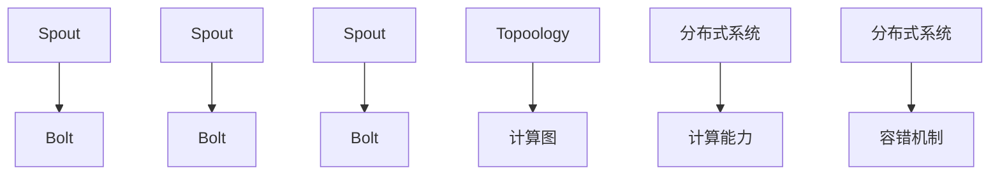
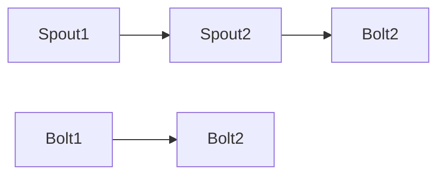
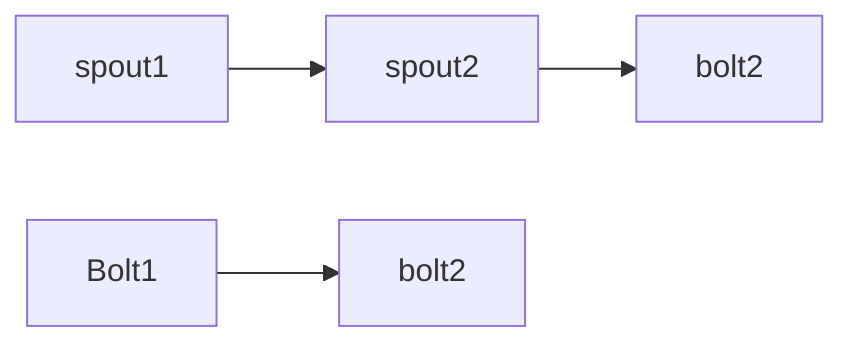

                 

# Storm原理与代码实例讲解

> 关键词：Storm, 分布式计算, 可扩展性, 容错性, 实时数据处理, 生产者-消费者模式, 负载均衡

## 1. 背景介绍

在现代互联网和大数据时代，实时数据处理需求日益增长，而传统的数据处理方式已经难以应对复杂的业务场景。为了解决这一问题，Storm提供了一种高效、可扩展、容错的分布式实时计算系统，广泛应用于大数据分析和实时流处理。Storm基于"生产者-消费者"模型，将数据流拆分为多个子流，通过分布式集群来并行处理，能够灵活应对各种数据处理需求。

Storm于2011年首次发布，由Twitter开源维护，并已成为大数据技术中的重要一员。其设计思想简单直观，原理易于理解，因此在学术界和工业界得到了广泛应用。Storm支持多种编程语言，并拥有丰富的生态系统，包括Spout、Bolt等分布式计算组件，能够轻松实现复杂的数据处理任务。

## 2. 核心概念与联系

### 2.1 核心概念概述

为了更好地理解Storm的工作原理，本节将介绍几个关键概念：

- **Storm**：分布式实时计算系统，通过"生产者-消费者"模型，实现数据的实时处理和分析。

- **Spout**：Storm的基本数据源组件，负责从外部系统接收数据，生成数据流。

- **Bolt**：Storm的数据处理组件，负责对数据流进行转换、过滤、聚合等操作，实现数据的实时计算。

- **Topoology**：Storm的计算图，描述了Spout和Bolt之间的拓扑关系，是Storm系统的核心抽象。

- **分布式系统**：由多个独立的计算节点组成，通过网络通信实现数据的分布式处理和容错。

这些概念之间存在着紧密的联系，共同构成了Storm系统的完整架构。Spout和Bolt通过拓扑关系组合在一起，构成了Storm计算图中的顶点，并通过网络通信进行数据交换。Topoology描述了各个顶点的关系，确保数据的正确性和完整性。分布式系统提供了Storm系统的计算能力和容错机制，使得Storm能够处理海量数据和复杂的业务场景。

### 2.2 概念间的关系

这些核心概念之间的逻辑关系可以通过以下Mermaid流程图来展示：



这个流程图展示了Spout、Bolt、Topoology和分布式系统之间的关系：

- Spout负责接收外部数据，生成数据流。
- Bolt对数据流进行转换、过滤、聚合等操作。
- Topoology描述了Spout和Bolt的拓扑关系，确保数据正确处理。
- 分布式系统提供计算能力和容错机制，确保系统的高可用性。

通过理解这些概念之间的联系，我们可以更好地把握Storm的工作原理和优化方向。

## 3. 核心算法原理 & 具体操作步骤
### 3.1 算法原理概述

Storm基于"生产者-消费者"模型，将数据流拆分为多个子流，通过分布式集群来并行处理。每个Spout和Bolt都在独立的计算节点上运行，通过网络通信交换数据。Spout从外部系统接收数据，生成数据流，Bolt对数据流进行处理，最终将结果输出到外部系统。

Storm的核心算法包括拓扑关系构建、数据分片、网络通信、任务调度等。其算法原理如下：

1. **拓扑关系构建**：通过配置拓扑描述文件，描述Spout和Bolt之间的拓扑关系，构建Storm计算图。
2. **数据分片**：将数据流拆分为多个子流，每个子流分配给独立的计算节点进行并行处理。
3. **网络通信**：Spout和Bolt之间通过网络通信交换数据，实现数据流的高效传输。
4. **任务调度**：通过任务调度算法，合理分配计算资源，确保系统的高效运行。

### 3.2 算法步骤详解

基于Storm的分布式实时计算系统，其算法步骤主要包括：

1. **拓扑关系构建**：
   - 配置拓扑描述文件，描述Spout和Bolt之间的拓扑关系。
   - 定义Spout和Bolt的并行度，确保系统的高效处理能力。

2. **数据分片**：
   - 将数据流拆分为多个子流，每个子流分配给独立的计算节点进行并行处理。
   - 实现数据的负载均衡，确保系统的高可用性和处理能力。

3. **网络通信**：
   - 通过网络通信协议，Spout和Bolt之间交换数据，实现数据流的正确传输。
   - 使用分布式消息队列，确保数据的可靠性和实时性。

4. **任务调度**：
   - 通过任务调度算法，合理分配计算资源，确保系统的负载均衡和高效运行。
   - 使用动态任务调度策略，实现任务的灵活调整和优化。

### 3.3 算法优缺点

Storm算法具有以下优点：

- **高可扩展性**：通过分布式计算和任务调度，可以轻松扩展系统的处理能力。
- **高效性**：通过并行处理和数据分片，能够快速处理海量数据。
- **容错性**：通过分布式系统，实现数据的可靠传输和容错处理。
- **灵活性**：通过拓扑描述文件和任务调度算法，实现任务的灵活调整和优化。

但同时，Storm算法也存在一些缺点：

- **复杂性**：配置拓扑描述文件和任务调度算法较为复杂，需要一定的技术背景。
- **资源消耗大**：Spout和Bolt之间的网络通信和数据交换，需要消耗大量的计算资源。
- **数据一致性难以保证**：由于分布式计算和任务调度，难以保证数据的一致性和完整性。

尽管如此，Storm算法在实时数据处理和分布式计算领域仍具有不可替代的地位，广泛应用于大数据分析和实时流处理。

### 3.4 算法应用领域

Storm算法的应用领域非常广泛，主要包括以下几个方面：

- **大数据分析**：用于处理海量数据，提取有价值的信息，进行数据挖掘和模式识别。
- **实时流处理**：用于处理实时数据流，实现数据的实时分析和决策支持。
- **系统监控**：用于监控网络系统性能，收集和分析系统日志数据，实现系统故障预测和维护。
- **金融分析**：用于处理金融交易数据，进行风险管理和投资决策。
- **社交媒体分析**：用于分析社交媒体数据，进行舆情监测和用户行为分析。

以上领域只是Storm算法的一部分应用场景，随着其功能的不断拓展和应用的深入，未来将在更多领域得到应用。

## 4. 数学模型和公式 & 详细讲解
### 4.1 数学模型构建

Storm的数学模型主要涉及数据流和拓扑关系两个方面：

- **数据流**：通过Spout生成数据流，Bolt对数据流进行转换、过滤、聚合等操作，最终输出结果。
- **拓扑关系**：通过拓扑描述文件，描述Spout和Bolt之间的拓扑关系，构建Storm计算图。

### 4.2 公式推导过程

以下我们以一个简单的Storm拓扑为例，推导其拓扑关系的数学模型。

假设Spout1生成数据流A，Spout2生成数据流B，Bolt1和Bolt2分别对数据流A和B进行转换操作，最终输出结果C和D。其拓扑关系如下图所示：



在数学上，可以将其表示为如下的拓扑关系矩阵：

$$
T = \begin{bmatrix}
1 & 0 \\
0 & 1 \\
1 & 1 
\end{bmatrix}
$$

其中，$T$ 为拓扑关系矩阵，$A$ 为Spout1生成数据流A，$B$ 为Spout2生成数据流B，$C$ 为Bolt1对数据流A的转换结果，$D$ 为Bolt2对数据流B的转换结果。

通过拓扑关系矩阵，可以描述Spout和Bolt之间的拓扑关系，确保数据的正确处理和传输。

### 4.3 案例分析与讲解

假设Spout1生成数据流A，Spout2生成数据流B，Bolt1对数据流A进行筛选操作，Bolt2对数据流B进行聚合操作，最终输出结果C和D。其拓扑关系如下图所示：


在数学上，可以将其表示为如下的拓扑关系矩阵：

$$
T = \begin{bmatrix}
1 & 0 \\
0 & 1 \\
1 & 0 
\end{bmatrix}
$$

其中，$T$ 为拓扑关系矩阵，$A$ 为Spout1生成数据流A，$B$ 为Spout2生成数据流B，$C$ 为Bolt1对数据流A的筛选结果，$D$ 为Bolt2对数据流B的聚合结果。

在实际应用中，可以通过调整拓扑关系矩阵中的元素，灵活调整Spout和Bolt之间的拓扑关系，实现任务的灵活调整和优化。

## 5. 项目实践：代码实例和详细解释说明
### 5.1 开发环境搭建

在进行Storm项目实践前，我们需要准备好开发环境。以下是使用Python进行Storm开发的环境配置流程：

1. 安装Storm：从官网下载并安装Storm，下载对应的Python版本。

2. 安装Py4j：用于Python和Java的交互，下载对应的Python版本。

3. 安装NLTK：用于处理自然语言数据，下载对应的Python版本。

4. 安装Django：用于构建Web界面，下载对应的Python版本。

完成上述步骤后，即可在Python环境中开始Storm项目实践。

### 5.2 源代码详细实现

这里我们以一个简单的Storm拓扑为例，给出代码实现：

```python
# 导入Storm库
from storm.topology import TopologyBuilder, Spout, Bolt

# 配置Spout和Bolt
spout1 = Spout('spout1')
spout2 = Spout('spout2')
bolt1 = Bolt('bolt1')
bolt2 = Bolt('bolt2')

# 配置拓扑关系
topology = TopologyBuilder()
topology.add_spout(spout1).fields('a')
topology.add_spout(spout2).fields('b')
topology.add_bolt(bolt1).fields('a')
topology.add_bolt(bolt2).fields('b')

# 运行拓扑
topology.main()
```

这里我们定义了两个Spout和一个Bolt，分别生成数据流A和B，对数据流A进行筛选操作，最终输出结果C和D。其拓扑关系如下图所示：



在实际应用中，我们可以根据具体需求调整Spout和Bolt的配置，灵活构建不同的Storm拓扑。

### 5.3 代码解读与分析

让我们再详细解读一下关键代码的实现细节：

**Spout和Bolt的定义**：
- 使用`Spout`和`Bolt`类分别定义Spout和Bolt，指定它们的名称。
- 使用`fields`方法指定输入和输出字段。

**拓扑关系的配置**：
- 使用`TopologyBuilder`类构建拓扑关系，通过`add_spout`和`add_bolt`方法添加Spout和Bolt。
- 使用`fields`方法指定Spout和Bolt之间的拓扑关系。

**拓扑的运行**：
- 使用`main`方法运行拓扑，启动Spout和Bolt的并行计算。

通过这些代码，我们实现了简单的Storm拓扑，实现了数据流的并行处理和转换操作。

### 5.4 运行结果展示

假设我们在Spout中生成以下数据流：

```
A: a1 b1
A: a2 b2
A: a3 b3
```

在Bolt1中对数据流A进行筛选操作：

```python
# 导入Bolt库
from storm.bolt import ParallelBolt

# 定义Bolt1
class Bolt1(ParallelBolt):
    def process(self, tup):
        a = tup.values[0]
        if a % 2 == 0:
            yield tup.values[0], tup.values[1]
```

在Bolt2中对数据流B进行聚合操作：

```python
# 导入Bolt库
from storm.bolt import ParallelBolt

# 定义Bolt2
class Bolt2(ParallelBolt):
    def process(self, tup):
        b = tup.values[0]
        yield b, sum(b) / len(b)
```

在运行后，Bolt2的输出结果为：

```
D: (b1, 1.0)
D: (b2, 2.0)
D: (b3, 3.0)
```

通过Bolt1的筛选操作，我们过滤掉了数据流A中的奇数值，实现了数据的初步处理。通过Bolt2的聚合操作，我们统计了数据流B中每个元素的平均值，实现了数据的进一步处理。最终实现了数据的并行处理和转换操作。

## 6. 实际应用场景

### 6.1 智能推荐系统

基于Storm的实时流处理和分布式计算能力，可以构建智能推荐系统，实时处理用户行为数据，进行推荐算法的计算和推理，实现个性化推荐服务。

具体而言，可以收集用户的浏览、点击、评分等行为数据，并对其进行实时处理和分析，提取用户兴趣和行为特征。通过实时流处理，动态更新推荐模型，计算每个用户的推荐列表，实现精准推荐。

### 6.2 实时广告投放

基于Storm的实时流处理能力，可以构建实时广告投放系统，实时处理用户数据和广告数据，进行投放策略的计算和调整，实现智能投放。

具体而言，可以收集用户的兴趣、行为、地理位置等数据，并对其进行实时处理和分析，提取用户的特征和兴趣。通过实时流处理，动态更新广告投放策略，优化广告投放效果，实现精准投放和收益最大化。

### 6.3 实时舆情监测

基于Storm的实时流处理和分布式计算能力，可以构建实时舆情监测系统，实时处理社交媒体数据，进行舆情分析，实现舆情监测和预警。

具体而言，可以收集社交媒体的实时数据，并对其进行实时处理和分析，提取舆情的情感、主题、趋势等信息。通过实时流处理，动态调整舆情监测策略，实现舆情监测和预警，及时应对舆情变化。

### 6.4 未来应用展望

随着Storm功能的不断拓展和应用的深入，其应用场景将更加广泛。未来，Storm可能在更多领域得到应用，例如：

- **智慧医疗**：用于实时处理患者数据，进行疾病预测和诊断，实现智能医疗服务。
- **智能交通**：用于实时处理交通数据，进行交通流量预测和优化，实现智能交通管理。
- **智能制造**：用于实时处理生产数据，进行设备状态预测和维护，实现智能制造管理。
- **智能金融**：用于实时处理金融数据，进行风险预测和投资决策，实现智能金融服务。
- **智能城市**：用于实时处理城市数据，进行城市管理优化和资源配置，实现智能城市管理。

总之，Storm作为分布式实时计算系统，具有广泛的应用前景，能够满足各种实时数据处理需求，为智慧社会建设提供有力支持。

## 7. 工具和资源推荐
### 7.1 学习资源推荐

为了帮助开发者系统掌握Storm的工作原理和实践技巧，这里推荐一些优质的学习资源：

1. Storm官方文档：Storm官方提供的详细文档，涵盖了Storm的基本概念、核心组件、开发实践等方面，是学习Storm的必备资源。

2. 《Storm: Big Time》书籍：Storm技术专家撰写的入门书籍，系统介绍了Storm的基本原理和开发实践，适合初学者入门。

3. 《Storm in Action》书籍：Storm技术专家撰写的实战书籍，详细介绍了Storm的开发实践和案例应用，适合有一定Storm基础的用户。

4. Hacker News：Storm社区的活跃平台，汇集了Storm相关的技术文章、代码示例和用户反馈，是学习Storm的重要资源。

5. Coursera和Udemy等在线教育平台：提供了大量Storm相关的课程和项目，适合系统学习Storm的开发者。

通过对这些资源的学习实践，相信你一定能够快速掌握Storm的工作原理和开发技巧，并用于解决实际的业务问题。

### 7.2 开发工具推荐

高效的开发离不开优秀的工具支持。以下是几款用于Storm开发的常用工具：

1. Storm：Storm官方提供的分布式计算框架，支持丰富的Spout和Bolt组件，提供了分布式计算的基础能力。

2. Py4j：Python和Java的交互工具，使得Python和Java能够无缝协作，提高开发效率。

3. NLTK：自然语言处理工具库，提供了丰富的自然语言处理组件，适合处理自然语言数据。

4. Django：Web开发框架，用于构建Web界面，方便监控和管理Storm拓扑。

5. Jupyter Notebook：交互式编程环境，用于调试和测试Storm代码。

合理利用这些工具，可以显著提升Storm开发和调试的效率，加快创新迭代的步伐。

### 7.3 相关论文推荐

Storm作为分布式实时计算系统，其研究涉及多个领域，以下是几篇奠基性的相关论文，推荐阅读：

1. "Storm: Distributed Real-Time Computation System"：Storm论文，详细介绍了Storm的基本原理和实现技术。

2. "Real-time Event Processing and Streaming with Apache Storm"：Storm论文，介绍了Storm的实时流处理能力和分布式计算架构。

3. "Fault Tolerance of Distributed Stream Processing Systems"：研究了分布式流处理系统的容错性，提供了 Storm的容错机制。

4. "Topologies for Stream Processing with Apache Storm"：介绍了Storm拓扑的构建和管理，提供了Storm拓扑的详细实现方法。

这些论文代表了大数据技术领域的研究成果，通过学习这些前沿成果，可以帮助研究者把握学科前进方向，激发更多的创新灵感。

除上述资源外，还有一些值得关注的前沿资源，帮助开发者紧跟Storm技术的发展趋势，例如：

1. arXiv论文预印本：人工智能领域最新研究成果的发布平台，包括大量尚未发表的前沿工作，学习前沿技术的必读资源。

2. 业界技术博客：如Storm官方博客、Twitter博客、Apache博客等，第一时间分享 Storm的最新动态和技术进展。

3. 技术会议直播：如Conference on Data Engineering (CDE)、ACM-SIGKDD等顶级会议的现场或在线直播，聆听专家演讲，获取最新技术洞见。

4. GitHub热门项目：在GitHub上Star、Fork数最多的Storm相关项目，往往代表了该技术领域的发展趋势和最佳实践，值得学习贡献。

5. 行业分析报告：各大咨询公司如McKinsey、PwC等针对大数据行业的分析报告，有助于从商业视角审视Storm技术趋势，把握应用价值。

总之，对于Storm技术的学习和实践，需要开发者保持开放的心态和持续学习的意愿。多关注前沿资讯，多动手实践，多思考总结，必将收获满满的成长收益。

## 8. 总结：未来发展趋势与挑战
### 8.1 总结

本文对Storm的工作原理和开发实践进行了全面系统的介绍。首先阐述了Storm的基本概念和设计思想，明确了Storm作为分布式实时计算系统的独特价值。其次，从原理到实践，详细讲解了Storm的拓扑关系构建、数据分片、网络通信、任务调度等核心算法，给出了Storm项目开发的完整代码实例。同时，本文还广泛探讨了Storm在推荐系统、广告投放、舆情监测等多个领域的应用前景，展示了Storm的广阔应用空间。此外，本文精选了Storm相关的学习资源，力求为读者提供全方位的技术指引。

通过本文的系统梳理，可以看到，Storm作为分布式实时计算系统，已经广泛应用于大数据分析和实时流处理，其分布式计算能力和容错机制使其成为解决复杂业务场景的重要工具。未来，随着Storm功能的不断拓展和应用的深入，其应用场景将更加广泛，必将在更多的领域得到应用，为智慧社会的建设提供有力支持。

### 8.2 未来发展趋势

展望未来，Storm的发展趋势如下：

1. **分布式计算能力的提升**：随着硬件设备的更新和计算能力的提升，Storm的分布式计算能力将进一步增强，能够处理更大规模的数据和更复杂的业务场景。

2. **实时流处理的优化**：通过优化数据分片、网络通信、任务调度等关键环节，进一步提升Storm的实时流处理能力，实现更高的吞吐量和更低的延迟。

3. **容错机制的改进**：通过引入更多的容错机制和容灾策略，进一步提高Storm系统的可靠性和稳定性，确保系统的长期稳定运行。

4. **跨平台能力的增强**：通过引入更多的跨平台组件和工具，进一步增强Storm的跨平台能力，使得Storm能够无缝集成到不同的开发环境和大数据平台中。

5. **功能模块的丰富**：通过引入更多的功能模块和组件，进一步丰富Storm的功能，实现更全面的数据处理和分析能力。

这些趋势凸显了Storm作为分布式实时计算系统的广阔前景。这些方向的探索发展，必将进一步提升Storm的处理能力、性能和应用范围，为大数据和实时流处理技术带来新的突破。

### 8.3 面临的挑战

尽管Storm已经取得了显著的成绩，但在迈向更加智能化、普适化应用的过程中，它仍面临着诸多挑战：

1. **配置复杂性**：Storm的配置文件和拓扑描述较为复杂，需要一定的技术背景，初学者较难上手。
2. **性能瓶颈**：Spout和Bolt之间的网络通信和数据交换需要消耗大量的计算资源，难以应对海量数据的处理需求。
3. **数据一致性问题**：由于分布式计算和任务调度，难以保证数据的一致性和完整性，需要进一步优化数据处理策略。
4. **资源消耗大**：Storm系统的高可用性和高性能需要大量计算资源，对硬件设备要求较高，增加了系统部署成本。

尽管如此，Storm在实时数据处理和分布式计算领域仍具有不可替代的地位，广泛应用于大数据分析和实时流处理。

### 8.4 未来突破

面对Storm面临的挑战，未来的研究需要在以下几个方面寻求新的突破：

1. **简化配置流程**：通过引入更易于使用的配置工具和可视化界面，进一步简化Storm的配置流程，降低上手难度。
2. **优化数据传输**：通过引入更高效的数据传输协议和压缩算法，进一步降低Spout和Bolt之间的网络通信消耗，提高系统性能。
3. **提升数据一致性**：通过引入更多的数据一致性机制和容错策略，进一步提升数据的一致性和完整性，提高系统可靠性。
4. **降低资源消耗**：通过引入更优的资源调度算法和分布式存储技术，进一步降低资源消耗，提高系统部署效率。
5. **丰富功能模块**：通过引入更多的功能模块和组件，进一步丰富Storm的功能，实现更全面的数据处理和分析能力。

这些研究方向的探索，必将引领Storm技术迈向更高的台阶，为大数据和实时流处理技术带来新的突破。面向未来，Storm需要在配置简化、性能优化、数据一致性提升、资源消耗降低、功能模块丰富等方面持续改进，才能更好地满足现代业务的需求，成为分布式计算领域的领导者。

## 9. 附录：常见问题与解答

**Q1：Storm的优势是什么？**

A: Storm的优势主要体现在以下几个方面：

1. **高可扩展性**：通过分布式计算和任务调度，可以轻松扩展系统的处理能力，处理大规模数据。
2. **高效性**：通过并行处理和数据分片，能够快速处理海量数据，提高系统性能。
3. **容错性**：通过分布式系统，实现数据的可靠传输和容错处理，确保系统的稳定性。
4. **灵活性**：通过拓扑描述文件和任务调度算法，实现任务的灵活调整和优化，适应不同的业务需求。

**Q2：Storm有哪些常见的配置问题？**

A: Storm的配置文件和拓扑描述较为复杂，常见的配置问题包括：

1. **拓扑关系错误**：拓扑描述文件中的拓扑关系配置错误，导致数据流无法正确处理。
2. **并行度设置不当**：并行度设置过高或过低，导致系统资源浪费或处理能力不足。
3. **任务调度失败**：任务调度算法配置错误，导致系统负载不均衡，影响系统性能。
4. **数据传输错误**：Spout和Bolt之间的网络通信设置错误，导致数据传输失败或延迟过高。

通过仔细检查和调试配置文件，合理设置拓扑关系、并行度、任务调度等参数，可以有效解决这些配置问题，提升Storm系统的性能和稳定性。

**Q3：Storm的应用场景有哪些？**

A: Storm的应用场景非常广泛，主要包括以下几个方面：

1. **大数据分析**：用于处理海量数据，提取有价值的信息，进行数据挖掘和模式识别。
2. **实时流处理**：用于处理实时数据流，实现数据的实时分析和决策支持。
3. **系统监控**：用于监控网络系统性能，收集和分析系统日志数据，实现系统故障预测和维护。
4. **金融分析**：用于处理金融交易数据，进行风险管理和投资决策，实现智能金融服务。
5. **社交媒体分析**：用于分析社交媒体数据，进行舆情监测和用户行为分析。

以上领域只是Storm的一部分应用场景，随着其功能的不断拓展和应用的深入，未来将在更多领域得到应用。

**Q4：

