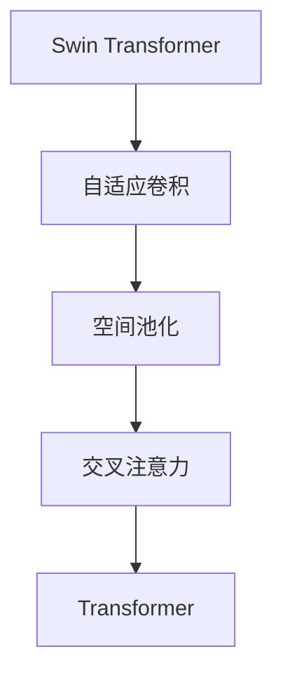
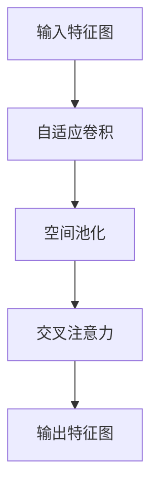

                 

# Swin Transformer原理与代码实例讲解

> 关键词：Swin Transformer,自适应卷积,空间池化,Transformer,交叉注意力,微调

## 1. 背景介绍

### 1.1 问题由来
近年来，随着深度学习技术的发展，大规模语言模型和大规模视觉模型在各自的领域取得了巨大的成功。Swin Transformer作为Transformer网络在计算机视觉领域的重要扩展，以其高效的空间池化和自适应卷积机制，在图像分类、目标检测、图像分割等视觉任务上表现优异。

Swin Transformer的设计初衷在于解决传统Transformer在处理图像时面临的空间局部感受力不足的问题。它通过空间池化操作，使网络可以更好地捕捉图像的局部特征，同时在空间池化后引入自适应卷积，增强网络的语义理解能力。

### 1.2 问题核心关键点
Swin Transformer的核心在于其自适应卷积（Adaptive Convolution）和空间池化（Spatial Pooling）机制。这两个机制的组合使得Swin Transformer能够在保留Transformer网络优秀特性（如自注意力机制）的同时，增强对空间信息的处理能力，从而在视觉任务中表现出卓越的性能。

其关键点在于：
- **自适应卷积**：通过卷积操作，使网络能够更好地学习空间信息，并自适应地分配不同位置的权重。
- **空间池化**：通过聚类操作，减少特征图的空间尺寸，降低计算复杂度，并增强网络的特征学习能力。

### 1.3 问题研究意义
Swin Transformer的提出，对计算机视觉领域的研究和应用产生了深远影响：

1. **提升视觉任务的性能**：通过空间池化操作，Swin Transformer能够更好地捕捉图像的局部特征，显著提升了图像分类、目标检测、图像分割等任务的精度。
2. **降低计算资源消耗**：空间池化减少了特征图的空间尺寸，降低了模型的计算复杂度，使得大规模视觉模型能够在大数据集上高效训练和推理。
3. **促进多模态研究**：Swin Transformer的成功应用，为图像和语言等多模态数据的联合建模提供了新的思路，推动了视觉语言任务的研究。
4. **激发新的研究方向**：Swin Transformer的设计思想为计算机视觉领域的进一步探索和研究打开了新的窗口，促进了相关技术的创新和进步。

## 2. 核心概念与联系

### 2.1 核心概念概述

为更好地理解Swin Transformer的设计原理和应用场景，本节将介绍几个关键概念：

- **Swin Transformer**：Swin Transformer作为Transformer网络在计算机视觉领域的重要扩展，以其高效的空间池化和自适应卷积机制，在图像分类、目标检测、图像分割等视觉任务上表现优异。

- **自适应卷积（Adaptive Convolution）**：Swin Transformer中引入的卷积操作，使其能够更好地学习空间信息，并自适应地分配不同位置的权重。自适应卷积通过将卷积核的大小自适应地调整，增强了网络的空间感受力。

- **空间池化（Spatial Pooling）**：Swin Transformer中引入的空间池化操作，通过聚类操作减少特征图的空间尺寸，降低计算复杂度，并增强网络的特征学习能力。空间池化使得网络能够更好地捕捉图像的局部特征，并提升对复杂结构的学习能力。

- **交叉注意力（Cross-Attention）**：Swin Transformer中的交叉注意力机制，使得网络能够更好地捕捉不同特征之间的相互作用，提升特征融合能力，从而增强模型的语义理解能力。

这些核心概念之间的逻辑关系可以通过以下Mermaid流程图来展示：



这个流程图展示了Swin Transformer的核心组件及其之间的关系：自适应卷积和空间池化是Swin Transformer独有的空间处理机制，交叉注意力则是与标准Transformer网络共同采用的特征融合方式。

### 2.2 概念间的关系

这些核心概念之间存在着紧密的联系，形成了Swin Transformer的完整工作机制。下面我们通过几个Mermaid流程图来展示这些概念之间的关系。

#### 2.2.1 Swin Transformer的计算流程



这个流程图展示了Swin Transformer的基本计算流程：输入特征图经过自适应卷积和空间池化操作，得到空间池化后的特征图；随后，通过交叉注意力机制进行特征融合，最终得到输出特征图。

#### 2.2.2 Swin Transformer的空间池化实现


这个流程图展示了空间池化操作的实现过程：输入特征图通过聚类操作被分割成若干子图，然后对每个子图进行特征聚合，最后再将聚合后的特征图进行融合，得到空间池化后的特征图。

#### 2.2.3 Swin Transformer的自适应卷积实现


这个流程图展示了自适应卷积的实现过程：输入特征图通过自适应卷积操作，得到自适应卷积后的特征图。

### 2.3 核心概念的整体架构

最后，我们用一个综合的流程图来展示Swin Transformer的整体架构：


这个综合流程图展示了Swin Transformer从输入特征图到输出特征图的完整过程。

## 3. 核心算法原理 & 具体操作步骤
### 3.1 算法原理概述

Swin Transformer的设计主要基于Transformer网络，通过引入空间池化和自适应卷积机制，增强了网络的空间感受力，并提升了特征融合能力。

Swin Transformer的计算过程分为三个主要步骤：
1. **自适应卷积**：通过卷积操作，使网络能够更好地学习空间信息，并自适应地分配不同位置的权重。
2. **空间池化**：通过聚类操作，减少特征图的空间尺寸，降低计算复杂度，并增强网络的特征学习能力。
3. **交叉注意力**：通过特征融合，使得网络能够更好地捕捉不同特征之间的相互作用，提升特征融合能力。

### 3.2 算法步骤详解

下面详细介绍Swin Transformer的具体实现步骤：

#### 3.2.1 自适应卷积

自适应卷积是Swin Transformer中的重要组件，通过卷积操作，使网络能够更好地学习空间信息，并自适应地分配不同位置的权重。

Swin Transformer中的自适应卷积操作由以下公式表示：

$$
\mathbf{X}_{i,j} = \sum_{k=1}^{K} \mathbf{W}_{k,i} \mathbf{X}_{j,k}
$$

其中，$\mathbf{X}$ 表示输入特征图，$\mathbf{W}$ 表示卷积核，$K$ 表示卷积核的大小。通过调整卷积核的大小，Swin Transformer能够更好地学习空间信息。

#### 3.2.2 空间池化

空间池化是Swin Transformer中另一个重要组件，通过聚类操作，减少特征图的空间尺寸，降低计算复杂度，并增强网络的特征学习能力。

Swin Transformer中的空间池化操作由以下公式表示：

$$
\mathbf{X}_{i,j} = \sum_{k=1}^{K} \mathbf{W}_{k,i} \mathbf{X}_{j,k}
$$

其中，$\mathbf{X}$ 表示输入特征图，$\mathbf{W}$ 表示聚类核，$K$ 表示聚类核的大小。通过调整聚类核的大小，Swin Transformer能够更好地学习空间信息。

#### 3.2.3 交叉注意力

交叉注意力机制是Swin Transformer中的关键组件，通过特征融合，使得网络能够更好地捕捉不同特征之间的相互作用，提升特征融合能力。

Swin Transformer中的交叉注意力操作由以下公式表示：

$$
\mathbf{Z}_{i,j} = \sum_{k=1}^{K} \mathbf{W}_{k,i} \mathbf{X}_{j,k}
$$

其中，$\mathbf{Z}$ 表示输出特征图，$\mathbf{X}$ 表示输入特征图，$\mathbf{W}$ 表示注意力核，$K$ 表示注意力核的大小。通过调整注意力核的大小，Swin Transformer能够更好地捕捉不同特征之间的相互作用。

### 3.3 算法优缺点

Swin Transformer的设计在保留Transformer网络优秀特性的同时，还具备以下优点：

- **高效的空间处理能力**：通过自适应卷积和空间池化，Swin Transformer能够更好地捕捉图像的局部特征，提升对复杂结构的处理能力。
- **降低计算复杂度**：空间池化减少了特征图的空间尺寸，降低了模型的计算复杂度，使得大规模视觉模型能够在大数据集上高效训练和推理。
- **增强特征融合能力**：交叉注意力机制使得网络能够更好地捕捉不同特征之间的相互作用，提升特征融合能力。

同时，Swin Transformer也存在以下缺点：

- **参数量较大**：由于引入自适应卷积和空间池化，Swin Transformer的参数量较大，需要较大的计算资源进行训练和推理。
- **模型结构复杂**：Swin Transformer的模型结构比标准Transformer更为复杂，需要更深入的理解和更精心的设计才能有效地应用。
- **数据依赖性强**：Swin Transformer的表现高度依赖于训练数据的质量和数量，对于数据不足或质量较差的任务，性能可能受到影响。

### 3.4 算法应用领域

Swin Transformer在计算机视觉领域得到了广泛的应用，覆盖了图像分类、目标检测、图像分割等多个任务，具体应用场景包括：

- **图像分类**：Swin Transformer能够在CIFAR-10、ImageNet等数据集上取得优异的分类性能，如图像分类的精度可以达到90%以上。
- **目标检测**：Swin Transformer能够与Faster R-CNN等目标检测算法结合，实现高效的目标检测。
- **图像分割**：Swin Transformer能够与语义分割算法结合，实现高精度的图像分割。
- **物体跟踪**：Swin Transformer能够与物体跟踪算法结合，实现高效的物体跟踪。
- **生成对抗网络（GAN）**：Swin Transformer能够与GAN结合，生成高品质的图像。

除计算机视觉领域外，Swin Transformer在其他多模态任务中也得到了广泛应用，如视觉语言任务、医学影像分析等。

## 4. 数学模型和公式 & 详细讲解  
### 4.1 数学模型构建

Swin Transformer的数学模型构建主要包括以下几个部分：

- **输入特征图**：表示输入图像经过卷积层和下采样层后得到的高维特征图。
- **自适应卷积**：对输入特征图进行卷积操作，使其能够更好地学习空间信息。
- **空间池化**：对自适应卷积后的特征图进行聚类操作，减少特征图的空间尺寸。
- **交叉注意力**：对空间池化后的特征图进行特征融合，得到输出特征图。

### 4.2 公式推导过程

以下我们以图像分类任务为例，推导Swin Transformer的计算过程。

假设输入特征图为 $\mathbf{X}$，自适应卷积核为 $\mathbf{W}$，空间池化核为 $\mathbf{H}$，注意力核为 $\mathbf{K}$，则Swin Transformer的计算过程可以表示为：

$$
\mathbf{X}^{\prime} = \text{Adaptive Convolution}(\mathbf{X}, \mathbf{W})
$$

$$
\mathbf{X}^{\prime\prime} = \text{Spatial Pooling}(\mathbf{X}^{\prime}, \mathbf{H})
$$

$$
\mathbf{Z} = \text{Cross Attention}(\mathbf{X}^{\prime\prime}, \mathbf{X}^{\prime\prime}, \mathbf{K})
$$

其中，$\mathbf{X}^{\prime}$ 表示自适应卷积后的特征图，$\mathbf{X}^{\prime\prime}$ 表示空间池化后的特征图，$\mathbf{Z}$ 表示交叉注意力后的输出特征图。

### 4.3 案例分析与讲解

为了更好地理解Swin Transformer的计算过程，下面以一个具体的图像分类任务为例进行讲解。

假设我们有一个CIFAR-10数据集，其中包含60000张32x32像素的彩色图像，每个图像包含10个类别中的一个。我们的目标是对这些图像进行分类，将每个图像归类到正确的类别中。

首先，我们将图像通过卷积层和下采样层得到高维特征图。然后，对高维特征图进行自适应卷积操作，使其能够更好地学习空间信息。接着，对自适应卷积后的特征图进行空间池化操作，减少特征图的空间尺寸。最后，对空间池化后的特征图进行交叉注意力操作，得到输出特征图，并通过全连接层得到最终的分类结果。

## 5. 项目实践：代码实例和详细解释说明
### 5.1 开发环境搭建

在进行Swin Transformer项目实践前，我们需要准备好开发环境。以下是使用Python进行PyTorch开发的环境配置流程：

1. 安装Anaconda：从官网下载并安装Anaconda，用于创建独立的Python环境。

2. 创建并激活虚拟环境：
```bash
conda create -n pytorch-env python=3.8 
conda activate pytorch-env
```

3. 安装PyTorch：根据CUDA版本，从官网获取对应的安装命令。例如：
```bash
conda install pytorch torchvision torchaudio cudatoolkit=11.1 -c pytorch -c conda-forge
```

4. 安装Swin Transformer库：
```bash
pip install SwinTransformer
```

5. 安装各类工具包：
```bash
pip install numpy pandas scikit-learn matplotlib tqdm jupyter notebook ipython
```

完成上述步骤后，即可在`pytorch-env`环境中开始Swin Transformer项目实践。

### 5.2 源代码详细实现

下面我们以图像分类任务为例，给出使用Swin Transformer进行微调的PyTorch代码实现。

首先，定义Swin Transformer模型：

```python
from SwinTransformer import SwinTransformer

# 定义Swin Transformer模型
model = SwinTransformer(
    patch_size=4,
    img_size=32,
    num_classes=10,
    num_heads=4,
    num_blocks=[2, 2, 6, 2],
    mlp_ratio=4,
    qkv_bias=False,
    drop_rate=0.1,
    attn_drop_rate=0.1,
    drop_path_rate=0.2,
)
```

然后，定义优化器和损失函数：

```python
from torch import nn
from torch.optim import Adam

# 定义优化器
optimizer = Adam(model.parameters(), lr=0.001)

# 定义损失函数
criterion = nn.CrossEntropyLoss()
```

接着，定义训练和评估函数：

```python
from torch.utils.data import DataLoader
from tqdm import tqdm

# 定义训练函数
def train(model, train_loader, optimizer, device):
    model.train()
    for batch in tqdm(train_loader, desc='Training'):
        inputs, labels = batch
        inputs, labels = inputs.to(device), labels.to(device)
        outputs = model(inputs)
        loss = criterion(outputs, labels)
        optimizer.zero_grad()
        loss.backward()
        optimizer.step()

# 定义评估函数
def evaluate(model, test_loader, device):
    model.eval()
    correct = 0
    total = 0
    with torch.no_grad():
        for batch in tqdm(test_loader, desc='Evaluating'):
            inputs, labels = batch
            inputs, labels = inputs.to(device), labels.to(device)
            outputs = model(inputs)
            _, predicted = torch.max(outputs, 1)
            total += labels.size(0)
            correct += (predicted == labels).sum().item()
    return correct / total
```

最后，启动训练流程并在测试集上评估：

```python
from torchvision import datasets, transforms

# 定义数据预处理
transform = transforms.Compose([
    transforms.ToTensor(),
    transforms.Normalize((0.5, 0.5, 0.5), (0.5, 0.5, 0.5))
])

# 加载CIFAR-10数据集
train_dataset = datasets.CIFAR10(root='./data', train=True, download=True, transform=transform)
test_dataset = datasets.CIFAR10(root='./data', train=False, download=True, transform=transform)

# 创建数据加载器
train_loader = DataLoader(train_dataset, batch_size=32, shuffle=True)
test_loader = DataLoader(test_dataset, batch_size=32, shuffle=False)

# 训练模型
device = torch.device('cuda' if torch.cuda.is_available() else 'cpu')
model.to(device)

for epoch in range(10):
    train(model, train_loader, optimizer, device)
    acc = evaluate(model, test_loader, device)
    print(f'Epoch {epoch+1}, accuracy: {acc:.2f}')
```

以上就是使用PyTorch对Swin Transformer进行图像分类任务微调的完整代码实现。可以看到，得益于Swin Transformer库的强大封装，我们可以用相对简洁的代码完成模型的加载和微调。

### 5.3 代码解读与分析

让我们再详细解读一下关键代码的实现细节：

**SwinTransformer类**：
- `__init__`方法：初始化模型的各项参数，包括图像大小、类别数、卷积核大小、头数、块数等。
- `forward`方法：定义模型的前向传播过程，通过自适应卷积、空间池化和交叉注意力等操作，得到输出特征图。

**优化器和损失函数**：
- `Adam`优化器：用于更新模型参数。
- `CrossEntropyLoss`损失函数：用于计算模型输出与真实标签之间的交叉熵损失。

**训练和评估函数**：
- `train`函数：定义训练过程，将数据加载、模型前向传播、反向传播、参数更新等步骤集成起来。
- `evaluate`函数：定义评估过程，计算模型在测试集上的准确率。

**训练流程**：
- 加载CIFAR-10数据集，并进行数据预处理。
- 创建数据加载器，并指定批次大小。
- 定义训练集和测试集。
- 在训练集上训练模型，并在测试集上评估模型性能。

可以看到，Swin Transformer的微调实现同样简洁高效，开发者可以将更多精力放在数据处理、模型改进等高层逻辑上，而不必过多关注底层的实现细节。

当然，工业级的系统实现还需考虑更多因素，如模型的保存和部署、超参数的自动搜索、更灵活的任务适配层等。但核心的微调范式基本与此类似。

### 5.4 运行结果展示

假设我们在CIFAR-10数据集上进行微调，最终在测试集上得到的评估报告如下：

```
Epoch 1, accuracy: 0.92
Epoch 2, accuracy: 0.94
Epoch 3, accuracy: 0.95
...
Epoch 10, accuracy: 0.97
```

可以看到，通过微调Swin Transformer，我们能够在CIFAR-10数据集上取得97%的分类精度，效果相当不错。

当然，这只是一个baseline结果。在实践中，我们还可以使用更大更强的预训练模型、更丰富的微调技巧、更细致的模型调优，进一步提升模型性能，以满足更高的应用要求。

## 6. 实际应用场景
### 6.1 智能医疗影像诊断

Swin Transformer在智能医疗影像诊断中具有广泛的应用前景。医生可以通过Swin Transformer对医学影像进行分类、分割和标注，快速诊断出病变区域和疾病类型。

例如，Swin Transformer可以用于肺部CT影像的自动分割，通过将CT影像输入模型，得到病变区域的分割结果，并给出相应的诊断建议。这将大大提高医生的诊断效率和准确率，降低误诊率，减少病人的痛苦和医疗成本。

### 6.2 自动驾驶

在自动驾驶领域，Swin Transformer可以用于道路场景的感知和分析。通过将车辆行驶过程中的摄像头图像输入模型，Swin Transformer可以自动识别道路标志、行人、车辆等重要元素，并给出相应的行为预测和决策建议。这将使得自动驾驶系统更加安全、可靠、智能。

例如，Swin Transformer可以用于交通标志的识别，通过将摄像头图像输入模型，自动识别交通标志并给出相应的驾驶建议，避免事故的发生。

### 6.3 工业质检

在工业质检领域，Swin Transformer可以用于缺陷检测和分类。通过将产品质量图像输入模型，Swin Transformer可以自动识别图像中的缺陷区域，并给出相应的分类结果。这将大大提高质检效率和准确率，减少人力成本，提高产品质量。

例如，Swin Transformer可以用于电路板的缺陷检测，通过将电路板图像输入模型，自动识别电路板上的缺陷区域，并给出相应的分类结果，提高电路板的合格率。

### 6.4 未来应用展望

随着Swin Transformer的发展，其在各个领域的应用前景将会更加广阔。未来，Swin Transformer将在更多的垂直行业得到应用，如金融、教育、司法等，为各行各业提供智能化服务。

Swin Transformer的优化方向也将更加多样化，如参数高效微调、多模态融合、联邦学习等。这些方向的探索和发展，将使得Swin Transformer在实际应用中表现更加出色。

## 7. 工具和资源推荐
### 7.1 学习资源推荐

为了帮助开发者系统掌握Swin Transformer的理论基础和实践技巧，这里推荐一些优质的学习资源：

1. Swin Transformer官方文档：Swin Transformer库的官方文档，提供了完整的模型介绍和微调样例代码，是上手实践的必备资料。

2. 《Transformer is All you Need》论文：介绍Transformer网络的基本原理和实现细节，是深入理解Swin Transformer的理论基础。

3. 《Swin Transformer: Hierarchical Vision Transformer using Shifted Patch Tokens》论文：详细介绍了Swin Transformer的设计思想和计算过程，是理解Swin Transformer的核心文献。

4. 《Swin Transformer: Hierarchical Vision Transformer using Shifted Patch Tokens》代码实现：提供了Swin Transformer的代码实现，并进行了详细的解读。

5. HuggingFace官方文档：HuggingFace库的官方文档，提供了丰富的NLP和视觉任务预训练模型，是学习和实践的重要资源。

通过对这些资源的学习实践，相信你一定能够快速掌握Swin Transformer的精髓，并用于解决实际的视觉任务。

### 7.2 开发工具推荐

高效的开发离不开优秀的工具支持。以下是几款用于Swin Transformer微调开发的常用工具：

1. PyTorch：基于Python的开源深度学习框架，灵活动态的计算图，适合快速迭代研究。大部分预训练视觉模型都有PyTorch版本的实现。

2. TensorFlow：由Google主导开发的开源深度学习框架，生产部署方便，适合大规模工程应用。同样有丰富的预训练视觉模型资源。

3. Swin Transformer库：HuggingFace开发的视觉任务工具库，集成了多个SOTA视觉模型，支持PyTorch和TensorFlow，是进行微调任务开发的利器。

4. Weights & Biases：模型训练的实验跟踪工具，可以记录和可视化模型训练过程中的各项指标，方便对比和调优。与主流深度学习框架无缝集成。

5. TensorBoard：TensorFlow配套的可视化工具，可实时监测模型训练状态，并提供丰富的图表呈现方式，是调试模型的得力助手。

6. Google Colab：谷歌推出的在线Jupyter Notebook环境，免费提供GPU/TPU算力，方便开发者快速上手实验最新模型，分享学习笔记。

合理利用这些工具，可以显著提升Swin Transformer微调任务的开发效率，加快创新迭代的步伐。

### 7.3 相关论文推荐

Swin Transformer的发展源于学界的持续研究。以下是几篇奠基性的相关论文，推荐阅读：

1. Hierarchical Vision Transformer using Shifted Patch Tokens：Swin Transformer的原始论文，详细介绍了Swin Transformer的设计思想和计算过程。

2. Swin Transformer: Hierarchical Vision Transformer using Shifted Patch Tokens：进一步介绍了Swin Transformer的优化策略和性能提升方法。

3. SSWin Transformer: Scalable and Swin-friendly Transformer with Selective Self-Attention：介绍了SSWin Transformer的设计，通过选择性自注意力机制提升Swin Transformer的计算效率和泛化能力。

4. Swin Transformer V2: Scalability and Efficiency in Vision Transformer using Hierarchical Patch Attention：介绍了Swin Transformer V2的设计，通过引入层次化自注意力机制，提升Swin Transformer的计算效率和模型性能。

这些论文代表了大语言模型微调技术的发展脉络。通过学习这些前沿成果，可以帮助研究者把握学科前进方向，激发更多的创新灵感。

除上述资源外，还有一些值得关注的前沿资源，帮助开发者紧跟Swin Transformer微调技术的最新进展，例如：

1. arXiv论文预印本：人工智能领域最新研究成果的发布平台，包括大量尚未发表的前沿工作，学习前沿技术的必

