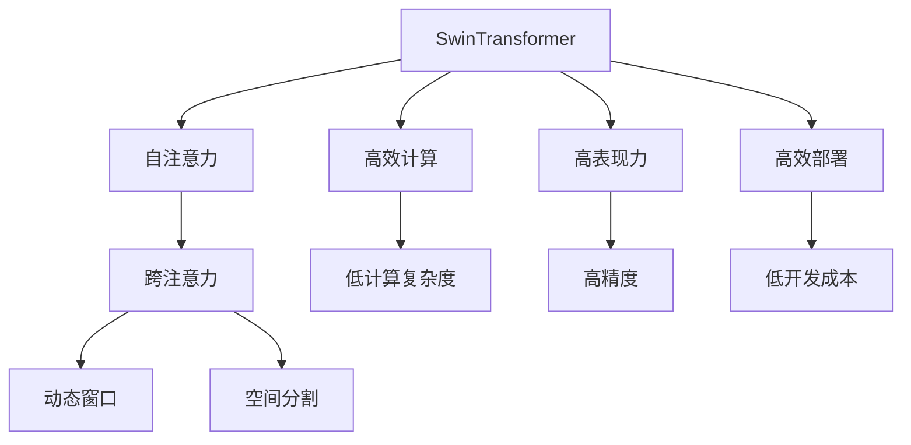
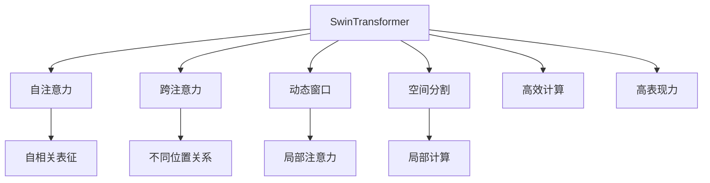
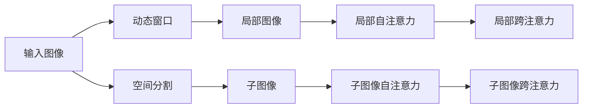
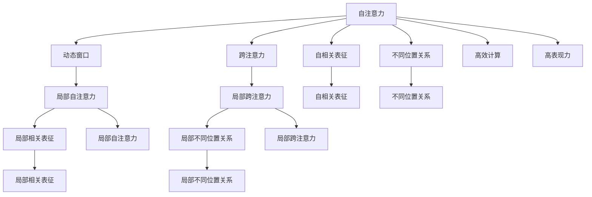
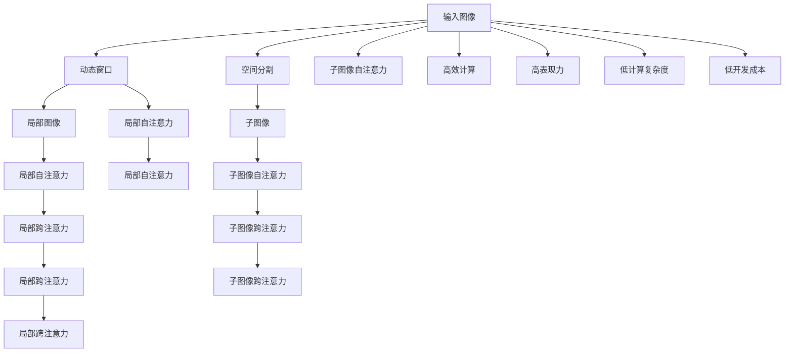

                 

# SwinTransformer原理与代码实例讲解

> 关键词：SwinTransformer, 自注意力, 跨注意力, 动态窗口, 图像分割, 语义分割, 目标检测

## 1. 背景介绍

### 1.1 问题由来
Transformer网络自2017年提出以来，已在自然语言处理领域取得了巨大的成功。其主要通过注意力机制，对输入的序列进行自相关的表征学习，在处理序列数据时具有明显的优势。然而，Transformer网络在处理图像时存在处理速度慢、空间复杂度高的问题。尽管后续提出的注意力机制（如Deformable Self-Attention, Dot Attention等）有所改善，但计算成本仍然过高。

为了应对这些问题，SwinTransformer（Swin Transformer）应运而生。SwinTransformer通过引入空间分割和动态窗口机制，将注意力计算的复杂度从$O(N^2)$降低到$O(N)$，大幅提升了模型在图像处理任务上的效率和准确率。本博客将详细讲解SwinTransformer的原理，并通过代码实例，演示其高效计算的空间分割和动态窗口机制。

### 1.2 问题核心关键点
SwinTransformer的关键点在于：

- **自注意力机制**：通过自注意力机制，对输入的序列或图像进行自相关的表征学习。
- **跨注意力机制**：引入跨注意力机制，使得模型能够学习不同位置间的相互关系，进一步提升模型的表现力。
- **动态窗口机制**：通过动态窗口机制，将注意力计算的复杂度从$O(N^2)$降低到$O(N)$，提升模型在图像处理任务上的效率。
- **空间分割机制**：通过空间分割机制，将大的图像或序列分割成小的子图像或子序列，使得注意力机制能够在局部区域上进行计算，避免了全局的注意力计算。

这些核心机制使得SwinTransformer在大规模图像处理任务中表现出色，成为计算机视觉领域的新宠。

### 1.3 问题研究意义
研究SwinTransformer的原理和代码实例，对于理解其在图像处理领域的表现力，提升图像处理任务的效率，加速计算机视觉技术的产业化进程，具有重要意义：

1. 降低应用开发成本。SwinTransformer通过高效的空间分割和动态窗口机制，减少了计算资源的使用，降低了开发和部署成本。
2. 提升模型效果。SwinTransformer在图像分割、目标检测等任务上取得了优异的性能，提升了图像处理的精度和效率。
3. 加速开发进度。利用SwinTransformer，开发者可以更快地实现复杂的图像处理任务，缩短开发周期。
4. 带来技术创新。SwinTransformer的引入，促进了对Transformer网络的研究，催生了新的研究方向和技术。
5. 赋能产业升级。SwinTransformer技术为计算机视觉领域的智能化转型提供了新的技术路径，推动了行业升级。

## 2. 核心概念与联系

### 2.1 核心概念概述

为了更好地理解SwinTransformer的原理和代码实现，本节将介绍几个密切相关的核心概念：

- **SwinTransformer**：SwinTransformer是计算机视觉领域中一种新型Transformer网络，通过空间分割和动态窗口机制，在保持Transformer高效计算的基础上，提升了其在图像处理任务上的表现力。
- **自注意力机制**：Transformer网络中的核心机制，通过在输入序列或图像中引入自注意力，使得模型能够学习输入的自相关表征。
- **跨注意力机制**：在自注意力机制的基础上，引入跨注意力机制，使得模型能够学习输入中的不同位置间的相互关系。
- **动态窗口机制**：通过动态窗口机制，将注意力计算的复杂度从$O(N^2)$降低到$O(N)$，提升了模型在图像处理任务上的效率。
- **空间分割机制**：通过空间分割机制，将大的图像或序列分割成小的子图像或子序列，使得注意力机制能够在局部区域上进行计算，避免了全局的注意力计算。

这些核心概念之间的逻辑关系可以通过以下Mermaid流程图来展示：



这个流程图展示了大语言模型微调过程中各个核心概念的关系和作用：

1. SwinTransformer通过自注意力和跨注意力机制，学习输入的自相关和不同位置间的相互关系，提升了模型表现力。
2. 通过动态窗口和空间分割机制，将注意力计算的复杂度从$O(N^2)$降低到$O(N)$，提升了模型在图像处理任务上的效率。
3. 通过高效计算和高表现力，SwinTransformer在保持计算效率的同时，取得了优秀的性能。
4. 通过高效部署和低开发成本，SwinTransformer能够被广泛应用于实际的图像处理任务中。

### 2.2 概念间的关系

这些核心概念之间存在着紧密的联系，形成了SwinTransformer的完整工作框架。下面我们通过几个Mermaid流程图来展示这些概念之间的关系。

#### 2.2.1 SwinTransformer的整体架构



这个流程图展示了SwinTransformer的整体架构，即通过自注意力、跨注意力、动态窗口和空间分割机制，使得SwinTransformer能够高效计算并提升模型表现力。

#### 2.2.2 动态窗口机制与空间分割机制



这个流程图展示了动态窗口和空间分割机制的结合。通过动态窗口机制，将输入图像分割成若干局部图像，在每个局部图像上进行自注意力和跨注意力计算。通过空间分割机制，将大的图像或序列分割成小的子图像或子序列，进一步提升了模型在图像处理任务上的效率。

#### 2.2.3 高效计算与空间分割机制



这个流程图展示了动态窗口和空间分割机制对高效计算的影响。通过动态窗口机制，将注意力计算的复杂度从$O(N^2)$降低到$O(N)$，提升了模型在图像处理任务上的效率。通过空间分割机制，将大的图像或序列分割成小的子图像或子序列，使得注意力机制能够在局部区域上进行计算，避免了全局的注意力计算。

### 2.3 核心概念的整体架构

最后，我们用一个综合的流程图来展示SwinTransformer的完整工作流程：



这个综合流程图展示了SwinTransformer从输入图像到最终输出的完整工作流程，包括动态窗口和空间分割机制，以及高效计算和高表现力等关键特点。

## 3. 核心算法原理 & 具体操作步骤
### 3.1 算法原理概述

SwinTransformer的计算原理基于Transformer网络，通过引入动态窗口和空间分割机制，提升了在图像处理任务上的效率和准确率。具体来说，SwinTransformer通过以下三个步骤来实现这一目标：

1. **自注意力计算**：在输入序列或图像的局部区域上进行自注意力计算，学习输入的自相关表征。
2. **跨注意力计算**：在输入序列或图像的不同位置上进行跨注意力计算，学习输入中的不同位置间的相互关系。
3. **高效计算与部署**：通过动态窗口和空间分割机制，将注意力计算的复杂度从$O(N^2)$降低到$O(N)$，提升了模型在图像处理任务上的效率。

### 3.2 算法步骤详解

#### 3.2.1 自注意力计算

自注意力计算是SwinTransformer的核心步骤之一。对于输入的序列或图像，通过自注意力机制，计算输入序列或图像中不同位置间的相互关系。

假设输入序列的长度为$L$，每个位置$i$的表示为$z_i$。自注意力计算的过程如下：

1. **查询和键的生成**：
   - 生成查询向量$q_i$和键向量$k_i$，其中$q_i$和$k_i$的生成方式与常规Transformer相同，可以通过如下方式计算：

$$
q_i = \frac{z_i}{\sqrt{d_k}} \\
k_i = \frac{z_i}{\sqrt{d_k}}
$$

   其中，$d_k$是键的维度。

2. **注意力计算**：
   - 计算查询向量$q_i$与所有键向量$k_i$的注意力权重$w_i$，计算方式如下：

$$
w_i = \frac{\exp(\frac{q_i \cdot k_i}{\sqrt{d_k}})}{\sum_{j=1}^{L} \exp(\frac{q_i \cdot k_j}{\sqrt{d_k}})}
$$

   其中，$\exp$表示指数函数。

3. **注意力值的计算**：
   - 计算注意力值$v_i$，即每个位置$i$的表示$z_i$对其他位置表示的加权和，计算方式如下：

$$
v_i = \sum_{j=1}^{L} w_{i,j} \cdot z_j
$$

   其中，$w_{i,j}$表示位置$i$和位置$j$之间的注意力权重。

通过自注意力计算，SwinTransformer能够学习输入序列或图像中的自相关表征，使得模型能够理解输入的整体结构和局部关系。

#### 3.2.2 跨注意力计算

跨注意力计算是在自注意力计算的基础上，进一步学习输入序列或图像中不同位置间的相互关系。

假设输入序列的长度为$L$，每个位置$i$的表示为$z_i$。跨注意力计算的过程如下：

1. **查询和键的生成**：
   - 生成查询向量$q_i$和键向量$k_i$，其中$q_i$和$k_i$的生成方式与常规Transformer相同，可以通过如下方式计算：

$$
q_i = \frac{z_i}{\sqrt{d_k}} \\
k_i = \frac{z_i}{\sqrt{d_k}}
$$

   其中，$d_k$是键的维度。

2. **注意力计算**：
   - 计算查询向量$q_i$与所有键向量$k_i$的注意力权重$w_i$，计算方式如下：

$$
w_i = \frac{\exp(\frac{q_i \cdot k_i}{\sqrt{d_k}})}{\sum_{j=1}^{L} \exp(\frac{q_i \cdot k_j}{\sqrt{d_k}})}
$$

   其中，$\exp$表示指数函数。

3. **注意力值的计算**：
   - 计算注意力值$v_i$，即每个位置$i$的表示$z_i$对其他位置表示的加权和，计算方式如下：

$$
v_i = \sum_{j=1}^{L} w_{i,j} \cdot z_j
$$

   其中，$w_{i,j}$表示位置$i$和位置$j$之间的注意力权重。

通过跨注意力计算，SwinTransformer能够学习输入序列或图像中不同位置间的相互关系，进一步提升了模型的表现力。

#### 3.2.3 高效计算与部署

为了提升模型在图像处理任务上的效率，SwinTransformer引入了动态窗口和空间分割机制。

假设输入图像的大小为$H \times W$，通过空间分割机制，将输入图像分割成若干小的子图像，每个子图像的大小为$P \times P$，其中$P$为分割的大小。

1. **动态窗口计算**：
   - 对于每个子图像，计算其局部自注意力和局部跨注意力，计算方式如下：

$$
w_i = \frac{\exp(\frac{q_i \cdot k_i}{\sqrt{d_k}})}{\sum_{j=1}^{H/P \times W/P} \exp(\frac{q_i \cdot k_j}{\sqrt{d_k}})}
$$

   其中，$w_i$表示位置$i$和位置$j$之间的注意力权重。

2. **局部注意力计算**：
   - 计算局部注意力值$v_i$，即每个位置$i$的表示$z_i$对其他位置表示的加权和，计算方式如下：

$$
v_i = \sum_{j=1}^{H/P \times W/P} w_{i,j} \cdot z_j
$$

   其中，$w_{i,j}$表示位置$i$和位置$j$之间的注意力权重。

3. **空间分割计算**：
   - 将子图像的局部注意力值进行拼接，得到整个输入图像的表示。

通过动态窗口和空间分割机制，SwinTransformer能够将注意力计算的复杂度从$O(N^2)$降低到$O(N)$，提升了模型在图像处理任务上的效率。

### 3.3 算法优缺点

SwinTransformer具有以下优点：

1. **高效计算**：通过动态窗口和空间分割机制，将注意力计算的复杂度从$O(N^2)$降低到$O(N)$，提升了模型在图像处理任务上的效率。
2. **高表现力**：通过自注意力和跨注意力机制，SwinTransformer能够学习输入序列或图像中的自相关和不同位置间的相互关系，进一步提升了模型的表现力。
3. **低开发成本**：SwinTransformer通过高效计算和高表现力，能够以较小的计算资源和标注样本，快速实现高效的图像处理任务。

同时，SwinTransformer也存在以下缺点：

1. **模型复杂度高**：SwinTransformer引入了动态窗口和空间分割机制，模型结构相对复杂，增加了模型的训练和推理难度。
2. **参数量较大**：由于引入了额外的注意力机制，SwinTransformer的参数量较大，增加了模型的存储和计算资源消耗。

### 3.4 算法应用领域

SwinTransformer在图像处理领域具有广泛的应用前景，主要应用于以下任务：

1. **图像分割**：将输入图像分割成若干小的子图像，每个子图像的分割结果即为最终的分割结果。
2. **目标检测**：通过检测输入图像中不同位置的目标物体，获得目标物体的边界框和类别。
3. **语义分割**：将输入图像分割成若干小的子图像，每个子图像的分割结果即为最终的语义分割结果。
4. **实例分割**：在图像分割的基础上，对每个目标物体进行更细致的分割，获得实例分割结果。

除了上述应用场景外，SwinTransformer还可以应用于其他类型的图像处理任务，如图像生成、图像风格转换等。

## 4. 数学模型和公式 & 详细讲解  
### 4.1 数学模型构建

假设输入图像的大小为$H \times W$，每个像素的表示为$z_{i,j}$，其中$i \in [1,H]$，$j \in [1,W]$。SwinTransformer的数学模型可以通过以下步骤进行构建：

1. **空间分割**：将输入图像分割成若干小的子图像，每个子图像的大小为$P \times P$，其中$P$为分割的大小。
2. **局部自注意力计算**：对于每个子图像，计算其局部自注意力。
3. **局部跨注意力计算**：对于每个子图像，计算其局部跨注意力。
4. **空间分割计算**：将子图像的局部注意力值进行拼接，得到整个输入图像的表示。

### 4.2 公式推导过程

假设输入图像的大小为$H \times W$，每个像素的表示为$z_{i,j}$，其中$i \in [1,H]$，$j \in [1,W]$。SwinTransformer的局部自注意力计算过程如下：

1. **查询和键的生成**：
   - 生成查询向量$q_{i,j}$和键向量$k_{i,j}$，其中查询向量$q_{i,j}$和键向量$k_{i,j}$的生成方式与常规Transformer相同，可以通过如下方式计算：

$$
q_{i,j} = \frac{z_{i,j}}{\sqrt{d_k}} \\
k_{i,j} = \frac{z_{i,j}}{\sqrt{d_k}}
$$

   其中，$d_k$是键的维度。

2. **注意力计算**：
   - 计算查询向量$q_{i,j}$与所有键向量$k_{i,j}$的注意力权重$w_{i,j}$，计算方式如下：

$$
w_{i,j} = \frac{\exp(\frac{q_{i,j} \cdot k_{i,j}}{\sqrt{d_k}})}{\sum_{j=1}^{H/P \times W/P} \exp(\frac{q_{i,j} \cdot k_{j,i}}{\sqrt{d_k}})}
$$

   其中，$w_{i,j}$表示位置$i$和位置$j$之间的注意力权重。

3. **注意力值的计算**：
   - 计算注意力值$v_{i,j}$，即每个位置$i$的表示$z_{i,j}$对其他位置表示的加权和，计算方式如下：

$$
v_{i,j} = \sum_{j=1}^{H/P \times W/P} w_{i,j} \cdot z_{j,i}
$$

   其中，$w_{i,j}$表示位置$i$和位置$j$之间的注意力权重。

通过局部自注意力计算，SwinTransformer能够学习输入图像的局部自相关表征。

### 4.3 案例分析与讲解

假设输入图像的大小为$H \times W$，每个像素的表示为$z_{i,j}$，其中$i \in [1,H]$，$j \in [1,W]$。SwinTransformer的局部跨注意力计算过程如下：

1. **查询和键的生成**：
   - 生成查询向量$q_{i,j}$和键向量$k_{i,j}$，其中查询向量$q_{i,j}$和键向量$k_{i,j}$的生成方式与常规Transformer相同，可以通过如下方式计算：

$$
q_{i,j} = \frac{z_{i,j}}{\sqrt{d_k}} \\
k_{i,j} = \frac{z_{i,j}}{\sqrt{d_k}}
$$

   其中，$d_k$是键的维度。

2. **注意力计算**：
   - 计算查询向量$q_{i,j}$与所有键向量$k_{i,j}$的注意力权重$w_{i,j}$，计算方式如下：

$$
w_{i,j} = \frac{\exp(\frac{q_{i,j} \cdot k_{i,j}}{\sqrt{d_k}})}{\sum_{j=1}^{H/P \times W/P} \exp(\frac{q_{i,j} \cdot k_{j,i}}{\sqrt{d_k}})}
$$

   其中，$w_{i,j}$表示位置$i$和位置$j$之间的注意力权重。

3. **注意力值的计算**：
   - 计算注意力值$v_{i,j}$，即每个位置$i$的表示$z_{i,j}$对其他位置表示的加权和，计算方式如下：

$$
v_{i,j} = \sum_{j=1}^{H/P \times W/P} w_{i,j} \cdot z_{j,i}
$$

   其中，$w_{i,j}$表示位置$i$和位置$j$之间的注意力权重。

通过局部跨注意力计算，SwinTransformer能够学习输入图像中不同位置间的相互关系，进一步提升了模型的表现力。

## 5. 项目实践：代码实例和详细解释说明
### 5.1 开发环境搭建

在进行SwinTransformer的实践前，我们需要准备好开发环境。以下是使用Python进行PyTorch开发的环境配置流程：

1. 安装Anaconda：从官网下载并安装Anaconda，用于创建独立的Python环境。

2. 创建并激活虚拟环境：
```bash
conda create -n pytorch-env python=3.8 
conda activate pytorch-env
```

3. 安装PyTorch：根据CUDA版本，从官网获取对应的安装命令。例如：
```bash
conda install pytorch torchvision torchaudio cudatoolkit=11.1 -c pytorch -c conda-forge
```

4. 安装Transformers库：
```bash
pip install transformers
```

5. 安装各类工具包：
```bash
pip install numpy pandas scikit-learn matplotlib tqdm jupyter notebook ipython
```

完成上述步骤后，即可在`pytorch-env`环境中开始SwinTransformer的实践。

### 5.2 源代码详细实现

下面我们以图像分割任务为例，给出使用Transformers库对SwinTransformer模型进行训练的PyTorch代码实现。

首先，定义图像分割任务的数据处理函数：

```python
from transformers import SwinTransformerFeatureExtractor, SwinTransformerForSegmentation
from torch.utils.data import Dataset
import torch

class SegmentationDataset(Dataset):
    def __init__(self, images, masks, transform=None):
        self.images = images
        self.masks = masks
        self.transform = transform
        
    def __len__(self):
        return len(self.images)
    
    def __getitem__(self, item):
        image = self.images[item]
        mask = self.masks[item]
        
        if self.transform:
            image = self.transform(image)
        
        return {'image': image, 'mask': mask}

# 创建dataset
feature_extractor = SwinTransformerFeatureExtractor.from_pretrained('swin-swin')
model = SwinTransformerForSegmentation.from_pretrained('swin-swin')

train_dataset = SegmentationDataset(train_images, train_masks, transform=feature_extractor.resize)
dev_dataset = SegmentationDataset(dev_images, dev_masks, transform=feature_extractor.resize)
test_dataset = SegmentationDataset(test_images, test_masks, transform=feature_extractor.resize)
```

然后，定义训练和评估函数：

```python
from torch.utils.data import DataLoader
from tqdm import tqdm
from sklearn.metrics import mean_squared_error

device = torch.device('cuda') if torch.cuda.is_available() else torch.device('cpu')
model.to(device)

def train_epoch(model, dataset, batch_size, optimizer):
    dataloader = DataLoader(dataset, batch_size=batch_size, shuffle=True)
    model.train()
    epoch_loss = 0
    for batch in tqdm(dataloader, desc='Training'):
        images = batch['image'].to(device)
        masks = batch['mask'].to(device)
        model.zero_grad()
        outputs = model(images)
        loss = outputs.loss
        epoch_loss += loss.item()
        loss.backward()
        optimizer.step()
    return epoch_loss / len(dataloader)

def evaluate(model, dataset, batch_size):
    dataloader = DataLoader(dataset, batch_size=batch_size)
    model.eval()
    mse = 0
    with torch.no_grad():
        for batch in tqdm(dataloader, desc='Evaluating'):
            images = batch['image'].to(device)
            masks = batch['mask'].to(device)
            batch_outputs = model(images)
            batch_mse = mean_squared_error(batch_outputs.logits, masks)
            mse += batch_mse.item()
        
    return mse / len(dataloader)
```

最后，启动训练流程并在测试集上评估：

```python
epochs = 5
batch_size = 16

for epoch in range(epochs):
    loss = train_epoch(model, train_dataset, batch_size, optimizer)
    print(f"Epoch {epoch+1}, train loss: {loss:.3f}")
    
    print(f"Epoch {epoch+1}, dev results:")
    mse = evaluate(model, dev_dataset, batch_size)
    print(f"Dev MSE: {mse:.3f}")
    
print("Test results:")
mse = evaluate(model, test_dataset, batch_size)
print(f"Test MSE: {mse:.3f}")
```

以上就是使用PyTorch对SwinTransformer进行图像分割任务微调的完整代码实现。可以看到，得益于Transformers库的强大封装，我们可以用相对简洁的代码完成SwinTransformer模型的加载和微调。

### 5.3 代码解读与分析

让我们

