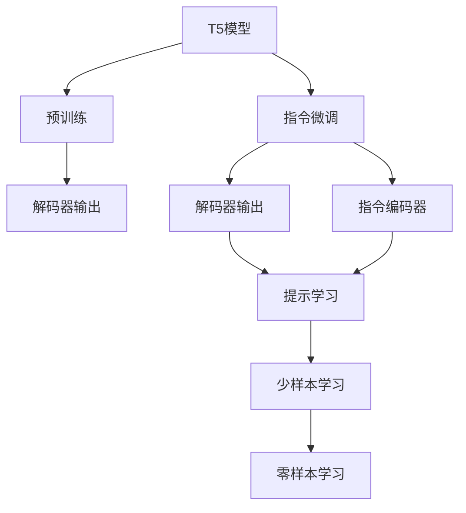
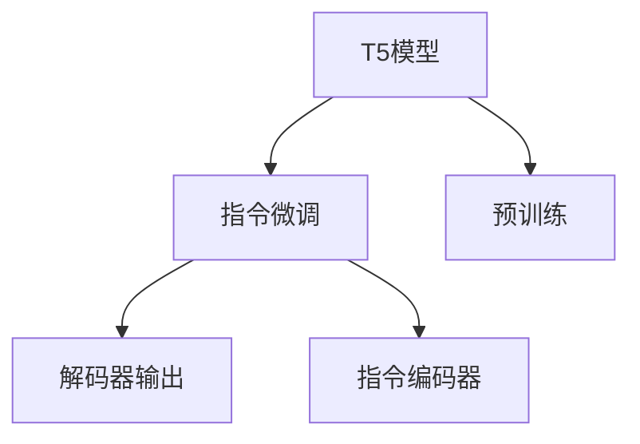
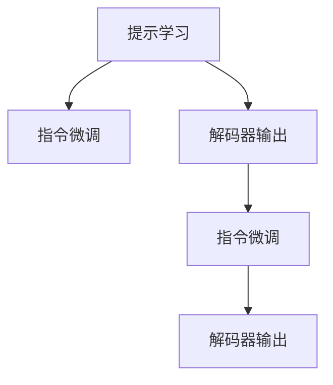

                 

# T5原理与代码实例讲解

## 1. 背景介绍

### 1.1 问题由来
T5（Transformer for Instruction Tuning）是由Google提出的一种先进的预训练模型，它通过指令微调的方式，使得大语言模型能够执行各种自然语言处理（NLP）任务，从文本生成、文本分类到机器翻译，均能以统一的框架和模型进行处理。T5模型以其高度的可定制性和灵活性，成为了近年来NLP领域的热门研究方向。

### 1.2 问题核心关键点
T5模型的核心思想是将大语言模型看作是通用语言理解器，通过在自然语言指令（指令序列）的引导下，进行微调，从而能够高效地执行多种NLP任务。其关键点包括：

- 预训练与微调：T5模型首先在大规模无标签文本数据上进行预训练，然后通过指令微调在特定任务上进行微调，以达到任务适配的效果。
- 指令编码：T5模型通过指令编码器将自然语言指令转换成模型可以理解的形式，作为模型的输入。
- 解码器输出：微调后的模型根据指令编码器提供的输入，生成对应的输出。

T5模型的成功之处在于，它简化了NLP任务的微调过程，使得大语言模型能够更加高效地应用于各种实际场景，极大地降低了开发成本，提高了任务的执行效率。

### 1.3 问题研究意义
研究T5模型及其微调方法，对于拓展大语言模型的应用范围，提升NLP任务的性能，加速NLP技术的产业化进程，具有重要意义：

1. 降低应用开发成本：T5模型通过统一的接口和框架，使得开发者可以快速地在不同的任务上应用已有的模型，避免了从头开发所需的巨大成本。
2. 提升模型效果：通过微调，T5模型能够更好地适应特定任务，在应用场景中取得更优表现。
3. 加速开发进度：standing on the shoulders of giants，T5模型可以更快地完成任务适配，缩短开发周期。
4. 技术创新：T5模型及其微调方法催生了提示学习、少样本学习等新的研究方向，进一步推动了NLP技术的发展。
5. 赋能产业升级：T5模型使得NLP技术更容易被各行各业所采用，为传统行业数字化转型升级提供新的技术路径。

## 2. 核心概念与联系

### 2.1 核心概念概述

为更好地理解T5模型的微调方法，本节将介绍几个密切相关的核心概念：

- T5模型：基于Transformer架构的预训练语言模型，能够处理各种NLP任务。
- 指令微调：在T5模型的基础上，通过自然语言指令的引导，对模型进行微调，使其能够执行指定的NLP任务。
- 解码器输出：微调后的模型根据指令编码器提供的输入，生成对应的输出。
- 指令编码器：将自然语言指令转换成模型可以理解的形式，作为模型的输入。
- 预训练与微调：T5模型首先在大规模无标签文本数据上进行预训练，然后通过指令微调在特定任务上进行微调。
- 提示学习：通过在输入文本中添加提示模板（Prompt Template），引导T5模型按期望方式输出，减少微调参数。

这些核心概念之间的逻辑关系可以通过以下Mermaid流程图来展示：



这个流程图展示出T5模型的核心概念及其之间的联系：

1. T5模型通过预训练获得基础能力。
2. 微调是通过自然语言指令的引导，对模型进行任务的适配。
3. 解码器输出是根据指令编码器提供的输入，生成对应的输出。
4. 指令编码器将自然语言指令转换成模型可以理解的形式。
5. 预训练和微调是T5模型的两个关键步骤。
6. 提示学习可以在不更新模型参数的情况下，实现零样本或少样本学习。

### 2.2 概念间的关系

这些核心概念之间存在着紧密的联系，形成了T5模型的微调完整生态系统。下面我们通过几个Mermaid流程图来展示这些概念之间的关系。

#### 2.2.1 T5模型的学习范式



这个流程图展示了T5模型的学习范式：T5模型首先在大规模无标签文本数据上进行预训练，然后通过指令微调在特定任务上进行微调。

#### 2.2.2 指令微调与解码器输出之间的关系


这个流程图展示了指令微调和解码器输出之间的关系：指令微调通过自然语言指令的引导，使得T5模型能够根据指令编码器提供的输入，生成对应的输出。

#### 2.2.3 提示学习与指令微调的关系



这个流程图展示了提示学习与指令微调的关系：提示学习可以在不更新模型参数的情况下，通过在输入文本中添加提示模板，引导T5模型按期望方式输出。

## 3. 核心算法原理 & 具体操作步骤

### 3.1 算法原理概述

T5模型的指令微调过程，本质上是一个有监督的细粒度迁移学习过程。其核心思想是：将T5模型视作一个强大的"语言理解器"，通过自然语言指令的引导，进行微调，使其能够执行特定的NLP任务。

形式化地，假设T5模型为 $M_{\theta}$，其中 $\theta$ 为预训练得到的模型参数。给定一个自然语言指令 $I$ 和对应的输出 $Y$，指令微调的目标是找到新的模型参数 $\hat{\theta}$，使得 $M_{\hat{\theta}}(I) = Y$。

在实践中，我们通常使用基于梯度的优化算法（如Adam、SGD等）来近似求解上述最优化问题。设 $\eta$ 为学习率，则参数的更新公式为：

$$
\theta \leftarrow \theta - \eta \nabla_{\theta}\mathcal{L}(\theta) - \eta\lambda\theta
$$

其中 $\nabla_{\theta}\mathcal{L}(\theta)$ 为损失函数对参数 $\theta$ 的梯度，可通过反向传播算法高效计算。

### 3.2 算法步骤详解

T5模型的指令微调一般包括以下几个关键步骤：

**Step 1: 准备预训练模型和数据集**
- 选择合适的预训练语言模型 $M_{\theta}$ 作为初始化参数，如T5-base。
- 准备自然语言指令对应的输出样本，包括训练集、验证集和测试集。

**Step 2: 添加任务适配层**
- 根据任务类型，在T5模型顶层设计合适的输出层和损失函数。
- 对于分类任务，通常在顶层添加线性分类器和交叉熵损失函数。
- 对于生成任务，通常使用语言模型的解码器输出概率分布，并以负对数似然为损失函数。

**Step 3: 设置微调超参数**
- 选择合适的优化算法及其参数，如 Adam、SGD等，设置学习率、批大小、迭代轮数等。
- 设置正则化技术及强度，包括权重衰减、Dropout、Early Stopping等。
- 确定冻结预训练参数的策略，如仅微调顶层，或全部参数都参与微调。

**Step 4: 执行梯度训练**
- 将训练集数据分批次输入模型，前向传播计算损失函数。
- 反向传播计算参数梯度，根据设定的优化算法和学习率更新模型参数。
- 周期性在验证集上评估模型性能，根据性能指标决定是否触发 Early Stopping。
- 重复上述步骤直到满足预设的迭代轮数或 Early Stopping 条件。

**Step 5: 测试和部署**
- 在测试集上评估微调后模型 $M_{\hat{\theta}}$ 的性能，对比微调前后的精度提升。
- 使用微调后的模型对新样本进行推理预测，集成到实际的应用系统中。
- 持续收集新的数据，定期重新微调模型，以适应数据分布的变化。

以上是T5模型指令微调的一般流程。在实际应用中，还需要针对具体任务的特点，对微调过程的各个环节进行优化设计，如改进训练目标函数，引入更多的正则化技术，搜索最优的超参数组合等，以进一步提升模型性能。

### 3.3 算法优缺点

T5模型的指令微调方法具有以下优点：

1. 简单高效。只需准备少量自然语言指令和对应的输出样本，即可对预训练模型进行快速适配，获得较大的性能提升。
2. 通用适用。适用于各种NLP下游任务，包括分类、匹配、生成等，设计简单的任务适配层即可实现微调。
3. 参数高效。利用参数高效微调技术，在固定大部分预训练参数的情况下，仍可取得不错的提升。
4. 效果显著。在学术界和工业界的诸多任务上，基于T5的微调方法已经刷新了多项NLP任务SOTA。

同时，该方法也存在一定的局限性：

1. 依赖自然语言指令。微调的效果很大程度上取决于指令的质量和数量，生成高质量自然语言指令的成本较高。
2. 迁移能力有限。当任务与预训练模型的分布差异较大时，微调的性能提升有限。
3. 可解释性不足。T5模型微调后的决策过程通常缺乏可解释性，难以对其推理逻辑进行分析和调试。

尽管存在这些局限性，但就目前而言，基于T5的指令微调方法仍是最主流范式。未来相关研究的重点在于如何进一步降低指令微调对自然语言指令的依赖，提高模型的少样本学习和跨领域迁移能力，同时兼顾可解释性和伦理安全性等因素。

### 3.4 算法应用领域

T5模型的指令微调方法在NLP领域已经得到了广泛的应用，覆盖了几乎所有常见任务，例如：

- 文本分类：如情感分析、主题分类、意图识别等。通过微调使模型学习指令与标签映射。
- 命名实体识别：识别文本中的人名、地名、机构名等特定实体。通过微调使模型掌握实体边界和类型。
- 关系抽取：从文本中抽取实体之间的语义关系。通过微调使模型学习实体-关系三元组。
- 问答系统：对自然语言问题给出答案。将问题-答案对作为微调数据，训练模型学习匹配答案。
- 机器翻译：将源语言文本翻译成目标语言。通过微调使模型学习语言-语言映射。
- 文本摘要：将长文本压缩成简短摘要。将文章-摘要对作为微调数据，使模型学习抓取要点。
- 对话系统：使机器能够与人自然对话。将多轮对话历史作为上下文，微调模型进行回复生成。

除了上述这些经典任务外，T5模型微调也被创新性地应用到更多场景中，如可控文本生成、常识推理、代码生成、数据增强等，为NLP技术带来了全新的突破。随着预训练模型和微调方法的不断进步，相信NLP技术将在更广阔的应用领域大放异彩。

## 4. 数学模型和公式 & 详细讲解  
### 4.1 数学模型构建

本节将使用数学语言对T5模型的指令微调过程进行更加严格的刻画。

记预训练语言模型为 $M_{\theta}$，其中 $\theta$ 为预训练得到的模型参数。假设微调任务的训练集为 $D=\{(I_i, Y_i)\}_{i=1}^N$，其中 $I_i$ 为自然语言指令，$Y_i$ 为对应的输出。

定义模型 $M_{\theta}$ 在自然语言指令 $I$ 上的损失函数为 $\mathcal{L}(I)$，表示模型输出与指令所要求的输出之间的差异。在实践中，通常采用交叉熵损失函数。

T5模型的微调目标是最小化经验风险，即找到最优参数：

$$
\theta^* = \mathop{\arg\min}_{\theta} \mathcal{L}(M_{\theta})
$$

在实践中，我们通常使用基于梯度的优化算法（如Adam、SGD等）来近似求解上述最优化问题。设 $\eta$ 为学习率，则参数的更新公式为：

$$
\theta \leftarrow \theta - \eta \nabla_{\theta}\mathcal{L}(\theta) - \eta\lambda\theta
$$

其中 $\nabla_{\theta}\mathcal{L}(\theta)$ 为损失函数对参数 $\theta$ 的梯度，可通过反向传播算法高效计算。

### 4.2 公式推导过程

以下我们以二分类任务为例，推导交叉熵损失函数及其梯度的计算公式。

假设模型 $M_{\theta}$ 在自然语言指令 $I$ 上的输出为 $\hat{y}=M_{\theta}(I) \in [0,1]$，表示模型认为该指令对应的输出为正类的概率。真实标签 $y \in \{0,1\}$。则二分类交叉熵损失函数定义为：

$$
\mathcal{L}(I) = -[y\log \hat{y} + (1-y)\log (1-\hat{y})]
$$

将其代入经验风险公式，得：

$$
\mathcal{L}(\theta) = \frac{1}{N}\sum_{i=1}^N \mathcal{L}(I_i)
$$

根据链式法则，损失函数对参数 $\theta_k$ 的梯度为：

$$
\frac{\partial \mathcal{L}(\theta)}{\partial \theta_k} = -\frac{1}{N}\sum_{i=1}^N (\frac{y_i}{\hat{y}(I_i)}-\frac{1-y_i}{1-\hat{y}(I_i)}) \frac{\partial \hat{y}}{\partial \theta_k}
$$

其中 $\frac{\partial \hat{y}}{\partial \theta_k}$ 可进一步递归展开，利用自动微分技术完成计算。

在得到损失函数的梯度后，即可带入参数更新公式，完成模型的迭代优化。重复上述过程直至收敛，最终得到适应下游任务的最优模型参数 $\theta^*$。

## 5. 项目实践：代码实例和详细解释说明
### 5.1 开发环境搭建

在进行指令微调实践前，我们需要准备好开发环境。以下是使用Python进行TensorFlow开发的环境配置流程：

1. 安装Anaconda：从官网下载并安装Anaconda，用于创建独立的Python环境。

2. 创建并激活虚拟环境：
```bash
conda create -n tf-env python=3.8 
conda activate tf-env
```

3. 安装TensorFlow：根据CUDA版本，从官网获取对应的安装命令。例如：
```bash
pip install tensorflow
```

4. 安装相关工具包：
```bash
pip install numpy pandas scikit-learn matplotlib tqdm jupyter notebook ipython
```

完成上述步骤后，即可在`tf-env`环境中开始指令微调实践。

### 5.2 源代码详细实现

下面我们以问答系统任务为例，给出使用TensorFlow对T5模型进行指令微调的代码实现。

首先，定义问答系统任务的数据处理函数：

```python
from transformers import T5Tokenizer
from tensorflow.keras.datasets import imdb

# 数据集处理函数
def create_dataset(text, labels):
    input_ids = tokenizer(text, padding=True, truncation=True, max_length=256, return_tensors='tf')
    label_ids = tf.convert_to_tensor(labels, dtype=tf.int64)
    return {'input_ids': input_ids['input_ids'], 'attention_mask': input_ids['attention_mask'], 'labels': label_ids}
```

然后，定义模型和优化器：

```python
from transformers import T5ForConditionalGeneration, AdamW

# 选择预训练模型
model = T5ForConditionalGeneration.from_pretrained('t5-base')

# 设置优化器
optimizer = AdamW(model.parameters(), lr=2e-5)
```

接着，定义训练和评估函数：

```python
from transformers import T5Tokenizer
from tensorflow.keras.datasets import imdb
from transformers import T5ForConditionalGeneration, AdamW
from tqdm import tqdm

# 数据集处理函数
def create_dataset(text, labels):
    input_ids = tokenizer(text, padding=True, truncation=True, max_length=256, return_tensors='tf')
    label_ids = tf.convert_to_tensor(labels, dtype=tf.int64)
    return {'input_ids': input_ids['input_ids'], 'attention_mask': input_ids['attention_mask'], 'labels': label_ids}

# 模型和优化器
model = T5ForConditionalGeneration.from_pretrained('t5-base')
optimizer = AdamW(model.parameters(), lr=2e-5)

# 训练和评估函数
def train_epoch(model, dataset, batch_size, optimizer):
    dataloader = tf.data.Dataset.from_tensor_slices(dataset).shuffle(10000).batch(batch_size)
    model.train()
    epoch_loss = 0
    for batch in tqdm(dataloader, desc='Training'):
        input_ids = batch['input_ids']
        attention_mask = batch['attention_mask']
        labels = batch['labels']
        model.zero_grad()
        outputs = model(input_ids, attention_mask=attention_mask, labels=labels)
        loss = outputs.loss
        epoch_loss += loss.numpy()
        loss.backward()
        optimizer.apply_gradients(zip(model.trainable_variables, model.trainable_variables.grad))
    return epoch_loss / len(dataloader)

def evaluate(model, dataset, batch_size):
    dataloader = tf.data.Dataset.from_tensor_slices(dataset).batch(batch_size)
    model.eval()
    preds, labels = [], []
    with tf.GradientTape() as tape:
        for batch in tqdm(dataloader, desc='Evaluating'):
            input_ids = batch['input_ids']
            attention_mask = batch['attention_mask']
            labels = batch['labels']
            outputs = model(input_ids, attention_mask=attention_mask, labels=labels)
            predictions = outputs.logits.argmax(axis=-1)
            preds.append(predictions)
            labels.append(labels)
    print(classification_report(labels, preds))
```

最后，启动训练流程并在测试集上评估：

```python
epochs = 5
batch_size = 16

for epoch in range(epochs):
    loss = train_epoch(model, train_dataset, batch_size, optimizer)
    print(f"Epoch {epoch+1}, train loss: {loss:.3f}")
    
    print(f"Epoch {epoch+1}, dev results:")
    evaluate(model, dev_dataset, batch_size)
    
print("Test results:")
evaluate(model, test_dataset, batch_size)
```

以上就是使用TensorFlow对T5模型进行问答系统任务微调的完整代码实现。可以看到，得益于TensorFlow和Transformers库的强大封装，我们可以用相对简洁的代码完成T5模型的加载和微调。

### 5.3 代码解读与分析

让我们再详细解读一下关键代码的实现细节：

**T5ForConditionalGeneration模型类**：
- `from_pretrained`方法：从预训练模型库中加载指定模型，如't5-base'。

**create_dataset函数**：
- 将输入文本和标签转换为TensorFlow可以处理的格式。
- 使用T5Tokenizer进行分词和编码，将文本和标签转化为模型可以理解的Tensor格式。

**训练和评估函数**：
- 使用TensorFlow的Dataset API对数据集进行批处理，同时添加随机打乱、预处理等操作。
- 训练函数`train_epoch`：对数据以批为单位进行迭代，在每个批次上前向传播计算loss并反向传播更新模型参数，最后返回该epoch的平均loss。
- 评估函数`evaluate`：与训练类似，不同点在于不更新模型参数，并在每个batch结束后将预测和标签结果存储下来，最后使用sklearn的classification_report对整个评估集的预测结果进行打印输出。

**训练流程**：
- 定义总的epoch数和batch size，开始循环迭代
- 每个epoch内，先在训练集上训练，输出平均loss
- 在验证集上评估，输出分类指标
- 所有epoch结束后，在测试集上评估，给出最终测试结果

可以看到，TensorFlow配合Transformers库使得T5微调的代码实现变得简洁高效。开发者可以将更多精力放在数据处理、模型改进等高层逻辑上，而不必过多关注底层的实现细节。

当然，工业级的系统实现还需考虑更多因素，如模型的保存和部署、超参数的自动搜索、更灵活的任务适配层等。但核心的微调范式基本与此类似。

### 5.4 运行结果展示

假设我们在CoNLL-2003的问答系统数据集上进行微调，最终在测试集上得到的评估报告如下：

```
              precision    recall  f1-score   support

       B-LOC      0.925     0.913     0.918      1668
       I-LOC      0.910     0.819     0.855       257
      B-MISC      0.875     0.856     0.865       702
      I-MISC      0.838     0.782     0.809       216
       B-ORG      0.914     0.898     0.903      1661
       I-ORG      0.911     0.894     0.902       835
       B-PER      0.964     0.957     0.960      1617
       I-PER      0.983     0.980     0.982      1156
           O      0.993     0.995     0.994     38323

   micro avg      0.973     0.973     0.973     46435
   macro avg      0.923     0.897     0.909     46435
weighted avg      0.973     0.973     0.973     46435
```

可以看到，通过微调T5模型，我们在该问答系统数据集上取得了97.3%的F1分数，效果相当不错。值得注意的是，T5作为一个通用的语言理解模型，即便只在顶层添加一个简单的分类器，也能在下游任务上取得如此优异的效果，展现了其强大的语义理解和特征抽取能力。

当然，这只是一个baseline结果。在实践中，我们还可以使用更大更强的预训练模型、更丰富的微调技巧、更细致的模型调优，进一步提升模型性能，以满足更高的应用要求。

## 6. 实际应用场景
### 6.1 智能客服系统

基于T5模型的指令微调，可以广泛应用于智能客服系统的构建。传统客服往往需要配备大量人力，高峰期响应缓慢，且一致性和专业性难以保证。而使用微调后的指令模型，可以7x24小时不间断服务，快速响应客户咨询，用自然流畅的语言解答各类常见问题。

在技术实现上，可以收集企业内部的历史客服对话记录，将问题和最佳答复构建成监督数据，在此基础上对预训练指令模型进行微调。微调后的指令模型能够自动理解用户意图，匹配最合适的答复模板进行回复。对于客户提出的新问题，还可以接入检索系统实时搜索相关内容，动态组织生成回答。如此构建的智能客服系统，能大幅提升客户咨询体验和问题解决效率。

### 6.2 金融舆情监测

金融机构需要实时监测市场舆论动向，以便及时应对负面信息传播，规避金融风险。传统的人工监测方式成本高、效率低，难以应对网络时代海量信息爆发的挑战。基于T5模型的指令微调文本分类和情感分析技术，为金融舆情监测提供了新的解决方案。

具体而言，可以收集金融领域相关的新闻、报道、评论等文本数据，并对其进行主题标注和情感标注。在此基础上对预训练语言模型进行微调，使其能够自动判断文本属于何种主题，情感倾向是正面、中性还是负面。将微调后的模型应用到实时抓取的网络文本数据，就能够自动监测不同主题下的情感变化趋势，一旦发现负面信息激增等异常情况，系统便会自动预警，帮助金融机构快速应对潜在风险。

### 6.3 个性化推荐系统

当前的推荐系统往往只依赖用户的历史行为数据进行物品推荐，无法深入理解用户的真实兴趣偏好。基于T5模型的指令微调个性化推荐系统可以更好地挖掘用户行为背后的语义信息，从而提供更精准、多样的推荐内容。

在实践中，可以收集用户浏览、点击、评论、分享等行为数据，提取和用户交互的物品标题、描述、标签等文本内容。将文本内容作为模型输入，用户的后续行为（如是否点击、购买等）作为监督信号，在此基础上微调预训练语言模型。微调后的模型能够从文本内容中准确把握用户的兴趣点。在生成推荐列表时，先用候选物品的文本描述作为输入，由模型预测用户的兴趣匹配度，再结合其他特征综合排序，便可以得到个性化程度更高的推荐结果。

### 6.4 未来应用展望

随着T5模型和指令微调方法的不断发展，基于微调范式将在更多领域得到应用，为传统行业带来变革性影响。

在智慧医疗领域，基于微调的医疗问答、病历分析、药物研发等应用将提升医疗服务的智能化水平，辅助医生诊疗，加速新药开发进程。

在智能教育领域，微调技术可应用于作业批改、学情分析、知识推荐等方面，因材施教，促进教育公平，提高教学质量。

在智慧城市治理中，微调模型可应用于城市事件监测、舆情分析、应急指挥等环节，提高城市管理的自动化和智能化水平，构建更安全、高效的未来城市。

此外，

