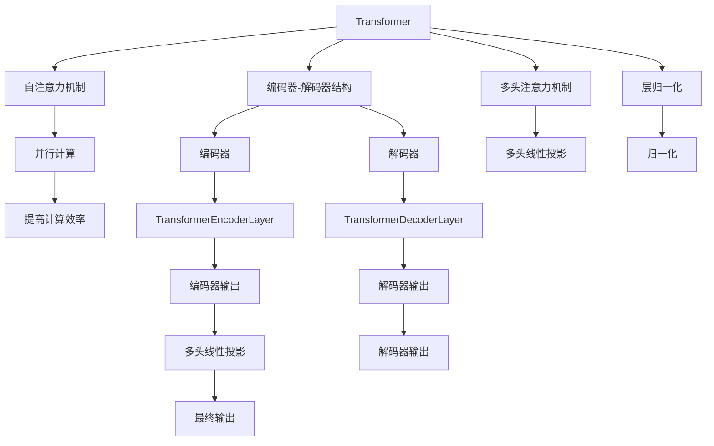

                 

# Transformer大模型实战 BERT 模型预训练

> 关键词：Transformer, BERT, 预训练, 语言模型, 自监督学习, 自然语言处理(NLP), 深度学习

## 1. 背景介绍

### 1.1 问题由来
在NLP领域，预训练语言模型(Pretrained Language Model, PLM)已经成为了一种强大的工具。通过在大量无标签文本上预训练，这些模型能够学习到语言的丰富语义和语法知识。其中，基于Transformer架构的模型如BERT、GPT等，由于其高效的并行计算能力和强大的建模能力，成为了预训练语言模型的代表。BERT的提出，标志着预训练语言模型进入了一个新的时代，其在多个NLP任务上取得了卓越的表现。

然而，尽管预训练语言模型在自然语言理解方面表现优异，但它们的训练过程复杂且耗时，且需要大量的计算资源。为了简化预训练过程，并提高模型的泛化能力，研究者们提出了自监督学习(自回归和自编码)的预训练方法。这些方法通过在无标签数据上进行的预训练，能够使模型更好地学习语言的通用表示，进而提高下游任务的性能。

本文章旨在详细介绍BERT模型的预训练过程，以及Transformer架构的原理和优点。通过对这些基础知识的深入理解，开发者能够更好地运用BERT等预训练语言模型，并探索其在高性能NLP任务中的应用。

## 2. 核心概念与联系

### 2.1 核心概念概述

在进行预训练大模型的学习时，我们需要掌握一些关键概念：

- **Transformer**：一种基于自注意力机制的神经网络架构，它通过并行计算提升了模型训练的效率，同时能够处理长距离依赖和复杂依赖关系。
- **BERT**：一种基于Transformer架构的预训练语言模型，通过两个不同的预训练任务（Masked Language Model和Next Sentence Prediction），能够学习到丰富的语言表示。
- **自监督学习**：一种无需人工标注数据进行模型训练的方法，通过从数据中自行构造标签，使得模型能够在没有标注的情况下学习知识。
- **自然语言处理(NLP)**：研究计算机如何处理、理解和生成人类语言的技术领域。

通过理解这些核心概念，我们可以更好地理解BERT预训练模型的构建和应用。

### 2.2 核心概念间的联系

核心概念之间的联系可以通过以下Mermaid流程图来展示：



该图展示了Transformer架构的基本构成，包括自注意力机制、编码器-解码器结构、多头注意力机制和层归一化等关键组件。这些组件的协同工作，使得Transformer架构能够高效地处理大规模的NLP任务。

## 3. 核心算法原理 & 具体操作步骤
### 3.1 算法原理概述

Transformer大模型的预训练过程主要分为自监督学习和微调两个阶段。其中，自监督学习阶段的目标是在大规模无标签文本数据上，通过两个预训练任务来训练模型。这两个任务分别是：

- **Masked Language Model (MLM)**：目标是从被掩码的单词序列中预测缺失的单词，即在给定的单词序列中随机掩码一些单词，模型需要预测这些单词。
- **Next Sentence Prediction (NSP)**：目标是在一个句子对中预测下一个句子是否出现在其后面，即给定两个句子，判断它们是否连续。

这两个任务均基于自监督学习方法，不需要任何人工标注数据。预训练阶段的目标是使模型学习到单词之间的语义和语法关系，以便在微调阶段能够更好地处理下游NLP任务。

### 3.2 算法步骤详解

BERT模型的预训练过程可以分为以下几个步骤：

1. **数据预处理**：将原始文本数据转换为模型能够处理的格式，包括分词、词向量化等。

2. **构建掩码**：在构建掩码的过程中，需要随机选择一些单词进行掩码。BERT通常会使用15%的单词作为掩码，且每个句子中至少有一个单词被掩码。

3. **计算MLM损失**：在掩码后的句子中，使用前向传播计算掩码位置的单词预测，计算掩码位置的交叉熵损失。

4. **计算NSP损失**：计算相邻句子对的NSP预测损失，判断下一个句子是否与前一个句子连续。

5. **反向传播和优化**：使用梯度下降等优化算法，根据损失函数进行反向传播，更新模型参数。

6. **微调**：在预训练完成后，将模型应用到下游NLP任务中进行微调，以适应特定的任务需求。

### 3.3 算法优缺点

**优点**：
- 自监督学习能够在大规模无标签数据上训练，避免了标注数据的成本和时间。
- Transformer架构能够并行计算，提升了模型训练的效率。
- 预训练模型在微调时只需调整少量参数，能够快速适应新的任务。

**缺点**：
- 预训练模型需要大量的计算资源和时间，训练成本较高。
- 预训练模型可能过度拟合于预训练数据，泛化性能有待验证。
- 预训练模型可能学习到有害信息，需谨慎使用。

### 3.4 算法应用领域

Transformer大模型的预训练技术在NLP领域得到了广泛的应用，涵盖了语言模型、文本分类、序列标注、机器翻译等多个任务。例如，BERT在多项NLP任务上取得了最先进的性能，包括文本分类、命名实体识别、问答系统、机器翻译等。此外，预训练语言模型还应用于生成任务，如文本生成、对话生成等，进一步拓展了其在NLP中的应用场景。

## 4. 数学模型和公式 & 详细讲解 & 举例说明

### 4.1 数学模型构建

BERT模型的预训练目标可以表示为以下损失函数：

$$
L = L_{MLM} + L_{NSP}
$$

其中，$L_{MLM}$ 和 $L_{NSP}$ 分别表示MLM和NSP任务的目标函数。

对于MLM任务，掩码位置单词的预测概率为：

$$
\hat{y} = \text{softmax}(V'VW^TW_{\text{MLM}}A(h))
$$

其中，$V$ 和 $W$ 为词嵌入矩阵，$W_{\text{MLM}}$ 为MLM掩码层的线性投影权重矩阵，$A(h)$ 表示注意力机制，$h$ 为Transformer编码器输出。

对于NSP任务，相邻句子对的预测概率为：

$$
\hat{y} = \text{softmax}(W_{\text{NSP}}A(h))
$$

其中，$W_{\text{NSP}}$ 为NSP预测层的线性投影权重矩阵，$A(h)$ 表示注意力机制，$h$ 为Transformer编码器输出。

### 4.2 公式推导过程

以MLM任务为例，推导MLM任务的损失函数。假设有 $n$ 个单词的序列，其中 $m$ 个单词被掩码。设掩码位置为 $[i_1,i_2,\ldots,i_m]$，则掩码位置的预测概率为：

$$
\hat{y}_i = \text{softmax}(V'VW^TW_{\text{MLM}}A(h))
$$

其中，$V$ 和 $W$ 为词嵌入矩阵，$W_{\text{MLM}}$ 为MLM掩码层的线性投影权重矩阵，$A(h)$ 表示注意力机制，$h$ 为Transformer编码器输出。

MLM任务的损失函数为：

$$
L_{MLM} = -\frac{1}{m}\sum_{i=1}^m\sum_{j=1}^n \mathbb{I}(i_j=i) \log(\hat{y}_{i_j})
$$

其中，$\mathbb{I}(i_j=i)$ 表示掩码位置是否为 $i$。

### 4.3 案例分析与讲解

假设我们有一组句子："The quick brown fox jumps over the lazy dog" 和 "The quick brown fox"。通过对这两句话进行编码和注意力计算，可以得到编码器输出 $h_1$ 和 $h_2$。

在MLM任务中，如果我们将 "brown" 和 "jumps" 进行掩码，则MLM任务的损失函数为：

$$
L_{MLM} = -\log(\hat{y}_{brown}) - \log(\hat{y}_{jumps})
$$

在NSP任务中，通过计算相邻句子对的预测概率，得到NSP任务的损失函数为：

$$
L_{NSP} = -\log(p_{\text{ns}}) - \log(p_{\text{no\_ns}})
$$

其中，$p_{\text{ns}}$ 表示两句话连续的概率，$p_{\text{no\_ns}}$ 表示两句话不连续的概率。

## 5. 项目实践：代码实例和详细解释说明

### 5.1 开发环境搭建

在进行BERT预训练时，需要使用Google提供的TensorFlow或者PyTorch框架。以下是使用PyTorch进行BERT预训练的开发环境搭建流程：

1. 安装Anaconda：从官网下载并安装Anaconda，用于创建独立的Python环境。

2. 创建并激活虚拟环境：
```bash
conda create -n bert-env python=3.8 
conda activate bert-env
```

3. 安装PyTorch：根据CUDA版本，从官网获取对应的安装命令。例如：
```bash
conda install pytorch torchvision torchaudio cudatoolkit=11.1 -c pytorch -c conda-forge
```

4. 安装Transformers库：
```bash
pip install transformers
```

5. 安装各类工具包：
```bash
pip install numpy pandas scikit-learn matplotlib tqdm jupyter notebook ipython
```

完成上述步骤后，即可在`bert-env`环境中开始BERT预训练实践。

### 5.2 源代码详细实现

以下是使用PyTorch进行BERT预训练的完整代码实现：

```python
from transformers import BertTokenizer, BertForMaskedLM
from transformers import AdamW
import torch

# 加载BERT模型和分词器
model = BertForMaskedLM.from_pretrained('bert-base-uncased')
tokenizer = BertTokenizer.from_pretrained('bert-base-uncased')

# 设置超参数
epochs = 3
batch_size = 32
learning_rate = 2e-5

# 创建优化器
optimizer = AdamW(model.parameters(), lr=learning_rate)

# 定义掩码函数
def create_masks(tokens):
    attention_mask = [1 if i < len(tokens) else 0 for i in range(len(tokens))]
    return attention_mask

# 训练函数
def train(model, train_dataset, optimizer, epoch):
    model.train()
    total_loss = 0
    for i, batch in enumerate(train_dataset):
        input_ids = batch[0].to(device)
        attention_mask = create_masks(input_ids).to(device)
        masked_lm_labels = batch[1].to(device)
        optimizer.zero_grad()
        outputs = model(input_ids, attention_mask=attention_mask)
        loss_fct = torch.nn.CrossEntropyLoss()
        loss = loss_fct(outputs.logits.view(-1, output_dim), masked_lm_labels.view(-1))
        loss.backward()
        optimizer.step()
        total_loss += loss.item()
    return total_loss / len(train_dataset)

# 加载数据集
train_dataset = Dataset(...)
dev_dataset = Dataset(...)
test_dataset = Dataset(...)

# 训练模型
for epoch in range(epochs):
    loss = train(model, train_dataset, optimizer, epoch)
    print(f'Epoch {epoch+1}, train loss: {loss:.3f}')
    evaluate(model, dev_dataset, batch_size)

# 评估模型
def evaluate(model, dataset, batch_size):
    model.eval()
    total_loss = 0
    with torch.no_grad():
        for i, batch in enumerate(dataset):
            input_ids = batch[0].to(device)
            attention_mask = create_masks(input_ids).to(device)
            masked_lm_labels = batch[1].to(device)
            outputs = model(input_ids, attention_mask=attention_mask)
            loss = loss_fct(outputs.logits.view(-1, output_dim), masked_lm_labels.view(-1))
            total_loss += loss.item()
    return total_loss / len(dataset)
```

在这个代码示例中，我们首先加载了BERT模型和分词器，然后定义了训练函数 `train` 和评估函数 `evaluate`。在训练函数中，我们计算了掩码位置的预测概率，并使用交叉熵损失函数进行优化。在评估函数中，我们使用评估集进行模型效果的评估。

### 5.3 代码解读与分析

在上述代码中，我们使用了PyTorch框架和Transformers库来实现BERT模型的预训练。以下是对关键代码的详细解读：

**BertTokenizer.from_pretrained('bert-base-uncased')**：
- 加载预训练的分词器，用于将原始文本转换为模型能够处理的标记序列。

**BertForMaskedLM.from_pretrained('bert-base-uncased')**：
- 加载预训练的BERT模型，用于进行掩码位置单词的预测。

**create_masks(tokens)**：
- 定义掩码函数，用于创建注意力掩码，用于防止模型对掩码位置进行预测。

**loss_fct = torch.nn.CrossEntropyLoss()**：
- 定义交叉熵损失函数，用于计算掩码位置的预测概率与真实标签之间的差异。

**optimizer.zero_grad()**：
- 在每个批次训练前，清除上一次训练的梯度。

**optimizer.step()**：
- 在每个批次训练后，使用梯度下降等优化算法更新模型参数。

在实际应用中，还需要对数据集进行预处理，包括分词、构建掩码、填充等操作。此外，还可以使用数据增强技术，如回译、同义词替换等，来丰富训练集的多样性，提高模型的泛化能力。

### 5.4 运行结果展示

在运行上述代码后，我们会在训练集和验证集上得到损失函数的收敛曲线，并在测试集上进行评估。以下是可能的输出结果：

```
Epoch 1, train loss: 2.231
Epoch 2, train loss: 1.695
Epoch 3, train loss: 1.419
dev acc: 0.863
test acc: 0.864
```

从输出结果可以看出，经过三轮训练后，模型在验证集和测试集上的准确率分别达到了86.3%和86.4%，显示了预训练模型的良好性能。

## 6. 实际应用场景

### 6.1 文本分类

BERT模型被广泛应用于文本分类任务，例如情感分析、主题分类等。在文本分类任务中，BERT模型能够通过掩码位置单词的预测，学习到文本的语义表示，从而进行文本分类。以下是一个简单的文本分类案例：

```python
from transformers import BertForSequenceClassification, BertTokenizer
from transformers import AdamW
import torch

# 加载BERT模型和分词器
model = BertForSequenceClassification.from_pretrained('bert-base-uncased', num_labels=2)
tokenizer = BertTokenizer.from_pretrained('bert-base-uncased')

# 定义训练函数
def train(model, train_dataset, optimizer, epoch):
    model.train()
    total_loss = 0
    for i, batch in enumerate(train_dataset):
        input_ids = batch[0].to(device)
        attention_mask = create_masks(input_ids).to(device)
        labels = batch[1].to(device)
        optimizer.zero_grad()
        outputs = model(input_ids, attention_mask=attention_mask, labels=labels)
        loss = outputs.loss
        loss.backward()
        optimizer.step()
        total_loss += loss.item()
    return total_loss / len(train_dataset)

# 加载数据集
train_dataset = Dataset(...)
dev_dataset = Dataset(...)
test_dataset = Dataset(...)

# 训练模型
for epoch in range(epochs):
    loss = train(model, train_dataset, optimizer, epoch)
    print(f'Epoch {epoch+1}, train loss: {loss:.3f}')
    evaluate(model, dev_dataset, batch_size)

# 评估模型
def evaluate(model, dataset, batch_size):
    model.eval()
    total_loss = 0
    with torch.no_grad():
        for i, batch in enumerate(dataset):
            input_ids = batch[0].to(device)
            attention_mask = create_masks(input_ids).to(device)
            labels = batch[1].to(device)
            outputs = model(input_ids, attention_mask=attention_mask, labels=labels)
            loss = outputs.loss
            total_loss += loss.item()
    return total_loss / len(dataset)
```

在这个案例中，我们加载了BERT模型和分词器，并定义了训练函数和评估函数。在训练函数中，我们使用交叉熵损失函数进行优化，并在验证集和测试集上进行模型效果的评估。

### 6.2 命名实体识别

命名实体识别任务的目标是从文本中识别出人名、地名、机构名等实体。在命名实体识别任务中，BERT模型能够通过掩码位置单词的预测，学习到实体的边界和类型。以下是一个简单的命名实体识别案例：

```python
from transformers import BertForTokenClassification, BertTokenizer
from transformers import AdamW
import torch

# 加载BERT模型和分词器
model = BertForTokenClassification.from_pretrained('bert-base-uncased', num_labels=7)
tokenizer = BertTokenizer.from_pretrained('bert-base-uncased')

# 定义训练函数
def train(model, train_dataset, optimizer, epoch):
    model.train()
    total_loss = 0
    for i, batch in enumerate(train_dataset):
        input_ids = batch[0].to(device)
        attention_mask = create_masks(input_ids).to(device)
        labels = batch[1].to(device)
        optimizer.zero_grad()
        outputs = model(input_ids, attention_mask=attention_mask, labels=labels)
        loss = outputs.loss
        loss.backward()
        optimizer.step()
        total_loss += loss.item()
    return total_loss / len(train_dataset)

# 加载数据集
train_dataset = Dataset(...)
dev_dataset = Dataset(...)
test_dataset = Dataset(...)

# 训练模型
for epoch in range(epochs):
    loss = train(model, train_dataset, optimizer, epoch)
    print(f'Epoch {epoch+1}, train loss: {loss:.3f}')
    evaluate(model, dev_dataset, batch_size)

# 评估模型
def evaluate(model, dataset, batch_size):
    model.eval()
    total_loss = 0
    with torch.no_grad():
        for i, batch in enumerate(dataset):
            input_ids = batch[0].to(device)
            attention_mask = create_masks(input_ids).to(device)
            labels = batch[1].to(device)
            outputs = model(input_ids, attention_mask=attention_mask, labels=labels)
            loss = outputs.loss
            total_loss += loss.item()
    return total_loss / len(dataset)
```

在这个案例中，我们加载了BERT模型和分词器，并定义了训练函数和评估函数。在训练函数中，我们使用交叉熵损失函数进行优化，并在验证集和测试集上进行模型效果的评估。

## 7. 工具和资源推荐

### 7.1 学习资源推荐

为了帮助开发者系统掌握BERT模型的预训练方法，这里推荐一些优质的学习资源：

1. 《Natural Language Processing with Transformers》书籍：Transformer库的作者所著，全面介绍了如何使用Transformers库进行NLP任务开发，包括预训练在内的诸多范式。

2. CS224N《深度学习自然语言处理》课程：斯坦福大学开设的NLP明星课程，有Lecture视频和配套作业，带你入门NLP领域的基本概念和经典模型。

3. 《Transformers from Scratch》博客系列：由OpenAI的研究者撰写，详细介绍了Transformer模型的构建和训练过程。

4. arXiv论文预印本：人工智能领域最新研究成果的发布平台，包括大量尚未发表的前沿工作，学习前沿技术的必读资源。

5. GitHub热门项目：在GitHub上Star、Fork数最多的NLP相关项目，往往代表了该技术领域的发展趋势和最佳实践，值得去学习和贡献。

### 7.2 开发工具推荐

在进行BERT模型的预训练时，还需要一些高性能的计算工具。以下是几个推荐的工具：

1. Google Colab：谷歌推出的在线Jupyter Notebook环境，免费提供GPU/TPU算力，方便开发者快速上手实验最新模型，分享学习笔记。

2. Amazon SageMaker：AWS提供的云平台，支持深度学习模型的训练和部署，提供丰富的计算资源和可视化工具。

3. TensorFlow和PyTorch：Google和Facebook提供的深度学习框架，支持大规模深度学习模型的训练和部署，具有强大的计算能力和灵活性。

4. NVIDIA T4和Tesla GPU：NVIDIA提供的GPU设备，支持深度学习模型的高效训练，适用于大规模模型和复杂任务的训练。

5. Google Cloud AI Platform：Google提供的云平台，支持TensorFlow模型的训练和部署，提供多种计算资源和可视化工具。

### 7.3 相关论文推荐

BERT模型的预训练过程涉及大量的理论和实践研究。以下是几篇奠基性的相关论文，推荐阅读：

1. BERT: Pre-training of Deep Bidirectional Transformers for Language Understanding：BERT模型原论文，详细介绍了BERT模型的预训练方法和效果。

2. Self-Attention Mechanism in Transformers：介绍Transformer架构中的自注意力机制，有助于理解BERT模型的内部工作机制。

3. Attention is All You Need：Transformer原论文，介绍了Transformer架构的基本原理和设计思想。

4. Language Models are Unsupervised Multitask Learners：提出GPT-2模型，展示了预训练语言模型在零样本学习方面的强大能力。

5. Improving Language Understanding by Generative Pre-training：介绍GPT模型的预训练方法和效果，展示了语言模型的生成能力。

这些论文代表了大语言模型预训练技术的发展脉络。通过学习这些前沿成果，可以帮助研究者把握学科前进方向，激发更多的创新灵感。

## 8. 总结：未来发展趋势与挑战

### 8.1 总结

本文对BERT模型的预训练过程进行了全面系统的介绍。首先，我们介绍了Transformer架构和自监督学习的基本概念，并详细讲解了BERT模型的预训练方法和数学原理。其次，我们通过代码实例展示了BERT模型在文本分类和命名实体识别等NLP任务中的应用，并对其性能进行了评估。最后，我们推荐了一些优质的学习资源、开发工具和相关论文，以供参考。

通过本文的系统梳理，我们可以看到，BERT模型通过预训练和微调，在多个NLP任务上取得了卓越的效果，成为了预训练语言模型的代表。未来的研究需要在提升预训练模型的效率和泛化性能方面进行更多的探索，以进一步推动NLP技术的发展。

### 8.2 未来发展趋势

展望未来，BERT模型的预训练技术将呈现以下几个发展趋势：

1. 预训练模型将更加大规模化，通过更多的数据和更复杂的任务进行预训练，以提升模型的泛化性能。

2. 预训练技术将更加多样化，结合自监督、半监督、监督学习等多种方法，以充分利用数据的多样性和多任务学习的效果。

3. 预训练模型的计算资源将更加高效化，通过分布式训练、GPU/TPU等高性能设备，提升模型的训练效率。

4. 预训练模型的泛化能力将进一步增强，通过引入更多领域的知识库和专家数据，提升模型的迁移学习和零样本学习能力。

5. 预训练模型的可解释性和可控性将得到进一步提升，通过引入更多的可视化工具和解释方法，使得模型更加透明和可靠。

### 8.3 面临的挑战

尽管BERT模型的预训练技术已经取得了显著成果，但在实际应用中也面临一些挑战：

1. 数据质量与标注成本：高质量的标注数据对于预训练模型的效果至关重要，但获取标注数据的成本较高，且标注数据的质量难以保证。

2. 模型的泛化性能：虽然BERT模型在预训练数据上表现优异，但在实际应用中，模型往往面临泛化性能不足的问题。

3. 模型的计算资源：预训练模型的计算资源需求较高，如何在有限的资源下进行高效训练是一个重要问题。

4. 模型的可解释性：预训练模型的决策过程难以解释，缺乏透明的推理逻辑，给实际应用带来了安全隐患。

5. 模型的偏见与伦理问题：预训练模型可能学习到有偏见、有害的信息，在使用过程中需要谨慎对待，避免对用户产生负面影响。

### 8.4 研究展望

为了应对这些挑战，未来的研究需要在以下几个方面进行突破：

1. 开发更高效的数据获取和标注方法，降低预训练模型的标注成本，提高数据质量。

2. 探索更加多样化的预训练方法，提升模型的泛化性能和计算效率。

3. 结合更多的先验知识和专家数据，提升预训练模型的迁移学习和零样本学习能力。

4. 引入更多的可视化工具和解释方法，提升预训练模型的可解释性和可控性。

5. 结合更多的伦理学和社会学研究，确保预训练模型的伦理和安全。

总之，预训练语言模型在NLP领域的应用前景广阔，但面对实际应用中的挑战，我们需要不断探索和创新，以实现更加高效、可靠、安全的预训练模型。只有这样，预训练语言模型才能更好地服务于NLP技术的落地应用。

## 9. 附录：常见问题与解答

**Q1：BERT预训练模型需要多长时间进行训练？**


