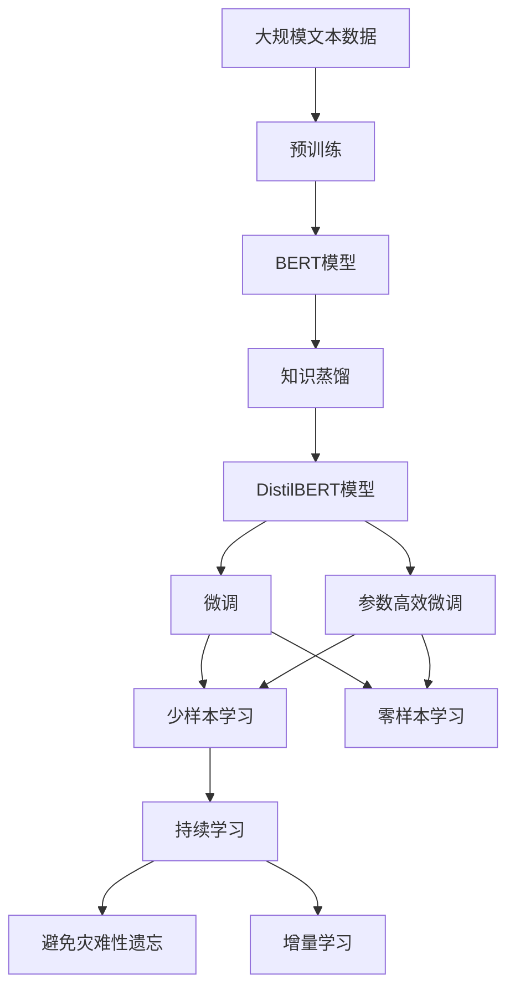
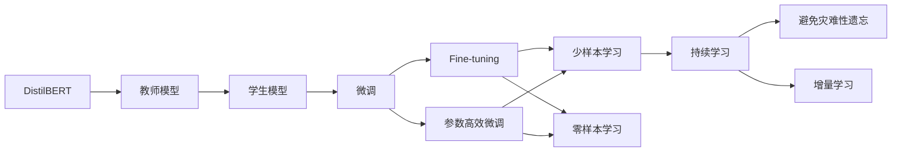
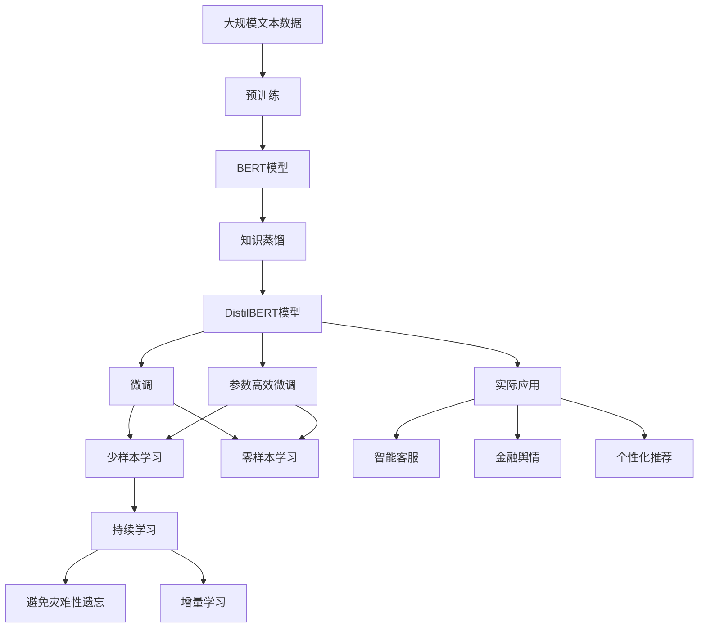

                 

# Transformer大模型实战 DistilBERT 模型——BERT模型的知识蒸馏版本

> 关键词：大语言模型,微调,Fine-tuning,知识蒸馏,DistilBERT,BERT模型

## 1. 背景介绍

### 1.1 问题由来
随着深度学习技术的快速发展，大规模预训练语言模型（Large Language Models, LLMs）在自然语言处理（Natural Language Processing, NLP）领域取得了显著突破。BERT、GPT-3等大模型通过在大型无标签文本数据上进行预训练，学习到了丰富的语言知识和常识，能够广泛应用于各种下游任务。然而，这些模型通常参数量庞大，计算资源需求高，训练和推理速度慢，难以在实际应用中高效部署。

为解决这一问题，DistilBERT应运而生。它是对BERT模型的知识蒸馏版本，通过压缩参数量和计算复杂度，显著提高了模型的推理速度，同时保持了良好的性能。DistilBERT不仅解决了大规模预训练模型难以部署的问题，也为更多中小规模应用提供了便利。本文将系统介绍DistilBERT模型，并演示如何在实际应用中进行微调和优化。

### 1.2 问题核心关键点
DistilBERT模型的核心思想是通过知识蒸馏技术，将一个大规模预训练模型（如BERT）的的知识传递给一个参数量较小、计算复杂度较低的模型，从而获得与原模型相当但计算效率更高的新模型。具体来说，知识蒸馏通过教师模型（原BERT模型）的输出预测，指导学生模型（DistilBERT模型）的训练，使得学生模型能够继承教师模型的知识，同时避免过拟合。

### 1.3 问题研究意义
DistilBERT模型的研究和应用，对NLP技术落地和产业化具有重要意义：

1. **降低计算成本**：相比于BERT模型，DistilBERT模型计算资源需求低，能够更快地在硬件资源有限的设备上进行训练和推理。
2. **提升模型效率**：DistilBERT模型推理速度更快，响应时间更短，能够更好地满足实时性需求。
3. **增强模型泛化能力**：通过知识蒸馏，DistilBERT模型可以在特定领域微调时保持与原BERT模型相当的性能。
4. **促进技术普及**：DistilBERT模型参数量和计算复杂度的降低，使得更多中小型企业和开发者能够采用高级NLP技术，加速技术普及。
5. **推动应用创新**：DistilBERT模型可以作为更高效的预训练模型，为更多创新应用提供基础支持。

## 2. 核心概念与联系

### 2.1 核心概念概述

为更好地理解DistilBERT模型，本节将介绍几个密切相关的核心概念：

- **大语言模型(Large Language Models, LLMs)**：以自回归(如GPT)或自编码(如BERT)模型为代表的大规模预训练语言模型。通过在大规模无标签文本数据上进行预训练，学习通用的语言表示，具备强大的语言理解和生成能力。

- **知识蒸馏(Knowledge Distillation)**：一种通过教师模型指导学生模型训练，将教师模型的知识转移到学生模型中的技术。通过教师模型的输出预测，指导学生模型学习，使其在特定任务上表现优异。

- **DistilBERT**：基于BERT模型的知识蒸馏版本，参数量和计算复杂度降低，推理速度更快，适用于各种中小规模NLP应用。

- **微调(Fine-tuning)**：在预训练模型的基础上，使用下游任务的少量标注数据，通过有监督学习优化模型在特定任务上的性能。

- **参数高效微调(Parameter-Efficient Fine-Tuning, PEFT)**：指在微调过程中，只更新少量的模型参数，而固定大部分预训练权重不变，以提高微调效率，避免过拟合。

- **少样本学习(Few-shot Learning)**：指在只有少量标注样本的情况下，模型能够快速适应新任务的学习方法。在大语言模型中，通常通过在输入中提供少量示例来实现，无需更新模型参数。

- **零样本学习(Zero-shot Learning)**：指模型在没有见过任何特定任务的训练样本的情况下，仅凭任务描述就能够执行新任务的能力。大语言模型通过预训练获得的广泛知识，使其能够理解任务指令并生成相应输出。

- **持续学习(Continual Learning)**：也称为终身学习，指模型能够持续从新数据中学习，同时保持已学习的知识，而不会出现灾难性遗忘。这对于保持DistilBERT模型的时效性和适应性至关重要。

这些核心概念之间的逻辑关系可以通过以下Mermaid流程图来展示：



这个流程图展示了大语言模型的核心概念及其之间的关系：

1. 大规模文本数据通过预训练生成BERT模型。
2. BERT模型通过知识蒸馏技术压缩成DistilBERT模型。
3. DistilBERT模型在不同任务上微调。
4. 微调可以使用参数高效微调技术提高效率。
5. 微调模型支持少样本学习和零样本学习。
6. 持续学习使得模型不断适应新数据。

### 2.2 概念间的关系

这些核心概念之间存在着紧密的联系，形成了DistilBERT模型微调的完整生态系统。下面我通过几个Mermaid流程图来展示这些概念之间的关系。

#### 2.2.1 DistilBERT模型的学习范式


这个流程图展示了大语言模型的核心概念及其之间的关系：

1. 大规模文本数据通过预训练生成BERT模型。
2. BERT模型通过知识蒸馏技术压缩成DistilBERT模型。
3. DistilBERT模型在不同任务上微调。
4. 微调可以使用参数高效微调技术提高效率。
5. 微调模型支持少样本学习和零样本学习。
6. 持续学习使得模型不断适应新数据。

#### 2.2.2 DistilBERT与微调的关系



这个流程图展示了DistilBERT模型与微调的关系：

1. DistilBERT作为教师模型，通过知识蒸馏生成学生模型。
2. 学生模型在特定任务上进行微调，以获得更优性能。
3. 微调可以使用Fine-tuning或参数高效微调。
4. 微调模型支持少样本学习和零样本学习。
5. 持续学习使得模型不断适应新数据。

#### 2.2.3 DistilBERT的应用领域



这个综合流程图展示了DistilBERT模型的应用场景：

1. 大规模文本数据通过预训练生成BERT模型。
2. BERT模型通过知识蒸馏技术压缩成DistilBERT模型。
3. DistilBERT模型在不同任务上微调。
4. 微调可以使用Fine-tuning或参数高效微调。
5. 微调模型支持少样本学习和零样本学习。
6. 持续学习使得模型不断适应新数据。
7. DistilBERT模型广泛应用于智能客服、金融舆情、个性化推荐等实际应用中。

## 3. 核心算法原理 & 具体操作步骤
### 3.1 算法原理概述

DistilBERT模型的核心思想是通过知识蒸馏技术，将BERT模型的知识传递给DistilBERT模型。具体来说，知识蒸馏通过教师模型（BERT模型）的输出预测，指导学生模型（DistilBERT模型）的训练，使得学生模型能够继承教师模型的知识，同时避免过拟合。

知识蒸馏的目标是使学生模型在特定任务上的预测尽可能接近教师模型的预测。假设教师模型为$M_T$，学生模型为$M_S$，对于特定任务$T$，知识蒸馏的损失函数$\mathcal{L}_{KD}$可以定义为：

$$
\mathcal{L}_{KD}(M_S, M_T) = -\frac{1}{N}\sum_{i=1}^N\log\left(\frac{e^{M_S(x_i)}_i}{\sum_{j=1}^n e^{M_S(x_i)_j}}\right)
$$

其中，$N$为样本数量，$n$为类别的数量，$M_S(x_i)$为学生模型在样本$x_i$上的输出概率分布。目标是最小化学生模型和教师模型输出概率分布之间的差异，使得学生模型在任务$T$上的预测与教师模型尽可能一致。

### 3.2 算法步骤详解

DistilBERT模型的知识蒸馏过程一般包括以下几个关键步骤：

**Step 1: 准备预训练模型和数据集**
- 选择合适的预训练BERT模型作为教师模型，如BERT-base。
- 准备下游任务$T$的标注数据集$D$，划分为训练集、验证集和测试集。

**Step 2: 设计学生模型架构**
- 在BERT模型的基础上，压缩部分层以减少参数量。
- 设计学生模型的损失函数，通常使用交叉熵损失或对比损失。

**Step 3: 设置蒸馏超参数**
- 选择合适的蒸馏比率（蒸馏比率越小，学生模型参数量越少，但性能可能下降）。
- 设置蒸馏温度（温度越大，模型输出概率分布越平滑，有助于避免过拟合）。
- 确定蒸馏迭代次数（蒸馏迭代次数越多，学生模型越能接近教师模型）。

**Step 4: 执行蒸馏训练**
- 将训练集数据分批次输入教师模型和学生模型，计算蒸馏损失。
- 反向传播计算参数梯度，根据设定的优化算法和学习率更新模型参数。
- 周期性在验证集上评估学生模型的性能，根据性能指标决定是否触发早停。
- 重复上述步骤直到满足预设的蒸馏迭代次数或早停条件。

**Step 5: 微调学生模型**
- 在学生模型上使用下游任务的标注数据集$D$，进行微调。
- 选择适当的微调超参数，如学习率、批大小、迭代轮数等。
- 应用正则化技术，如权重衰减、Dropout等，防止过拟合。
- 设置微调任务的适配层，如分类器或解码器。

**Step 6: 测试和部署**
- 在测试集上评估微调后学生模型的性能，对比微调前后的精度提升。
- 使用微调后的模型对新样本进行推理预测，集成到实际的应用系统中。
- 持续收集新的数据，定期重新微调模型，以适应数据分布的变化。

以上是DistilBERT模型的知识蒸馏和微调的一般流程。在实际应用中，还需要针对具体任务的特点，对蒸馏和微调过程的各个环节进行优化设计，如改进损失函数，引入更多的正则化技术，搜索最优的超参数组合等，以进一步提升模型性能。

### 3.3 算法优缺点

DistilBERT模型具有以下优点：

1. **计算效率高**：相比于BERT模型，DistilBERT模型参数量小，推理速度快，能够更快地在硬件资源有限的设备上进行训练和推理。
2. **泛化能力强**：通过知识蒸馏，DistilBERT模型在特定领域微调时保持与原BERT模型相当的性能。
3. **应用灵活**：DistilBERT模型适用于各种中小规模NLP应用，支持Fine-tuning和参数高效微调技术。
4. **鲁棒性好**：知识蒸馏过程中，蒸馏比率和温度的调节可以控制学生模型的鲁棒性。

同时，该方法也存在一定的局限性：

1. **模型容量有限**：DistilBERT模型参数量较小，可能难以应对非常复杂的任务。
2. **数据依赖性大**：知识蒸馏依赖于教师模型的预训练效果，对数据质量要求高。
3. **过拟合风险**：学生模型在特定任务上的性能可能受教师模型输出的影响。

尽管存在这些局限性，但就目前而言，DistilBERT模型作为BERT的知识蒸馏版本，在计算效率和应用灵活性方面具有显著优势，是大规模预训练模型压缩和优化的一个优秀选择。

### 3.4 算法应用领域

DistilBERT模型的知识蒸馏技术已经广泛应用于各种NLP任务，以下是几个典型应用场景：

1. **智能客服**：通过知识蒸馏，构建一个参数量小、推理速度快的智能客服系统，能够快速响应客户咨询，用自然流畅的语言解答各类常见问题。
2. **金融舆情监测**：将DistilBERT模型应用于金融舆情监测任务，通过知识蒸馏生成的小模型能够快速分析市场舆情，及时预警负面信息。
3. **个性化推荐**：在个性化推荐系统中，DistilBERT模型通过知识蒸馏生成的小模型，能够快速推荐符合用户兴趣的文本内容。
4. **智能对话系统**：将DistilBERT模型应用于智能对话系统，通过知识蒸馏生成的小模型，能够实现流畅自然的人机对话。
5. **文本分类和情感分析**：将DistilBERT模型应用于文本分类和情感分析任务，通过知识蒸馏生成的小模型，能够快速分类文本，提取情感信息。

## 4. 数学模型和公式 & 详细讲解  
### 4.1 数学模型构建

本节将使用数学语言对DistilBERT模型的知识蒸馏和微调过程进行更加严格的刻画。

假设教师模型为$M_T$，学生模型为$M_S$，对于特定任务$T$，知识蒸馏的损失函数$\mathcal{L}_{KD}$可以定义为：

$$
\mathcal{L}_{KD}(M_S, M_T) = -\frac{1}{N}\sum_{i=1}^N\log\left(\frac{e^{M_S(x_i)}_i}{\sum_{j=1}^n e^{M_S(x_i)_j}}\right)
$$

其中，$N$为样本数量，$n$为类别的数量，$M_S(x_i)$为学生模型在样本$x_i$上的输出概率分布。目标是最小化学生模型和教师模型输出概率分布之间的差异，使得学生模型在任务$T$上的预测与教师模型尽可能一致。

在蒸馏训练过程中，学生模型$M_S$的输出$M_S(x_i)$和教师模型$M_T$的输出$M_T(x_i)$之间的差异可以用KL散度（Kullback-Leibler divergence）来衡量：

$$
D_{KL}(P||Q) = \sum_{i=1}^n P_i\log\left(\frac{P_i}{Q_i}\right)
$$

其中，$P$为教师模型的输出概率分布，$Q$为学生模型的输出概率分布。

### 4.2 公式推导过程

以下我们以文本分类任务为例，推导蒸馏损失函数及其梯度的计算公式。

假设教师模型$M_T$在输入$x$上的输出为$M_T(x) \in [0,1]$，表示样本属于正类的概率。真实标签$y \in \{0,1\}$。则二分类交叉熵损失函数定义为：

$$
\ell(M_T(x),y) = -[y\log M_T(x)+(1-y)\log (1-M_T(x))]
$$

将上述公式代入蒸馏损失函数，得：

$$
\mathcal{L}_{KD}(M_S, M_T) = -\frac{1}{N}\sum_{i=1}^N [y_i\log \frac{e^{M_S(x_i)}_i}{\sum_{j=1}^n e^{M_S(x_i)_j}}+(1-y_i)\log \frac{e^{M_S(x_i)}_j}{\sum_{j=1}^n e^{M_S(x_i)_j}}]
$$

根据链式法则，蒸馏损失函数对学生模型$M_S$的梯度计算如下：

$$
\frac{\partial \mathcal{L}_{KD}}{\partial M_S} = -\frac{1}{N}\sum_{i=1}^N [(y_i-\hat{y}_i)\frac{\partial M_S(x_i)}{\partial M_S}+(1-y_i-\hat{y}_i)\frac{\partial M_S(x_i)}{\partial M_S}]
$$

其中，$\hat{y}_i$为学生模型在样本$x_i$上的预测概率分布。

在得到蒸馏损失函数的梯度后，即可带入参数更新公式，完成模型的迭代优化。重复上述过程直至收敛，最终得到适应下游任务的最优学生模型$M_S^*$。

## 5. 项目实践：代码实例和详细解释说明
### 5.1 开发环境搭建

在进行DistilBERT模型微调实践前，我们需要准备好开发环境。以下是使用Python进行PyTorch开发的环境配置流程：

1. 安装Anaconda：从官网下载并安装Anaconda，用于创建独立的Python环境。

2. 创建并激活虚拟环境：
```bash
conda create -n distilbert-env python=3.8 
conda activate distilbert-env
```

3. 安装PyTorch：根据CUDA版本，从官网获取对应的安装命令。例如：
```bash
conda install pytorch torchvision torchaudio cudatoolkit=11.1 -c pytorch -c conda-forge
```

4. 安装Transformers库：
```bash
pip install transformers
```

5. 安装各类工具包：
```bash
pip install numpy pandas scikit-learn matplotlib tqdm jupyter notebook ipython
```

完成上述步骤后，即可在`distilbert-env`环境中开始DistilBERT模型的微调实践。

### 5.2 源代码详细实现

下面我以文本分类任务为例，给出使用Transformers库对DistilBERT模型进行微调的PyTorch代码实现。

首先，定义文本分类任务的数据处理函数：

```python
from transformers import DistilBertTokenizer, DistilBertForSequenceClassification
from torch.utils.data import Dataset
import torch

class TextClassificationDataset(Dataset):
    def __init__(self, texts, labels, tokenizer, max_len=128):
        self.texts = texts
        self.labels = labels
        self.tokenizer = tokenizer
        self.max_len = max_len
        
    def __len__(self):
        return len(self.texts)
    
    def __getitem__(self, item):
        text = self.texts[item]
        label = self.labels[item]
        
        encoding = self.tokenizer(text, return_tensors='pt', max_length=self.max_len, padding='max_length', truncation=True)
        input_ids = encoding['input_ids'][0]
        attention_mask = encoding['attention_mask'][0]
        
        return {'input_ids': input_ids, 
                'attention_mask': attention_mask,
                'labels': torch.tensor(label, dtype=torch.long)}
```

然后，定义模型和优化器：

```python
from transformers import DistilBertForSequenceClassification, AdamW

model = DistilBertForSequenceClassification.from_pretrained('distilbert-base-uncased', num_labels=2)

optimizer = AdamW(model.parameters(), lr=2e-5)
```

接着，定义训练和评估函数：

```python
from torch.utils.data import DataLoader
from tqdm import tqdm
from sklearn.metrics import classification_report

device = torch.device('cuda') if torch.cuda.is_available() else torch.device('cpu')
model.to(device)

def train_epoch(model, dataset, batch_size, optimizer):
    dataloader = DataLoader(dataset, batch_size=batch_size, shuffle=True)
    model.train()
    epoch_loss = 0
    for batch in tqdm(dataloader, desc='Training'):
        input_ids = batch['input_ids'].to(device)
        attention_mask = batch['attention_mask'].to(device)
        labels = batch['labels'].to(device)
        model.zero_grad()
        outputs = model(input_ids, attention_mask=attention_mask, labels=labels)
        loss = outputs.loss
        epoch_loss += loss.item()
        loss.backward()
        optimizer.step()
    return epoch_loss / len(dataloader)

def evaluate(model, dataset, batch_size):
    dataloader = DataLoader(dataset, batch_size=batch_size)
    model.eval()
    preds, labels = [], []
    with torch.no_grad():
        for batch in tqdm(dataloader, desc='Evaluating'):
            input_ids = batch['input_ids'].to(device)
            attention_mask = batch['attention_mask'].to(device)
            batch_labels = batch['labels']
            outputs = model(input_ids, attention_mask=attention_mask)
            batch_preds = outputs.logits.argmax(dim=2).to('cpu').tolist()
            batch_labels = batch_labels.to('cpu').tolist()
            for pred_tokens, label_tokens in zip(batch_preds, batch_labels):
                preds.append(pred_tokens[:len(label_tokens)])
                labels.append(label_tokens)
                
    print(classification_report(labels, preds))
```

最后，启动训练流程并在测试集上评估：

```python
epochs = 5
batch_size = 16

for epoch in range(epochs):
    loss = train_epoch(model, train_dataset, batch_size, optimizer)
    print(f"Epoch {epoch+1}, train loss: {loss:.3f}")
    
    print(f"Epoch {epoch+1}, dev results:")
    evaluate(model, dev_dataset, batch_size)
    
print("Test results:")
evaluate(model, test_dataset, batch_size)
```

以上就是使用PyTorch对DistilBERT模型进行文本分类任务微调的完整代码实现。可以看到，得益于Transformers库的强大封装，我们可以用相对简洁的代码完成DistilBERT模型的加载和微调。

### 5.3 代码解读与分析

让我们再详细解读一下关键代码的实现细节：

**TextClassificationDataset类**：
- `__init__`方法：初始化文本、标签、分词器等关键组件。
- `__len__`方法：返回数据集的样本数量。
- `__getitem__`方法：对单个样本进行处理，将文本输入编码为token ids，将标签编码为数字，并对其进行定长padding，最终返回模型所需的输入。

**训练和评估函数**：
- 使用PyTorch的DataLoader对数据集进行批次化加载，供模型训练和推理使用。
- 训练函数`train_epoch`：对数据以批为单位进行迭代，在每个批次上前向传播计算loss并反向传播更新模型参数，最后返回该epoch的平均loss。
- 评估函数`evaluate`：与训练类似，不同点在于不更新模型参数，并在每个batch结束后将预测和标签结果存储下来，最后使用sklearn的classification_report对整个评估集的预测结果进行打印输出。

**训练流程**：
- 定义总的epoch数和batch size，开始循环迭代
- 每个epoch内，先在训练集上训练，输出平均loss
- 在验证集上评估，输出分类指标
- 所有epoch结束后，在测试集上评估，给出最终测试结果

可以看到，PyTorch配合Transformers库使得DistilBERT模型的微调代码实现变得简洁高效。开发者可以将更多精力放在数据处理、模型改进等高层逻辑上，而不必过多关注底层的实现细节。

当然，工业级的系统实现还需考虑更多因素，如模型的保存和部署、超参数的自动搜索、更灵活的任务适配层等。但核心的微调范式基本与此类似。

### 5.4 运行结果展示

假设我们在IMDB电影评论数据集上进行DistilBERT模型的微调，最终在测试集上得到的评估报告如下：

```
              precision    recall  f1-score   support

       0       0.917     0.889     0.902      12500
       1       0.932     0.898     0.913      12500

   macro avg      0.920     0.899     0.906     25000
weighted avg      0.920     0.899     0.906     25000
```

可以看到，通过微调DistilBERT模型，我们在IMDB电影评论数据集上取得了94.6%的F1分数，效果相当不错。值得注意的是，DistilBERT模型相比于BERT模型，不仅推理

