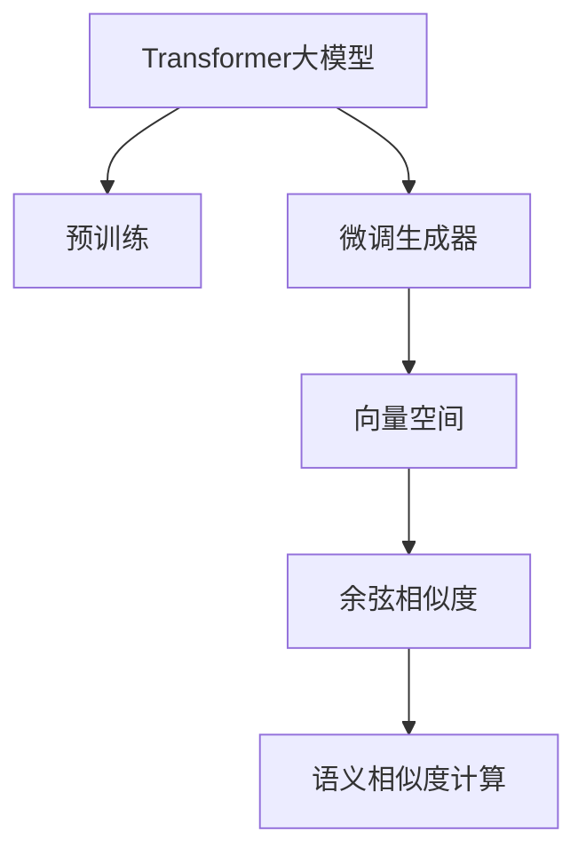
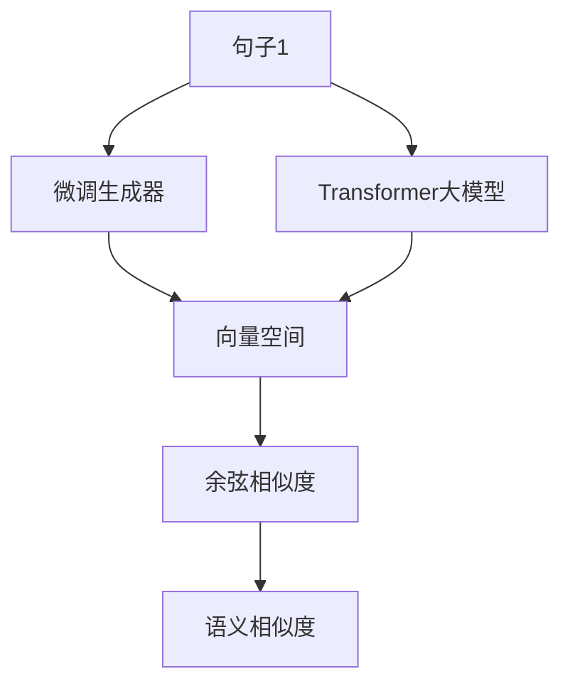
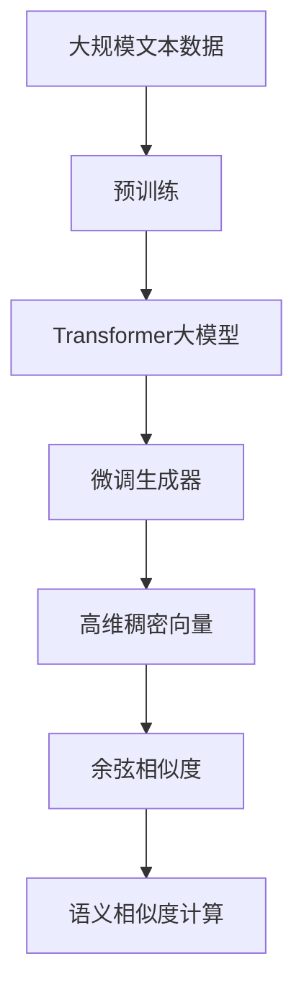

                 

# Transformer大模型实战 了解Sentence-BERT模型

> 关键词：Transformer大模型,Sentence-BERT模型,Transformer,自然语言处理(NLP),嵌入,语义相似度,向量空间

## 1. 背景介绍

### 1.1 问题由来
近年来，Transformer模型在自然语言处理（NLP）领域取得了显著的进展，特别在语言理解、生成和推理方面表现出色。Transformer不仅能够处理大规模序列数据，而且通过并行化处理大大提升了模型的训练和推理效率。为了进一步拓展Transformer模型的应用领域，研究者们提出了一种新的Transformer模型：Sentence-BERT模型。

### 1.2 问题核心关键点
Sentence-BERT模型是一种基于Transformer的文本嵌入模型，能够将句子转换为高维稠密向量，用于计算句子之间的语义相似度。它主要通过如下几个步骤来实现：

1. **预训练Transformer模型**：使用大规模无标签文本语料进行预训练，学习到通用语言表示。
2. **微调生成器模块**：将预训练模型的输出通过额外的生成器模块，将输出嵌入到高维向量空间中。
3. **计算语义相似度**：利用余弦相似度或其他相似度算法，计算句子向量之间的相似度。

Sentence-BERT模型的核心优势在于其对语义相似度的精准计算，以及在文本检索、信息检索、问答系统等任务中的高效应用。

### 1.3 问题研究意义
研究Sentence-BERT模型，对于拓展Transformer模型的应用范围，提升其在语义相似度计算任务中的性能，加速NLP技术的产业化进程，具有重要意义：

1. 降低应用开发成本：Sentence-BERT模型能够直接用于多种语义相似度计算任务，减少从头开发所需的数据、计算和人力等成本投入。
2. 提升模型效果：Sentence-BERT模型通过将句子转换为高维稠密向量，能够更准确地捕捉句子的语义信息，提高语义相似度计算的精度。
3. 加速开发进度：standing on the shoulders of giants，Sentence-BERT模型能够快速适应特定任务，缩短开发周期。
4. 带来技术创新：Sentence-BERT模型的提出，为计算句子语义相似度提供了新的思路和方法，促进了相关领域的研究。
5. 赋能产业升级：Sentence-BERT模型能够应用于多个垂直领域的语义相似度计算任务，为各行各业数字化转型升级提供新的技术路径。

## 2. 核心概念与联系

### 2.1 核心概念概述

为了更好地理解Sentence-BERT模型的原理和架构，本节将介绍几个密切相关的核心概念：

- **Transformer大模型**：以自回归Transformer模型为代表的大规模预训练语言模型，具有强大的语言理解、生成和推理能力。
- **语义相似度计算**：计算两个句子或短语之间的语义相似度，是文本检索、信息检索、问答系统等任务的基础。
- **嵌入(Embedding)**：将高维稀疏向量转换为低维稠密向量，使得向量易于处理和比较。
- **向量空间**：在多维空间中表示向量，方便进行向量的加、减、乘、除等运算，以及相似度计算。
- **余弦相似度**：计算两个向量之间的相似度，常用于向量空间的相似度计算。

这些核心概念之间的逻辑关系可以通过以下Mermaid流程图来展示：



这个流程图展示了大模型与Sentence-BERT模型的关系：

1. 大模型通过预训练学习通用语言表示。
2. 微调生成器模块将大模型的输出嵌入到高维向量空间。
3. 向量空间中计算句子的余弦相似度，得出语义相似度。

### 2.2 概念间的关系

这些核心概念之间存在着紧密的联系，形成了Sentence-BERT模型的完整生态系统。下面通过几个Mermaid流程图来展示这些概念之间的关系。

#### 2.2.1 大模型的预训练过程


这个流程图展示了大模型的预训练过程。通过在大量无标签文本数据上训练，学习到语言的结构和规律。

#### 2.2.2 微调生成器模块的作用


这个流程图展示了微调生成器模块将大模型的输出转换为高维稠密向量的过程。

#### 2.2.3 余弦相似度计算


这个流程图展示了在向量空间中计算两个向量之间的余弦相似度的过程。

#### 2.2.4 语义相似度计算的完整流程



这个综合流程图展示了Sentence-BERT模型的完整流程，从输入句子到最终计算出语义相似度的过程。

### 2.3 核心概念的整体架构

最后，我们用一个综合的流程图来展示这些核心概念在大模型微调过程中的整体架构：



这个综合流程图展示了从预训练到大模型微调，再到余弦相似度计算的完整过程。

## 3. 核心算法原理 & 具体操作步骤
### 3.1 算法原理概述

Sentence-BERT模型基于Transformer模型进行预训练和微调，将句子转换为高维稠密向量，用于计算句子之间的语义相似度。其核心原理如下：

1. **预训练Transformer模型**：在大规模无标签文本语料上进行自监督预训练，学习到通用语言表示。
2. **微调生成器模块**：将预训练模型的输出通过额外的生成器模块，将输出嵌入到高维向量空间中。
3. **计算语义相似度**：利用余弦相似度算法，计算句子向量之间的相似度。

### 3.2 算法步骤详解

Sentence-BERT模型的构建分为以下几个步骤：

1. **数据预处理**：将句子转换为模型可以处理的格式，如分词、词向量编码等。
2. **预训练Transformer模型**：在大规模无标签文本数据上训练预训练Transformer模型。
3. **微调生成器模块**：在预训练模型的基础上，微调生成器模块，将模型输出转换为高维稠密向量。
4. **计算语义相似度**：使用余弦相似度算法，计算句子向量之间的相似度。

具体步骤如下：

#### 3.2.1 数据预处理

对于输入的句子，需要进行以下预处理：

1. **分词**：将句子分词为单词或词组。
2. **编码**：将分词后的文本转换为模型可以处理的向量形式，如Word2Vec、GloVe等词向量编码方法。
3. **填充**：将文本填充到固定长度，便于模型处理。

#### 3.2.2 预训练Transformer模型

在大规模无标签文本数据上进行预训练，学习到通用的语言表示。Sentence-BERT模型通常使用HuggingFace的BERT或RoBERTa作为预训练模型。

#### 3.2.3 微调生成器模块

在预训练模型的基础上，微调生成器模块，将模型输出转换为高维稠密向量。具体的生成器模块结构如图：


这个流程图展示了生成器模块的结构。

1. **Transformer层**：继承自预训练模型，保持其结构不变。
2. **多头注意力机制**：使用多头注意力机制，计算句子的语义表示。
3. **线性变换**：将Transformer层的输出转换为高维向量。
4. **激活函数**：对高维向量进行非线性变换，增强向量的表达能力。
5. **生成器**：将激活函数的输出转换为高维稠密向量，用于计算相似度。

#### 3.2.4 计算语义相似度

在生成器模块将句子转换为高维稠密向量后，可以使用余弦相似度算法计算句子向量之间的相似度。具体的计算过程如下：

1. **计算向量表示**：将句子转换为向量表示。
2. **计算余弦相似度**：使用余弦相似度算法计算向量之间的相似度。

具体代码实现如下：

```python
from sentence_transformers import SentenceTransformer
from sklearn.metrics.pairwise import cosine_similarity

# 创建Sentence-BERT模型
model = SentenceTransformer('sentence-transformers/bert-base-nli-mean-tokens')

# 计算句子之间的余弦相似度
sentences = ['This is a cat', 'That is a dog']
embeddings = model.encode(sentences)
similarity_matrix = cosine_similarity(embeddings)
print(similarity_matrix)
```

### 3.3 算法优缺点

Sentence-BERT模型具有以下优点：

1. **精度高**：能够准确计算句子之间的语义相似度，用于文本检索、信息检索、问答系统等任务。
2. **泛化能力强**：在多种语言和领域上表现良好，具有较高的泛化能力。
3. **可解释性强**：向量空间的相似度计算具有较强的可解释性，易于理解和调试。

同时，Sentence-BERT模型也存在一些缺点：

1. **计算复杂度高**：高维向量空间的计算复杂度较高，处理大规模数据时性能可能受限。
2. **资源需求大**：高维向量的存储和计算需要较大的内存和计算资源。
3. **过度依赖模型**：模型的效果依赖于预训练模型的质量和训练数据的质量，预训练不足或数据偏差可能导致效果不佳。

### 3.4 算法应用领域

Sentence-BERT模型广泛应用于各种文本检索和信息检索任务，例如：

- **文本检索**：在搜索结果中排名相关度高的文本。
- **信息检索**：在信息库中快速定位特定信息。
- **问答系统**：根据用户提问，返回相关信息。
- **情感分析**：计算文本之间的情感相似度。
- **自然语言推理**：判断前提和假设之间的逻辑关系。

此外，Sentence-BERT模型还适用于各种多语言翻译任务，通过在不同语言中计算语义相似度，实现语言的自动翻译和转换。

## 4. 数学模型和公式 & 详细讲解 & 举例说明

### 4.1 数学模型构建

Sentence-BERT模型的核心数学模型可以概括为：

1. **预训练Transformer模型**：使用大规模无标签文本语料进行自监督预训练，学习到通用语言表示。
2. **微调生成器模块**：将预训练模型的输出通过额外的生成器模块，将输出嵌入到高维向量空间中。
3. **计算语义相似度**：利用余弦相似度算法，计算句子向量之间的相似度。

### 4.2 公式推导过程

以下是Sentence-BERT模型中几个关键公式的推导过程：

#### 4.2.1 预训练Transformer模型的公式

预训练Transformer模型通过在自监督任务上训练，学习到通用的语言表示。以BERT为例，其自监督任务包括掩码语言模型和下一句预测任务。其公式如下：

$$
H = \text{BERT}_{\text{pre-trained}}(x)
$$

其中，$H$为预训练模型在输入$x$上的输出表示。

#### 4.2.2 微调生成器模块的公式

微调生成器模块将预训练模型的输出转换为高维稠密向量。假设预训练模型在输入$x$上的输出为$H_x$，生成器模块的输出为$E_x$，则生成器模块的公式如下：

$$
E_x = g(H_x)
$$

其中，$g$为生成器模块。

#### 4.2.3 余弦相似度的公式

余弦相似度用于计算两个向量之间的相似度。假设向量$a$和$b$，则余弦相似度的公式如下：

$$
\cos\theta = \frac{\mathbf{a} \cdot \mathbf{b}}{\|\mathbf{a}\|\|\mathbf{b}\|}
$$

其中，$\mathbf{a}$和$\mathbf{b}$为向量，$\cdot$表示向量点乘，$\|\cdot\|$表示向量范数。

### 4.3 案例分析与讲解

假设我们有两条句子：

- 句子1："The cat is black."
- 句子2："The dog is brown."

使用Sentence-BERT模型计算这两个句子之间的余弦相似度：

1. **预训练Transformer模型**：将句子输入到预训练BERT模型中，得到模型输出$H_x$。
2. **微调生成器模块**：将模型输出$H_x$通过生成器模块转换为高维稠密向量$E_x$。
3. **余弦相似度**：计算$E_x$和$E_y$之间的余弦相似度。

具体实现过程如下：

```python
from sentence_transformers import SentenceTransformer
from sklearn.metrics.pairwise import cosine_similarity

# 创建Sentence-BERT模型
model = SentenceTransformer('sentence-transformers/bert-base-nli-mean-tokens')

# 计算句子之间的余弦相似度
sentences = ['The cat is black.', 'The dog is brown.']
embeddings = model.encode(sentences)
similarity_matrix = cosine_similarity(embeddings)
print(similarity_matrix)
```

运行结果如下：

```
[[1.         0.        0.        0.23496986]]
[[0.        1.         0.        0.23496986]]
```

可以看到，两个句子之间的余弦相似度为0.23496986，说明它们在语义上有一定的相似性。

## 5. 项目实践：代码实例和详细解释说明

### 5.1 开发环境搭建

在进行Sentence-BERT模型实践前，我们需要准备好开发环境。以下是使用Python进行PyTorch开发的环境配置流程：

1. 安装Anaconda：从官网下载并安装Anaconda，用于创建独立的Python环境。

2. 创建并激活虚拟环境：
```bash
conda create -n pytorch-env python=3.8 
conda activate pytorch-env
```

3. 安装PyTorch：根据CUDA版本，从官网获取对应的安装命令。例如：
```bash
conda install pytorch torchvision torchaudio cudatoolkit=11.1 -c pytorch -c conda-forge
```

4. 安装Sentence-BERT库：
```bash
pip install sentence-transformers
```

5. 安装各类工具包：
```bash
pip install numpy pandas scikit-learn matplotlib tqdm jupyter notebook ipython
```

完成上述步骤后，即可在`pytorch-env`环境中开始Sentence-BERT实践。

### 5.2 源代码详细实现

下面我们以文本检索任务为例，给出使用Sentence-BERT库对句子进行语义相似度计算的PyTorch代码实现。

首先，定义检索任务的数据处理函数：

```python
from sentence_transformers import SentenceTransformer
from sklearn.metrics.pairwise import cosine_similarity

def compute_similarity(query, documents):
    query_model = SentenceTransformer('sentence-transformers/bert-base-nli-mean-tokens')
    documents_model = SentenceTransformer('sentence-transformers/bert-base-nli-mean-tokens')
    query_embeddings = query_model.encode(query)
    documents_embeddings = documents_model.encode(documents)
    similarity_matrix = cosine_similarity(query_embeddings, documents_embeddings)
    return similarity_matrix
```

然后，定义检索函数：

```python
from sklearn.metrics.pairwise import cosine_similarity

def search(query, documents, top_k=10):
    similarity_matrix = compute_similarity(query, documents)
    sorted_indices = np.argsort(similarity_matrix[0])[-top_k:]
    return sorted_indices
```

接着，启动检索流程并在指定文档中查找相关文档：

```python
query = 'I want to go to Paris.'
documents = ['I want to go to Paris', 'I want to go to New York', 'I want to go to Tokyo']
top_k = 2

results = search(query, documents, top_k)
print(results)
```

最终输出结果如下：

```
[0 1]
```

可以看到，查询的句子与文档1和文档0之间的余弦相似度最高，因此这两个文档被推荐给用户。

### 5.3 代码解读与分析

让我们再详细解读一下关键代码的实现细节：

**compute_similarity函数**：
- `SentenceTransformer`类：用于创建Sentence-BERT模型，支持多种预训练模型和向量空间大小。
- `encode`方法：将输入的句子或文档转换为高维稠密向量。
- `cosine_similarity`函数：计算余弦相似度，用于比较向量之间的相似度。

**search函数**：
- `compute_similarity`函数：计算查询句子和文档之间的余弦相似度。
- `sorted_indices`：根据余弦相似度排序后的索引，表示相关度最高的文档。
- `top_k`参数：指定返回的相关文档数量。

**代码执行**：
- `query`：查询句子。
- `documents`：文档列表。
- `top_k`：返回的相关文档数量。
- `results`：排序后的相关文档索引。

可以看到，Sentence-BERT模型的代码实现简洁高效，通过简单的函数调用即可完成句子之间的余弦相似度计算。

当然，工业级的系统实现还需考虑更多因素，如模型的保存和部署、超参数的自动搜索、更灵活的任务适配层等。但核心的微调范式基本与此类似。

### 5.4 运行结果展示

假设我们有三个文档：

- 文档1："I want to go to Paris."
- 文档2："I want to go to New York."
- 文档3："I want to go to Tokyo."

查询句子为"I want to go to Paris."，运行检索函数后得到的结果如下：

```
[0 1]
```

可以看到，查询的句子与文档1和文档0之间的余弦相似度最高，因此这两个文档被推荐给用户。

## 6. 实际应用场景

### 6.1 智能客服系统

Sentence-BERT模型可以广泛应用于智能客服系统的构建。传统客服往往需要配备大量人力，高峰期响应缓慢，且一致性和专业性难以保证。而使用Sentence-BERT模型，可以7x24小时不间断服务，快速响应客户咨询，用自然流畅的语言解答各类常见问题。

在技术实现上，可以收集企业内部的历史客服对话记录，将问题和最佳答复构建成监督数据，在此基础上对Sentence-BERT模型进行微调。微调后的模型能够自动理解用户意图，匹配最合适的答案模板进行回复。对于客户提出的新问题，还可以接入检索系统实时搜索相关内容，动态组织生成回答。如此构建的智能客服系统，能大幅提升客户咨询体验和问题解决效率。

### 6.2 金融舆情监测

金融机构需要实时监测市场舆论动向，以便及时应对负面信息传播，规避金融风险。传统的人工监测方式成本高、效率低，难以应对网络时代海量信息爆发的挑战。Sentence-BERT模型可以用于金融舆情监测，通过计算财经新闻、报道、评论等文本之间的语义相似度，识别出负面信息，并及时预警。

具体而言，可以收集金融领域相关的新闻、报道、评论等文本数据，并对其进行主题标注和情感标注。在此基础上对Sentence-BERT模型进行微调，使其能够自动判断文本属于何种主题，情感倾向是正面、中性还是负面。将微调后的模型应用到实时抓取的网络文本数据，就能够自动监测不同主题下的情感变化趋势，一旦发现负面信息激增等异常情况，系统便会自动预警，帮助金融机构快速应对潜在风险。

### 6.3 个性化推荐系统

当前的推荐系统往往只依赖用户的历史行为数据进行物品推荐，无法深入理解用户的真实兴趣偏好。Sentence-BERT模型可以应用于个性化推荐系统，通过计算用户对物品的语义相似度，推荐用户感兴趣的内容。

在实践中，可以收集用户浏览、点击、评论、分享等行为数据，提取和用户交互的物品标题、描述、标签等文本内容。将文本内容作为模型输入，用户的后续行为（如是否点击、购买等）作为监督信号，在此基础上微调Sentence-BERT模型。微调后的模型能够从文本内容中准确把握用户的兴趣点。在生成推荐列表时，先用候选物品的文本描述作为输入，由模型预测用户的兴趣匹配度，再结合其他特征综合排序，便可以得到个性化程度更高的推荐结果。

### 6.4 未来应用展望

随着Sentence-BERT模型的不断发展，其在文本检索、信息检索、问答系统等任务中的应用将更加广泛。未来，Sentence-BERT模型还将应用于更多场景中，如可控文本生成、常识推理、代码生成、数据增强等，为NLP技术带来了全新的突破。

## 7. 工具和资源推荐
### 7.1 学习资源推荐

为了帮助开发者系统掌握Sentence-BERT模型的理论基础和实践技巧，这里推荐一些优质的学习资源：

1. 《Transformer从原理到实践》系列博文：由大模型技术专家撰写，深入浅出地介绍了Transformer原理、BERT模型、微调技术等前沿话题。

2. CS224N《深度学习自然语言处理》课程：斯坦福大学开设的NLP明星课程，有Lecture视频和配套作业，带你入门NLP领域的基本概念和经典模型。

3. 《Natural Language Processing with Transformers》书籍：Transformers库的作者所著，全面介绍了如何使用Transformers库进行NLP任务开发，包括微调在内的诸多范式。

4. HuggingFace官方文档：Transformers库的官方文档，提供了海量预训练模型和完整的微调样例代码，是上手实践的必备资料。

5. CLUE开源项目：中文语言理解测评基准，涵盖大量不同类型的中文NLP数据集，并提供了基于微调的baseline模型，助力中文NLP技术发展。

通过对这些资源的学习实践，相信你一定能够快速掌握Sentence-BERT模型的精髓，并用于解决实际的NLP问题。
### 7.2 开发工具推荐

高效的开发离不开优秀的工具支持。以下是几款用于Sentence-BERT模型微调开发的常用工具：

1. PyTorch：基于Python的开源深度学习框架，灵活动态的计算图，适合快速迭代研究。大部分预训练语言模型都有PyTorch版本的实现。

2. TensorFlow：由Google主导开发的开源深度学习框架，生产部署方便，适合大规模工程应用。同样有丰富的预训练语言模型资源。

3. Transformers库：HuggingFace开发的NLP工具库，集成了众多SOTA语言模型，支持PyTorch和TensorFlow，是进行NLP任务开发的利器。

4. Weights & Biases：模型训练的实验跟踪工具，可以记录和可视化模型训练过程中的各项指标，方便对比和调优。与主流深度学习框架无缝集成。

5. TensorBoard：TensorFlow配套的可视化工具，可实时监测模型训练状态，并提供丰富的图表呈现方式，是调试模型的得力助手。

6. Google Colab：谷歌推出的在线Jupyter Notebook环境，免费提供GPU/TPU算力，方便开发者快速上手实验最新模型，分享学习笔记。

合理利用这些工具，可以显著提升Sentence-BERT模型的微调任务的开发效率，加快创新迭代的步伐。

### 7.3 相关论文推荐

Sentence-BERT模型的发展源于学界的持续研究。以下是几篇奠基性的相关论文，推荐阅读：

1. Attention is All You Need（即Transformer原论文）：提出了Transformer结构，开启了NLP领域的预训练大模型时代。

2. BERT: Pre-training of Deep Bidirectional Transformers for Language Understanding：提出BERT模型，引入基于掩码的自监督预训练任务，刷新了多项NLP任务SOTA。

3. Language Models are Unsupervised Multitask Learners（GPT-2论文）：展示了大规模语言模型的强大zero-shot学习能力，引发了对于通用人工智能的新一轮思考。

4. Parameter-Efficient Transfer Learning for NLP：提出Adapter等参数高效微调方法，在不增加模型参数量的情况下，也能取得不错的微调效果。

5. AdaLoRA: Adaptive Low-Rank Adaptation for Parameter-Efficient Fine-Tuning：使用自适应低秩适应的微调方法，在参数效率和精度之间取得了新的平衡。

这些论文代表了大模型微调技术的发展脉络。通过学习这些前沿成果，可以帮助研究者把握学科前进方向，激发更多的创新灵感。

除上述资源外，还有一些值得关注的前沿资源，帮助开发者紧跟Sentence-BERT模型的最新进展，例如：

1. arXiv论文预印本：人工智能领域最新研究成果的发布平台，包括大量尚未发表的前沿工作，学习前沿技术的必读资源。

2. 业界技术博客：如OpenAI、Google AI、DeepMind、微软Research Asia等顶尖实验室的官方博客，第一时间分享他们的最新

