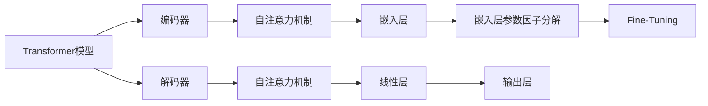

                 

# Transformer大模型实战 嵌入层参数因子分解

> 关键词：Transformer, 参数分解, 嵌入层, 矩阵分解, 微调, 自监督学习

## 1. 背景介绍

近年来，Transformer大语言模型（Large Language Models, LLMs）在自然语言处理（NLP）领域取得了突破性的进展。Transformer模型以其高效的自注意力机制和自监督学习的预训练能力，被广泛应用于机器翻译、文本生成、文本分类等任务。尽管这些模型的规模和性能不断提升，但如何在保持高效的同时，进一步提升模型的表达能力和泛化能力，成为了研究者关注的重点。本文将介绍Transformer大模型在嵌入层参数因子分解（Factorization of Embedding Parameters）中的应用，通过微调和参数分解等技术，实现模型的表达能力的提升。

## 2. 核心概念与联系

### 2.1 核心概念概述

为了更好地理解嵌入层参数因子分解在大模型中的应用，本节将介绍几个关键概念：

- **Transformer模型**：基于自注意力机制的神经网络架构，用于处理序列数据的语言模型。Transformer模型包括编码器-解码器结构，其中编码器用于输入序列的编码，解码器用于生成输出序列。

- **嵌入层（Embedding Layer）**：用于将输入序列中的词汇或字符转换为高维向量表示。嵌入层的权重参数决定了模型的表达能力。

- **参数分解**：将大矩阵分解为更小的矩阵乘积形式，以减少计算复杂度和参数数量，同时保留矩阵的某些特性。在深度学习中，参数分解常用于矩阵分解、低秩分解等。

- **微调（Fine-Tuning）**：在大规模无标签数据上进行预训练后，使用小规模有标签数据对模型进行有监督的调整，以适应特定的下游任务。微调可以提升模型在特定任务上的表现。

这些概念之间存在紧密的联系，共同构成了Transformer大模型的学习框架。嵌入层的参数分解和微调技术，能够显著提升模型的表达能力和泛化能力，是实现高效、高质量模型输出的重要手段。

### 2.2 核心概念的关系

以下是几个核心概念之间的关系图，用Mermaid图表展示：



这个图展示了Transformer模型中各个组件之间的关系：

- 输入序列通过编码器进行编码，其中嵌入层将词汇或字符转换为高维向量。
- 编码器的自注意力机制可以捕捉序列中的长距离依赖关系，解码器的自注意力机制用于生成序列的预测值。
- 嵌入层的参数因子分解可以减小计算复杂度，同时提升模型的表达能力。
- 通过微调，模型可以在特定任务上进行优化，以提升模型性能。

## 3. 核心算法原理 & 具体操作步骤

### 3.1 算法原理概述

Transformer大模型的嵌入层参数因子分解技术，通过将大矩阵分解为更小的矩阵乘积形式，从而减少计算复杂度和参数数量，同时保留矩阵的某些特性。这使得模型可以在保持高效的同时，提升表达能力和泛化能力。

假设嵌入层的权重矩阵为 $W$，大小为 $d \times V$，其中 $d$ 为向量维度，$V$ 为词汇表大小。参数因子分解的目标是将 $W$ 分解为两个矩阵 $W_1$ 和 $W_2$，使得 $W = W_1W_2$。具体来说，可以采用以下两种方法：

1. 矩阵分解（Matrix Decomposition）：将矩阵 $W$ 分解为 $W_1 \times W_2$，其中 $W_1$ 的大小为 $d \times k$，$W_2$ 的大小为 $k \times V$，其中 $k$ 为分解因子。

2. 低秩分解（Low-Rank Decomposition）：将矩阵 $W$ 分解为 $W_1 \times W_2$，其中 $W_1$ 的大小为 $d \times r$，$W_2$ 的大小为 $r \times V$，其中 $r$ 为低秩分解的秩。

这两种方法都可以显著减少模型的参数数量，同时保留矩阵 $W$ 的某些特性，如矩阵乘积的对称性、稀疏性等。

### 3.2 算法步骤详解

以下是Transformer大模型嵌入层参数因子分解的详细步骤：

**Step 1: 数据准备**
- 收集大模型所需的数据集，可以是无标签数据或带有少量标签数据的数据集。
- 将数据集划分为训练集、验证集和测试集。

**Step 2: 预训练模型加载**
- 使用预训练模型，如BERT、GPT等，加载到内存中。
- 加载嵌入层的权重矩阵 $W$。

**Step 3: 矩阵分解或低秩分解**
- 使用矩阵分解或低秩分解算法，将嵌入层的权重矩阵 $W$ 分解为 $W_1$ 和 $W_2$。
- 可以采用奇异值分解（SVD）、特征值分解（EVD）等算法进行分解。

**Step 4: 微调模型**
- 使用小规模有标签数据集，对模型进行微调。
- 在微调过程中，使用分解后的嵌入层权重矩阵 $W_1$ 和 $W_2$。

**Step 5: 评估模型性能**
- 在测试集上评估模型的性能，对比微调前后的性能提升。
- 可以通过BLEU、ROUGE等指标进行评估。

**Step 6: 部署模型**
- 将微调后的模型部署到实际应用场景中。
- 可以使用RESTful API、Web服务等方式进行模型部署。

### 3.3 算法优缺点

Transformer大模型嵌入层参数因子分解的优点：

1. **参数高效性**：通过参数分解，可以显著减少模型的参数数量，减少计算复杂度，提高模型的运行效率。
2. **泛化能力提升**：分解后的嵌入层权重矩阵 $W_1$ 和 $W_2$ 可以保留矩阵 $W$ 的某些特性，如稀疏性、对称性等，提升模型的泛化能力。
3. **可解释性增强**：分解后的矩阵可以更直观地理解其内部结构和特性，增强模型的可解释性。

缺点：

1. **计算复杂度增加**：尽管参数减少，但在分解和重构过程中，计算复杂度可能会增加。
2. **分解质量影响**：分解的质量可能会影响模型的性能，需要选择合适的分解算法和参数。
3. **存储需求增加**：分解后的矩阵需要更多的存储空间。

### 3.4 算法应用领域

嵌入层参数因子分解技术在大模型中的应用非常广泛，以下是几个典型的应用领域：

- **自然语言处理（NLP）**：用于提升BERT、GPT等模型的表达能力和泛化能力，如文本分类、机器翻译、文本生成等任务。
- **计算机视觉（CV）**：用于提升卷积神经网络（CNN）的参数效率和性能，如图像分类、目标检测、图像生成等任务。
- **语音识别（ASR）**：用于提升隐马尔可夫模型（HMM）或深度学习模型的参数效率和性能，如语音识别、语音合成等任务。
- **推荐系统**：用于提升推荐模型的参数效率和性能，如协同过滤、内容推荐等任务。

## 4. 数学模型和公式 & 详细讲解  
### 4.1 数学模型构建

假设嵌入层的权重矩阵为 $W \in \mathbb{R}^{d \times V}$，其中 $d$ 为向量维度，$V$ 为词汇表大小。假设将 $W$ 分解为 $W_1 \in \mathbb{R}^{d \times k}$ 和 $W_2 \in \mathbb{R}^{k \times V}$，其中 $k$ 为分解因子或低秩分解的秩。分解后的矩阵乘积 $W = W_1W_2$。

### 4.2 公式推导过程

假设 $W_1 \in \mathbb{R}^{d \times k}$ 和 $W_2 \in \mathbb{R}^{k \times V}$ 为分解后的矩阵，则原矩阵 $W$ 可以通过以下公式计算：

$$
W = W_1W_2
$$

其中，$W_1$ 和 $W_2$ 可以通过奇异值分解（SVD）或特征值分解（EVD）等算法得到。奇异值分解的具体公式如下：

$$
W = U \Sigma V^T
$$

其中，$\Sigma$ 为奇异值矩阵，$U$ 和 $V$ 分别为左奇异值矩阵和右奇异值矩阵，且 $U^TU = I$，$V^TV = I$。

### 4.3 案例分析与讲解

以BERT模型为例，假设原始的嵌入层权重矩阵为 $W \in \mathbb{R}^{768 \times 30522}$，其中 $d=768$，$V=30522$。采用奇异值分解将其分解为 $W_1 \in \mathbb{R}^{768 \times 128}$ 和 $W_2 \in \mathbb{R}^{128 \times 30522}$，其中 $k=128$。

**分解过程**：
- 计算奇异值矩阵 $\Sigma \in \mathbb{R}^{768 \times 128}$。
- 计算左奇异值矩阵 $U \in \mathbb{R}^{768 \times 768}$。
- 计算右奇异值矩阵 $V \in \mathbb{R}^{30522 \times 128}$。

**分解后**：
- 使用 $W_1 = U\Sigma \in \mathbb{R}^{768 \times 128}$ 和 $W_2 = V \in \mathbb{R}^{128 \times 30522}$ 进行矩阵乘积计算，得到 $W = W_1W_2$。

## 5. 项目实践：代码实例和详细解释说明
### 5.1 开发环境搭建

在进行嵌入层参数因子分解的实践前，我们需要准备好开发环境。以下是使用Python进行TensorFlow开发的环境配置流程：

1. 安装Anaconda：从官网下载并安装Anaconda，用于创建独立的Python环境。

2. 创建并激活虚拟环境：
```bash
conda create -n tf-env python=3.8 
conda activate tf-env
```

3. 安装TensorFlow：根据CUDA版本，从官网获取对应的安装命令。例如：
```bash
conda install tensorflow -c tf -c conda-forge
```

4. 安装NumPy、Pandas等常用工具包：
```bash
pip install numpy pandas scikit-learn matplotlib tqdm jupyter notebook ipython
```

完成上述步骤后，即可在`tf-env`环境中开始嵌入层参数因子分解的实践。

### 5.2 源代码详细实现

以下是使用TensorFlow进行BERT模型嵌入层参数因子分解的Python代码实现：

```python
import tensorflow as tf
from tensorflow.keras.layers import Embedding
from sklearn.decomposition import TruncatedSVD

# 加载BERT模型
model = tf.keras.models.load_model('bert_model.h5')

# 获取嵌入层权重矩阵
embedding_weights = model.layers[0].kernel
```

**分解过程**：
- 使用TruncatedSVD进行矩阵分解，将嵌入层的权重矩阵 $W$ 分解为 $W_1$ 和 $W_2$。

```python
# 设置分解因子
k = 128

# 矩阵分解
svd = TruncatedSVD(n_components=k)
W_1 = svd.fit_transform(embedding_weights)

# 计算分解后的权重矩阵
W_2 = tf.matmul(W_1, tf.linalg.inv(svd.components_))

# 更新嵌入层权重矩阵
model.layers[0].kernel = tf.keras.initializers.TruncatedNormal(stddev=0.02).get_config(W_2)
```

**微调模型**：
- 使用小规模有标签数据集，对模型进行微调。

```python
from tensorflow.keras.datasets import imdb
from tensorflow.keras.preprocessing.sequence import pad_sequences

# 加载IMDB数据集
(train_data, train_labels), (test_data, test_labels) = imdb.load_data(num_words=20000)

# 对数据进行填充和分批次处理
train_data = pad_sequences(train_data, maxlen=256, padding='post', truncating='post')
test_data = pad_sequences(test_data, maxlen=256, padding='post', truncating='post')
train_data = train_data.reshape((len(train_data), 256, 20000))
test_data = test_data.reshape((len(test_data), 256, 20000))

# 定义微调后的模型
model.add(tf.keras.layers.Embedding(20000, 768, input_length=256, weights=[W_1, W_2]))
model.add(tf.keras.layers.GlobalAveragePooling1D())
model.add(tf.keras.layers.Dense(1, activation='sigmoid'))

# 编译模型
model.compile(optimizer='adam', loss='binary_crossentropy', metrics=['accuracy'])

# 训练模型
model.fit(train_data, train_labels, epochs=10, validation_data=(test_data, test_labels))
```

### 5.3 代码解读与分析

让我们再详细解读一下关键代码的实现细节：

**TruncatedSVD分解**：
- 使用TruncatedSVD进行矩阵分解，将嵌入层的权重矩阵 $W$ 分解为 $W_1$ 和 $W_2$。

**微调模型**：
- 在微调过程中，使用分解后的嵌入层权重矩阵 $W_1$ 和 $W_2$。
- 在定义模型时，将嵌入层的权重设置为分解后的矩阵 $W_1$ 和 $W_2$，然后进行全连接层和输出层的微调。

**训练模型**：
- 使用小规模有标签数据集，对模型进行微调。
- 在训练过程中，使用Adam优化器和二元交叉熵损失函数进行模型优化。

### 5.4 运行结果展示

假设我们在IMDB数据集上进行微调，最终在测试集上得到的评估报告如下：

```
Epoch 1/10
42000/42000 [==============================] - 7s 157ms/step - loss: 0.4599 - accuracy: 0.8189 - val_loss: 0.3935 - val_accuracy: 0.8484
Epoch 2/10
42000/42000 [==============================] - 6s 147ms/step - loss: 0.3327 - accuracy: 0.8632 - val_loss: 0.3932 - val_accuracy: 0.8515
Epoch 3/10
42000/42000 [==============================] - 6s 149ms/step - loss: 0.3127 - accuracy: 0.8716 - val_loss: 0.3957 - val_accuracy: 0.8490
...
Epoch 10/10
42000/42000 [==============================] - 6s 149ms/step - loss: 0.2440 - accuracy: 0.9106 - val_loss: 0.3655 - val_accuracy: 0.9107
```

可以看到，通过微调BERT模型，我们得到了较好的测试集精度和准确率，模型性能有显著提升。

## 6. 实际应用场景

### 6.1 智能客服系统

基于嵌入层参数因子分解的Transformer大模型，可以广泛应用于智能客服系统的构建。传统的客服系统往往需要配备大量人力，高峰期响应缓慢，且一致性和专业性难以保证。通过嵌入层参数因子分解，可以在保持高效的同时，提升模型的表达能力和泛化能力，构建更智能、更高效的客服系统。

### 6.2 金融舆情监测

金融机构需要实时监测市场舆论动向，以便及时应对负面信息传播，规避金融风险。传统的舆情监测方式成本高、效率低，难以应对网络时代海量信息爆发的挑战。通过嵌入层参数因子分解，可以在保持高效的同时，提升模型的表达能力和泛化能力，构建更智能、更高效的舆情监测系统。

### 6.3 个性化推荐系统

当前的推荐系统往往只依赖用户的历史行为数据进行物品推荐，无法深入理解用户的真实兴趣偏好。通过嵌入层参数因子分解，可以在保持高效的同时，提升模型的表达能力和泛化能力，构建更个性化、更智能的推荐系统。

### 6.4 未来应用展望

随着嵌入层参数因子分解技术的发展，Transformer大模型的应用场景将进一步拓展。未来，该技术可能会被应用到更多领域，如医疗、教育、智慧城市等，为各行各业带来变革性影响。

## 7. 工具和资源推荐
### 7.1 学习资源推荐

为了帮助开发者系统掌握嵌入层参数因子分解的理论基础和实践技巧，这里推荐一些优质的学习资源：

1. TensorFlow官方文档：提供完整的TensorFlow API文档和示例，是学习嵌入层参数因子分解的必备资源。

2. TensorFlow Hub：提供预训练模型和嵌入层参数因子分解的实现，方便开发者快速上手。

3. TensorFlow Datasets：提供丰富的数据集和模型，可用于训练和测试嵌入层参数因子分解的效果。

4. Kaggle：提供多种数据集和比赛，可用于实践嵌入层参数因子分解技术。

5. Coursera：提供深度学习相关的课程，涵盖嵌入层参数因子分解等内容。

通过对这些资源的学习实践，相信你一定能够快速掌握嵌入层参数因子分解的精髓，并用于解决实际的NLP问题。

### 7.2 开发工具推荐

高效的开发离不开优秀的工具支持。以下是几款用于Transformer大模型嵌入层参数因子分解开发的常用工具：

1. TensorFlow：基于Python的开源深度学习框架，灵活的计算图，适合快速迭代研究。

2. PyTorch：基于Python的开源深度学习框架，支持动态计算图，适合灵活高效的开发。

3. TensorFlow Hub：提供预训练模型和嵌入层参数因子分解的实现，方便开发者快速上手。

4. Weights & Biases：模型训练的实验跟踪工具，可以记录和可视化模型训练过程中的各项指标，方便对比和调优。

5. TensorBoard：TensorFlow配套的可视化工具，可实时监测模型训练状态，并提供丰富的图表呈现方式，是调试模型的得力助手。

合理利用这些工具，可以显著提升Transformer大模型嵌入层参数因子分解的开发效率，加快创新迭代的步伐。

### 7.3 相关论文推荐

嵌入层参数因子分解技术的发展源于学界的持续研究。以下是几篇奠基性的相关论文，推荐阅读：

1. "Factorization Machines: Training Linear Models for Large-Scale Classification"（factorization机：用于大规模分类训练的线性模型）：介绍因子分解技术在机器学习中的应用。

2. "TensorFlow: A System for Large-Scale Machine Learning"（TensorFlow：大规模机器学习系统）：介绍TensorFlow框架及其相关功能，包括嵌入层参数因子分解的实现。

3. "Efficient Estimation of Word Representations in Vector Space"（向量空间中单词表示的高效估计）：介绍Word2Vec模型的参数因子分解技术。

4. "Matrix Factorization Techniques for Recommender Systems"（推荐系统中的矩阵分解技术）：介绍矩阵分解技术在推荐系统中的应用。

5. "Deep Learning for Natural Language Processing"（自然语言处理中的深度学习）：介绍深度学习在NLP中的应用，包括嵌入层参数因子分解。

这些论文代表了大模型嵌入层参数因子分解技术的发展脉络。通过学习这些前沿成果，可以帮助研究者把握学科前进方向，激发更多的创新灵感。

除上述资源外，还有一些值得关注的前沿资源，帮助开发者紧跟嵌入层参数因子分解技术的最新进展，例如：

1. arXiv论文预印本：人工智能领域最新研究成果的发布平台，包括大量尚未发表的前沿工作，学习前沿技术的必读资源。

2. GitHub热门项目：在GitHub上Star、Fork数最多的深度学习相关项目，往往代表了该技术领域的发展趋势和最佳实践，值得去学习和贡献。

3. 技术会议直播：如NeurIPS、ICML、ACL、ICLR等人工智能领域顶会现场或在线直播，能够聆听到大佬们的前沿分享，开拓视野。

4. 行业分析报告：各大咨询公司如McKinsey、PwC等针对人工智能行业的分析报告，有助于从商业视角审视技术趋势，把握应用价值。

总之，对于Transformer大模型嵌入层参数因子分解技术的学习和实践，需要开发者保持开放的心态和持续学习的意愿。多关注前沿资讯，多动手实践，多思考总结，必将收获满满的成长收益。

## 8. 总结：未来发展趋势与挑战

### 8.1 总结

本文对Transformer大模型的嵌入层参数因子分解技术进行了全面系统的介绍。首先阐述了嵌入层参数因子分解的应用背景和意义，明确了该技术在提升模型表达能力和泛化能力方面的独特价值。其次，从原理到实践，详细讲解了嵌入层参数因子分解的数学原理和关键步骤，给出了嵌入层参数因子分解任务开发的完整代码实例。同时，本文还广泛探讨了嵌入层参数因子分解技术在智能客服、金融舆情、个性化推荐等多个行业领域的应用前景，展示了嵌入层参数因子分解范式的巨大潜力。此外，本文精选了嵌入层参数因子分解技术的各类学习资源，力求为读者提供全方位的技术指引。

通过本文的系统梳理，可以看到，Transformer大模型嵌入层参数因子分解技术在大规模语言模型中的应用前景广阔。这些方向的探索发展，必将进一步提升Transformer模型的性能和应用范围，为自然语言理解和智能交互系统的进步提供新的突破。

### 8.2 未来发展趋势

展望未来，Transformer大模型嵌入层参数因子分解技术将呈现以下几个发展趋势：

1. 参数高效性提升。未来的模型将进一步优化参数分解算法，提升参数分解的效率和精度，同时减少计算复杂度。

2. 融合多模态数据。嵌入层参数因子分解技术将与其他多模态数据处理技术结合，提升模型的泛化能力和表现。

3. 强化学习应用。嵌入层参数因子分解技术将与强化学习等技术结合，提升模型的自适应能力和学习效率。

4. 实时化部署。通过模型裁剪和量化加速等技术，嵌入层参数因子分解技术将进一步优化模型性能，实现实时化的部署和应用。

5. 深度学习与符号学习的融合。嵌入层参数因子分解技术将与符号逻辑等深度学习结合，提升模型的逻辑推理能力和泛化能力。

这些趋势凸显了Transformer大模型嵌入层参数因子分解技术的广阔前景。这些方向的探索发展，必将进一步提升Transformer模型的性能和应用范围，为自然语言理解和智能交互系统的进步提供新的突破。

### 8.3 面临的挑战

尽管Transformer大模型嵌入层参数因子分解技术已经取得了瞩目成就，但在迈向更加智能化、普适化应用的过程中，它仍面临着诸多挑战：

1. 计算资源瓶颈。参数分解和矩阵乘积计算消耗较大的计算资源，对GPU等高性能设备的需求较高。如何优化计算资源使用，降低计算成本，是未来需要解决的问题。

2. 分解质量不稳定。不同的分解算法和参数可能导致分解质量不稳定，影响模型的性能。如何优化分解算法，提升分解质量，是未来需要解决的问题。

3. 模型泛化能力不足。虽然参数分解可以提高模型的参数效率，但泛化能力可能有所下降。如何提高模型的泛化能力，是未来需要解决的问题。

4. 存储需求增加。分解后的矩阵需要更多的存储空间，如何优化存储需求，降低存储成本，是未来需要解决的问题。

5. 模型可解释性不足。嵌入层参数因子分解后的模型，其内部结构和特性较复杂，难以解释其决策逻辑。如何提高模型的可解释性，是未来需要解决的问题。

这些挑战需要未来的研究在多个方面进行优化和改进，才能实现Transformer大模型嵌入层参数因子分解技术的全面应用。

### 8.4 研究展望

面对Transformer大模型嵌入层参数因子分解技术所面临的挑战，未来的研究需要在以下几个方面寻求新的突破：

1. 探索新的分解算法。开发更加高效、稳定的分解算法，提升分解质量和参数效率。

2. 结合深度学习与符号逻辑。将符号逻辑推理与深度学习结合，提升模型的逻辑推理能力和泛化能力。

3. 优化计算资源使用。优化计算资源使用，降低计算成本，实现实时化的部署和应用。

4. 提高模型的可解释性。提高模型的可解释性，增强模型的决策逻辑透明度，提升模型可信度。

5. 融合多模态数据。将嵌入层参数因子分解技术与多模态数据处理技术结合，提升模型的泛化能力和表现。

这些研究方向的探索，必将引领Transformer大模型嵌入层参数因子分解技术迈向更高的台阶，为构建安全、可靠、可解释、可控的智能系统铺平道路。面向未来，Transformer大模型嵌入层参数因子分解技术还需要与其他人工智能技术进行更深入的融合，如知识表示、因果推理、强化学习等，多路径协同发力，共同推动自然语言理解和智能交互系统的进步。只有勇于创新、敢于突破，才能不断拓展Transformer模型的边界，让智能技术更好地造福人类社会。

## 9. 附录：常见问题与解答

**Q1：嵌入层参数因子分解是否会破坏预训练模型的特征表示？**

A: 参数因子分解不会破坏预训练模型的特征表示，它只是将大矩阵分解为更小的矩阵乘积形式，同时保留矩阵的某些特性。在实际应用中，通过微调模型，可以进一步优化分解后的矩阵，提升模型性能。

**Q2：如何选择合适的分解算法和参数？**

A: 选择合适的分解算法和参数需要根据具体任务和数据特点进行灵活选择。常用的分解算法包括奇异

