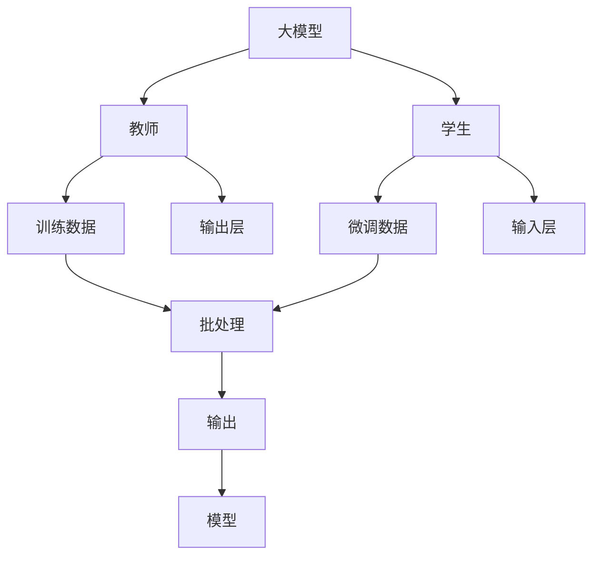
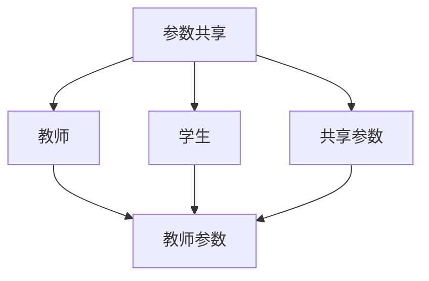
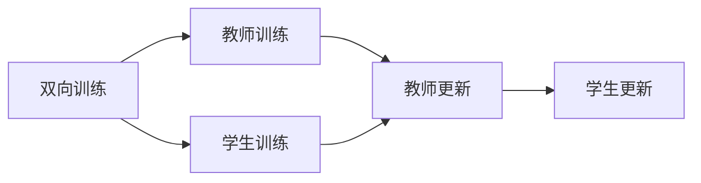
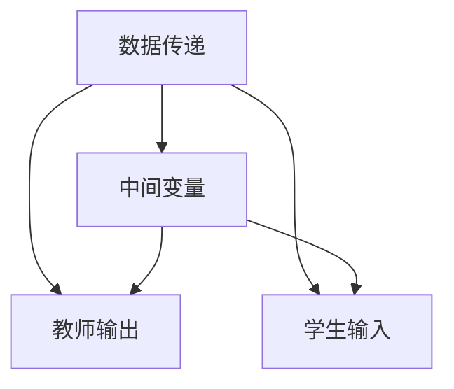
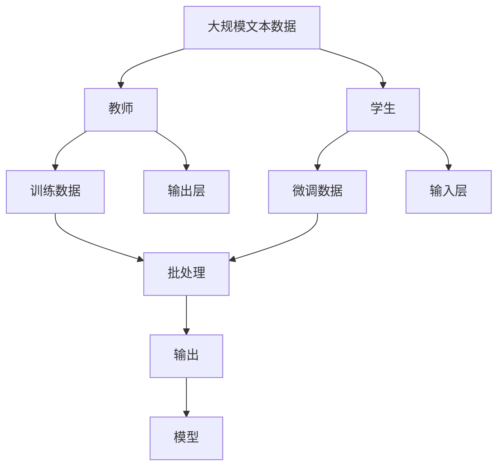

                 

# Transformer大模型实战 教师 学生架构

## 1. 背景介绍

### 1.1 问题由来
Transformer大模型作为自然语言处理(NLP)领域的代表性技术，近年来在各种任务上取得了显著的突破，如机器翻译、文本摘要、问答系统等。但大模型的使用也带来了诸多挑战，如资源消耗巨大、计算密集度高、推理速度慢等。

为应对这些问题，需要在大模型架构上进行优化，以在保证性能的同时降低资源消耗。教师和学生架构(Teacher-Student Architecture)正是一种针对大模型进行优化的方法，旨在通过分层训练和参数共享，减少大模型的资源占用和推理延迟。

### 1.2 问题核心关键点
教师和学生架构的核心思想是将大模型分为教师(Trainer)和学生(Student)两部分。教师负责处理较长的上下文序列，学生负责处理较短的上下文序列。教师的输出被学生作为输入，学生根据教师的输出进行微调，最终输出完整的答案。

该架构的关键点包括：
- 大模型的分层架构：将大模型划分为教师和学生两部分，分别进行参数优化。
- 参数共享：教师和学生共享部分参数，减少模型资源占用。
- 双向训练：教师和学生交替进行训练，提高模型的收敛速度。
- 数据传递：教师和学生之间通过中间变量传递信息，实现信息流的传递和融合。

### 1.3 问题研究意义
优化大模型的教师和学生架构，对于降低模型资源消耗、提升推理速度、提高模型性能具有重要意义：

1. 资源优化：通过分层训练和参数共享，减少大模型的资源占用，使模型可以在有限的计算资源下运行。
2. 性能提升：教师和学生交替训练，可以更快地收敛，提高模型的预测精度和推理速度。
3. 适应性增强：通过分层优化，可以更好地适应不同任务需求，提升模型的泛化能力。
4. 高效部署：教师和学生架构使模型更易于部署和维护，适合实际应用场景。
5. 技术革新：该架构促进了对大模型优化技术的研究，推动了NLP技术的不断发展。

## 2. 核心概念与联系

### 2.1 核心概念概述

为更好地理解教师和学生架构，本节将介绍几个密切相关的核心概念：

- 大模型(Transformer)：一种基于自注意力机制的深度神经网络，能够自动学习语言表示，广泛应用于各种NLP任务。

- 教师(Trainer)：在大模型中，教师负责处理较长的上下文序列，是整个架构的主导部分。

- 学生(Student)：在大模型中，学生负责处理较短的上下文序列，通过教师的输出进行微调。

- 参数共享(Shared Parameters)：教师和学生共享部分参数，减少模型资源占用。

- 双向训练(Bi-directional Training)：教师和学生交替进行训练，提高模型的收敛速度。

- 数据传递(Parameter Passing)：教师和学生之间通过中间变量传递信息，实现信息流的传递和融合。

这些核心概念之间的逻辑关系可以通过以下Mermaid流程图来展示：



这个流程图展示了教师和学生架构的基本结构：

1. 大模型由教师和学生两部分组成，教师负责处理输入数据。
2. 教师的输出作为学生的输入，学生通过微调进行优化。
3. 教师和学生共享部分参数，减少资源占用。
4. 教师和学生交替进行训练，提高模型收敛速度。
5. 模型通过教师和学生的联合输出，形成完整的答案。

### 2.2 概念间的关系

这些核心概念之间存在着紧密的联系，形成了教师和学生架构的完整生态系统。下面我通过几个Mermaid流程图来展示这些概念之间的关系。

#### 2.2.1 大模型的学习范式


这个流程图展示了大模型中教师和学生架构的基本学习范式：

1. 大模型由教师和学生两部分组成，教师负责处理输入数据。
2. 教师的输出作为学生的输入，学生通过微调进行优化。
3. 教师和学生共享部分参数，减少资源占用。
4. 教师和学生交替进行训练，提高模型收敛速度。
5. 模型通过教师和学生的联合输出，形成完整的答案。

#### 2.2.2 参数共享的优化方法



这个流程图展示了参数共享在大模型中的应用：

1. 教师和学生共享部分参数，减少资源占用。
2. 共享参数的教师和学生使用相同的参数更新方式。
3. 教师和学生共享的参数是教师和学生模型的公共部分。

#### 2.2.3 双向训练的优化方法



这个流程图展示了教师和学生双向训练的过程：

1. 教师和学生交替进行训练，提高模型收敛速度。
2. 教师先进行训练，学生接着进行训练。
3. 教师的输出作为学生的输入，学生通过微调进行优化。

#### 2.2.4 数据传递的方法



这个流程图展示了教师和学生之间数据传递的方式：

1. 教师的输出作为学生的输入。
2. 教师和学生之间通过中间变量传递信息。
3. 教师和学生之间的信息流是单向的。

### 2.3 核心概念的整体架构

最后，我们用一个综合的流程图来展示这些核心概念在大模型教师和学生架构中的整体架构：



这个综合流程图展示了从预训练到微调，再到学生训练的完整过程。大模型首先在大规模文本数据上进行预训练，然后通过教师进行微调，学生进行优化。最后，通过双向训练，教师和学生联合输出，形成完整的答案。

## 3. 核心算法原理 & 具体操作步骤
### 3.1 算法原理概述

教师和学生架构是一种针对大模型进行优化的策略，其核心思想是将大模型分为教师和学生两部分，教师负责处理较长的上下文序列，学生负责处理较短的上下文序列。教师的输出被学生作为输入，学生根据教师的输出进行微调，最终输出完整的答案。

教师和学生架构的具体原理如下：

1. 大模型由教师和学生两部分组成，教师负责处理较长的上下文序列，学生负责处理较短的上下文序列。
2. 教师的输出作为学生的输入，学生通过微调进行优化。
3. 教师和学生共享部分参数，减少模型资源占用。
4. 教师和学生交替进行训练，提高模型的收敛速度。
5. 模型通过教师和学生的联合输出，形成完整的答案。

形式化地，假设大模型为 $M$，其中 $M=(M_T, M_S)$，$M_T$ 为教师模型，$M_S$ 为学生模型。给定训练数据集 $D=\{(x_i,y_i)\}_{i=1}^N, x_i \in \mathcal{X}, y_i \in \mathcal{Y}$，教师和学生架构的优化目标是最小化经验风险，即找到最优参数：

$$
\hat{\theta}=\mathop{\arg\min}_{\theta} \mathcal{L}(\theta)
$$

其中 $\mathcal{L}$ 为针对任务 $T$ 设计的损失函数，用于衡量模型预测输出与真实标签之间的差异。常见的损失函数包括交叉熵损失、均方误差损失等。

### 3.2 算法步骤详解

教师和学生架构的微调过程包括以下几个关键步骤：

**Step 1: 准备教师和学生模型**
- 选择合适的预训练语言模型 $M$ 作为初始化参数，如 BERT、GPT 等。
- 将模型分为教师和学生两部分，根据任务需求设计相应的网络结构。
- 设置教师和学生的共享参数。

**Step 2: 添加任务适配层**
- 根据任务类型，在教师和学生顶层设计合适的输出层和损失函数。
- 对于分类任务，通常在顶层添加线性分类器和交叉熵损失函数。
- 对于生成任务，通常使用语言模型的解码器输出概率分布，并以负对数似然为损失函数。

**Step 3: 设置微调超参数**
- 选择合适的优化算法及其参数，如 AdamW、SGD 等，设置学习率、批大小、迭代轮数等。
- 设置正则化技术及强度，包括权重衰减、Dropout、Early Stopping 等。
- 确定冻结预训练参数的策略，如仅微调顶层，或全部参数都参与微调。

**Step 4: 执行双向训练**
- 将训练集数据分批次输入教师和学生模型，前向传播计算损失函数。
- 反向传播计算教师和学生的参数梯度，根据设定的优化算法和学习率更新模型参数。
- 周期性在验证集上评估模型性能，根据性能指标决定是否触发 Early Stopping。
- 重复上述步骤直到满足预设的迭代轮数或 Early Stopping 条件。

**Step 5: 测试和部署**
- 在测试集上评估教师和学生架构的微调后模型 $M_{\hat{\theta}}$ 的性能，对比微调前后的精度提升。
- 使用微调后的模型对新样本进行推理预测，集成到实际的应用系统中。
- 持续收集新的数据，定期重新微调模型，以适应数据分布的变化。

以上是教师和学生架构微调大模型的一般流程。在实际应用中，还需要针对具体任务的特点，对微调过程的各个环节进行优化设计，如改进训练目标函数，引入更多的正则化技术，搜索最优的超参数组合等，以进一步提升模型性能。

### 3.3 算法优缺点

教师和学生架构作为一种针对大模型进行优化的策略，具有以下优点：

1. 减少资源占用：通过分层训练和参数共享，减少大模型的资源占用，使模型可以在有限的计算资源下运行。
2. 提高推理速度：教师和学生交替进行训练，可以更快地收敛，提高模型的推理速度。
3. 提升模型性能：教师和学生架构使模型更好地适应不同任务需求，提升模型的泛化能力。
4. 易于部署：教师和学生架构使模型更易于部署和维护，适合实际应用场景。
5. 技术创新：该架构促进了对大模型优化技术的研究，推动了NLP技术的不断发展。

同时，该架构也存在一定的局限性：

1. 教师和学生的接口设计复杂：教师和学生之间的接口设计需要考虑数据传递和信息融合等问题，增加了架构设计的难度。
2. 计算开销增加：教师和学生之间的数据传递和信息融合需要额外的计算开销，增加了模型的资源消耗。
3. 双模型间的协同训练：教师和学生之间的协同训练需要更多的实验和调试，增加了微调的复杂度。

尽管存在这些局限性，但就目前而言，教师和学生架构仍是大模型应用的重要范式。未来相关研究的重点在于如何进一步降低计算开销，提高协同训练的效率，同时兼顾可解释性和伦理安全性等因素。

### 3.4 算法应用领域

教师和学生架构在NLP领域已经得到了广泛的应用，覆盖了几乎所有常见任务，例如：

- 文本分类：如情感分析、主题分类、意图识别等。通过教师和学生架构，可以在较短的文本上下文内进行微调，提升分类效果。
- 命名实体识别：识别文本中的人名、地名、机构名等特定实体。通过教师和学生架构，可以更快地收敛，提升实体识别的准确率。
- 关系抽取：从文本中抽取实体之间的语义关系。通过教师和学生架构，可以更好地处理长文本序列，提升关系抽取的准确率。
- 问答系统：对自然语言问题给出答案。通过教师和学生架构，可以更好地处理多轮对话历史，提升回答的准确性和流畅性。
- 机器翻译：将源语言文本翻译成目标语言。通过教师和学生架构，可以更好地处理长文本序列，提升翻译质量。
- 文本摘要：将长文本压缩成简短摘要。通过教师和学生架构，可以更好地处理长文本序列，提升摘要的质量。
- 对话系统：使机器能够与人自然对话。通过教师和学生架构，可以更好地处理多轮对话历史，提升对话的流畅性和准确性。

除了上述这些经典任务外，教师和学生架构也被创新性地应用到更多场景中，如可控文本生成、常识推理、代码生成、数据增强等，为NLP技术带来了全新的突破。随着预训练模型和微调方法的不断进步，相信NLP技术将在更广阔的应用领域大放异彩。

## 4. 数学模型和公式 & 详细讲解 & 举例说明
### 4.1 数学模型构建

本节将使用数学语言对教师和学生架构的微调过程进行更加严格的刻画。

记大模型为 $M=(M_T, M_S)$，其中 $M_T$ 为教师模型，$M_S$ 为学生模型。假设微调任务的训练集为 $D=\{(x_i,y_i)\}_{i=1}^N, x_i \in \mathcal{X}, y_i \in \mathcal{Y}$。

定义教师模型 $M_T$ 在数据样本 $(x,y)$ 上的损失函数为 $\ell_{T}(M_{T}(x),y)$，学生模型 $M_S$ 在数据样本 $(x,y)$ 上的损失函数为 $\ell_{S}(M_{S}(M_{T}(x)),y)$，则在大模型 $M$ 上，经验风险为：

$$
\mathcal{L}(\theta)=\frac{1}{N}\sum_{i=1}^{N}\left[\ell_{T}(M_{T}(x_i),y_i)+\ell_{S}(M_{S}(M_{T}(x_i)),y_i)\right]
$$

微调的优化目标是最小化经验风险，即找到最优参数：

$$
\hat{\theta}=\mathop{\arg\min}_{\theta} \mathcal{L}(\theta)
$$

在实践中，我们通常使用基于梯度的优化算法（如SGD、Adam等）来近似求解上述最优化问题。设 $\eta$ 为学习率，$\lambda$ 为正则化系数，则参数的更新公式为：

$$
\theta \leftarrow \theta - \eta \nabla_{\theta}\mathcal{L}(\theta) - \eta\lambda\theta
$$

其中 $\nabla_{\theta}\mathcal{L}(\theta)$ 为损失函数对参数 $\theta$ 的梯度，可通过反向传播算法高效计算。

### 4.2 公式推导过程

以下我们以二分类任务为例，推导交叉熵损失函数及其梯度的计算公式。

假设教师模型 $M_T$ 在输入 $x$ 上的输出为 $\hat{y}_T=M_{T}(x) \in [0,1]$，表示样本属于正类的概率。真实标签 $y \in \{0,1\}$。则二分类交叉熵损失函数定义为：

$$
\ell_{T}(M_{T}(x),y) = -[y\log \hat{y}_T + (1-y)\log (1-\hat{y}_T)]
$$

同理，学生模型 $M_S$ 在教师模型输出上的输出为 $\hat{y}_S=M_{S}(M_{T}(x)) \in [0,1]$，则二分类交叉熵损失函数定义为：

$$
\ell_{S}(M_{S}(M_{T}(x)),y) = -[y\log \hat{y}_S + (1-y)\log (1-\hat{y}_S)]
$$

将以上两个损失函数代入总损失函数，得：

$$
\mathcal{L}(\theta)=\frac{1}{N}\sum_{i=1}^{N}\left[-y_i\log \hat{y}_{T_i} - (1-y_i)\log (1-\hat{y}_{T_i}) - y_i\log \hat{y}_{S_i} - (1-y_i)\log (1-\hat{y}_{S_i})\right]
$$

根据链式法则，损失函数对参数 $\theta$ 的梯度为：

$$
\frac{\partial \mathcal{L}(\theta)}{\partial \theta} = \frac{1}{N}\sum_{i=1}^{N} \left( \frac{\partial \ell_{T}(M_{T}(x_i),y_i)}{\partial \theta} + \frac{\partial \ell_{S}(M_{S}(M_{T}(x_i)),y_i)}{\partial \theta} \right)
$$

其中，教师和学生模型的梯度计算公式分别为：

$$
\frac{\partial \ell_{T}(M_{T}(x_i),y_i)}{\partial \theta} = -y_i\frac{\partial \hat{y}_{T_i}}{\partial \theta} - (1-y_i)\frac{\partial (1-\hat{y}_{T_i})}{\partial \theta}
$$

$$
\frac{\partial \ell_{S}(M_{S}(M_{T}(x_i)),y_i)}{\partial \theta} = -y_i\frac{\partial \hat{y}_{S_i}}{\partial \theta} - (1-y_i)\frac{\partial (1-\hat{y}_{S_i})}{\partial \theta}
$$

在得到损失函数的梯度后，即可带入参数更新公式，完成模型的迭代优化。重复上述过程直至收敛，最终得到适应下游任务的最优模型参数 $\theta^*$。

## 5. 项目实践：代码实例和详细解释说明
### 5.1 开发环境搭建

在进行教师和学生架构微调实践前，我们需要准备好开发环境。以下是使用Python进行PyTorch开发的环境配置流程：

1. 安装Anaconda：从官网下载并安装Anaconda，用于创建独立的Python环境。

2. 创建并激活虚拟环境：
```bash
conda create -n pytorch-env python=3.8 
conda activate pytorch-env
```

3. 安装PyTorch：根据CUDA版本，从官网获取对应的安装命令。例如：
```bash
conda install pytorch torchvision torchaudio cudatoolkit=11.1 -c pytorch -c conda-forge
```

4. 安装Transformers库：
```bash
pip install transformers
```

5. 安装各类工具包：
```bash
pip install numpy pandas scikit-learn matplotlib tqdm jupyter notebook ipython
```

完成上述步骤后，即可在`pytorch-env`环境中开始微调实践。

### 5.2 源代码详细实现

下面我们以命名实体识别(NER)任务为例，给出使用Transformers库对BERT模型进行教师和学生架构微调的PyTorch代码实现。

首先，定义NER任务的数据处理函数：

```python
from transformers import BertTokenizer
from torch.utils.data import Dataset
import torch

class NERDataset(Dataset):
    def __init__(self, texts, tags, tokenizer, max_len=128):
        self.texts = texts
        self.tags = tags
        self.tokenizer = tokenizer
        self.max_len = max_len
        
    def __len__(self):
        return len(self.texts)
    
    def __getitem__(self, item):
        text = self.texts[item]
        tags = self.tags[item]
        
        encoding = self.tokenizer(text, return_tensors='pt', max_length=self.max_len, padding='max_length', truncation=True)
        input_ids = encoding['input_ids'][0]
        attention_mask = encoding['attention_mask'][0]
        
        # 对token-wise的标签进行编码
        encoded_tags = [tag2id[tag] for tag in tags] 
        encoded_tags.extend([tag2id['O']] * (self.max_len - len(encoded_tags)))
        labels = torch.tensor(encoded_tags, dtype=torch.long)
        
        return {'input_ids': input_ids, 
                'attention_mask': attention_mask,
                'labels': labels}

# 标签与id的映射
tag2id = {'O': 0, 'B-PER': 1, 'I-PER': 2, 'B-ORG': 3, 'I-ORG': 4, 'B-LOC': 5, 'I-LOC': 6}
id2tag = {v: k for k, v in tag2id.items()}

# 创建dataset
tokenizer = BertTokenizer.from_pretrained('bert-base-cased')

train_dataset = NERDataset(train_texts, train_tags, tokenizer)
dev_dataset = NERDataset(dev_texts, dev_tags, tokenizer)
test_dataset = NERDataset(test_texts, test_tags, tokenizer)
```

然后，定义教师和学生模型：

```python
from transformers import BertForTokenClassification, BertModel

teacher_model = BertForTokenClassification.from_pretrained('bert-base-cased', num_labels=len(tag2id))

# 教师模型去掉了分类层，仅保留Embedding层
teacher_model = teacher_model.config.num_labels = 0
teacher_model = teacher_model.config.hidden_size = 768
teacher_model = teacher_model.config.num_hidden_layers = 12
teacher_model = teacher_model.config.attention_probs_dropout_prob = 0
teacher_model = teacher_model.config.hidden_act = 'gelu'
teacher_model = teacher_model.config.layer_norm_eps = 1e-12

# 学生模型为原始BERT模型，添加分类层
student_model = BertModel.from_pretrained('bert-base-cased')

# 设置共享参数，将学生模型的Embedding层和teacher_model的Embedding层共享
for param in teacher_model.parameters():
    if isinstance(param, torch.Tensor) and param.dim() == 768:
        student_model.Embedding.weight = param

# 学生模型添加分类层
student_model.classifier.weight = torch.nn.Linear(768, len(tag2id))
student_model.classifier.bias = torch.nn.Parameter(torch.zeros(len(tag2id)))
```

接着，定义训练和评估函数：

```python
from torch.utils.data import DataLoader
from tqdm import tqdm
from sklearn.metrics import classification_report

device = torch.device('cuda') if torch.cuda.is_available() else torch.device('cpu')
teacher_model.to(device)
student_model.to(device)

def train_epoch(teacher_model, student_model, dataset, batch_size, optimizer):
    dataloader = DataLoader(dataset, batch_size=batch_size, shuffle=True)
    teacher_model.train()
    student_model.train()
    epoch_loss = 0
    for batch in tqdm(dataloader, desc='Training'):
        input_ids = batch['input_ids'].to(device)
        attention_mask = batch['attention_mask'].to(device)
        labels = batch['labels'].to(device)
        teacher_model.zero_grad()
        outputs = teacher_model(input_ids, attention_mask=attention_mask)
        loss_t = outputs.loss
        epoch_loss += loss_t.item()
        loss_t.backward()
        optimizer.step()
        
        student_model.zero_grad()
        outputs = student_model(outputs.last_hidden_state, attention_mask=attention_mask)
        loss_s = outputs.loss
        epoch_loss += loss_s.item()
        loss_s.backward()
        optimizer.step()
    return epoch_loss / len(dataloader)

def evaluate(teacher_model, student_model, dataset, batch_size):
    dataloader = DataLoader(dataset, batch_size=batch_size)
    teacher_model.eval()
    student_model.eval()
    preds, labels = [], []
    with torch.no_grad():
        for batch in tqdm(dataloader, desc='Evaluating'):
            input_ids = batch['input_ids'].to(device)
            attention_mask = batch['attention_mask'].to(device)
            batch_labels = batch['labels']
            teacher_outputs = teacher_model(input_ids, attention_mask=attention_mask)
            student_outputs = student_model(teacher_outputs.last_hidden_state, attention_mask=attention_mask)
            batch_preds = student_outputs.logits.argmax(dim=2).to('cpu').tolist()
            batch_labels = batch_labels.to('cpu').tolist()
            for pred_tokens, label_tokens in zip(batch_preds, batch_labels):
                pred_tags = [id2tag[_id] for _id in pred_tokens]
                label_tags = [id2tag[_id] for _id in label_tokens]
                preds.append(pred_tags[:len(label_tags)])
                labels.append(label_tags)
                
    print(classification_report(labels, preds))
```

最后，启动训练流程并在测试集上评估：

```python
epochs = 5
batch_size = 16

for epoch in range(epochs):
    loss

