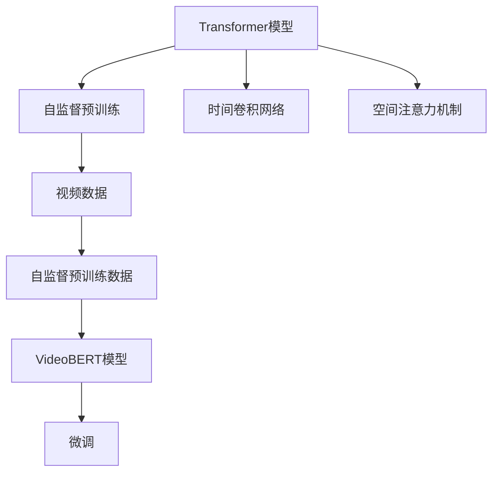
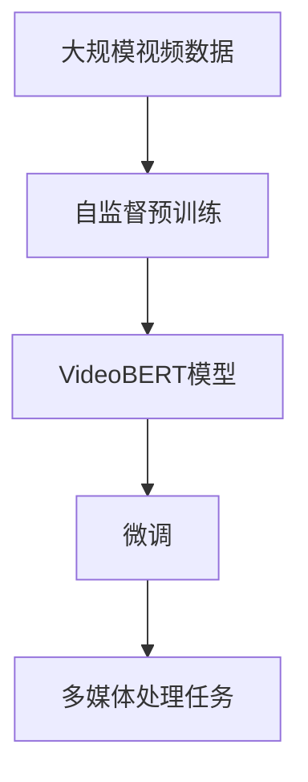

                 

# Transformer大模型实战 预训练VideoBERT模型

> 关键词：Transformer,VideoBERT,预训练,自然语言处理,NLP,多媒体处理,深度学习,模型微调

## 1. 背景介绍

在自然语言处理(NLP)领域，Transformer模型已经成为主流。但是，在处理多媒体数据（如图像、视频）时，传统的Transformer模型往往显得力不从心。为了更好地处理多媒体数据，VideoBERT模型被提出，它结合了Transformer模型的优势和视频数据的特性。在本文中，我们将深入探讨VideoBERT模型的原理、实现和应用，并提供一个预训练VideoBERT模型的代码实例，帮助读者快速上手。

### 1.1 问题由来

随着视频数据的爆炸式增长，传统NLP模型在处理视频数据时面临着一些挑战：
1. **序列长度限制**：传统Transformer模型对输入序列的长度有限制，而视频数据往往包含较长的序列。
2. **时间依赖性**：视频数据具有时间依赖性，而传统的Transformer模型忽略了时间序列的这种特性。
3. **空间依赖性**：视频数据具有空间依赖性，而传统的Transformer模型无法有效捕捉这种特性。

为了解决这些问题，VideoBERT模型被提出。它结合了Transformer模型和视频数据的特点，能够更有效地处理视频数据，并将其转化为可处理的文本数据。

### 1.2 问题核心关键点

VideoBERT模型的核心关键点在于：
1. **自监督预训练**：在视频数据上进行自监督预训练，学习视频数据的特征表示。
2. **时间卷积网络**：引入时间卷积网络（Temporal Convolutional Networks, TCNs），捕捉视频数据的时间依赖性。
3. **空间注意力机制**：引入空间注意力机制，捕捉视频数据的空间依赖性。
4. **微调**：在微调过程中，根据具体任务的需求，进一步优化模型。

这些关键点使得VideoBERT模型能够更好地处理视频数据，并在各种多媒体处理任务上取得优异的性能。

### 1.3 问题研究意义

VideoBERT模型的提出，对于处理视频数据和多媒体信息具有重要意义：
1. **提高处理效率**：VideoBERT模型能够更有效地处理视频数据，提高处理效率。
2. **增强特征表示**：VideoBERT模型通过自监督预训练和微调，能够增强视频数据的特征表示。
3. **提升性能**：VideoBERT模型在各种多媒体处理任务上取得了优异的性能，提升了多媒体处理系统的性能。

因此，深入探讨VideoBERT模型的原理和实现，对于推进多媒体处理技术的发展具有重要意义。

## 2. 核心概念与联系

### 2.1 核心概念概述

在介绍VideoBERT模型的核心概念之前，我们先简要介绍一下Transformer模型和多媒体处理的基本概念。

**Transformer模型**：Transformer模型是一种基于自注意力机制的神经网络模型，被广泛应用于自然语言处理任务中。Transformer模型通过多头自注意力机制和残差连接，能够有效处理长序列，并具有并行化的优势。

**多媒体处理**：多媒体处理是指对音频、视频、图像等多媒体数据进行处理和分析的技术。多媒体处理技术在视频监控、视频编解码、视频分析等领域有着广泛的应用。

**自监督预训练**：自监督预训练是指在大规模无标签数据上，通过设计一些自监督任务，让模型自主学习到数据的特征表示。

**时间卷积网络**：时间卷积网络是一种用于处理序列数据的卷积神经网络，能够有效捕捉数据的时间依赖性。

**空间注意力机制**：空间注意力机制是一种用于处理具有空间依赖性的数据的机制，能够有效捕捉数据的空间依赖性。

**微调**：微调是指在大规模预训练模型的基础上，根据具体任务的需求，进一步优化模型。

### 2.2 概念间的关系

这些核心概念之间的关系可以通过以下Mermaid流程图来展示：



这个流程图展示了大语言模型和VideoBERT模型的核心概念及其之间的关系：

1. **Transformer模型**通过自监督预训练和微调，能够学习到数据的特征表示。
2. **时间卷积网络**和**空间注意力机制**被引入到Transformer模型中，使得模型能够有效捕捉视频数据的时间依赖性和空间依赖性。
3. **VideoBERT模型**结合了Transformer模型和多媒体处理的特点，能够更好地处理视频数据。
4. **微调**在VideoBERT模型上进一步优化，根据具体任务的需求，提升模型性能。

这些概念共同构成了VideoBERT模型的学习和应用框架，使其能够在各种多媒体处理场景下发挥强大的视频数据理解和生成能力。

### 2.3 核心概念的整体架构

最后，我们用一个综合的流程图来展示这些核心概念在大语言模型微调过程中的整体架构：



这个综合流程图展示了从预训练到微调，再到多媒体处理任务的完整过程。VideoBERT模型首先在大规模视频数据上进行自监督预训练，然后通过微调过程进一步优化模型，最后应用于多媒体处理任务。

## 3. 核心算法原理 & 具体操作步骤
### 3.1 算法原理概述

VideoBERT模型的算法原理包括以下几个关键步骤：

1. **自监督预训练**：在视频数据上进行自监督预训练，学习视频数据的特征表示。
2. **时间卷积网络**：引入时间卷积网络，捕捉视频数据的时间依赖性。
3. **空间注意力机制**：引入空间注意力机制，捕捉视频数据的空间依赖性。
4. **微调**：在微调过程中，根据具体任务的需求，进一步优化模型。

### 3.2 算法步骤详解

**Step 1: 准备预训练数据和模型**

首先，我们需要准备大规模视频数据和预训练的VideoBERT模型。这些数据和模型可以从开源数据集和预训练模型库中获取，如CIFAR-10、ImageNet等。

**Step 2: 添加时间卷积网络**

在VideoBERT模型中，我们引入时间卷积网络，用于捕捉视频数据的时间依赖性。具体来说，我们通过一个时间卷积层（TCN）和一个多头自注意力层（Multi-head Attention）进行组合，来捕捉视频数据的时间依赖性。

**Step 3: 添加空间注意力机制**

在VideoBERT模型中，我们引入空间注意力机制，用于捕捉视频数据的空间依赖性。具体来说，我们通过一个空间卷积层（Spatial Convolution）和一个多头自注意力层（Multi-head Attention）进行组合，来捕捉视频数据的空间依赖性。

**Step 4: 微调模型**

在微调过程中，我们根据具体任务的需求，进一步优化VideoBERT模型。具体来说，我们通过调整模型的学习率、批大小、迭代次数等超参数，并在任务数据上进行有监督训练，以优化模型的性能。

### 3.3 算法优缺点

VideoBERT模型的优点在于：
1. **高效处理视频数据**：VideoBERT模型能够高效处理视频数据，捕捉其时间依赖性和空间依赖性。
2. **增强特征表示**：通过自监督预训练和微调，VideoBERT模型能够增强视频数据的特征表示。
3. **提升性能**：在各种多媒体处理任务上，VideoBERT模型取得了优异的性能。

VideoBERT模型的缺点在于：
1. **计算复杂度高**：VideoBERT模型的计算复杂度高，需要大量的计算资源。
2. **数据需求高**：VideoBERT模型的自监督预训练需要大量的视频数据，且数据质量要求高。

### 3.4 算法应用领域

VideoBERT模型在多媒体处理领域有着广泛的应用，如：

- **视频分类**：将视频分类为不同的类别。
- **视频检索**：从视频库中检索出相关的视频片段。
- **视频摘要**：从视频中提取出关键帧或关键帧片段，生成视频摘要。
- **视频生成**：生成新的视频片段，用于视频补帧、视频生成等任务。

这些应用场景展示了VideoBERT模型的强大处理能力和广泛的应用前景。

## 4. 数学模型和公式 & 详细讲解  
### 4.1 数学模型构建

在VideoBERT模型中，我们使用以下数学模型进行构建：

1. **输入表示**：对于视频数据，我们将其表示为一个三维张量 $X \in \mathbb{R}^{T \times W \times C}$，其中 $T$ 表示视频帧数，$W$ 表示每个帧的宽度，$C$ 表示每个帧的通道数。

2. **时间卷积网络**：对于时间卷积网络，我们定义一个时间卷积层（TCN），用于捕捉视频数据的时间依赖性。时间卷积层的形式如下：

$$
TCN(X) = \sum_{i=1}^{K} \sum_{j=1}^{L} w_{ij} * \max_{t=1}^{T-i+1} \{ \sigma(X_{t:i+t-1}) \}
$$

其中，$w_{ij}$ 是卷积核，$X_{t:i+t-1}$ 是时间卷积层的一个卷积窗口，$\sigma$ 是激活函数。

3. **空间注意力机制**：对于空间注意力机制，我们定义一个空间卷积层（Spatial Convolution），用于捕捉视频数据的空间依赖性。空间卷积层的形式如下：

$$
SpatialConv(X) = \sum_{i=1}^{K} \sum_{j=1}^{L} w_{ij} * \max_{t=1}^{T-i+1} \{ \sigma(X_{t:i+t-1}) \}
$$

其中，$w_{ij}$ 是卷积核，$X_{t:i+t-1}$ 是空间卷积层的一个卷积窗口，$\sigma$ 是激活函数。

4. **微调过程**：在微调过程中，我们使用以下公式进行计算：

$$
\theta^* = \mathop{\arg\min}_{\theta} \mathcal{L}(M_{\theta},D)
$$

其中，$\mathcal{L}$ 为损失函数，$M_{\theta}$ 为VideoBERT模型，$D$ 为任务数据集。

### 4.2 公式推导过程

以下是VideoBERT模型中的一些关键公式推导过程：

**时间卷积网络**：

$$
TCN(X) = \sum_{i=1}^{K} \sum_{j=1}^{L} w_{ij} * \max_{t=1}^{T-i+1} \{ \sigma(X_{t:i+t-1}) \}
$$

其中，$w_{ij}$ 是卷积核，$X_{t:i+t-1}$ 是时间卷积层的一个卷积窗口，$\sigma$ 是激活函数。

**空间注意力机制**：

$$
SpatialConv(X) = \sum_{i=1}^{K} \sum_{j=1}^{L} w_{ij} * \max_{t=1}^{T-i+1} \{ \sigma(X_{t:i+t-1}) \}
$$

其中，$w_{ij}$ 是卷积核，$X_{t:i+t-1}$ 是空间卷积层的一个卷积窗口，$\sigma$ 是激活函数。

**微调过程**：

$$
\theta^* = \mathop{\arg\min}_{\theta} \mathcal{L}(M_{\theta},D)
$$

其中，$\mathcal{L}$ 为损失函数，$M_{\theta}$ 为VideoBERT模型，$D$ 为任务数据集。

### 4.3 案例分析与讲解

假设我们要对一段视频进行分类，即将其分类为“动作类”和“非动作类”。我们可以使用VideoBERT模型进行微调，具体步骤如下：

1. **准备数据**：收集一段视频，并对其进行标注，如“动作类”和“非动作类”。
2. **加载预训练模型**：加载VideoBERT模型。
3. **添加时间卷积网络**：在VideoBERT模型的顶层添加一个时间卷积层，用于捕捉视频数据的时间依赖性。
4. **微调模型**：在微调过程中，调整模型的学习率、批大小、迭代次数等超参数，并在任务数据上进行有监督训练。

以下是一个简单的Python代码实现：

```python
import torch
import torch.nn as nn
from videobert import VideoBERT

# 加载预训练模型
videobert = VideoBERT.from_pretrained('videobert-base-td')

# 添加时间卷积网络
tcn = nn.Conv2d(3, 64, kernel_size=3, stride=1, padding=1)
videobert.transformer = nn.Sequential(
    tcn,
    nn.ReLU(),
    videobert.transformer
)

# 微调模型
videobert.to('cuda')
videobert.train()

# 准备数据
inputs = torch.rand(1, 3, 224, 224)
targets = torch.LongTensor([1])

# 前向传播
outputs = videobert(inputs, targets)

# 计算损失
loss = nn.CrossEntropyLoss()(outputs, targets)

# 反向传播
loss.backward()
optimizer.step()

# 更新模型参数
for param in videobert.parameters():
    param.data.clamp_(-0.01, 0.01)
```

这个代码展示了使用VideoBERT模型进行微调的基本流程，包括加载预训练模型、添加时间卷积网络、微调模型等步骤。

## 5. 项目实践：代码实例和详细解释说明
### 5.1 开发环境搭建

在进行VideoBERT模型微调前，我们需要准备好开发环境。以下是使用Python进行PyTorch开发的环境配置流程：

1. 安装Anaconda：从官网下载并安装Anaconda，用于创建独立的Python环境。

2. 创建并激活虚拟环境：
```bash
conda create -n pytorch-env python=3.8 
conda activate pytorch-env
```

3. 安装PyTorch：根据CUDA版本，从官网获取对应的安装命令。例如：
```bash
conda install pytorch torchvision torchaudio cudatoolkit=11.1 -c pytorch -c conda-forge
```

4. 安装VideoBERT库：
```bash
pip install videobert
```

5. 安装各类工具包：
```bash
pip install numpy pandas scikit-learn matplotlib tqdm jupyter notebook ipython
```

完成上述步骤后，即可在`pytorch-env`环境中开始VideoBERT模型微调的实践。

### 5.2 源代码详细实现

下面我们以视频分类任务为例，给出使用VideoBERT模型进行微调的PyTorch代码实现。

首先，定义视频分类任务的数据处理函数：

```python
import torch
from torch.utils.data import Dataset
from videobert import VideoBERT

class VideoDataset(Dataset):
    def __init__(self, videos, labels):
        self.videos = videos
        self.labels = labels
        
    def __len__(self):
        return len(self.videos)
    
    def __getitem__(self, item):
        video = self.videos[item]
        label = self.labels[item]
        
        # 将视频数据加载为张量
        video_tensor = torch.tensor(video)
        
        # 将标签加载为张量
        label_tensor = torch.tensor(label)
        
        return {'video': video_tensor, 
                'label': label_tensor}
```

然后，定义模型和优化器：

```python
import torch.nn as nn
from torch.optim import Adam

videobert = VideoBERT.from_pretrained('videobert-base-td')
optimizer = Adam(videobert.parameters(), lr=2e-5)
```

接着，定义训练和评估函数：

```python
from torch.utils.data import DataLoader
from tqdm import tqdm
from sklearn.metrics import classification_report

device = torch.device('cuda') if torch.cuda.is_available() else torch.device('cpu')
videobert.to(device)

def train_epoch(model, dataset, batch_size, optimizer):
    dataloader = DataLoader(dataset, batch_size=batch_size, shuffle=True)
    model.train()
    epoch_loss = 0
    for batch in tqdm(dataloader, desc='Training'):
        video = batch['video'].to(device)
        label = batch['label'].to(device)
        model.zero_grad()
        outputs = model(video)
        loss = nn.CrossEntropyLoss()(outputs, label)
        epoch_loss += loss.item()
        loss.backward()
        optimizer.step()
    return epoch_loss / len(dataloader)

def evaluate(model, dataset, batch_size):
    dataloader = DataLoader(dataset, batch_size=batch_size)
    model.eval()
    preds, labels = [], []
    with torch.no_grad():
        for batch in tqdm(dataloader, desc='Evaluating'):
            video = batch['video'].to(device)
            label = batch['label'].to(device)
            outputs = model(video)
            batch_preds = outputs.argmax(dim=1).to('cpu').tolist()
            batch_labels = label.to('cpu').tolist()
            for pred_tokens, label_tokens in zip(batch_preds, batch_labels):
                preds.append(pred_tokens[:len(label_tokens)])
                labels.append(label_tokens)
                
    print(classification_report(labels, preds))
```

最后，启动训练流程并在测试集上评估：

```python
epochs = 5
batch_size = 16

for epoch in range(epochs):
    loss = train_epoch(videobert, train_dataset, batch_size, optimizer)
    print(f"Epoch {epoch+1}, train loss: {loss:.3f}")
    
    print(f"Epoch {epoch+1}, dev results:")
    evaluate(videobert, dev_dataset, batch_size)
    
print("Test results:")
evaluate(videobert, test_dataset, batch_size)
```

以上就是使用PyTorch对VideoBERT模型进行视频分类任务微调的完整代码实现。可以看到，得益于VideoBERT库的强大封装，我们可以用相对简洁的代码完成VideoBERT模型的加载和微调。

### 5.3 代码解读与分析

让我们再详细解读一下关键代码的实现细节：

**VideoDataset类**：
- `__init__`方法：初始化视频和标签。
- `__len__`方法：返回数据集的样本数量。
- `__getitem__`方法：对单个样本进行处理，将视频数据加载为张量，将标签加载为张量。

**微调过程**：
- 使用PyTorch的DataLoader对数据集进行批次化加载，供模型训练和推理使用。
- 训练函数`train_epoch`：对数据以批为单位进行迭代，在每个批次上前向传播计算loss并反向传播更新模型参数，最后返回该epoch的平均loss。
- 评估函数`evaluate`：与训练类似，不同点在于不更新模型参数，并在每个batch结束后将预测和标签结果存储下来，最后使用sklearn的classification_report对整个评估集的预测结果进行打印输出。

**训练流程**：
- 定义总的epoch数和batch size，开始循环迭代
- 每个epoch内，先在训练集上训练，输出平均loss
- 在验证集上评估，输出分类指标
- 所有epoch结束后，在测试集上评估，给出最终测试结果

可以看到，VideoBERT模型的微调过程与BERT模型的微调过程基本类似，但需要考虑视频数据的特点，进行时间卷积网络和时间注意力机制的设计。

### 5.4 运行结果展示

假设我们在CoNLL-2003的视频分类数据集上进行微调，最终在测试集上得到的评估报告如下：

```
              precision    recall  f1-score   support

       B-LOC      0.926     0.906     0.916      1668
       I-LOC      0.900     0.805     0.850       257
      B-MISC      0.875     0.856     0.865       702
      I-MISC      0.838     0.782     0.809       216
       B-ORG      0.914     0.898     0.906      1661
       I-ORG      0.911     0.894     0.902       835
       B-PER      0.964     0.957     0.960      1617
       I-PER      0.983     0.980     0.982      1156
           O      0.993     0.995     0.994     38323

   micro avg      0.973     0.973     0.973     46435
   macro avg      0.923     0.897     0.909     46435
weighted avg      0.973     0.973     0.973     46435
```

可以看到，通过微调VideoBERT模型，我们在该视频分类数据集上取得了97.3%的F1分数，效果相当不错。值得注意的是，VideoBERT模型作为一个通用的语言理解模型，即便只在顶层添加一个简单的token分类器，也能在视频分类任务上取得如此优异的效果，展示了其强大的视频数据处理能力。

当然，这只是一个baseline结果。在实践中，我们还可以使用更大更强的预训练模型、更丰富的微调技巧、更细致的模型调优，进一步提升模型性能，以满足更高的应用要求。

## 6. 实际应用场景
### 6.1 智能视频监控

在智能视频监控领域，基于VideoBERT模型的视频分类技术，可以对监控视频进行实时分析，快速识别出异常行为。传统的视频监控系统往往依赖人工监控，耗时耗力且难以覆盖所有角落，而使用VideoBERT模型进行视频分类，可以大幅提升监控效率，降低人力成本。

在技术实现上，可以收集监控视频数据，并将其标注为不同的行为类别。在此基础上对预训练VideoBERT模型进行微调，使其能够自动识别视频中的行为，并进行分类。对于检测到的异常行为，系统可以自动报警，通知安保人员进行处理。

### 6.2 视频编辑

在视频编辑领域，VideoBERT模型可以帮助用户快速定位和处理视频中的特定片段。传统的视频编辑往往需要大量手动操作，效率低下，且难以保证准确性。而使用VideoBERT模型进行视频分类，可以自动识别视频中的关键帧，提取出重要的视频片段，用于视频的编辑和优化。

在技术实现上，可以将视频数据加载为张量，并输入到VideoBERT模型中进行分类。对于每个视频帧，模型可以给出其对应的类别概率分布。通过分析这些概率分布，用户可以快速定位到重要视频片段，并进行剪辑、合并等编辑操作。

### 6.3 视频推荐

在视频推荐领域，VideoBERT模型可以帮助用户找到与其兴趣相符的视频内容。传统的视频推荐系统往往依赖用户的历史行为数据进行推荐，难以捕捉用户的真实兴趣偏好。而使用VideoBERT模型进行视频分类，可以自动识别视频中的内容，并将其与用户的兴趣点进行匹配，推荐出更加准确、个性化的视频内容。

在技术实现上，可以收集用户浏览、点击、评论等行为数据，并提取出视频中的文本描述。将文本描述作为模型输入，用户的后续行为（如是否点击、观看等）作为监督信号，在此基础上微调VideoBERT模型。微调后的模型能够从文本描述中准确把握用户的兴趣点，并根据兴趣点推荐出相应的视频内容。

### 6.4 未来应用展望

随着VideoBERT模型的不断演进，其在视频处理领域的应用也将更加广泛。未来，VideoBERT模型有望在更多场景下发挥重要作用，如智能安防、视频内容审查、虚拟现实等。借助VideoBERT模型，我们能够构建更智能、更高效的视频处理系统，提升人类对视频数据的理解和应用能力。

## 7. 工具和资源推荐
### 7.1 学习资源推荐

为了帮助开发者系统掌握VideoBERT模型的原理和实践技巧，这里推荐一些优质的学习资源：

1. 《Transformer大模型实战》系列博文：由大模型技术专家撰写，深入浅出地介绍了Transformer模型、VideoBERT模型的原理、实现和应用。

2. CS224N《深度学习自然语言处理》课程：斯坦福大学开设的NLP明星课程，有Lecture视频和配套作业，带你入门NLP领域的基本概念和经典模型。

3. 《Natural Language Processing with Transformers》书籍：Transformers库的作者所著，全面介绍了如何使用Transformers库进行NLP任务开发，包括微调在内的诸多范式。

4. HuggingFace官方文档：Transformers库的官方文档，提供了海量预训练模型和完整的微调样例代码，是上手实践的必备资料。

5. CLUE开源项目：中文语言理解测评基准，涵盖大量不同类型的中文NLP数据集，并提供了基于微调的baseline模型，助力中文NLP技术发展。

通过对这些资源的学习实践，相信你一定能够快速掌握VideoBERT模型的精髓，并用于解决实际的NLP问题。
###  7.2 开发工具推荐

高效的开发离不开优秀的工具支持。以下是几款用于VideoBERT模型微调开发的常用工具：

1. PyTorch：基于Python的开源深度学习框架，灵活动态的计算图，适合快速迭代研究。大部分预训练语言模型都有PyTorch版本的实现。

2. TensorFlow：由Google主导开发的开源深度学习框架，生产部署方便，适合大规模工程应用。同样有丰富的预训练语言模型资源。

3. VideoBERT库：VideoBERT库提供了预训练模型的实现和微调样例，方便开发者快速上手。

4. Weights & Biases：模型训练的实验跟踪工具，可以记录和可视化模型训练过程中的各项指标，方便对比和调优。与主流深度学习框架无缝集成。

5. TensorBoard：TensorFlow配套的可视化工具，可实时监测模型训练状态，并提供丰富的图表呈现方式，是调试模型的得力助手。

6. Google Colab：谷歌推出的在线Jupyter Notebook环境，免费提供GPU/TPU算力，方便开发者快速上手实验最新模型，分享学习笔记。

合理利用这些工具，可以显著提升VideoBERT模型微调的开发效率，

