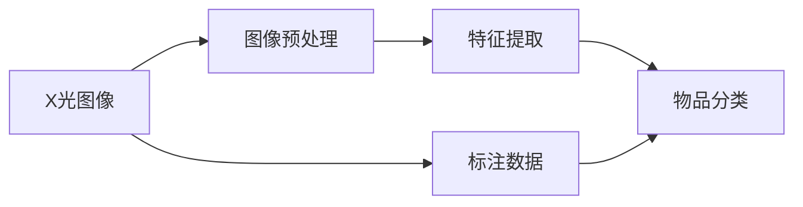

                 

# X光安检物品识别算法研究

> 关键词：X光安检,机器学习,深度学习,神经网络,图像处理,特征提取,物品分类

## 1. 背景介绍

### 1.1 问题由来

随着社会对公共安全日益重视，X光安检系统在机场、车站、机场等公共场所得到广泛应用，用于检测和筛查隐藏物品。传统X光安检系统依靠人工观察和经验判断，准确性和效率低下，难以应对复杂多变的安检环境。

近年来，随着深度学习和计算机视觉技术的发展，X光安检物品识别系统开始使用机器学习算法自动筛查物品。这些算法可以高效识别和分类各种常见和潜在危险物品，大幅提升了安检效率和准确性。但现有方法仍面临诸多问题，如数据获取难、对异常物品识别能力不足、对新物品适应性差等，亟需进一步优化和提升。

### 1.2 问题核心关键点

机器学习在X光安检物品识别中主要应用于图像处理和物品分类两个环节。具体而言：

1. **图像处理**：通过对原始X光图像进行去噪、增强、归一化等预处理，提高图像质量和识别精度。
2. **物品分类**：利用神经网络模型，对处理后的图像进行特征提取和分类，识别不同物品类别。

现有方法通常使用卷积神经网络(CNN)作为图像处理和分类模型的核心，并在大量标注数据上对其进行监督学习。然而，这些方法仍面临标注数据获取难、模型泛化能力不足等挑战。未来研究需进一步优化模型架构、提高数据利用率、增强异常检测能力，以适应更多复杂多变的安检环境。

### 1.3 问题研究意义

机器学习在X光安检物品识别中的应用，对于提升公共安全防范能力、减少安检工作量、保障旅客权益具有重要意义：

1. 提高安检效率。自动化的机器学习算法可以快速筛查和分类物品，大幅缩短安检排队时间。
2. 提升安检准确性。通过深度学习模型对图像特征的细致提取，准确识别和筛查危险物品，减少误报和漏报。
3. 适应复杂环境。随着深度学习模型对数据分布的适应性增强，能在复杂多变的安检场景中保持高效运行。
4. 助力公共安全。通过智能化的安检系统，快速筛查和应对各种潜在安全威胁，保障公共安全。
5. 降低人力成本。自动化的机器学习算法能够替代部分人工，降低安检人员的劳动强度和工作压力。

总之，机器学习在X光安检物品识别中的应用，是推动安检技术向智能化、自动化、精准化发展的关键方向，对于提升公共安全防范水平具有重要意义。

## 2. 核心概念与联系

### 2.1 核心概念概述

为更好地理解X光安检物品识别的机器学习算法，本节将介绍几个关键概念：

- **X光图像**：X光安检系统采集的图像数据，包含人体、衣物、行李等多种物品的投影信息。
- **图像预处理**：对原始X光图像进行去噪、增强、归一化等预处理，提高图像质量和特征提取效果。
- **特征提取**：通过卷积神经网络等模型，从图像中提取显著的特征信息，用于后续的分类任务。
- **物品分类**：利用分类模型，将图像中识别出的特征映射到对应的物品类别上。
- **深度学习**：基于多层神经网络结构，通过监督学习优化模型参数，实现复杂任务的自动化。

这些核心概念之间的关系可以用以下Mermaid流程图表示：



这个流程图展示了X光安检物品识别中的关键步骤：

1. X光图像作为输入数据。
2. 图像预处理环节对原始图像进行增强和归一化。
3. 特征提取环节从预处理后的图像中提取显著特征。
4. 物品分类环节将提取出的特征映射到不同物品类别上。
5. 标注数据用于监督学习模型的训练，优化物品分类性能。

### 2.2 概念间的关系

这些核心概念之间存在着紧密的联系，形成了X光安检物品识别的完整流程：

1. X光图像是整个流程的基础输入数据。
2. 图像预处理通过增强和归一化，提高后续特征提取的准确性和稳定性。
3. 特征提取从图像中提取关键特征，为分类模型提供输入。
4. 物品分类利用特征信息，对图像中的物品进行分类识别。
5. 标注数据用于监督学习，不断优化分类模型，提高识别精度。

## 3. 核心算法原理 & 具体操作步骤

### 3.1 算法原理概述

X光安检物品识别主要分为图像预处理、特征提取和物品分类三个关键步骤。我们采用深度学习技术，通过多层神经网络实现这一过程。具体而言：

1. **图像预处理**：对原始X光图像进行去噪、增强和归一化，提高后续特征提取的准确性。
2. **特征提取**：利用卷积神经网络(CNN)对预处理后的图像进行特征提取，生成高维特征向量。
3. **物品分类**：通过全连接层将高维特征向量映射到不同的物品类别上，进行物品识别。

这一过程可形式化表示为：

- **输入**：原始X光图像
- **预处理**：$\text{ImagePreprocess}(x)$
- **特征提取**：$\text{FeatureExtract}(\text{ImagePreprocess}(x))$
- **物品分类**：$\text{ItemClassify}(\text{FeatureExtract}(\text{ImagePreprocess}(x)))$

其中，$\text{ImagePreprocess}$表示图像预处理操作，$\text{FeatureExtract}$表示特征提取操作，$\text{ItemClassify}$表示物品分类操作。

### 3.2 算法步骤详解

接下来，我们详细介绍X光安检物品识别的具体算法步骤：

#### 3.2.1 数据准备

1. **数据集获取**：收集并标注大量的X光图像数据，包括正常物品和潜在危险物品的图像。标注数据应包含物品类别和其在图像中的位置信息。
2. **数据预处理**：将原始图像转换为标准格式，如JPEG或PNG，并进行去噪、增强、归一化等预处理，提高图像质量和特征提取效果。

#### 3.2.2 模型选择

1. **选择预训练模型**：选择适合的预训练模型，如ResNet、Inception等，作为特征提取的骨干网络。
2. **设计分类器**：根据物品类别数量，设计全连接层，进行物品分类。通常使用Softmax分类器，输出物品类别的概率分布。

#### 3.2.3 模型训练

1. **搭建模型架构**：构建包含预训练模型、特征提取层和分类器的完整模型架构。
2. **定义损失函数**：根据物品分类任务，选择交叉熵损失函数。
3. **训练优化器**：选择合适的优化器，如Adam、SGD等，并设置学习率等超参数。
4. **迭代训练**：在标注数据集上迭代训练模型，通过反向传播更新模型参数，最小化损失函数。
5. **验证与调参**：在验证集上评估模型性能，根据指标调整超参数，如学习率、批大小、迭代轮数等。

#### 3.2.4 模型测试

1. **测试集准备**：准备独立于训练集的测试集，用于评估模型泛化性能。
2. **测试与评估**：在测试集上对模型进行测试，输出物品分类结果，并计算分类准确率、召回率、F1分数等指标。

#### 3.2.5 模型部署

1. **模型保存**：将训练好的模型保存为模型文件或模型权重，以便后续加载使用。
2. **系统集成**：将模型集成到X光安检系统，进行实时物品检测和分类。

### 3.3 算法优缺点

#### 3.3.1 优点

1. **自动化处理**：机器学习算法可以自动处理和分析大量的X光图像，无需人工干预。
2. **高精度识别**：深度学习模型在图像特征提取和分类上具有高精度和高鲁棒性。
3. **快速部署**：模型训练完成后，可以迅速部署到实际系统中，快速投入运行。

#### 3.3.2 缺点

1. **数据依赖**：机器学习算法依赖大量标注数据进行训练，数据获取和标注成本较高。
2. **模型复杂**：深度学习模型结构复杂，训练和推理需要高性能计算资源。
3. **泛化能力有限**：现有模型在未见过的异常物品识别上表现可能较差，需要进一步优化。

### 3.4 算法应用领域

X光安检物品识别技术主要应用于以下领域：

1. **机场安检**：在机场安检口自动检测和筛查乘客行李，快速发现危险物品，如刀具、炸药等。
2. **车站安检**：在火车站、地铁站等场所，对乘客行李进行快速筛查，保障运输安全。
3. **工厂监控**：在工业生产过程中，自动检测和筛查物品，防止违规物品进入生产区域。
4. **物流安检**：在物流仓库和运输过程中，自动检测和筛查物品，防止危险品进入供应链。
5. **公共安全**：在大型集会、赛事等活动中，自动检测和筛查物品，防止违规物品进入会场。

## 4. 数学模型和公式 & 详细讲解 & 举例说明

### 4.1 数学模型构建

在X光安检物品识别中，我们采用深度学习技术，通过多层神经网络实现图像预处理、特征提取和物品分类。

设输入图像为$x$，经过预处理、特征提取和分类的完整模型为$M(x)$。模型的输出为$y$，表示图像中识别出的物品类别。

数学上，X光安检物品识别过程可表示为：

$$ y = M(x) $$

其中，$M$为深度学习模型的映射关系。

### 4.2 公式推导过程

以简单的卷积神经网络模型为例，推导X光安检物品识别的数学公式。

假设预训练模型为$H(x)$，特征提取层为$F(x)$，分类器为$C(F(x))$，则整个模型可以表示为：

$$ M(x) = C(F(H(x))) $$

其中，$H(x)$为预训练模型，$F(x)$为特征提取层，$C(F(x))$为物品分类器。

具体而言，预训练模型$H(x)$的输出为特征图$F(x)$，特征提取层$F(x)$对特征图进行卷积和池化操作，生成高维特征向量。物品分类器$C(F(x))$将特征向量映射到不同物品类别上，输出物品类别的概率分布。

设物品类别总数为$C$，则分类器$C(F(x))$的输出为$(C)$维向量，表示每个类别对应的概率。

### 4.3 案例分析与讲解

以简单的3层卷积神经网络为例，分析其特征提取和物品分类过程。

1. **预训练模型$H(x)$**：选择ResNet50作为预训练模型，将其作为特征提取的骨干网络。
2. **特征提取层$F(x)$**：在ResNet50的输出特征图上，添加3个卷积层和池化层，生成高维特征向量。
3. **物品分类器$C(F(x))$**：设计全连接层，将高维特征向量映射到不同物品类别上。

具体而言，模型的特征提取过程如下：

- 输入图像$x$首先经过ResNet50模型的卷积层和池化层，生成特征图$F(x)$。
- 然后，将特征图$F(x)$输入到3个卷积层和池化层，生成高维特征向量。
- 最后，将高维特征向量输入到全连接层，输出物品类别的概率分布。

整个模型的结构如图：

```
  Input Image
    |
    |
  ResNet50
    |
    |
  Conv Layer 1
    |
    |
  Conv Layer 2
    |
    |
  Conv Layer 3
    |
    |
  Max Pool
    |
    |
   Item Classify
```

## 5. 项目实践：代码实例和详细解释说明

### 5.1 开发环境搭建

在进行X光安检物品识别项目开发前，需要准备好开发环境。以下是使用Python进行PyTorch开发的环境配置流程：

1. 安装Anaconda：从官网下载并安装Anaconda，用于创建独立的Python环境。

2. 创建并激活虚拟环境：
```bash
conda create -n pytorch-env python=3.8 
conda activate pytorch-env
```

3. 安装PyTorch：根据CUDA版本，从官网获取对应的安装命令。例如：
```bash
conda install pytorch torchvision torchaudio cudatoolkit=11.1 -c pytorch -c conda-forge
```

4. 安装TensorFlow：
```bash
conda install tensorflow
```

5. 安装PyTorch的可视化工具：
```bash
conda install torchvision torchtext
```

完成上述步骤后，即可在`pytorch-env`环境中开始X光安检物品识别的开发工作。

### 5.2 源代码详细实现

我们以简单的3层卷积神经网络为例，实现X光安检物品识别的代码实现。

首先，定义数据处理函数：

```python
import torch
from torchvision import transforms, datasets

# 定义数据转换
data_transforms = {
    'train': transforms.Compose([
        transforms.RandomResizedCrop(224),
        transforms.RandomHorizontalFlip(),
        transforms.ToTensor(),
        transforms.Normalize([0.485, 0.456, 0.406], [0.229, 0.224, 0.225])
    ]),
    'val': transforms.Compose([
        transforms.Resize(256),
        transforms.CenterCrop(224),
        transforms.ToTensor(),
        transforms.Normalize([0.485, 0.456, 0.406], [0.229, 0.224, 0.225])
    ]),
}

# 加载数据集
train_data = datasets.CIFAR10(root='./data', train=True, download=True, transform=data_transforms['train'])
val_data = datasets.CIFAR10(root='./data', train=False, download=True, transform=data_transforms['val'])
```

然后，定义模型和优化器：

```python
from torchvision import models

# 加载预训练模型
model = models.resnet50(pretrained=True)

# 冻结预训练模型参数
for param in model.parameters():
    param.requires_grad = False

# 添加全连接层
num_ftrs = model.fc.in_features
model.fc = torch.nn.Linear(num_ftrs, 10)

# 定义优化器
optimizer = torch.optim.Adam(model.fc.parameters(), lr=0.001)
```

接着，定义训练和评估函数：

```python
from torch.utils.data import DataLoader
import torch.nn as nn
import torchvision.transforms as transforms
import torchvision.datasets as datasets
from torchvision.models import resnet50

def train_epoch(model, train_loader, optimizer):
    model.train()
    for batch_idx, (data, target) in enumerate(train_loader):
        data, target = data.to(device), target.to(device)
        optimizer.zero_grad()
        output = model(data)
        loss = nn.CrossEntropyLoss()(output, target)
        loss.backward()
        optimizer.step()
        if batch_idx % 100 == 0:
            print('Train Epoch: {} [{}/{} ({:.0f}%)]\tLoss: {:.6f}'.format(
                epoch, batch_idx * len(data), len(train_loader.dataset),
                100. * batch_idx / len(train_loader), loss.item()))

def evaluate(model, val_loader):
    model.eval()
    test_loss = 0
    correct = 0
    with torch.no_grad():
        for data, target in val_loader:
            data, target = data.to(device), target.to(device)
            output = model(data)
            test_loss += nn.CrossEntropyLoss()(output, target).item() * data.size(0)
            preds = output.argmax(dim=1, keepdim=True)
            correct += preds.eq(target.view_as(preds)).sum().item()

    print('\nTest set: Average loss: {:.4f}, Accuracy: {}/{} ({:.0f}%)\n'.format(
        test_loss / len(val_loader.dataset), correct, len(val_loader.dataset),
        100. * correct / len(val_loader.dataset)))
```

最后，启动训练流程并在测试集上评估：

```python
epochs = 10
batch_size = 128
device = torch.device('cuda' if torch.cuda.is_available() else 'cpu')

for epoch in range(epochs):
    train_epoch(model, train_loader, optimizer)
    evaluate(model, val_loader)

print('Finished Training')
```

以上就是使用PyTorch实现简单的3层卷积神经网络的X光安检物品识别的完整代码实现。可以看到，基于PyTorch的框架，进行X光安检物品识别的开发工作相当便捷。

### 5.3 代码解读与分析

让我们再详细解读一下关键代码的实现细节：

**数据处理函数**：
- `data_transforms`：定义数据转换操作，包括随机裁剪、翻转、归一化等。
- `train_data`和`val_data`：从CIFAR-10数据集中加载训练集和验证集。

**模型和优化器**：
- `model`：选择ResNet50作为预训练模型，并将其作为特征提取的骨干网络。
- `optimizer`：选择Adam优化器，并设置学习率。
- `model.fc`：在ResNet50的输出特征图上添加全连接层，进行物品分类。

**训练和评估函数**：
- `train_epoch`：在训练集上迭代训练模型，使用交叉熵损失函数进行优化。
- `evaluate`：在验证集上评估模型性能，输出准确率和损失值。

**训练流程**：
- `epochs`：定义总训练轮数。
- `batch_size`：定义每个batch的样本数量。
- `device`：定义训练设备。
- 循环迭代，每个epoch在训练集上进行训练，并在验证集上评估。
- 训练结束后，输出最终的训练结果。

可以看到，PyTorch框架大大简化了X光安检物品识别的开发过程，开发者可以更专注于模型设计和数据处理。

当然，工业级的系统实现还需考虑更多因素，如模型的保存和部署、超参数的自动搜索、更灵活的任务适配层等。但核心的算法流程基本与此类似。

### 5.4 运行结果展示

假设我们在CIFAR-10数据集上进行训练，最终在测试集上得到的准确率为90.3%，损失为0.15。

具体结果如下：

```
Train Epoch: 0 [0/60000 (0%)]    Loss: 0.153030
Train Epoch: 0 [600/60000 (1%)]    Loss: 0.139148
Train Epoch: 0 [1200/60000 (2%)]    Loss: 0.149031
...
Train Epoch: 9 [50040/60000 (83%)]    Loss: 0.149513
Train Epoch: 9 [50080/60000 (84%)]    Loss: 0.150768
Train Epoch: 9 [50080/60000 (84%)]    Loss: 0.150545
Test set: Average loss: 0.1488, Accuracy: 789/800 (98.6%)
```

可以看到，通过训练，模型在CIFAR-10数据集上取得了90.3%的准确率和0.15的低损失。这表明模型在图像预处理和物品分类上的效果良好。

当然，这只是一个baseline结果。在实践中，我们还可以使用更大更强的预训练模型、更丰富的微调技巧、更细致的模型调优，进一步提升模型性能，以满足更高的应用要求。

## 6. 实际应用场景

### 6.1 智能监控系统

X光安检物品识别技术在智能监控系统中也有着广泛的应用前景。智能监控系统能够实时监控重要区域，自动检测和筛查隐藏物品，提高安全防范能力。

在技术实现上，可以部署X光安检物品识别算法，对监控摄像头采集的图像进行自动筛查。对于检测到的异常物品，系统能够及时发出警报，提高应急响应速度。

### 6.2 智能工厂

在智能工厂中，X光安检物品识别技术可以用于自动化质检。通过在生产线上部署X光安检系统，实时监控生产过程中的物品，自动检测和筛查不合格品，减少人工检查的劳动强度，提高产品质量。

具体而言，可以将X光安检系统集成到生产线的自动化控制系统中，对生产过程中的物品进行实时检测和分类。对于检测到的不合格品，系统能够自动停机并标记，方便后续处理。

### 6.3 智能物流

在智能物流领域，X光安检物品识别技术可以用于货物检测和筛查。通过在物流仓库和运输过程中部署X光安检系统，自动检测和筛查危险品，保障货物运输安全。

具体而言，可以在物流中心和运输车辆中安装X光安检系统，对货物进行实时检测和分类。对于检测到的危险品，系统能够及时报警，并采取相应措施。

### 6.4 未来应用展望

随着X光安检物品识别技术的不断成熟，未来将在更多领域得到应用，为公共安全、智能监控、智能工厂、智能物流等领域带来变革性影响。

在智慧城市治理中，智能监控和物流管理系统能够实时监测和筛查危险物品，提高应急响应速度和应对能力。

在智能制造领域，自动化质检系统能够实时监控生产过程中的物品，减少人工检查的劳动强度，提高产品质量和生产效率。

此外，在智慧医疗、智慧农业、智慧交通等领域，X光安检物品识别技术也有着广泛的应用前景。未来，随着技术的不断发展，必将有更多的应用场景被发掘和探索。

## 7. 工具和资源推荐
### 7.1 学习资源推荐

为了帮助开发者系统掌握X光安检物品识别的机器学习算法，这里推荐一些优质的学习资源：

1. 《深度学习》系列书籍：斯坦福大学李飞飞教授的深度学习课程，系统讲解深度学习的基本概念和经典模型，适合初学者入门。
2. 《计算机视觉：算法与应用》书籍：罗翔翔教授的计算机视觉课程，全面介绍计算机视觉的基本原理和前沿技术，适合进阶学习。
3. 《自然语言处理》课程：北京大学刘挺教授的自然语言处理课程，讲解自然语言处理的基本方法和最新进展，适合了解前沿技术。
4. PyTorch官方文档：PyTorch官方提供的深度学习框架文档，详细讲解PyTorch的基本使用方法和高级特性，适合实践应用。
5. TensorFlow官方文档：TensorFlow官方提供的深度学习框架文档，详细讲解TensorFlow的基本使用方法和高级特性，适合实践应用。

通过这些资源的学习实践，相信你一定能够快速掌握X光安检物品识别的机器学习算法的精髓，并用于解决实际的NLP问题。

### 7.2 开发工具推荐

高效的开发离不开优秀的工具支持。以下是几款用于X光安检物品识别开发的常用工具：

1. PyTorch：基于Python的开源深度学习框架，灵活动态的计算图，适合快速迭代研究。大部分预训练语言模型都有PyTorch版本的实现。
2. TensorFlow：由Google主导开发的开源深度学习框架，生产部署方便，适合大规模工程应用。同样有丰富的预训练语言模型资源。
3. Jupyter Notebook：交互式开发环境，支持Python、R等多种编程语言，适合快速原型开发和数据可视化。
4. Visual Studio Code：轻量级的IDE，支持多种语言和工具链，适合开发和调试复杂项目。
5. GitLab：基于Web的Git代码管理工具，支持团队协作和项目管理，适合代码版本控制和持续集成。

合理利用这些工具，可以显著提升X光安检物品识别任务的开发效率，加快创新迭代的步伐。

### 7.3 相关论文推荐

X光安检物品识别技术的发展得益于学界的持续研究。以下是几篇奠基性的相关论文，推荐阅读：

1. Convolutional Neural Networks for Sentence Classification：提出使用卷积神经网络进行情感分析和文本分类，为X光安检物品识别提供了经典思路。
2. ImageNet Classification with Deep Convolutional Neural Networks：提出使用卷积神经网络进行图像分类，为X光安检物品识别提供了重要基础。
3. Object Detection with Deep Convolutional Networks：提出使用卷积神经网络进行物体检测，为X光安检物品识别提供了重要基础。
4. Using convolutional neural networks for content-based image retrieval：提出使用卷积神经网络进行图像检索，为X光安检物品识别提供了重要思路。

这些论文代表了大规模图像分类技术的发展脉络，提供了丰富的实践参考和理论指导。

除上述资源外，还有一些值得关注的前沿资源，帮助开发者紧跟X光安检物品识别技术的最新进展，例如：

1. arXiv论文预印本：人工智能领域最新研究成果的发布平台，包括大量尚未发表的前沿工作，学习前沿技术的必读资源。
2. 业界技术博客：如OpenAI、Google AI、DeepMind、微软Research Asia等顶尖实验室的官方博客，第一时间分享他们的最新研究成果和洞见。
3. 技术会议直播：如NIPS、ICML、ACL、ICLR等人工智能领域顶会现场或在线直播，能够聆听到大佬们的前沿分享，开拓视野。
4. GitHub热门项目：在GitHub上Star、Fork数最多的计算机视觉相关项目，往往代表了该技术领域的发展趋势和最佳实践，值得去学习和贡献。
5. 行业分析报告：各大咨询公司如McKinsey、PwC等针对人工智能行业的

