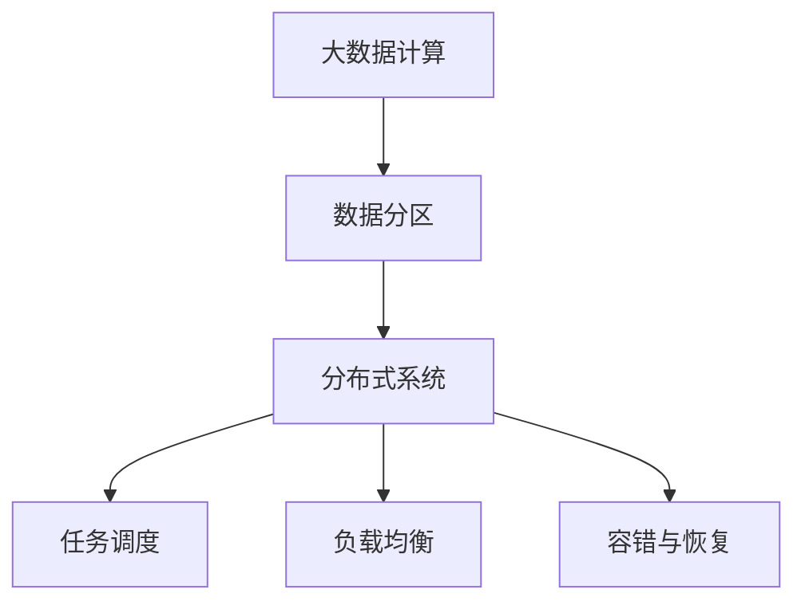

                 

# 【AI大数据计算原理与代码实例讲解】分区

> 关键词：大数据计算,分布式系统,数据分区,并行处理,任务调度,负载均衡,容错与恢复

## 1. 背景介绍

### 1.1 问题由来
在当今数据爆炸的时代，单个计算节点已经难以处理大规模数据的处理需求。无论是搜索引擎、社交媒体分析，还是科学计算，都迫切需要能够高效处理海量数据的系统。大数据计算技术应运而生，通过分布式计算和并行处理，有效地解决了这一问题。

大数据计算的核心是数据的分区（Sharding）。分区是将大数据集分割成多个小的、可管理的数据块，并在分布式系统中分配给不同的计算节点进行处理。通过分区，系统可以并行处理数据，加速计算过程，提高系统的可扩展性和可靠性。

### 1.2 问题核心关键点
大数据计算中的数据分区，旨在将数据集划分为多个分区，每个分区可以在独立的计算节点上并行处理，最终将结果合并。数据分区的关键在于如何划分分区，如何选择计算节点，以及如何在数据量变化时动态调整分区策略。

数据分区的目标是在保证数据一致性的前提下，最大化并行度，提高计算效率。为此，需要考虑以下几个因素：

- 数据分区策略：如何选择数据分区，以保证数据均衡分布和易于管理。
- 任务调度算法：如何在多个计算节点间动态调度任务，以最大化利用计算资源。
- 负载均衡：如何在数据量变化时动态调整分区策略，避免资源浪费和节点负载不均。
- 容错与恢复：如何在节点故障时保证数据一致性和计算连续性，避免数据丢失和计算中断。

### 1.3 问题研究意义
研究数据分区技术，对于提升大数据计算系统的性能和可靠性，优化资源利用，具有重要意义：

1. **提升处理能力**：通过分区和并行处理，可以显著提升系统的处理能力，满足大规模数据处理的需求。
2. **增强系统可扩展性**：分区技术使得系统能够灵活扩展，适应数据量的快速增长。
3. **优化资源利用**：合理的数据分区策略和任务调度算法，可以优化资源利用，提高计算效率。
4. **增强系统可靠性**：分区和任务调度的冗余机制，可以有效应对节点故障，保证系统的连续性。
5. **简化系统管理**：分区后的数据块管理更简单，便于系统的维护和监控。

## 2. 核心概念与联系

### 2.1 核心概念概述

为了更好地理解大数据计算中的数据分区技术，本节将介绍几个关键概念：

- **大数据计算（Big Data Computing）**：利用分布式计算和并行处理技术，高效处理大规模数据的计算过程。
- **数据分区（Data Sharding）**：将大数据集分割成多个小的、可管理的数据块，并在分布式系统中分配给不同的计算节点进行处理。
- **分布式系统（Distributed System）**：由多个计算节点组成的，通过网络相互通信的系统，用于处理大规模数据。
- **任务调度（Task Scheduling）**：在多个计算节点间动态分配计算任务，优化资源利用，提高计算效率。
- **负载均衡（Load Balancing）**：在数据量变化时，动态调整分区策略，避免节点负载不均，提高计算效率。
- **容错与恢复（Fault Tolerance and Recovery）**：在节点故障时，保证数据一致性和计算连续性，避免数据丢失和计算中断。

这些概念之间存在紧密的联系，共同构成了大数据计算的核心生态系统。通过理解这些概念，我们可以更好地把握大数据计算的工作原理和优化方向。

### 2.2 概念间的关系

这些核心概念之间的逻辑关系可以通过以下Mermaid流程图来展示：



这个流程图展示了大数据计算的核心概念及其之间的关系：

1. 大数据计算依赖于分布式系统和数据分区技术，使得大规模数据处理成为可能。
2. 任务调度算法负责在多个计算节点间动态分配任务，优化资源利用。
3. 负载均衡机制用于动态调整分区策略，避免节点负载不均。
4. 容错与恢复机制保证系统在高可用性前提下，处理节点故障。

这些概念共同构成了大数据计算的完整框架，使得系统能够在处理大规模数据的同时，保持高效、可靠和可扩展。

## 3. 核心算法原理 & 具体操作步骤
### 3.1 算法原理概述

大数据计算中的数据分区算法，旨在将大规模数据集划分为多个小的、可管理的数据块。通常，数据分区算法需要考虑以下几个关键点：

1. **数据分布的均匀性**：分区后，各分区的数据量应尽量均匀，避免某节点负载过重。
2. **数据访问的局部性**：分区应考虑数据的局部性，减少数据跨节点传输，提高访问效率。
3. **分区的灵活性**：分区策略应具有灵活性，便于动态调整和扩缩容。

常用的数据分区算法包括哈希分区、范围分区和列分区等。

### 3.2 算法步骤详解

数据分区的步骤通常包括以下几个关键步骤：

1. **数据划分**：根据分区算法将数据集划分为多个分区。
2. **数据分布**：将各分区分配给不同的计算节点。
3. **任务调度**：根据计算任务动态调度任务到计算节点。
4. **负载均衡**：动态调整分区策略，平衡节点负载。
5. **容错与恢复**：处理节点故障，保证数据一致性和计算连续性。

以哈希分区算法为例，具体的步骤如下：

**步骤1: 数据划分**

将数据集根据哈希函数进行划分，得到一个哈希表，每个桶代表一个分区。

**步骤2: 数据分布**

将各分区分配给不同的计算节点，通常采用轮询、哈希取模等方法。

**步骤3: 任务调度**

根据计算任务，动态分配任务到计算节点，通常使用基于轮询或优先级调度的算法。

**步骤4: 负载均衡**

根据节点负载情况，动态调整分区策略，通常使用基于负载均衡的算法，如最少连接算法、最少未完成任务算法等。

**步骤5: 容错与恢复**

在节点故障时，重新分配故障节点的分区，保证数据一致性和计算连续性，通常使用基于复制和冗余的容错机制。

### 3.3 算法优缺点

数据分区算法具有以下优点：

1. **提升计算效率**：通过并行处理，可以显著提升系统的处理能力。
2. **增强系统可扩展性**：分区技术使得系统能够灵活扩展，适应数据量的快速增长。
3. **优化资源利用**：合理的数据分区策略和任务调度算法，可以优化资源利用。

同时，数据分区算法也存在一些缺点：

1. **增加复杂性**：分区和调度的过程增加了系统的复杂性，需要更多的管理和维护工作。
2. **数据一致性问题**：分区后，数据的局部一致性需要保证，否则可能导致数据不一致。
3. **网络开销增加**：分区增加了数据跨节点传输的开销，可能导致网络带宽不足。

### 3.4 算法应用领域

数据分区技术在大数据计算中得到了广泛应用，涵盖了从数据仓库、搜索引擎到社交媒体分析等多个领域，具体应用包括：

1. **数据仓库**：将历史数据进行分区，方便数据管理和查询。
2. **搜索引擎**：将索引数据进行分区，提升查询效率。
3. **社交媒体分析**：将用户数据进行分区，方便分布式分析。
4. **科学计算**：将计算任务进行分区，提升计算效率。
5. **流数据处理**：将实时数据进行分区，方便分布式处理。

除了上述这些经典应用外，数据分区技术还被创新性地应用于更多场景中，如大数据可视化、推荐系统、异常检测等，为大数据处理提供了新的技术路径。

## 4. 数学模型和公式 & 详细讲解 & 举例说明

### 4.1 数学模型构建

本节将使用数学语言对数据分区算法进行更加严格的刻画。

记大数据集为 $D=\{x_i\}_{i=1}^N$，每个数据项 $x_i$ 大小为 $L$，假设将数据集划分为 $K$ 个分区，每个分区大小为 $S$，则有以下关系：

$$
S = \frac{L}{K}
$$

在数据分区算法中，需要最小化数据跨节点传输的开销，同时保证数据访问的局部性。常用的数学模型包括：

- **哈希函数**：用于将数据项映射到不同的分区。
- **负载均衡模型**：用于动态调整分区策略，平衡节点负载。

### 4.2 公式推导过程

以下我们以哈希分区算法为例，推导哈希函数和负载均衡模型的数学公式。

**哈希函数**：

哈希函数 $h(x)$ 将数据项 $x$ 映射到一个哈希桶 $0, 1, ..., K-1$。

**负载均衡模型**：

假设当前节点负载为 $L_i$，目标负载为 $L_t$，则节点负载均衡算法可以表示为：

$$
\min_{i \in [1,K]} \| L_i - L_t \|
$$

其中 $L_i$ 为节点 $i$ 的负载，$L_t$ 为目标负载。

### 4.3 案例分析与讲解

假设我们有 $N=1000$ 个数据项，每个数据项大小为 $L=1024$ 字节，需要将数据集划分为 $K=8$ 个分区。

根据哈希函数 $h(x)$，将数据项 $x_i$ 映射到哈希桶 $h(x_i)$，其中 $h(x_i) = x_i \mod K$。

根据负载均衡模型，动态调整分区策略，平衡节点负载。

## 5. 项目实践：代码实例和详细解释说明
### 5.1 开发环境搭建

在进行数据分区实践前，我们需要准备好开发环境。以下是使用Python进行Spark开发的Python环境配置流程：

1. 安装Anaconda：从官网下载并安装Anaconda，用于创建独立的Python环境。

2. 创建并激活虚拟环境：
```bash
conda create -n spark-env python=3.8 
conda activate spark-env
```

3. 安装PySpark：从官网获取最新的PySpark安装命令。

4. 安装各类工具包：
```bash
pip install numpy pandas scikit-learn matplotlib tqdm jupyter notebook ipython
```

完成上述步骤后，即可在`spark-env`环境中开始数据分区实践。

### 5.2 源代码详细实现

下面我们以Spark的RDD（弹性分布式数据集）分区为例，给出使用Python对大数据集进行分区的PySpark代码实现。

首先，导入必要的库和数据集：

```python
from pyspark import SparkContext
from pyspark.rdd import RDD

sc = SparkContext("local", "RDD Sharding")
data = sc.parallelize(range(1000000))
```

然后，定义分区函数：

```python
def partition(data):
    return data.mapPartitions(lambda iter: iter[:10000])
```

接着，进行数据分区：

```python
partitioned_data = data.partitionBy(4)
```

最后，启动数据分区：

```python
sc.stop()
```

### 5.3 代码解读与分析

让我们再详细解读一下关键代码的实现细节：

**RDD Sharding**：
- `SparkContext`：Spark的入口，用于创建Spark会话。
- `parallelize`：将本地数据加载到Spark集群，返回一个RDD对象。
- `partitionBy`：将RDD分区，每个分区包含指定数量的元素。
- `partition`：分区函数，用于定义分区逻辑。
- `mapPartitions`：对每个分区进行函数映射，定义分区逻辑。
- `stop`：停止Spark会话，释放资源。

通过使用Spark的RDD分区，我们可以很方便地将大数据集划分为多个小的、可管理的数据块，并在分布式系统中分配给不同的计算节点进行处理。

## 6. 实际应用场景
### 6.1 智慧城市数据中心

大数据计算中的数据分区技术，可以广泛应用于智慧城市数据中心建设。传统数据中心往往需要大规模存储海量数据，响应时间慢，成本高。通过数据分区，智慧城市数据中心能够高效存储和管理城市中的各类数据，提升数据处理速度和降低存储成本。

在技术实现上，可以收集城市中的各类数据（如交通数据、气象数据、环境数据等），将其进行分区后存储在分布式系统中。通过数据查询和分析，可以对城市运行状态进行实时监控，辅助城市管理决策，提高城市运行效率。

### 6.2 电商平台数据处理

电商平台需要处理海量用户数据和交易数据，数据量巨大且增长迅速。通过大数据计算中的数据分区技术，电商平台能够高效处理和分析海量数据，提供精准的推荐和广告服务。

具体而言，可以将用户的浏览、购买、评价等数据进行分区，并存储在分布式系统中。通过查询和分析，可以得到用户的购买行为、偏好等信息，用于生成推荐列表和优化广告投放策略。

### 6.3 医疗健康数据分析

医疗健康领域的数据量巨大且复杂，需要通过数据分区技术进行高效管理和分析。通过数据分区，医疗健康数据分析系统能够实时处理和分析海量医疗数据，辅助医生诊断和治疗决策。

具体而言，可以将医院的电子病历、诊断报告、医疗影像等数据进行分区，并存储在分布式系统中。通过查询和分析，可以得到患者的健康状况、病史信息等，用于支持医生诊断和治疗方案的选择。

### 6.4 未来应用展望

随着数据分区技术的不断发展，大数据计算系统将在更多领域得到应用，为各行各业带来变革性影响。

在智慧城市治理中，数据分区技术将用于城市事件监测、舆情分析、应急指挥等环节，提高城市管理的自动化和智能化水平，构建更安全、高效的未来城市。

在智能制造领域，数据分区技术将用于设备监控、质量控制、预测维护等环节，提高生产效率和产品质量。

在金融行业，数据分区技术将用于风险管理、信用评估、投资分析等环节，提升金融服务的智能化水平，降低金融风险。

总之，数据分区技术在大数据计算中的应用前景广阔，未来将会在更多领域得到广泛应用，为各行各业带来深远的变革。

## 7. 工具和资源推荐
### 7.1 学习资源推荐

为了帮助开发者系统掌握大数据计算中的数据分区技术，这里推荐一些优质的学习资源：

1. 《分布式系统原理与实践》系列博文：由Spark专家撰写，深入浅出地介绍了分布式系统的原理和实践，涵盖大数据计算的多个方面。

2. CS346《分布式系统》课程：斯坦福大学开设的分布式系统课程，有Lecture视频和配套作业，带你入门分布式系统的基本概念和关键技术。

3. 《Spark Core: The Missing Manual》书籍：Spark的权威指南，全面介绍了Spark的核心概念和编程技巧，是Spark开发的必备资料。

4. Apache Spark官方文档：Spark的官方文档，提供了海量的API文档和开发指南，是Spark开发的必备参考。

5. Kaggle：数据科学竞赛平台，提供了大量真实数据集和竞赛，用于锻炼数据分析和数据处理能力。

通过对这些资源的学习实践，相信你一定能够快速掌握大数据计算中的数据分区技术，并用于解决实际的业务问题。

### 7.2 开发工具推荐

高效的开发离不开优秀的工具支持。以下是几款用于大数据计算开发的工具：

1. PySpark：Python的Spark API，方便进行分布式计算和数据处理。

2. Spark SQL：Spark的SQL计算引擎，支持对大数据集进行高效查询和分析。

3. Hadoop生态：Hadoop作为Apache Spark的基础，提供了数据存储和分布式计算的平台。

4. Google Cloud BigQuery：Google提供的无服务器数据仓库，方便进行大数据分析。

5. Amazon Redshift：Amazon提供的云端数据仓库，支持分布式计算和数据查询。

6. Azure Data Lake：Microsoft提供的云数据湖服务，支持大规模数据存储和分析。

合理利用这些工具，可以显著提升大数据计算任务的开发效率，加快创新迭代的步伐。

### 7.3 相关论文推荐

大数据计算中的数据分区技术发展迅速，以下是几篇奠基性的相关论文，推荐阅读：

1. "MapReduce: Simplified Data Processing on Large Clusters"：MapReduce的原始论文，奠定了大数据计算的基础。

2. "Spark: Cluster Computing with Fault Tolerance"：Spark的原始论文，介绍了Spark的核心概念和架构。

3. "Pregel: A Dataflow System for Massive-scale Graph Processing"：Pregel论文，介绍了分布式图计算的原理和实现。

4. "Hadoop: The Underlying Infrastructure for Google File System"：Hadoop的原始论文，介绍了Hadoop的架构和实现。

5. "A Framework for Distributed Collectively Aligned System"：Apache Storm的论文，介绍了分布式流处理的原理和实现。

这些论文代表了大数据计算中的数据分区技术的发展脉络。通过学习这些前沿成果，可以帮助研究者把握学科前进方向，激发更多的创新灵感。

除上述资源外，还有一些值得关注的前沿资源，帮助开发者紧跟大数据计算技术的最新进展，例如：

1. arXiv论文预印本：人工智能领域最新研究成果的发布平台，包括大量尚未发表的前沿工作，学习前沿技术的必读资源。

2. 业界技术博客：如Apache Spark、Hadoop、Apache Storm等顶尖实验室的官方博客，第一时间分享他们的最新研究成果和洞见。

3. 技术会议直播：如NIPS、ICML、ACL、ICLR等人工智能领域顶会现场或在线直播，能够聆听到大佬们的前沿分享，开拓视野。

4. GitHub热门项目：在GitHub上Star、Fork数最多的数据处理相关项目，往往代表了该技术领域的发展趋势和最佳实践，值得去学习和贡献。

5. 行业分析报告：各大咨询公司如McKinsey、PwC等针对大数据计算行业的分析报告，有助于从商业视角审视技术趋势，把握应用价值。

总之，对于大数据计算中的数据分区技术的学习和实践，需要开发者保持开放的心态和持续学习的意愿。多关注前沿资讯，多动手实践，多思考总结，必将收获满满的成长收益。

## 8. 总结：未来发展趋势与挑战

### 8.1 总结

本文对大数据计算中的数据分区技术进行了全面系统的介绍。首先阐述了数据分区技术的研究背景和意义，明确了数据分区在提升大数据计算系统性能和可靠性方面的独特价值。其次，从原理到实践，详细讲解了数据分区的数学模型和关键步骤，给出了数据分区任务开发的完整代码实例。同时，本文还广泛探讨了数据分区技术在智慧城市、电商平台、医疗健康等多个行业领域的应用前景，展示了数据分区技术的巨大潜力。此外，本文精选了数据分区技术的各类学习资源，力求为读者提供全方位的技术指引。

通过本文的系统梳理，可以看到，数据分区技术在大数据计算中的应用前景广阔，未来将会在更多领域得到广泛应用，为各行各业带来深远的变革。

### 8.2 未来发展趋势

展望未来，数据分区技术将呈现以下几个发展趋势：

1. **自动化分区策略**：基于数据属性和访问模式，自动优化分区策略，提高数据访问的局部性和效率。
2. **弹性分区与伸缩**：根据数据量和计算需求，动态调整分区策略，支持系统的弹性扩展和伸缩。
3. **多维分区与交叉分区**：将数据按照多个维度进行分区，支持多维度的数据访问和分析。
4. **分布式存储与计算**：将分区数据存储在分布式存储系统中，支持大规模数据的分布式计算和分析。
5. **基于流的数据分区**：针对流数据的特性，设计专门的数据分区算法，支持流数据的实时处理和分析。

以上趋势凸显了数据分区技术的广阔前景。这些方向的探索发展，必将进一步提升大数据计算系统的性能和可靠性，优化资源利用，提高计算效率。

### 8.3 面临的挑战

尽管数据分区技术已经取得了显著成果，但在迈向更加智能化、普适化应用的过程中，它仍面临诸多挑战：

1. **数据一致性问题**：分区后，数据的局部一致性需要保证，否则可能导致数据不一致。
2. **网络带宽限制**：分区增加了数据跨节点传输的开销，可能导致网络带宽不足。
3. **系统复杂性增加**：分区和调度的过程增加了系统的复杂性，需要更多的管理和维护工作。
4. **节点故障处理**：在节点故障时，重新分配故障节点的分区，保证数据一致性和计算连续性。

解决这些挑战，是未来数据分区技术发展的关键。

### 8.4 研究展望

面对数据分区技术面临的种种挑战，未来的研究需要在以下几个方面寻求新的突破：

1. **自动化分区策略优化**：设计自动化分区策略，基于数据属性和访问模式，优化分区策略，提高数据访问的局部性和效率。
2. **弹性分区与伸缩优化**：优化弹性分区与伸缩策略，动态调整分区策略，支持系统的弹性扩展和伸缩。
3. **多维分区与交叉分区研究**：研究多维分区与交叉分区的算法，支持多维度的数据访问和分析。
4. **分布式存储与计算优化**：优化分布式存储与计算机制，提高数据存储和计算的效率和可靠性。
5. **基于流的数据分区算法**：设计专门针对流数据的分区算法，支持流数据的实时处理和分析。

这些研究方向的探索，必将引领数据分区技术迈向更高的台阶，为大数据计算系统带来更多的应用可能和优化空间。

## 9. 附录：常见问题与解答

**Q1：数据分区如何保证数据一致性？**

A: 数据分区后，数据的局部一致性需要保证。通常通过以下方式保证数据一致性：

1. 分区键一致性：使用相同的分区键进行分区，确保同一数据项在同一个分区中。
2. 分布式事务：在多个分区中进行分布式事务处理，保证数据一致性。
3 数据同步机制：定期同步分区数据，保证数据一致性。

**Q2：数据分区如何提高计算效率？**

A: 数据分区通过将大数据集分割成多个小的、可管理的数据块，并在分布式系统中分配给不同的计算节点进行处理，可以显著提升系统的处理能力。具体而言：

1. 并行处理：分区后，数据可以在多个节点上并行处理，提高计算效率。
2. 数据局部性：分区后，数据访问的局部性提高，减少了数据跨节点传输，提升访问效率。
3. 负载均衡：分区后，数据访问均衡，避免了节点负载不均，提高了计算效率。

**Q3：数据分区如何优化资源利用？**

A: 数据分区通过合理的数据分区策略和任务调度算法，可以优化资源利用，提高计算效率。具体而言：

1. 分区策略：合理的数据分区策略可以保证数据均衡分布，避免某节点负载过重。
2. 任务调度：通过动态调度任务到计算节点，最大化利用计算资源。
3. 负载均衡：通过动态调整分区策略，平衡节点负载，提高计算效率。

**Q4：数据分区如何应对节点故障？**

A: 数据分区通过冗余机制和数据备份，可以应对节点故障，保证数据一致性和计算连续性。具体而言：

1. 数据备份：将数据备份到多个节点，避免单节点故障导致数据丢失。
2. 冗余机制：通过冗余计算，保证在节点故障时，数据处理和计算可以继续进行。
3. 分布式事务：在多个节点中进行分布式事务处理，保证数据一致性。

通过优化数据分区的算法和策略，可以有效应对节点故障，确保系统的连续性和可靠性。

**Q5：数据分区如何支持分布式存储与计算？**

A: 数据分区通过将分区数据存储在分布式存储系统中，支持大规模数据的分布式计算和分析。具体而言：

1. 分布式存储：将分区数据存储在分布式存储系统中，支持大规模数据的存储和访问。
2. 分布式计算：将分区数据在多个计算节点上进行分布式计算，提高计算效率。
3. 数据同步机制：定期同步分区数据，保证数据一致性。

通过优化数据分区的算法和策略，可以支持分布式存储与计算，提升系统的可扩展性和可靠性。

---

作者：禅与计算机程序设计艺术 / Zen and the Art of Computer Programming

