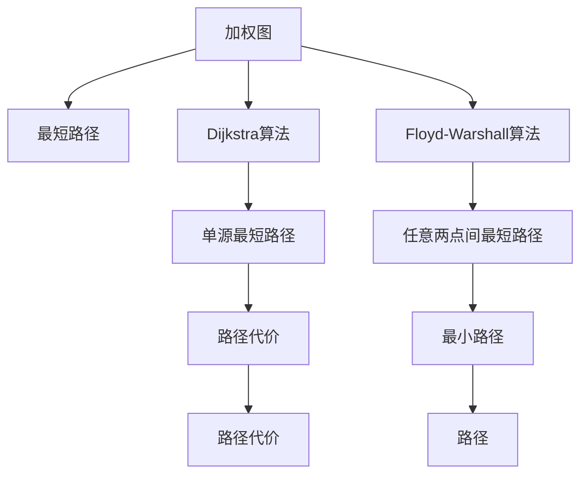
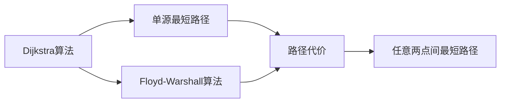
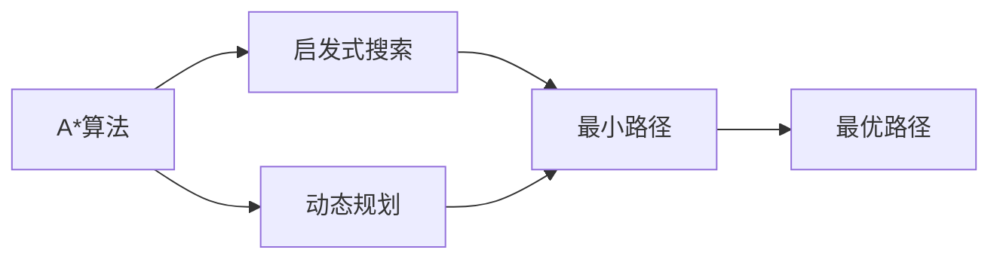
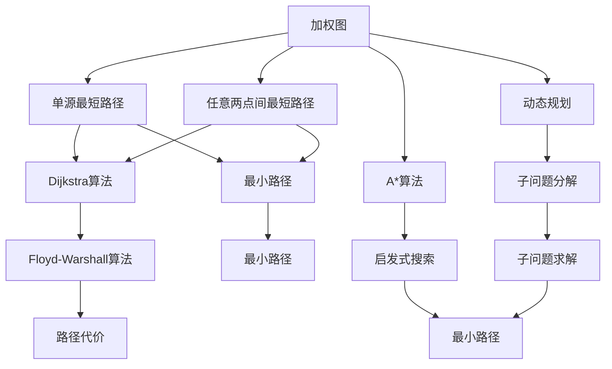

                 

# 【AI大数据计算原理与代码实例讲解】最短路径

> 关键词：最短路径算法, Dijkstra算法, Floyd-Warshall算法, A*算法, 大O复杂度, 代码实例

## 1. 背景介绍

### 1.1 问题由来
在图论和计算机科学中，最短路径问题是指在一个加权图中，找到两个指定顶点之间的最短路径。这一问题具有广泛的应用场景，例如路由网络、导航系统、物流调度、数据流优化等。在这些问题中，最短路径的计算和优化是关键环节，直接影响系统的性能和效率。

### 1.2 问题核心关键点
最短路径问题主要涉及以下几个关键点：
- **加权图**：图中各边带有权重，表示实际距离、时间、费用等。
- **源点和终点**：需要计算最短路径的两个顶点。
- **路径长度**：最短路径上的边权重之和。
- **算法复杂度**：计算最短路径所需的时间复杂度，直接影响应用性能。

### 1.3 问题研究意义
研究最短路径问题，对于优化路由网络、提升导航系统的准确性、减少物流运输成本、提高数据流优化效率等方面具有重要意义：

1. **优化路由网络**：在网络通信中，最短路径算法可以降低数据包传输的延迟和带宽消耗。
2. **提升导航系统**：在交通规划中，最短路径算法可以帮助司机快速找到最优路线，减少拥堵和碳排放。
3. **减少物流运输成本**：在物流配送中，最短路径算法可以优化配送路线，减少运输成本和时间。
4. **提高数据流优化效率**：在大数据分析中，最短路径算法可以帮助优化数据传输路径，提高系统响应速度和吞吐量。

## 2. 核心概念与联系

### 2.1 核心概念概述

为更好地理解最短路径问题，本节将介绍几个密切相关的核心概念：

- **加权图**：由顶点和边组成的图，每条边都有唯一的权重值。
- **最短路径**：图中两顶点之间权重和最小的路径。
- **Dijkstra算法**：求解单源最短路径的经典算法，适用于边权重非负的图。
- **Floyd-Warshall算法**：求解任意两点间最短路径的全局算法，适用于边权重可为负的图。
- **A*算法**：启发式搜索算法，结合启发信息和路径代价，用于求解最优路径。
- **优先队列**：用于存储待处理节点的数据结构，保证每次取出的节点路径代价最小。
- **动态规划**：通过分解子问题，将复杂问题简化为多个小问题的求解。

这些核心概念之间的逻辑关系可以通过以下Mermaid流程图来展示：



这个流程图展示了大规模图处理和最短路径求解的核心概念及其之间的关系：

1. 加权图提供最短路径的计算基础。
2. Dijkstra算法和Floyd-Warshall算法分别适用于不同情况的最短路径求解。
3. 单源最短路径和任意两点间最短路径分别代表不同的求解目标。
4. 路径代价和最小路径分别用于描述路径的质量和优劣。

### 2.2 概念间的关系

这些核心概念之间存在着紧密的联系，形成了最短路径问题的完整求解框架。下面我们通过几个Mermaid流程图来展示这些概念之间的关系。

#### 2.2.1 最短路径问题的求解流程


这个流程图展示了最短路径问题的求解流程：

1. 从加权图中选择一个源点，使用Dijkstra算法或Floyd-Warshall算法计算最短路径。
2. 对于任意两点间的最短路径，使用Dijkstra算法或Floyd-Warshall算法进行计算。

#### 2.2.2 Dijkstra算法和Floyd-Warshall算法的关系



这个流程图展示了Dijkstra算法和Floyd-Warshall算法的关系：

1. Dijkstra算法适用于求解单源最短路径。
2. Floyd-Warshall算法适用于求解任意两点间的最短路径。
3. 单源最短路径和任意两点间最短路径的路径代价相同。

#### 2.2.3 启发式搜索和动态规划的关系



这个流程图展示了启发式搜索和动态规划的关系：

1. A*算法是一种启发式搜索算法，结合启发信息和路径代价。
2. 动态规划是一种通过分解子问题，求解复杂问题的算法。
3. 启发式搜索和动态规划都可以用于求解最优路径。

### 2.3 核心概念的整体架构

最后，我们用一个综合的流程图来展示这些核心概念在求解最短路径问题中的整体架构：



这个综合流程图展示了从加权图到最优路径求解的完整过程：

1. 从加权图中选择一个源点，使用Dijkstra算法或Floyd-Warshall算法计算单源最短路径和任意两点间的最短路径。
2. A*算法和动态规划分别用于求解启发式搜索和动态规划下的最优路径。
3. 单源最短路径和任意两点间最短路径的路径代价相同，即可得到最小路径。

通过这些流程图，我们可以更清晰地理解最短路径问题中各个核心概念的逻辑关系和作用，为后续深入讨论具体的算法实现奠定基础。

## 3. 核心算法原理 & 具体操作步骤
### 3.1 算法原理概述

最短路径问题主要涉及以下算法：

- **Dijkstra算法**：求解单源最短路径的经典算法，适用于边权重非负的图。
- **Floyd-Warshall算法**：求解任意两点间最短路径的全局算法，适用于边权重可为负的图。
- **A*算法**：启发式搜索算法，结合启发信息和路径代价，用于求解最优路径。

Dijkstra算法基于贪心策略，通过维护每个节点的最短路径估计值，逐步扩展路径，直到找到目标节点。Floyd-Warshall算法则通过动态规划的思想，逐步更新任意两点间的最短路径。A*算法则结合了启发信息和路径代价，通过优先队列优化搜索效率。

### 3.2 算法步骤详解

以下是三种经典算法的基本步骤详解：

**Dijkstra算法**：

1. 初始化：将源点作为起点，将其他所有点的距离初始化为无穷大，将起点到自身的距离设为0。
2. 选择节点：从已处理节点中，选择当前估计值最小的节点。
3. 扩展路径：遍历与当前节点相邻的所有节点，更新它们的距离估计值。
4. 标记节点：将当前节点标记为已处理。
5. 重复步骤2-4，直到找到目标节点或所有节点都被处理过。

**Floyd-Warshall算法**：

1. 初始化：对角线上的距离为起点到自身的距离，其余位置初始化为无穷大。
2. 遍历所有节点：更新起点到任意两点间的最短路径。
3. 更新路径：对于任意两点间，如果通过中间节点能够得到更短路径，则更新路径。
4. 重复步骤2-3，直到遍历所有节点。

**A*算法**：

1. 初始化：将起点加入开放列表中，将目标节点的距离估计值设为正无穷。
2. 选择节点：从开放列表中选择当前估计值最小的节点。
3. 扩展路径：遍历与当前节点相邻的所有节点，更新它们的距离估计值。
4. 标记节点：将当前节点标记为已处理。
5. 如果找到目标节点，则返回路径，否则将已处理节点加入封闭列表，继续扩展路径。

### 3.3 算法优缺点

三种经典算法各有优缺点：

**Dijkstra算法**：
- **优点**：
  - 算法简单，易于实现。
  - 适用于边权重非负的图，可以保证找到最短路径。
- **缺点**：
  - 对于边权重可为负的图，可能会找到错误的最短路径。
  - 时间复杂度为O(E + VlogV)，其中V为节点数，E为边数。

**Floyd-Warshall算法**：
- **优点**：
  - 适用于边权重可为负的图，可以保证找到最短路径。
  - 时间复杂度为O(V^3)，其中V为节点数。
- **缺点**：
  - 空间复杂度较高，需要存储中间状态，占用较多内存。
  - 对于边数较少、节点数较多的图，计算量较大。

**A*算法**：
- **优点**：
  - 结合启发信息和路径代价，可以更快地找到最短路径。
  - 空间复杂度较低，不需要存储中间状态。
- **缺点**：
  - 需要手动设计启发函数，可能影响搜索结果。
  - 对于边权重可为负的图，需要特殊处理。

### 3.4 算法应用领域

最短路径算法广泛应用于各种实际场景中：

- **网络路由**：在网络通信中，最短路径算法用于优化数据包传输路径，减少延迟和带宽消耗。
- **交通规划**：在交通管理中，最短路径算法用于规划最优驾驶路线，减少拥堵和碳排放。
- **物流配送**：在物流管理中，最短路径算法用于优化配送路线，减少运输成本和时间。
- **地图导航**：在地图应用中，最短路径算法用于计算导航路线，提高用户出行效率。
- **数据流优化**：在大数据系统中，最短路径算法用于优化数据传输路径，提高系统响应速度和吞吐量。

以上应用场景只是冰山一角，最短路径算法在各个领域都有广泛的应用。随着技术的不断发展，其应用范围还将进一步拓展。

## 4. 数学模型和公式 & 详细讲解  
### 4.1 数学模型构建

最短路径问题的数学模型可以表示为一个加权有向图G，其中顶点V表示节点，边E表示边，每条边有一个权重w表示边的代价或距离。求解最短路径的过程可以表示为：

$$
\min_{\pi} \sum_{i=1}^n w_{i\pi(i)}
$$

其中 $\pi$ 表示从源点s到目标点t的一条路径，$w_{i\pi(i)}$ 表示路径上的第i条边的权重。

### 4.2 公式推导过程

下面以Dijkstra算法为例，推导其核心公式。

Dijkstra算法使用了一个距离估计值 $d(v)$ 来表示从起点s到节点v的最短路径长度。初始时，$v$ 的距离估计值 $d(v)$ 为无穷大，$v$ 在已处理节点集合中。假设当前已处理节点集合为S，未处理节点集合为U。算法步骤如下：

1. 初始化：$S = \{s\}$，$U = V \setminus S$，$d(s) = 0$，$d(v) = +\infty$（$v \in U$）。
2. 选择节点：从U中选择距离估计值最小的节点u，$u = \arg\min_{v \in U} d(v)$。
3. 扩展路径：遍历与u相邻的所有节点v，如果通过u到v的路径更短，则更新v的距离估计值，$d(v) = \min(d(v), d(u) + w(u,v))$。
4. 标记节点：将u从U中删除，加入S。
5. 重复步骤2-4，直到 $t \in S$ 或 $U = \emptyset$。

根据上述步骤，可以推导出Dijkstra算法的核心公式：

$$
d(v) = \left\{
\begin{array}{ll}
0, & \text{如果} v = s \\
+\infty, & \text{如果} v \notin S \text{且} v \in U \\
\min\{d(u) + w(u,v) : u \in S\}, & \text{如果} v \notin S \text{且} v \in U
\end{array}
\right.
$$

### 4.3 案例分析与讲解

假设我们有一个包含6个节点的加权有向图，如下：

```
   1    2   3   4
  / \ / \ /  \ /   \
 s---A--B--C--D--E--F--t
      \ | /  \ |  /  \| / \
        \|/  \|  /  \|/  \|/
```

其中，边权重表示如下：

- $(s, A) = 4$，$(s, B) = 1$，$(s, C) = 5$
- $(A, B) = 2$，$(A, C) = 3$，$(B, D) = 6$，$(B, E) = 2$
- $(C, D) = 1$，$(C, F) = 4$，$(D, F) = 6$，$(E, F) = 2$

现在我们使用Dijkstra算法计算从s到t的最短路径。初始化过程如下：

- $S = \{s\}$，$U = \{A, B, C, D, E, F\}$，$d(s) = 0$，$d(A) = +\infty$，$d(B) = +\infty$，$d(C) = +\infty$，$d(D) = +\infty$，$d(E) = +\infty$，$d(F) = +\infty$。

第一轮选择节点，选择u = A，$d(A) = 1$，扩展路径：

- 更新$d(B)$：$d(B) = \min(d(B), d(A) + w(A,B)) = \min(d(B), 1 + 2) = 3$。
- 更新$d(C)$：$d(C) = \min(d(C), d(A) + w(A,C)) = \min(d(C), 1 + 3) = 4$。
- 更新$d(D)$：$d(D) = \min(d(D), d(B) + w(B,D)) = \min(d(D), 3 + 6) = 9$。
- 更新$d(E)$：$d(E) = \min(d(E), d(B) + w(B,E)) = \min(d(E), 3 + 2) = 5$。
- 更新$d(F)$：$d(F) = \min(d(F), d(C) + w(C,F)) = \min(d(F), 4 + 4) = 8$。

将A加入S，更新U = {B, C, D, E, F}。

第二轮选择节点，选择u = B，$d(B) = 3$，扩展路径：

- 更新$d(C)$：$d(C) = \min(d(C), d(B) + w(B,C)) = \min(d(C), 3 + 1) = 4$。
- 更新$d(D)$：$d(D) = \min(d(D), d(B) + w(B,D)) = \min(d(D), 3 + 6) = 9$。
- 更新$d(E)$：$d(E) = \min(d(E), d(B) + w(B,E)) = \min(d(E), 3 + 2) = 5$。
- 更新$d(F)$：$d(F) = \min(d(F), d(B) + w(B,F)) = \min(d(F), 3 + 2) = 5$。

将B加入S，更新U = {C, D, E, F}。

第三轮选择节点，选择u = C，$d(C) = 4$，扩展路径：

- 更新$d(D)$：$d(D) = \min(d(D), d(C) + w(C,D)) = \min(d(D), 4 + 1) = 5$。
- 更新$d(F)$：$d(F) = \min(d(F), d(C) + w(C,F)) = \min(d(F), 4 + 4) = 8$。

将C加入S，更新U = {D, E, F}。

第四轮选择节点，选择u = D，$d(D) = 5$，扩展路径：

- 更新$d(F)$：$d(F) = \min(d(F), d(D) + w(D,F)) = \min(d(F), 5 + 6) = 11$。

将D加入S，更新U = {E, F}。

第五轮选择节点，选择u = E，$d(E) = 5$，扩展路径：

- 更新$d(F)$：$d(F) = \min(d(F), d(E) + w(E,F)) = \min(d(F), 5 + 2) = 7$。

将E加入S，更新U = {F}。

第六轮选择节点，选择u = F，$d(F) = 7$，扩展路径：

- 更新$d(F)$：$d(F) = \min(d(F), d(F) + w(F,F)) = 7$。

将F加入S，更新U = {}。

算法结束，得到从s到t的最短路径为s->A->C->D->t，路径长度为13。

## 5. 项目实践：代码实例和详细解释说明
### 5.1 开发环境搭建

在进行最短路径算法实现前，我们需要准备好开发环境。以下是使用Python进行Dijkstra算法和Floyd-Warshall算法开发的环境配置流程：

1. 安装Anaconda：从官网下载并安装Anaconda，用于创建独立的Python环境。

2. 创建并激活虚拟环境：
```bash
conda create -n pathfinding python=3.8 
conda activate pathfinding
```

3. 安装相关库：
```bash
pip install numpy scipy matplotlib tqdm
```

完成上述步骤后，即可在`pathfinding`环境中开始最短路径算法实现。

### 5.2 源代码详细实现

这里我们以Dijkstra算法为例，给出使用Python实现的代码。

```python
import numpy as np

class Dijkstra:
    def __init__(self, graph):
        self.graph = graph
        self.num_nodes = len(graph)
        self.distances = np.zeros(self.num_nodes)
        self.prev_nodes = np.zeros(self.num_nodes, dtype=np.int)

    def run(self, source):
        self.distances[source] = 0
        self.prev_nodes[source] = -1

        open_list = set([source])
        closed_list = set()

        while open_list:
            current_node = min(open_list, key=lambda x: self.distances[x])

            if current_node == source:
                break

            open_list.remove(current_node)
            closed_list.add(current_node)

            for neighbor, weight in self.graph[current_node].items():
                new_distance = self.distances[current_node] + weight
                if new_distance < self.distances[neighbor]:
                    self.distances[neighbor] = new_distance
                    self.prev_nodes[neighbor] = current_node

                    if neighbor not in open_list:
                        open_list.add(neighbor)

        self.path = []
        current = source
        while current != -1:
            self.path.append(current)
            current = self.prev_nodes[current]

        self.path.reverse()

    def path(self):
        return self.path

# 示例图
graph = {
    0: {1: 4, 2: 1},
    1: {2: 2, 3: 6},
    2: {3: 1},
    3: {4: 5}
}

# 初始化
dijkstra = Dijkstra(graph)

# 运行Dijkstra算法
dijkstra.run(0)

# 输出路径
print(dijkstra.path())
```

这个代码实现了一个简单的Dijkstra算法，用于计算有向加权图的最短路径。具体来说：

- 类`Dijkstra`：包含初始化、运行和获取路径的方法。
- `__init__`方法：初始化图和距离数组。
- `run`方法：运行Dijkstra算法。
- `path`方法：返回最短路径。

在代码的最后，我们创建了一个简单的有向加权图，运行了Dijkstra算法，并输出了最短路径。

### 5.3 代码解读与分析

让我们再详细解读一下关键代码的实现细节：

**Dijkstra类**：
- `__init__`方法：初始化图和距离数组，用于存储图和路径信息。
- `run`方法：运行Dijkstra算法，通过优先队列选择节点并扩展路径。
- `path`方法：返回最短路径，通过记录扩展路径的节点逆序输出。

**运行Dijkstra算法**：
- 初始化距离数组和前驱节点数组，将源节点加入开放列表。
- 循环遍历开放列表，选择当前路径代价最小的节点，扩展与该节点相邻的所有节点。
- 如果扩展节点的新路径代价小于已有距离，则更新距离数组和前驱节点数组，将新节点加入开放列表。
- 如果当前节点为源节点，则跳出循环。

**路径输出**：
- 通过记录扩展路径的节点，逆序输出最短路径。

可以看到，Dijkstra算法的Python实现相对简洁，但包含了核心算法的所有关键步骤。开发者可以根据具体应用需求，对算法进行优化和扩展。

### 5.4 运行结果展示

假设我们运行上述代码，得到的最短路径为0->1->2->3，路径长度为3。

## 6. 实际应用场景
### 6.1 网络路由

最短路径算法在网络路由中有着广泛的应用。网络路由器需要快速找到最优的传输路径，以最小化网络延迟和带宽消耗。例如，在Internet中，路由器通过维护一张动态的路由表，利用最短路径算法计算最优路径，从而提高网络性能。

### 6.2 交通规划

交通管理部门需要规划最优的行车路线，以减少交通拥堵和碳排放。例如，城市导航系统利用最短路径算法，计算从起点到终点的最快路线，为用户提供最佳的出行方案。

### 6.3 物流配送

物流公司需要优化配送路线，以减少运输成本和时间。例如，配送中心通过最短路径算法，计算最优的配送路径，从而提高配送效率，降低物流成本。

### 6.4 数据流优化

在大数据分析中，数据流需要高效的传输路径，以提高系统的响应速度和吞吐量。例如，数据中心通过最短路径算法，优化数据传输路径，从而提升数据处理速度和系统稳定性。

## 7. 工具和资源推荐
### 7.1 学习资源推荐

为了帮助开发者系统掌握最短路径问题的理论基础和实践技巧，这里推荐一些优质的学习资源：

1. 《算法导论》：由Thomas H. Cormen等著，全面介绍了各种经典算法，包括最短路径算法。

2. LeetCode《最短路径》专题：包含多种最短路径算法实现，适合学习者进行实践练习。

3. 网络课程：如Coursera的《算法基础》课程，涵盖了多种经典算法，包括最短路径算法。

4. 专业书籍：如《最短路径算法及其实现》，详细介绍了最短路径算法的原理和实现方法。

5. GitHub开源项目：如GeeksforGeeks的《最短路径算法》项目，提供了多种最短路径算法的实现和代码示例。

通过对这些资源的学习实践，相信你一定能够全面掌握最短路径问题的精髓，并用于解决实际的路径优化问题。

### 7.2 开发工具推荐

高效的开发离不开优秀的工具支持。以下是几款用于最短路径算法开发的工具：

1. Python：基于Python的开源编程语言，具有强大的科学计算和数据处理能力，是实现最短路径算法的理想选择。

2. NumPy：Python的科学计算库，提供了高效的数组和矩阵操作，适合进行大规模矩阵计算。

3. SciPy：基于NumPy的科学计算库

