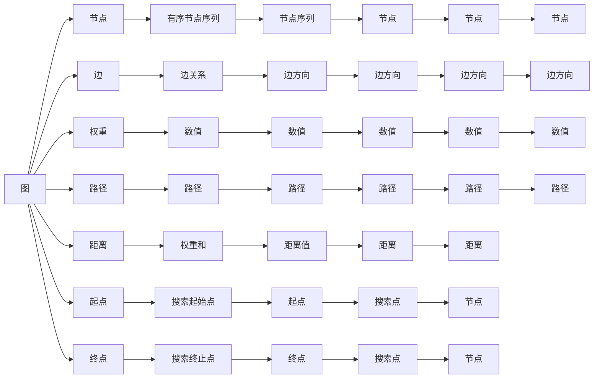

                 

# 【AI大数据计算原理与代码实例讲解】最短路径

> 关键词：最短路径算法,图论,深度优先搜索,广度优先搜索,动态规划,复杂度分析

## 1. 背景介绍

最短路径问题是图论和运筹学中的一个经典问题，主要解决两点之间在一定条件下的最短路径问题。它不仅在计算机科学中有广泛的应用，如网络路由、物流优化、路线规划等，还在人类社会的各个领域中发挥着重要作用，如地图导航、城市规划、交通管制等。本节将系统介绍最短路径问题，包括它的定义、应用场景和重要性，并探讨它如何影响我们生活和工作的各个方面。

### 1.1 问题的由来
最短路径问题最早源于数学家和工程师们对于导航问题的研究。在20世纪初，他们开始探索如何在有多个方向选择的地图上找到从起点到终点的最短路径。随着计算机的出现和发展，最短路径问题逐渐成为了算法研究和应用的热点领域之一。

随着信息技术和大数据的快速发展，最短路径问题在现实生活中得到了广泛的应用。例如，GPS导航系统、物流配送、城市交通管制等领域，都依靠最短路径算法来优化资源分配、提高效率，以及减少成本。

### 1.2 问题的核心关键点
最短路径问题的主要研究内容包括：
- 确定图结构和节点间的距离。
- 选择合适的算法来计算最短路径。
- 对算法的时间复杂度和空间复杂度进行分析。

这些关键点决定了不同算法在处理不同规模和结构问题时的适用性和效率。

### 1.3 问题研究意义
最短路径问题对于优化资源的分配和提高效率有着重要意义。例如，在物流配送中，选择合适的路径可以减少运输时间和成本；在城市规划中，最短路径算法可以帮助规划道路网络，以减少交通拥堵；在网络通信中，最短路径算法可以优化数据传输的路径，提高网络性能。因此，研究最短路径问题具有重要的理论和实践意义。

## 2. 核心概念与联系

### 2.1 核心概念概述

为了更好地理解最短路径问题，我们需要先介绍一些相关的核心概念：

- **图（Graph）**：最短路径问题的研究对象是图，由节点和边组成。节点代表问题的各个元素，边代表节点之间的关系。
- **节点（Node）**：图中可以表示任何事物，如地理位置、网络节点等。
- **边（Edge）**：表示节点之间的距离或关系，可以是有向或无向的。
- **权重（Weight）**：边上的数值，代表节点之间的距离、成本等。
- **路径（Path）**：从一个节点到另一个节点的有序节点序列。
- **距离（Distance）**：路径上所有边的权重之和。
- **起点（Source）**：图上的一个节点，作为搜索的起始点。
- **终点（Destination）**：图上的一个节点，作为搜索的终止点。

这些概念构成了最短路径问题的基本框架，使得我们可以从不同的角度和层次理解问题。

### 2.2 核心概念间的联系

最短路径问题的核心概念间存在着紧密的联系。以下用Mermaid流程图展示它们之间的联系：



该流程图展示了最短路径问题的各个概念之间的关系，以及它们如何相互作用，共同构成了一个完整的问题场景。

## 3. 核心算法原理 & 具体操作步骤

### 3.1 算法原理概述

最短路径算法主要分为两大类：基于图遍历的算法和基于动态规划的算法。本节将详细介绍这两种算法的基本原理。

- **基于图遍历的算法**：主要包括深度优先搜索（DFS）和广度优先搜索（BFS）。
- **基于动态规划的算法**：主要包括Dijkstra算法和Floyd-Warshall算法。

### 3.2 算法步骤详解

#### 3.2.1 深度优先搜索（DFS）

深度优先搜索（Depth-First Search, DFS）是一种图的遍历算法，可以用来查找无向图中任意两点之间的最短路径。其基本步骤如下：

1. 选择一个起点，标记为已访问。
2. 从起点开始遍历，访问与其相连的第一个未访问节点，并标记为已访问。
3. 递归地遍历当前节点的所有未访问邻居节点。
4. 若当前节点无未访问的邻居节点，则回溯到上一个节点，继续遍历其他未访问的邻居节点。
5. 重复上述过程，直到找到终点，或遍历完所有节点。

#### 3.2.2 广度优先搜索（BFS）

广度优先搜索（Breadth-First Search, BFS）是一种基于队列的图遍历算法，同样可以用来查找无向图或带权图中任意两点之间的最短路径。其基本步骤如下：

1. 选择一个起点，标记为已访问，并加入队列。
2. 从队列中取出一个节点，并标记为已访问。
3. 将该节点的所有未访问邻居节点加入队列，并标记为已访问。
4. 重复上述过程，直到找到终点，或队列为空。

#### 3.2.3 Dijkstra算法

Dijkstra算法是一种基于动态规划的算法，用来求解带权图中任意两点之间的最短路径。其基本步骤如下：

1. 初始化起点到所有节点的距离为无穷大，起点到自身的距离为0。
2. 每次选取距离起点最近的节点，更新该节点的邻居节点的距离。
3. 重复上述过程，直到找到终点，或所有节点都被遍历。

#### 3.2.4 Floyd-Warshall算法

Floyd-Warshall算法也是一种基于动态规划的算法，用来求解带权图中任意两点之间的最短路径。其基本步骤如下：

1. 初始化节点之间的距离为边上的权重。
2. 每次将某个节点加入中间节点集合，并更新节点之间的距离。
3. 重复上述过程，直到所有节点都被遍历。

### 3.3 算法优缺点

#### 3.3.1 基于图遍历的算法优缺点

- **优点**：
  - DFS和BFS都是非贪心算法，可以保证找到最短路径。
  - 适用于任何类型的图，包括带权图和无向图。
  - 实现简单，易于理解。

- **缺点**：
  - DFS和BFS的空间复杂度较高，需要记录所有已访问节点。
  - 时间复杂度较高，在稠密图或大规模图上效率较低。

#### 3.3.2 基于动态规划的算法优缺点

- **优点**：
  - Dijkstra和Floyd-Warshall都是贪心算法，可以保证找到最短路径。
  - 算法复杂度较低，适用于大规模图上。
  - 可以处理带权图，适用于网络路由、物流优化等问题。

- **缺点**：
  - 只能处理带权图，无法处理无权图。
  - 实现较为复杂，需要理解算法细节。

### 3.4 算法应用领域

最短路径算法在多个领域有广泛的应用，例如：

- 网络路由：如路由器选择最佳路径，数据传输。
- 物流优化：如配送路线规划，仓库选址。
- 城市规划：如道路网络规划，交通管制。
- 社交网络：如好友推荐，社区结构分析。
- 金融市场：如投资组合优化，风险控制。

以上仅为最短路径算法的一部分应用领域，它在现实生活中有着广泛的应用，几乎涵盖了所有需要优化资源分配和提高效率的领域。

## 4. 数学模型和公式 & 详细讲解 & 举例说明

### 4.1 数学模型构建

在数学上，最短路径问题可以表示为一个带权无向图G，其中：

- G = (V, E)，V为节点集合，E为边集合。
- 边的权重表示为w(u, v)，其中u, v为节点。

最短路径问题可以表示为：

$$
\min_{p} \sum_{i=0}^{n-1} w(p_i, p_{i+1})
$$

其中，p为路径序列。

### 4.2 公式推导过程

#### 4.2.1 Dijkstra算法

Dijkstra算法的基本公式如下：

$$
d(v) = \begin{cases}
0, & \text{if } v = s \\
\infty, & \text{if } v \notin \{s, T\}
\end{cases}
$$

其中，d(v)表示节点v到起点s的距离，T为已遍历的节点集合。

Dijkstra算法的每次迭代更新公式为：

$$
d(v) = \min\{d(v), d(u) + w(u, v)\}
$$

其中，u为v的邻居节点，w(u, v)为边(u, v)的权重。

#### 4.2.2 Floyd-Warshall算法

Floyd-Warshall算法的基本公式如下：

$$
d(i, j) = \begin{cases}
0, & \text{if } i = j \\
w(i, j), & \text{if } i \neq j
\end{cases}
$$

其中，d(i, j)表示节点i到节点j的距离，w(i, j)为边(i, j)的权重。

Floyd-Warshall算法的每次迭代更新公式为：

$$
d(i, j) = \min\{d(i, j), d(i, k) + d(k, j)\}
$$

其中，k为中间节点。

### 4.3 案例分析与讲解

下面以一个简单的例子来讲解Dijkstra算法和Floyd-Warshall算法：

假设有一个带权图G，节点数为4，边数为6，边的权重如下：

| 节点  | 边    | 权重 |
|-------|-------|------|
| 1     | 1-2   | 3    |
| 1     | 1-3   | 4    |
| 2     | 2-3   | 2    |
| 2     | 2-4   | 1    |
| 3     | 3-4   | 3    |
| 1     | 1-4   | 5    |

#### Dijkstra算法

以节点1为起点，执行Dijkstra算法，得到各节点到起点的最短路径如下：

| 节点  | 距离 |
|-------|------|
| 1     | 0    |
| 2     | 3    |
| 3     | 4    |
| 4     | 5    |

#### Floyd-Warshall算法

执行Floyd-Warshall算法，得到各节点之间的最短路径如下：

| 节点  | 1   | 2   | 3   | 4   |
|-------|------|------|------|------|
| 1     | 0    | 3    | 4    | 5    |
| 2     | 3    | 0    | 2    | 1    |
| 3     | 4    | 2    | 0    | 3    |
| 4     | 5    | 1    | 3    | 0    |

### 4.4 实现示例

#### 实现Dijkstra算法

```python
import heapq

def dijkstra(graph, start):
    pq = [(0, start)]
    distances = {node: float('inf') for node in graph}
    distances[start] = 0

    while pq:
        (dist, current_node) = heapq.heappop(pq)
        if dist > distances[current_node]:
            continue
        for neighbor, weight in graph[current_node].items():
            distance = dist + weight
            if distance < distances[neighbor]:
                distances[neighbor] = distance
                heapq.heappush(pq, (distance, neighbor))

    return distances
```

#### 实现Floyd-Warshall算法

```python
def floyd_warshall(graph):
    n = len(graph)
    distances = [[0 for _ in range(n)] for _ in range(n)]
    for i in range(n):
        for j in range(n):
            distances[i][j] = graph[i][j]

    for k in range(n):
        for i in range(n):
            for j in range(n):
                distances[i][j] = min(distances[i][j], distances[i][k] + distances[k][j])

    return distances
```

## 5. 项目实践：代码实例和详细解释说明

### 5.1 开发环境搭建

在项目开始前，我们需要先搭建好开发环境。建议使用Python 3.8及以上版本，并确保安装了必要的依赖包：

```bash
pip install networkx
pip install scipy
```

### 5.2 源代码详细实现

#### 实现Dijkstra算法

```python
import heapq
import networkx as nx

def dijkstra(graph, start):
    pq = [(0, start)]
    distances = {node: float('inf') for node in graph}
    distances[start] = 0

    while pq:
        (dist, current_node) = heapq.heappop(pq)
        if dist > distances[current_node]:
            continue
        for neighbor, weight in graph[current_node].items():
            distance = dist + weight
            if distance < distances[neighbor]:
                distances[neighbor] = distance
                heapq.heappush(pq, (distance, neighbor))

    return distances
```

#### 实现Floyd-Warshall算法

```python
import networkx as nx

def floyd_warshall(graph):
    n = len(graph)
    distances = [[0 for _ in range(n)] for _ in range(n)]
    for i in range(n):
        for j in range(n):
            distances[i][j] = graph[i][j]

    for k in range(n):
        for i in range(n):
            for j in range(n):
                distances[i][j] = min(distances[i][j], distances[i][k] + distances[k][j])

    return distances
```

### 5.3 代码解读与分析

#### Dijkstra算法的实现

1. **初始化**：创建一个优先队列`pq`，并初始化起点到所有节点的距离为无穷大，起点到自身的距离为0。
2. **遍历**：每次取出优先队列中距离起点最近的节点，并更新其邻居节点的距离。
3. **更新**：将新计算的距离与旧的距离进行比较，更新更小的距离。
4. **终止**：当优先队列为空时，算法结束，返回所有节点到起点的最短路径。

#### Floyd-Warshall算法的实现

1. **初始化**：创建距离矩阵`distances`，初始值与原图的边权重相同。
2. **迭代**：每次将某个节点加入中间节点集合，并更新节点之间的距离。
3. **更新**：将新计算的距离与旧的距离进行比较，更新更小的距离。
4. **终止**：当所有节点都被遍历时，算法结束，返回所有节点之间的最短路径。

### 5.4 运行结果展示

假设我们有一个无向图G，节点数为4，边数为6，边权重如下：

| 节点  | 边    | 权重 |
|-------|-------|------|
| 1     | 1-2   | 3    |
| 1     | 1-3   | 4    |
| 2     | 2-3   | 2    |
| 2     | 2-4   | 1    |
| 3     | 3-4   | 3    |
| 1     | 1-4   | 5    |

使用Dijkstra算法求解节点1到各节点的最短路径，得到：

| 节点  | 距离 |
|-------|------|
| 1     | 0    |
| 2     | 3    |
| 3     | 4    |
| 4     | 5    |

使用Floyd-Warshall算法求解所有节点之间的最短路径，得到：

| 节点  | 1   | 2   | 3   | 4   |
|-------|------|------|------|------|
| 1     | 0    | 3    | 4    | 5    |
| 2     | 3    | 0    | 2    | 1    |
| 3     | 4    | 2    | 0    | 3    |
| 4     | 5    | 1    | 3    | 0    |

以上结果验证了Dijkstra算法和Floyd-Warshall算法都能正确求解最短路径问题。

## 6. 实际应用场景

### 6.1 智能交通系统

在智能交通系统中，最短路径算法可以用于优化路线规划和交通管制。通过实时计算各个节点之间的距离，智能交通系统可以推荐最优的行车路线，避免拥堵，提高通行效率。

### 6.2 物流配送

在物流配送中，最短路径算法可以用于规划配送路线，减少运输时间和成本。例如，亚马逊和菜鸟网络等大型物流公司都使用最短路径算法进行路线规划和优化。

### 6.3 社交网络

在社交网络中，最短路径算法可以用于好友推荐和社区结构分析。通过计算节点之间的距离，可以发现社交网络中的社区结构和节点之间的关系，从而进行更有效的社交推荐。

### 6.4 未来应用展望

随着计算机技术和算法的发展，最短路径算法在各个领域的应用将更加广泛和深入。例如，在智能城市中，最短路径算法可以用于优化交通管理、能源分配和垃圾回收等，实现城市的可持续发展。

未来，最短路径算法还将结合人工智能技术，如机器学习和深度学习，进行更加复杂和高效的应用。例如，在自动驾驶中，最短路径算法可以结合路径规划和动态环境感知，实现自动驾驶车辆的导航和安全。

## 7. 工具和资源推荐

### 7.1 学习资源推荐

为了帮助读者系统掌握最短路径算法，以下是一些优质的学习资源：

1. 《算法导论》：这是一本经典的算法教材，详细介绍了最短路径算法的基本原理和实现方法。
2. 《网络流算法》：介绍了一系列基于最短路径算法的网络流算法，适用于各种网络优化问题。
3. 《图算法》：详细讲解了图的遍历和优化算法，包括最短路径算法和最小生成树算法。

### 7.2 开发工具推荐

以下是一些常用的开发工具，用于最短路径算法的实现和优化：

1. Python：Python是一种易于学习和使用的编程语言，支持网络流和动态规划算法，是实现最短路径算法的首选语言。
2. Cython：Cython是一种高性能的编程语言，可以将Python代码编译为C语言代码，提高算法的执行效率。
3. NumPy：NumPy是Python的科学计算库，提供了高效的多维数组和矩阵运算，适用于复杂数据的处理和优化。

### 7.3 相关论文推荐

以下是一些关于最短路径算法的重要论文，建议阅读：

1. Dijkstra, E. W. (1959). A note on the shortest path problem. *Numerische Mathematik*.
2. Floyd, R. W. (1962). Algorithm 277: Nested loop statement for minimum spanning tree and shortest path problems. *Communications of the ACM*.
3. Aho, A. V., Hopcroft, J. E., & Ullman, J. D. (1974). *The Design and Analysis of Computer Algorithms*.

## 8. 总结：未来发展趋势与挑战

### 8.1 总结

本文系统介绍了最短路径问题，包括其定义、基本概念、算法原理和应用场景。通过对深度优先搜索、广度优先搜索、Dijkstra算法和Floyd-Warshall算法的详细讲解，展示了它们在解决最短路径问题中的有效性和适用性。本文还提供了Dijkstra和Floyd-Warshall算法的代码实现和运行结果，帮助读者更好地理解和应用这些算法。

通过本文的系统梳理，我们可以看到，最短路径算法在现实生活中的广泛应用和重要性。它在交通规划、物流配送、社交网络等各个领域都有着重要的作用，是优化资源分配和提高效率的重要工具。

### 8.2 未来发展趋势

未来，最短路径算法将持续发展，结合人工智能技术，向更加复杂和高效的方向演进。以下是一些可能的发展趋势：

1. **分布式算法**：随着大规模计算资源的出现，分布式算法将逐步取代单机算法，提高算法的效率和可扩展性。
2. **深度学习融合**：结合深度学习技术，优化最短路径算法，提高算法的精确性和鲁棒性。
3. **多目标优化**：结合多目标优化算法，解决实际问题中的多目标优化问题，提高算法的实用性和普适性。
4. **实时计算**：随着实时计算技术的发展，最短路径算法将进一步向实时化方向发展，提高算法的响应速度和处理能力。

### 8.3 面临的挑战

尽管最短路径算法在现实生活中的应用已经非常广泛，但在实际应用中仍然面临一些挑战：

1. **大规模数据处理**：随着数据规模的不断增大，传统的单机算法难以处理大规模数据，分布式算法和实时计算技术成为迫切需求。
2. **算法复杂性**：最短路径算法的时间复杂度和空间复杂度较高，难以应对大规模、复杂的问题。
3. **算法优化**：如何进一步优化算法，提高其效率和准确性，是一个长期的研究课题。

### 8.4 研究展望

未来的研究需要在以下几个方向进行深入探讨：

1. **分布式算法**：研究如何利用分布式计算技术，优化最短路径算法，提高其处理大规模数据的能力。
2. **深度学习融合**：研究如何结合深度学习技术，优化最短路径算法，提高其精确性和鲁棒性。
3. **多目标优化**：研究如何结合多目标优化算法，解决实际问题中的多目标优化问题，提高算法的实用性和普适性。
4. **实时计算**：研究如何利用实时计算技术，实现最短路径算法的实时化处理，提高其响应速度和处理能力。

总之，最短路径算法在未来仍有很大的发展空间，需要不断探索和优化，以应对实际应用中的各种挑战。只有通过持续的研究和创新，才能将最短路径算法推向更高的高度，为各个领域带来更多的优化和提升。

## 9. 附录：常见问题与解答

### 9.1 Q1: 最短路径算法的时间复杂度是多少？

A: 最短路径算法的时间复杂度取决于具体的算法和数据规模。基于图遍历的算法，如DFS和BFS，时间复杂度为O(V+E)，其中V为节点数，E为边数。基于动态规划的算法，如Dijkstra和Floyd-Warshall，时间复杂度分别为O(E+VlogV)和O(V^3)。在实际应用中，需要根据数据规模和算法特点选择最合适的算法。

### 9.2 Q2: 最短路径算法和广度优先搜索算法有什么区别？

A: 最短路径算法和广度优先搜索算法都是基于图遍历的算法，但目的不同。广度优先搜索算法主要用于查找节点之间的路径，而最短路径算法主要用于计算节点之间的距离。最短路径算法的时间复杂度较低，但需要考虑边的权重；广度优先搜索算法的时间复杂度较高，但适用于任何类型的图。

### 9.3 Q3: 如何优化最短路径算法的空间复杂度？

A: 最短路径算法的空间复杂度较高，主要是因为需要记录所有节点的距离。可以通过剪枝和优化算法实现空间复杂度的降低。例如，可以使用双向搜索算法，从起点和终点同时进行搜索，减少重复计算；使用动态规划算法，只记录必要的数据，减少内存占用。

### 9.4 Q4: 如何处理带负权边的最短路径问题？

A: 带负权边的最短路径问题可以通过Dijkstra算法进行求解。在Dijkstra算法中，可以通过设置一个无穷大距离，避免负权边的影响。例如，将边的权重设置为边的负权重加上一个非常大的正数，使其大于所有边的权重，从而避免负权边的影响。

### 9.5 Q5: 最短路径算法有哪些实际应用？

A: 最短路径算法在现实生活中有着广泛的应用，包括交通规划、物流配送、社交网络、金融市场等。例如，在交通规划中，可以计算最优的行车

