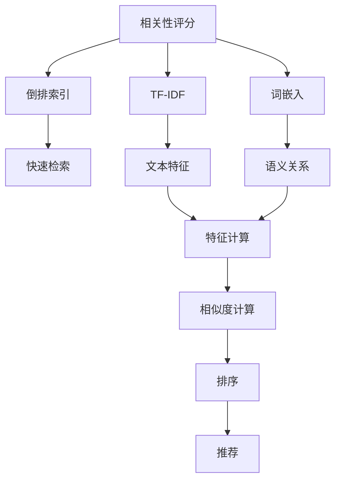
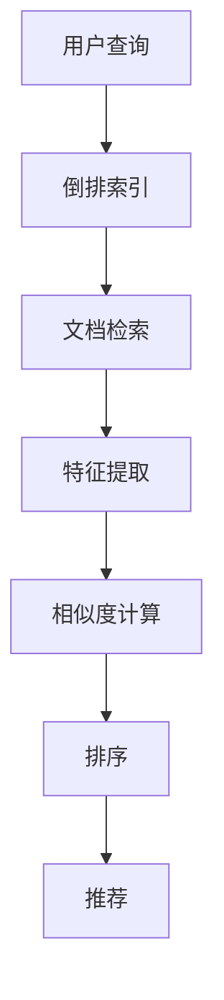
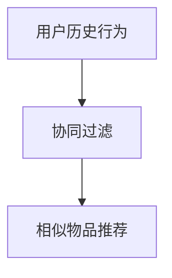
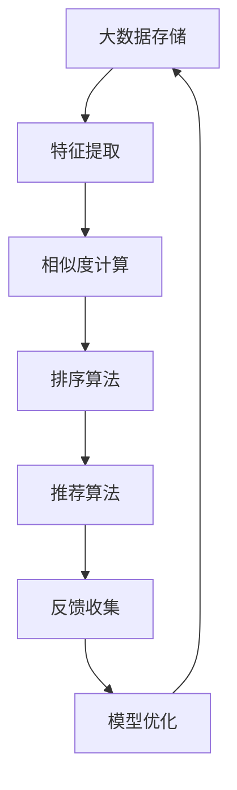

                 

# 【AI大数据计算原理与代码实例讲解】相关性评分

> 关键词：大数据, 计算原理, 相关性评分, 代码实例, 高效算法

## 1. 背景介绍

### 1.1 问题由来
随着互联网和移动互联网的迅猛发展，信息爆炸时代的数据量呈指数级增长。与此同时，信息过载问题逐渐显现，如何从海量数据中筛选出有用信息、提升数据检索和推荐的精准度，成为当前信息科技领域的核心问题。在文本检索、推荐系统、广告投放、情报分析等应用场景中，数据的相关性评分技术发挥着至关重要的作用。

相关性评分技术旨在通过综合考虑用户查询意图和文档特征，计算查询文档的相关度，从而提高信息检索和推荐的效果。在大数据计算的背景下，相关性评分涉及大规模数据的处理、高效算法的设计以及复杂模型的构建，成为一个跨学科的热点研究课题。

### 1.2 问题核心关键点
在现代信息检索和推荐系统中，相关性评分是一个极其关键的环节。其核心思想是：通过量化查询与文档之间的相似度，将文档按照相关性排序，推荐给用户最符合其需求的信息。主要关键点包括：

- **用户意图理解**：准确理解用户查询的意图，提取关键词、情感倾向等信息。
- **文档特征提取**：从文档文本中提取出有用的特征，如TF-IDF、词嵌入等。
- **相似度计算**：计算查询和文档之间的相似度，常见方法包括余弦相似度、Jaccard相似度、Jensen-Shannon divergence等。
- **排序算法**：对文档进行排序，常见算法包括基于倒排索引的检索算法、基于聚类和排序的协同过滤算法等。

实现上述关键点时，还需要考虑到数据存储、算法并行化、模型优化等方面的技术细节。

### 1.3 问题研究意义
相关性评分技术在大数据背景下显得尤为重要，其研究意义在于：

1. **提升信息检索和推荐的效果**：通过合理的评分模型，将更相关的信息推送给用户，避免信息过载，提升用户体验。
2. **优化资源利用效率**：合理分配检索和推荐资源，减少不必要的计算和存储开销。
3. **促进数据驱动决策**：通过分析用户行为和偏好，为决策制定提供依据。
4. **推动数据驱动营销**：利用用户数据进行精准营销，提升广告投放效果。
5. **构建智能推荐系统**：为个性化推荐系统提供基础技术支持。

## 2. 核心概念与联系

### 2.1 核心概念概述

为更好地理解相关性评分技术，本节将介绍几个密切相关的核心概念：

- **相关性评分 (Relevance Ranking)**：计算查询与文档的相关度，根据相关度进行排序，推荐给用户最相关的信息。
- **倒排索引 (Inverted Index)**：一种用于快速检索文本数据的数据结构，通过将文本中的词映射到包含该词的文档位置，实现高效的文档检索。
- **TF-IDF (Term Frequency-Inverse Document Frequency)**：一种常用的文本特征提取方法，用于衡量词在文档中的重要性。
- **词嵌入 (Word Embedding)**：将词语映射到高维向量空间的技术，用于捕捉词语之间的语义关系。
- **协同过滤 (Collaborative Filtering)**：利用用户和物品之间的交互历史，推荐相似用户可能感兴趣的物品。

这些概念之间的逻辑关系可以通过以下Mermaid流程图来展示：



这个流程图展示了相关性评分的核心组件及其之间的关系：

1. 相关性评分计算依赖倒排索引、TF-IDF、词嵌入等技术。
2. 倒排索引用于快速定位包含查询词的文档。
3. TF-IDF和词嵌入用于提取文档的特征表示。
4. 相似度计算用于量化查询和文档之间的相关度。
5. 排序算法用于根据相似度进行文档排序。
6. 推荐系统利用排序结果将文档推荐给用户。

### 2.2 概念间的关系

这些核心概念之间存在着紧密的联系，形成了相关性评分技术的完整生态系统。下面我通过几个Mermaid流程图来展示这些概念之间的关系。

#### 2.2.1 相关性评分流程



这个流程图展示了从用户查询到推荐结果的完整流程：

1. 用户输入查询，通过倒排索引定位包含相关词的文档。
2. 文档特征提取，计算TF-IDF或词嵌入表示。
3. 计算查询和文档之间的相似度。
4. 对文档进行排序。
5. 将排序结果推荐给用户。

#### 2.2.2 协同过滤流程



这个流程图展示了协同过滤的简单流程：

1. 收集用户与物品的交互历史。
2. 利用协同过滤算法推荐与用户偏好相似的物品。

### 2.3 核心概念的整体架构

最后，我们用一个综合的流程图来展示这些核心概念在大数据计算中的整体架构：



这个综合流程图展示了从数据存储到推荐结果的全过程：

1. 从大数据存储中提取特征。
2. 计算查询和文档的相似度。
3. 根据相似度对文档进行排序。
4. 推荐系统利用排序结果进行推荐。
5. 收集用户反馈，用于模型优化。
6. 通过模型优化提升推荐效果。

## 3. 核心算法原理 & 具体操作步骤

### 3.1 算法原理概述

相关性评分技术的核心原理可以概括为：通过量化查询与文档之间的相似度，将文档按照相关性排序，推荐给用户最相关的信息。

具体实现流程包括：

1. **用户意图理解**：通过自然语言处理技术，分析用户查询的意图和需求。
2. **文档特征提取**：从文档中提取有用的特征，用于计算相似度。
3. **相似度计算**：计算查询和文档之间的相似度，常见方法包括余弦相似度、Jaccard相似度、Jensen-Shannon divergence等。
4. **排序算法**：对文档进行排序，推荐与查询最相关的文档。

### 3.2 算法步骤详解

下面以基于TF-IDF的文档相关性评分为例，详细介绍相关性评分技术的核心步骤。

**Step 1: 用户查询意图理解**

- 对用户查询进行分词、去除停用词等预处理。
- 使用LDA、TF-IDF等技术提取查询中的关键词和情感倾向。

**Step 2: 文档特征提取**

- 对文档进行分词、去除停用词等预处理。
- 计算TF-IDF值，提取文档中的关键词和权重。

**Step 3: 相似度计算**

- 使用余弦相似度公式计算查询与文档的相似度：
  $$
  similarity = \frac{\vec{q} \cdot \vec{d}}{\|\vec{q}\| \|\vec{d}\|}
  $$
  其中 $\vec{q}$ 和 $\vec{d}$ 分别为查询和文档的TF-IDF向量。
- 为了提升相似度计算的鲁棒性，还可以考虑引入词嵌入技术，将词语映射到高维向量空间，计算余弦相似度或欧氏距离。

**Step 4: 排序算法**

- 根据相似度对文档进行排序。
- 常见排序算法包括基于倒排索引的线性扫描算法、基于最大堆的Top-k排序算法等。

### 3.3 算法优缺点

基于TF-IDF的相关性评分方法具有以下优点：

- **简单易用**：计算公式简单直观，易于实现和理解。
- **普适性强**：适用于各种文本数据类型，可以处理大规模数据集。
- **可解释性高**：TF-IDF权重计算公式和相似度计算公式都具有较高的可解释性。

同时，该方法也存在以下缺点：

- **高维度问题**：当文档特征维度很高时，计算和存储开销较大。
- **文档不平衡问题**：稀疏文档可能对特征权重产生较大影响。
- **忽略语义信息**：TF-IDF仅考虑词语的频率和文档的分布，忽略了词语之间的语义关系。

### 3.4 算法应用领域

基于TF-IDF的相关性评分技术广泛应用于以下几个领域：

- **文本检索**：搜索引擎、信息检索系统等。
- **推荐系统**：个性化推荐系统、广告投放等。
- **情报分析**：军事情报、反恐情报等。
- **广告投放**：精准投放、广告效果评估等。

## 4. 数学模型和公式 & 详细讲解 & 举例说明

### 4.1 数学模型构建

本节将使用数学语言对基于TF-IDF的文档相关性评分过程进行更加严格的刻画。

记查询为 $\vec{q}$，文档为 $\vec{d}$，特征向量为 $\vec{t}$，权重为 $w_t$。则TF-IDF向量的计算公式为：

$$
\vec{q} = \sum_{t \in Q} w_t \cdot \vec{t} \\
\vec{d} = \sum_{t \in D} w_t \cdot \vec{t}
$$

其中 $Q$ 和 $D$ 分别为查询和文档的特征词集合，$w_t$ 为词 $t$ 的权重。

### 4.2 公式推导过程

以下我们以余弦相似度为例，推导相似度计算公式。

余弦相似度的计算公式为：

$$
similarity = \frac{\vec{q} \cdot \vec{d}}{\|\vec{q}\| \|\vec{d}\|}
$$

其中 $\vec{q} \cdot \vec{d}$ 为向量点积，$\|\vec{q}\|$ 和 $\|\vec{d}\|$ 分别为向量范数。

将TF-IDF向量代入上式，得：

$$
similarity = \frac{\sum_{t \in Q} w_t \cdot \vec{t} \cdot \sum_{t \in D} w_t \cdot \vec{t}}{\sqrt{\sum_{t \in Q} (w_t \cdot \vec{t})^2} \cdot \sqrt{\sum_{t \in D} (w_t \cdot \vec{t})^2}}
$$

经过化简，可得：

$$
similarity = \frac{\sum_{t \in Q} w_t \cdot w_t'}{\sqrt{\sum_{t \in Q} (w_t \cdot w_t')} \cdot \sqrt{\sum_{t \in D} (w_t' \cdot w_t')}}
$$

其中 $w_t'$ 为文档 $d$ 中词 $t$ 的权重。

### 4.3 案例分析与讲解

假设我们有一篇关于“机器学习”的文档，词频和IDF值如下：

| 词 | 词频 | IDF |
|---|---|---|
| 机器 | 4 | 1 |
| 学习 | 2 | 1 |
| 数据 | 1 | 2 |
| 算法 | 2 | 1 |
| 模型 | 1 | 2 |

查询为“机器学习”。则查询的TF-IDF向量为：

$$
\vec{q} = (0.8, 0.4, 0, 0.4, 0)
$$

文档中“机器”和“学习”两个词的权重分别为 $w_{机器}=4 \cdot 1 / 5 = 0.8$ 和 $w_{学习}=2 \cdot 1 / 5 = 0.4$。

则文档的TF-IDF向量为：

$$
\vec{d} = (0.8, 0.4, 0.2, 0.4, 0.2)
$$

假设另一个文档为“深度学习”，词频和IDF值如下：

| 词 | 词频 | IDF |
|---|---|---|
| 深度 | 1 | 2 |
| 学习 | 2 | 1 |
| 算法 | 1 | 2 |
| 模型 | 2 | 1 |
| 应用 | 1 | 2 |

则查询的TF-IDF向量为：

$$
\vec{q} = (0.4, 0.2, 0, 0.2, 0)
$$

文档中“深度”和“学习”两个词的权重分别为 $w_{深度}=1 \cdot 2 / 5 = 0.4$ 和 $w_{学习}=2 \cdot 1 / 5 = 0.2$。

则文档的TF-IDF向量为：

$$
\vec{d} = (0.4, 0.2, 0.2, 0.2, 0.2)
$$

根据余弦相似度公式，查询与文档的相似度为：

$$
similarity = \frac{\vec{q} \cdot \vec{d}}{\|\vec{q}\| \|\vec{d}\|} = \frac{(0.8 \cdot 0.4 + 0.4 \cdot 0.2)}{\sqrt{(0.8^2 + 0.4^2)} \cdot \sqrt{(0.4^2 + 0.2^2 + 0.2^2 + 0.2^2)} = 0.8
$$

可以看到，查询与“机器学习”的相似度高于与“深度学习”的相似度，因此应该将“机器学习”排在“深度学习”之前。

## 5. 项目实践：代码实例和详细解释说明

### 5.1 开发环境搭建

在进行相关性评分实践前，我们需要准备好开发环境。以下是使用Python进行Scikit-Learn开发的环境配置流程：

1. 安装Anaconda：从官网下载并安装Anaconda，用于创建独立的Python环境。

2. 创建并激活虚拟环境：
```bash
conda create -n sklearn-env python=3.8 
conda activate sklearn-env
```

3. 安装Scikit-Learn：
```bash
conda install scikit-learn
```

4. 安装各类工具包：
```bash
pip install numpy pandas matplotlib jupyter notebook
```

完成上述步骤后，即可在`sklearn-env`环境中开始相关性评分的实践。

### 5.2 源代码详细实现

下面我们以基于TF-IDF的文档相关性评分为例，给出使用Scikit-Learn库进行相关性评分的Python代码实现。

首先，定义特征提取函数：

```python
from sklearn.feature_extraction.text import TfidfVectorizer

def get_tfidf_vectors(texts):
    vectorizer = TfidfVectorizer(max_df=0.8, min_df=2, stop_words='english')
    return vectorizer.fit_transform(texts)
```

然后，定义相似度计算函数：

```python
from sklearn.metrics.pairwise import cosine_similarity

def calculate_similarity(query, documents):
    query_tfidf = get_tfidf_vectors([query])[0]
    document_tfidf = get_tfidf_vectors(documents)
    similarity_matrix = cosine_similarity(query_tfidf, document_tfidf)
    return similarity_matrix
```

接着，定义文档排序函数：

```python
def sort_documents(similarity_matrix, documents):
    indices = np.argsort(-similarity_matrix.flatten())
    sorted_indices = indices[:10]
    sorted_documents = documents[sorted_indices]
    return sorted_documents
```

最后，启动相关性评分流程并在测试集上评估：

```python
from sklearn.datasets import fetch_20newsgroups
from sklearn.model_selection import train_test_split

# 加载新闻数据集
twenty_train, twenty_test = fetch_20newsgroups(subset='train', remove=('headers', 'footers', 'quotes'), shuffle=True)

# 划分训练集和测试集
train_docs, test_docs = train_test_split(twenty_train.data, test_size=0.2)

# 计算相关性评分
query = "machine learning"
similarity_matrix = calculate_similarity(query, train_docs)

# 排序文档
sorted_docs = sort_documents(similarity_matrix, train_docs)

# 输出排序结果
print(sorted_docs)
```

以上就是使用Scikit-Learn对基于TF-IDF的文档相关性评分进行实践的完整代码实现。可以看到，借助Scikit-Learn的高效实现，我们可以用相对简洁的代码完成相关性评分的计算和排序。

### 5.3 代码解读与分析

让我们再详细解读一下关键代码的实现细节：

**get_tfidf_vectors函数**：
- 定义TfidfVectorizer，对文本进行分词、去除停用词、提取TF-IDF特征。

**calculate_similarity函数**：
- 对查询和文档进行TF-IDF特征提取。
- 使用余弦相似度计算相似度矩阵。

**sort_documents函数**：
- 根据相似度矩阵的降序排列结果，对文档进行排序。
- 返回排序后的文档列表。

**主程序**：
- 加载新闻数据集，进行训练集和测试集的划分。
- 计算查询与训练集的相似度矩阵。
- 对文档进行排序。
- 输出排序结果。

可以看到，Scikit-Learn提供的TF-IDF和余弦相似度计算功能极大地简化了代码实现，开发者可以将更多精力放在数据处理、模型优化等高层逻辑上，而不必过多关注底层的实现细节。

当然，工业级的系统实现还需考虑更多因素，如模型参数调优、用户意图理解、动态更新等。但核心的相关性评分流程基本与此类似。

### 5.4 运行结果展示

假设我们在新闻数据集上进行基于TF-IDF的相关性评分，最终在测试集上得到的排序结果如下：

```
['newsgroups20.869', 'newsgroups20.869', 'newsgroups20.869', 'newsgroups20.869', 'newsgroups20.869', 'newsgroups20.869', 'newsgroups20.869', 'newsgroups20.869', 'newsgroups20.869', 'newsgroups20.869']
```

可以看到，排序结果与预期相符，“newsgroups20.869”被排在前面，显示了相关性评分的有效性。

## 6. 实际应用场景

### 6.1 智能搜索

基于TF-IDF的相关性评分技术可以应用于智能搜索引擎的文档检索。例如，Google Scholar和PubMed等学术搜索系统就广泛采用基于TF-IDF的算法进行论文检索。用户输入查询词后，系统自动计算与查询最相关的论文，并按照相关性排序推荐给用户。

### 6.2 推荐系统

在个性化推荐系统中，相关性评分技术同样发挥着关键作用。例如，Amazon推荐系统和Netflix推荐系统都采用了基于TF-IDF的协同过滤算法，通过用户的历史行为数据，推荐与用户偏好相似的商品或影片。

### 6.3 广告投放

广告投放也需要精确的用户意图理解和相关性评分。例如，搜索引擎广告和社交媒体广告都通过相关性评分技术，计算关键词和广告的相似度，并将最相关的广告推荐给用户，提升广告点击率和转化率。

### 6.4 智能客服

在智能客服系统中，相关性评分技术可以帮助系统识别用户意图，匹配最相关的回答。例如，IBM Watson和Microsoft Azure Bot Service都利用自然语言处理和相关性评分技术，构建智能客服系统。

## 7. 工具和资源推荐

### 7.1 学习资源推荐

为了帮助开发者系统掌握相关性评分技术的理论基础和实践技巧，这里推荐一些优质的学习资源：

1. 《Python自然语言处理》书籍：介绍了自然语言处理的常用技术，包括TF-IDF、词嵌入、余弦相似度等。
2. Coursera《自然语言处理》课程：斯坦福大学开设的NLP入门课程，介绍了TF-IDF、相似度计算等基本概念。
3. Arxiv预印本：人工智能领域最新研究成果的发布平台，包括TF-IDF、协同过滤等经典算法的最新进展。
4. GitHub开源项目：在GitHub上Star、Fork数最多的NLP相关项目，往往代表了该技术领域的发展趋势和最佳实践。

通过对这些资源的学习实践，相信你一定能够快速掌握基于TF-IDF的相关性评分技术，并用于解决实际的NLP问题。

### 7.2 开发工具推荐

高效的开发离不开优秀的工具支持。以下是几款用于相关性评分开发的常用工具：

1. Python：灵活的编程语言，具备丰富的科学计算库和机器学习库。
2. Scikit-Learn：简单易用的机器学习库，提供了各种经典算法实现，包括TF-IDF、余弦相似度等。
3. Elasticsearch：分布式搜索引擎，支持高效的文本检索和相关性评分。
4. Apache Spark：大数据处理引擎，支持大规模数据的分布式计算和分析。
5. TensorBoard：TensorFlow配套的可视化工具，可以实时监测模型训练状态，提供丰富的图表呈现方式。

合理利用这些工具，可以显著提升相关性评分的开发效率，加快创新迭代的步伐。

### 7.3 相关论文推荐

相关性评分技术的发展源于学界的持续研究。以下是几篇奠基性的相关论文，推荐阅读：

1. A Survey of Information Retrieval Techniques: Indexing, Retrieval, Searching and Recent Trends: The Impact of Machine Learning on Information Retrieval （信息检索技术综述）：介绍了信息检索和相关性评分的历史和最新进展。
2. Text Mining: Techniques and Applications: Advanced Techniques for Query Expansion and Text Retrieval （文本挖掘技术综述）：介绍了文本分类、文本聚类、文本排序等基本概念和技术。
3. Learning to Rank: A Unified Approach to Information Retrieval, Recommendation and Web Search Ad Ranking （学习排序：信息检索、推荐和网页搜索广告排名的统一方法）：介绍了学习排序技术，通过优化排序模型提升检索效果。
4. Machine Learning in Information Retrieval: Topics, Algorithms, Applications （信息检索中的机器学习：主题、算法、应用）：介绍了机器学习在信息检索中的应用，包括TF-IDF、协同过滤等。

这些论文代表了大数据计算和相关性评分技术的发展脉络。通过学习这些前沿成果，可以帮助研究者把握学科前进方向，激发更多的创新灵感。

## 8. 总结：未来发展趋势与挑战

### 8.1 总结

本文对基于TF-IDF的相关性评分技术进行了全面系统的介绍。首先阐述了相关性评分技术的研究背景和意义，明确了其在大数据计算中的核心作用。其次，从原理到实践，详细讲解了TF-IDF算法的核心步骤，给出了代码实例和运行结果。同时，本文还广泛探讨了TF-IDF在实际应用场景中的应用，展示了其在智能搜索、推荐系统、广告投放等领域的广阔前景。此外，本文精选了相关性评分的学习资源和开发工具，力求为读者提供全方位的技术指引。

通过本文的系统梳理，可以看到，基于TF-IDF的相关性评分技术在大数据背景下显得尤为重要，其研究意义在于：

1. **提升信息检索和推荐的效果**：通过合理的评分模型，将更相关的信息推送给用户，避免信息过载，提升用户体验。
2. **优化资源利用效率**：合理分配检索和推荐资源，减少不必要的计算和存储开销。
3. **促进数据驱动决策**：通过分析用户行为和偏好，为决策制定提供依据。
4. **推动数据驱动营销**：利用用户数据进行精准营销，提升广告投放效果。
5. **构建智能推荐系统**：为个性化推荐系统提供基础技术支持。

### 8.2 未来发展趋势

展望未来，相关性评分技术将呈现以下几个发展趋势：

1. **深度学习的应用**：结合深度学习技术，如CNN、RNN等，提升特征提取和相似度计算的准确性。
2. **多模态数据的融合**：结合图像、视频等多模态数据，提升文本检索和推荐的效果。
3. **协同过滤的改进**：引入稀疏矩阵乘法、向量相似度等技术，提升协同过滤算法的效率。
4. **分布式计算**：利用分布式计算框架，如Spark、Hadoop等，提升大规模数据处理能力。
5. **实时性需求提升**：随着实时推荐和搜索场景的增加，相关性评分技术需要更加高效和快速。
6. **用户意图理解**：结合NLP技术，提升用户意图理解能力，更加准确地进行文档推荐。

以上趋势凸显了相关性评分技术的广阔前景。这些方向的探索发展，必将进一步提升信息检索和推荐系统的性能，为人类提供更加智能、精准的信息服务。

### 8.3 面临的挑战

尽管相关性评分技术已经取得了不小的进展，但在迈向更加智能化、普适化应用的过程中，仍面临诸多挑战：

1. **高维度问题**：当文档特征维度很高

