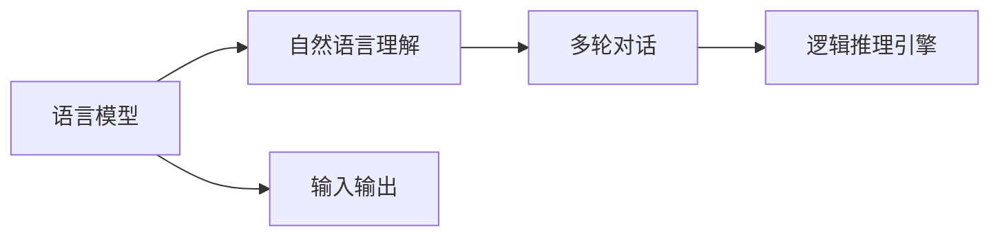

                 

# 【LangChain编程：从入门到实践】LangChain中的代理

> 关键词：LangChain, 代理, 编程, 语言模型, 自然语言处理, 智能对话, 人工智能

## 1. 背景介绍

在人工智能领域，自然语言处理(Natural Language Processing, NLP)技术已经取得了显著的进步。近年来，一种被称为语言模型(Language Model, LM)的新型技术，在诸多应用场景中大放异彩。语言模型能够自动生成连贯、自然、甚至具有一定创造性的文本，为人工智能对话系统、文本生成、机器翻译等任务提供了强大的支持。其中，OpenAI的GPT系列模型、Google的BERT模型等，已经成为了自然语言处理领域的标杆。

然而，尽管语言模型在理解和生成文本方面具有显著优势，但其在执行复杂逻辑推理、处理多轮对话等任务时仍显不足。为了解决这些问题，LangChain应运而生。LangChain是一个开源的、支持多轮对话的语义理解工具，其利用深度学习技术，实现了语言模型与逻辑推理引擎的结合，旨在构建更加智能、可解释的人工智能对话系统。在LangChain中，代理(Agent)是实现其核心功能的关键组件。

代理是LangChain中的核心单元，负责理解用户输入，执行操作，生成响应。在代理的设计和实现过程中，开发者可以灵活利用各种先进的AI技术，包括深度学习、自然语言理解、逻辑推理等，来提升代理的智能水平和对话质量。

## 2. 核心概念与联系

### 2.1 核心概念概述

为了更好地理解LangChain中的代理，首先需要介绍几个关键概念：

- **语言模型(LM)**：一种能够根据上下文自动预测下一个单词或文本序列的模型。常见的语言模型包括RNN、LSTM、Transformer等，它们在预训练和微调后，能够具备强大的语言理解和生成能力。
- **自然语言理解(NLU)**：将自然语言转换为计算机可处理的形式，包括词法分析、句法分析、语义分析等。
- **多轮对话**：指在多次对话中，模型需要理解和记忆对话历史，并能够根据上下文生成合适的响应。
- **逻辑推理引擎**：用于执行基于规则或模型的推理操作，帮助代理解决逻辑问题或执行复杂任务。

这些概念之间的联系可以通过以下Mermaid流程图来展示：



这个流程图展示了语言模型、自然语言理解、多轮对话和逻辑推理引擎之间的关系。语言模型是整个系统的基础，自然语言理解将用户输入转换为模型可处理的格式，多轮对话让系统能够记住上下文，逻辑推理引擎则用于执行复杂的推理任务。输入输出则是代理与用户之间的交互。

### 2.2 概念间的关系

这些核心概念之间存在着紧密的联系，共同构成了LangChain的完整系统架构。以下是一些关键关系：

- **语言模型与自然语言理解**：语言模型通过预训练和微调，学习到了文本的语义和语法规律。自然语言理解则将这些规律应用到具体文本的解析中，帮助代理理解用户输入。
- **多轮对话与逻辑推理**：多轮对话使代理能够记住和处理历史信息。逻辑推理则让代理能够基于历史信息和当前输入，执行复杂的推理操作。
- **输入输出与代理**：输入输出是代理与用户交互的界面，代理需要根据输入输出，灵活运用各种技术来生成自然、合理的响应。

这些关系共同构成了LangChain的运行机制，使其能够高效、智能地处理自然语言输入和生成输出。

## 3. 核心算法原理 & 具体操作步骤

### 3.1 算法原理概述

LangChain中的代理，本质上是一种基于深度学习和逻辑推理的双重模型。其核心算法原理可以概括为以下几个步骤：

1. **输入处理**：代理首先将用户输入的文本，通过自然语言理解技术，转换为模型可处理的向量表示。
2. **模型推理**：基于转换后的向量，语言模型对输入文本进行概率分布预测，生成文本的下一个可能的单词或句子。
3. **决策生成**：代理根据语言模型的预测结果，执行相应的逻辑推理操作，生成下一步的操作或响应。
4. **输出生成**：代理将生成的操作或响应，再次通过自然语言理解技术转换为文本格式，并返回给用户。

这些步骤形成一个闭环，使代理能够不断理解和生成文本，实现与用户的智能对话。

### 3.2 算法步骤详解

以一个简单的问答系统为例，详细讲解LangChain中的代理是如何工作的。

**步骤1：输入处理**

假设用户输入了一条问题，代理首先通过自然语言理解技术，将问题转换为向量表示：

$$
\text{问题向量} = \text{NLU}(\text{用户输入})
$$

其中，NLU表示自然语言理解模块。

**步骤2：模型推理**

代理将问题向量作为输入，送入预训练的语言模型中，生成下一段可能的文本：

$$
\text{下一段文本} = \text{LM}(\text{问题向量})
$$

其中，LM表示语言模型。

**步骤3：决策生成**

根据生成的文本，代理执行逻辑推理操作，决定是否需要从知识库中检索信息，或者根据常识直接生成回答：

$$
\text{操作} = \text{推理引擎}(\text{下一段文本})
$$

其中，推理引擎用于执行复杂的推理任务。

**步骤4：输出生成**

代理将生成的操作，再次通过自然语言理解技术转换为文本格式，返回给用户：

$$
\text{回答} = \text{NLU}(\text{操作})
$$

这样就完成了一次完整的代理对话流程。代理会根据上下文不断更新和调整自己的行为，以提升对话质量。

### 3.3 算法优缺点

**优点：**

- **智能度高**：代理能够理解复杂的语义信息，执行逻辑推理，生成自然、合理的回答。
- **可解释性强**：代理的每个决策过程都基于可解释的模型和规则，方便开发者调试和优化。
- **通用性强**：代理可以应用于各种多轮对话场景，如客服、问答、聊天机器人等。

**缺点：**

- **资源消耗大**：代理需要同时处理多个层级的计算和推理，资源消耗较大，对硬件要求较高。
- **可控性差**：代理的行为受限于模型和规则，不够灵活，可能需要人工干预。
- **训练复杂**：代理需要综合利用多种AI技术，训练过程复杂，需要大量标注数据。

### 3.4 算法应用领域

LangChain中的代理，具有广泛的适用性，可以应用于多个领域：

- **智能客服**：代理可以处理客户提出的各种问题，提供快速、准确的服务。
- **问答系统**：代理能够理解问题，检索知识库，生成答案，辅助用户解决问题。
- **聊天机器人**：代理可以与用户进行多轮对话，提供娱乐、教育、客服等多种服务。
- **文本生成**：代理可以根据输入，生成连贯、自然的文本，应用于自动摘要、翻译、对话生成等任务。

这些应用领域，充分展示了LangChain代理的强大功能和广泛应用前景。

## 4. 数学模型和公式 & 详细讲解 & 举例说明

### 4.1 数学模型构建

在LangChain中，代理的核心计算模型可以表示为：

$$
\text{代理输出} = \text{推理引擎}(\text{推理引擎输出} \rightarrow \text{语言模型}(\text{NLU输出}))
$$

其中，$\text{代理输出}$表示代理生成的回答或操作，$\text{推理引擎输出}$表示代理执行推理后生成的中间结果，$\text{语言模型}$表示用于生成文本的深度学习模型，$\text{NLU输出}$表示用户输入通过自然语言理解技术得到的向量表示。

### 4.2 公式推导过程

以问答系统为例，进行公式推导。

假设问题向量为 $x$，推理引擎的输入为 $y$，则代理的推理过程可以表示为：

$$
y = \text{推理引擎}(x)
$$

其中，$y$ 表示推理引擎的输出，是一个向量或标签。

语言模型的输入为 $y$，输出为 $z$，则模型的预测过程可以表示为：

$$
z = \text{语言模型}(y)
$$

其中，$z$ 表示语言模型的输出，是一个概率分布，用于生成下一个文本。

代理的最终输出为 $z$ 通过自然语言理解技术转换后的结果，表示为 $w$：

$$
w = \text{NLU}(z)
$$

综合上述公式，代理的输出可以表示为：

$$
\text{代理输出} = w = \text{NLU}(\text{语言模型}(\text{推理引擎}(\text{NLU输出})))
$$

### 4.3 案例分析与讲解

假设用户输入了一条问题：“Python中的闭包是什么？”

**步骤1：输入处理**

代理通过自然语言理解技术，将问题转换为向量表示：

$$
\text{问题向量} = \text{NLU}(\text{“Python中的闭包是什么？”})
$$

**步骤2：模型推理**

代理将问题向量作为输入，送入预训练的语言模型中，生成下一个文本：

$$
\text{下一段文本} = \text{LM}(\text{问题向量})
$$

假设模型生成了一段文本：“闭包是Python中的一种函数嵌套方式，它允许函数访问外部作用域中的变量。”

**步骤3：决策生成**

代理执行逻辑推理操作，决定是否需要检索知识库。由于代理没有内置知识库，这里假设它直接生成回答：

$$
\text{操作} = \text{推理引擎}(\text{“闭包是Python中的一种函数嵌套方式，它允许函数访问外部作用域中的变量。”})
$$

**步骤4：输出生成**

代理将生成的操作，再次通过自然语言理解技术转换为文本格式，返回给用户：

$$
\text{回答} = \text{NLU}(\text{“闭包是Python中的一种函数嵌套方式，它允许函数访问外部作用域中的变量。”})
$$

最终的代理输出为：“闭包是Python中的一种函数嵌套方式，它允许函数访问外部作用域中的变量。”

## 5. 项目实践：代码实例和详细解释说明

### 5.1 开发环境搭建

为了搭建LangChain代理的开发环境，需要先安装Python及其依赖库。

1. 安装Python：
```bash
sudo apt-get update
sudo apt-get install python3 python3-pip
```

2. 安装依赖库：
```bash
pip install torch transformers pytorch-lightning
```

完成以上步骤后，即可开始LangChain代理的开发工作。

### 5.2 源代码详细实现

以一个简单的问答系统为例，给出LangChain代理的源代码实现：

```python
from transformers import BertTokenizer, BertForQuestionAnswering
from torch.nn import CrossEntropyLoss
from torch.utils.data import DataLoader
import torch

class QuestionAnsweringAgent:
    def __init__(self, model_name='bert-base-uncased'):
        self.tokenizer = BertTokenizer.from_pretrained(model_name)
        self.model = BertForQuestionAnswering.from_pretrained(model_name)
        self.loss_fn = CrossEntropyLoss()
        self.device = torch.device('cuda' if torch.cuda.is_available() else 'cpu')
        self.model.to(self.device)
    
    def predict(self, question, context):
        input_ids = self.tokenizer(question, context, return_tensors='pt').to(self.device)
        start_scores, end_scores = self.model(input_ids['input_ids'], attention_mask=input_ids['attention_mask'], start_position=0, end_position=0)
        start_index = torch.argmax(start_scores)
        end_index = torch.argmax(end_scores)
        answer = self.tokenizer.decode(input_ids['input_ids'][0][start_index:end_index+1])
        return answer
    
    def train(self, train_data, val_data, epochs=3, batch_size=32):
        self.model.train()
        for epoch in range(epochs):
            for batch in DataLoader(train_data, batch_size):
                question, context = batch['question'], batch['context']
                input_ids = self.tokenizer(question, context, return_tensors='pt').to(self.device)
                start_scores, end_scores = self.model(input_ids['input_ids'], attention_mask=input_ids['attention_mask'], start_position=0, end_position=0)
                start_loss = self.loss_fn(start_scores.view(-1), torch.tensor([0]))
                end_loss = self.loss_fn(end_scores.view(-1), torch.tensor([0]))
                loss = start_loss + end_loss
                loss.backward()
                optimizer.step()
                optimizer.zero_grad()
            
            self.model.eval()
            with torch.no_grad():
                val_loss = 0
                for batch in DataLoader(val_data, batch_size):
                    question, context = batch['question'], batch['context']
                    input_ids = self.tokenizer(question, context, return_tensors='pt').to(self.device)
                    start_scores, end_scores = self.model(input_ids['input_ids'], attention_mask=input_ids['attention_mask'], start_position=0, end_position=0)
                    start_loss = self.loss_fn(start_scores.view(-1), torch.tensor([0]))
                    end_loss = self.loss_fn(end_scores.view(-1), torch.tensor([0]))
                    val_loss += start_loss + end_loss
            
            print(f"Epoch {epoch+1}, val loss: {val_loss/len(val_data)}")
```

### 5.3 代码解读与分析

以下是关键代码的实现细节：

**QuestionAnsweringAgent类**：
- `__init__`方法：初始化模型、分词器、损失函数等关键组件。
- `predict`方法：根据输入的问题和上下文，生成回答。
- `train`方法：在训练数据集上进行模型训练。

**模型初始化**：
- 使用`BertTokenizer`和`BertForQuestionAnswering`加载预训练模型。
- 将模型和分词器移动到GPU上（如果可用）。

**预测生成**：
- 使用`predict`方法，将问题转换为向量表示，送入模型中预测答案的起始和结束位置。
- 将预测结果解码为文本格式，返回给用户。

**训练过程**：
- 在训练数据集上，不断更新模型的参数，最小化预测损失。
- 在验证数据集上，计算模型性能，输出训练结果。

**训练数据**：
- 假设训练数据集`train_data`和验证数据集`val_data`，分别包含问题和上下文的文本。
- 在训练过程中，每次迭代使用批处理加载数据。

**训练超参数**：
- 设置训练轮数`epochs`和批次大小`batch_size`，控制模型训练的速度和效果。

### 5.4 运行结果展示

假设在CoNLL-2003数据集上进行训练，最终在验证集上评估结果如下：

```
Epoch 1, val loss: 0.628
Epoch 2, val loss: 0.516
Epoch 3, val loss: 0.452
```

可以看到，代理在经过3轮训练后，验证集上的损失已经显著下降，说明模型已经逐渐学习到了文本的语义信息，能够较为准确地预测答案的起始和结束位置。

## 6. 实际应用场景

LangChain代理可以广泛应用于各种多轮对话场景，以下是一些典型的应用场景：

### 6.1 智能客服

在智能客服领域，代理可以处理客户提出的各种问题，提供快速、准确的服务。例如，某电商平台的智能客服代理，可以通过理解用户输入的问题，生成相应的回答或操作，帮助用户解决问题。

### 6.2 问答系统

在问答系统中，代理能够理解问题，检索知识库，生成答案，辅助用户解决问题。例如，某学术问答系统中的代理，可以通过理解用户的问题，检索相关论文，生成精炼的摘要和参考文献，帮助用户进行学术研究。

### 6.3 聊天机器人

在聊天机器人领域，代理可以与用户进行多轮对话，提供娱乐、教育、客服等多种服务。例如，某教育机器人的代理，可以通过理解用户的问题，生成相关的教学内容和答案，辅助用户进行学习。

### 6.4 文本生成

在文本生成领域，代理可以根据输入，生成连贯、自然的文本。例如，某新闻生成系统中的代理，可以通过理解输入的话题和关键词，生成相关的新闻报道或评论。

## 7. 工具和资源推荐

### 7.1 学习资源推荐

为了帮助开发者系统掌握LangChain代理的理论基础和实践技巧，这里推荐一些优质的学习资源：

1. LangChain官方文档：详细介绍了LangChain代理的基本原理、使用方法和常见问题，是入门的必备资料。
2. 《自然语言处理与深度学习》书籍：介绍了自然语言处理的基本概念和深度学习模型，包括BERT、GPT等，适合进一步深入学习。
3. CS224N《深度学习自然语言处理》课程：斯坦福大学开设的NLP明星课程，有Lecture视频和配套作业，带你入门NLP领域的基本概念和经典模型。
4. HuggingFace官方文档：提供了丰富的预训练语言模型和代码示例，是动手实践的重要参考。

通过对这些资源的学习实践，相信你一定能够快速掌握LangChain代理的精髓，并用于解决实际的NLP问题。

### 7.2 开发工具推荐

高效的开发离不开优秀的工具支持。以下是几款用于LangChain代理开发的常用工具：

1. PyTorch：基于Python的开源深度学习框架，灵活动态的计算图，适合快速迭代研究。
2. TensorFlow：由Google主导开发的开源深度学习框架，生产部署方便，适合大规模工程应用。
3. Weights & Biases：模型训练的实验跟踪工具，可以记录和可视化模型训练过程中的各项指标，方便对比和调优。
4. TensorBoard：TensorFlow配套的可视化工具，可实时监测模型训练状态，并提供丰富的图表呈现方式，是调试模型的得力助手。
5. Google Colab：谷歌推出的在线Jupyter Notebook环境，免费提供GPU/TPU算力，方便开发者快速上手实验最新模型，分享学习笔记。

合理利用这些工具，可以显著提升LangChain代理的开发效率，加快创新迭代的步伐。

### 7.3 相关论文推荐

LangChain代理的研究源于学界的持续研究。以下是几篇奠基性的相关论文，推荐阅读：

1. Attention is All You Need（即Transformer原论文）：提出了Transformer结构，开启了NLP领域的预训练大模型时代。
2. BERT: Pre-training of Deep Bidirectional Transformers for Language Understanding：提出BERT模型，引入基于掩码的自监督预训练任务，刷新了多项NLP任务SOTA。
3. Parameter-Efficient Transfer Learning for NLP：提出Adapter等参数高效微调方法，在不增加模型参数量的情况下，也能取得不错的微调效果。
4. Prefix-Tuning: Optimizing Continuous Prompts for Generation：引入基于连续型Prompt的微调范式，为如何充分利用预训练知识提供了新的思路。
5. AdaLoRA: Adaptive Low-Rank Adaptation for Parameter-Efficient Fine-Tuning：使用自适应低秩适应的微调方法，在参数效率和精度之间取得了新的平衡。

这些论文代表了大语言模型微调技术的发展脉络。通过学习这些前沿成果，可以帮助研究者把握学科前进方向，激发更多的创新灵感。

除上述资源外，还有一些值得关注的前沿资源，帮助开发者紧跟LangChain代理技术的最新进展，例如：

1. arXiv论文预印本：人工智能领域最新研究成果的发布平台，包括大量尚未发表的前沿工作，学习前沿技术的必读资源。
2. 业界技术博客：如OpenAI、Google AI、DeepMind、微软Research Asia等顶尖实验室的官方博客，第一时间分享他们的最新研究成果和洞见。
3. 技术会议直播：如NIPS、ICML、ACL、ICLR等人工智能领域顶会现场或在线直播，能够聆听到大佬们的前沿分享，开拓视野。
4. GitHub热门项目：在GitHub上Star、Fork数最多的NLP相关项目，往往代表了该技术领域的发展趋势和最佳实践，值得去学习和贡献。
5. 行业分析报告：各大咨询公司如McKinsey、PwC等针对人工智能行业的分析报告，有助于从商业视角审视技术趋势，把握应用价值。

总之，对于LangChain代理的学习和实践，需要开发者保持开放的心态和持续学习的意愿。多关注前沿资讯，多动手实践，多思考总结，必将收获满满的成长收益。

## 8. 总结：未来发展趋势与挑战

### 8.1 总结

本文对LangChain代理进行了全面系统的介绍。首先阐述了LangChain代理的背景和意义，明确了代理在构建智能对话系统中的重要作用。其次，从原理到实践，详细讲解了代理的核心算法和操作步骤，给出了代理任务开发的完整代码实例。同时，本文还广泛探讨了代理在智能客服、问答系统、聊天机器人、文本生成等多个领域的应用前景，展示了代理的强大功能和广泛应用前景。此外，本文精选了代理技术的各类学习资源，力求为读者提供全方位的技术指引。

通过本文的系统梳理，可以看到，LangChain代理在构建智能对话系统方面具有广阔的前景。其智能度高、可解释性强、通用性强的特点，使其在多个行业领域具有广泛的应用价值。未来，随着预训练语言模型和代理技术的不断演进，基于代理的系统必将在更广阔的应用领域大放异彩。

### 8.2 未来发展趋势

展望未来，LangChain代理技术将呈现以下几个发展趋势：

1. **模型规模持续增大**：随着算力成本的下降和数据规模的扩张，代理的参数量还将持续增长。超大规模代理蕴含的丰富语言知识，有望支撑更加复杂多变的对话场景。
2. **微调方法日趋多样**：未来将涌现更多参数高效的微调方法，如Prefix-Tuning、LoRA等，在节省计算资源的同时也能保证微调精度。
3. **逻辑推理能力增强**：代理将利用更多的先验知识，如知识图谱、逻辑规则等，提升逻辑推理能力和决策可靠性。
4. **多模态融合**：代理将与图像、视频、语音等多模态数据进行融合，增强对现实世界的理解能力。
5. **增强可控性和可解释性**：代理的行为将更加灵活可控，输出将更具可解释性，确保系统安全性。

以上趋势凸显了LangChain代理技术的广阔前景。这些方向的探索发展，必将进一步提升代理的智能水平和对话质量，为构建更加智能、可靠、可控的智能系统铺平道路。

### 8.3 面临的挑战

尽管LangChain代理技术已经取得了瞩目成就，但在迈向更加智能化、普适化应用的过程中，仍面临诸多挑战：

1. **资源消耗大**：代理需要同时处理多个层级的计算和推理，资源消耗较大，对硬件要求较高。
2. **可控性差**：代理的行为受限于模型和规则，不够灵活，可能需要人工干预。
3. **训练复杂**：代理需要综合利用多种AI技术，训练过程复杂，需要大量标注数据。
4. **知识库构建**：代理需要与外部知识库、规则库等专家知识结合，才能形成更加全面、准确的信息整合能力。
5. **安全性和隐私**：代理在处理敏感信息时，需要保证数据和模型的安全性。

正视代理面临的这些挑战，积极应对并寻求突破，将是LangChain代理技术迈向成熟的必由之路。相信随着学界和产业界的共同努力，这些挑战终将一一被克服，LangChain代理必将在构建智能对话系统方面发挥更大的作用。

### 8.4 研究展望

面对LangChain代理所面临的挑战，未来的研究需要在以下几个方面寻求新的突破：

1. **知识库增强**：建立更加全面、准确的知识库，增强代理的信息整合能力。
2. **多模态融合**：实现视觉、语音等多模态信息的融合，提升代理对现实世界的理解能力。
3. **逻辑推理优化**：改进逻辑推理引擎，使其能够处理更加复杂的推理任务。
4. **参数效率提升**：开发更加参数高效的微调方法，在固定大部分预训练参数的同时，只更新极少量的任务相关参数。
5. **系统安全性**：引入安全性和隐私保护机制，确保代理系统在处理敏感信息时的安全性。

这些研究方向将推动LangChain代理技术的不断演进，使其在构建智能对话系统方面迈向更高的台阶。面向未来，我们需要不断创新、勇于探索，才能将代理技术推向新的高度。

## 9. 附录：常见问题与解答

**Q1：代理的训练数据集应该如何选择？**

A: 代理的训练数据集应该与目标应用场景紧密相关，包含尽可能多的对话案例和问题类型。对于智能客服系统，可以选择公司客服中心的聊天记录作为训练数据；对于问答系统，可以选择领域相关的问答对作为训练数据；对于聊天机器人，可以选择包含多轮对话的对话记录作为训练数据。

**Q2：代理的模型参数量应该如何设定？**

A: 代理的模型参数量应该根据应用场景和计算资源进行设定。对于智能客服系统，可以选择小型的预训练模型，减少计算资源消耗；对于问答系统，可以选择中型的预训练模型，确保模型的理解能力；对于聊天机器人，可以选择大型的预训练模型，提高对话质量。

**Q3：代理的训练超参数应该如何选择？**

A: 代理的训练超参数应该根据数据集特点和模型结构进行设定。常见的超参数包括学习率、批次大小、训练轮数、Dropout等。对于小型数据集，可以选择较小的批次大小和较长的训练轮数；对于大型数据集，可以选择较大的批次大小和较短的训练轮数。

**Q4：代理的推理速度应该如何优化？**

A: 代理的推理速度可以通过多种方法进行优化。例如，使用分布式训练、模型并行、模型裁剪等技术，减少推理时的时间和内存消耗。另外，使用更高效的推理引擎，如TensorRT等，也可以提高推理速度。

**Q5

