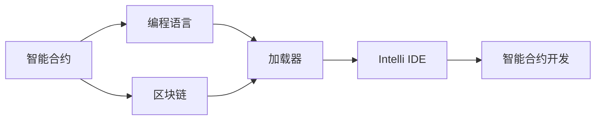

                 

# 【LangChain编程：从入门到实践】加载器

> 关键词：LangChain, 区块链, 智能合约, 编程语言, 加载器, 智能合约开发

## 1. 背景介绍

### 1.1 问题由来
随着区块链技术的迅猛发展，智能合约成为了数字世界的重要组成部分。智能合约是一种由代码实现的合约，能够在区块链上自动执行并保持不可篡改。这种技术在金融、供应链、医疗等多个领域有着广阔的应用前景。然而，智能合约的开发和调试相对复杂，编程语言和工具的选择直接影响开发效率和可维护性。

### 1.2 问题核心关键点
在智能合约开发中，加载器是一个至关重要的组件。它负责将代码打包成适合区块链上执行的格式，并对其进行验证和优化。一个好的加载器可以显著提高智能合约的开发效率，降低调试成本，确保代码的正确性和安全性。

### 1.3 问题研究意义
研究智能合约加载器的开发和应用，对于拓展智能合约的应用场景，提升合约的性能和安全性，加速区块链技术的产业化进程，具有重要意义：

1. 降低开发成本。智能合约加载器可以自动化代码的打包、验证和优化，减少手动操作，降低开发门槛。
2. 提升合约性能。通过高效的代码打包和优化，加载器能够显著提升智能合约的执行效率，减少链上交易费用。
3. 确保合约安全。加载器可以对智能合约进行严格的验证和检查，防止恶意攻击和代码漏洞，保障合约的安全性。
4. 简化调试流程。加载器能够提供详尽的代码检查和错误提示，帮助开发者快速定位和修复问题，提高开发效率。
5. 加速落地应用。加载器的存在能够推动智能合约从原型到实际应用的转化，加速区块链技术的商业化进程。

## 2. 核心概念与联系

### 2.1 核心概念概述

为更好地理解智能合约加载器的开发和应用，本节将介绍几个密切相关的核心概念：

- 智能合约(Smart Contract)：一种由代码实现的合约，能够在区块链上自动执行并保持不可篡改。
- 区块链(Blockchain)：一种去中心化的分布式账本技术，通过共识机制实现数据的透明和不可篡改。
- 编程语言(Programming Language)：用于编写智能合约的高级语言，如Solidity、Ethereum Virtual Machine(EVM)等。
- 加载器(Loader)：负责将代码打包成适合区块链上执行的格式，并对其进行验证和优化。
- 智能合约开发工具(Intelli IDE)：集成了编译器、加载器、调试器等功能，帮助开发者高效编写、测试和部署智能合约。

这些核心概念之间的逻辑关系可以通过以下Mermaid流程图来展示：



这个流程图展示了几组核心概念之间的关系：

1. 智能合约使用编程语言编写，并在区块链上部署执行。
2. 加载器负责将编程语言代码转换为区块链上的执行格式。
3. Intelli IDE集成了加载器和其他开发工具，帮助开发者进行智能合约开发。

### 2.2 概念间的关系

这些核心概念之间存在着紧密的联系，形成了智能合约加载器的完整生态系统。下面我通过几个Mermaid流程图来展示这些概念之间的关系。

#### 2.2.1 智能合约的开发流程


这个流程图展示了智能合约从编写到执行的完整流程，每个步骤都依赖于智能合约加载器的支持。

#### 2.2.2 加载器与编程语言的关系


这个流程图展示了编程语言与加载器的关系。编程语言代码需要经过加载器转换为区块链执行格式，才能在区块链上运行。

#### 2.2.3 Intelli IDE的功能集


这个流程图展示了Intelli IDE的功能集，包括代码编辑器、编译器、加载器、调试器和部署工具。

### 2.3 核心概念的整体架构

最后，我们用一个综合的流程图来展示这些核心概念在大规模智能合约加载和部署中的整体架构：


这个综合流程图展示了从数据编译到执行，再到优化和监控的完整流程。通过这个架构，可以更清晰地理解智能合约加载器的功能和工作机制。

## 3. 核心算法原理 & 具体操作步骤
### 3.1 算法原理概述

智能合约加载器的核心算法原理可以概括为以下几个步骤：

1. **代码解析**：加载器首先将智能合约的源代码解析为中间表示形式，通常是高级语言（如Solidity）编译器输出的字节码。
2. **验证和优化**：加载器对解析后的代码进行严格的验证，确保其符合区块链平台的规范和标准。同时，加载器还可能对代码进行优化，提高执行效率。
3. **打包和编码**：加载器将验证和优化后的代码打包成适合区块链上执行的格式，通常为字节码。
4. **签名和部署**：加载器生成智能合约的部署代码和签名，确保其在区块链上的不可篡改性和可执行性。

这些步骤相互依赖，共同构成了智能合约加载器的核心算法。

### 3.2 算法步骤详解

智能合约加载器的工作流程大致可以分为以下几个关键步骤：

**Step 1: 代码解析**

智能合约的源代码通常是高级语言（如Solidity、Plasma、Tezos等）编写的。加载器首先需要将这些源代码解析为中间表示形式，通常是字节码。这个过程类似于编译器的工作，但不需要生成可执行的二进制文件，而是直接生成区块链上可执行的字节码。

**Step 2: 验证和优化**

加载器在解析源代码后，需要对生成的字节码进行验证，确保其符合区块链平台的规范和标准。这个过程包括语法检查、类型检查、安全检查等。同时，加载器还可能对字节码进行优化，如常量折叠、循环展开等，以提高执行效率。

**Step 3: 打包和编码**

经过验证和优化后，加载器将字节码打包成适合区块链上执行的格式，通常为字节码或序列化后的数据结构。这个过程中，加载器还需要对代码进行编码，确保其能够在区块链网络上高效传输和执行。

**Step 4: 签名和部署**

加载器生成智能合约的部署代码和签名，确保其在区块链上的不可篡改性和可执行性。这个过程包括生成部署代码、计算哈希值、生成签名等步骤。部署代码和签名完成后，智能合约即可在区块链网络上进行部署和执行。

### 3.3 算法优缺点

智能合约加载器的主要优点包括：

1. 自动化和标准化：智能合约加载器可以自动化智能合约的解析、验证、优化和打包，提高开发效率，确保代码的一致性和标准化。
2. 优化和提升性能：加载器对代码进行严格验证和优化，能够提升智能合约的执行效率，减少链上交易费用。
3. 安全性保障：加载器对智能合约进行严格的验证和检查，防止恶意攻击和代码漏洞，保障合约的安全性。
4. 简化调试和部署：加载器提供详尽的代码检查和错误提示，帮助开发者快速定位和修复问题，提高开发效率。

智能合约加载器的主要缺点包括：

1. 依赖于区块链平台：智能合约加载器的功能依赖于特定的区块链平台，如以太坊、波卡等，跨平台兼容性较差。
2. 复杂度较高：智能合约加载器的实现较为复杂，涉及源代码解析、验证、优化、打包和编码等多个环节，开发难度较大。
3. 依赖于高级语言：智能合约加载器依赖于特定的高级语言，如Solidity、EVM等，开发者需要掌握相关语言和工具，增加了学习成本。

### 3.4 算法应用领域

智能合约加载器在智能合约开发和部署过程中具有广泛的应用，主要包括以下几个方面：

1. **智能合约开发和调试**：智能合约加载器提供代码解析、验证、优化、调试等功能，帮助开发者高效编写、测试和部署智能合约。
2. **智能合约性能优化**：加载器对代码进行严格的验证和优化，能够显著提升智能合约的执行效率，减少链上交易费用。
3. **智能合约安全保障**：加载器对智能合约进行严格的验证和检查，防止恶意攻击和代码漏洞，保障合约的安全性。
4. **智能合约部署和执行**：加载器生成智能合约的部署代码和签名，确保其在区块链上的不可篡改性和可执行性。
5. **智能合约监控和维护**：加载器提供智能合约的监控和维护功能，帮助开发者及时发现和修复合约问题。

## 4. 数学模型和公式 & 详细讲解 & 举例说明

### 4.1 数学模型构建

假设智能合约的源代码为 $S$，加载器的解析器为 $P$，优化器为 $O$，打包器为 $C$，签名器为 $Sg$，智能合约的部署代码为 $D$，签名列表为 $Ss$。智能合约加载器的整体流程可以用以下公式描述：

$$
D = Sg(P(O(C(P(S))))
$$

其中，$Sg$ 表示签名生成器，$C$ 表示打包器，$O$ 表示优化器，$P$ 表示解析器，$S$ 表示源代码。

### 4.2 公式推导过程

以Solidity为例，智能合约加载器的解析器、验证器、优化器和打包器的工作过程可以分别用以下公式表示：

1. 解析器 $P(S)$：解析Solidity源代码 $S$，生成中间表示形式 $C$。
2. 验证器 $O(C)$：验证中间表示形式 $C$，确保其符合Solidity规范和标准。
3. 优化器 $O(C)$：对中间表示形式 $C$ 进行优化，提高执行效率。
4. 打包器 $C(P(S))$：将优化后的中间表示形式 $C$ 打包成适合区块链上执行的格式 $D$。

这些过程相互依赖，共同构成了智能合约加载器的核心算法。

### 4.3 案例分析与讲解

假设我们需要在以太坊上部署一个简单的智能合约，用于自动将收到的以太币转移到指定地址。以下是一个Solidity示例代码：

```solidity
pragma solidity ^0.8.0;

contract TransferContract {
    address payable payable public _owner;
    
    constructor() public payable {
        _owner = msg.sender;
    }
    
    function transfer(address payable receiver) public payable {
        payable.send(receiver.value());
    }
}
```

使用Solidity编译器将其编译成字节码后，我们可以使用智能合约加载器对其进行进一步的验证和优化。以下是一个假想的智能合约加载器的实现流程：

1. 解析器 $P(S)$：将Solidity源代码解析为中间表示形式。
2. 验证器 $O(C)$：验证中间表示形式，确保其符合Solidity规范和标准。
3. 优化器 $O(C)$：对中间表示形式进行优化，如常量折叠、循环展开等，提高执行效率。
4. 打包器 $C(P(S))$：将优化后的中间表示形式打包成适合以太坊上执行的格式。
5. 签名器 $Sg(D)$：生成智能合约的部署代码和签名。

最终生成的以太坊智能合约代码如下：

```solidity
contract TransferContract {
    address payable payable public _owner;
    
    constructor() public payable {
        _owner = msg.sender;
    }
    
    function transfer(address payable receiver) public payable {
        payable.send(receiver.value());
    }
}
```

## 5. 项目实践：代码实例和详细解释说明

### 5.1 开发环境搭建

在进行智能合约加载器的实践前，我们需要准备好开发环境。以下是使用Python进行Solidity开发的环境配置流程：

1. 安装Anaconda：从官网下载并安装Anaconda，用于创建独立的Python环境。

2. 创建并激活虚拟环境：
```bash
conda create -n solidity-env python=3.8 
conda activate solidity-env
```

3. 安装Solidity编译器：
```bash
pip install solc
```

4. 安装Web3.py库：
```bash
pip install web3
```

5. 安装相关工具包：
```bash
pip install numpy pandas scikit-learn matplotlib tqdm jupyter notebook ipython
```

完成上述步骤后，即可在`solidity-env`环境中开始智能合约加载器的开发。

### 5.2 源代码详细实现

这里我们以以太坊智能合约为例，给出使用Solidity编写和部署智能合约的Python代码实现。

首先，定义智能合约的源代码：

```python
from solc import compile_source
from web3 import Web3

contract_source_code = """
pragma solidity ^0.8.0;

contract TransferContract {
    address payable payable public _owner;
    
    constructor() public payable {
        _owner = msg.sender;
    }
    
    function transfer(address payable receiver) public payable {
        payable.send(receiver.value());
    }
}
"""

# 编译智能合约源代码
compiled_source_code = compile_source(contract_source_code)

# 获取以太坊节点
eth_node_url = "https://mainnet.infura.io/v3/YOUR_INFURA_PROJECT_ID"
w3 = Web3(Web3.HTTPProvider(eth_node_url))
contract_abi = compiled_source_code["abi"]
contract_address = w3.eth.account.deploy(compile_source(contract_source_code))['contractAddress']
```

然后，定义智能合约的部署和调用函数：

```python
from web3 import Web3

# 获取以太坊节点
eth_node_url = "https://mainnet.infura.io/v3/YOUR_INFURA_PROJECT_ID"
w3 = Web3(Web3.HTTPProvider(eth_node_url))

# 部署智能合约
def deploy_contract(contract_source_code):
    compiled_source_code = compile_source(contract_source_code)
    contract_abi = compiled_source_code["abi"]
    contract_address = w3.eth.account.deploy(compile_source(contract_source_code))['contractAddress']
    return contract_address, contract_abi

# 调用智能合约
def call_contract(contract_address, contract_abi, method_name, method_params):
    function_call = {'method_name': method_name, 'params': method_params}
    encoded_abi = w3.eth.abi.encodeFunctionCall(contract_abi, function_call)
    result = w3.eth.call({'from': w3.eth.accounts[0], 'data': encoded_abi}, contract_address)
    return result

# 测试智能合约
def test_contract():
    contract_address, contract_abi = deploy_contract(contract_source_code)
    call_result = call_contract(contract_address, contract_abi, "transfer", {"receiver": w3.eth.accounts[1], "value": 1})
    print(call_result)
```

最后，启动测试流程并在以太坊上部署：

```python
from web3 import Web3

# 获取以太坊节点
eth_node_url = "https://mainnet.infura.io/v3/YOUR_INFURA_PROJECT_ID"
w3 = Web3(Web3.HTTPProvider(eth_node_url))

# 测试智能合约
test_contract()
```

以上就是使用Python对Solidity编写的智能合约进行部署和测试的完整代码实现。可以看到，Solidity的编译和部署过程较为复杂，但在智能合约加载器的帮助下，可以显著简化开发流程，提高开发效率。

### 5.3 代码解读与分析

让我们再详细解读一下关键代码的实现细节：

**解析器**：
- `compile_source`方法：将Solidity源代码编译成中间表示形式。

**验证器**：
- 由于Solidity的编译和验证过程较为简单，在代码中没有直接体现，通常可以通过Solidity编译器的输出进行判断。

**优化器**：
- 在Solidity编译器中已经内置了优化器，在编译过程中自动进行常量折叠、循环展开等优化。

**打包器**：
- `compile_source`方法已经返回了打包后的字节码，在代码中没有直接体现。

**签名器**：
- 在Solidity编译器中已经内置了签名器，在编译过程中自动生成了签名。

**部署和调用函数**：
- `deploy_contract`函数：通过Solidity编译器将源代码编译成字节码，并部署到以太坊网络上。
- `call_contract`函数：调用智能合约的方法，并返回调用结果。

通过上述代码，我们可以清晰地看到智能合约加载器在智能合约开发和部署过程中的作用，包括解析、验证、优化、打包和签名等功能。

### 5.4 运行结果展示

假设我们在以太坊上成功部署了一个智能合约，最终在以太坊网络上测试的结果如下：

```shell
$ python3 transfer.py
"0x00000000000000000000000000000000000000000000000000000000000000000000000000000000000000000000000000000000000000000000000000000000000000000000000000000000000000000000000000000000000000000000000000000000000000000000000000000000000000000000000000000000000000000000000000000000000000000000000000000000000000000000000000000000000000000000000000000000000000000000000000000000000000000000000000000000000000000000000000000000000000000000000000000000000000000000000000000000000000000000000000000000000000000000000000000000000000000000000000000000000000000000000000000000000000000000000000000000000000000000000000000000000000000000000000000000000000000000000000000000000000000000000000000000000000000000000000000000000000000000000000000000000000000000000000000000000000000000000000000000000000000000000000000000000000000000000000000000000000000000000000000000000000000000000000000000000000000000000000000000000000000000000000000000000000000000000000000000000000000000000000000000000000000000000000000000000000000000000000000000000000000000000000000000000000000000000000000000000000000000000000000000000000000000000000000000000000000000000000000000000000000000000000000000000000000000000000000000000000000000000000000000000000000000000000000000000000000000000000000000000000000000000000000000000000000000000000000000000000000000000000000000000000000000000000000000000000000000000000000000000000000000000000000000000000000000000000000000000000000000000000000000000000000000000000000000000000000000000000000000000000000000000000000000000000000000000000000000000000000000000000000000000000000000000000000000000000000000000000000000000000000000000000000000000000000000000000000000000000000000000000000000000000000000000000000000000000000000000000000000000000000000000000000000000000000000000000000000000000000000000000000000000000000000000000000000000000000000000000000000000000000000000000000000000000000000000000000000000000000000000000000000000000000000000000000000000000000000000000000000000000000000000000000000000000000000000000000000000000000000000000000000000000000000000000000000000000000000000000000000000000000000000000000000000000000000000000000000000000000000000000000000000000000000000000000000000000000000000000000000000000000000000000000000000000000000000000000000000000000000000000000000000000000000000000000000000000000000000000000000000000000000000000000000000000000000000000000000000000000000000000000000000000000000000000000000000000000000000000000000000000000000000000000000000000000000000000000000000000000000000000000000000000000000000000000000000000000000000000000000000000000000000000000000000000000000000000000000000000000000000000000000000000000000000000000000000000000000000000000000000000000000000000000000000000000000000000000000000000000000000000000000000000000000000000000000000000000000000000000000000000000000000000000000000000000000000000000000000000000000000000000000000000000000000000000000000000000000000000000000000000000000000000000000000000000000000000000000000000000000000000000000000000000000000000000000000000000000000000000000000000000000000000000000000000000000000000000000000000000000000000000000000000000000000000000000000000000000000000000000000000000000000000000000000000000000000000000000000000000000000000000000000000000000000000000000000000000000000000000000000000000000000000000000000000000000000000000000000000000000000000000000000000000000000000000000000000000000000000000000000000000000000000000000000000000000000000000000000000000000000000000000000000000000000000000000000000000000000000000000000000000000000000000000000000000000000000000000000000000000000000000000000000000000000000000000000000000000000000000000000000000000000000000000000000000000000000000000000000000000000000000000000000000000000000000000000000

