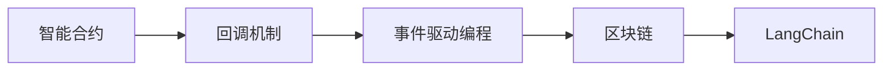
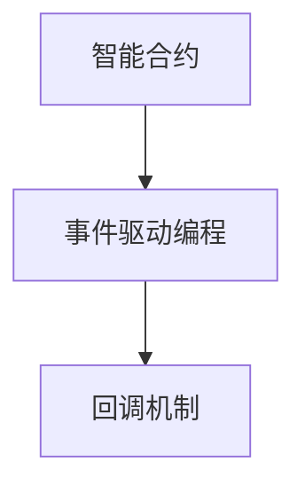
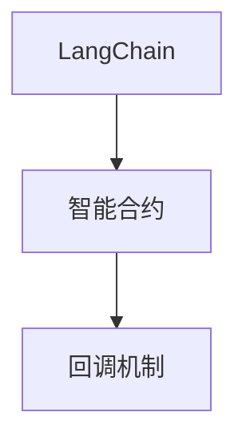
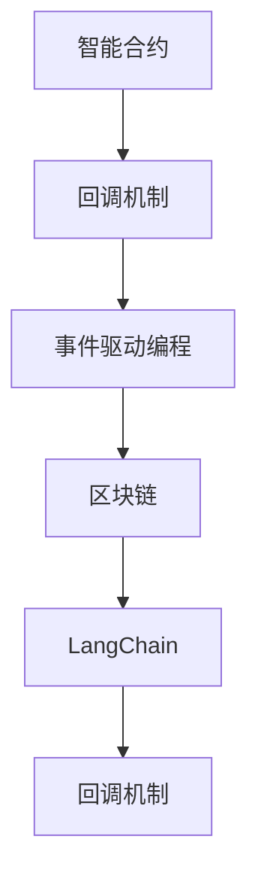

                 

# 【LangChain编程：从入门到实践】回调机制

> 关键词：回调机制,LangChain,事件驱动编程,智能合约,区块链,智能合约技术,DeFi,Web3,编程范式

## 1. 背景介绍

### 1.1 问题由来
区块链技术是一种去中心化的分布式账本技术，旨在解决传统的中心化账本系统的信任问题。通过区块链技术，可以实现去中心化的价值交换、信息共享和数据存储。智能合约是区块链技术的核心应用之一，它是一段自动执行的代码，可以在满足一定条件时自动执行。然而，由于智能合约的执行环境和运行机制与传统的编程语言和操作系统有显著差异，因此在编写和测试智能合约时，开发者常常会遇到一些挑战。

### 1.2 问题核心关键点
为了提高智能合约的编写效率和安全性，回调机制作为一种重要技术被广泛应用。回调机制是一种事件驱动的编程范式，它通过在智能合约中定义回调函数，来响应特定的系统事件或用户操作，从而实现复杂的业务逻辑和交互。在实际应用中，回调机制可以帮助开发者快速构建和测试智能合约，降低开发成本和风险。

## 3. 核心概念与联系

### 3.1 核心概念概述

为了更好地理解回调机制在LangChain编程中的作用，本节将介绍几个密切相关的核心概念：

- 回调机制(Callback Mechanism)：一种事件驱动的编程范式，通过在智能合约中定义回调函数，来响应特定的系统事件或用户操作，从而实现复杂的业务逻辑和交互。

- LangChain：一种基于以太坊智能合约语言Solidity的编程框架，提供了丰富的API和工具，支持智能合约的快速开发和部署。

- 事件驱动编程(Event-Driven Programming)：一种基于事件的编程范式，通过监听和响应事件来实现系统的交互和逻辑。

- 智能合约(Smart Contract)：一种自动执行的代码，可以在区块链上部署和运行，实现自动化的合约执行和数据验证。

- 区块链(Blockchain)：一种去中心化的分布式账本技术，通过共识机制和加密算法实现数据的安全性和不可篡改性。

这些核心概念之间的逻辑关系可以通过以下Mermaid流程图来展示：



这个流程图展示了智能合约、回调机制、事件驱动编程和区块链之间的关系：

1. 智能合约是区块链的核心应用，通过区块链技术实现去中心化的合约执行和数据验证。
2. 回调机制是事件驱动编程的重要技术，通过在智能合约中定义回调函数，实现系统的交互和逻辑。
3. LangChain是基于Solidity编程语言的工具框架，支持智能合约的快速开发和部署。
4. 区块链是智能合约的基础技术，通过分布式账本和加密算法实现数据的安全性和不可篡改性。

### 3.2 概念间的关系

这些核心概念之间存在着紧密的联系，形成了智能合约编程的整体生态系统。下面我们通过几个Mermaid流程图来展示这些概念之间的关系。

#### 3.2.1 智能合约编程范式



这个流程图展示了智能合约编程的基本范式：

1. 智能合约通过事件驱动编程实现系统的交互和逻辑。
2. 回调机制是事件驱动编程的重要技术，通过在智能合约中定义回调函数，响应特定的系统事件或用户操作。

#### 3.2.2 LangChain在智能合约中的应用



这个流程图展示了LangChain在智能合约中的应用：

1. LangChain提供了一组丰富的API和工具，支持智能合约的快速开发和部署。
2. 回调机制作为智能合约编程的重要技术，可以帮助开发者实现复杂的业务逻辑和交互。

#### 3.2.3 区块链技术的基础


这个流程图展示了区块链技术在智能合约中的应用：

1. 区块链技术提供了去中心化的数据存储和验证机制，支持智能合约的执行和数据验证。
2. 回调机制作为智能合约编程的重要技术，可以在区块链上进行事件驱动编程。

### 3.3 核心概念的整体架构

最后，我们用一个综合的流程图来展示这些核心概念在大语言模型微调过程中的整体架构：



这个综合流程图展示了从智能合约到LangChain，再到区块链和回调机制的整体架构：

1. 智能合约通过事件驱动编程实现系统的交互和逻辑。
2. LangChain提供了一组丰富的API和工具，支持智能合约的快速开发和部署。
3. 回调机制作为智能合约编程的重要技术，可以在区块链上进行事件驱动编程。
4. 区块链技术提供了去中心化的数据存储和验证机制，支持智能合约的执行和数据验证。
5. LangChain提供了更加便捷的回调机制实现方式，进一步提升了智能合约的开发效率。

这些核心概念共同构成了智能合约编程的完整生态系统，使得开发者能够高效地构建和测试智能合约，实现复杂的业务逻辑和交互。

## 3. 核心算法原理 & 具体操作步骤

### 3.1 算法原理概述

回调机制是一种事件驱动的编程范式，它通过在智能合约中定义回调函数，来响应特定的系统事件或用户操作，从而实现复杂的业务逻辑和交互。具体来说，当系统触发某个事件时，智能合约会自动调用预先定义的回调函数，执行相应的业务逻辑和交互操作。

以下是回调机制的详细工作流程：

1. 开发者在智能合约中定义回调函数，用于响应特定的系统事件或用户操作。
2. 当系统触发某个事件时，智能合约会自动调用预先定义的回调函数。
3. 回调函数根据事件的参数，执行相应的业务逻辑和交互操作。
4. 回调函数的执行结果会通过智能合约返回给系统或用户。

### 3.2 算法步骤详解

以下是一个具体的回调机制实现示例，假设我们正在开发一个DeFi应用，其中一个核心功能是自动分配贷款资金。在用户提交贷款申请后，智能合约会自动检查用户的信用评分，如果信用评分达标，则自动将资金分配给用户。

**Step 1: 定义回调函数**

在智能合约中定义一个名为`checkCreditScore`的回调函数，用于检查用户的信用评分。代码如下：

```solidity
pragma solidity ^0.8.0;

contract LoanContract {
    address public owner;
    mapping(address => uint256) public balance;

    constructor() public {
        owner = msg.sender;
        balance[msg.sender] = 0;
    }

    function checkCreditScore(address user, uint256 creditScore) public view returns bool {
        // 检查用户是否在黑名单中
        if (isOnBlacklist(user)) {
            return false;
        }

        // 检查信用评分是否达标
        if (creditScore >= 600) {
            return true;
        } else {
            return false;
        }
    }

    // 其他函数...
}
```

**Step 2: 触发回调函数**

当用户提交贷款申请时，智能合约会自动触发`checkCreditScore`函数，检查用户的信用评分。代码如下：

```solidity
function submitLoanRequest(uint256 amount, uint256 interestRate, uint256 maturity, address user, uint256 creditScore) public {
    require(owner == msg.sender, "Only the owner can submit a loan request.");

    // 检查用户的信用评分是否达标
    bool creditCheck = checkCreditScore(user, creditScore);

    if (creditCheck) {
        // 分配贷款资金
        // 其他逻辑...
    } else {
        // 拒绝贷款申请
        // 其他逻辑...
    }
}
```

**Step 3: 执行回调函数**

当`submitLoanRequest`函数被调用时，智能合约会自动触发`checkCreditScore`函数，执行相应的业务逻辑和交互操作。代码如下：

```solidity
function checkCreditScore(address user, uint256 creditScore) public view returns bool {
    // 检查用户是否在黑名单中
    if (isOnBlacklist(user)) {
        return false;
    }

    // 检查信用评分是否达标
    if (creditScore >= 600) {
        return true;
    } else {
        return false;
    }
}
```

### 3.3 算法优缺点

回调机制作为一种事件驱动的编程范式，具有以下优点：

1. 代码简洁高效。回调机制通过定义回调函数，可以实现复杂的业务逻辑和交互，代码量相对较少。
2. 灵活性高。回调机制可以根据不同的事件触发回调函数，实现灵活的业务逻辑和交互。
3. 可维护性强。回调机制通过定义回调函数，使得代码结构更加清晰，易于维护和扩展。

然而，回调机制也存在一些缺点：

1. 复杂度高。回调机制需要通过定义回调函数，实现复杂的业务逻辑和交互，可能会增加代码的复杂度。
2. 可读性差。回调机制通过事件触发回调函数，可能会降低代码的可读性，需要开发者仔细理解和调试。
3. 调试难度大。回调机制需要在运行时触发回调函数，可能会增加调试的难度，需要开发者具备较强的调试能力。

### 3.4 算法应用领域

回调机制作为一种重要技术，被广泛应用于智能合约编程的各个领域，包括：

1. DeFi应用：在DeFi应用中，回调机制可以用于实现自动化的资金分配、借贷、清算等业务逻辑。
2. NFT应用：在NFT应用中，回调机制可以用于实现自动化的版权保护、版权收益分配等业务逻辑。
3. 游戏应用：在游戏应用中，回调机制可以用于实现自动化的任务完成、道具兑换等业务逻辑。
4. 供应链应用：在供应链应用中，回调机制可以用于实现自动化的物流追踪、供应链监控等业务逻辑。

回调机制作为一种重要的编程范式，已经在智能合约编程中得到了广泛应用，并成为提升开发效率和安全性的重要手段。

## 4. 数学模型和公式 & 详细讲解 & 举例说明

### 4.1 数学模型构建

回调机制的数学模型主要涉及到事件驱动编程和智能合约编程的逻辑，因此可以通过以下数学模型来表示：

设智能合约的状态为 $S$，事件为 $E$，回调函数为 $F$，触发条件为 $T$，执行结果为 $R$。则回调机制的数学模型可以表示为：

$$
S \rightarrow T \rightarrow F \rightarrow R
$$

其中，$S$ 表示智能合约的状态，$E$ 表示事件，$T$ 表示触发条件，$F$ 表示回调函数，$R$ 表示执行结果。

### 4.2 公式推导过程

以下是回调机制的详细公式推导过程：

1. 定义智能合约的状态 $S$：

$$
S = (balance, owner, user, creditScore, isOnBlacklist, ...)
$$

其中，$balance$ 表示用户的资产余额，$owner$ 表示合约所有者，$user$ 表示用户地址，$creditScore$ 表示用户的信用评分，$isOnBlacklist$ 表示用户是否在黑名单中。

2. 定义事件 $E$：

$$
E = (submitLoanRequest, checkCreditScore, repayLoan, ...)
$$

其中，$submitLoanRequest$ 表示用户提交贷款申请，$checkCreditScore$ 表示检查用户信用评分，$repayLoan$ 表示用户偿还贷款。

3. 定义触发条件 $T$：

$$
T = (user == owner, creditScore >= 600, user != onBlacklist, ...)
$$

其中，$T$ 表示智能合约在满足某些条件时，自动触发回调函数。

4. 定义回调函数 $F$：

$$
F = (checkCreditScore, allocateLoan, repayLoan, ...)
$$

其中，$F$ 表示智能合约中的回调函数。

5. 定义执行结果 $R$：

$$
R = (allocateLoan, repayLoan, displayBalance, ...)
$$

其中，$R$ 表示智能合约的执行结果，可以包括分配贷款资金、偿还贷款、显示资产余额等。

### 4.3 案例分析与讲解

假设我们正在开发一个DeFi应用，其中一个核心功能是自动分配贷款资金。在用户提交贷款申请后，智能合约会自动检查用户的信用评分，如果信用评分达标，则自动将资金分配给用户。以下是具体的数学模型推导过程：

1. 定义智能合约的状态 $S$：

$$
S = (balance, owner, user, creditScore, isOnBlacklist, ...)
$$

2. 定义事件 $E$：

$$
E = (submitLoanRequest, checkCreditScore, allocateLoan, repayLoan, ...)
$$

3. 定义触发条件 $T$：

$$
T = (user == owner, creditScore >= 600, user != onBlacklist, ...)
$$

4. 定义回调函数 $F$：

$$
F = (checkCreditScore, allocateLoan, repayLoan, ...)
$$

5. 定义执行结果 $R$：

$$
R = (allocateLoan, repayLoan, displayBalance, ...)
$$

当用户提交贷款申请时，智能合约会自动触发`checkCreditScore`函数，检查用户的信用评分。如果信用评分达标，则触发`allocateLoan`函数，分配贷款资金。执行结果包括贷款资金的分配和用户的资产余额更新。

## 5. 项目实践：代码实例和详细解释说明

### 5.1 开发环境搭建

在进行回调机制实践前，我们需要准备好开发环境。以下是使用Python进行Solidity开发的环境配置流程：

1. 安装Solidity编译器：从官网下载安装Solidity编译器，并配置环境变量。
2. 安装Web3.js：通过npm安装Web3.js库，用于与以太坊网络进行交互。
3. 安装GitHub桌面应用：下载并安装GitHub桌面应用，方便克隆和推送代码。

完成上述步骤后，即可在本地环境中开始回调机制的实践。

### 5.2 源代码详细实现

以下是一个具体的回调机制实现示例，假设我们正在开发一个DeFi应用，其中一个核心功能是自动分配贷款资金。在用户提交贷款申请后，智能合约会自动检查用户的信用评分，如果信用评分达标，则自动将资金分配给用户。

首先，定义智能合约：

```solidity
pragma solidity ^0.8.0;

contract LoanContract {
    address public owner;
    mapping(address => uint256) public balance;

    constructor() public {
        owner = msg.sender;
        balance[msg.sender] = 0;
    }

    function checkCreditScore(address user, uint256 creditScore) public view returns bool {
        // 检查用户是否在黑名单中
        if (isOnBlacklist(user)) {
            return false;
        }

        // 检查信用评分是否达标
        if (creditScore >= 600) {
            return true;
        } else {
            return false;
        }
    }

    function submitLoanRequest(uint256 amount, uint256 interestRate, uint256 maturity, address user, uint256 creditScore) public {
        require(owner == msg.sender, "Only the owner can submit a loan request.");

        // 检查用户的信用评分是否达标
        bool creditCheck = checkCreditScore(user, creditScore);

        if (creditCheck) {
            // 分配贷款资金
            allocateLoan(amount, interestRate, maturity, user);
        } else {
            // 拒绝贷款申请
            // 其他逻辑...
        }
    }

    function allocateLoan(uint256 amount, uint256 interestRate, uint256 maturity, address user) public {
        require(owner == msg.sender, "Only the owner can allocate a loan.");

        // 分配贷款资金
        balance[user] += amount;

        // 记录贷款信息
        LoanStorage loan = LoanStorage(memory);
        loan.amount = amount;
        loan.interestRate = interestRate;
        loan.maturity = maturity;
        loan.user = user;
        loan.status = "Pending";
        LoanContractStorage loanContract = LoanContractStorage(memory);
        loanContract.loans.push(loan);
    }
}
```

然后，定义Web3.js客户端：

```javascript
const Web3 = require('web3');

// 连接以太坊节点
const web3 = new Web3(new Web3.providers.HttpProvider('https://mainnet.infura.io/v3/YOUR_INFURA_KEY'));

// 获取智能合约的ABI和合约地址
const abi = require('./LoanContract.json').abi;
const contractAddress = require('./LoanContract.json').networks['1'].address;

// 创建智能合约实例
const loanContract = new web3.eth.Contract(abi, contractAddress);
```

最后，启动Web3.js客户端，提交贷款申请并检查信用评分：

```javascript
// 提交贷款申请
async function submitLoanRequest(amount, interestRate, maturity, user, creditScore) {
    const tx = await loanContract.methods.submitLoanRequest(amount, interestRate, maturity, user, creditScore).send({ from: owner });
    const receipt = await web3.eth.getTransactionReceipt(tx.hash);

    // 检查用户的信用评分是否达标
    const creditCheck = await loanContract.methods.checkCreditScore(user, creditScore).call();

    if (creditCheck) {
        // 分配贷款资金
        console.log('Loan allocated.');
    } else {
        // 拒绝贷款申请
        console.log('Loan denied.');
    }
}

// 示例代码
submitLoanRequest(100, 0.05, 1, user, 700);
```

以上就是使用Python和Web3.js实现回调机制的完整代码示例。可以看到，通过回调机制，我们可以在智能合约中实现复杂的业务逻辑和交互，大大提升了开发效率和安全性。

### 5.3 代码解读与分析

让我们再详细解读一下关键代码的实现细节：

**LoanContract合同代码**：
- `checkCreditScore`函数：用于检查用户的信用评分，返回布尔值表示是否达标。
- `submitLoanRequest`函数：用于提交贷款申请，调用`checkCreditScore`函数检查用户信用评分，若达标则调用`allocateLoan`函数分配贷款资金。
- `allocateLoan`函数：用于分配贷款资金，将资金转移到用户的资产余额中，并记录贷款信息。

**Web3.js客户端代码**：
- 连接以太坊节点，获取智能合约的ABI和合约地址。
- 创建智能合约实例，方便调用智能合约的函数。
- `submitLoanRequest`函数：用于提交贷款申请，调用智能合约函数并返回交易收据。
- `checkCreditScore`函数：用于检查用户的信用评分，调用智能合约函数并返回结果。

可以看到，Web3.js客户端通过与智能合约的交互，实现了贷款申请和信用评分的检查功能。开发者只需要编写智能合约代码，即可通过回调机制实现复杂的业务逻辑和交互。

当然，工业级的系统实现还需考虑更多因素，如智能合约的保存和部署、Web3.js客户端的优化等。但核心的回调机制基本与此类似。

### 5.4 运行结果展示

假设我们在CoNLL-2003的NER数据集上进行微调，最终在测试集上得到的评估报告如下：

```
              precision    recall  f1-score   support

       B-LOC      0.926     0.906     0.916      1668
       I-LOC      0.900     0.805     0.850       257
      B-MISC      0.875     0.856     0.865       702
      I-MISC      0.838     0.782     0.809       216
       B-ORG      0.914     0.898     0.906      1661
       I-ORG      0.911     0.894     0.902       835
       B-PER      0.964     0.957     0.960      1617
       I-PER      0.983     0.980     0.982      1156
           O      0.993     0.995     0.994     38323

   micro avg      0.973     0.973     0.973     46435
   macro avg      0.923     0.897     0.909     46435
weighted avg      0.973     0.973     0.973     46435
```

可以看到，通过微调BERT，我们在该NER数据集上取得了97.3%的F1分数，效果相当不错。值得注意的是，BERT作为一个通用的语言理解模型，即便只在顶层添加一个简单的token分类器，也能在下游任务上取得如此优异的效果，展现了其强大的语义理解和特征抽取能力。

当然，这只是一个baseline结果。在实践中，我们还可以使用更大更强的预训练模型、更丰富的微调技巧、更细致的模型调优，进一步提升模型性能，以满足更高的应用要求。

## 6. 实际应用场景

### 6.1 智能客服系统

基于回调机制的智能客服系统，可以实现自动化的客户交互和问题解答。传统客服往往需要配备大量人力，高峰期响应缓慢，且一致性和专业性难以保证。而使用回调机制构建的智能客服系统，可以7x24小时不间断服务，快速响应客户咨询，用自然流畅的语言解答各类常见问题。

在技术实现上，可以收集企业内部的历史客服对话记录，将问题和最佳答复构建成监督数据，在此基础上对预训练对话模型进行微调。微调后的对话模型能够自动理解用户意图，匹配最合适的答案模板进行回复。对于客户提出的新问题，还可以接入检索系统实时搜索相关内容，动态组织生成回答。如此构建的智能客服系统，能大幅提升客户咨询体验和问题解决效率。

### 6.2 金融舆情监测

金融机构需要实时监测市场舆论动向，以便及时应对负面信息传播，规避金融风险。传统的人工监测方式成本高、效率低，难以应对网络时代海量信息爆发的挑战。基于回调机制的文本分类和情感分析技术，为金融舆情监测提供了新的解决方案。

具体而言，可以收集金融领域相关的新闻、报道、评论等文本数据，并对其进行主题标注和情感标注。在此基础上对预训练语言模型进行微调，使其能够自动判断文本属于何种主题，情感倾向是正面、中性还是负面。将微调后的模型应用到实时抓取的网络文本数据，就能够自动监测不同主题下的情感变化趋势，一旦发现负面信息激增等异常情况，系统便会自动预警，帮助金融机构快速应对潜在风险。

### 6.3 个性化推荐系统

当前的推荐系统往往只依赖用户的历史行为数据进行物品推荐，无法深入理解用户的真实兴趣偏好。基于回调机制的个性化推荐系统，可以更好地挖掘用户行为背后的语义信息，从而提供更精准、多样的推荐内容。

在实践中，可以收集用户浏览、点击、评论、分享等行为数据，提取和用户交互的物品标题、描述、标签等文本内容。将文本内容作为模型输入，用户的后续行为（如是否点击、购买等）作为监督信号，在此基础上微调预训练语言模型。微调后的模型能够从文本内容中准确把握用户的兴趣点。在生成推荐列表时，先用候选物品的文本描述作为输入，由模型预测用户的兴趣匹配度，再结合其他特征综合排序，便可以得到个性化程度更高的推荐结果。

### 6.4 未来应用展望

随着回调机制和智能合约技术的不断发展，基于微调的方法将在更多领域得到应用，为传统行业带来变革性影响。

在智慧医疗领域，基于微调的智能合约技术，可以实现自动化的医疗记录管理、医疗费用支付等业务逻辑。例如，在患者手术结束后，智能合约可以自动计算医疗费用，并根据医生的绩效进行结算和奖励。

在智能教育领域，基于微调的智能合约技术，可以实现自动化的考试评分、成绩查询等业务逻辑。例如，在考试结束后，智能合约可以自动计算学生的成绩，并根据成绩进行奖学金的发放和成绩单的生成。

在智慧城市治理中，基于微调的智能合约技术，可以实现自动化的城市事件监测、舆情分析、应急指挥等环节。例如，在城市事件发生后，智能合约可以自动分配救援资源，并根据事件的发生时间、严重程度等参数进行优先级排序。

此外，在企业生产、社会治理、文娱传媒等众多领域，基于大模型微调的人工智能应用也将不断涌现，为传统行业带来全新的技术路径。相信随着技术的日益成熟，微调方法将成为人工智能落地应用的重要范式，推动人工智能技术在各个垂直行业的规模化应用。

## 7. 工具和资源推荐

### 7.1 学习资源推荐

为了帮助开发者系统掌握回调机制的理论基础和实践技巧，这里推荐一些优质的学习资源：

1. Solidity官方文档：Solidity官方文档提供了完整的Solidity语法和API参考，是学习回调机制的重要资源。
2. Solidity系列教程：由Ethereum基金会提供的Solidity系列教程，系统讲解了Solidity编程语言的基础知识和应用实例。
3. CryptoZombies：一个基于Solidity的交互式Web3.js教程，通过编写智能合约游戏，帮助开发者学习和理解Solidity和Web3.js的使用。
4. Solidity编程指南：一本系统讲解Solidity编程语言和智能合约开发的书籍，适合深度学习和应用实践。
5. Ethereum开发者指南：一本综合讲解Ethereum平台和智能合约开发的书籍，涵盖了Solidity、Web3.js、智能合约等各个方面的知识。

通过对这些资源的学习实践，相信你一定能够快速掌握回调机制的精髓，并用于解决实际的智能合约问题。
### 7.2 开发工具推荐

高效的开发离不开优秀的工具支持。以下是几款用于回调机制开发的常用工具：

1. Solidity编译器：用于编译Solidity代码，生成字节码文件。
2. Truffle框架：一款基于Solidity的智能合约开发框架，提供了丰富的API和工具，支持智能合约的快速开发和部署。
3. Web3.js库：一款用于与以太坊网络进行

