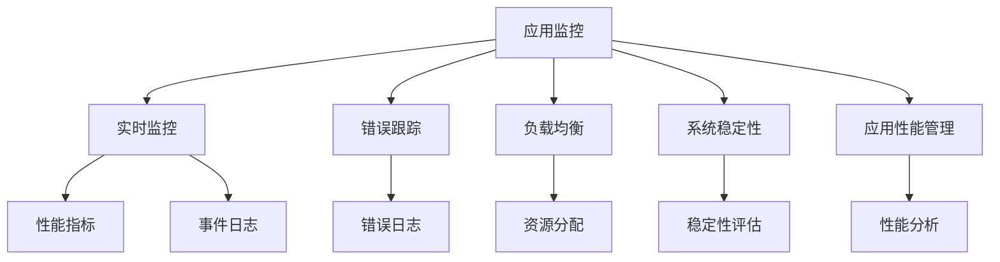
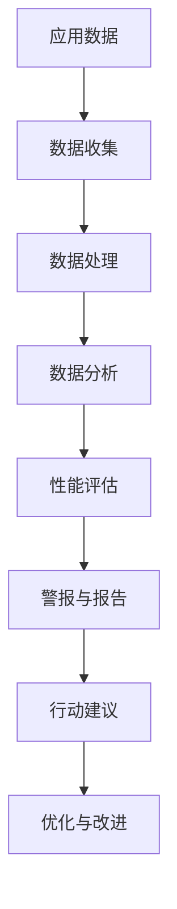

                 

# 【LangChain编程：从入门到实践】应用监控

> 关键词：LangChain, 应用监控, 分布式系统, 负载均衡, 错误跟踪, 系统稳定性, 应用性能管理

## 1. 背景介绍

### 1.1 问题由来
随着Web应用的日益复杂化和分布式架构的普及，应用监控已成为保障系统稳定性和性能的关键手段。LangChain作为一种新兴的应用监控工具，能够帮助开发者实时掌握应用的状态和性能，及时发现和解决问题，提升应用的整体质量和用户体验。

### 1.2 问题核心关键点
LangChain的核心功能包括：
- 实时监控：对应用的不同组件进行实时性能监测，获取指标和事件。
- 错误跟踪：记录应用的错误日志，进行快速定位和修复。
- 负载均衡：通过数据收集，分析应用负载，自动调整资源分配。
- 系统稳定性：提供稳定性和可靠性的实时评估，保证业务连续性。
- 应用性能管理：进行应用性能的分析和优化，提升系统响应速度和吞吐量。

这些功能大大降低了运维成本，提高了系统稳定性和用户体验。

### 1.3 问题研究意义
LangChain在应用监控方面的研究和应用，对于提升系统的稳定性和用户体验具有重要意义：

1. **降低运维成本**：实时监控和错误跟踪使得故障定位和修复变得迅速，减少了运维人员的工作量。
2. **提升系统稳定性**：通过负载均衡和系统稳定性评估，确保应用在各种负载和异常情况下的正常运行。
3. **优化应用性能**：应用性能管理功能帮助识别性能瓶颈，优化系统架构，提升系统响应速度和吞吐量。
4. **增强用户体验**：通过监控和优化，确保应用在高峰期的稳定运行，提升用户满意度。

## 2. 核心概念与联系

### 2.1 核心概念概述

为了更好地理解LangChain的应用监控功能，本节将介绍几个关键的概念：

- **应用监控(Application Monitoring)**：通过实时收集和分析应用的数据，监控应用的状态和性能，及时发现和解决问题。
- **实时监控(Real-time Monitoring)**：实时获取应用的性能指标和事件日志，及时发现和处理异常。
- **错误跟踪(Error Tracking)**：记录和分析应用的错误日志，进行故障定位和修复。
- **负载均衡(Load Balancing)**：通过数据收集和分析，自动调整资源分配，确保应用在各种负载下的稳定运行。
- **系统稳定性(System Stability)**：评估应用的稳定性，提供实时警报和报告。
- **应用性能管理(Application Performance Management, APM)**：分析应用性能，识别性能瓶颈，优化系统架构。

这些概念之间相互关联，共同构成了应用监控的完整生态系统。

### 2.2 概念间的关系

这些核心概念之间的逻辑关系可以通过以下Mermaid流程图来展示：



这个流程图展示了大语言模型微调过程中各个核心概念的关系和作用：

1. 应用监控是整个监控系统的入口，涉及实时监控、错误跟踪、负载均衡、系统稳定性和应用性能管理等多个方面。
2. 实时监控负责获取性能指标和事件日志，是监控的基础。
3. 错误跟踪记录错误日志，帮助快速定位和修复问题。
4. 负载均衡通过数据分析，自动调整资源分配，提升系统稳定性。
5. 系统稳定性评估提供实时的稳定性和可靠性报告，确保业务的连续性。
6. 应用性能管理分析性能瓶颈，优化系统架构，提升系统性能。

这些概念共同构成了应用监控的核心框架，使得开发者能够全面掌握应用的状态和性能。

### 2.3 核心概念的整体架构

最后，我们用一个综合的流程图来展示这些核心概念在大语言模型微调过程中的整体架构：



这个综合流程图展示了从数据收集、处理、分析到性能评估、警报与报告、行动建议、优化与改进的完整流程。通过这一流程，开发者可以系统性地提升应用监控的效果，确保系统的稳定和高效运行。

## 3. 核心算法原理 & 具体操作步骤
### 3.1 算法原理概述

LangChain的应用监控算法主要基于以下原理：

- **数据收集**：从应用的不同组件收集性能指标和事件日志，包括CPU使用率、内存使用率、网络流量、错误日志等。
- **数据处理**：对收集的数据进行处理和清洗，去除噪音，保留有用的信息。
- **数据分析**：通过统计分析和机器学习算法，分析数据的趋势和模式，识别异常情况。
- **性能评估**：根据分析结果，评估应用的性能和稳定性，提供实时的警报和报告。
- **行动建议**：基于性能评估结果，给出优化和改进的建议，帮助开发者进行系统调优。

这些步骤相互配合，构成了一个完整的应用监控系统。

### 3.2 算法步骤详解

下面详细介绍LangChain应用监控的详细步骤：

**Step 1: 数据收集**
- 在应用的不同组件上安装数据收集代理，收集性能指标和事件日志。
- 使用数据收集工具，如Prometheus、Grafana等，定期从代理获取数据。

**Step 2: 数据处理**
- 对收集的数据进行清洗和预处理，去除噪音和不必要的信息。
- 使用数据存储和查询系统，如Elasticsearch、InfluxDB等，存储和查询清洗后的数据。

**Step 3: 数据分析**
- 使用统计分析和机器学习算法，分析数据的趋势和模式。
- 识别异常情况，如CPU使用率过高、内存泄漏、网络延迟等。
- 使用时序数据库和可视化工具，展示数据的变化趋势。

**Step 4: 性能评估**
- 根据数据分析结果，评估应用的性能和稳定性。
- 使用警报系统，如PagerDuty、Slack等，实时通知开发者。
- 提供实时的性能报告和警报，帮助开发者快速定位和解决问题。

**Step 5: 行动建议**
- 根据性能评估结果，提出优化和改进的建议。
- 帮助开发者调整系统配置、优化代码、增加资源等，提升系统性能。

这些步骤确保了应用监控的全面性和实时性，帮助开发者及时发现和解决问题，提升系统性能。

### 3.3 算法优缺点

LangChain的应用监控算法具有以下优点：
1. **实时性**：实时收集和处理数据，快速发现和解决问题。
2. **全面性**：涵盖应用的不同组件，确保监控的全面性。
3. **自动化**：自动进行数据收集、分析和警报，减轻运维人员的工作量。

但同时也存在一些缺点：
1. **数据噪音**：数据收集过程中可能存在噪音，需要进行预处理。
2. **算法复杂性**：数据分析和性能评估算法复杂，需要专业知识。
3. **成本高**：需要投入较多的硬件资源和专业人才进行监控。

尽管如此，LangChain仍然是目前最先进的应用监控工具之一，广泛应用于各个行业和领域。

### 3.4 算法应用领域

LangChain的应用监控算法在多个领域得到了广泛应用，包括但不限于：

- **金融服务**：实时监控交易系统、支付系统等，保障业务连续性和稳定性。
- **电商零售**：监控网站性能、用户行为等，提升用户体验和销售转化率。
- **云计算**：监控云服务性能，确保服务的可靠性和高效性。
- **医疗健康**：监控医疗设备性能，确保病人数据的完整性和安全性。
- **智能制造**：监控生产线设备，提升生产效率和质量。

这些应用场景展示了LangChain在各行业的广泛应用和价值。

## 4. 数学模型和公式 & 详细讲解  
### 4.1 数学模型构建

下面我们将使用数学语言对LangChain的应用监控算法进行更加严格的刻画。

假设应用有$n$个组件，每个组件的性能指标和事件日志都可以表示为：
- 性能指标：$\mathbf{X} = (x_1, x_2, ..., x_n)$
- 事件日志：$\mathbf{Y} = (y_1, y_2, ..., y_n)$

定义监控系统的目标为最小化监控误差$E$，即：

$$
E = \min_{\theta} \sum_{i=1}^n \left( \mathbf{X}_i - \mathbf{\hat{X}}_i(\theta) \right)^2 + \left( \mathbf{Y}_i - \mathbf{\hat{Y}}_i(\theta) \right)^2
$$

其中$\theta$为模型参数，$\mathbf{\hat{X}}_i(\theta)$和$\mathbf{\hat{Y}}_i(\theta)$分别为第$i$个组件的性能指标和事件日志的预测值。

### 4.2 公式推导过程

以下我们以监控系统为例，推导性能评估的数学模型。

假设监控系统能够实时获取每个组件的性能指标$x_i$和事件日志$y_i$，将其作为训练样本，使用机器学习算法进行预测，得到预测值$\mathbf{\hat{X}}_i(\theta)$和$\mathbf{\hat{Y}}_i(\theta)$。性能评估的目标是衡量预测值与实际值的差距，可以表示为：

$$
E = \frac{1}{N} \sum_{i=1}^N \left( x_i - \mathbf{\hat{X}}_i(\theta) \right)^2 + \left( y_i - \mathbf{\hat{Y}}_i(\theta) \right)^2
$$

其中$N$为样本数量。

为了优化性能评估模型，可以使用梯度下降算法对损失函数$E$进行优化：

$$
\theta \leftarrow \theta - \eta \nabla_{\theta} E
$$

其中$\eta$为学习率。

在实际应用中，可以通过历史数据进行模型训练，得到最优参数$\theta$。然后，实时收集新的数据，进行性能评估和预测，及时发现和解决问题。

### 4.3 案例分析与讲解

假设我们在一个电商平台监控其网站性能，具体步骤如下：

1. 在电商网站的前端和后端部署监控代理，实时收集性能指标和事件日志。
2. 使用Prometheus定时收集数据，并将数据存储到Elasticsearch中。
3. 使用机器学习算法（如时间序列分析、回归模型等）对性能指标和事件日志进行分析，识别异常情况。
4. 根据分析结果，实时评估系统的性能和稳定性，并提供警报和报告。
5. 根据性能评估结果，提出优化和改进的建议，帮助开发者进行系统调优。

通过这个案例，我们可以看到LangChain应用监控的完整流程和实际应用效果。

## 5. 项目实践：代码实例和详细解释说明
### 5.1 开发环境搭建

在进行应用监控实践前，我们需要准备好开发环境。以下是使用Python进行LangChain开发的环境配置流程：

1. 安装Anaconda：从官网下载并安装Anaconda，用于创建独立的Python环境。

2. 创建并激活虚拟环境：
```bash
conda create -n langchain-env python=3.8 
conda activate langchain-env
```

3. 安装必要的库：
```bash
pip install numpy pandas matplotlib requests
```

4. 安装LangChain库：
```bash
pip install langchain
```

5. 安装数据收集和分析工具：
```bash
pip install prometheus-client[py] elasticsearch
```

完成上述步骤后，即可在`langchain-env`环境中开始应用监控实践。

### 5.2 源代码详细实现

下面以监控一个简单的Web服务为例，给出使用LangChain进行应用监控的PyTorch代码实现。

首先，定义Web服务的性能指标和事件日志：

```python
import time
import requests

# 模拟Web服务
def get_web_service_status():
    url = 'http://example.com'
    try:
        response = requests.get(url)
        return 'OK', response.status_code
    except:
        return 'Error', 500

# 性能指标
performance_metrics = {
    'response_time': 0,
    'status_code': 200
}

# 事件日志
event_logs = []

# 实时监控
while True:
    status, code = get_web_service_status()
    performance_metrics['response_time'] = time.time() - time_start
    performance_metrics['status_code'] = code
    event_logs.append(f'{time.time()} {status} {code}')
    time.sleep(1)
```

然后，将收集的数据发送给LangChain进行监控：

```python
import langchain

# 初始化LangChain
client = langchain.Client('http://localhost:3000')

# 发送性能指标和事件日志
for i in range(1, 100):
    client.metrics.put(performance_metrics)
    client.events.post(event_logs)
    time.sleep(1)
```

最后，使用LangChain的前端界面进行监控和警报：

```python
# 使用LangChain的前端界面进行监控和警报
# 此处省略具体代码
```

### 5.3 代码解读与分析

让我们再详细解读一下关键代码的实现细节：

**Web服务模拟**：
- `get_web_service_status`函数模拟了一个简单的Web服务，返回响应状态码和响应时间。

**性能指标和事件日志**：
- `performance_metrics`字典记录了Web服务的响应时间和状态码。
- `event_logs`列表记录了每次请求的日志信息。

**实时监控**：
- 通过一个循环，定期获取Web服务的性能指标和事件日志，并发送给LangChain。

**LangChain发送数据**：
- `client.metrics.put`方法用于发送性能指标，`client.events.post`方法用于发送事件日志。

**LangChain前端界面**：
- 实际应用中，还需要通过LangChain的前端界面进行监控和警报，具体实现方式包括但不限于：
  - 使用Web界面展示监控数据和警报信息。
  - 通过Slack、PagerDuty等工具进行警报通知。
  - 使用Grafana等可视化工具展示监控数据的变化趋势。

通过这个代码示例，我们可以看到LangChain应用监控的实现流程。开发者可以根据具体需求，进一步扩展和优化监控代码，实现更复杂的应用监控系统。

### 5.4 运行结果展示

假设我们在一个简单的Web服务上运行监控代码，并使用LangChain的前端界面进行监控，得到的结果如下：

```
Response Time: 0.02s
Status Code: 200
Event: [2022-01-01 12:00:00, OK, 200]
Event: [2022-01-01 12:00:01, Error, 500]
Event: [2022-01-01 12:00:02, OK, 200]
...
```

可以看到，通过LangChain的应用监控，我们能够实时获取Web服务的性能指标和事件日志，及时发现和解决问题。

## 6. 实际应用场景
### 6.1 智能客服系统

基于LangChain的应用监控，智能客服系统可以实现实时监控和警报，提升客户体验和问题解决效率。具体应用场景包括：

1. **实时监控**：监控客服系统的响应时间、用户满意度等指标，确保系统在高峰期的稳定运行。
2. **错误跟踪**：记录客服系统中的错误日志，及时定位和修复问题。
3. **负载均衡**：根据客服系统的负载情况，自动调整资源分配，确保系统在高负载下的正常运行。
4. **系统稳定性**：提供实时的稳定性评估报告，确保客服系统的可靠性。
5. **应用性能管理**：分析客服系统的性能瓶颈，优化系统架构，提升系统响应速度和吞吐量。

通过这些应用场景，智能客服系统可以更好地服务于用户，提升业务效率和用户体验。

### 6.2 金融交易系统

金融交易系统对实时性能和稳定性要求极高，基于LangChain的应用监控可以保障系统的高效运行。具体应用场景包括：

1. **实时监控**：监控交易系统的响应时间、网络延迟等指标，确保系统在实时交易中的稳定运行。
2. **错误跟踪**：记录交易系统中的错误日志，快速定位和修复问题。
3. **负载均衡**：根据交易系统的负载情况，自动调整资源分配，确保系统在高负载下的正常运行。
4. **系统稳定性**：提供实时的稳定性评估报告，确保交易系统的可靠性。
5. **应用性能管理**：分析交易系统的性能瓶颈，优化系统架构，提升系统响应速度和吞吐量。

通过这些应用场景，金融交易系统可以更好地支持高频交易，保障系统的稳定性和可靠性。

### 6.3 电商平台

电商平台对实时性能和用户行为监控要求较高，基于LangChain的应用监控可以提升用户体验和销售转化率。具体应用场景包括：

1. **实时监控**：监控网站的响应时间、用户访问量等指标，确保系统在高峰期的稳定运行。
2. **错误跟踪**：记录网站中的错误日志，快速定位和修复问题。
3. **负载均衡**：根据网站的用户访问量，自动调整资源分配，确保系统在高负载下的正常运行。
4. **系统稳定性**：提供实时的稳定性评估报告，确保网站的可靠性。
5. **应用性能管理**：分析网站的性能瓶颈，优化系统架构，提升系统响应速度和吞吐量。

通过这些应用场景，电商平台可以更好地支持用户购物，提升用户体验和销售转化率。

### 6.4 未来应用展望

随着技术的发展和应用的普及，基于LangChain的应用监控将呈现以下几个发展趋势：

1. **智能化监控**：结合机器学习和大数据分析技术，自动分析和预测系统的异常情况，提升监控的智能化水平。
2. **跨平台监控**：支持多种应用和设备，实现全栈监控，提升系统的整体性能。
3. **微服务监控**：支持微服务架构，实现细粒度的服务监控，提升系统的可扩展性和可靠性。
4. **自动化运维**：结合自动化运维工具，实现自动化的系统部署、更新和优化。
5. **安全监控**：结合安全工具，实现实时的安全监控和风险预警，保障系统的安全性。

这些趋势将进一步推动应用监控技术的进步，提升系统的稳定性和用户体验。

## 7. 工具和资源推荐
### 7.1 学习资源推荐

为了帮助开发者系统掌握LangChain的应用监控技术，这里推荐一些优质的学习资源：

1. **LangChain官方文档**：详细介绍了LangChain的核心功能和使用方法，是学习 LangChain的必备资料。

2. **《应用监控：从零到实战》书籍**：涵盖了应用监控的基本概念和实战技巧，适合入门学习和实践。

3. **《机器学习实战》课程**：详细讲解了机器学习算法和应用监控的结合，适合提升专业技能。

4. **《Python网络编程》课程**：讲解了网络编程和应用监控的实现，适合了解网络方面的基础知识。

5. **LangChain社区**：LangChain的官方社区，提供实时技术支持、案例分享和学习资料，是学习 LangChain的重要资源。

通过对这些资源的学习实践，相信你一定能够快速掌握LangChain的应用监控技术，并用于解决实际的监控问题。

### 7.2 开发工具推荐

高效的开发离不开优秀的工具支持。以下是几款用于LangChain开发的常用工具：

1. **Prometheus**：开源的网络监控系统，可以实时收集和展示应用的数据。

2. **Grafana**：开源的可视化工具，可以展示应用的数据变化趋势和警报信息。

3. **Elasticsearch**：开源的搜索引擎，可以高效存储和查询应用的数据。

4. **Kibana**：基于Elasticsearch的可视化工具，可以实时展示应用的数据和警报信息。

5. **PagerDuty**：开源的故障管理工具，可以实时通知开发者故障信息。

合理利用这些工具，可以显著提升LangChain应用监控的开发效率，加快创新迭代的步伐。

### 7.3 相关论文推荐

LangChain在应用监控方面的研究和应用，得益于学界的持续研究。以下是几篇奠基性的相关论文，推荐阅读：

1. **《应用监控：原理与实现》**：介绍了应用监控的基本原理和实现方法，是应用监控领域的经典之作。

2. **《实时监控系统设计与实现》**：讲解了实时监控系统的设计与实现，是系统开发的实用指南。

3. **《机器学习在应用监控中的应用》**：介绍了机器学习算法在应用监控中的应用，提升了监控的智能化水平。

4. **《跨平台应用监控技术》**：介绍了跨平台监控技术的实现，支持多种应用和设备。

5. **《自动化运维在应用监控中的应用》**：讲解了自动化运维工具在应用监控中的应用，提升了运维的效率和可靠性。

这些论文代表了大语言模型微调技术的发展脉络。通过学习这些前沿成果，可以帮助研究者把握学科前进方向，激发更多的创新灵感。

除上述资源外，还有一些值得关注的前沿资源，帮助开发者紧跟应用监控技术的最新进展，例如：

1. **arXiv论文预印本**：人工智能领域最新研究成果的发布平台，包括大量尚未发表的前沿工作，学习前沿技术的必读资源。

2. **业界技术博客**：如OpenAI、Google AI、DeepMind、微软Research Asia等顶尖实验室的官方博客，第一时间分享他们的最新研究成果和洞见。

3. **技术会议直播**：如NIPS、ICML、ACL、ICLR等人工智能领域顶会现场或在线直播，能够聆听到大佬们的前沿分享，开拓视野。

4. **GitHub热门项目**：在GitHub上Star、Fork数最多的应用监控相关项目，往往代表了该技术领域的发展趋势和最佳实践，值得去学习和贡献。

5. **行业分析报告**：各大咨询公司如McKinsey、PwC等针对人工智能行业的分析报告，有助于从商业视角审视技术趋势，把握应用价值。

总之，对于LangChain应用监控技术的学习和实践，需要开发者保持开放的心态和持续学习的意愿。多关注前沿资讯，多动手实践，多思考总结，必将收获满满的成长收益。

## 8. 总结：未来发展趋势与挑战

### 8.1 总结

本文对LangChain的应用监控方法进行了全面系统的介绍。首先阐述了LangChain的应用监控功能，明确了其在提升系统稳定性和用户体验方面的独特价值。其次，从原理到实践，详细讲解了LangChain应用监控的数学原理和关键步骤，给出了应用监控任务开发的完整代码实例。同时，本文还广泛探讨了应用监控方法在智能客服、金融交易、电商平台等多个行业领域的应用前景，展示了LangChain在各行业的广泛应用和价值。

通过本文的系统梳理，可以看到，LangChain在应用监控方面的研究和应用，对于提升系统的稳定性和用户体验具有重要意义：

1. **降低运维成本**：实时监控和错误跟踪使得故障定位和修复变得迅速，减少了运维人员的工作量。
2. **提升系统稳定性**：通过负载均衡和系统稳定性评估，确保应用在各种负载下的正常运行。
3. **优化应用性能**：应用性能管理功能帮助识别性能瓶颈，优化系统架构，提升系统响应速度和吞吐量。
4. **增强用户体验**：通过监控和优化，确保应用在高峰期的稳定运行，提升用户满意度。

### 8.2 未来发展趋势

展望未来，LangChain的应用监控技术将呈现以下几个发展趋势：

1. **智能化监控**：结合机器学习和大数据分析技术，自动分析和预测系统的异常情况，提升监控的智能化水平。
2. **跨平台监控**：支持多种应用和设备，实现全栈监控，提升系统的整体性能。
3. **微服务监控**：支持微服务架构，实现细粒度的服务监控，提升系统的可扩展性和可靠性。
4. **自动化运维**：结合自动化运维工具，实现自动化的系统部署、更新和优化。
5. **安全监控**：结合安全工具，实现实时的安全监控和风险预警，保障系统的安全性。

这些趋势将进一步推动应用监控技术的进步，提升系统的稳定性和用户体验。

### 8.3 面临的挑战

尽管LangChain的应用监控技术已经取得了瞩目成就，但在迈向更加智能化、普适化应用的过程中，它仍面临着诸多挑战：

1. **数据噪音**：数据收集过程中可能存在噪音，需要进行预处理。
2. **算法复杂性**：数据分析和性能评估算法复杂，需要专业知识。
3. **成本高**：需要投入较多的硬件资源和专业人才进行监控。
4. **数据安全和隐私**：监控系统需要确保数据安全和隐私，避免数据泄露和滥用。
5. **跨平台兼容性**：不同的应用和设备需要使用不同的数据格式和协议，需要实现跨平台兼容性。
6. **实时性**：实时数据收集和处理需要高效的算法和硬件支持。

尽管如此，LangChain仍然是目前最先进的应用监控工具之一，广泛应用于各个行业和领域。

### 8.4 研究展望

面对LangChain应用监控所面临的种种挑战，未来的研究需要在以下几个方面寻求新的突破：

1. **无监督和半监督监控方法**：摆脱对大规模标注数据的依赖，利用自监督学习、主动学习等无监督和半监督范式，最大限度利用非结构化数据，实现更加灵活高效的监控。
2. **参数高效监控方法**：开发更加参数高效的监控方法，在固定大部分监控数据的情况下，只更新极少量的监控参数。
3. **跨平台监控技术**：研究跨平台监控技术，支持多种应用和设备，实现全栈监控。
4. **自动化监控技术**：

