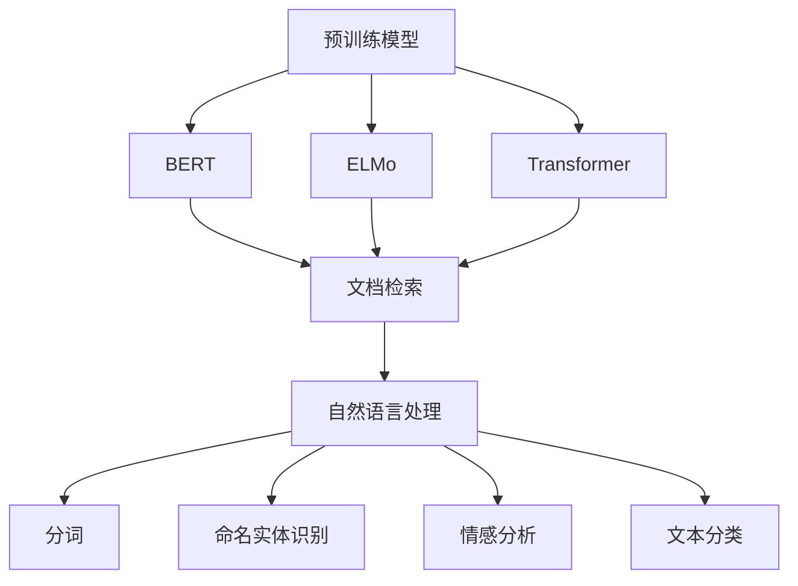
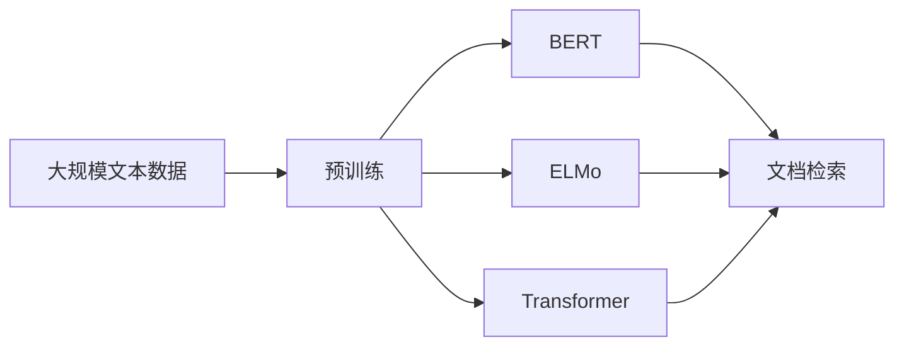
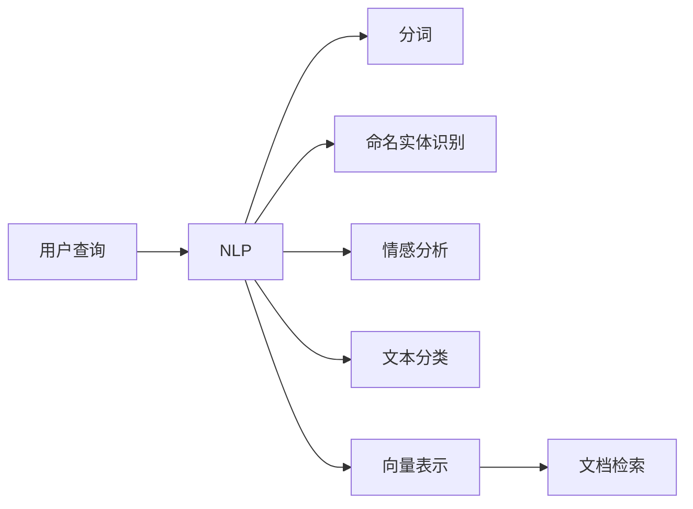
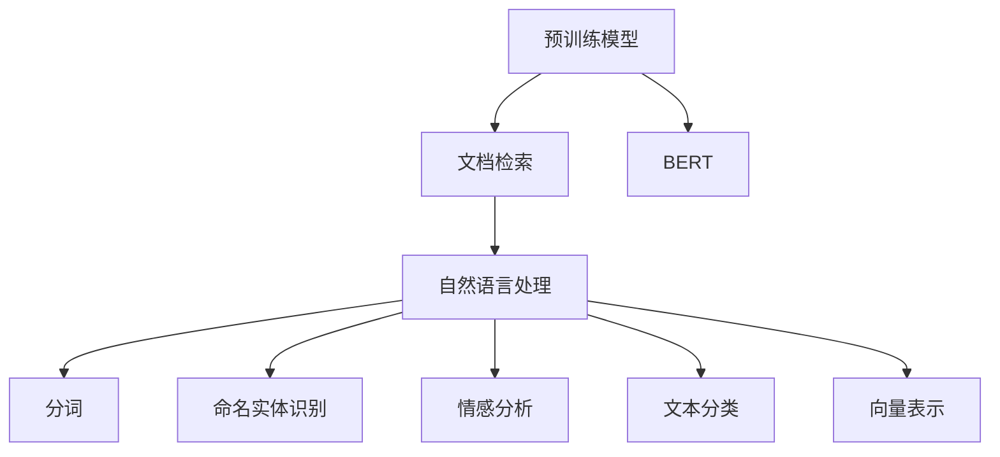
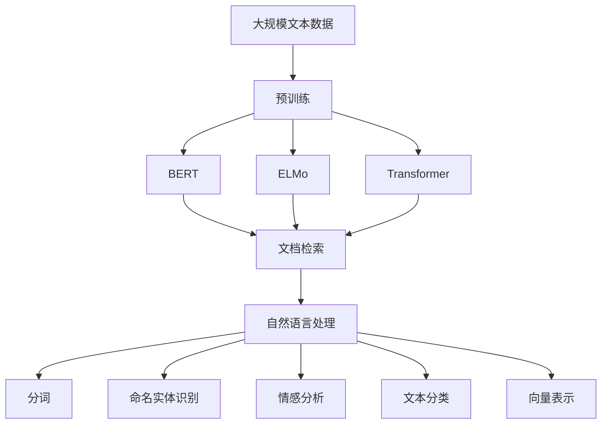

                 

# 【LangChain编程：从入门到实践】文档检索过程

> 关键词：LangChain, 文档检索, 信息检索, 自然语言处理(NLP), 预训练模型, 迁移学习, 代码实例

## 1. 背景介绍

### 1.1 问题由来
在当今信息爆炸的时代，如何快速高效地从海量文本中找到所需信息成为一项重要任务。文档检索系统，或称信息检索系统，正是为了解决这一问题而设计。它能帮助用户快速定位到包含特定信息或知识片段的文档，节省大量时间，提高工作效率。

文档检索系统分为两种主要类型：检索式查询和自然语言查询。传统的检索式查询需要用户手动输入关键词，效率较低，且用户需要了解精确的查询语法。自然语言查询则允许用户输入自然语言，系统能够自动识别并理解用户查询的意图，进行更精确的检索。

### 1.2 问题核心关键点
自然语言文档检索系统的核心在于如何将用户输入的自然语言转换为计算机可理解的查询语言，并从大量文档中筛选出与查询匹配的文档。这一过程涉及自然语言处理(NLP)技术，包括分词、命名实体识别、情感分析、文本分类等。

自然语言文档检索系统的构建需要解决以下几个关键问题：
1. 如何有效处理自然语言查询。
2. 如何从海量文本中提取关键信息。
3. 如何将查询与文档进行匹配。
4. 如何处理文档间相似度计算。
5. 如何提升系统响应速度和扩展性。

### 1.3 问题研究意义
研究自然语言文档检索技术，对于提高信息检索效率，支持个性化知识服务，促进人工智能技术的落地应用具有重要意义：

1. 信息检索效率的提升。通过自然语言查询，用户可以快速定位到所需信息，大大缩短信息查找时间。
2. 个性化知识服务的支持。系统可以根据用户的历史查询行为，提供定制化的推荐服务，增强用户体验。
3. 人工智能技术的落地应用。自然语言文档检索技术是构建智能问答、智能客服、智能推荐等应用的基础，是推动人工智能技术普及的重要环节。

## 2. 核心概念与联系

### 2.1 核心概念概述
为了更好地理解自然语言文档检索系统，本节将介绍几个密切相关的核心概念：

- **文档检索（Information Retrieval, IR）**：通过用户输入的查询词，从大量文本数据中检索出最相关的文档。
- **自然语言处理（Natural Language Processing, NLP）**：处理和分析自然语言文本，包括分词、命名实体识别、情感分析、文本分类等。
- **预训练模型（Pre-trained Model）**：在大规模无标签文本数据上进行预训练的模型，能够捕捉语言的通用规律和语义信息。
- **迁移学习（Transfer Learning）**：通过在大规模语料上预训练的模型，迁移到特定领域进行微调，提升模型在该领域的表现。
- **BERT**：Google提出的预训练语言模型，通过掩码语言模型、下一句预测等任务进行预训练，在文档检索等任务中表现优异。
- **ELMo**：Stanford提出的预训练语言模型，采用双向上下文表示，能够更准确地理解词语的语义。
- **Transformer**：Google提出的大规模预训练模型，采用自注意力机制，能够高效地处理长文本。
- **BERT模型结构**：包含多个Transformer层，通过掩码语言模型和下一句预测任务进行预训练，支持多种下游任务。

这些核心概念之间的逻辑关系可以通过以下Mermaid流程图来展示：



这个流程图展示了大规模预训练模型在自然语言文档检索中的应用：

1. 预训练模型通过掩码语言模型和下一句预测等任务进行预训练，学习语言的一般规律和语义信息。
2. BERT、ELMo等模型通过特定的训练任务，捕捉不同词语在上下文中的语义表示。
3. Transformer模型通过自注意力机制，高效处理长文本，捕捉长距离依赖关系。
4. 自然语言处理技术，如分词、命名实体识别、情感分析等，将用户查询转换为计算机可理解的形式。
5. 文档检索系统利用预训练模型和自然语言处理技术，从海量文本中筛选出与查询匹配的文档。

### 2.2 概念间的关系

这些核心概念之间存在着紧密的联系，形成了自然语言文档检索系统的完整框架。下面我通过几个Mermaid流程图来展示这些概念之间的关系：

#### 2.2.1 预训练模型的学习范式



这个流程图展示了预训练模型的学习范式，即通过大规模无标签文本数据进行预训练，学习语言的通用规律和语义信息。BERT、ELMo、Transformer等模型通过特定的训练任务，捕捉不同词语在上下文中的语义表示。

#### 2.2.2 文档检索与自然语言处理的关系



这个流程图展示了自然语言处理技术在文档检索中的应用。用户输入的自然语言查询经过分词、命名实体识别、情感分析、文本分类等处理，转化为计算机可理解的向量表示。然后，文档检索系统利用预训练模型，从文本数据库中检索出最相关的文档。

#### 2.2.3 BERT在文档检索中的应用



这个流程图展示了BERT在文档检索中的应用。BERT通过掩码语言模型和下一句预测等任务进行预训练，捕捉不同词语在上下文中的语义表示。然后，BERT模型作为预训练模型的一部分，用于提取查询和文档的向量表示。自然语言处理技术将查询转换为向量，系统利用BERT提取文档的向量表示，并计算查询向量与文档向量之间的相似度，从而找到最相关的文档。

### 2.3 核心概念的整体架构

最后，我用一个综合的流程图来展示这些核心概念在大规模预训练模型在文档检索中的整体架构：



这个综合流程图展示了从预训练到文档检索，再到自然语言处理技术的完整过程。大规模预训练模型通过掩码语言模型和下一句预测等任务进行预训练，学习语言的通用规律和语义信息。然后，BERT、ELMo、Transformer等模型通过特定的训练任务，捕捉不同词语在上下文中的语义表示。最后，自然语言处理技术将用户查询转换为向量，文档检索系统利用预训练模型，从文本数据库中检索出最相关的文档。

## 3. 核心算法原理 & 具体操作步骤
### 3.1 算法原理概述

自然语言文档检索系统主要基于预训练模型的迁移学习原理。其核心思想是：将大规模预训练模型视作一个强大的"特征提取器"，通过在特定领域的数据上微调，使其能够匹配查询和文档的语义表示，从而实现精确的文档检索。

形式化地，假设预训练模型为 $M_{\theta}$，其中 $\theta$ 为预训练得到的模型参数。给定查询 $q$ 和文档集合 $D=\{d_i\}_{i=1}^N$，检索系统的目标是最小化查询 $q$ 与文档 $d_i$ 之间的语义距离，即：

$$
\min_{\theta} \sum_{i=1}^N \mathcal{L}(q, d_i)
$$

其中 $\mathcal{L}$ 为语义距离度量函数，通常采用余弦相似度或欧氏距离等。

通过梯度下降等优化算法，检索系统不断更新模型参数 $\theta$，最小化语义距离，使得查询和文档的向量表示逼近，从而找到最相关的文档。由于 $\theta$ 已经通过预训练获得了较好的初始化，因此即便在小规模数据集上进行微调，也能较快收敛到理想的模型参数 $\hat{\theta}$。

### 3.2 算法步骤详解

自然语言文档检索系统的构建一般包括以下几个关键步骤：

**Step 1: 准备预训练模型和数据集**
- 选择合适的预训练语言模型 $M_{\theta}$ 作为初始化参数，如 BERT、ELMo 等。
- 准备查询和文档的数据集 $D=\{(q_i, d_i)\}_{i=1}^N$，其中 $q_i$ 为查询，$d_i$ 为文档。

**Step 2: 设计查询和文档的表示**
- 对于查询 $q$，使用预训练模型 $M_{\theta}$ 提取向量表示 $q_{\theta}$。
- 对于文档 $d_i$，同样使用预训练模型 $M_{\theta}$ 提取向量表示 $d_{\theta}^i$。

**Step 3: 设计相似度计算函数**
- 根据任务需求，选择合适的相似度计算函数，如余弦相似度、欧氏距离等。
- 计算查询 $q$ 与文档 $d_i$ 的相似度 $sim(q, d_i)$。

**Step 4: 执行检索**
- 将查询向量 $q_{\theta}$ 与文档向量 $d_{\theta}^i$ 的相似度排序，找到最相关的文档。
- 返回排名最高的 $k$ 个文档，作为最终检索结果。

**Step 5: 测试和优化**
- 在测试集上评估检索系统的召回率和准确率，对比检索前后的性能提升。
- 根据评估结果，调整超参数，进一步优化模型。

以上是自然语言文档检索系统的一般流程。在实际应用中，还需要针对具体任务的特点，对检索过程的各个环节进行优化设计，如改进查询表示方法、引入更多的相似度计算方法、搜索最优的超参数组合等，以进一步提升检索效果。

### 3.3 算法优缺点

自然语言文档检索系统基于预训练模型的迁移学习，具有以下优点：

1. 简单高效。只需准备少量标注数据，即可对预训练模型进行快速适配，获得较大的性能提升。
2. 通用适用。适用于各种文档检索任务，如问答、搜索、推荐等，设计简单的相似度计算函数即可实现。
3. 性能提升显著。通过微调模型，可以显著提升系统对查询的匹配度和检索效果。
4. 可扩展性强。可以通过添加更多的预训练模型，提升系统在大规模文档检索中的效率。

同时，该方法也存在一定的局限性：

1. 依赖标注数据。检索系统的效果很大程度上取决于标注数据的质量和数量，获取高质量标注数据的成本较高。
2. 领域限制。当查询和文档的领域差异较大时，检索系统的性能提升有限。
3. 资源消耗大。大规模预训练模型和微调过程需要消耗大量的计算资源和时间。
4. 鲁棒性不足。在噪声数据和对抗样本的情况下，检索系统的性能容易波动。
5. 可解释性差。检索系统的决策过程通常缺乏可解释性，难以对其推理逻辑进行分析和调试。

尽管存在这些局限性，但就目前而言，基于预训练模型的迁移学习方法是自然语言文档检索系统的最主流范式。未来相关研究的重点在于如何进一步降低检索系统对标注数据的依赖，提高系统的鲁棒性和可解释性。

### 3.4 算法应用领域

自然语言文档检索系统已经在信息检索、问答系统、个性化推荐等多个NLP领域得到了广泛的应用，成为NLP技术落地应用的重要手段。

1. **搜索引擎**：搜索引擎系统通过自然语言查询，从大量网页中检索出最相关的网页，帮助用户快速定位信息。

2. **问答系统**：问答系统通过用户输入的自然语言查询，从知识库中检索出最相关的答案。

3. **推荐系统**：推荐系统通过用户输入的自然语言查询，从产品库中检索出最相关的产品，提供个性化推荐。

4. **法律检索**：法律检索系统通过自然语言查询，从法律文献中检索出最相关的法条和判例。

5. **医学检索**：医学检索系统通过自然语言查询，从医学文献中检索出最相关的研究成果和医学知识。

除了上述这些经典应用外，自然语言文档检索系统还被创新性地应用到更多场景中，如智能客服、舆情监测、文档整理等，为NLP技术带来了全新的突破。随着预训练模型和检索方法的不断进步，相信自然语言文档检索系统将在更广阔的应用领域大放异彩。

## 4. 数学模型和公式 & 详细讲解 & 举例说明

### 4.1 数学模型构建

本节将使用数学语言对自然语言文档检索系统进行更加严格的刻画。

记预训练语言模型为 $M_{\theta}$，其中 $\theta$ 为预训练得到的模型参数。假设查询和文档的数据集为 $D=\{(q_i, d_i)\}_{i=1}^N$，其中 $q_i$ 为查询，$d_i$ 为文档。

定义模型 $M_{\theta}$ 在查询 $q$ 上的表示函数为 $f_{\theta}(q)$，在文档 $d_i$ 上的表示函数为 $g_{\theta}(d_i)$。则查询 $q$ 与文档 $d_i$ 的相似度函数为：

$$
sim(q, d_i) = \cos \left( f_{\theta}(q), g_{\theta}(d_i) \right)
$$

其中 $\cos$ 表示余弦相似度，$f_{\theta}(q)$ 和 $g_{\theta}(d_i)$ 为查询和文档的向量表示。

检索系统的目标是最小化查询 $q$ 与文档 $d_i$ 之间的语义距离，即：

$$
\min_{\theta} \sum_{i=1}^N \mathcal{L}(q, d_i)
$$

其中 $\mathcal{L}$ 为语义距离度量函数，通常采用余弦相似度或欧氏距离等。

### 4.2 公式推导过程

以下我们以余弦相似度为例，推导检索系统的损失函数及其梯度的计算公式。

假设查询 $q$ 与文档 $d_i$ 的向量表示分别为 $q_{\theta}$ 和 $d_{\theta}^i$。则余弦相似度定义为：

$$
sim(q, d_i) = \frac{q_{\theta} \cdot d_{\theta}^i}{\|q_{\theta}\|_2 \cdot \|d_{\theta}^i\|_2}
$$

将其代入检索系统的目标函数，得：

$$
\mathcal{L}(q, D) = \sum_{i=1}^N -\log \sigma(sim(q, d_i))
$$

其中 $\sigma$ 为sigmoid函数，保证相似度函数的输出值在0到1之间。

根据链式法则，检索系统的损失函数对模型参数 $\theta$ 的梯度为：

$$
\frac{\partial \mathcal{L}(q, D)}{\partial \theta} = -\sum_{i=1}^N \frac{q_{\theta} \cdot d_{\theta}^i}{\sigma(sim(q, d_i))} \cdot \left[ \frac{\partial q_{\theta}}{\partial \theta} \cdot d_{\theta}^i + q_{\theta} \cdot \frac{\partial d_{\theta}^i}{\partial \theta} \right]
$$

其中 $\frac{\partial q_{\theta}}{\partial \theta}$ 和 $\frac{\partial d_{\theta}^i}{\partial \theta}$ 为查询和文档表示函数的梯度，可通过反向传播算法高效计算。

在得到损失函数的梯度后，即可带入梯度下降等优化算法，更新模型参数 $\theta$。重复上述过程直至收敛，最终得到最优的查询和文档表示函数。

### 4.3 案例分析与讲解

这里给出两个具体的案例，用于说明自然语言文档检索系统的构建和应用。

**案例1: 搜索引擎**

搜索引擎系统通过自然语言查询，从大量网页中检索出最相关的网页。假设查询为 $q$，网页集合为 $D$。

1. **构建索引**：将网页进行分词、去除停用词、建立倒排索引等预处理操作。
2. **构建预训练模型**：选择BERT等预训练语言模型，作为检索系统的预训练模型。
3. **查询表示**：将查询 $q$ 输入预训练模型 $M_{\theta}$，提取向量表示 $q_{\theta}$。
4. **文档表示**：将网页 $d$ 输入预训练模型 $M_{\theta}$，提取向量表示 $d_{\theta}$。
5. **相似度计算**：计算查询 $q$ 与网页 $d$ 的余弦相似度 $sim(q, d)$。
6. **检索排序**：将网页 $d$ 按照相似度 $sim(q, d)$ 排序，返回排名最高的 $k$ 个网页，作为搜索结果。

**案例2: 问答系统**

问答系统通过用户输入的自然语言查询，从知识库中检索出最相关的答案。假设查询为 $q$，知识库为 $K$。

1. **构建知识库**：将知识库进行分词、去除停用词、建立倒排索引等预处理操作。
2. **构建预训练模型**：选择BERT等预训练语言模型，作为检索系统的预训练模型。
3. **查询表示**：将查询 $q$ 输入预训练模型 $M_{\theta}$，提取向量表示 $q_{\theta}$。
4. **答案表示**：将知识库中的每个答案 $a$ 输入预训练模型 $M_{\theta}$，提取向量表示 $a_{\theta}$。
5. **相似度计算**：计算查询 $q$ 与每个答案 $a$ 的余弦相似度 $sim(q, a)$。
6. **检索排序**：将答案 $a$ 按照相似度 $sim(q, a)$ 排序，返回排名最高的答案，作为最终答案。

通过以上案例可以看出，自然语言文档检索系统通过预训练模型和自然语言处理技术，将查询和文档转换为向量表示，计算向量之间的相似度，从而实现高效的文档检索。

## 5. 项目实践：代码实例和详细解释说明

### 5.1 开发环境搭建

在进行自然语言文档检索系统的开发前，我们需要准备好开发环境。以下是使用Python进行PyTorch开发的环境配置流程：

1. 安装Anaconda：从官网下载并安装Anaconda，用于创建独立的Python环境。

2. 创建并激活虚拟环境：
```bash
conda create -n pytorch-env python=3.8 
conda activate pytorch-env
```

3. 安装PyTorch：根据CUDA版本，从官网获取对应的安装命令。例如：
```bash
conda install pytorch torchvision torchaudio cudatoolkit=11.1 -c pytorch -c conda-forge
```

4. 安装Transformers库：
```bash
pip install transformers
```

5. 安装各类工具包：
```bash
pip install numpy pandas scikit-learn matplotlib tqdm jupyter notebook ipython
```

完成上述步骤后，即可在`pytorch-env`环境中开始自然语言文档检索系统的实践。

### 5.2 源代码详细实现

这里我们以构建一个简单的自然语言文档检索系统为例，使用Transformer库和BertTokenizer，对BERT模型进行检索系统的构建。

首先，定义查询和文档的数据集：

```python
from transformers import BertTokenizer
from torch.utils.data import Dataset
import torch

class DocRetrievalDataset(Dataset):
    def __init__(self, texts, titles):
        self.texts = texts
        self.titles = titles
        self.tokenizer = BertTokenizer.from_pretrained('bert-base-uncased')
        
    def __len__(self):
        return len(self.texts)
    
    def __getitem__(self, item):
        text = self.texts[item]
        title = self.titles[item]
        
        encoding = self.tokenizer(text, return_tensors='pt', max_length=256, padding='max_length', truncation=True)
        input_ids = encoding['input_ids'][0]
        attention_mask = encoding['attention_mask'][0]
        return {'text': input_ids, 'title': title}

# 创建dataset
tokenizer = BertTokenizer.from_pretrained('bert-base-uncased')
train_dataset = DocRetrievalDataset(train_texts, train_titles)
dev_dataset = DocRetrievalDataset(dev_texts, dev_titles)
test_dataset = DocRetrievalDataset(test_texts, test_titles)
```

然后，定义检索模型的结构和优化器：

```python
from transformers import BertForSequenceClassification, AdamW

model = BertForSequenceClassification.from_pretrained('bert-base-uncased', num_labels=1)

optimizer = AdamW(model.parameters(), lr=2e-5)
```

接着，定义训练和评估函数：

```python
from torch.utils.data import DataLoader
from tqdm import tqdm
from sklearn.metrics import roc_auc_score

device = torch.device('cuda') if torch.cuda.is_available() else torch.device('cpu')
model.to(device)

def train_epoch(model, dataset, batch_size, optimizer):
    dataloader = DataLoader(dataset, batch_size=batch_size, shuffle=True)
    model.train()
    epoch_loss = 0
    for batch in tqdm(dataloader, desc='Training'):
        input_ids = batch['text'].to(device)
        attention_mask = batch['title'].to(device)
        labels = batch['title'].to(device)
        model.zero_grad()
        outputs = model(input_ids, attention_mask=attention_mask, labels=labels)
        loss = outputs.loss
        epoch_loss += loss.item()
        loss.backward()
        optimizer.step()
    return epoch_loss / len(dataloader)

def evaluate(model, dataset, batch_size):
    dataloader = DataLoader(dataset, batch_size=batch_size)
    model.eval()
    preds, labels = [], []
    with torch.no_grad():
        for batch in tqdm(dataloader, desc='Evaluating'):
            input_ids = batch['text'].to(device)
            attention_mask = batch['title'].to(device)
            batch_labels = batch['title'].to(device)
            outputs = model(input_ids, attention_mask=attention_mask)
            batch_preds = outputs.logits.argmax(dim=1).to('cpu').tolist()
            batch_labels = batch_labels.to('cpu').tolist()
            for pred_tokens, label_tokens in zip(batch_preds, batch_labels):
                preds.append(pred_tokens[:len(label_tokens)])
                labels.append(label_tokens)
                
    roc_auc = roc_auc_score(labels, preds)
    print(f'ROC-AUC: {roc_auc:.4f}')
```

最后，启动训练流程并在测试集上评估：

```python
epochs = 5
batch_size = 16

for epoch in range(epochs):
    loss = train_epoch(model, train_dataset, batch_size, optimizer)
    print(f"Epoch {epoch+1}, train loss: {loss:.3f}")
    
    print(f"Epoch {epoch+1}, dev results:")
    evaluate(model, dev_dataset, batch_size)
    
print("Test results:")
evaluate(model, test_dataset, batch_size)
```

以上就是使用PyTorch和Transformer库对BERT模型进行自然语言文档检索系统的完整代码实现。可以看到，Transformer库使得模型构建和微调的过程变得相对简单。

### 5.3 代码解读与分析

让我们再详细解读一下关键代码的实现细节：

**DocRetrievalDataset类**：
- `__init__`方法：初始化文本、标题等关键组件。
- `__len__`方法：返回数据集的样本数量。
- `__getitem__`方法：对单个样本进行处理，将文本输入编码为token ids，将标题编码后作为标签，并将其与文本一起输入模型。

**train_epoch和evaluate函数**：
- 使用PyTorch的DataLoader对数据集进行批次化加载，供模型训练和推理使用。
- 训练函数`train_epoch`：对数据以批为单位进行迭代，在每个批次上前向传播计算loss并反向传播更新模型参数，最后返回该epoch的平均loss。
- 评估函数`evaluate`：与训练类似，不同点在于不更新模型参数，并在每个batch结束后将预测和标签结果存储下来，最后使用sklearn的roc_auc_score计算检索效果。

**训练流程**：
- 定义总的epoch数和batch size，开始循环迭代
- 每个epoch内，先在训练集上训练，输出平均loss
- 在验证集上评估，输出ROC-AUC分数

