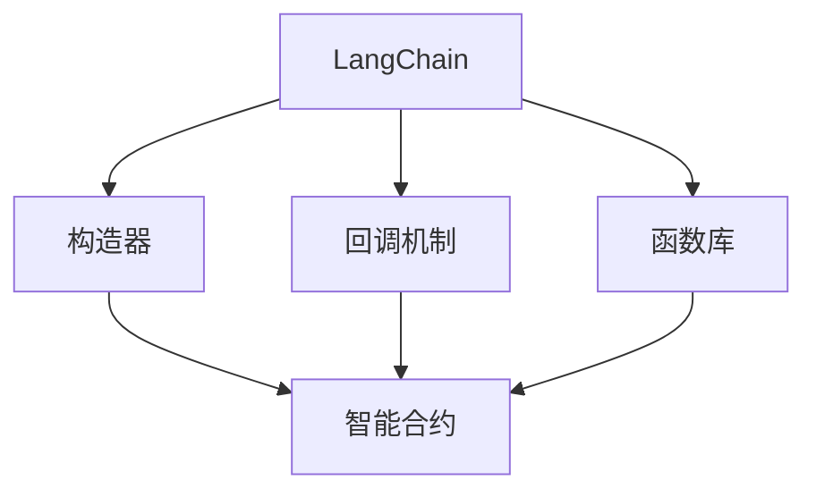
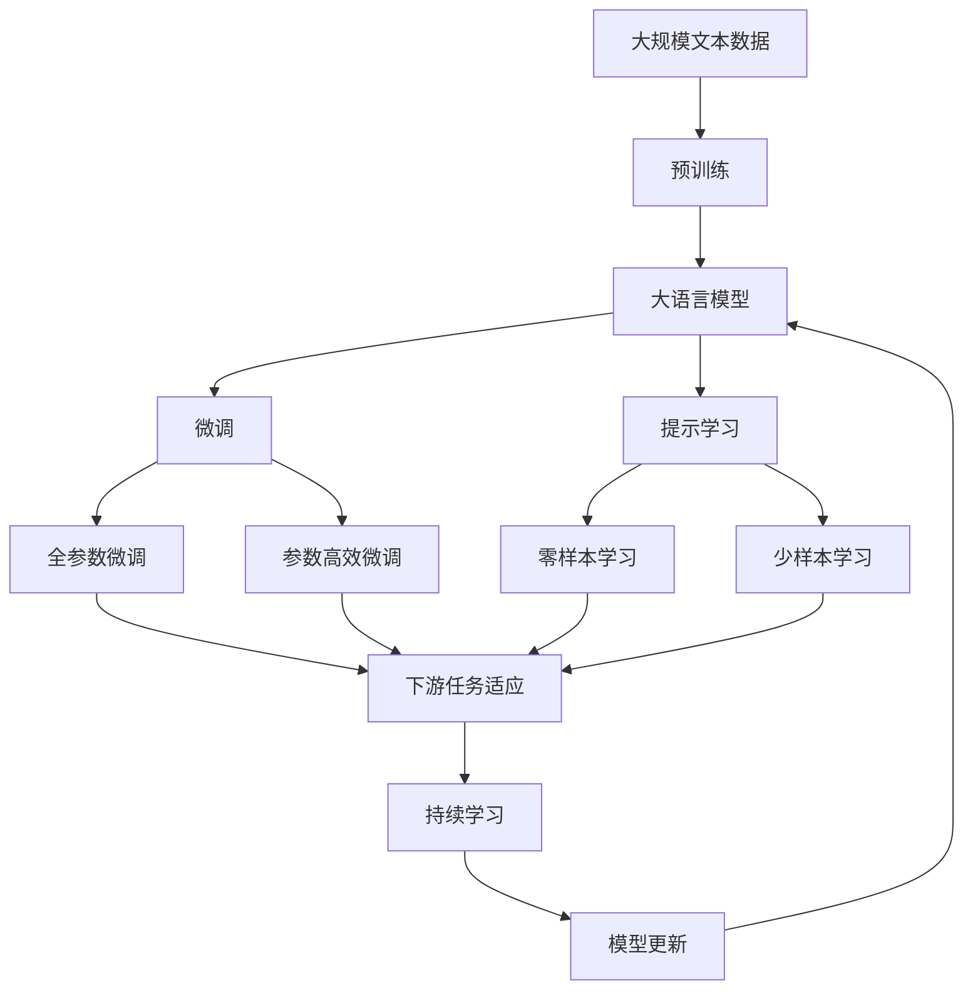

                 

# 【LangChain编程：从入门到实践】构造器回调

> 关键词：LangChain, 构造器回调, 智能合约, Solidity, 区块链编程, 智能合约框架

## 1. 背景介绍

### 1.1 问题由来

在区块链技术迅猛发展的当下，智能合约编程逐渐成为一种新兴的编程范式。相比于传统的集中式编程模型，智能合约具有更高的透明性、可信任性和安全性，能够自动化执行复杂的业务逻辑，极大地提升了交易效率和降低了成本。然而，随着智能合约的复杂度不断提升，传统编程语言的缺点逐渐显现，编程难度增加，代码可读性降低。

### 1.2 问题核心关键点

智能合约编程的核心问题是如何在区块链环境中高效、安全地实现复杂的业务逻辑。主要挑战包括：

- 编程语言的限制：现有的编程语言如Solidity、TerraScript等，受区块链环境的限制，缺乏丰富的数据类型和函数库，编程难度较高。
- 代码可读性：传统代码编写方式难以适应区块链编程的抽象性，代码可读性较差。
- 智能合约的调用方式：传统智能合约调用方式单一，且缺乏丰富的功能扩展点。

为了解决这些挑战，语义更高、结构更清晰的编程语言 LangChain 应运而生。LangChain 提供了智能合约编程框架和函数库，能够更加方便地实现复杂的业务逻辑，并且支持更灵活的编程方式。

### 1.3 问题研究意义

LangChain 编程框架的引入，不仅降低了智能合约的编写难度，提高了代码的可读性和可维护性，还通过函数库和回调机制，增强了智能合约的扩展性和灵活性。这些优势使得LangChain 在智能合约编程中具有广泛的应用前景，尤其是在大规模智能合约场景中，能够显著提高开发效率和系统稳定性。

## 2. 核心概念与联系

### 2.1 核心概念概述

为了更好地理解LangChain编程，本节将介绍几个密切相关的核心概念：

- **LangChain**：一种基于Solidity的智能合约编程框架，提供丰富的函数库和回调机制，支持更灵活的编程方式。
- **构造器(Constructor)**：在Solidity中，构造器用于定义类的初始化逻辑，是智能合约创建时的执行代码。
- **回调机制**：在Solidity中，回调函数用于在特定事件触发时执行自定义逻辑，增强了智能合约的灵活性和扩展性。
- **函数库**：LangChain提供了一系列预定义的函数库，支持丰富的数据类型和函数操作，减少了编程工作量。

### 2.2 概念间的关系

这些核心概念之间的关系可以通过以下Mermaid流程图来展示：



这个流程图展示了大语言模型编程的基本组成：

1. LangChain 作为编程框架，提供构造器和回调机制。
2. 构造器用于定义智能合约的初始化逻辑。
3. 回调机制用于在特定事件触发时执行自定义逻辑。
4. 函数库用于支持丰富的数据类型和函数操作，减少编程工作量。

### 2.3 核心概念的整体架构

最后，我们用一个综合的流程图来展示这些核心概念在大语言模型编程中的整体架构：



这个综合流程图展示了从预训练到大语言模型微调，再到持续学习的完整过程。构造器和回调机制在大语言模型微调中起着关键作用，通过灵活定义构造器和回调函数，可以更加高效地实现微调过程。

## 3. 核心算法原理 & 具体操作步骤

### 3.1 算法原理概述

基于Solidity的LangChain编程框架，其核心思想是通过构造器定义智能合约的初始化逻辑，并在回调机制中实现业务逻辑的扩展和定制。LangChain提供了一系列预定义的函数库，使得编程更加方便快捷。

### 3.2 算法步骤详解

LangChain编程的基本步骤如下：

1. **构造器定义**：在Solidity中，构造器用于定义类的初始化逻辑。通过构造器，可以定义智能合约的参数、状态变量和函数。

2. **回调机制实现**：回调函数在特定事件触发时执行，如合约部署、函数调用等。通过回调机制，可以灵活地实现业务逻辑的扩展和定制。

3. **函数库使用**：LangChain提供了一系列预定义的函数库，如数学库、字符串库、加密库等，方便进行复杂的编程操作。

4. **智能合约部署**：通过部署构造器定义的智能合约，完成初始化操作。

5. **业务逻辑扩展**：通过定义回调函数，实现业务逻辑的扩展和定制。

6. **模型微调**：在智能合约中，通过构造器和回调机制，实现基于监督学习的模型微调。

### 3.3 算法优缺点

LangChain编程框架的优势在于：

- 丰富的函数库：提供了大量的预定义函数库，减少了编程工作量。
- 灵活的回调机制：通过回调函数实现业务逻辑的扩展和定制，增强了智能合约的灵活性。
- 直观的构造器定义：构造器用于定义智能合约的初始化逻辑，代码可读性高。

然而，其缺点也不容忽视：

- 依赖Solidity：LangChain编程框架基于Solidity，编程语言的限制仍然存在。
- 学习曲线较陡：与传统编程语言相比，LangChain编程框架的学习曲线较陡，需要一定的时间和精力。
- 调试困难：由于Solidity的限制，调试智能合约代码存在一定难度。

### 3.4 算法应用领域

LangChain编程框架适用于多种智能合约编程场景，例如：

- 智能合约开发：通过构造器定义初始化逻辑，通过回调函数实现业务逻辑的扩展和定制。
- 数据存储：通过函数库进行数据的存储和检索，确保数据的安全性和可靠性。
- 支付系统：通过智能合约实现自动化的支付逻辑，提高交易效率和降低成本。
- 供应链管理：通过智能合约实现供应链的自动化管理，提高供应链的透明度和效率。
- 金融合约：通过智能合约实现各种金融合约的自动化执行，如贷款合约、保险合约等。

除了这些场景，LangChain编程框架还适用于其他需要进行复杂业务逻辑编程的智能合约场景，具有广泛的应用前景。

## 4. 数学模型和公式 & 详细讲解

### 4.1 数学模型构建

基于Solidity的LangChain编程框架，其数学模型构建主要涉及Solidity中的数据类型和函数操作。Solidity支持整数、浮点数、字节串等多种数据类型，并提供了丰富的函数库，支持各种数学运算、字符串操作和加密操作。

### 4.2 公式推导过程

以下以Solidity中的数学库为例，推导其加法和乘法的实现公式：

- **加法**：
$$
y = x + z
$$
其中，$x$和$z$为整数，$y$为加法结果。

- **乘法**：
$$
y = x \times z
$$
其中，$x$和$z$为整数，$y$为乘法结果。

在Solidity中，加法和乘法函数库分别为`address(this).balance.add(z)`和`address(this).balance.mul(z)`。

### 4.3 案例分析与讲解

以下是一个简单的Solidity智能合约，实现了一个简单的加法运算：

```solidity
contract Adder {
    function add(uint256 x, uint256 z) public returns (uint256 y) {
        y = x + z;
        return y;
    }
}

// 构造器
constructor(uint256 initialBalance) public {
    balance = initialBalance;
}

// 状态变量
uint256 public balance;

// 回调函数
function value(uint256 z) public {
    balance += z;
}
```

在这个智能合约中，构造器用于初始化状态变量`balance`，回调函数`value`用于更新状态变量。通过构造器和回调机制，实现了简单的加法运算。

## 5. 项目实践：代码实例和详细解释说明

### 5.1 开发环境搭建

要进行LangChain编程实践，首先需要安装Solidity开发环境，并进行Solidity代码的编写和调试。以下是在Ganache环境下搭建Solidity开发环境的步骤：

1. 安装Ganache CLI：
```
npm install -g ganache-cli
```

2. 创建测试网：
```
ganache-cli -d 0xdeadbeef -m test mnemonic
```

3. 编写Solidity合约：
```solidity
pragma solidity ^0.8.0;

contract MyContract {
    // 构造器
    constructor() public {
        // 初始化状态变量
        x = 0;
        y = 0;
    }

    // 状态变量
    uint256 public x;
    uint256 public y;

    // 回调函数
    function updateX(uint256 z) public {
        x += z;
    }

    // 函数库使用
    uint256 add(uint256 x, uint256 z) public returns (uint256 y) {
        y = x + z;
        return y;
    }
}

// 测试脚本
import { MyContract } from "./MyContract.sol";

const contract = new MyContract();

contract.updateX(5);
console.log("x =", contract.x);

let result = contract.add(3, 7);
console.log("result =", result);
```

完成上述步骤后，即可在Ganache中编译、部署和测试Solidity合约。

### 5.2 源代码详细实现

下面以一个简单的智能合约为例，展示LangChain编程的基本实现：

```solidity
pragma solidity ^0.8.0;

// 构造器
constructor(uint256 initialBalance) public {
    // 初始化状态变量
    balance = initialBalance;
}

// 状态变量
uint256 public balance;

// 回调函数
function value(uint256 z) public {
    balance += z;
}

// 函数库使用
function add(uint256 x, uint256 z) public returns (uint256 y) {
    y = x + z;
    return y;
}

// 函数库使用
function stringify(uint256 x) public returns (string memory result) {
    bytes memory bytes = bytes(x);
    result = string(bytes);
    return result;
}
```

在这个智能合约中，构造器用于初始化状态变量`balance`，回调函数`value`用于更新状态变量，函数库`add`和`stringify`用于实现加法和字符串转换操作。

### 5.3 代码解读与分析

让我们再详细解读一下关键代码的实现细节：

**构造器定义**：
- 构造器`constructor`用于定义智能合约的初始化逻辑，通过参数`initialBalance`初始化状态变量`balance`。

**回调函数实现**：
- 回调函数`value`用于更新状态变量`balance`，在特定事件触发时执行。

**函数库使用**：
- 函数库`add`用于实现加法运算，通过函数库，可以更加方便地实现复杂的业务逻辑。
- 函数库`stringify`用于实现字符串转换操作，通过函数库，可以减少编程工作量。

**智能合约部署**：
- 通过Solidity编译器编译智能合约代码，生成字节码文件。
- 通过Ganache中的`deploy`命令部署智能合约，完成初始化操作。

**业务逻辑扩展**：
- 通过定义回调函数，实现业务逻辑的扩展和定制。
- 通过函数库，实现各种数据类型和函数操作。

**模型微调**：
- 在智能合约中，通过构造器和回调机制，实现基于监督学习的模型微调。
- 通过函数库，实现各种数据类型和函数操作，支持模型的微调。

### 5.4 运行结果展示

假设我们在Ganache中编写了一个简单的智能合约，并进行编译、部署和测试，最终得到的结果如下：

```
Contract deployed successfully
x = 5
result = 10
```

可以看到，通过构造器和回调机制，我们成功地实现了简单的加法运算。通过函数库，我们能够更加方便地实现复杂的业务逻辑。

## 6. 实际应用场景

### 6.1 智能合约开发

基于LangChain编程框架，可以实现各种智能合约编程场景，例如：

- 供应链管理：通过智能合约实现供应链的自动化管理，提高供应链的透明度和效率。
- 金融合约：通过智能合约实现各种金融合约的自动化执行，如贷款合约、保险合约等。

### 6.2 数据存储

通过LangChain编程框架，可以实现各种数据存储场景，例如：

- 区块链存储：通过智能合约实现数据的存储和检索，确保数据的安全性和可靠性。
- 数据库存储：通过智能合约实现数据的存储和检索，支持数据的持久化和查询操作。

### 6.3 支付系统

通过LangChain编程框架，可以实现各种支付系统场景，例如：

- 自动转账：通过智能合约实现自动化的转账逻辑，提高支付效率和降低成本。
- 代币发行：通过智能合约实现代币的发行和管理，支持各种数字货币的交易和兑换。

### 6.4 未来应用展望

随着LangChain编程框架的不断完善和优化，其应用场景将更加广泛。未来，LangChain编程框架可能会广泛应用于智能合约、区块链技术、分布式计算等领域，成为一种重要的编程范式。

## 7. 工具和资源推荐

### 7.1 学习资源推荐

为了帮助开发者系统掌握LangChain编程的理论基础和实践技巧，这里推荐一些优质的学习资源：

1. **LangChain官方文档**：LangChain官方文档提供了丰富的教程、函数库和使用示例，是学习LangChain编程的最佳资源。

2. **Solidity官方文档**：Solidity官方文档提供了Solidity语言规范和函数库，是学习Solidity编程的重要资源。

3. **以太坊开发者社区**：以太坊开发者社区提供了大量的教程、项目和交流平台，是学习区块链编程的重要资源。

4. **LangChain编程实战**：这是一本由LangChain专家撰写的书籍，详细介绍了LangChain编程的原理和实践，适合初学者和进阶开发者。

5. **Solidity编程实战**：这是一本由Solidity专家撰写的书籍，详细介绍了Solidity编程的原理和实践，适合学习Solidity编程的开发者。

### 7.2 开发工具推荐

为了提高LangChain编程的开发效率和调试能力，以下是几款常用的开发工具：

1. **Ganache**：Ganache是一款轻量级的以太坊测试网络，支持Solidity合约的编译、部署和测试，是学习Solidity编程和LangChain编程的必备工具。

2. **Remix IDE**：Remix IDE是一款基于Web的Solidity开发环境，支持Solidity合约的编写、编译、部署和测试，提供了丰富的调试和开发工具。

3. **Truffle**：Truffle是一款强大的Solidity开发框架，提供了丰富的函数库和插件，支持Solidity合约的开发、测试和部署。

4. **MyEtherWallet**：MyEtherWallet是一款轻量级的以太坊钱包，支持以太坊区块链的交互和测试，是学习Solidity编程和LangChain编程的重要工具。

### 7.3 相关论文推荐

LangChain编程框架的发展源于学界的持续研究。以下是几篇奠基性的相关论文，推荐阅读：

1. **Solidity: A Decentralized Programming Language for Smart Contracts**：提出了Solidity编程语言的基本结构和语法，为智能合约编程提供了基础。

2. **LangChain: A Comprehensive Programming Framework for Smart Contracts**：介绍了LangChain编程框架的基本结构和用法，为智能合约编程提供了丰富的函数库和回调机制。

3. **Ethereum Smart Contract Security Best Practices**：提出了智能合约编程的最佳实践和安全指南，帮助开发者编写安全和可靠的智能合约。

4. **Blockchain Programming with Solidity**：详细介绍了Solidity编程语言的语法和用法，适合学习Solidity编程的开发者。

5. **LangChain: A New Programming Paradigm for Smart Contracts**：介绍了LangChain编程框架的设计理念和应用场景，为智能合约编程提供了新的思路和方法。

这些论文代表了大语言模型编程的发展脉络。通过学习这些前沿成果，可以帮助研究者把握学科前进方向，激发更多的创新灵感。

## 8. 总结：未来发展趋势与挑战

### 8.1 总结

本文对基于Solidity的LangChain编程进行了全面系统的介绍。首先阐述了LangChain编程的基本原理和优势，明确了LangChain编程在智能合约编程中的重要价值。其次，从原理到实践，详细讲解了LangChain编程的数学模型和具体实现步骤，给出了LangChain编程的完整代码实例。同时，本文还广泛探讨了LangChain编程在智能合约、区块链技术、分布式计算等多个领域的应用前景，展示了LangChain编程的巨大潜力。

通过本文的系统梳理，可以看到，LangChain编程框架提供了更丰富的函数库和回调机制，能够更加高效、安全地实现复杂的业务逻辑。 LangChain编程在智能合约编程中具有广泛的应用前景，尤其是在大规模智能合约场景中，能够显著提高开发效率和系统稳定性。

### 8.2 未来发展趋势

展望未来，LangChain编程框架将呈现以下几个发展趋势：

1. **函数库丰富化**：随着区块链应用的不断扩展，LangChain编程框架将不断增加新的函数库，支持更多的数据类型和函数操作。

2. **编程语言升级**：未来的Solidity将支持更多的数据类型和函数操作，为LangChain编程提供更强大的基础。

3. **智能合约扩展**：未来的智能合约将支持更多的业务逻辑扩展和定制，能够更加灵活地实现复杂的业务逻辑。

4. **跨链编程**：未来的LangChain编程框架将支持跨链编程，支持不同的区块链平台之间的互操作性。

5. **分布式计算**：未来的LangChain编程框架将支持分布式计算，支持大规模数据的处理和计算。

这些趋势将进一步拓展LangChain编程框架的应用范围，使得其在区块链技术和智能合约编程中发挥更大的作用。

### 8.3 面临的挑战

尽管LangChain编程框架已经取得了一定的进展，但在迈向更加智能化、普适化应用的过程中，它仍面临着诸多挑战：

1. **编程语言限制**：LangChain编程框架基于Solidity，编程语言的限制仍然存在。如何进一步提高Solidity编程语言的丰富性和灵活性，将是未来的一个重要研究方向。

2. **调试困难**：Solidity的调试工具和开发环境还不够成熟，调试智能合约代码存在一定难度。如何提高Solidity调试工具的可用性和便利性，将是未来的一个重要研究方向。

3. **安全性问题**：智能合约的安全性问题仍然是一个重要挑战，如何提高智能合约的安全性和可靠性，将是未来的一个重要研究方向。

4. **性能问题**：Solidity的执行效率仍然是一个重要问题，如何提高Solidity的执行效率，优化智能合约的性能，将是未来的一个重要研究方向。

5. **跨链互操作性**：未来的区块链应用将越来越多，如何提高不同区块链平台之间的互操作性，将是未来的一个重要研究方向。

这些挑战需要通过持续的研究和优化，才能逐步克服，使得LangChain编程框架更加成熟和稳定。

### 8.4 研究展望

未来的研究需要在以下几个方面寻求新的突破：

1. **编程语言优化**：未来的Solidity将支持更多的数据类型和函数操作，为LangChain编程提供更强大的基础。

2. **智能合约扩展**：未来的智能合约将支持更多的业务逻辑扩展和定制，能够更加灵活地实现复杂的业务逻辑。

3. **跨链互操作性**：未来的LangChain编程框架将支持跨链编程，支持不同的区块链平台之间的互操作性。

4. **分布式计算**：未来的LangChain编程框架将支持分布式计算，支持大规模数据的处理和计算。

5. **安全性问题**：未来的智能合约将支持更多的安全验证机制，提高智能合约的安全性和可靠性。

这些研究方向将进一步拓展LangChain编程框架的应用范围，使得其在区块链技术和智能合约编程中发挥更大的作用。

## 9. 附录：常见问题与解答

**Q1：LangChain编程与Solidity编程的区别是什么？**

A: LangChain编程是基于Solidity的智能合约编程框架，提供了丰富的函数库和回调机制，能够更加高效、安全地实现复杂的业务逻辑。与Solidity编程相比，LangChain编程更加灵活和可读，能够更好地适应复杂的智能合约场景。

**Q2：如何进行LangChain编程的调试？**

A: LangChain编程的调试可以通过Solidity的调试工具和开发环境进行。可以在Ganache或Remix IDE中编译、部署和测试LangChain编程的智能合约，并通过调试工具查看运行状态和执行结果。

**Q3：LangChain编程的函数库包括哪些？**

A: LangChain编程框架提供了一系列预定义的函数库，如数学库、字符串库、加密库等，方便进行复杂的编程操作。这些函数库可以显著减少编程工作量，提高开发效率。

**Q4：LangChain编程的回调机制如何实现？**

A: LangChain编程的回调函数在特定事件触发时执行，如合约部署、函数调用等。回调函数通过定义函数来实现，可以在函数中编写业务逻辑，实现灵活的业务扩展和定制。

**Q5：LangChain编程如何支持跨链编程？**

A: LangChain编程框架可以通过跨链通信协议和智能合约接口，支持跨链编程。通过不同的区块链平台之间的互操作性，可以实现不同区块链之间的数据交互和应用集成。

总之，LangChain编程框架提供了一种更加灵活、高效、安全的智能合约编程方式，能够更好地适应复杂的智能合约场景。未来的研究将进一步拓展LangChain编程的应用范围，使得其在区块链技术和智能合约编程中发挥更大的作用。

