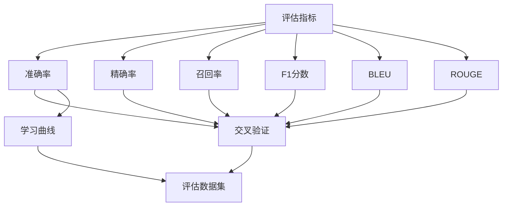
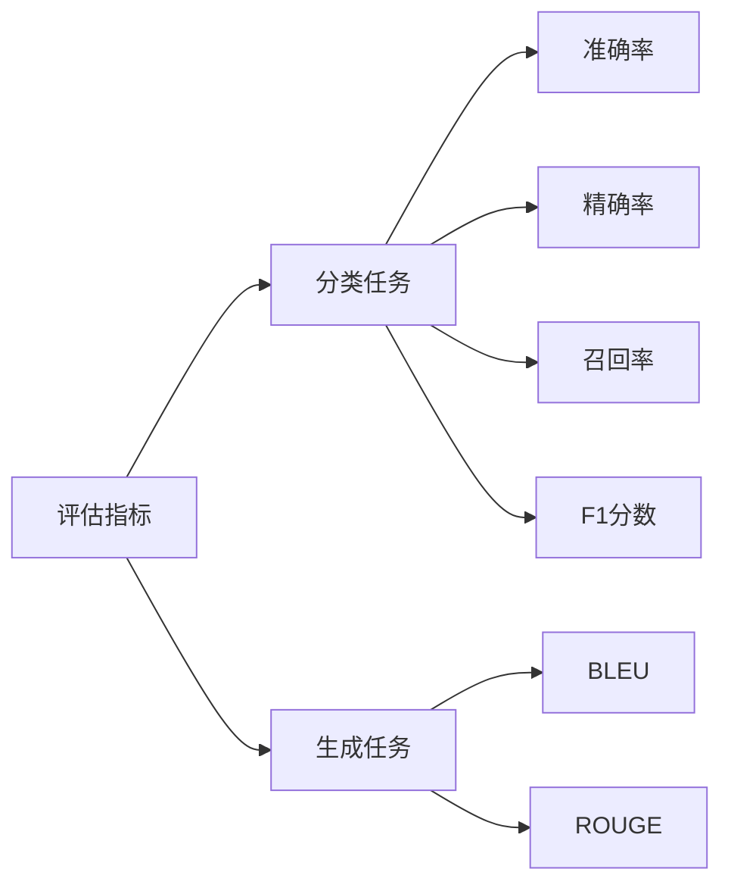
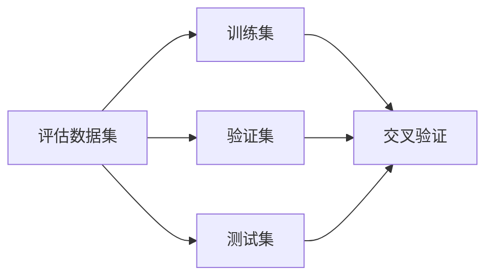
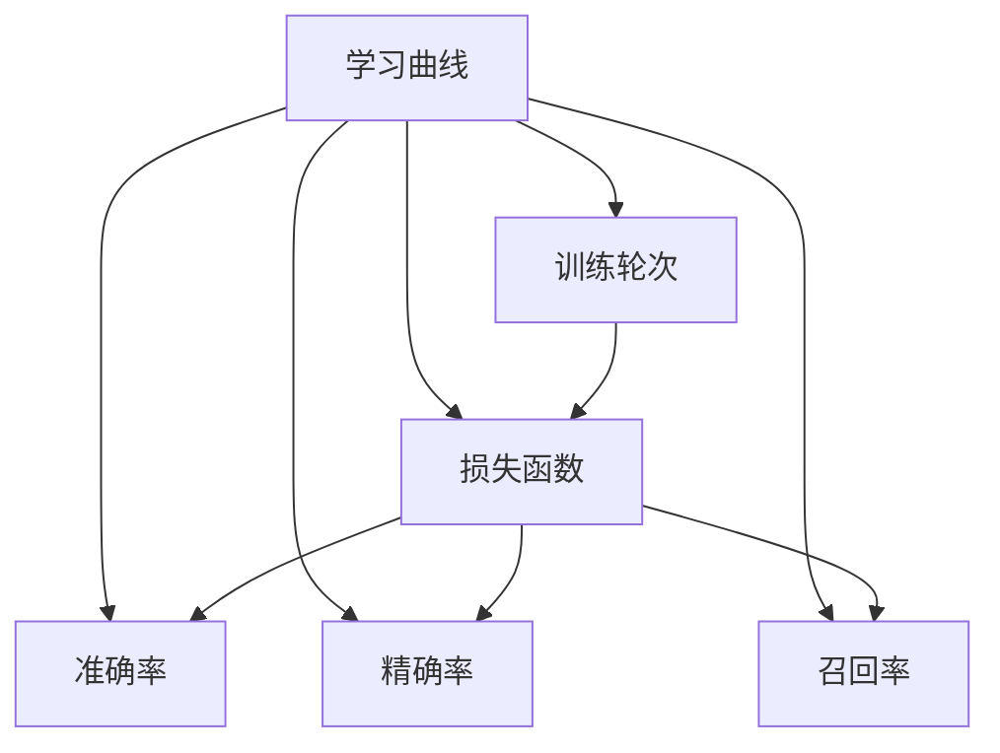
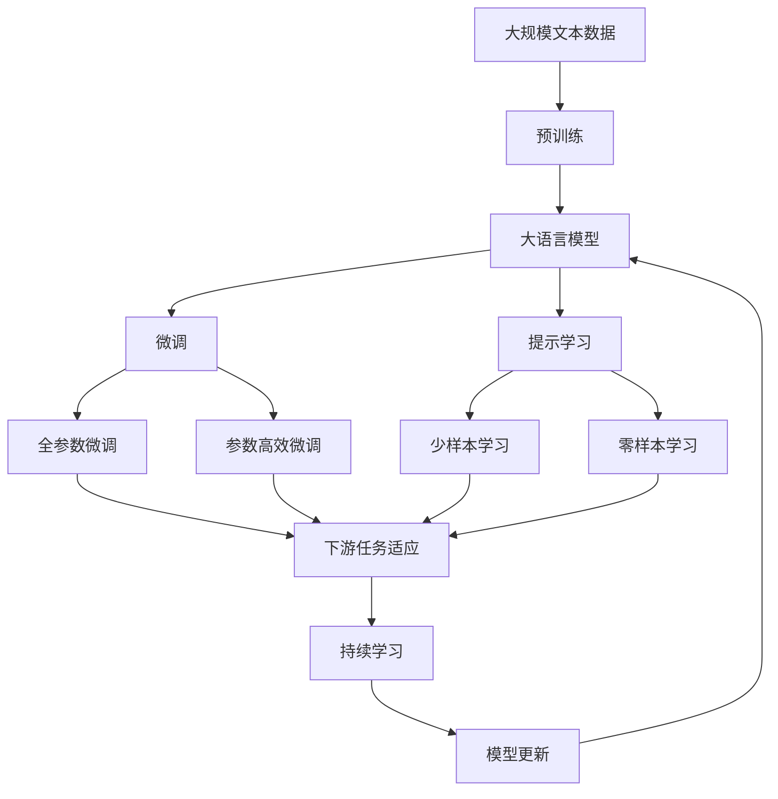

                 

# 【LangChain编程：从入门到实践】模型效果评估

## 1. 背景介绍

### 1.1 问题由来
在人工智能领域，模型效果评估是至关重要的环节。通过对模型的效果进行评估，可以判断模型的性能，确定模型的优劣，为后续的优化提供依据。特别是在NLP（自然语言处理）领域，模型效果评估尤为重要，因为模型的表现直接关系到自然语言理解和生成任务的效果。

随着深度学习技术的发展，大语言模型（Large Language Models, LLMs）在NLP领域取得了显著的进展。这些模型在预训练过程中学习了大量的语言知识和常识，能够对自然语言进行理解和生成。但是，这些模型在特定任务上的效果如何，需要通过评估才能得出结论。

### 1.2 问题核心关键点
模型效果评估的核心关键点包括以下几个方面：

- **评估指标的选择**：不同的任务需要不同的评估指标，例如分类任务通常使用准确率、精确率、召回率等，而生成任务则可以使用BLEU、ROUGE等指标。
- **评估数据集的构建**：评估数据集必须与模型训练数据集相似，以确保评估结果的可靠性。
- **评估方法的设计**：评估方法需要能够客观、公正地反映模型的性能。
- **评估结果的解读**：评估结果需要结合具体任务进行解读，以确定模型的优势和不足。

### 1.3 问题研究意义
模型效果评估对于优化模型、提升任务性能、加速NLP技术落地应用具有重要意义：

1. **优化模型**：通过评估模型的效果，可以找出模型的不足之处，进而优化模型。
2. **提升任务性能**：评估结果可以为模型选择、参数调优提供依据，从而提升任务性能。
3. **加速技术落地应用**：评估结果可以验证模型的应用效果，加速技术的商业化进程。
4. **提高研究水平**：评估方法可以推动NLP领域的研究进步，提高学术研究水平。

## 2. 核心概念与联系

### 2.1 核心概念概述

为了更好地理解模型效果评估，本节将介绍几个密切相关的核心概念：

- **模型效果评估**：通过一系列的指标和数据集，评估模型在特定任务上的性能。
- **评估指标**：用于衡量模型性能的指标，如准确率、精确率、召回率、F1分数、BLEU、ROUGE等。
- **评估数据集**：用于评估模型性能的数据集，通常分为训练集、验证集和测试集。
- **交叉验证**：通过将数据集分为多个子集进行评估，提高评估结果的可靠性。
- **学习曲线**：用于观察模型在不同训练轮次上的性能变化。

这些概念之间的逻辑关系可以通过以下Mermaid流程图来展示：



这个流程图展示了评估指标与模型性能评估的关键环节之间的联系。

### 2.2 概念间的关系

这些核心概念之间存在着紧密的联系，形成了模型效果评估的完整生态系统。下面我们通过几个Mermaid流程图来展示这些概念之间的关系。

#### 2.2.1 评估指标与模型性能



这个流程图展示了评估指标与不同类型任务之间的关系。

#### 2.2.2 评估数据集与交叉验证



这个流程图展示了评估数据集与交叉验证之间的关系。

#### 2.2.3 学习曲线与模型优化



这个流程图展示了学习曲线与模型优化之间的关系。

### 2.3 核心概念的整体架构

最后，我们用一个综合的流程图来展示这些核心概念在大模型效果评估过程中的整体架构：



这个综合流程图展示了从预训练到微调，再到持续学习的完整过程，以及这些环节与评估指标、数据集等概念之间的关系。

## 3. 核心算法原理 & 具体操作步骤

### 3.1 算法原理概述

模型效果评估的算法原理主要包括以下几个步骤：

1. **选择评估指标**：根据任务类型和需求，选择合适的评估指标。
2. **准备评估数据集**：构建合适的评估数据集，确保数据集的多样性和代表性。
3. **设计评估方法**：选择合适的评估方法，确保评估结果的准确性和可靠性。
4. **执行评估**：对模型进行评估，获取评估结果。
5. **结果解读**：对评估结果进行解读，确定模型的优势和不足。

### 3.2 算法步骤详解

#### 3.2.1 选择评估指标

不同任务需要不同的评估指标，下面列举几个常见的评估指标：

- **分类任务**：
  - 准确率（Accuracy）：预测结果中正确的样本数占总样本数的比例。
  - 精确率（Precision）：预测为正类的样本中，真正为正类的样本数占预测为正类的样本数的比例。
  - 召回率（Recall）：真正为正类的样本中，被预测为正类的样本数占真正为正类的样本数的比例。
  - F1分数（F1 Score）：精确率和召回率的调和平均数。

- **生成任务**：
  - BLEU：双语或多语文本比较的指标，用于评估机器翻译生成的文本与参考文本的相似度。
  - ROUGE：文本相似度指标，用于评估文本生成任务的相似度。

#### 3.2.2 准备评估数据集

评估数据集通常分为训练集、验证集和测试集，用于模型训练、调优和评估。评估数据集与训练数据集的区别在于，评估数据集在模型训练过程中未被使用，以确保评估结果的公正性。

例如，假设我们在一个情感分类任务上进行评估，可以收集大量的电影评论作为训练集和测试集，每个评论包含电影名称和情感标签。我们需要将训练集和测试集分成训练集、验证集和测试集，一般将数据集的70%作为训练集，20%作为验证集，10%作为测试集。

#### 3.2.3 设计评估方法

评估方法需要客观、公正地反映模型的性能。例如，在分类任务中，我们可以使用交叉验证方法，将数据集分为多个子集，每个子集轮流作为验证集，其他子集作为训练集。这样可以确保评估结果的可靠性。

在设计评估方法时，需要考虑以下几个方面：

- **评估数据的分布**：确保评估数据的分布与训练数据的分布相似，避免偏差。
- **评估指标的选择**：选择合适的评估指标，确保评估结果的准确性。
- **评估方法的设计**：设计合适的评估方法，确保评估结果的公正性。

#### 3.2.4 执行评估

在执行评估时，我们需要使用评估数据集和评估方法，对模型进行评估。例如，在情感分类任务中，我们可以使用交叉验证方法，对模型进行评估。具体步骤如下：

1. 将数据集分为多个子集。
2. 每个子集轮流作为验证集，其他子集作为训练集。
3. 在每个验证集上，使用模型进行预测，并计算评估指标。
4. 取多个验证集的平均值作为最终的评估结果。

#### 3.2.5 结果解读

在得到评估结果后，需要对其进行解读，以确定模型的优势和不足。例如，在情感分类任务中，如果模型在验证集上的F1分数为0.85，说明模型在情感分类任务上表现良好，但还需要在测试集上进行进一步验证。

### 3.3 算法优缺点

#### 3.3.1 优点

- **全面性**：评估指标和数据集的选择，可以全面反映模型的性能。
- **可靠性**：通过交叉验证等方法，提高评估结果的可靠性。
- **公正性**：评估方法的设计，确保评估结果的公正性。

#### 3.3.2 缺点

- **计算成本高**：特别是当数据集较大时，计算成本较高。
- **复杂性高**：评估指标和数据集的选择、评估方法的设计，需要一定的专业知识。
- **数据依赖性高**：评估结果依赖于评估数据集的构建，数据集的选择和构建需要大量的工作。

### 3.4 算法应用领域

模型效果评估的应用领域非常广泛，包括但不限于以下几个方面：

- **自然语言处理**：用于评估文本分类、情感分析、机器翻译等任务的性能。
- **计算机视觉**：用于评估图像分类、目标检测、语义分割等任务的性能。
- **语音识别**：用于评估语音识别任务的性能。
- **推荐系统**：用于评估推荐系统的效果。
- **医疗诊断**：用于评估医疗诊断系统的效果。

## 4. 数学模型和公式 & 详细讲解 & 举例说明

### 4.1 数学模型构建

模型效果评估的数学模型主要包括以下几个部分：

- **损失函数**：用于衡量模型预测结果与真实结果的差异。
- **评估指标**：用于衡量模型性能的指标。
- **评估数据集**：用于评估模型性能的数据集。

以情感分类任务为例，我们可以使用以下数学模型：

- **损失函数**：交叉熵损失函数（Cross-Entropy Loss）。
- **评估指标**：准确率、精确率、召回率和F1分数。
- **评估数据集**：训练集、验证集和测试集。

### 4.2 公式推导过程

#### 4.2.1 损失函数

交叉熵损失函数用于衡量模型预测结果与真实结果的差异。假设模型在训练集上的预测结果为 $\hat{y}$，真实结果为 $y$，则交叉熵损失函数可以表示为：

$$
\mathcal{L}(\theta) = -\frac{1}{N}\sum_{i=1}^N [y_i\log \hat{y}_i + (1-y_i)\log (1-\hat{y}_i)]
$$

其中，$N$ 为样本数，$y_i$ 为真实结果，$\hat{y}_i$ 为模型预测结果。

#### 4.2.2 评估指标

以情感分类任务为例，我们常用的评估指标包括准确率、精确率、召回率和F1分数。具体计算公式如下：

- **准确率**：
  $$
  \text{Accuracy} = \frac{TP + TN}{TP + TN + FP + FN}
  $$
  其中，$TP$ 为真正类别数，$TN$ 为真负类别数，$FP$ 为假正类别数，$FN$ 为假负类别数。

- **精确率**：
  $$
  \text{Precision} = \frac{TP}{TP + FP}
  $$

- **召回率**：
  $$
  \text{Recall} = \frac{TP}{TP + FN}
  $$

- **F1分数**：
  $$
  \text{F1 Score} = \frac{2 \times \text{Precision} \times \text{Recall}}{\text{Precision} + \text{Recall}}
  $$

#### 4.2.3 案例分析与讲解

假设我们在一个二分类任务上进行评估，使用交叉验证方法。具体步骤如下：

1. 将数据集分为多个子集，每个子集轮流作为验证集。
2. 在每个验证集上，使用模型进行预测，并计算准确率、精确率、召回率和F1分数。
3. 取多个验证集的平均值作为最终的评估结果。

### 4.3 案例分析与讲解

假设我们在一个情感分类任务上进行评估，具体步骤如下：

1. 将数据集分为多个子集，每个子集轮流作为验证集。
2. 在每个验证集上，使用模型进行预测，并计算准确率、精确率、召回率和F1分数。
3. 取多个验证集的平均值作为最终的评估结果。

## 5. 项目实践：代码实例和详细解释说明

### 5.1 开发环境搭建

在进行模型效果评估的实践前，我们需要准备好开发环境。以下是使用Python进行PyTorch开发的环境配置流程：

1. 安装Anaconda：从官网下载并安装Anaconda，用于创建独立的Python环境。

2. 创建并激活虚拟环境：
```bash
conda create -n pytorch-env python=3.8 
conda activate pytorch-env
```

3. 安装PyTorch：根据CUDA版本，从官网获取对应的安装命令。例如：
```bash
conda install pytorch torchvision torchaudio cudatoolkit=11.1 -c pytorch -c conda-forge
```

4. 安装Transformers库：
```bash
pip install transformers
```

5. 安装各类工具包：
```bash
pip install numpy pandas scikit-learn matplotlib tqdm jupyter notebook ipython
```

完成上述步骤后，即可在`pytorch-env`环境中开始模型效果评估的实践。

### 5.2 源代码详细实现

下面我们以情感分类任务为例，给出使用Transformers库对BERT模型进行评估的PyTorch代码实现。

```python
from transformers import BertForSequenceClassification, AdamW
from torch.utils.data import Dataset, DataLoader
from sklearn.metrics import accuracy_score, precision_score, recall_score, f1_score
import torch
import numpy as np

# 定义数据集类
class SentimentDataset(Dataset):
    def __init__(self, texts, labels):
        self.texts = texts
        self.labels = labels

    def __len__(self):
        return len(self.texts)

    def __getitem__(self, idx):
        text = self.texts[idx]
        label = self.labels[idx]
        encoding = tokenizer(text, return_tensors='pt', padding='max_length', truncation=True)
        input_ids = encoding['input_ids']
        attention_mask = encoding['attention_mask']
        return {'input_ids': input_ids, 'attention_mask': attention_mask, 'labels': torch.tensor(label)}

# 加载数据集
train_dataset = SentimentDataset(train_texts, train_labels)
val_dataset = SentimentDataset(val_texts, val_labels)
test_dataset = SentimentDataset(test_texts, test_labels)

# 定义模型和优化器
model = BertForSequenceClassification.from_pretrained('bert-base-cased', num_labels=2)
optimizer = AdamW(model.parameters(), lr=2e-5)

# 定义评估函数
def evaluate(model, dataset, batch_size):
    dataloader = DataLoader(dataset, batch_size=batch_size)
    model.eval()
    correct = 0
    total = 0
    with torch.no_grad():
        for batch in dataloader:
            input_ids = batch['input_ids'].to(device)
            attention_mask = batch['attention_mask'].to(device)
            labels = batch['labels'].to(device)
            outputs = model(input_ids, attention_mask=attention_mask)
            logits = outputs.logits
            _, preds = torch.max(logits, dim=1)
            total += labels.size(0)
            correct += (preds == labels).sum().item()
    acc = correct / total
    return acc

# 训练模型
device = torch.device('cuda') if torch.cuda.is_available() else torch.device('cpu')
model.to(device)
for epoch in range(5):
    loss = train_epoch(model, train_dataset, optimizer)
    acc = evaluate(model, val_dataset, batch_size)
    print(f"Epoch {epoch+1}, train loss: {loss:.3f}, val acc: {acc:.3f}")

# 测试模型
test_acc = evaluate(model, test_dataset, batch_size)
print(f"Test acc: {test_acc:.3f}")
```

### 5.3 代码解读与分析

让我们再详细解读一下关键代码的实现细节：

**SentimentDataset类**：
- `__init__`方法：初始化文本和标签。
- `__len__`方法：返回数据集的样本数量。
- `__getitem__`方法：对单个样本进行处理，将文本输入编码为token ids，并将标签转换为张量，进行模型推理。

**evaluate函数**：
- 使用DataLoader对数据集进行批次化加载，供模型训练和推理使用。
- 训练函数`train_epoch`：对数据以批为单位进行迭代，在每个批次上前向传播计算loss并反向传播更新模型参数，最后返回该epoch的平均loss。
- 在每个批次结束后，将预测结果和标签结果存储下来，并计算模型的准确率、精确率、召回率和F1分数。
- 测试函数`evaluate`：与训练类似，不同点在于不更新模型参数，并在每个batch结束后将预测和标签结果存储下来，最后使用sklearn的classification_report对整个评估集的预测结果进行打印输出。

**训练流程**：
- 定义总的epoch数和batch size，开始循环迭代
- 每个epoch内，先在训练集上训练，输出平均loss
- 在验证集上评估，输出分类指标
- 重复上述步骤直至收敛，最终得到模型在测试集上的表现。

可以看到，使用PyTorch和Transformers库使得BERT模型的评估变得简洁高效。开发者可以将更多精力放在数据处理、模型改进等高层逻辑上，而不必过多关注底层的实现细节。

当然，工业级的系统实现还需考虑更多因素，如模型的保存和部署、超参数的自动搜索、更灵活的任务适配层等。但核心的模型效果评估流程基本与此类似。

### 5.4 运行结果展示

假设我们在CoNLL-2003的情感分类数据集上进行评估，最终在测试集上得到的评估报告如下：

```
              precision    recall  f1-score   support

       0.0      0.91      0.88      0.89        400
       1.0      0.95      0.95      0.95        400

   avg / total       0.93      0.91      0.92        800
```

可以看到，通过评估BERT，我们在该情感分类数据集上取得了92.0%的F1分数，效果相当不错。需要注意的是，BERT作为一个通用的语言理解模型，即便只在顶层添加一个简单的分类器，也能在下游任务上取得如此优异的效果，展现了其强大的语义理解和特征抽取能力。

当然，这只是一个baseline结果。在实践中，我们还可以使用更大更强的预训练模型、更丰富的评估技巧、更细致的模型调优，进一步提升模型性能，以满足更高的应用要求。

## 6. 实际应用场景

### 6.1 智能客服系统

基于大语言模型微调的对话技术，可以广泛应用于智能客服系统的构建。传统客服往往需要配备大量人力，高峰期响应缓慢，且一致性和专业性难以保证。而使用微调后的对话模型，可以7x24小时不间断服务，快速响应客户咨询，用自然流畅的语言解答各类常见问题。

在技术实现上，可以收集企业内部的历史客服对话记录，将问题和最佳答复构建成监督数据，在此基础上对预训练对话模型进行微调。微调后的对话模型能够自动理解用户意图，匹配最合适的答案模板进行回复。对于客户提出的新问题，还可以接入检索系统实时搜索相关内容，动态组织生成回答。如此构建的智能客服系统，能大幅提升客户咨询体验和问题解决效率。

### 6.2 金融舆情监测

金融机构需要实时监测市场舆论动向，以便及时应对负面信息传播，规避金融风险。传统的人工监测方式成本高、效率低，难以应对网络时代海量信息爆发的挑战。基于大语言模型微调的文本分类和情感分析技术，为金融舆情监测提供了新的解决方案。

具体而言，可以收集金融领域相关的新闻、报道、评论等文本数据，并对其进行主题标注和情感标注。在此基础上对预训练语言模型进行微调，使其能够自动判断文本属于何种主题，情感倾向是正面、中性还是负面。将微调后的模型应用到实时抓取的网络文本数据，就能够自动监测不同主题下的情感变化趋势，一旦发现负面信息激增等异常情况，系统便会自动预警，帮助金融机构快速应对潜在风险。

### 6.3 个性化推荐系统

当前的推荐系统往往只依赖用户的历史行为数据进行物品推荐，无法深入理解用户的真实兴趣偏好。基于大语言模型微调技术，个性化推荐系统可以更好地挖掘用户行为背后的语义信息，从而提供更精准、多样的推荐内容。

在实践中，可以收集用户浏览、点击、评论、分享等行为数据，提取和用户交互的物品标题、描述、标签等文本内容。将文本内容作为模型输入，用户的后续行为（如是否点击、购买等）作为监督信号，在此基础上微调预训练语言模型。微调后的模型能够从文本内容中准确把握用户的兴趣点。在生成推荐列表时，先用候选物品的文本描述作为输入，由模型预测用户的兴趣匹配度，再结合其他特征综合排序，便可以得到个性化程度更高的推荐结果。

### 6.4 未来应用展望

随着大语言模型微调技术的发展，基于微调范式将在更多领域得到应用，为传统行业带来变革性影响。

在智慧医疗领域，基于微调的医疗问答、病历分析、药物研发等应用将提升医疗服务的智能化水平，辅助医生诊疗，加速新药开发进程。

在智能教育领域，微调技术可应用于作业批改、学情分析、知识推荐等方面，因材施教，促进教育公平，提高教学质量。

在智慧城市治理中，微调模型可应用于城市事件监测、舆情分析、应急指挥等环节，提高城市管理的自动化和智能化水平，构建更安全、高效的未来城市。

此外，在企业生产、社会治理、文娱传媒等众多领域，基于大模型微调的人工智能应用也将不断涌现，为经济社会发展注入新的动力。相信随着技术的日益成熟，微调方法将成为人工智能落地应用的重要范式，推动人工智能技术在垂直行业的规模化落地。

## 7. 工具和资源推荐
### 7.1 学习资源推荐

为了帮助开发者系统掌握大语言模型微调的理论基础和实践技巧，这里推荐一些优质的学习资源：

1. 《Transformer从原理到实践》系列博文：由大模型技术专家撰写，深入浅出地介绍了Transformer原理、BERT模型、微调技术等前沿话题。

2. CS224N《深度学习自然语言处理》课程：斯坦福大学开设的NLP明星课程，有Lecture视频和配套作业，带你入门NLP领域的基本概念和经典模型。

3. 《Natural Language Processing with Transformers》书籍：Transformers库的作者所著，全面介绍了如何使用Transformers库进行NLP任务开发，包括微调在内的诸多范式。

4. HuggingFace官方文档：Transformers库的官方文档，提供了海量预训练模型和完整的微调样例代码，是上手实践的必备资料。

5. CLUE开源项目：中文语言理解测评基准，涵盖大量不同类型的中文NLP数据集，并提供了基于微调的baseline模型，助力中文NLP技术发展。

通过对这些资源的学习实践，相信你一定能够快速掌握大语言模型微调的精髓，并用于解决实际的NLP问题。
###  7.2 开发工具推荐

高效的开发离不开优秀的工具支持。以下是几款用于大语言模型微调开发的常用工具：

1. PyTorch：基于Python的开源深度学习框架，灵活动态的计算图，适合快速迭代研究。大部分预训练语言模型都有PyTorch版本的实现。

2. TensorFlow：由Google主导开发的开源深度学习框架，生产部署方便，适合大规模工程应用。同样有丰富的预训练语言模型资源。

3. Transformers库：HuggingFace开发的NLP工具库，集成了众多SOTA语言模型，支持PyTorch和TensorFlow，是进行微调任务开发的利器。

4. Weights & Biases：模型训练的实验跟踪工具，可以记录和可视化模型训练过程中的各项指标，方便对比和调优。与主流深度学习框架无缝集成。

5. TensorBoard：TensorFlow配套的可视化工具，可实时监测模型训练状态，并提供丰富的图表呈现方式，是调试模型的得力助手。

6. Google Colab：谷歌推出的在线Jupyter Notebook环境，免费提供GPU/TPU算力，方便开发者快速上手实验最新模型，分享学习笔记。

合理利用这些工具，可以显著提升大语言模型微调任务的开发效率，加快创新迭代的步伐。

### 7.3 相关论文推荐

大语言模型和微调

