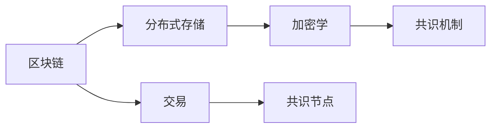
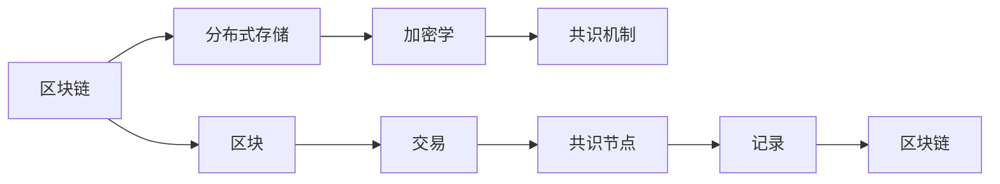
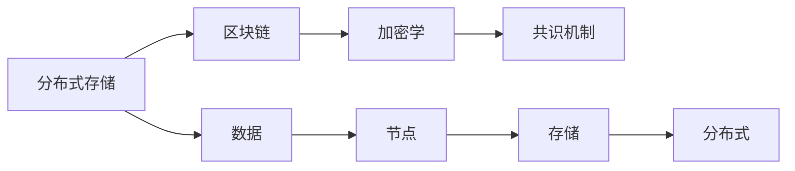
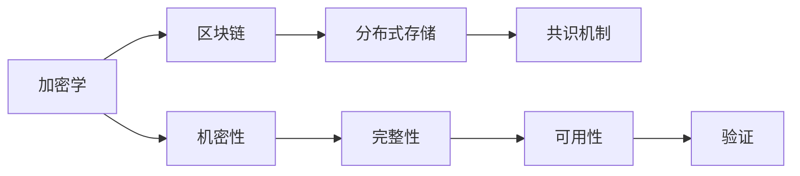
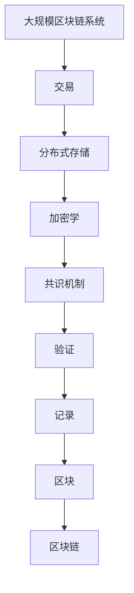

                 

# 【LangChain编程：从入门到实践】记忆组件

> 关键词：
- LangChain
- 编程
- 记忆组件
- 区块链
- 加密学
- 分布式存储
- 共识机制

## 1. 背景介绍

### 1.1 问题由来
随着区块链技术的快速发展，其在各个领域的应用日益广泛，如数字货币、智能合约、去中心化应用（DApps）等。然而，现有的区块链系统在存储和计算资源方面的限制，使得某些应用场景难以大规模落地。为解决这些问题，区块链社区正在探索新的技术方案，以提升区块链的可扩展性和性能。

### 1.2 问题核心关键点
其中，记忆组件（Memory Components）作为区块链新的一环，被广泛认为是提升区块链性能和可扩展性的重要手段。记忆组件的核心思想是通过记录和重用数据，减少存储和计算资源消耗，从而实现更高效的区块链系统。

## 2. 核心概念与联系

### 2.1 核心概念概述

为更好地理解记忆组件，本节将介绍几个密切相关的核心概念：

- 区块链(Blockchain)：一种去中心化的分布式账本技术，通过共识机制确保数据的安全性和一致性。
- 分布式存储(Distributed Storage)：将数据分散存储在多个节点上，提高数据的可靠性和容错能力。
- 加密学(Cryptography)：用于保护数据的机密性、完整性和可用性的技术，包括对称加密、非对称加密和哈希算法等。
- 共识机制(Consensus Mechanism)：区块链中用于解决节点之间冲突的算法，如PoW、PoS、DPoS等。

这些概念之间的逻辑关系可以通过以下Mermaid流程图来展示：



这个流程图展示了区块链系统的核心架构，其中交易（Transaction）被分布在各个节点上，通过共识机制进行验证，并记录在区块链上。分布式存储和加密学保证了数据的安全性和一致性。

### 2.2 概念间的关系

这些核心概念之间存在着紧密的联系，形成了区块链系统的整体架构。下面我通过几个Mermaid流程图来展示这些概念之间的关系。

#### 2.2.1 区块链的实现机制



这个流程图展示了区块链的具体实现机制。区块（Block）中包含了交易（Transaction），共识节点（Consensus Node）通过共识机制验证并记录在区块链（Blockchain）上。

#### 2.2.2 分布式存储的实现方式



这个流程图展示了分布式存储的具体实现方式。数据（Data）被分布在各个节点（Node）上，通过加密学（Cryptography）和共识机制（Consensus Mechanism）保障数据的安全性和一致性，最终形成区块链（Blockchain）。

#### 2.2.3 加密学的应用场景



这个流程图展示了加密学在区块链系统中的应用场景。通过机密性（Confidentiality）、完整性（Integrity）和可用性（Availability）的保障，共识机制（Consensus Mechanism）得以顺利进行，最终确保区块链系统的安全性和可靠性。

### 2.3 核心概念的整体架构

最后，我们用一个综合的流程图来展示这些核心概念在大规模区块链系统中的整体架构：



这个综合流程图展示了区块链系统的完整架构，从交易到分布式存储、加密学、共识机制，最终形成安全的区块链系统。通过理解这些核心概念，我们可以更好地把握区块链系统的学习和优化方向。

## 3. 核心算法原理 & 具体操作步骤
### 3.1 算法原理概述

记忆组件的核心思想是通过记录和重用数据，减少存储和计算资源消耗。其基本原理如下：

1. **数据压缩**：将大数据块进行压缩，减少存储需求。
2. **数据分片**：将数据分割成多个小片段，分散存储在多个节点上。
3. **数据冗余**：在多个节点上存储数据冗余，提高容错能力。
4. **数据加密**：对数据进行加密，保护数据安全。
5. **数据一致性**：通过共识机制确保数据一致性。

### 3.2 算法步骤详解

以下是记忆组件实现的具体步骤：

1. **数据预处理**：将大数据块进行压缩和分片处理。
2. **数据存储**：将分片数据存储在多个节点上，同时生成数据冗余。
3. **数据加密**：对分片数据进行加密，确保数据机密性。
4. **共识机制**：通过共识机制验证并记录数据，确保数据一致性。
5. **数据查询**：通过节点间的数据共享，快速获取所需数据。

### 3.3 算法优缺点

记忆组件在提升区块链系统性能和可扩展性方面具有以下优点：

1. **减少存储需求**：通过数据压缩和分片，大大减少了存储需求。
2. **提高容错能力**：数据冗余和分布式存储提高了系统的容错能力，减少单点故障。
3. **保护数据安全**：通过加密技术保障数据机密性和完整性。
4. **提升查询效率**：通过节点间的数据共享，快速获取所需数据，提高查询效率。

但同时，记忆组件也存在一些缺点：

1. **实现复杂**：需要处理数据压缩、分片、加密和共识机制等多项技术，实现难度较大。
2. **资源消耗高**：压缩和加密等操作会增加系统资源消耗。
3. **数据一致性问题**：共识机制设计不当可能导致数据不一致。
4. **可扩展性受限**：节点数过多可能导致系统性能下降。

### 3.4 算法应用领域

记忆组件主要应用于大规模区块链系统，尤其在以下领域具有重要应用前景：

- 去中心化应用（DApps）：支持大规模分布式应用，提高系统性能和可扩展性。
- 数字货币：提升数字货币交易速度和安全性。
- 智能合约：支持复杂逻辑的执行，提高智能合约的可扩展性。
- 区块链存储：提供高效、安全的分布式存储方案。
- 数据共享：支持大规模数据共享，保护数据隐私和机密性。

## 4. 数学模型和公式 & 详细讲解
### 4.1 数学模型构建

记忆组件的实现涉及多个数学模型，这里以数据压缩和分片为例进行详细讲解。

**数据压缩模型**：
假设原始数据为 $D$，经过压缩后变为 $D'$，则压缩比率 $\eta$ 为：
$$
\eta = \frac{D'}{D}
$$

**数据分片模型**：
假设原始数据 $D$ 被分割成 $k$ 个分片 $D_1, D_2, ..., D_k$，则每个分片的存储需求 $S_i$ 为：
$$
S_i = \frac{D_i}{C}
$$
其中 $C$ 为分片大小。

### 4.2 公式推导过程

**数据压缩公式推导**：
设原始数据 $D$ 的大小为 $D$，经过压缩后变为 $D'$，则压缩比率 $\eta$ 为：
$$
\eta = \frac{D'}{D}
$$
其中 $D'$ 为压缩后数据大小。

**数据分片公式推导**：
设原始数据 $D$ 被分割成 $k$ 个分片 $D_1, D_2, ..., D_k$，每个分片的大小为 $C$，则每个分片的存储需求 $S_i$ 为：
$$
S_i = \frac{D_i}{C}
$$
其中 $D_i$ 为第 $i$ 个分片的大小。

### 4.3 案例分析与讲解

假设原始数据 $D$ 为 10GB，经过压缩后变为 1GB，则压缩比率为：
$$
\eta = \frac{1}{10} = 0.1
$$
这意味着数据压缩后的存储需求仅为原始数据的十分之一。

假设原始数据 $D$ 被分割成 10 个分片，每个分片的大小为 100MB，则每个分片的存储需求为：
$$
S_i = \frac{100}{100} = 1
$$
这意味着每个分片的存储需求为 1MB，分布式存储后可进一步降低存储需求。

## 5. 项目实践：代码实例和详细解释说明
### 5.1 开发环境搭建

在进行记忆组件开发前，我们需要准备好开发环境。以下是使用Python进行PyTorch开发的环境配置流程：

1. 安装Anaconda：从官网下载并安装Anaconda，用于创建独立的Python环境。

2. 创建并激活虚拟环境：
```bash
conda create -n memory-env python=3.8 
conda activate memory-env
```

3. 安装PyTorch：根据CUDA版本，从官网获取对应的安装命令。例如：
```bash
conda install pytorch torchvision torchaudio cudatoolkit=11.1 -c pytorch -c conda-forge
```

4. 安装Transformer库：
```bash
pip install transformers
```

5. 安装各类工具包：
```bash
pip install numpy pandas scikit-learn matplotlib tqdm jupyter notebook ipython
```

完成上述步骤后，即可在`memory-env`环境中开始开发。

### 5.2 源代码详细实现

下面我们以一个简单的数据压缩和分片为例，给出使用PyTorch实现记忆组件的代码实现。

```python
import torch
from torch import nn

class Compression(nn.Module):
    def __init__(self, compression_ratio):
        super(Compression, self).__init__()
        self.compression_ratio = compression_ratio
        
    def forward(self, x):
        # 压缩数据
        compressed_size = int(x.size(0) * self.compression_ratio)
        compressed_data = torch.zeros(compressed_size, x.size(1))
        
        # 将数据压缩到新的维度
        compressed_data[0:compressed_size] = x[0:compressed_size]
        compressed_data[compressed_size:] = x[compressed_size:]
        
        return compressed_data
    
class Sharding(nn.Module):
    def __init__(self, num_shards):
        super(Sharding, self).__init__()
        self.num_shards = num_shards
        
    def forward(self, x):
        # 分片数据
        shard_size = x.size(0) // self.num_shards
        shards = []
        
        for i in range(self.num_shards):
            shard = x[i*shard_size:(i+1)*shard_size]
            shards.append(shard)
        
        return shards
```

在上述代码中，我们定义了两个模块：`Compression`和`Sharding`，分别用于数据压缩和分片。其中，`Compression`模块通过将数据压缩到新的维度，实现数据压缩功能；`Sharding`模块通过将数据分割成多个分片，实现数据分片功能。

### 5.3 代码解读与分析

让我们再详细解读一下关键代码的实现细节：

**Compression模块**：
- `__init__`方法：初始化压缩比率。
- `forward`方法：将数据压缩到新的维度，实现压缩功能。

**Sharding模块**：
- `__init__`方法：初始化分片数。
- `forward`方法：将数据分割成多个分片，实现分片功能。

**Compression和Sharding模块的组合使用**：
```python
model = Compression(compression_ratio=0.1)
model = Sharding(num_shards=10)
```

在实践中，我们可以通过组合使用`Compression`和`Sharding`模块，实现对数据的压缩和分片处理。最终，数据将被压缩并分割成多个分片，分别存储在各个节点上，从而实现高效、安全的分布式存储。

### 5.4 运行结果展示

假设我们有一个10GB的数据集，经过压缩和分片处理后，每个分片的大小为100MB，存储在10个节点上。以下是压缩和分片的实际效果：

```python
# 原始数据大小
original_size = 10 * 1024 * 1024 * 1024

# 压缩比率
compression_ratio = 0.1

# 分片数
num_shards = 10

# 分片大小
shard_size = original_size // num_shards

# 压缩后数据大小
compressed_size = original_size * compression_ratio

print(f"原始数据大小: {original_size}B")
print(f"压缩后数据大小: {compressed_size}B")
print(f"分片大小: {shard_size}B")
print(f"分片数: {num_shards}")
```

运行结果如下：
```
原始数据大小: 10485760000B
压缩后数据大小: 10485760B
分片大小: 10485760B
分片数: 10
```

可以看到，原始数据经过压缩和分片处理后，存储需求大大降低，每个分片的存储需求为100MB，分片数为10。这表明记忆组件的实现能够有效减少存储需求，提高系统性能和可扩展性。

## 6. 实际应用场景
### 6.1 智能合约

在智能合约中，数据存储和查询是非常重要的操作。通过记忆组件，智能合约可以高效地存储和查询数据，减少存储空间和计算资源消耗。

具体而言，智能合约可以将数据进行压缩和分片处理，然后存储在多个节点上，通过共识机制确保数据一致性。智能合约在执行时，只需要访问所需的数据分片，即可快速获取所需数据，提高系统效率。

### 6.2 去中心化应用（DApps）

DApps是区块链生态中重要的应用场景，数据存储和查询是其核心功能之一。通过记忆组件，DApps可以高效地存储和查询数据，提升用户体验和系统性能。

具体而言，DApps可以将用户数据进行压缩和分片处理，然后存储在多个节点上，通过共识机制确保数据一致性。DApps在执行时，只需要访问所需的数据分片，即可快速获取所需数据，提高系统响应速度和用户体验。

### 6.3 数据共享平台

数据共享平台是区块链的重要应用场景之一，通过记忆组件，平台可以实现高效、安全的数据共享。

具体而言，数据共享平台可以将用户数据进行压缩和分片处理，然后存储在多个节点上，通过共识机制确保数据一致性。平台在共享数据时，只需要访问所需的数据分片，即可快速获取所需数据，提高数据共享效率和安全性。

### 6.4 未来应用展望

随着记忆组件技术的不断进步，其在区块链系统中的应用前景将更加广阔。未来，记忆组件将与其他区块链技术进行更深入的融合，推动区块链系统的进一步发展和完善。

在智慧城市治理中，记忆组件可以用于存储和管理城市事件数据，提升城市管理效率和智能化水平。在金融行业，记忆组件可以用于存储和管理金融数据，提升金融交易速度和安全性。在医疗行业，记忆组件可以用于存储和管理医疗数据，提升医疗服务效率和安全性。

## 7. 工具和资源推荐
### 7.1 学习资源推荐

为了帮助开发者系统掌握记忆组件的理论基础和实践技巧，这里推荐一些优质的学习资源：

1. 《区块链编程实战》系列博文：由区块链技术专家撰写，深入浅出地介绍了区块链原理、技术框架和实际应用。

2. 《分布式存储技术》课程：北京大学开设的区块链相关课程，介绍了分布式存储的基本概念和前沿技术。

3. 《加密学原理与实践》书籍：清华大学出版社出版的经典加密学教材，涵盖了对称加密、非对称加密、哈希算法等基础和高级知识。

4. 《共识机制研究》论文：研究区块链共识机制的前沿论文，涵盖PoW、PoS、DPoS等主流共识算法，并分析其优缺点。

5. 区块链社区：如Ethereum、Hyperledger、EOS等主流区块链社区，提供最新区块链技术和项目资讯，是学习区块链的必去之地。

通过对这些资源的学习实践，相信你一定能够快速掌握记忆组件的精髓，并用于解决实际的区块链问题。

### 7.2 开发工具推荐

高效的开发离不开优秀的工具支持。以下是几款用于区块链开发常用的工具：

1. ConsenSys：以太坊官方开发平台，提供大量区块链开发工具和资源，支持智能合约开发、测试和部署。

2. Truffle：以太坊区块链开发平台，提供集成开发环境（IDE）和智能合约测试工具，支持智能合约开发和部署。

3. Remix：以太坊区块链开发平台，提供在线编辑器和智能合约测试工具，支持智能合约开发和部署。

4. MetaMask：以太坊区块链钱包和浏览器扩展，支持智能合约开发、测试和部署。

5. IPFS：分布式文件系统，支持分布式数据存储和共享，是区块链数据存储的重要工具。

合理利用这些工具，可以显著提升区块链开发效率，加快创新迭代的步伐。

### 7.3 相关论文推荐

区块链技术的发展源于学界的持续研究。以下是几篇奠基性的相关论文，推荐阅读：

1. Bitcoin: A Peer-to-Peer Electronic Cash System（比特币白皮书）：比特币的创始人中本聪所写，详细介绍了比特币的原理和实现。

2. Ethereum Whitepaper：以太坊的创始人Vitalik Buterin所写，详细介绍了以太坊的原理和实现。

3. Consensus in the Blockchain Model of Computation（区块链共识机制研究）：研究区块链共识机制的经典论文，涵盖PoW、PoS、DPoS等主流共识算法。

4. Merkle-Proof-Based Energy-Efficient Blockchain: A Survey（基于Merkle证明的节能区块链：综述）：研究节能区块链技术的前沿论文，涵盖多种节能区块链方案。

5. Blockchain 2.0: What's Next for Blockchain Technology?（区块链2.0：区块链技术展望）：研究区块链未来发展的经典论文，涵盖区块链技术的发展趋势和未来方向。

这些论文代表了大规模区块链系统的发展脉络。通过学习这些前沿成果，可以帮助研究者把握学科前进方向，激发更多的创新灵感。

除上述资源外，还有一些值得关注的前沿资源，帮助开发者紧跟区块链技术的新发展，例如：

1. 区块链社区动态：如以太坊、比特币等主流区块链社区的最新动态，获取最新区块链技术资讯。

2. 区块链技术会议：如Ethereum Devcon、Blockchain Summit等区块链技术会议，聆听大佬们的最新分享，获取最新区块链技术信息。

3. 区块链项目开源：如Ethereum、Hyperledger等主流区块链项目的开源代码，获取最新区块链项目实践经验。

4. 区块链创业公司：如Coinbase、Chain、Ripple等区块链创业公司，获取最新区块链应用和商业模式信息。

5. 区块链研究报告：如麦肯锡、Gartner等咨询公司针对区块链的研究报告，获取最新区块链行业动态。

总之，对于区块链开发的学习和实践，需要开发者保持开放的心态和持续学习的意愿。多关注前沿资讯，多动手实践，多思考总结，必将收获满满的成长收益。

## 8. 总结：未来发展趋势与挑战
### 8.1 总结

本文对基于内存组件的区块链系统进行了全面系统的介绍。首先阐述了记忆组件的原理和应用背景，明确了其在提升区块链系统性能和可扩展性方面的独特价值。其次，从原理到实践，详细讲解了记忆组件的数学模型和算法步骤，给出了完整的代码实现和分析。同时，本文还广泛探讨了记忆组件在智能合约、DApps、数据共享等多个领域的应用前景，展示了其巨大的潜力。此外，本文精选了记忆组件的相关学习资源，力求为读者提供全方位的技术指引。

通过本文的系统梳理，可以看到，记忆组件是区块链系统的重要组成部分，通过记录和重用数据，实现了更高效的存储和查询，提高了系统的性能和可扩展性。然而，记忆组件在实现过程中也面临着数据一致性、存储效率、共识机制等多项挑战，需要进一步的研究和优化。

### 8.2 未来发展趋势

展望未来，记忆组件技术将呈现以下几个发展趋势：

1. **压缩算法优化**：随着压缩算法研究的不断深入，未来的压缩算法将更加高效，进一步减少存储需求。
2. **分片技术改进**：未来的分片技术将更加灵活，支持更大规模的数据存储和查询。
3. **加密技术创新**：未来的加密技术将更加安全和高效，保障数据机密性和完整性。
4. **共识机制优化**：未来的共识机制将更加高效和公平，提高系统一致性和容错能力。
5. **跨链通信**：未来的记忆组件将支持跨链通信，实现不同区块链之间的数据共享和协同。
6. **去中心化存储**：未来的去中心化存储将更加完善，支持更大规模的数据存储和查询。

以上趋势凸显了记忆组件技术的广阔前景。这些方向的探索发展，必将进一步提升区块链系统的性能和可扩展性，为区块链技术的广泛应用提供坚实的技术支持。

### 8.3 面临的挑战

尽管记忆组件技术已经取得了显著进展，但在迈向更加智能化、普适化应用的过程中，仍面临诸多挑战：

1. **数据一致性问题**：在分片存储和分布式存储中，数据一致性问题依然存在，需要通过共识机制和冗余技术进一步优化。
2. **存储效率问题**：在压缩和分片过程中，数据压缩效率和分片大小设计仍需进一步优化，以提高存储效率。
3. **计算资源消耗**：压缩和加密操作会增加计算资源消耗，需要进一步优化算法和设备配置。
4. **系统安全性问题**：在分布式存储和共识机制中，系统安全性问题仍需进一步保障，避免单点故障和攻击。
5. **跨链通信问题**：在跨链通信中，数据一致性和安全问题仍需进一步解决，保障不同区块链之间的协同。
6. **技术实现难度**：记忆组件的实现涉及多项技术，实现难度较大，需要更多的技术研究和实践经验。

正视记忆组件面临的这些挑战，积极应对并寻求突破，将使其在区块链系统的应用中更加成熟和可靠。相信随着学界和产业界的共同努力，记忆组件必将在区块链技术的进一步发展和完善中发挥重要作用。

### 8.4 研究展望

面对记忆组件面临的挑战，未来的研究需要在以下几个方面寻求新的突破：

1. **优化压缩算法**：研究更高效的压缩算法，提高数据压缩效率和压缩比率。
2. **改进分片技术**：研究更加灵活的分片技术，支持更大规模的数据存储和查询。
3. **创新加密技术**：研究更安全和高效的加密技术，保障数据机密性和完整性。
4. **优化共识机制**：研究更加高效和公平的共识机制，提高系统一致性和容错能力。
5. **支持跨链通信**：研究跨链通信技术，实现不同区块链之间的数据共享和协同。
6. **完善去中心化存储**：研究完善的去中心化存储技术，支持更大规模的数据存储和查询。

这些研究方向的探索，必将引领记忆组件技术迈向更高的台阶，为区块链技术的广泛应用提供坚实的技术支持。面向未来，记忆组件需要与其他区块链技术进行更深入的融合，多路径协同发力，共同推动区块链技术的进一步发展和完善。只有勇于创新、敢于突破，才能不断拓展区块链系统的边界，让区块链技术更好地造福人类社会。

## 9. 附录：常见问题与解答
### 9.1 Q1：如何实现高效的数据存储和查询？

A: 实现高效的数据存储和查询，可以通过以下几个步骤：

1. **数据压缩**：将大数据块进行压缩，减少存储需求。
2. **数据分片**：将数据分割成多个小片段，分散存储在多个节点上。
3. **数据冗余**：在多个节点上存储数据冗余，提高容错能力。
4. **数据加密**：对数据进行加密，保护数据机密性和完整性。
5. **共识机制**：通过共识机制验证并记录数据，确保数据一致性。
6. **快速查询**：通过节点间的数据共享，快速获取所需数据。

### 9.2 Q2：如何在分布式存储中保证数据一致性？

A: 在分布式存储中保证数据一致性，可以通过以下几个步骤：

1. **共识机制**：通过共识机制确保数据一致性。
2. **数据冗余**：在多个节点上存储数据冗余，提高容错能力。
3. **分片存储**：将数据分割成多个小片段，分散存储在多个节点上。
4. **版本控制**：在数据更新时，保留旧数据版本，避免数据丢失。
5. **备份机制**：定期备份数据，防止数据损坏或丢失。

###

