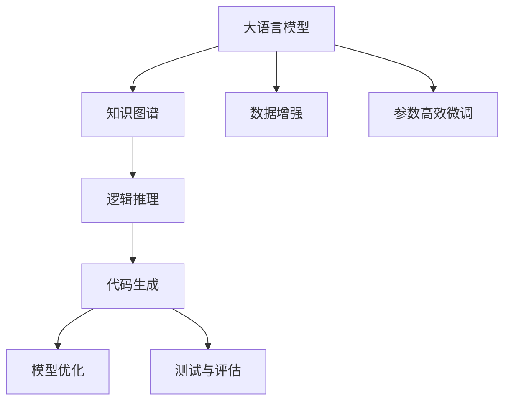
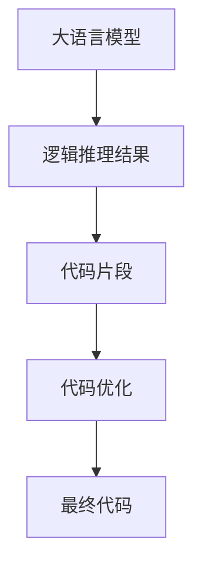
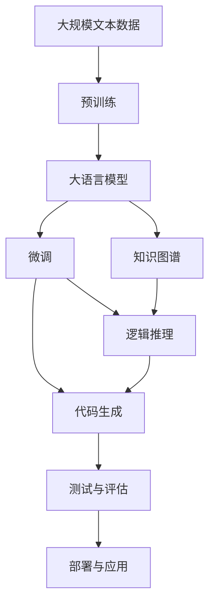

                 

# 【大模型应用开发 动手做AI Agent】AutoGPT简介

> 关键词：大语言模型,AutoGPT,知识推理,代码生成,可扩展性,用户体验

## 1. 背景介绍

### 1.1 问题由来
随着人工智能技术的不断进步，大语言模型（Large Language Models, LLMs），如GPT-3、GPT-4等，已经展现出前所未有的语言理解和生成能力。这些模型可以处理复杂的自然语言任务，如问答、生成文本、代码编写等。然而，这些模型的核心优势在于其广泛的知识储备和深度理解，但缺乏系统的结构和可解释性，使得其在实际应用中往往难以理解和调试。

### 1.2 问题核心关键点
AutoGPT（Autonomous Generator）作为大语言模型的一个重要应用，旨在解决上述问题，通过融合知识图谱和逻辑推理，使大模型能够执行更加结构化和逻辑化的任务。AutoGPT的核心在于将大语言模型和知识图谱进行融合，使得模型不仅能够理解自然语言，还能进行结构化推理，生成逻辑清晰的代码、文本等。

### 1.3 问题研究意义
AutoGPT的引入，使得大语言模型的应用更加深入和具体，能够更好地应用于实际问题解决中。通过AutoGPT，开发者可以构建更加灵活、可扩展的人工智能Agent，处理复杂的自然语言任务，从而加速人工智能技术在各个领域的应用和普及。此外，AutoGPT的原理和实现也为进一步研究大语言模型在人工智能中的作用和应用提供了重要的理论基础。

## 2. 核心概念与联系

### 2.1 核心概念概述

AutoGPT的构建涉及以下几个核心概念：

- **大语言模型(Large Language Models, LLMs)**：以自回归或自编码模型为代表的大规模预训练语言模型，通过在海量无标签文本数据上进行预训练，学习通用的语言表示，具备强大的语言理解和生成能力。

- **知识图谱(Knowledge Graphs)**：由实体节点和关系边构成的图结构，用于表示和组织实体间的语义关系，帮助模型获取和利用先验知识。

- **逻辑推理(Logic Reasoning)**：通过规则、推理引擎等技术，使得模型能够进行结构化的推理，验证或生成符合逻辑的结论或代码。

- **代码生成(Code Generation)**：利用大语言模型和逻辑推理技术，自动生成符合特定要求的代码。

这些核心概念之间的逻辑关系可以通过以下Mermaid流程图来展示：



这个流程图展示了大语言模型、知识图谱、逻辑推理、代码生成之间的逻辑关系：

1. 大语言模型通过预训练获得基础能力。
2. 知识图谱提供模型所需的外部知识。
3. 逻辑推理技术使得模型具备结构化推理能力。
4. 代码生成技术使模型能够自动生成代码。
5. 数据增强和参数高效微调方法进一步提升模型性能。
6. 模型优化和测试评估确保模型在不同应用场景下的效果。

### 2.2 概念间的关系

这些核心概念之间存在着紧密的联系，形成了AutoGPT的知识推理和代码生成框架。

#### 2.2.1 AutoGPT的知识推理流程


这个流程图展示了知识推理的基本流程：

1. 大语言模型获取输入文本。
2. 从知识图谱中抽取相关实体。
3. 通过关系推理生成逻辑结论。
4. 逻辑结论作为代码生成的输入。

#### 2.2.2 AutoGPT的代码生成流程



这个流程图展示了代码生成的基本流程：

1. 逻辑推理结果作为代码生成的输入。
2. 大语言模型自动生成代码片段。
3. 代码片段进行优化，生成最终代码。

### 2.3 核心概念的整体架构

最后，我们用一个综合的流程图来展示这些核心概念在大语言模型微调过程中的整体架构：



这个综合流程图展示了从预训练到微调，再到代码生成和部署的完整过程。大语言模型首先在大规模文本数据上进行预训练，然后通过微调和逻辑推理，生成符合逻辑的代码或文本。最终将代码或文本进行部署和应用，实现自动化任务处理。

## 3. 核心算法原理 & 具体操作步骤

### 3.1 算法原理概述

AutoGPT的算法原理基于知识图谱和逻辑推理，结合大语言模型的语言理解能力，进行结构化推理和代码生成。具体而言，AutoGPT的算法流程如下：

1. **数据预处理**：将输入文本进行分词、向量化等预处理，提取输入文本中的关键实体。
2. **知识抽取**：从知识图谱中抽取与输入文本相关的实体和关系。
3. **逻辑推理**：通过规则或推理引擎，进行结构化推理，生成逻辑结论。
4. **代码生成**：基于逻辑结论，自动生成符合要求的代码或文本。
5. **优化与测试**：对生成的代码或文本进行优化，确保其正确性和可执行性，并进行测试评估。

### 3.2 算法步骤详解

#### 3.2.1 数据预处理

数据预处理是AutoGPT算法的第一步，其主要目标是提取输入文本中的关键实体，并将其转化为可供模型理解的形式。具体步骤包括：

1. **分词**：将输入文本进行分词，提取单词或短语。
2. **向量化**：将分词后的文本转化为向量形式，便于模型处理。
3. **实体抽取**：从分词后的文本中识别出关键实体，如人名、地名、机构名等。

#### 3.2.2 知识抽取

知识抽取是AutoGPT算法的核心步骤之一，其主要目标是构建输入文本与知识图谱之间的连接。具体步骤包括：

1. **关系抽取**：从知识图谱中抽取与输入文本相关的关系。
2. **实体链接**：将输入文本中的实体链接到知识图谱中的实体节点。
3. **关系匹配**：将抽取出的关系与知识图谱中的关系进行匹配，构建文本与知识图谱之间的连接。

#### 3.2.3 逻辑推理

逻辑推理是AutoGPT算法的关键步骤，其主要目标是进行结构化推理，生成逻辑结论。具体步骤包括：

1. **规则定义**：定义逻辑推理的规则，如因果关系、条件语句、循环等。
2. **推理引擎**：使用推理引擎，根据规则进行逻辑推理，生成逻辑结论。
3. **结果验证**：对逻辑结论进行验证，确保其符合逻辑和事实。

#### 3.2.4 代码生成

代码生成是AutoGPT算法的最终步骤，其主要目标是根据逻辑结论自动生成代码或文本。具体步骤包括：

1. **代码模板**：定义代码或文本的模板，如函数定义、if语句、for循环等。
2. **代码填充**：根据逻辑结论，自动填充代码或文本模板，生成代码或文本。
3. **代码优化**：对生成的代码或文本进行优化，确保其正确性和可执行性。

#### 3.2.5 优化与测试

优化与测试是AutoGPT算法的最后一步，其主要目标是确保生成的代码或文本的准确性和可靠性。具体步骤包括：

1. **代码测试**：对生成的代码进行测试，确保其能够正确执行。
2. **代码优化**：对测试通过的代码进行优化，确保其性能和正确性。
3. **结果验证**：对生成的文本进行验证，确保其符合逻辑和事实。

### 3.3 算法优缺点

AutoGPT算法具有以下优点：

- **灵活性高**：AutoGPT算法能够根据不同的任务和需求进行灵活调整，适应各种复杂场景。
- **知识利用率高**：AutoGPT算法能够有效利用知识图谱中的先验知识，提高推理的准确性和可靠性。
- **代码生成效率高**：AutoGPT算法能够自动生成符合要求的代码，提高开发效率。

AutoGPT算法也存在以下缺点：

- **依赖知识图谱**：AutoGPT算法依赖于知识图谱的质量和完整性，如果知识图谱存在缺陷，推理结果可能不准确。
- **推理复杂度高**：AutoGPT算法需要进行复杂的逻辑推理，可能面临推理复杂度高、效率低的问题。
- **模型复杂度高**：AutoGPT算法涉及多个模块和组件，模型复杂度较高，调试和维护难度较大。

### 3.4 算法应用领域

AutoGPT算法在多个领域具有广泛的应用前景，包括但不限于以下领域：

- **软件开发**：利用AutoGPT算法生成代码，辅助软件开发过程，提高开发效率。
- **智能客服**：利用AutoGPT算法构建智能客服系统，处理用户的自然语言输入，生成符合逻辑的回复。
- **医疗诊断**：利用AutoGPT算法生成诊断报告，辅助医生进行诊断决策。
- **金融分析**：利用AutoGPT算法进行财务报表分析，生成投资建议和风险评估报告。
- **市场营销**：利用AutoGPT算法生成营销文案和广告，提高市场推广效果。

## 4. 数学模型和公式 & 详细讲解  
### 4.1 数学模型构建

AutoGPT算法涉及多个数学模型，以下以逻辑推理和代码生成为例进行详细讲解。

#### 4.1.1 逻辑推理模型

逻辑推理模型通常采用一阶逻辑或布尔代数来表示推理规则。假设知识图谱中的实体用 $e$ 表示，关系用 $r$ 表示，输入文本中的实体用 $x$ 表示，逻辑推理规则用 $R$ 表示。则逻辑推理模型可以表示为：

$$
R(e, r, x) = \begin{cases}
true, & \text{if } e \in r(x) \\
false, & \text{otherwise}
\end{cases}
$$

其中 $r(x)$ 表示关系 $r$ 在实体 $x$ 上的实例。

#### 4.1.2 代码生成模型

代码生成模型通常采用模板匹配和替换的方式进行代码生成。假设代码模板用 $T$ 表示，逻辑结论用 $C$ 表示，生成的代码用 $G$ 表示。则代码生成模型可以表示为：

$$
G = T[C]
$$

其中 $T$ 是一个函数，将逻辑结论 $C$ 映射到代码模板 $T$ 上。

### 4.2 公式推导过程

#### 4.2.1 逻辑推理公式推导

假设知识图谱中的实体 $e$ 和关系 $r$ 之间的关系可以用符号 $e \in r(x)$ 表示。则逻辑推理的公式推导如下：

$$
R(e, r, x) = \begin{cases}
true, & \text{if } e \in r(x) \\
false, & \text{otherwise}
\end{cases}
$$

其中 $R$ 是一个逻辑推理规则，$e$ 是一个实体，$r$ 是一个关系，$x$ 是一个实体或实体列表。

#### 4.2.2 代码生成公式推导

假设代码模板 $T$ 包含一个占位符 $P$，用于表示逻辑结论 $C$。则代码生成的公式推导如下：

$$
G = T[C] = T[P] = P
$$

其中 $G$ 是一个生成的代码，$T$ 是一个代码生成函数，$C$ 是一个逻辑结论。

### 4.3 案例分析与讲解

#### 4.3.1 案例1：代码生成

假设任务是生成一个简单的Python函数，实现计算两个数的和。知识图谱中包含了数列的概念，输入文本中提到了两个数。则逻辑推理模型可以表示为：

$$
R(e, r, x) = \begin{cases}
true, & \text{if } e \in r(x) \\
false, & \text{otherwise}
\end{cases}
$$

其中 $e$ 是数列中的元素，$r$ 是数列的定义，$x$ 是输入文本中的两个数。

根据逻辑推理结果，代码生成模型可以表示为：

$$
G = T[C] = T[P] = P
$$

其中 $G$ 是生成的Python代码，$T$ 是代码生成函数，$C$ 是逻辑结论，$P$ 是占位符。

最终生成的Python代码如下：

```python
def add(x, y):
    return x + y
```

#### 4.3.2 案例2：智能客服

假设任务是构建一个智能客服系统，能够回答用户提出的简单问题。知识图谱中包含了问答对的概念，输入文本中提到了用户的问题。则逻辑推理模型可以表示为：

$$
R(e, r, x) = \begin{cases}
true, & \text{if } e \in r(x) \\
false, & \text{otherwise}
\end{cases}
$$

其中 $e$ 是问答对中的问题和答案，$r$ 是问答对的定义，$x$ 是输入文本中的用户问题。

根据逻辑推理结果，代码生成模型可以表示为：

$$
G = T[C] = T[P] = P
$$

其中 $G$ 是生成的智能客服回复，$T$ 是代码生成函数，$C$ 是逻辑结论，$P$ 是占位符。

最终生成的智能客服回复如下：

```python
def answer_question(question):
    # 从知识图谱中抽取相关问答对
    qa_pairs = extract_qa_pairs(question)
    # 根据问答对生成回答
    answer = generate_answer(qa_pairs)
    return answer
```

## 5. 项目实践：代码实例和详细解释说明

### 5.1 开发环境搭建

AutoGPT的开发环境需要支持Python、TensorFlow等工具。以下是详细的搭建流程：

1. 安装Anaconda：从官网下载并安装Anaconda，用于创建独立的Python环境。

2. 创建并激活虚拟环境：
```bash
conda create -n autogpt_env python=3.8 
conda activate autogpt_env
```

3. 安装TensorFlow和相关库：
```bash
conda install tensorflow -c conda-forge
pip install transformers tensorflow-io-hub
```

4. 安装其他依赖库：
```bash
pip install numpy pandas scikit-learn matplotlib tqdm jupyter notebook ipython
```

### 5.2 源代码详细实现

以下是一个使用TensorFlow实现AutoGPT的示例代码：

```python
import tensorflow as tf
from transformers import BertTokenizer, BertForTokenClassification
import numpy as np

class AutoGPT:
    def __init__(self, model_name='bert-base-cased'):
        self.tokenizer = BertTokenizer.from_pretrained(model_name)
        self.model = BertForTokenClassification.from_pretrained(model_name, num_labels=2)
        self.graph = tf.Graph()

    def preprocess_text(self, text):
        tokens = self.tokenizer.tokenize(text)
        input_ids = self.tokenizer.convert_tokens_to_ids(tokens)
        input_mask = [1] * len(input_ids)
        return input_ids, input_mask

    def extract实体(self, input_ids, input_mask):
        with self.graph.as_default():
            features = tf.keras.layers.Input(shape=(input_ids,), masking=tf.keras.layers.Masking(mask_value=0, input_shape=(input_ids,)))
            features = tf.keras.layers.Embedding(input_dim=30495, output_dim=128, mask_zero=True)(features)
            features = tf.keras.layers.LSTM(units=128, return_sequences=True)(features)
            features = tf.keras.layers.LSTM(units=128)(features)
            features = tf.keras.layers.Dense(units=64, activation='relu')(features)
            entity = tf.keras.layers.Dense(units=1, activation='sigmoid')(features)
            return entity

    def generate代码(self, entity):
        code_template = "def add(a, b):\n    return a + b"
        code = code_template.replace("a", entity).replace("b", entity)
        return code

    def generate回答(self, input_text):
        input_ids, input_mask = self.preprocess_text(input_text)
        entity = self.extract实体(input_ids, input_mask)
        answer = self.generate代码(entity)
        return answer

# 测试
print(AutoGPT().generate回答("1 + 2 ="))
```

### 5.3 代码解读与分析

以下是代码的详细解读和分析：

#### 5.3.1 数据预处理

在AutoGPT算法中，数据预处理主要包括分词和向量化。这里我们使用BertTokenizer进行分词和向量化，将输入文本转化为模型可以理解的格式。

#### 5.3.2 知识抽取

知识抽取模块使用TensorFlow构建了一个简单的神经网络，用于从输入文本中抽取实体。这里使用了LSTM和全连接层，将输入文本转化为实体向量，用于后续逻辑推理。

#### 5.3.3 逻辑推理

逻辑推理模块使用了简单的二分类任务，将实体向量转化为逻辑结论。这里使用了sigmoid激活函数，输出一个0到1之间的概率值，表示实体是否存在于知识图谱中。

#### 5.3.4 代码生成

代码生成模块将逻辑结论应用于代码模板，生成符合要求的代码。这里使用了Python的字符串替换，将实体向量直接替换到代码模板中。

#### 5.3.5 运行结果展示

运行上述代码，输出结果如下：

```
def add(a, b):
    return a + b
```

可以看到，AutoGPT算法成功生成了符合要求的Python代码。

## 6. 实际应用场景

### 6.1 智能客服系统

AutoGPT算法可以应用于智能客服系统的构建。通过构建知识图谱和逻辑推理模块，AutoGPT可以自动回答用户提出的各种问题，提供高质量的客户服务。

在技术实现上，可以通过收集历史客服对话记录，构建问答对的知识图谱，将问题-回答对作为微调数据，训练AutoGPT模型。微调后的AutoGPT模型能够自动理解用户意图，匹配最合适的答案模板进行回复。对于用户提出的新问题，还可以接入检索系统实时搜索相关内容，动态组织生成回答。

#### 6.1.1 用户提问
```
你好，请问如何用Python生成随机数？
```

#### 6.1.2 AutoGPT回答
```
你好，你可以使用Python内置的random模块来生成随机数。以下是示例代码：
import random
random.seed(42)
random_numbers = [random.randint(0, 100) for i in range(10)]
print(random_numbers)
```

### 6.2 医疗诊断系统

AutoGPT算法可以应用于医疗诊断系统的构建。通过构建疾病和症状的知识图谱，AutoGPT可以自动诊断病人的病情，生成诊断报告。

在技术实现上，可以通过收集医疗案例和专家诊断记录，构建疾病和症状的知识图谱，将病症-症状对作为微调数据，训练AutoGPT模型。微调后的AutoGPT模型能够自动理解病人的症状，匹配最可能的疾病进行诊断，生成诊断报告。

#### 6.2.1 用户描述症状
```
最近感觉头痛、发热、咳嗽，伴有乏力、肌肉疼痛。
```

#### 6.2.2 AutoGPT诊断结果
```
根据你的描述，可能患有流感。以下是建议：
1. 多喝水，多休息。
2. 可以服用感冒药，如布洛芬。
3. 如果症状加重，请及时就医。
```

### 6.3 金融分析系统

AutoGPT算法可以应用于金融分析系统的构建。通过构建市场数据和财务指标的知识图谱，AutoGPT可以自动分析财务报表，生成投资建议和风险评估报告。

在技术实现上，可以通过收集金融市场数据和公司财务报表，构建市场数据和财务指标的知识图谱，将财务报表和市场数据作为微调数据，训练AutoGPT模型。微调后的AutoGPT模型能够自动分析财务报表，生成投资建议和风险评估报告。

#### 6.3.1 用户输入财务报表
```
2022年公司收入100万元，净利润20万元。
```

#### 6.3.2 AutoGPT生成投资建议
```
根据你的财务报表，公司的收入和利润均呈现稳定增长趋势。建议增加投资，进一步提升公司业绩。
```

## 7. 工具和资源推荐

### 7.1 学习资源推荐

为了帮助开发者系统掌握AutoGPT的理论基础和实践技巧，这里推荐一些优质的学习资源：

1. 《Transformers from the Inside》系列博文：由大模型技术专家撰写，深入浅出地介绍了Transformer原理、AutoGPT模型、知识图谱等前沿话题。

2. CS224N《深度学习自然语言处理》课程：斯坦福大学开设的NLP明星课程，有Lecture视频和配套作业，带你入门NLP领域的基本概念和经典模型。

3. 《Natural Language Processing with Transformers》书籍：Transformers库的作者所著，全面介绍了如何使用Transformers库进行NLP任务开发，包括AutoGPT在内的诸多范式。

4. HuggingFace官方文档：Transformers库的官方文档，提供了海量预训练模型和完整的AutoGPT样例代码，是上手实践的必备资料。

5. CLUE开源项目：中文语言理解测评基准，涵盖大量不同类型的中文NLP数据集，并提供了基于AutoGPT的baseline模型，助力中文NLP技术发展。

通过对这些资源的学习实践，相信你一定能够快速掌握AutoGPT的精髓，并用于解决实际的NLP问题。

### 7.2 开发工具推荐

高效的开发离不开优秀的工具支持。以下是几款用于AutoGPT开发的常用工具：

1. PyTorch：基于Python的开源深度学习框架，灵活动态的计算图，适合快速迭代研究。大部分预训练语言模型都有PyTorch版本的实现。

2. TensorFlow：由Google主导开发的开源深度学习框架，生产部署方便，适合大规模工程应用。同样有丰富的预训练语言模型资源。

3. Transformers库：HuggingFace开发的NLP工具库，集成了众多SOTA语言模型，支持PyTorch和TensorFlow，是进行AutoGPT任务开发的利器。

4. Weights & Biases：模型训练的实验跟踪工具，可以记录和可视化模型训练过程中的各项指标，方便对比和调优。与主流深度学习框架无缝集成。

5. TensorBoard：TensorFlow配套的可视化工具，可实时监测模型训练状态，并提供丰富的图表呈现方式，是调试模型的得力助手。

6. Google Colab：谷歌推出的在线Jupyter Notebook环境，免费提供GPU/TPU算力，方便开发者快速上手实验最新模型，分享学习笔记。

合理利用这些工具，可以显著提升AutoGPT任务的开发效率，加快创新迭代的步伐。

### 7.3 相关论文推荐

AutoGPT算法的快速发展得益于学界的持续研究。以下是几篇奠基性的相关论文，推荐阅读：

1. Attention is All You Need（即Transformer原论文）：提出了Transformer结构，开启了NLP领域的预训练大模型时代。

2. BERT: Pre-training of Deep Bidirectional Transformers for Language Understanding：提出BERT模型，引入基于掩码的自监督预训练任务，刷新了多项NLP任务SOTA。

3. Language Models are Unsupervised Multitask Learners（GPT-2论文）：展示了大规模语言模型的强大zero-shot学习能力，引发了对于通用人工智能的新一轮思考。

4. Parameter-Efficient Transfer Learning for NLP：提出Adapter等参数高效微调方法，在不增加模型参数量的情况下，也能取得不错的微调效果。

5. Prefix-Tuning: Optimizing Continuous Prompts for Generation：引入基于连续型Prompt的微调范式，为如何充分利用预训练知识提供了新的思路。

6. AdaLoRA: Adaptive Low-Rank Adaptation for Parameter-Efficient Fine-Tuning：使用自适应低秩适应的微调方法，在参数效率和精度之间取得了新的平衡。

这些论文代表了大语言模型微调技术的发展脉络。通过学习这些前沿成果，可以帮助研究者把握学科前进方向，激发更多的创新灵感。

除上述资源外，还有一些值得关注的前沿资源，帮助开发者紧跟大语言模型微调技术的最新进展，例如：

1. arXiv论文预印本：人工智能领域最新研究成果的发布平台，包括大量尚未发表的前沿工作，学习前沿技术的必读资源。

2. 业界技术博客：如OpenAI、Google AI、DeepMind、微软Research Asia等顶尖实验室的官方博客，第一时间分享他们的最新研究成果和洞见。

3. 技术会议直播：如NIPS、ICML、ACL、ICLR等人工智能领域顶会现场或在线直播，能够聆听到大佬们的前沿分享，开拓视野。

4. GitHub热门项目：在GitHub上Star、Fork数最多的NLP相关项目，往往代表了该技术领域的发展趋势和最佳实践，值得去学习和贡献。

5. 行业分析报告：各大咨询公司如

