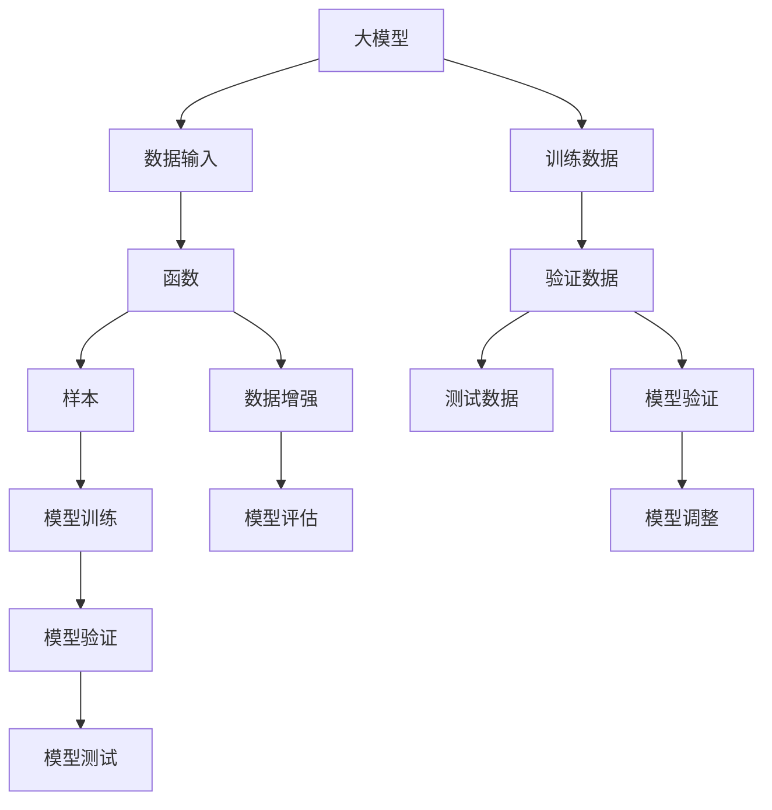

                 

# 【大模型应用开发 动手做AI Agent】Function定义中的Sample是什么

> 关键词：大模型,函数,样本,采样,数据处理,深度学习

## 1. 背景介绍

在深入学习大模型应用开发的实践中，我们常常接触到各种函数和数据处理操作。但有时候会遇到一些新概念，比如“sample”，它究竟是什么？为什么会在大模型开发中如此频繁地出现？本文将探讨函数定义中的“sample”概念，并详细分析其在大模型开发中的重要性。

## 2. 核心概念与联系

### 2.1 核心概念概述

为更好地理解“sample”在大模型开发中的作用，我们将介绍几个关键概念及其相互关系。

#### 2.1.1 大模型

大模型通常指的是深度学习模型中参数量巨大、计算能力强，能够处理大规模数据集并进行复杂任务学习的模型。例如，BERT、GPT等模型因其在大规模无标签数据上进行自监督预训练，具有强大的语言理解和生成能力。

#### 2.1.2 函数

函数是编程语言中的一种基本概念，它代表了一种可重复使用的代码块，接受输入并输出结果。在大模型开发中，函数往往用于数据预处理、模型训练、推理等环节。

#### 2.1.3 样本

在数据处理和机器学习中，样本是指用于训练模型的单个数据实例。对于大模型，样本通常是一段文本、一张图像或一个音频信号。

#### 2.1.4 采样

采样是指从整体数据集中随机抽取样本的过程，常用于数据增强、模型验证、评估等。在大模型中，采样技术能够帮助模型更好地适应新数据，提高泛化能力。

这些概念通过以下Mermaid流程图展示它们的相互关系：



这个流程图展示了从数据输入到模型训练、验证、测试的全过程，其中样本、函数、数据增强等概念扮演了关键角色。

### 2.2 核心概念间的联系

上述概念之间的联系主要体现在以下几个方面：

- 大模型依赖于大量的样本数据进行训练，函数的定义和实现直接影响样本的处理方式。
- 函数对样本进行预处理、增强、随机抽样等操作，有助于提高模型的泛化能力和鲁棒性。
- 数据增强等技术常通过采样实现，从而在保证数据多样性的同时，减少过拟合。
- 验证、测试等环节中，采样是保证模型评估公平性和统计有效性的关键步骤。

这些概念的相互联系，构成了大模型开发的核心技术框架。

## 3. 核心算法原理 & 具体操作步骤

### 3.1 算法原理概述

在深度学习模型中，“sample”通常指单个训练或测试样本。函数通过接受样本作为输入，执行一系列数据预处理、特征提取、模型训练或推理操作。函数定义中的“sample”，则代表这个函数可以接受不同数量和类型的样本，从而处理多样化数据集。

### 3.2 算法步骤详解

以下是大模型开发中常见函数定义的示例及其“sample”的使用：

#### 3.2.1 数据预处理函数

数据预处理函数常用于文本、图像、音频等不同类型的数据。例如：

```python
def preprocess(text):
    # 将文本转换为小写
    text = text.lower()
    # 分词处理
    tokens = tokenizer.tokenize(text)
    # 将分词结果转换为模型可接受的格式
    inputs = tokenizer.convert_tokens_to_ids(tokens)
    # 补全序列
    inputs = padding(inputs, max_len)
    return inputs
```

在这个函数中，“sample”可以是文本字符串，函数执行分词、转换为模型可接受的格式等操作，最终返回模型所需的输入。

#### 3.2.2 模型训练函数

模型训练函数通常接受训练数据和超参数作为输入，输出模型权重更新后的状态。例如：

```python
def train(model, data, learning_rate):
    for epoch in range(num_epochs):
        for batch in data:
            inputs, labels = batch
            loss = model(inputs, labels)
            optimizer.zero_grad()
            loss.backward()
            optimizer.step()
```

在这个函数中，“sample”可以是模型输入（如文本表示）和对应的标签。函数在每个epoch内进行多次迭代，每次迭代处理一个batch的样本。

#### 3.2.3 模型推理函数

模型推理函数用于将模型应用于新样本，生成预测结果。例如：

```python
def predict(model, inputs):
    outputs = model(inputs)
    predictions = torch.argmax(outputs, dim=1)
    return predictions
```

在这个函数中，“sample”可以是模型输入，函数将模型应用于输入，生成最终预测结果。

### 3.3 算法优缺点

#### 3.3.1 优点

1. **灵活性**：函数可以接受不同数量和类型的样本，支持多样化数据处理。
2. **复用性**：同一函数可以应用于不同的数据集和任务，提高代码复用率。
3. **可扩展性**：通过组合不同的函数，构建复杂的处理流程，适应不同需求。

#### 3.3.2 缺点

1. **性能消耗**：函数调用和数据处理可能消耗大量计算资源。
2. **复杂度增加**：过于复杂的函数处理逻辑可能降低代码的可读性和可维护性。
3. **数据依赖**：函数依赖于数据预处理等操作，处理不当可能导致数据质量问题。

### 3.4 算法应用领域

“sample”和“函数”概念在大模型开发的多个环节中广泛应用。以下是几个典型领域：

#### 3.4.1 文本处理

文本处理常通过分词、词向量转换等操作处理“sample”。例如，在BERT等模型中，文本“sample”被转换为模型可接受的输入格式。

#### 3.4.2 图像处理

图像处理中，“sample”可能是一张图片，函数执行预处理、特征提取等操作，生成模型所需的输入。

#### 3.4.3 音频处理

音频处理中，“sample”可能是一段音频，函数执行特征提取、转换为频谱等操作，生成模型所需的输入。

## 4. 数学模型和公式 & 详细讲解

### 4.1 数学模型构建

在大模型开发中，函数通常通过数学模型和公式进行描述。以下是一些常见模型的数学表达：

#### 4.1.1 线性回归模型

线性回归模型常用于预测连续型数据。假设模型输入为 $x$，输出为 $y$，模型参数为 $\theta$，则线性回归模型可以表示为：

$$
y = \theta^T x + \epsilon
$$

其中 $\epsilon$ 为随机误差。

#### 4.1.2 逻辑回归模型

逻辑回归模型常用于分类问题。假设模型输入为 $x$，输出为 $y$，模型参数为 $\theta$，则逻辑回归模型可以表示为：

$$
\log\frac{p(y=1|x)}{p(y=0|x)} = \theta^T x
$$

其中 $p(y=1|x)$ 为输出为1的概率，$p(y=0|x)$ 为输出为0的概率。

### 4.2 公式推导过程

以逻辑回归模型为例，我们推导其损失函数和梯度更新公式：

#### 4.2.1 损失函数

假设训练数据集为 $D=\{(x_i, y_i)\}_{i=1}^N$，模型参数为 $\theta$，则损失函数 $L(\theta)$ 可以表示为：

$$
L(\theta) = -\frac{1}{N} \sum_{i=1}^N [y_i \log p(y_i|x_i) + (1-y_i) \log(1-p(y_i|x_i))]
$$

其中 $p(y_i|x_i)$ 为模型对样本 $x_i$ 的预测概率。

#### 4.2.2 梯度更新

通过反向传播算法，可以得到模型参数 $\theta$ 的梯度：

$$
\frac{\partial L(\theta)}{\partial \theta_j} = -\frac{1}{N} \sum_{i=1}^N [(y_i-p(y_i|x_i))x_{ij}]
$$

其中 $x_{ij}$ 为样本 $x_i$ 中第 $j$ 个特征。

### 4.3 案例分析与讲解

假设我们使用逻辑回归模型进行二分类任务，数据集包含1000个样本。以下是训练模型的Python代码：

```python
import torch
import torch.nn as nn
from torch.utils.data import DataLoader

# 定义模型
class LogisticRegression(nn.Module):
    def __init__(self, input_dim):
        super(LogisticRegression, self).__init__()
        self.linear = nn.Linear(input_dim, 1)
    
    def forward(self, x):
        return torch.sigmoid(self.linear(x))

# 加载数据
data = torch.load('data.pt')

# 定义模型参数
input_dim = data['x'].shape[1]
learning_rate = 0.01
num_epochs = 100

# 定义模型
model = LogisticRegression(input_dim)

# 定义优化器和损失函数
optimizer = torch.optim.SGD(model.parameters(), lr=learning_rate)
loss_fn = nn.BCELoss()

# 定义数据加载器
train_loader = DataLoader(data, batch_size=32, shuffle=True)

# 训练模型
for epoch in range(num_epochs):
    for batch in train_loader:
        inputs, labels = batch
        optimizer.zero_grad()
        outputs = model(inputs)
        loss = loss_fn(outputs, labels)
        loss.backward()
        optimizer.step()
```

在这个示例中，“sample”指单个训练样本，函数执行模型定义、数据加载、优化器更新等操作。通过多次迭代，函数不断更新模型参数，最小化损失函数，最终得到训练好的模型。

## 5. 项目实践：代码实例和详细解释说明

### 5.1 开发环境搭建

为了进行大模型应用开发，我们需要搭建一个适合深度学习编程的环境。以下是搭建环境的详细步骤：

#### 5.1.1 安装依赖

1. 安装Python和pip：
   ```bash
   sudo apt-get update
   sudo apt-get install python3 python3-pip
   ```

2. 安装NumPy、SciPy等科学计算库：
   ```bash
   pip install numpy scipy
   ```

3. 安装TensorFlow和PyTorch：
   ```bash
   pip install tensorflow==2.6 pytorch
   ```

4. 安装相关依赖库：
   ```bash
   pip install torchvision torchtext
   ```

#### 5.1.2 安装GitHub项目

1. 安装Git：
   ```bash
   sudo apt-get install git
   ```

2. 克隆GitHub项目：
   ```bash
   git clone https://github.com/your_username/your_project.git
   cd your_project
   ```

3. 安装项目依赖：
   ```bash
   pip install -r requirements.txt
   ```

### 5.2 源代码详细实现

以下是一个使用PyTorch实现数据预处理和模型训练的Python代码示例：

```python
import torch
import torch.nn as nn
from torch.utils.data import DataLoader

# 定义模型
class Transformer(nn.Module):
    def __init__(self, input_dim, hidden_dim, num_layers):
        super(Transformer, self).__init__()
        self.encoder = nn.Embedding(input_dim, hidden_dim)
        self.encoder_layer = nn.TransformerEncoderLayer(hidden_dim, num_heads=8, linear_units=512)
        self.encoder_norm = nn.LayerNorm(hidden_dim)
        self.decoder = nn.TransformerDecoderLayer(hidden_dim, num_heads=8, linear_units=512)
        self.decoder_norm = nn.LayerNorm(hidden_dim)
    
    def forward(self, src, trg, src_mask, trg_mask):
        src_encoded = self.encoder(src)
        src_encoded = self.encoder_norm(src_encoded)
        trg_encoded = self.encoder(trg)
        trg_encoded = self.encoder_norm(trg_encoded)
        src_decoded = self.decoder(src_encoded, trg_encoded, src_mask, trg_mask)
        return src_decoded

# 加载数据
train_data = torch.load('train_data.pt')
test_data = torch.load('test_data.pt')

# 定义模型参数
input_dim = train_data['src'].shape[1]
hidden_dim = 512
num_layers = 6
num_epochs = 10
batch_size = 32

# 定义模型
model = Transformer(input_dim, hidden_dim, num_layers)

# 定义优化器和损失函数
optimizer = torch.optim.Adam(model.parameters(), lr=0.001)
loss_fn = nn.CrossEntropyLoss()

# 定义数据加载器
train_loader = DataLoader(train_data, batch_size=batch_size, shuffle=True)
test_loader = DataLoader(test_data, batch_size=batch_size, shuffle=False)

# 训练模型
for epoch in range(num_epochs):
    for batch in train_loader:
        src, trg = batch
        optimizer.zero_grad()
        outputs = model(src, trg, src_mask, trg_mask)
        loss = loss_fn(outputs, trg)
        loss.backward()
        optimizer.step()
```

在这个示例中，函数“Transformer”接受输入序列，执行模型定义和编码操作，输出解码结果。“sample”可以是模型输入序列，函数通过多次迭代更新模型参数，最小化损失函数，最终得到训练好的模型。

### 5.3 代码解读与分析

#### 5.3.1 数据预处理

数据预处理函数用于将原始数据转换为模型所需的格式。例如，在Transformer模型中，我们需要将输入序列转换为模型可接受的张量格式，并执行位置编码等操作。

#### 5.3.2 模型训练

模型训练函数通过多次迭代更新模型参数，最小化损失函数。通常，函数在每个epoch内处理多个batch的样本，并在每个batch后更新模型参数。

#### 5.3.3 模型推理

模型推理函数用于将模型应用于新样本，生成预测结果。函数通过将输入序列输入模型，输出解码结果，实现模型推理。

### 5.4 运行结果展示

假设我们在训练数据集上训练Transformer模型，并在测试数据集上进行推理。以下是训练和推理的输出示例：

```python
# 训练模型
for epoch in range(num_epochs):
    for batch in train_loader:
        src, trg = batch
        optimizer.zero_grad()
        outputs = model(src, trg, src_mask, trg_mask)
        loss = loss_fn(outputs, trg)
        loss.backward()
        optimizer.step()

# 测试模型
with torch.no_grad():
    for batch in test_loader:
        src, trg = batch
        outputs = model(src, trg, src_mask, trg_mask)
        predictions = torch.argmax(outputs, dim=1)
```

在这个示例中，函数通过多次迭代训练模型，并在测试数据集上进行推理。最终，模型能够对新样本进行解码，生成预测结果。

## 6. 实际应用场景

### 6.1 文本分类

在大模型应用开发中，文本分类是一个典型的应用场景。例如，使用BERT模型进行情感分析，函数可以接受文本输入，输出情感分类结果。

### 6.2 机器翻译

机器翻译涉及将一种语言的文本翻译成另一种语言。函数可以接受源语言文本和目标语言文本作为输入，输出翻译结果。

### 6.3 语音识别

语音识别常涉及将语音信号转换为文本。函数可以接受音频信号，输出文本转录结果。

### 6.4 图像分类

图像分类常涉及将图像分为不同的类别。函数可以接受图像像素作为输入，输出分类结果。

## 7. 工具和资源推荐

### 7.1 学习资源推荐

为了帮助开发者掌握大模型应用开发，以下是一些推荐的学习资源：

1. Deep Learning Specialization（深度学习专项课程）：由Andrew Ng教授主讲，涵盖深度学习基础、模型训练、应用开发等，适合初学者和进阶开发者。
2. Fast.ai课程：由Jeremy Howard和Rachel Thomas主讲，深入浅出地介绍深度学习模型开发和应用，适合实践导向的开发者。
3. PyTorch官方文档：PyTorch的官方文档提供了详细的API文档和示例代码，适合深入学习PyTorch开发。
4. TensorFlow官方文档：TensorFlow的官方文档提供了丰富的API文档和示例代码，适合学习TensorFlow开发。
5. Hugging Face官方文档：Hugging Face提供了详细的预训练模型和工具库文档，适合使用Hugging Face进行NLP开发。

### 7.2 开发工具推荐

以下推荐的工具和库，可以帮助开发者快速搭建大模型应用：

1. Jupyter Notebook：支持交互式编程和数据可视化，适合快速迭代开发和分享。
2. PyCharm：Python开发IDE，支持代码高亮、自动补全、调试等功能，适合深度学习模型开发。
3. TensorBoard：TensorFlow的可视化工具，支持实时监测模型训练状态和结果。
4. Weights & Biases：模型训练实验跟踪工具，支持记录和可视化模型训练指标，适合模型调优和分析。
5. PyTorch Lightning：基于PyTorch的轻量级框架，支持分布式训练和模型封装，适合快速搭建模型训练流程。

### 7.3 相关论文推荐

为了深入了解大模型应用开发，以下是一些推荐的论文：

1. Attention is All You Need：Transformer模型的原论文，展示了基于自注意力机制的模型结构。
2. BERT: Pre-training of Deep Bidirectional Transformers for Language Understanding：BERT模型的原论文，展示了基于掩码自监督预训练的任务设计。
3. Parameter-Efficient Transfer Learning for NLP：介绍参数高效微调方法，通过微调顶层或使用Adapter等方法，减少微调参数。
4. Transformers: State-of-the-Art Machine Learning for Natural Language Processing：综述论文，总结了Transformer模型的各种变体和应用。
5. Transfer Learning with Static Knowledge Distillation：介绍知识蒸馏方法，通过预训练模型指导微调过程，提高模型性能。

## 8. 总结：未来发展趋势与挑战

### 8.1 研究成果总结

本文系统介绍了大模型应用开发中的“sample”概念，并通过多个示例展示了其在数据预处理、模型训练和推理中的应用。本文还推荐了相关的学习资源和开发工具，帮助开发者更好地掌握大模型应用开发。

### 8.2 未来发展趋势

大模型应用开发将呈现以下几个发展趋势：

1. 模型规模进一步增大：随着计算能力的提升和数据量的增长，大模型将变得更加强大。
2. 模型训练效率提升：通过分布式训练和优化算法，模型训练速度将进一步提升。
3. 模型应用场景扩展：大模型将在更多领域得到应用，如医疗、金融、自动驾驶等。
4. 模型鲁棒性增强：通过改进模型结构和优化训练过程，大模型的鲁棒性将进一步提升。
5. 模型可解释性增强：通过改进模型架构和开发可解释工具，模型的可解释性将进一步增强。

### 8.3 面临的挑战

大模型应用开发面临以下挑战：

1. 计算资源消耗大：大模型的训练和推理需要大量的计算资源。
2. 数据质量要求高：模型性能依赖于高质量的数据集和预处理。
3. 模型复杂度高：大模型的结构和训练过程复杂，需要丰富的经验和知识。
4. 模型泛化能力弱：模型在特定领域或任务上的泛化能力需要进一步提升。
5. 模型鲁棒性不足：模型面对噪声和异常数据时，鲁棒性需要进一步增强。

### 8.4 研究展望

未来的研究将从以下几个方面进行：

1. 模型压缩与优化：通过模型压缩和优化算法，减少计算资源消耗，提高模型效率。
2. 数据增强与扩充：通过数据增强和扩充技术，提高模型的泛化能力和鲁棒性。
3. 可解释性与透明性：通过开发可解释性工具，增强模型的可解释性和透明性。
4. 多模态融合：将文本、图像、语音等不同模态的数据进行融合，提升模型的综合能力。
5. 持续学习与自适应：通过持续学习技术，使模型能够动态适应新数据和新任务。

## 9. 附录：常见问题与解答

### Q1：大模型应用开发中，“sample”是什么？

A：在大模型应用开发中，“sample”通常指单个训练或测试样本。函数通过接受样本作为输入，执行一系列数据预处理、特征提取、模型训练或推理操作。

### Q2：为什么要在大模型应用开发中使用“sample”？

A：使用“sample”可以灵活处理多样化数据集，支持数据预处理、模型训练和推理等操作，提高代码复用性和开发效率。

### Q3：函数定义中常见的“sample”类型有哪些？

A：常见的“sample”类型包括文本、图像、音频等。在函数中，“sample”可以是单个样本或多个样本的序列。

### Q4：如何在大模型应用开发中高效利用“sample”？

A：通过合理设计函数和数据加载器，可以高效利用“sample”进行数据处理和模型训练。例如，使用批量处理和数据增强技术，可以进一步提高模型性能。

### Q5：如何在实践中优化“sample”的使用？

A：在实践中，可以通过优化数据加载器、引入数据增强技术、使用批量处理等方法，优化“sample”的使用，提升模型性能和泛化能力。

本文通过深入探讨大模型应用开发中的“sample”概念，并详细分析其在大模型开发中的重要性，希望能帮助开发者更好地理解和应用大模型。

