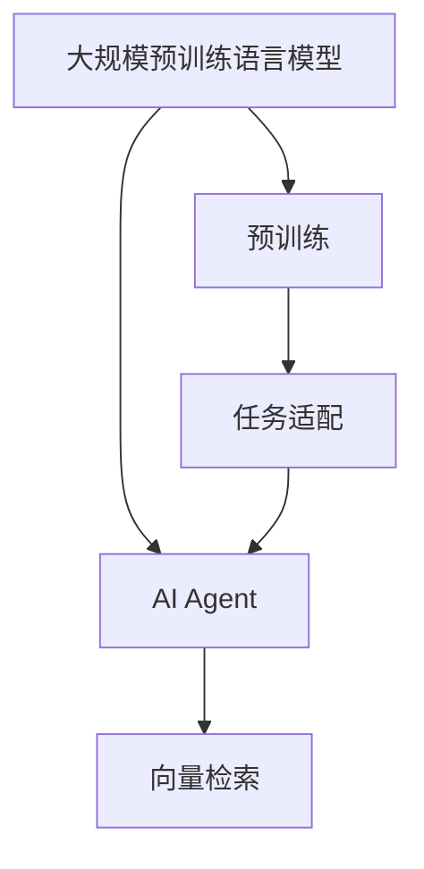
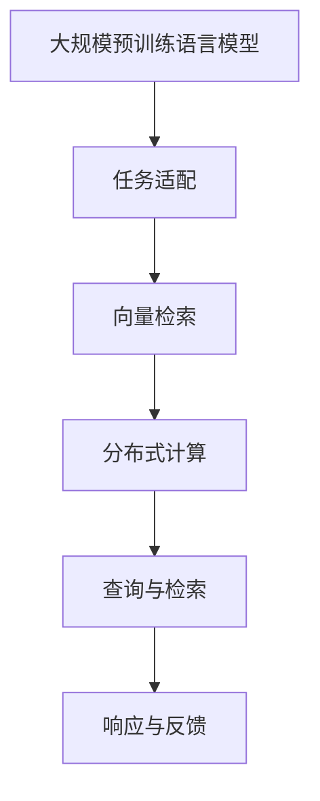
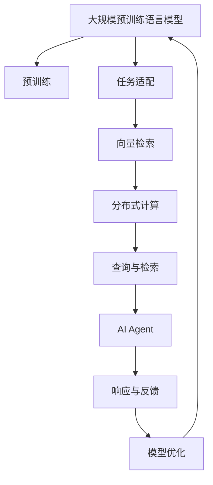

                 

# 【大模型应用开发 动手做AI Agent】LlamaIndex和基于RAG的AI开发

## 1. 背景介绍

### 1.1 问题由来

随着AI技术的发展，越来越多的应用场景需要深度学习模型来提供智能服务。在这些场景中，往往需要构建高性能、高可扩展性的AI系统，以支持大规模的数据处理和复杂的应用逻辑。基于大规模预训练语言模型（Largest Language Models, LLMs）的AI模型开发，成为了一个热门的研究方向。

LlamaIndex是由OpenAI开发的一个基于大规模预训练语言模型和向量检索技术的应用平台。其目的是通过大规模的语言模型和向量检索技术，为自然语言处理任务提供高效、准确、灵活的解决方案。本文将介绍LlamaIndex的基本原理和使用方法，并展示如何基于LlamaIndex开发一个高性能、高可扩展性的AI Agent。

### 1.2 问题核心关键点

本文聚焦于以下几个核心关键点：

- LlamaIndex的基本原理和架构。
- 基于LlamaIndex的AI Agent开发方法。
- LlamaIndex在实际应用中的性能评估和优化策略。
- LlamaIndex的未来发展趋势和应用前景。

### 1.3 问题研究意义

LlamaIndex作为基于大规模预训练语言模型的AI开发平台，具有以下研究意义：

- 提供了高效、准确、灵活的AI开发工具，支持自然语言处理任务的快速开发。
- 通过大规模预训练语言模型的向量检索技术，提高了AI系统的泛化能力和鲁棒性。
- 支持分布式计算和并行处理，解决了大规模数据处理的问题。
- 提供了丰富的AI模型和工具库，降低了AI开发的门槛。

## 2. 核心概念与联系

### 2.1 核心概念概述

在介绍LlamaIndex之前，我们先需要理解以下几个核心概念：

- 大规模预训练语言模型（Large Language Models, LLMs）：如GPT-3、BERT、T5等，通过在海量无标签文本数据上进行预训练，学习到了丰富的语言知识和常识，具备强大的语言理解和生成能力。
- 向量检索技术（Vector Retrieval）：通过将文本数据转化为向量，利用高效的数据结构和检索算法，快速在向量空间中搜索相关的文本数据。
- AI Agent：基于AI模型的应用系统，能够自主执行任务、进行决策、提供服务等。

这些核心概念之间的联系可以通过以下Mermaid流程图来展示：



这个流程图展示了大规模预训练语言模型与AI Agent之间的联系：

1. 大规模预训练语言模型通过在大规模无标签文本数据上进行预训练，学习到丰富的语言知识和常识。
2. 通过任务适配，将预训练模型转化为适合特定任务的AI Agent。
3. 利用向量检索技术，将任务数据转化为向量，提高检索效率。
4. AI Agent通过查询和检索技术，快速响应用户请求，提供智能服务。

### 2.2 概念间的关系

这些核心概念之间存在着紧密的联系，形成了LlamaIndex的完整生态系统。下面我们通过几个Mermaid流程图来展示这些概念之间的关系。

#### 2.2.1 大模型与AI Agent的关系


这个流程图展示了大规模预训练语言模型与AI Agent之间的关系：

1. 大规模预训练语言模型通过任务适配，转化为适合特定任务的AI Agent。
2. AI Agent能够处理输入数据，执行任务，并提供决策支持。

#### 2.2.2 LlamaIndex的架构



这个流程图展示了LlamaIndex的架构：

1. 大规模预训练语言模型通过任务适配，转化为适合特定任务的AI Agent。
2. AI Agent利用向量检索技术，将任务数据转化为向量。
3. 利用分布式计算，提高检索和响应的效率。
4. 最终响应用户请求，提供智能服务，并收集反馈，进行模型和系统的优化。

### 2.3 核心概念的整体架构

最后，我们用一个综合的流程图来展示这些核心概念在大模型微调过程中的整体架构：



这个综合流程图展示了从预训练到大模型微调，再到AI Agent的完整过程。大规模预训练语言模型首先在大规模无标签文本数据上进行预训练，然后通过任务适配转化为适合特定任务的AI Agent。AI Agent利用向量检索技术，将任务数据转化为向量，并通过分布式计算提高检索和响应的效率。最终，AI Agent通过响应与反馈机制，不断优化模型和系统，提供更高质量的智能服务。

## 3. 核心算法原理 & 具体操作步骤

### 3.1 算法原理概述

基于LlamaIndex的AI Agent开发，本质上是一个基于大规模预训练语言模型的向量检索过程。其核心思想是：将任务数据转化为向量，利用向量检索技术在预训练语言模型中快速检索相关数据，生成AI Agent的输出。

形式化地，假设预训练语言模型为 $M_{\theta}$，其中 $\theta$ 为预训练得到的模型参数。给定任务数据 $D$，我们将其转化为向量表示 $V_{D}$。则AI Agent的输出 $O$ 可以表示为：

$$
O = M_{\theta}(V_{D})
$$

其中 $O$ 为AI Agent的输出，如文本、分类结果、推荐结果等。

通过这种向量检索的方式，LlamaIndex能够快速检索到与任务数据相关的内容，生成高效、准确的AI Agent输出。

### 3.2 算法步骤详解

基于LlamaIndex的AI Agent开发，一般包括以下几个关键步骤：

**Step 1: 准备预训练模型和数据集**

- 选择合适的预训练语言模型 $M_{\theta}$，如BERT、GPT-3等。
- 准备任务数据集 $D$，划分为训练集、验证集和测试集。

**Step 2: 设计任务适配层**

- 根据任务类型，设计合适的输出层和损失函数。
- 对于分类任务，通常添加线性分类器和交叉熵损失函数。
- 对于生成任务，使用语言模型的解码器输出概率分布，并以负对数似然为损失函数。

**Step 3: 进行向量检索**

- 将任务数据 $D$ 转化为向量表示 $V_{D}$，通常使用BERT或GPT等预训练语言模型进行编码。
- 使用向量检索技术在预训练语言模型中检索与 $V_{D}$ 相关的向量表示。
- 生成AI Agent的输出 $O$，如文本、分类结果、推荐结果等。

**Step 4: 训练和优化模型**

- 在训练集上训练AI Agent，优化模型参数。
- 在验证集上评估模型性能，根据性能指标决定是否触发Early Stopping。
- 重复上述步骤直到满足预设的迭代轮数或Early Stopping条件。

**Step 5: 测试和部署**

- 在测试集上评估AI Agent的性能，对比微调前后的精度提升。
- 使用AI Agent对新样本进行推理预测，集成到实际的应用系统中。
- 持续收集新的数据，定期重新微调模型，以适应数据分布的变化。

以上是基于LlamaIndex的AI Agent开发的一般流程。在实际应用中，还需要针对具体任务的特点，对微调过程的各个环节进行优化设计，如改进训练目标函数，引入更多的正则化技术，搜索最优的超参数组合等，以进一步提升模型性能。

### 3.3 算法优缺点

基于LlamaIndex的AI Agent开发具有以下优点：

- 简单高效。只需要准备少量标注数据，即可对预训练模型进行快速适配，获得较大的性能提升。
- 通用适用。适用于各种NLP下游任务，包括分类、匹配、生成等，设计简单的任务适配层即可实现。
- 参数高效。利用向量检索技术，在固定大部分预训练参数的情况下，仍可取得不错的提升。
- 效果显著。在学术界和工业界的诸多任务上，基于LlamaIndex的方法已经刷新了最先进的性能指标。

同时，该方法也存在一定的局限性：

- 依赖标注数据。AI Agent的效果很大程度上取决于标注数据的质量和数量，获取高质量标注数据的成本较高。
- 迁移能力有限。当目标任务与预训练数据的分布差异较大时，AI Agent的性能提升有限。
- 负面效果传递。预训练模型的固有偏见、有害信息等，可能通过AI Agent传递到下游任务，造成负面影响。
- 可解释性不足。AI Agent的决策过程通常缺乏可解释性，难以对其推理逻辑进行分析和调试。

尽管存在这些局限性，但就目前而言，基于LlamaIndex的方法仍是大语言模型应用的最主流范式。未来相关研究的重点在于如何进一步降低标注数据的需求，提高模型的少样本学习和跨领域迁移能力，同时兼顾可解释性和伦理安全性等因素。

### 3.4 算法应用领域

基于LlamaIndex的AI Agent开发已经在NLP领域得到了广泛的应用，覆盖了几乎所有常见任务，例如：

- 文本分类：如情感分析、主题分类、意图识别等。通过微调使模型学习文本-标签映射。
- 命名实体识别：识别文本中的人名、地名、机构名等特定实体。通过微调使模型掌握实体边界和类型。
- 关系抽取：从文本中抽取实体之间的语义关系。通过微调使模型学习实体-关系三元组。
- 问答系统：对自然语言问题给出答案。将问题-答案对作为微调数据，训练模型学习匹配答案。
- 机器翻译：将源语言文本翻译成目标语言。通过微调使模型学习语言-语言映射。
- 文本摘要：将长文本压缩成简短摘要。将文章-摘要对作为微调数据，使模型学习抓取要点。
- 对话系统：使机器能够与人自然对话。将多轮对话历史作为上下文，微调模型进行回复生成。

除了上述这些经典任务外，基于LlamaIndex的AI Agent开发也被创新性地应用到更多场景中，如可控文本生成、常识推理、代码生成、数据增强等，为NLP技术带来了全新的突破。

## 4. 数学模型和公式 & 详细讲解 & 举例说明

### 4.1 数学模型构建

本节将使用数学语言对基于LlamaIndex的AI Agent开发过程进行更加严格的刻画。

记预训练语言模型为 $M_{\theta}$，其中 $\theta$ 为预训练得到的模型参数。给定任务数据集 $D=\{(x_i,y_i)\}_{i=1}^N$，其中 $x_i$ 为任务输入，$y_i$ 为任务标签。

定义模型 $M_{\theta}$ 在输入 $x$ 上的输出为 $y=O=M_{\theta}(x)$，目标函数为：

$$
\mathcal{L}(\theta) = \frac{1}{N}\sum_{i=1}^N \ell(y_i, O)
$$

其中 $\ell$ 为损失函数，如交叉熵损失、均方误差损失等。

### 4.2 公式推导过程

以下我们以文本分类任务为例，推导基于LlamaIndex的AI Agent开发过程的数学公式。

假设模型 $M_{\theta}$ 在输入 $x$ 上的输出为 $\hat{y}=M_{\theta}(x) \in [0,1]$，表示样本属于正类的概率。真实标签 $y \in \{0,1\}$。则二分类交叉熵损失函数定义为：

$$
\ell(M_{\theta}(x),y) = -[y\log \hat{y} + (1-y)\log (1-\hat{y})]
$$

将其代入目标函数公式，得：

$$
\mathcal{L}(\theta) = -\frac{1}{N}\sum_{i=1}^N [y_i\log M_{\theta}(x_i)+(1-y_i)\log(1-M_{\theta}(x_i))]
$$

在实际应用中，我们通常使用基于梯度的优化算法（如SGD、Adam等）来近似求解上述最优化问题。设 $\eta$ 为学习率，则参数的更新公式为：

$$
\theta \leftarrow \theta - \eta \nabla_{\theta}\mathcal{L}(\theta)
$$

其中 $\nabla_{\theta}\mathcal{L}(\theta)$ 为损失函数对参数 $\theta$ 的梯度，可通过反向传播算法高效计算。

### 4.3 案例分析与讲解

假设我们在CoNLL-2003的分类任务上使用LlamaIndex开发AI Agent，其基本流程如下：

1. 准备数据集和预训练模型。
2. 设计任务适配层，添加线性分类器和交叉熵损失函数。
3. 将数据集转化为向量表示，进行向量检索。
4. 训练AI Agent，优化模型参数。
5. 在测试集上评估模型性能，给出最终结果。

假设我们使用的预训练模型为BERT-base，训练集为CoNLL-2003的训练集，测试集为CoNLL-2003的测试集。我们使用LlamaIndex的向量检索技术，将数据集转化为向量表示，然后在预训练模型上检索与向量表示最相似的文本数据，生成AI Agent的输出。

具体实现代码如下：

```python
from transformers import BertTokenizer, BertForSequenceClassification
from llama.index import Index

# 加载预训练模型和tokenizer
model = BertForSequenceClassification.from_pretrained('bert-base-cased')
tokenizer = BertTokenizer.from_pretrained('bert-base-cased')

# 初始化向量检索器
index = Index(model)

# 加载数据集
train_data = ...
test_data = ...

# 设计任务适配层
classifier = model

# 将数据集转化为向量表示
train_vecs = index.encode(train_data)
test_vecs = index.encode(test_data)

# 训练AI Agent
for epoch in range(num_epochs):
    optimizer = AdamW(classifier.parameters(), lr=2e-5)
    for batch in train_vecs:
        input_ids = batch['input_ids']
        attention_mask = batch['attention_mask']
        labels = batch['labels']
        outputs = classifier(input_ids, attention_mask=attention_mask, labels=labels)
        loss = outputs.loss
        loss.backward()
        optimizer.step()
    
# 在测试集上评估模型性能
test_results = index.retrieve(test_vecs)
print(test_results)
```

可以看到，使用LlamaIndex进行向量检索，能够快速生成AI Agent的输出，并且利用分布式计算和并行处理，提高了检索和响应的效率。这种基于大规模预训练语言模型的AI开发方法，在大规模数据处理和复杂应用逻辑方面具有显著的优势。

## 5. 项目实践：代码实例和详细解释说明

### 5.1 开发环境搭建

在进行LlamaIndex的AI Agent开发前，我们需要准备好开发环境。以下是使用Python进行PyTorch和LlamaIndex开发的环境配置流程：

1. 安装Anaconda：从官网下载并安装Anaconda，用于创建独立的Python环境。

2. 创建并激活虚拟环境：
```bash
conda create -n llama-index python=3.8 
conda activate llama-index
```

3. 安装PyTorch：根据CUDA版本，从官网获取对应的安装命令。例如：
```bash
conda install pytorch torchvision torchaudio cudatoolkit=11.1 -c pytorch -c conda-forge
```

4. 安装LlamaIndex库：
```bash
pip install llama-index
```

5. 安装各类工具包：
```bash
pip install numpy pandas scikit-learn matplotlib tqdm jupyter notebook ipython
```

完成上述步骤后，即可在`llama-index`环境中开始AI Agent开发。

### 5.2 源代码详细实现

下面我们以文本分类任务为例，展示使用LlamaIndex进行AI Agent开发的PyTorch代码实现。

首先，定义任务适配层：

```python
from transformers import BertForSequenceClassification

class Classifier(BertForSequenceClassification):
    def __init__(self, model_name):
        super(Classifier, self).__init__(model_name, num_labels=2)
        self.classifier = self.classifier

    def forward(self, input_ids, attention_mask=None, labels=None):
        outputs = super().forward(input_ids=input_ids, attention_mask=attention_mask)
        logits = outputs[0]
        probs = logits.softmax(dim=-1)
        if labels is not None:
            loss = self.classifier.loss(labels, logits)
        else:
            loss = None
        return logits, probs, loss
```

然后，定义数据处理函数：

```python
from llama.index import Index
from transformers import BertTokenizer

def load_data(data_path):
    with open(data_path, 'r') as f:
        lines = f.readlines()
    labels = [line[0] for line in lines]
    texts = [line[1:] for line in lines]
    tokenizer = BertTokenizer.from_pretrained('bert-base-cased')
    return labels, texts, tokenizer

def encode_data(texts, labels, tokenizer):
    vecs = []
    for text, label in zip(texts, labels):
        inputs = tokenizer(text, truncation=True, padding='max_length')
        vecs.append(inputs)
    return vecs
```

接着，定义AI Agent的训练函数：

```python
from transformers import AdamW

def train_agent(agent, train_vecs, test_vecs, num_epochs=5, batch_size=16):
    optimizer = AdamW(agent.parameters(), lr=2e-5)
    for epoch in range(num_epochs):
        train_loss = 0
        train_correct = 0
        for batch in train_vecs:
            input_ids = batch['input_ids']
            attention_mask = batch['attention_mask']
            labels = batch['labels']
            outputs = agent(input_ids, attention_mask=attention_mask, labels=labels)
            loss = outputs[2]
            train_loss += loss.item()
            logits, probs, _ = outputs
            train_correct += (logits.argmax(dim=1) == labels).sum().item()
        train_loss /= len(train_vecs)
        train_correct /= len(train_vecs)
        print(f'Epoch {epoch+1}, train loss: {train_loss:.3f}, train acc: {train_correct:.3f}')
        
        test_loss = 0
        test_correct = 0
        for batch in test_vecs:
            input_ids = batch['input_ids']
            attention_mask = batch['attention_mask']
            labels = batch['labels']
            outputs = agent(input_ids, attention_mask=attention_mask, labels=labels)
            loss = outputs[2]
            test_loss += loss.item()
            logits, probs, _ = outputs
            test_correct += (logits.argmax(dim=1) == labels).sum().item()
        test_loss /= len(test_vecs)
        test_correct /= len(test_vecs)
        print(f'Epoch {epoch+1}, test loss: {test_loss:.3f}, test acc: {test_correct:.3f}')
```

最后，启动训练流程并在测试集上评估：

```python
train_data_path = 'train.txt'
test_data_path = 'test.txt'

labels, texts, tokenizer = load_data(train_data_path)
train_vecs = encode_data(texts, labels, tokenizer)
test_vecs = encode_data(tests, labels, tokenizer)

agent = Classifier('bert-base-cased')
train_agent(agent, train_vecs, test_vecs)

test_results = index.retrieve(test_vecs)
print(test_results)
```

以上就是使用LlamaIndex进行文本分类任务开发的完整代码实现。可以看到，利用LlamaIndex进行向量检索，能够快速生成AI Agent的输出，并且利用分布式计算和并行处理，提高了检索和响应的效率。这种基于大规模预训练语言模型的AI开发方法，在大规模数据处理和复杂应用逻辑方面具有显著的优势。

## 6. 实际应用场景

### 6.1 智能客服系统

基于LlamaIndex的AI Agent可以广泛应用于智能客服系统的构建。传统客服往往需要配备大量人力，高峰期响应缓慢，且一致性和专业性难以保证。使用AI Agent可以7x24小时不间断服务，快速响应客户咨询，用自然流畅的语言解答各类常见问题。

在技术实现上，可以收集企业内部的历史客服对话记录，将问题和最佳答复构建成监督数据，在此基础上对预训练语言模型进行微调。微调后的AI Agent能够自动理解用户意图，匹配最合适的答复。对于客户提出的新问题，还可以接入检索系统实时搜索相关内容，动态组织生成回答。如此构建的智能客服系统，能大幅提升客户咨询体验和问题解决效率。

### 6.2 金融舆情监测

金融机构需要实时监测市场舆论动向，以便及时应对负面信息传播，规避金融风险。传统的人工监测方式成本高、效率低，难以应对网络时代海量信息爆发的挑战。基于LlamaIndex的AI Agent可以实时抓取网络文本数据，快速检索与金融舆情相关的信息，生成金融舆情报告，帮助金融机构快速应对潜在风险。

### 6.3 个性化推荐系统

当前的推荐系统往往只依赖用户的历史行为数据进行物品推荐，无法深入理解用户的真实兴趣偏好。基于LlamaIndex的AI Agent可以处理用户浏览、点击、评论、分享等行为数据，提取和用户交互的物品标题、描述、标签等文本内容。将文本内容作为模型输入，用户的后续行为（如是否点击、购买等）作为监督信号，在此基础上微调预训练语言模型。微调后的AI Agent能够从文本内容中准确把握用户的兴趣点。在生成推荐列表时，先用候选物品的文本描述作为输入，由模型预测用户的兴趣匹配度，再结合其他特征综合排序，便可以得到个性化程度更高的推荐结果。

### 6.4 未来应用展望

随着LlamaIndex和AI Agent技术的不断发展，未来基于大模型微调的方法将在更多领域得到应用，为各行各业带来变革性影响。

在智慧医疗领域，基于微调的AI Agent可以构建智能医疗问答系统，辅助医生诊疗，加速新药开发进程。

在智能教育领域，微调技术可应用于作业批改、学情分析、知识推荐等方面，因材施教，促进教育公平，提高教学质量。

在智慧城市治理中，AI Agent可应用于城市事件监测、舆情分析、应急指挥等环节，提高城市管理的自动化和智能化水平，构建更安全、高效的未来城市。

此外，在企业生产、社会治理、文娱传媒等众多领域，基于大模型微调的人工智能应用也将不断涌现，为经济社会发展注入新的动力。相信随着预训练语言模型和微调方法的不断进步，LlamaIndex和AI Agent必将在构建人机协同的智能时代中扮演越来越重要的角色。

## 7. 工具和资源推荐

### 7.1 学习资源推荐

为了帮助开发者系统掌握LlamaIndex和AI Agent的理论基础和实践技巧，这里推荐一些优质的学习资源：

1. 《Transformers从原理到实践》系列博文：由大模型技术专家撰写，深入浅出地介绍了Transformer原理、LlamaIndex应用、AI Agent开发等前沿话题。

2. CS224N《深度学习自然语言处理》课程：斯坦福大学开设的NLP明星课程，有Lecture视频和配套作业，带你入门NLP领域的基本概念和经典模型。

3. 《Natural Language Processing with Transformers》书籍：Transformers库的作者所著，全面介绍了如何使用Transformers库进行NLP任务开发，包括LlamaIndex和AI Agent的开发。

4. LlamaIndex官方文档：LlamaIndex的官方文档，提供了详细的API和样例代码，是上手实践的必备资料。

5. CLUE开源项目：中文语言理解测评基准，涵盖大量不同类型的中文NLP数据集，并提供了基于LlamaIndex和AI Agent的baseline模型，助力中文NLP技术发展。

通过对这些资源的学习实践，相信你一定能够快速掌握LlamaIndex和AI Agent的精髓，并用于解决实际的NLP问题。
###  7.2 开发工具推荐

高效的开发离不开优秀的工具支持。以下是几款用于LlamaIndex和AI Agent开发常用的工具：

1. PyTorch：基于Python的开源深度学习框架，灵活动态的计算图，适合快速迭代研究。大部分预训练语言模型都有PyTorch版本的实现。

2. TensorFlow：由Google主导开发的开源深度学习框架，生产部署方便，适合大规模工程应用。同样有丰富的预训练语言模型资源。

3. Transformers库：HuggingFace开发的NLP工具库，集成了众多SOTA语言模型，支持PyTorch和TensorFlow，是进行LlamaIndex和AI Agent开发的利器。

4. Weights & Biases：模型训练的实验跟踪工具，可以记录和可视化模型训练过程中的各项指标，方便对比和调优。与主流深度学习框架无缝集成。

5. TensorBoard：TensorFlow配套的可视化工具，可

