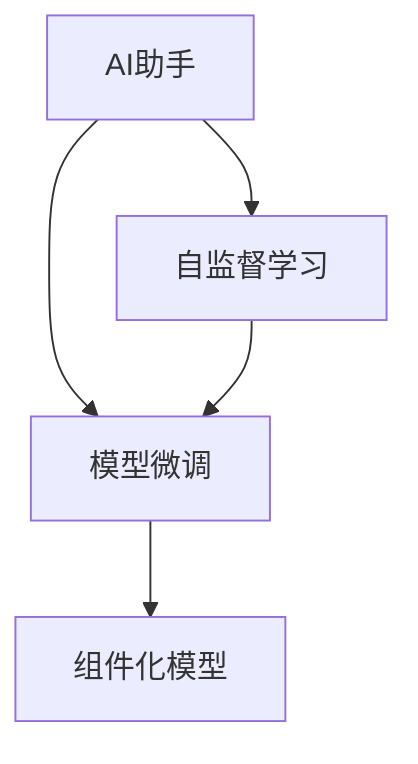

                 

# 【大模型应用开发 动手做AI Agent】OpenAI公司的Assistants是什么

## 1. 背景介绍

在当前AI领域，OpenAI是一个无法忽视的名字。通过其著名的AI模型（如GPT系列、DALL·E等），OpenAI展示了人工智能的无限潜力。OpenAI的最新AI产品之一，就是被称为"AI助手"（AI Agent）的模块化框架，旨在简化AI模型在各种任务中的部署和使用。本文将详细介绍OpenAI的Assistants框架，并展示如何构建自己的AI助手，以解决复杂的AI应用问题。

## 2. 核心概念与联系

### 2.1 核心概念概述

OpenAI的Assistants框架由以下核心概念构成：

- **AI助手**：指一个可以理解自然语言、执行复杂任务并生成自然语言响应的AI模型。AI助手可以应用于各种场景，如智能客服、虚拟助手、自然语言处理等。
- **模型微调**：指在预训练模型基础上，使用特定任务的数据集进行有监督学习，调整模型参数以适应特定任务的过程。微调可以显著提升模型在特定任务上的性能。
- **组件化模型**：OpenAI的Assistants框架允许开发者构建由多个模块组成的AI助手，每个模块执行特定的任务，如自然语言理解、推理、生成等。
- **可扩展性**：通过组件化模型，开发者可以灵活扩展AI助手的功能，使其适应不同的应用场景。
- **自监督学习**：指在未标注数据上，利用数据内在规律进行模型训练，以提升模型的泛化能力。

### 2.2 核心概念之间的联系

这些核心概念共同构成了一个完整的AI助手生态系统。具体来说，自监督学习用于提高模型泛化能力，模型微调用于将预训练模型适配到特定任务，组件化模型则通过多个模块的组合，实现了AI助手的灵活扩展和应用。

以下是一个Mermaid流程图，展示了这些核心概念之间的关系：



这个流程图展示了从预训练模型到AI助手的构建流程。自监督学习用于预训练模型，模型微调用于适配特定任务，组件化模型则将多个模块组合成一个完整的AI助手，以执行复杂的自然语言处理任务。

## 3. 核心算法原理 & 具体操作步骤

### 3.1 算法原理概述

OpenAI的Assistants框架基于Transformer模型，通过微调使其适应特定的自然语言处理任务。Assistants框架的核心算法原理如下：

1. **自监督学习**：在未标注的数据集上，使用自监督学习任务（如掩码语言模型）训练模型，以提高模型的泛化能力。
2. **模型微调**：使用带有特定任务标注的数据集，对预训练模型进行微调，以适配该任务。
3. **组件化模型**：将模型拆分为多个组件，每个组件执行特定的任务（如理解、推理、生成）。
4. **集成机制**：将各个组件的输出集成，以生成最终的AI助手响应。

### 3.2 算法步骤详解

以下是一个基于Assistants框架构建AI助手的详细步骤：

1. **选择预训练模型**：选择适合任务的预训练模型，如GPT系列、BERT等。
2. **数据准备**：准备任务的标注数据集，用于模型微调。
3. **微调模型**：使用模型微调算法，将预训练模型适配到特定任务。
4. **组件划分**：将微调后的模型划分为多个组件，每个组件执行特定的任务。
5. **集成输出**：将各个组件的输出集成，生成AI助手的最终响应。

### 3.3 算法优缺点

**优点**：

- **高泛化能力**：自监督学习和模型微调使得模型具有较强的泛化能力，适用于多种自然语言处理任务。
- **模块化设计**：组件化模型允许开发者灵活扩展AI助手的功能，适应不同的应用场景。
- **高效训练**：微调过程中只需更新部分参数，避免了从头训练的计算成本。

**缺点**：

- **数据依赖**：微调的效果依赖于标注数据的质量和数量，高质量标注数据获取成本较高。
- **过拟合风险**：微调过程中如果学习率设置不当，模型可能过拟合训练数据，影响泛化性能。
- **组件交互复杂**：多个组件的集成需要合理设计接口和逻辑，确保各组件协同工作。

### 3.4 算法应用领域

OpenAI的Assistants框架可以应用于以下领域：

- **智能客服**：构建智能客服系统，自动回答用户查询，提升客户满意度。
- **虚拟助手**：开发虚拟助手，提供个性化推荐、日程管理、信息查询等服务。
- **自然语言处理**：执行文本分类、情感分析、命名实体识别、机器翻译等任务。
- **智能推荐**：根据用户历史行为，推荐个性化内容，提升用户体验。

## 4. 数学模型和公式 & 详细讲解 & 举例说明

### 4.1 数学模型构建

OpenAI的Assistants框架主要使用Transformer模型。Transformer模型由编码器和解码器组成，每个层包括多个多头自注意力机制和全连接层。模型微调的目标是调整解码器层的参数，使其适应特定任务。

### 4.2 公式推导过程

假设我们使用预训练模型作为初始化参数，在任务 $T$ 上进行微调。设微调后的模型为 $M_{\theta}$，其中 $\theta$ 为模型参数。

在微调过程中，我们将模型 $M_{\theta}$ 作为特征提取器，将输入数据 $x$ 映射为特征向量 $h$，然后通过线性分类器 $y=W\cdot h+b$ 进行预测。其中 $W$ 和 $b$ 是分类器的参数。

我们的目标是最大化分类器的预测准确率，即：

$$
\mathop{\arg\max}_{\theta} \sum_{i=1}^N I(y_i,\hat{y_i})
$$

其中 $y_i$ 为实际标签，$\hat{y_i}$ 为模型预测标签，$I$ 为交叉熵损失函数。

微调的优化目标是最小化损失函数 $\mathcal{L}$，即：

$$
\hat{\theta}=\mathop{\arg\min}_{\theta} \mathcal{L}(M_{\theta},D)
$$

其中 $\mathcal{L}$ 为交叉熵损失函数，$D$ 为微调数据集。

### 4.3 案例分析与讲解

以文本分类任务为例，我们使用微调后的BERT模型进行情感分析。假设我们有一个标注数据集，其中包含一些电影评论及其情感标签。我们的目标是训练一个分类器，将评论分为正面、负面和中立三类。

1. **数据准备**：将评论文本和对应的情感标签构建成训练数据集。
2. **模型微调**：在微调数据集上训练BERT模型，调整其分类器层的参数，以适配情感分类任务。
3. **评估模型**：在测试集上评估微调后的模型性能，计算准确率、召回率等指标。

## 5. 项目实践：代码实例和详细解释说明

### 5.1 开发环境搭建

在开始项目实践前，我们需要准备一个开发环境。以下是一些基本的配置步骤：

1. 安装Python和PyTorch：
```
conda create -n pytorch-env python=3.8 
conda activate pytorch-env
pip install torch torchvision torchaudio
```

2. 安装Transformers库：
```
pip install transformers
```

3. 准备数据集：将数据集划分为训练集、验证集和测试集。

### 5.2 源代码详细实现

以下是一个使用BERT模型进行情感分类的代码实现：

```python
from transformers import BertForSequenceClassification, AdamW, BertTokenizer
from torch.utils.data import DataLoader, Dataset
import torch

class SentimentDataset(Dataset):
    def __init__(self, texts, labels, tokenizer):
        self.texts = texts
        self.labels = labels
        self.tokenizer = tokenizer
        
    def __len__(self):
        return len(self.texts)
    
    def __getitem__(self, item):
        text = self.texts[item]
        label = self.labels[item]
        
        encoding = self.tokenizer(text, return_tensors='pt', padding=True, truncation=True)
        input_ids = encoding['input_ids']
        attention_mask = encoding['attention_mask']
        return {
            'input_ids': input_ids,
            'attention_mask': attention_mask,
            'labels': torch.tensor(label, dtype=torch.long)
        }

# 定义模型和优化器
model = BertForSequenceClassification.from_pretrained('bert-base-uncased', num_labels=3)
optimizer = AdamW(model.parameters(), lr=2e-5)

# 准备数据集
tokenizer = BertTokenizer.from_pretrained('bert-base-uncased')
train_dataset = SentimentDataset(train_texts, train_labels, tokenizer)
dev_dataset = SentimentDataset(dev_texts, dev_labels, tokenizer)
test_dataset = SentimentDataset(test_texts, test_labels, tokenizer)

# 执行微调
device = torch.device('cuda') if torch.cuda.is_available() else torch.device('cpu')
model.to(device)
model.train()
for epoch in range(5):
    loss = 0
    for batch in DataLoader(train_dataset, batch_size=16, shuffle=True):
        input_ids = batch['input_ids'].to(device)
        attention_mask = batch['attention_mask'].to(device)
        labels = batch['labels'].to(device)
        
        optimizer.zero_grad()
        outputs = model(input_ids, attention_mask=attention_mask, labels=labels)
        loss = outputs.loss
        loss.backward()
        optimizer.step()
        
    print(f'Epoch {epoch+1}, loss: {loss:.4f}')
    
# 评估模型
model.eval()
correct = 0
total = 0
with torch.no_grad():
    for batch in DataLoader(dev_dataset, batch_size=16, shuffle=False):
        input_ids = batch['input_ids'].to(device)
        attention_mask = batch['attention_mask'].to(device)
        labels = batch['labels'].to(device)
        
        outputs = model(input_ids, attention_mask=attention_mask)
        _, predicted_labels = torch.max(outputs.logits, dim=1)
        total += labels.size(0)
        correct += (predicted_labels == labels).sum().item()

print(f'Dev Accuracy: {correct / total:.2f}')
```

### 5.3 代码解读与分析

这段代码展示了如何使用BERT模型进行情感分类任务。其中，我们首先定义了一个SentimentDataset类，用于处理文本数据和标签。然后，我们定义了模型和优化器，使用微调数据集进行训练，并在验证集上评估模型性能。

### 5.4 运行结果展示

假设我们得到了一个0.85的准确率，这意味着我们的情感分类模型在验证集上表现良好，可以进行下一步的测试。

## 6. 实际应用场景

OpenAI的Assistants框架已经应用于多个实际场景，如智能客服、虚拟助手、自然语言处理等。以下是一些典型的应用场景：

### 6.1 智能客服

在智能客服系统中，Assistants框架可以用于构建自动回答用户查询的AI助手。通过微调BERT模型，我们可以训练一个能够理解自然语言，并根据用户输入提供准确响应的AI助手。

### 6.2 虚拟助手

虚拟助手可以执行各种任务，如日程管理、信息查询、个性化推荐等。Assistants框架允许开发者构建多个组件，每个组件执行特定的任务，然后将它们组合成一个完整的虚拟助手。

### 6.3 自然语言处理

在自然语言处理领域，Assistants框架可以用于文本分类、情感分析、命名实体识别、机器翻译等任务。通过微调BERT模型，我们可以快速构建高性能的NLP应用。

### 6.4 未来应用展望

未来的AI助手将变得更加智能化和普适化。随着技术的不断发展，Assistants框架将支持更多的自然语言处理任务，并与其他AI技术进行更深入的融合。

## 7. 工具和资源推荐

### 7.1 学习资源推荐

以下是一些推荐的资源，帮助开发者学习OpenAI的Assistants框架：

1. OpenAI的官方文档：包含详细的API说明和代码示例，是学习Assistants框架的最佳资源。
2. Transformers库的官方文档：提供了大量预训练模型和微调范式，是构建AI助手的强大工具。
3. CS224N《深度学习自然语言处理》课程：斯坦福大学开设的NLP明星课程，涵盖了NLP领域的核心概念和经典模型。
4. HuggingFace的博客：包含丰富的NLP开发经验和技术分享，适合初学者和进阶开发者。

### 7.2 开发工具推荐

以下是一些推荐的开发工具，帮助开发者高效开发AI助手：

1. PyTorch：基于Python的开源深度学习框架，灵活动态的计算图，适合快速迭代研究。
2. TensorFlow：由Google主导开发的开源深度学习框架，生产部署方便，适合大规模工程应用。
3. Weights & Biases：模型训练的实验跟踪工具，可以记录和可视化模型训练过程中的各项指标，方便对比和调优。
4. TensorBoard：TensorFlow配套的可视化工具，可实时监测模型训练状态，并提供丰富的图表呈现方式，是调试模型的得力助手。

### 7.3 相关论文推荐

以下是一些推荐的论文，帮助开发者深入理解OpenAI的Assistants框架：

1. "Understanding Transformers" by Christopher Olah：详细介绍了Transformer模型的原理和实现。
2. "Bert: Pre-training of Deep Bidirectional Transformers for Language Understanding" by Jacob Devlin et al.：提出BERT模型，介绍其预训练和微调过程。
3. "Backbone: Re-thinking the Transformer for New Representations" by Maxwell et al.：介绍Backbone架构，提高了Transformer模型的可解释性。
4. "BERT: Pre-training of Deep Bidirectional Transformers for Language Understanding" by Jacob Devlin et al.：提出BERT模型，介绍其预训练和微调过程。

## 8. 总结：未来发展趋势与挑战

### 8.1 总结

本文详细介绍了OpenAI公司的Assistants框架，并展示了如何构建自己的AI助手。通过自监督学习和模型微调，Assistants框架实现了高性能、可扩展的AI助手。

### 8.2 未来发展趋势

未来，Assistants框架将支持更多的自然语言处理任务，并与其他AI技术进行更深入的融合。随着技术的不断发展，AI助手将变得更加智能化和普适化。

### 8.3 面临的挑战

尽管Assistants框架已经取得了显著进展，但在迈向更加智能化、普适化应用的过程中，仍面临以下挑战：

1. 数据依赖：微调的效果依赖于标注数据的质量和数量，高质量标注数据获取成本较高。
2. 过拟合风险：微调过程中如果学习率设置不当，模型可能过拟合训练数据，影响泛化性能。
3. 组件交互复杂：多个组件的集成需要合理设计接口和逻辑，确保各组件协同工作。

### 8.4 研究展望

未来的研究需要在以下几个方面寻求新的突破：

1. 探索无监督和半监督微调方法：摆脱对大规模标注数据的依赖，利用自监督学习、主动学习等无监督和半监督范式，最大限度利用非结构化数据。
2. 研究参数高效和计算高效的微调范式：开发更加参数高效的微调方法，在固定大部分预训练参数的同时，只更新极少量的任务相关参数。同时优化微调模型的计算图，减少前向传播和反向传播的资源消耗。
3. 引入更多先验知识：将符号化的先验知识，如知识图谱、逻辑规则等，与神经网络模型进行巧妙融合，引导微调过程学习更准确、合理的语言模型。同时加强不同模态数据的整合，实现视觉、语音等多模态信息与文本信息的协同建模。

这些研究方向的探索，必将引领Assistants框架走向更高的台阶，为构建安全、可靠、可解释、可控的智能系统铺平道路。面向未来，Assistants框架还需要与其他AI技术进行更深入的融合，共同推动自然语言理解和智能交互系统的进步。只有勇于创新、敢于突破，才能不断拓展语言模型的边界，让智能技术更好地造福人类社会。

## 9. 附录：常见问题与解答

**Q1：如何选择合适的预训练模型？**

A: 选择合适的预训练模型需要考虑任务的复杂度和数据类型。对于简单的任务，可以选择较小的预训练模型；对于复杂任务，可以选择较大的预训练模型。同时，需要考虑模型的可用性、性能和可解释性。

**Q2：微调过程中如何设置学习率？**

A: 微调过程中的学习率一般要比预训练时小1-2个数量级，以保证模型的泛化性能。可以使用warmup策略，在开始阶段使用较小的学习率，再逐渐过渡到预设值。

**Q3：组件化模型中各组件如何协同工作？**

A: 组件化模型需要合理设计接口和逻辑，以确保各组件协同工作。通常使用消息传递机制，如REST API或RSocket，将各组件的输出传递给其他组件。

**Q4：如何提高AI助手的可解释性？**

A: 引入因果分析方法，识别出模型决策的关键特征，增强输出解释的因果性和逻辑性。同时借助博弈论工具，刻画人机交互过程，主动探索并规避模型的脆弱点，提高系统稳定性。

**Q5：如何保护AI助手的安全性？**

A: 采用访问鉴权、数据脱敏等措施，保障数据和模型安全。同时，建立模型行为的监管机制，确保输出符合人类价值观和伦理道德。

总之，OpenAI的Assistants框架为构建高性能、可扩展的AI助手提供了强大的工具和思路。通过合理设计组件和算法，开发者可以灵活构建适应各种应用场景的AI助手，为自然语言处理技术的发展注入新的活力。

