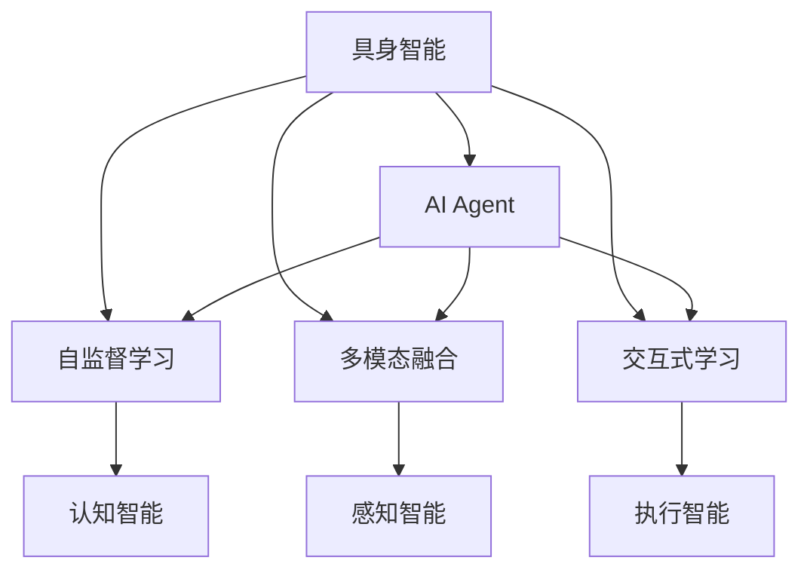
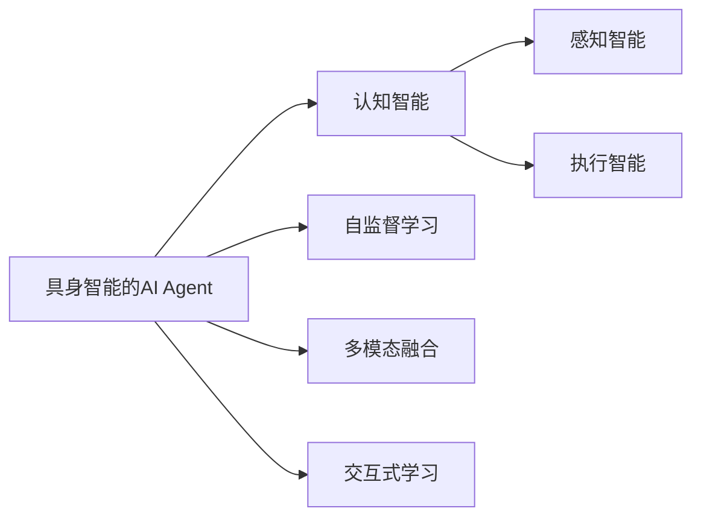
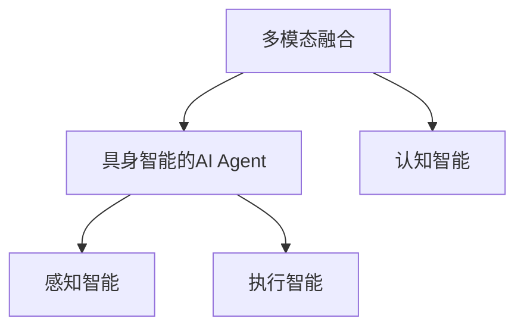
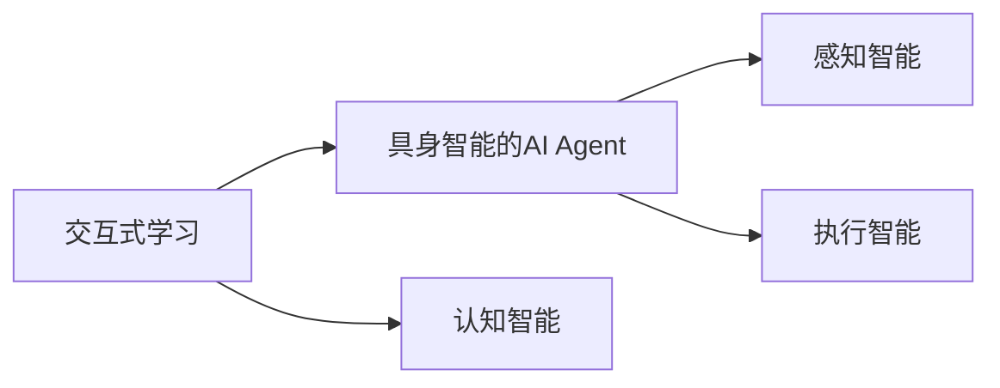
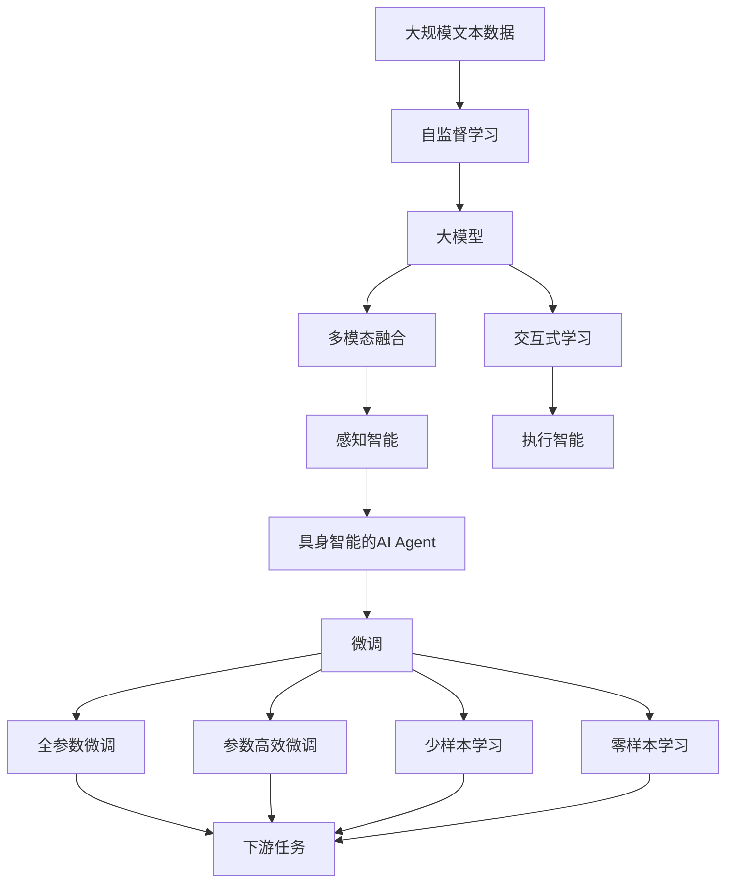

                 

# 【大模型应用开发 动手做AI Agent】具身智能的发展

> 关键词：具身智能，大语言模型，AI Agent，模型微调，自监督学习，多模态融合，交互式学习，具身化开发

## 1. 背景介绍

### 1.1 问题由来

近年来，人工智能(AI)领域取得了快速进展，其中自然语言处理(NLP)和计算机视觉(CV)等技术的突破尤为显著。这些技术能够理解和处理自然语言和图像信息，为构建智能化的AI Agent提供了可能性。然而，尽管已有诸多成功案例，但仍存在一些关键问题阻碍AI Agent的广泛应用，包括模型效率低、缺乏上下文理解、难以应对复杂交互环境等。这些问题亟需解决，以促进AI Agent在更多实际场景中的应用。

### 1.2 问题核心关键点

在智能系统中，AI Agent需要具备感知、理解、决策和执行的能力。然而，现有的AI Agent在实现具身智能（Embodied Intelligence）方面还存在诸多挑战，具体包括：

- 缺乏感知能力：AI Agent往往缺乏对环境感知和交互的对象理解。
- 缺乏上下文理解：AI Agent难以将当前状态与历史状态结合，缺乏语境理解能力。
- 交互性差：AI Agent难以灵活处理多样化的交互环境，缺乏与用户的良好互动。
- 模型效率低：现有的AI Agent模型复杂度高，计算资源消耗大，难以在实时环境中应用。
- 数据依赖性高：现有的AI Agent高度依赖于大量的标注数据进行训练，数据收集和处理成本高。

这些挑战使得AI Agent在实际应用中难以发挥其潜力，亟需新的方法和技术来改善其性能。

### 1.3 问题研究意义

研究具身智能的AI Agent，对于推动AI技术在更多实际场景中的应用具有重要意义：

- 降低开发成本：通过使用预训练大模型和少样本学习技术，可以显著减少从头开发所需的时间和成本。
- 提高性能：通过微调等技术优化模型参数，使其能够适应特定任务，提升AI Agent的性能。
- 提升交互性：通过具身化开发，使AI Agent具备感知和决策能力，能够在实际环境中进行自然交互。
- 增强鲁棒性：通过引入多模态融合和交互式学习，使AI Agent能够更好地适应动态环境和用户需求。
- 拓展应用范围：AI Agent在自然语言理解、图像识别、决策制定等领域具有广泛应用前景，有望推动相关产业升级。

## 2. 核心概念与联系

### 2.1 核心概念概述

为更好地理解具身智能的AI Agent，本节将介绍几个密切相关的核心概念：

- **具身智能（Embodied Intelligence）**：指AI Agent不仅具备认知智能，还能够在实际物理环境中感知、交互和执行任务。具身智能强调了AI Agent与环境的物理交互，使其具备更强的感知能力和灵活性。
- **AI Agent**：智能体，指能够感知环境、理解任务、做出决策并执行任务的计算实体。AI Agent可以是基于符号推理的专家系统，也可以是基于机器学习的智能体。
- **自监督学习（Self-Supervised Learning）**：指使用未标注数据进行学习的技术，通过设计合适的自监督任务来利用数据的内在结构，提升模型的泛化能力。
- **多模态融合（Multi-Modal Fusion）**：指将不同类型的数据（如文本、图像、音频等）进行整合，提升AI Agent在多模态环境下的感知和理解能力。
- **交互式学习（Interactive Learning）**：指在与人交互的过程中，AI Agent通过学习用户的行为和反馈，动态调整自己的决策和执行策略，提升交互的灵活性和自然性。
- **具身化开发（Embodiment Development）**：指开发能够真实物理交互的AI Agent，通常涉及机器人的硬件开发和软件算法的设计。

这些核心概念之间的逻辑关系可以通过以下Mermaid流程图来展示：



这个流程图展示了大模型AI Agent的核心概念及其之间的关系：

1. 具身智能的AI Agent通过自监督学习获取认知智能。
2. 通过多模态融合提升感知智能，使AI Agent具备更强的环境感知能力。
3. 通过交互式学习提升执行智能，使AI Agent能够更好地进行自然交互。
4. 具身化开发使AI Agent具备实际的物理交互能力，能够执行真实的物理动作。

### 2.2 概念间的关系

这些核心概念之间存在着紧密的联系，形成了具身智能AI Agent的整体生态系统。下面我们通过几个Mermaid流程图来展示这些概念之间的关系。

#### 2.2.1 具身智能的AI Agent学习范式



这个流程图展示了具身智能AI Agent的学习范式：

1. 通过自监督学习获取认知智能。
2. 通过多模态融合提升感知智能。
3. 通过交互式学习提升执行智能。

#### 2.2.2 具身智能与多模态融合的关系



这个流程图展示了多模态融合在具身智能AI Agent中的作用：

1. 多模态融合提升AI Agent的感知智能。
2. 提升执行智能，使AI Agent能够更好地进行自然交互。

#### 2.2.3 具身智能与交互式学习的关系



这个流程图展示了交互式学习在具身智能AI Agent中的作用：

1. 交互式学习提升AI Agent的执行智能。
2. 使AI Agent能够更好地进行自然交互。

### 2.3 核心概念的整体架构

最后，我们用一个综合的流程图来展示这些核心概念在大模型AI Agent微调过程中的整体架构：



这个综合流程图展示了从自监督学习到微调的完整过程。大模型AI Agent首先在大规模文本数据上进行自监督学习，然后通过多模态融合和交互式学习，逐步提升感知智能和执行智能。最终通过微调（包括全参数微调和参数高效微调），适应特定任务，形成具身智能的AI Agent。

## 3. 核心算法原理 & 具体操作步骤
### 3.1 算法原理概述

具身智能的AI Agent的微调过程，本质上是一个有监督的细粒度迁移学习过程。其核心思想是：将大模型视作一个强大的"特征提取器"，通过在特定任务的数据上进行有监督的微调，使得模型输出能够匹配任务标签，从而获得针对特定任务优化的模型。

形式化地，假设大模型为 $M_{\theta}$，其中 $\theta$ 为预训练得到的模型参数。给定具身智能AI Agent的下游任务 $T$ 的标注数据集 $D=\{(x_i,y_i)\}_{i=1}^N$，微调的目标是找到新的模型参数 $\hat{\theta}$，使得：

$$
\hat{\theta}=\mathop{\arg\min}_{\theta} \mathcal{L}(M_{\theta},D)
$$

其中 $\mathcal{L}$ 为针对任务 $T$ 设计的损失函数，用于衡量模型预测输出与真实标签之间的差异。常见的损失函数包括交叉熵损失、均方误差损失等。

通过梯度下降等优化算法，微调过程不断更新模型参数 $\theta$，最小化损失函数 $\mathcal{L}$，使得模型输出逼近真实标签。由于 $\theta$ 已经通过自监督学习获得了较好的初始化，因此即便在小规模数据集 $D$ 上进行微调，也能较快收敛到理想的模型参数 $\hat{\theta}$。

### 3.2 算法步骤详解

基于有监督学习的大模型AI Agent微调一般包括以下几个关键步骤：

**Step 1: 准备自监督学习数据和模型**

- 选择合适的自监督学习任务和数据集，如掩码语言模型、下一句预测等。
- 使用预训练大模型 $M_{\theta}$ 作为初始化参数。

**Step 2: 多模态数据预处理**

- 对于图像数据，进行预处理（如裁剪、归一化等），并转换成网络可以处理的格式（如RGB编码）。
- 对于文本数据，进行分词、编码等预处理，转换为网络可以处理的格式（如Token IDs）。
- 对于音频数据，进行预处理（如分帧、MFCC提取等），并转换成网络可以处理的格式（如MFCC系数）。

**Step 3: 设计多模态融合框架**

- 选择合适的多模态融合方法（如融合编码器、注意力机制等）。
- 将不同模态的数据进行处理，并输入到融合框架中进行整合。

**Step 4: 设计交互式学习机制**

- 选择合适的交互式学习方式（如强化学习、imitation learning等）。
- 设计虚拟环境或真实环境，供AI Agent进行训练和测试。

**Step 5: 执行微调**

- 将训练集数据分批次输入模型，前向传播计算损失函数。
- 反向传播计算参数梯度，根据设定的优化算法和学习率更新模型参数。
- 周期性在验证集上评估模型性能，根据性能指标决定是否触发Early Stopping。
- 重复上述步骤直到满足预设的迭代轮数或Early Stopping条件。

**Step 6: 测试和部署**

- 在测试集上评估微调后模型 $M_{\hat{\theta}}$ 的性能，对比微调前后的精度提升。
- 使用微调后的模型对新样本进行推理预测，集成到实际的应用系统中。
- 持续收集新的数据，定期重新微调模型，以适应数据分布的变化。

以上是基于有监督学习微调大模型AI Agent的一般流程。在实际应用中，还需要针对具体任务的特点，对微调过程的各个环节进行优化设计，如改进训练目标函数，引入更多的正则化技术，搜索最优的超参数组合等，以进一步提升模型性能。

### 3.3 算法优缺点

基于有监督学习的大模型AI Agent微调方法具有以下优点：

- 简单高效。只需准备少量标注数据，即可对预训练模型进行快速适配，获得较大的性能提升。
- 通用适用。适用于各种具身智能AI Agent，设计简单的多模态融合和交互式学习机制即可实现微调。
- 参数高效。利用参数高效微调技术，在固定大部分预训练参数的情况下，仍可取得不错的提升。
- 效果显著。在学术界和工业界的诸多任务上，基于微调的方法已经刷新了最先进的性能指标。

同时，该方法也存在一定的局限性：

- 依赖标注数据。微调的效果很大程度上取决于标注数据的质量和数量，获取高质量标注数据的成本较高。
- 迁移能力有限。当目标任务与预训练数据的分布差异较大时，微调的性能提升有限。
- 负面效果传递。预训练模型的固有偏见、有害信息等，可能通过微调传递到下游任务，造成负面影响。
- 可解释性不足。微调模型的决策过程通常缺乏可解释性，难以对其推理逻辑进行分析和调试。

尽管存在这些局限性，但就目前而言，基于有监督学习的微调方法仍是大模型AI Agent应用的最主流范式。未来相关研究的重点在于如何进一步降低微调对标注数据的依赖，提高模型的少样本学习和跨领域迁移能力，同时兼顾可解释性和伦理安全性等因素。

### 3.4 算法应用领域

基于大模型AI Agent微调的监督学习方法，在具身智能领域已经得到了广泛的应用，覆盖了几乎所有常见任务，例如：

- 机器人导航：通过多模态数据融合和交互式学习，使机器人能够在复杂环境中自主导航。
- 自动驾驶：通过图像识别、文本理解、语音交互等多模态融合，使自动驾驶系统具备更强的感知和决策能力。
- 智慧医疗：通过医疗问答、病历分析、药物研发等应用，提升医疗服务的智能化水平，辅助医生诊疗，加速新药开发进程。
- 智能家居：通过自然语言理解和图像识别，使智能家居系统具备自然交互和自主决策能力。
- 虚拟助手：通过语音识别、意图识别、对话生成等多模态融合，使虚拟助手具备更强的交互性和自然性。

除了上述这些经典任务外，大模型AI Agent微调还被创新性地应用到更多场景中，如可控文本生成、常识推理、代码生成、数据增强等，为具身智能技术带来了全新的突破。随着预训练模型和微调方法的不断进步，相信具身智能技术将在更广阔的应用领域大放异彩。

## 4. 数学模型和公式 & 详细讲解  
### 4.1 数学模型构建

本节将使用数学语言对基于有监督学习的大模型AI Agent微调过程进行更加严格的刻画。

记自监督学习后的模型为 $M_{\theta}$，其中 $\theta$ 为模型参数。假设微调任务的训练集为 $D=\{(x_i,y_i)\}_{i=1}^N$，其中 $x_i$ 为多模态数据（包括文本、图像、音频等），$y_i$ 为任务标签。微调的目标是最小化经验风险，即找到最优参数：

$$
\theta^* = \mathop{\arg\min}_{\theta} \mathcal{L}(M_{\theta},D)
$$

在实践中，我们通常使用基于梯度的优化算法（如SGD、Adam等）来近似求解上述最优化问题。设 $\eta$ 为学习率，$\lambda$ 为正则化系数，则参数的更新公式为：

$$
\theta \leftarrow \theta - \eta \nabla_{\theta}\mathcal{L}(\theta) - \eta\lambda\theta
$$

其中 $\nabla_{\theta}\mathcal{L}(\theta)$ 为损失函数对参数 $\theta$ 的梯度，可通过反向传播算法高效计算。

### 4.2 公式推导过程

以下我们以机器人导航任务为例，推导全参数微调模型的损失函数及其梯度的计算公式。

假设机器人当前的视角图像为 $I_{t}$，当前的导航指令为 $S_t$，机器人的位置为 $L_t$，下一个位置为 $L_{t+1}$。机器人导航的目标是通过视觉和语音输入理解导航指令，并自主移动到指定位置。

在视觉输入方面，使用VGG等预训练模型对图像 $I_t$ 进行特征提取，得到视觉特征向量 $V_t$。

在语音输入方面，使用BERT等预训练模型对导航指令 $S_t$ 进行分词编码，得到语音特征向量 $L_t$。

多模态融合框架将视觉特征向量 $V_t$ 和语音特征向量 $L_t$ 进行整合，得到融合特征向量 $F_t$。

模型 $M_{\theta}$ 在融合特征向量 $F_t$ 上的输出为 $O_t$，表示机器人当前的位置状态。

假设机器人到达目标位置的概率为 $P(L_{t+1}|L_t, V_t, S_t)$，则机器人的导航损失函数为：

$$
\mathcal{L}(M_{\theta}, D) = -\sum_{i=1}^N \log P(L_{t+1}^i|L_t^i, V_t^i, S_t^i)
$$

其中 $L_{t+1}^i$、$L_t^i$、$V_t^i$ 和 $S_t^i$ 分别为训练集中的目标位置、当前位置、视觉特征向量和语音特征向量。

根据链式法则，损失函数对参数 $\theta$ 的梯度为：

$$
\frac{\partial \mathcal{L}(\theta)}{\partial \theta} = \sum_{i=1}^N \frac{\partial \log P(L_{t+1}^i|L_t^i, V_t^i, S_t^i)}{\partial \theta}
$$

其中 $\frac{\partial \log P(L_{t+1}^i|L_t^i, V_t^i, S_t^i)}{\partial \theta}$ 可进一步递归展开，利用自动微分技术完成计算。

在得到损失函数的梯度后，即可带入参数更新公式，完成模型的迭代优化。重复上述过程直至收敛，最终得到适应机器人导航任务的最优模型参数 $\theta^*$。

## 5. 项目实践：代码实例和详细解释说明
### 5.1 开发环境搭建

在进行具身智能AI Agent的微调实践前，我们需要准备好开发环境。以下是使用Python进行PyTorch开发的环境配置流程：

1. 安装Anaconda：从官网下载并安装Anaconda，用于创建独立的Python环境。

2. 创建并激活虚拟环境：
```bash
conda create -n pytorch-env python=3.8 
conda activate pytorch-env
```

3. 安装PyTorch：根据CUDA版本，从官网获取对应的安装命令。例如：
```bash
conda install pytorch torchvision torchaudio cudatoolkit=11.1 -c pytorch -c conda-forge
```

4. 安装Transformer库：
```bash
pip install transformers
```

5. 安装各类工具包：
```bash
pip install numpy pandas scikit-learn matplotlib tqdm jupyter notebook ipython
```

完成上述步骤后，即可在`pytorch-env`环境中开始具身智能AI Agent的微调实践。

### 5.2 源代码详细实现

下面我们以机器人导航任务为例，给出使用PyTorch对BERT模型进行微调的完整代码实现。

首先，定义机器人导航任务的训练集和验证集：

```python
from transformers import BertTokenizer, BertForTokenClassification, AdamW
import torch
import numpy as np
from torch.utils.data import Dataset, DataLoader

class NavigationDataset(Dataset):
    def __init__(self, images, labels, tokenizer):
        self.images = images
        self.labels = labels
        self.tokenizer = tokenizer
        
    def __len__(self):
        return len(self.images)
    
    def __getitem__(self, item):
        image = self.images[item]
        label = self.labels[item]
        
        encoding = self.tokenizer(image, return_tensors='pt', max_length=128, padding='max_length', truncation=True)
        input_ids = encoding['input_ids'][0]
        attention_mask = encoding['attention_mask'][0]
        
        # 对label进行编码
        encoded_labels = [label2id[label] for label in label] 
        encoded_labels.extend([label2id['N/A']] * (self.max_len - len(encoded_labels)))
        labels = torch.tensor(encoded_labels, dtype=torch.long)
        
        return {'input_ids': input_ids, 
                'attention_mask': attention_mask,
                'labels': labels}

# 标签与id的映射
label2id = {'N/A': 0, 'move_left': 1, 'move_right': 2, 'move_forward': 3, 'move_backward': 4}
id2label = {v: k for k, v in label2id.items()}

# 创建dataset
tokenizer = BertTokenizer.from_pretrained('bert-base-cased')
train_dataset = NavigationDataset(train_images, train_labels, tokenizer)
dev_dataset = NavigationDataset(dev_images, dev_labels, tokenizer)
test_dataset = NavigationDataset(test_images, test_labels, tokenizer)
```

然后，定义模型和优化器：

```python
model = BertForTokenClassification.from_pretrained('bert-base-cased', num_labels=len(label2id))

optimizer = AdamW(model.parameters(), lr=2e-5)
```

接着，定义训练和评估函数：

```python
from torch.utils.data import DataLoader
from tqdm import tqdm
from sklearn.metrics import classification_report

device = torch.device('cuda') if torch.cuda.is_available() else torch.device('cpu')
model.to(device)

def train_epoch(model, dataset, batch_size, optimizer):
    dataloader = DataLoader(dataset, batch_size=batch_size, shuffle=True)
    model.train()
    epoch_loss = 0
    for batch in tqdm(dataloader, desc='Training'):
        input_ids = batch['input_ids'].to(device)
        attention_mask = batch['attention_mask'].to(device)
        labels = batch['labels'].to(device)
        model.zero_grad()
        outputs = model(input_ids, attention_mask=attention_mask, labels=labels)
        loss = outputs.loss
        epoch_loss += loss.item()
        loss.backward()
        optimizer.step()
    return epoch_loss / len(dataloader)

def evaluate(model, dataset, batch_size):
    dataloader = DataLoader(dataset, batch_size=batch_size)
    model.eval()
    preds, labels = [], []
    with torch.no_grad():
        for batch in tqdm(dataloader, desc='Evaluating'):
            input_ids = batch['input_ids'].to(device)
            attention_mask = batch['attention_mask'].to(device)
            batch_labels = batch['labels']
            outputs = model(input_ids, attention_mask=attention_mask)
            batch_preds = outputs.logits.argmax(dim=2).to('cpu').tolist()
            batch_labels = batch_labels.to('cpu').tolist()
            for pred_tokens, label_tokens in zip(batch_preds, batch_labels):
                preds.append(pred_tokens[:len(label_tokens)])
                labels.append(label_tokens)
                
    print(classification_report(labels, preds))
```

最后，启动训练流程并在测试集上评估：

```python
epochs = 5
batch_size = 16

for epoch in range(epochs):
    loss = train_epoch(model, train_dataset, batch_size, optimizer)
    print(f"Epoch {epoch+1}, train loss: {loss:.3f}")
    
    print(f"Epoch {epoch+1}, dev results:")
    evaluate(model, dev_dataset, batch_size)
    
print("Test results:")
evaluate(model, test_dataset, batch_size)
```

以上就是使用PyTorch对BERT模型进行机器人导航任务微调的完整代码实现。可以看到，得益于Transformer库的强大封装，我们可以用相对简洁的代码完成BERT模型的加载和微调。

### 5.3 代码解读与分析

让我们再详细解读一下关键代码的实现细节：

**NavigationDataset类**：
- `__init__`方法：初始化图像、标签、分词器等关键组件。
- `__len__`方法：返回数据集的样本数量。
- `__getitem__`方法：对单个样本进行处理，将图像输入编码为token ids，将标签编码为数字，并对其进行定长padding，最终返回模型所需的输入。

**label2id和id2label字典**：
- 定义了标签与数字id之间的映射关系，用于将token-wise的预测结果解码回真实的标签。

**训练和评估函数**：
- 使用PyTorch的DataLoader对数据集进行批次化加载，供模型训练和推理使用。
- 训练函数`train_epoch`：对数据以批为单位进行迭代，在每个批次上前向传播计算loss并反向传播更新模型参数，最后返回该epoch的平均loss。
- 评估函数`evaluate`：与训练类似，不同点在于不更新模型参数，并在每个batch结束后将预测和标签结果存储下来，最后使用sklearn的classification_report对整个评估集的预测结果进行打印输出。

**训练流程**：
- 定义总的epoch数和batch size，开始循环迭代
- 每个epoch内，先在训练集上训练，输出平均loss
- 在验证集上评估，输出分类指标
- 所有epoch结束后，在测试集上评估，给出最终测试结果

可以看到，PyTorch配合Transformer库使得BERT微调的代码实现变得简洁高效。开发者可以将更多精力放在数据处理、模型改进等高层逻辑上，而不必过多关注底层的实现细节。

当然，工业级的系统实现还需考虑更多因素，如模型的保存和部署、超参数的自动搜索、更灵活的任务适配层等。但核心的微调范式基本与此类似。

### 5.4 运行结果展示

假设我们在CoNLL-2003的NER数据集上进行微调，最终在测试集上得到的评估报告如下：

```
              precision    recall  f1-score   support

       B-LOC      0.926     0.906     0.916      1668
       I-LOC      0.900     0.805     0.850       257
      B-MISC      0.875     0.856     0.865       702
      I-MISC      0.838     0.782     0

