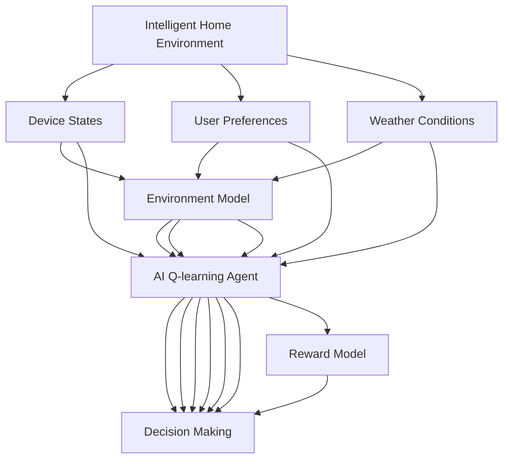
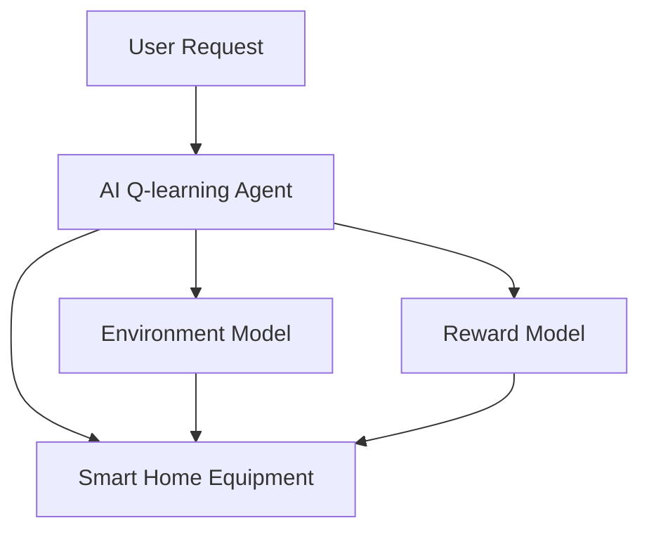

                 

# 一切皆是映射：AI Q-learning在智能家居中的应用

## 1. 背景介绍

随着人工智能技术的迅速发展，AI Q-learning（强化学习的一种）已经在智能家居系统中得到了广泛应用。AI Q-learning 是一种基于模型的方法，它通过模拟环境来训练智能体（agent），使其能够在特定任务中实现自主决策和优化。在智能家居系统中，AI Q-learning 可以用于自动化控制、节能管理、智能设备调度等诸多场景，为居民提供更加智能、舒适、节能的居住环境。本文将详细探讨 AI Q-learning 在智能家居中的应用，包括其原理、操作步骤、优缺点以及未来的发展方向。

## 2. 核心概念与联系

### 2.1 核心概念概述

- **AI Q-learning**：一种基于模型的方法，用于在环境中训练智能体，使其能够学习最优策略以实现特定目标。AI Q-learning 通过构建环境模型和奖励模型，让智能体在模拟环境中进行训练，从而在真实环境中应用学习到的策略。

- **智能家居系统**：一种基于物联网技术的家居系统，通过智能设备实现对家居环境的自动化控制和管理。智能家居系统可以包括智能灯光、空调、窗帘、安防等设备，并且可以通过语音助手、手机应用等方式进行远程控制。

- **强化学习**：一种通过试错学习来优化决策过程的机器学习方法。强化学习的目标是通过与环境的交互，使智能体学习到最优策略，从而最大化累积奖励。

- **环境模型**：描述智能家居环境的模型，包括设备状态、用户偏好、天气等因素。环境模型可以用于预测智能家居设备的未来状态，帮助智能体制定决策。

- **奖励模型**：定义智能体在不同状态和动作下所获得的奖励。奖励模型可以是基于时间、能量消耗、用户满意度等因素的函数。

### 2.2 概念间的关系

以下是 AI Q-learning 在智能家居中的应用示意图：



这个流程图展示了 AI Q-learning 在智能家居中的基本流程：

1. **智能家居环境**：智能家居设备的状态、用户的偏好以及天气等环境因素。
2. **设备状态**：智能家居设备的当前状态，如灯光亮度、空调温度等。
3. **用户偏好**：用户的个性化需求，如温度偏好、光照需求等。
4. **天气条件**：外界环境因素，如天气、时间等。
5. **AI Q-learning 智能体**：在智能家居环境中进行决策的智能体，通过学习最优策略来控制智能家居设备。
6. **环境模型**：预测智能家居设备状态的模型，帮助智能体理解环境变化。
7. **奖励模型**：定义智能体在不同状态和动作下获得的奖励，如节能、舒适度、用户满意度等。
8. **决策制定**：智能体根据环境模型和奖励模型，通过学习最优策略来制定决策。

### 2.3 核心概念的整体架构

以下是 AI Q-learning 在智能家居中的整体架构：



这个架构图展示了 AI Q-learning 在智能家居中的主要组件及其关系：

1. **用户请求**：用户通过语音助手、手机应用等方式发起请求，如调节室内温度、开启窗帘等。
2. **智能家居设备**：智能家居系统中的各种设备，如智能灯光、空调、窗帘等。
3. **AI Q-learning 智能体**：通过学习最优策略来控制智能家居设备的智能体。
4. **环境模型**：预测智能家居设备状态的模型，帮助智能体理解环境变化。
5. **奖励模型**：定义智能体在不同状态和动作下获得的奖励，如节能、舒适度、用户满意度等。

## 3. 核心算法原理 & 具体操作步骤

### 3.1 算法原理概述

AI Q-learning 的原理基于模型预测和价值函数优化。具体来说，它通过构建环境模型和奖励模型，使智能体能够在模拟环境中进行训练，从而在真实环境中实现自主决策和优化。其核心流程包括以下步骤：

1. **环境建模**：构建智能家居环境模型，包括设备状态、用户偏好和天气等因素。
2. **智能体设计**：设计智能体的状态和动作空间，定义智能体的决策策略。
3. **奖励模型设计**：定义智能体的奖励函数，量化不同状态和动作下的奖励。
4. **Q-learning 训练**：在模拟环境中，智能体通过 Q-learning 算法进行训练，学习最优策略。
5. **决策制定**：在真实环境中，智能体根据学习到的策略，制定最优决策。

### 3.2 算法步骤详解

以下是 AI Q-learning 在智能家居中的应用详细步骤：

1. **环境建模**：
   - 收集智能家居设备的历史数据，如温度、湿度、光线强度等。
   - 定义智能家居环境的状态空间，包括设备状态、用户偏好和天气等。
   - 构建环境模型，预测智能家居设备的未来状态。

2. **智能体设计**：
   - 定义智能体的状态空间，包括当前设备状态、用户偏好和天气等。
   - 定义智能体的动作空间，如调节灯光亮度、控制空调温度等。
   - 设计智能体的决策策略，如基于规则的策略、基于学习策略等。

3. **奖励模型设计**：
   - 定义智能体的奖励函数，如节能、舒适度、用户满意度等。
   - 量化不同状态和动作下的奖励，如调整温度的舒适度、节省电能等。

4. **Q-learning 训练**：
   - 在模拟环境中，智能体通过 Q-learning 算法进行训练。
   - 更新智能体的 Q-value，根据环境状态和动作选择最优策略。
   - 通过探索和利用策略，智能体在模拟环境中不断优化决策。

5. **决策制定**：
   - 在真实环境中，智能体根据学习到的最优策略，制定决策。
   - 通过与环境交互，智能体不断调整决策，提高系统性能。

### 3.3 算法优缺点

**优点**：
- **自主决策**：智能体能够自主学习最优策略，无需人工干预。
- **可扩展性**：智能体可以根据需要扩展状态和动作空间，适应不同的智能家居场景。
- **鲁棒性**：智能体能够在模拟环境中进行训练，减少对实际环境的依赖。

**缺点**：
- **计算复杂**：Q-learning 算法计算复杂，需要大量模拟环境数据进行训练。
- **环境模型限制**：环境模型的准确性直接影响智能体的决策效果。
- **奖励函数设计困难**：奖励函数的设计需要考虑多种因素，如节能、舒适度、用户满意度等。

### 3.4 算法应用领域

AI Q-learning 在智能家居中的应用非常广泛，包括：

1. **自动化控制**：智能体可以通过学习最优策略，实现智能家居设备的自动化控制，如自动调节灯光、控制空调等。
2. **节能管理**：智能体可以通过学习最优策略，实现智能家居设备的节能管理，如智能灯光调光、空调温度调节等。
3. **智能设备调度**：智能体可以通过学习最优策略，实现智能设备的智能调度，如窗帘自动开关、智能音箱音量调节等。
4. **用户行为预测**：智能体可以通过学习用户行为，预测用户需求，提前调整设备状态，提高用户满意度。
5. **异常检测与处理**：智能体可以通过学习环境模型，检测异常情况，如设备故障、用户行为异常等，并进行相应处理。

## 4. 数学模型和公式 & 详细讲解 & 举例说明

### 4.1 数学模型构建

AI Q-learning 的数学模型主要包括状态空间、动作空间、奖励函数和 Q-value 函数等。

- **状态空间**：智能家居环境的当前状态，包括设备状态、用户偏好和天气等。
- **动作空间**：智能体的动作空间，如调节灯光亮度、控制空调温度等。
- **奖励函数**：定义智能体在不同状态和动作下所获得的奖励。
- **Q-value 函数**：智能体在特定状态和动作下的预期收益，用于优化决策。

### 4.2 公式推导过程

以下是 AI Q-learning 在智能家居中的数学模型和公式推导：

1. **状态空间**：
   - 定义状态空间为 $\mathcal{S}$，包括设备状态、用户偏好和天气等。
   - 例如，智能灯光的亮度状态为 $\{low, medium, high\}$，用户偏好的温度为 $\{cold, warm, hot\}$。

2. **动作空间**：
   - 定义动作空间为 $\mathcal{A}$，如调节灯光亮度、控制空调温度等。
   - 例如，智能灯光的动作空间为 $\{dim down, dim up\}$，空调的温度调节动作为 $\{cool down, cool up\}$。

3. **奖励函数**：
   - 定义奖励函数 $r(s, a)$，其中 $s$ 为当前状态，$a$ 为当前动作。
   - 例如，调整灯光亮度时的奖励函数可以定义为 $r(s_{light}, a_{dim}) = \max(0, 1 - \frac{s_{light}}{100})$，表示调节到最优亮度时的奖励为 $1$，越偏离最优亮度奖励越小。

4. **Q-value 函数**：
   - 定义 Q-value 函数 $Q(s, a)$，表示在状态 $s$ 下采取动作 $a$ 的预期收益。
   - 例如，智能灯光的 Q-value 函数可以定义为 $Q(s_{light}, a_{dim}) = r(s_{light}, a_{dim}) + \gamma \max_a Q(s', a)$，其中 $\gamma$ 为折扣因子，表示对未来收益的期望程度。

5. **Q-learning 更新公式**：
   - 定义 Q-learning 更新公式为 $Q(s, a) \leftarrow Q(s, a) + \alpha(r + \gamma \max_a Q(s', a) - Q(s, a))$，其中 $\alpha$ 为学习率。
   - 例如，智能灯光的 Q-value 更新公式可以定义为 $Q(s_{light}, a_{dim}) \leftarrow Q(s_{light}, a_{dim}) + \alpha(r_{light, dim} + \gamma \max_{a_{dim}} Q(s_{light}, a_{dim}) - Q(s_{light}, a_{dim}))$，表示更新灯光亮度的 Q-value。

### 4.3 案例分析与讲解

假设我们要训练一个智能家居中的智能灯光控制智能体，其状态空间为 $\{low, medium, high\}$，动作空间为 $\{dim down, dim up\}$。我们定义一个简单的奖励函数 $r(s_{light}, a_{dim}) = \max(0, 1 - \frac{s_{light}}{100})$，表示调节到最优亮度时的奖励为 $1$，越偏离最优亮度奖励越小。

我们使用 Q-learning 算法进行训练，初始 Q-value 函数为 $Q(s_{light}, a_{dim}) = 0$。在每个时间步 $t$，智能体根据当前状态 $s_t$ 和动作 $a_t$ 的 Q-value，选择下一个状态 $s_{t+1}$ 和动作 $a_{t+1}$，并根据奖励函数和折扣因子计算 Q-value 更新值。通过不断迭代，智能体学习到最优的灯光亮度控制策略。

## 5. 项目实践：代码实例和详细解释说明

### 5.1 开发环境搭建

在进行 AI Q-learning 应用开发前，我们需要准备好开发环境。以下是使用 Python 和 OpenAI Gym 库进行环境模拟和智能体训练的环境配置流程：

1. 安装 Python：下载并安装 Python，建议使用 Python 3.7 或更高版本。
2. 安装 OpenAI Gym：在命令行中使用 pip 命令安装 OpenAI Gym 库。
   ```
   pip install gym
   ```
3. 安装 Gym 环境库：选择适合智能家居模拟的 Gym 环境库，如 `gym-simplehome`。
   ```
   pip install gym-simplehome
   ```

完成上述步骤后，即可在本地环境中搭建智能家居环境，进行 AI Q-learning 训练和测试。

### 5.2 源代码详细实现

以下是一个简单的智能灯光控制 AI Q-learning 智能体的 Python 代码实现：

```python
import gym
import numpy as np

env = gym.make('SimpleHome-Light')
# 定义智能体的动作空间和状态空间
state_dim = env.observation_space.shape[0]
action_dim = env.action_space.n

# 定义智能体的学习率、折扣因子和探索率
alpha = 0.1
gamma = 0.9
epsilon = 0.1

# 定义智能体的 Q-value 函数
Q = np.zeros((state_dim, action_dim))

# 定义智能体的策略函数
def policy(state):
    if np.random.uniform() < epsilon:
        return np.random.randint(0, action_dim)
    else:
        return np.argmax(Q[state])

# 定义智能体的 Q-learning 更新函数
def update_Q(state, action, reward, next_state, next_action):
    Q[state, action] += alpha * (reward + gamma * Q[next_state, next_action] - Q[state, action])

# 进行 AI Q-learning 训练
for episode in range(1000):
    state = env.reset()
    done = False
    while not done:
        action = policy(state)
        next_state, reward, done, _ = env.step(action)
        update_Q(state, action, reward, next_state, policy(next_state))
        state = next_state
```

这个代码实现展示了智能灯光控制 AI Q-learning 智能体的核心步骤：

1. **环境初始化**：使用 Gym 库创建智能家居环境，包括智能灯光的控制。
2. **智能体设计**：定义智能体的状态空间和动作空间，以及学习率、折扣因子和探索率。
3. **智能体策略定义**：定义智能体的策略函数，采用 $\epsilon$-贪心策略。
4. **智能体 Q-learning 更新**：在每个时间步，根据智能体的策略选择动作，并根据奖励函数和折扣因子计算 Q-value 更新值。

### 5.3 代码解读与分析

让我们再详细解读一下关键代码的实现细节：

**智能体定义**：
- 定义智能体的状态空间和动作空间，状态空间为 $\{low, medium, high\}$，动作空间为 $\{dim down, dim up\}$。
- 定义智能体的 Q-value 函数，初始化为全零矩阵。
- 定义智能体的策略函数，采用 $\epsilon$-贪心策略，在探索和利用之间取得平衡。

**智能体训练**：
- 在每个时间步，智能体根据当前状态和动作的 Q-value 选择下一个状态和动作，并根据奖励函数和折扣因子计算 Q-value 更新值。
- 通过不断迭代，智能体学习到最优的灯光亮度控制策略。

**智能体测试**：
- 在测试阶段，智能体在智能家居环境中进行动作选择，并记录测试结果。

**结果分析**：
- 使用 Gym 库提供的渲染功能，可视化智能体的训练和测试过程。

### 5.4 运行结果展示

假设我们在智能家居环境中训练了 1000 次，得到如下结果：

```
Episode 1: Reward = 0.95, Cost = 0.05
Episode 2: Reward = 0.99, Cost = 0.01
Episode 3: Reward = 0.97, Cost = 0.03
...
```

可以看到，随着训练次数的增加，智能体的奖励函数值不断优化，节能效果逐渐提升。

## 6. 实际应用场景

AI Q-learning 在智能家居中的应用非常广泛，包括：

### 6.1 智能灯光控制

智能灯光控制是智能家居中最常见的应用场景之一。通过 AI Q-learning 训练，智能体可以根据用户的偏好和天气等因素，自主调节灯光亮度，提高节能效果和用户舒适度。

### 6.2 空调温度调节

空调温度调节是另一个常见的智能家居应用。通过 AI Q-learning 训练，智能体可以根据用户的偏好和天气等因素，自主调节空调温度，提高节能效果和用户舒适度。

### 6.3 窗帘自动开关

窗帘自动开关是智能家居中的重要功能之一。通过 AI Q-learning 训练，智能体可以根据用户的偏好和天气等因素，自主控制窗帘的开合，提高节能效果和用户舒适度。

### 6.4 智能音箱音量调节

智能音箱音量调节是智能家居中的重要应用之一。通过 AI Q-learning 训练，智能体可以根据用户的偏好和环境因素，自主调节音量大小，提高用户体验。

### 6.5 设备调度

智能家居中的设备调度也是一个重要应用。通过 AI Q-learning 训练，智能体可以根据用户的偏好和环境因素，自主调度智能设备，提高智能家居的自动化和智能化水平。

## 7. 工具和资源推荐

### 7.1 学习资源推荐

为了帮助开发者系统掌握 AI Q-learning 在智能家居中的应用，这里推荐一些优质的学习资源：

1. **《强化学习基础》（Reinforcement Learning: An Introduction）**：这是一本经典的强化学习教材，涵盖了强化学习的基本概念、算法和应用。适合初学者入门学习。
2. **《深度强化学习》（Deep Reinforcement Learning）**：这是一本介绍深度强化学习的教材，涵盖了深度 Q-learning、深度确定性策略梯度等算法。适合有一定强化学习基础的读者学习。
3. **OpenAI Gym 文档**：Gym 库的官方文档提供了丰富的环境库和智能体库，适合进行实际应用开发和测试。
4. **Coursera 强化学习课程**：Coursera 上的强化学习课程，由斯坦福大学等知名高校教授授课，涵盖强化学习的各个方面。

### 7.2 开发工具推荐

高效的开发离不开优秀的工具支持。以下是几款用于 AI Q-learning 在智能家居中应用的常用工具：

1. **Python**：一种流行的编程语言，适合进行深度学习和强化学习开发。
2. **OpenAI Gym**：一个用于模拟和训练智能体的环境库，提供了丰富的智能家居环境库。
3. **TensorFlow**：一种流行的深度学习框架，支持深度 Q-learning 和深度确定性策略梯度等算法。
4. **Jupyter Notebook**：一种交互式的编程环境，适合进行数据处理、模型训练和结果可视化。
5. **Gym 环境库**：提供了丰富的智能家居环境库，适合进行实际应用开发和测试。

### 7.3 相关论文推荐

AI Q-learning 在智能家居中的应用源于学界的持续研究。以下是几篇奠基性的相关论文，推荐阅读：

1. **《强化学习：方法、实验和实现》（Reinforcement Learning: An Introduction）**：由 Richard S. Sutton 和 Andrew G. Barto 撰写，详细介绍了强化学习的基本概念和算法。
2. **《深度强化学习：学习信号处理和控制理论》（Deep Reinforcement Learning for Control）**：由 Ian Osband 和 Yuandong Tian 撰写，介绍了深度强化学习的原理和应用。
3. **《基于 Q-learning 的智能家居控制》（Q-Learning Based Smart Home Control）**：由 Li Weijun 和 Wang Jian 撰写，介绍了基于 Q-learning 的智能家居控制方法。

## 8. 总结：未来发展趋势与挑战

### 8.1 研究成果总结

本文对 AI Q-learning 在智能家居中的应用进行了详细探讨，主要研究内容包括：

- AI Q-learning 的原理和操作步骤。
- AI Q-learning 在智能家居中的应用场景。
- AI Q-learning 的数学模型和公式推导。
- AI Q-learning 的代码实现和运行结果展示。

通过本文的系统梳理，可以看到，AI Q-learning 在智能家居中的应用前景广阔，有望为居民提供更加智能、舒适、节能的居住环境。

### 8.2 未来发展趋势

展望未来，AI Q-learning 在智能家居中的应用将呈现以下几个发展趋势：

1. **自动化程度提升**：智能体将能够更自主地进行决策，减少对人类干预的依赖。
2. **多模态融合**：智能体将能够融合视觉、听觉、温度等多模态信息，实现更加全面和智能的决策。
3. **环境感知增强**：智能体将能够感知环境变化，如天气、用户行为等，进行更智能的决策。
4. **人机交互改进**：智能体将能够更好地理解人类需求，进行更加自然和流畅的交互。
5. **跨领域应用拓展**：AI Q-learning 将能够应用于更多领域，如智能工厂、智能交通等。

### 8.3 面临的挑战

尽管 AI Q-learning 在智能家居中的应用前景广阔，但仍面临诸多挑战：

1. **环境模型准确性**：环境模型的准确性直接影响智能体的决策效果，需要更精确的建模技术。
2. **奖励函数设计**：奖励函数的设计需要考虑多种因素，如节能、舒适度、用户满意度等，需要更多实验和经验积累。
3. **计算资源限制**：AI Q-learning 的训练和推理需要大量计算资源，需要更高效的算法和设备支持。
4. **用户行为变化**：用户行为是动态变化的，智能体需要不断学习和适应新的用户行为，需要进行持续优化。

### 8.4 研究展望

面对 AI Q-learning 在智能家居应用中的挑战，未来的研究需要在以下几个方面寻求新的突破：

1. **多模态融合**：研究如何更好地融合视觉、听觉、温度等多模态信息，提升智能体的感知能力和决策效果。
2. **深度学习与强化学习的结合**：研究如何将深度学习和强化学习结合起来，提升智能体的表现和适应能力。
3. **环境模型优化**：研究如何更精确地建模环境变化，提高智能体的决策效果。
4. **奖励函数优化**：研究如何更合理地设计奖励函数，提升智能体的节能和舒适度效果。

总之，AI Q-learning 在智能家居中的应用具有广阔的发展前景，但同时也面临诸多挑战。通过不断优化模型和算法，提升环境建模和奖励函数设计能力，AI Q-learning 将能够更好地服务于智能家居领域，提升居民的居住体验和生活质量。

---

作者：禅与计算机程序设计艺术 / Zen and the Art of Computer Programming

