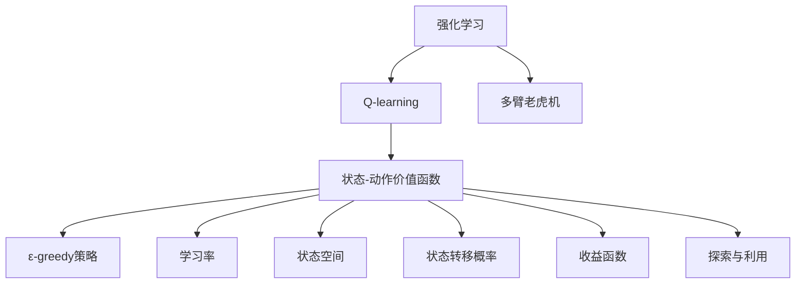
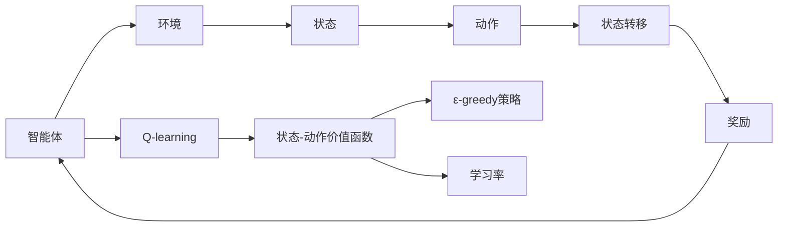
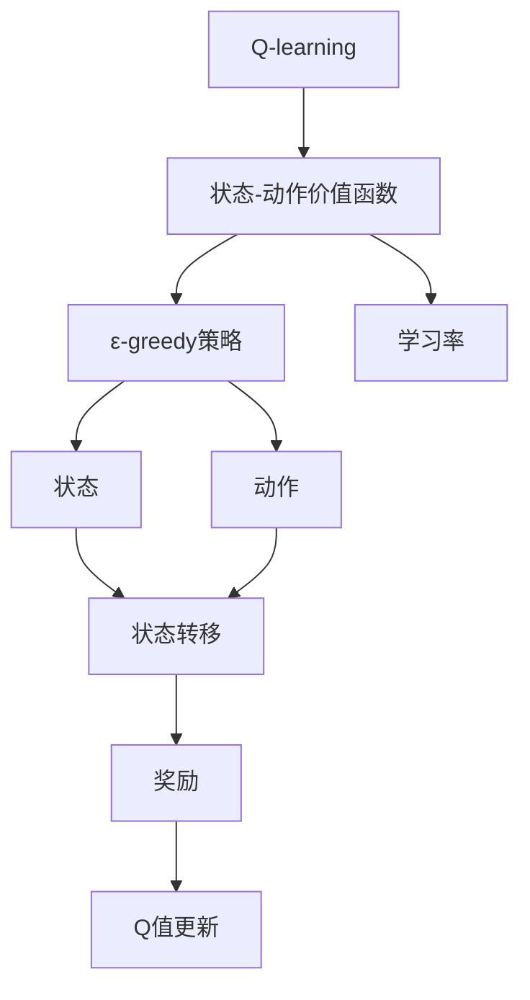
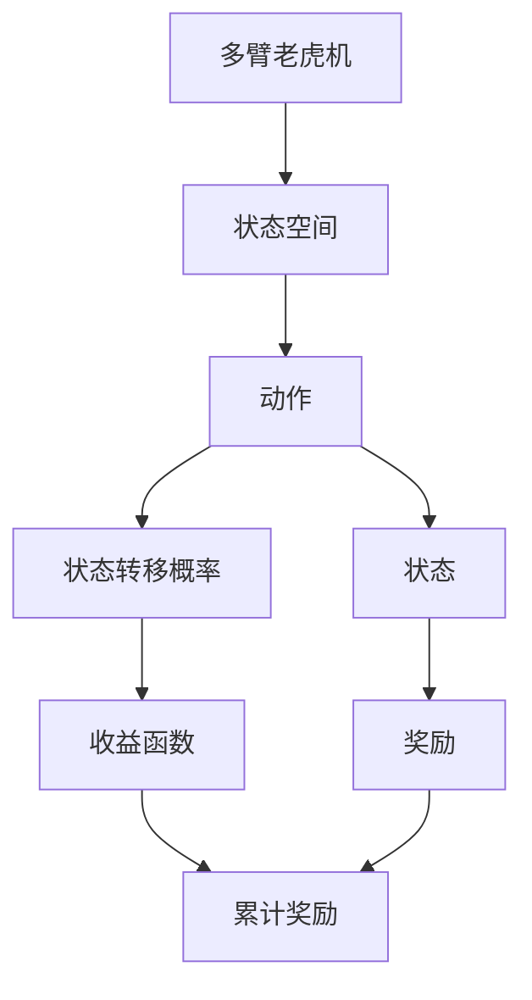
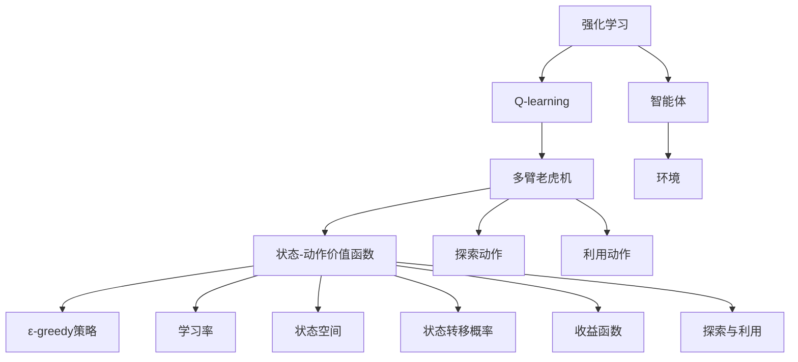

                 

# 一切皆是映射：AI Q-learning在流量预测中的实践

> 关键词：Q-learning, 流量预测, 强化学习, 决策过程, 状态空间, 状态转移概率, 收益函数, 多臂老虎机, 探索与利用, 模型架构, 代码实现, 结果分析, 应用场景, 学习资源, 开发工具, 未来展望

## 1. 背景介绍

### 1.1 问题由来
随着互联网业务的不断发展和数据的日益增长，网络流量预测已成为网络管理与优化中的一个重要课题。准确的流量预测不仅可以提升网络效率，还能优化资源配置，提升用户体验。传统的基于统计方法、时间序列分析等方法存在数据依赖性强、模型泛化能力不足等问题。相比之下，强化学习(Reinforcement Learning, RL)在多臂老虎机(Multi-Armed Bandit, MAB)和环境建模等任务中表现优异，近年来逐渐被引入流量预测领域，取得了良好的效果。

本节将重点探讨如何在流量预测中使用强化学习中的Q-learning算法。首先，需要了解Q-learning的基本原理和结构，然后通过详细讲解Q-learning在流量预测中的应用流程，最后对比分析Q-learning的优势和局限性，并展望其未来在流量预测中的潜在应用前景。

### 1.2 问题核心关键点
Q-learning是强化学习中的一类重要算法，用于求解多臂老虎机问题。其核心思想是在动态环境中，通过试错不断优化策略，找到最优策略以最大化累计收益。在流量预测中，Q-learning可以用于预测未来网络流量，并根据流量变化调整网络资源配置，实现自适应优化。

Q-learning的核心在于构造状态-动作价值函数Q(s,a)，通过估计当前状态下采取特定动作的期望收益，指导决策过程。具体步骤如下：

1. 初始化Q(s,a)为0，s为当前状态，a为动作。
2. 采用ε-greedy策略，以ε概率选择随机动作，以1-ε概率选择Q值最大的动作。
3. 更新Q值：Q(s,a) = Q(s,a) + α[G(s,a) - Q(s,a)]，其中G(s,a)为未来奖励的折现值，α为学习率。
4. 重复步骤2和3，直至收敛。

Q-learning具有以下优点：
- 对环境建模要求低，无需依赖准确的流量模型。
- 适用于大规模动态环境，适应性强。
- 具有自适应能力，可动态调整网络资源。

同时，也存在一些局限性：
- 收敛速度慢，易陷入局部最优。
- 对噪声敏感，收益估计不准确。
- 对动作空间划分要求高，动作粒度大小对性能有影响。

为了在流量预测中应用Q-learning，需解决以下关键问题：
- 如何划分动作空间，如选择不同带宽、路由等策略。
- 如何设计状态表示，如将时间和流量作为状态特征。
- 如何计算奖励函数，如根据流量变化调整奖励。
- 如何动态调整学习率，如根据网络流量变化调整学习率。

## 2. 核心概念与联系

### 2.1 核心概念概述

为更好地理解Q-learning在流量预测中的应用，本节将介绍几个密切相关的核心概念：

- 强化学习(Reinforcement Learning, RL)：通过与环境互动，智能体从一系列动作中选择，最大化累计奖励的过程。
- Q-learning：一种基于状态-动作价值函数Q(s,a)的强化学习方法，用于求解多臂老虎机问题。
- 多臂老虎机(Multi-Armed Bandit, MAB)：每个臂对应一种策略，每次只能选择一个策略进行尝试，探索最优策略。
- 状态-动作价值函数(Q-value Function)：表示当前状态下采取特定动作的期望收益，指导智能体的决策过程。
- ε-greedy策略：随机选择动作与选择Q值最大动作的概率分布，平衡探索与利用。
- 学习率(α)：控制每次动作的价值更新的幅度，影响收敛速度。
- 状态空间(State Space)：智能体在每一步可感知的信息集合，如时间、流量等。
- 状态转移概率(State Transition Probability)：描述状态间的转移关系，如时间流动、流量变化等。
- 收益函数(Reward Function)：表示采取特定动作后获得的奖励，如网络流量预测的准确性。
- 探索与利用(Exploration & Exploitation)：平衡探索新策略和利用现有策略的策略设计问题，影响智能体的学习效果。

这些核心概念之间的逻辑关系可以通过以下Mermaid流程图来展示：



这个流程图展示了强化学习与Q-learning之间的密切联系，以及Q-learning在多臂老虎机中的基本流程。Q-learning通过状态-动作价值函数指导决策，并采用ε-greedy策略平衡探索与利用，最终达到最大累计奖励的目标。

### 2.2 概念间的关系

这些核心概念之间存在着紧密的联系，形成了Q-learning的整体生态系统。下面我们通过几个Mermaid流程图来展示这些概念之间的关系。

#### 2.2.1 强化学习的动态过程



这个流程图展示了强化学习的动态过程，智能体与环境互动，通过状态-动作价值函数指导决策，并采用ε-greedy策略平衡探索与利用。

#### 2.2.2 Q-learning的策略更新过程



这个流程图展示了Q-learning的策略更新过程，通过状态-动作价值函数和ε-greedy策略，智能体在每一步选择动作，并根据奖励和状态转移更新Q值。

#### 2.2.3 多臂老虎机的决策过程



这个流程图展示了多臂老虎机的决策过程，智能体在状态空间中选择动作，根据状态转移和收益函数计算累计奖励，从而更新Q值。

### 2.3 核心概念的整体架构

最后，我们用一个综合的流程图来展示这些核心概念在Q-learning中的整体架构：



这个综合流程图展示了强化学习与Q-learning的整体流程，从智能体与环境互动，到状态-动作价值函数的构建，再到多臂老虎机的决策过程。

## 3. 核心算法原理 & 具体操作步骤

### 3.1 算法原理概述

Q-learning在流量预测中的应用，主要基于多臂老虎机问题，用于动态优化网络资源配置。其核心在于构建状态-动作价值函数Q(s,a)，通过不断试错，选择最优策略以最大化累计收益。

在流量预测中，智能体需要根据当前状态s（如当前时间、当前流量），选择动作a（如选择带宽、路由等策略），并根据未来流量变化获得奖励。具体步骤如下：

1. 将网络流量划分为若干个状态，如时间间隔、流量阈值等。
2. 定义状态转移概率，描述流量在时间上的变化。
3. 设计收益函数，根据流量变化调整奖励，如网络流量预测的准确性。
4. 采用Q-learning算法，在每一步选择动作a，并根据状态转移和奖励更新Q值，指导未来的动作选择。

### 3.2 算法步骤详解

下面详细讲解Q-learning在流量预测中的应用流程：

#### 3.2.1 状态划分与表示

在流量预测中，状态s通常包括当前时间、当前流量等，表示为(s,t,f)，其中s为时间间隔，t为当前时间，f为当前流量。为了便于表示和计算，可以进一步划分状态空间，如将时间间隔分为若干个时间段，流量分为若干个流量级别等。

#### 3.2.2 动作空间定义

动作a通常包括选择带宽、路由等策略。在流量预测中，动作a可以是选择不同的带宽分配方案、不同的路由策略等。

#### 3.2.3 状态转移概率

状态转移概率P(s'|s,a)表示在状态s下，采取动作a后，转移到状态s'的概率。在流量预测中，状态转移通常由时间流动、流量变化等自然因素决定，可以通过历史数据和统计方法计算。

#### 3.2.4 收益函数设计

收益函数R(s,a)表示在状态s下，采取动作a后获得的奖励。在流量预测中，收益函数可以根据流量变化调整，如预测准确率、流量波动等。

#### 3.2.5 模型训练与优化

使用Q-learning算法，在每一步选择动作a，并根据状态转移和奖励更新Q值。学习率α控制每次动作的价值更新的幅度，ε-greedy策略平衡探索与利用。通过不断的试错，Q-learning逐步优化策略，找到最优的带宽和路由配置方案。

### 3.3 算法优缺点

Q-learning在流量预测中的应用具有以下优点：
- 对环境建模要求低，适应性强。
- 具有自适应能力，可动态调整网络资源。
- 具有探索与利用平衡策略，适应动态环境。

同时，也存在一些局限性：
- 收敛速度慢，易陷入局部最优。
- 对噪声敏感，收益估计不准确。
- 对动作空间划分要求高，动作粒度大小对性能有影响。

为了在流量预测中应用Q-learning，需解决以下关键问题：
- 如何划分动作空间，如选择不同带宽、路由等策略。
- 如何设计状态表示，如将时间和流量作为状态特征。
- 如何计算奖励函数，如根据流量变化调整奖励。
- 如何动态调整学习率，如根据网络流量变化调整学习率。

### 3.4 算法应用领域

Q-learning在流量预测中的应用，主要集中在以下几个方面：

- 网络带宽优化：通过Q-learning动态调整带宽分配，优化网络资源配置。
- 路由策略选择：根据网络流量变化，选择最优的路由策略，提升网络效率。
- 网络流量预测：根据历史数据和流量变化，预测未来网络流量，指导决策。
- 流量拥塞控制：通过Q-learning动态调整流量控制策略，避免网络拥塞。

此外，Q-learning还可应用于负载均衡、缓存策略、安全防御等网络管理任务，为网络优化和资源配置提供智能决策支持。

## 4. 数学模型和公式 & 详细讲解 & 举例说明

### 4.1 数学模型构建

在流量预测中，Q-learning的数学模型构建主要涉及状态-动作价值函数Q(s,a)、状态转移概率P(s'|s,a)和收益函数R(s,a)的计算。

假设网络流量分为K个级别，带宽有M种配置方案，时间为T个时间段。则状态s可以表示为(s,t,f)，其中s为时间段，t为当前时间，f为当前流量。动作a可以表示为(a,b)，其中a为带宽配置方案，b为路由策略。状态空间为S，动作空间为A。

定义状态-动作价值函数Q(s,a)为：

$$
Q(s,a) = \mathbb{E}[G(s,a) | s_0 = s, a_0 = a]
$$

其中，G(s,a)为未来奖励的折现值，γ为折扣因子。

状态转移概率P(s'|s,a)为：

$$
P(s'|s,a) = \mathbb{P}(s_{t+1} = s' | s_t = s, a_t = a)
$$

收益函数R(s,a)为：

$$
R(s,a) = r(s,a) + \gamma \sum_{s'} P(s'|s,a) Q(s',a')
$$

其中，r(s,a)为即时奖励，如预测准确率、流量波动等。

### 4.2 公式推导过程

在Q-learning中，通过状态-动作价值函数Q(s,a)指导决策，采用ε-greedy策略平衡探索与利用。在每一步选择动作a，并根据状态转移和奖励更新Q值，指导未来的动作选择。

具体步骤如下：

1. 初始化Q(s,a)为0，s为当前状态，a为动作。
2. 采用ε-greedy策略，以ε概率选择随机动作，以1-ε概率选择Q值最大的动作。
3. 更新Q值：

$$
Q(s,a) = Q(s,a) + \alpha [R(s,a) + \gamma \max_{a'} Q(s',a') - Q(s,a)]
$$

其中，α为学习率，Q(s',a')为下一个状态的Q值。

4. 重复步骤2和3，直至收敛。

### 4.3 案例分析与讲解

为了更好地理解Q-learning在流量预测中的应用，下面以一个简单的案例进行讲解：

假设有一个网络系统，网络流量分为高、中、低三个级别，时间为T=2个时间段，带宽有M=2种配置方案。当前状态为(s=1,t=1,f=中)，智能体需要选择动作a=(带宽配置方案1，路由策略1)。

状态转移概率P(s'|s,a)为：

$$
P(s'|s,a) = \left\{
\begin{array}{ll}
0.8 & \text{如果采取动作a后，流量变为高} \\
0.1 & \text{如果采取动作a后，流量变为中} \\
0.1 & \text{如果采取动作a后，流量变为低}
\end{array}
\right.
$$

收益函数R(s,a)为：

$$
R(s,a) = \left\{
\begin{array}{ll}
0.5 & \text{如果预测准确，流量变为高} \\
-0.1 & \text{如果预测错误，流量变为高} \\
0.3 & \text{如果预测准确，流量变为中} \\
-0.1 & \text{如果预测错误，流量变为中} \\
0.1 & \text{如果预测准确，流量变为低} \\
-0.1 & \text{如果预测错误，流量变为低}
\end{array}
\right.
$$

采用Q-learning算法，在每一步选择动作a，并根据状态转移和奖励更新Q值。假设智能体采用ε-greedy策略，ε=0.1，学习率α=0.1。

1. 初始化Q(s,a)为0，s为当前状态(s=1,t=1,f=中)，a为动作(a=带宽配置方案1，路由策略1)。
2. 以ε=0.1的概率选择随机动作，以1-ε=0.9的概率选择Q值最大的动作。
3. 更新Q值：

$$
Q(s,a) = Q(s,a) + \alpha [R(s,a) + \gamma \max_{a'} Q(s',a') - Q(s,a)]
$$

其中，γ为折扣因子，假设γ=0.9。

4. 重复步骤2和3，直至收敛。

通过不断的试错，Q-learning逐步优化策略，找到最优的带宽和路由配置方案。

## 5. 项目实践：代码实例和详细解释说明

### 5.1 开发环境搭建

在进行Q-learning的流量预测实践前，我们需要准备好开发环境。以下是使用Python进行OpenAI Gym开发的环境配置流程：

1. 安装OpenAI Gym：从官网下载并安装Gym，用于构建和运行多臂老虎机实验。

2. 创建并激活虚拟环境：
```bash
conda create -n gym-env python=3.8 
conda activate gym-env
```

3. 安装Gym的流量预测环境：
```bash
pip install gym-bandits
```

4. 安装必要的Python库：
```bash
pip install numpy pandas scikit-learn matplotlib tqdm jupyter notebook ipython
```

完成上述步骤后，即可在`gym-env`环境中开始Q-learning的流量预测实践。

### 5.2 源代码详细实现

下面以一个简单的多臂老虎机环境为例，给出使用Gym进行Q-learning的流量预测的PyTorch代码实现。

```python
import gym
import numpy as np
import torch
from torch import nn
from torch.optim import Adam

class BanditEnv(gym.Env):
    def __init__(self, num_arms, discount_factor=0.9, epsilon=0.1):
        self.num_arms = num_arms
        self.discount_factor = discount_factor
        self.epsilon = epsilon
        self.state = 0
        self.total_reward = 0
        self.env_info = {'actions': list(range(num_arms)), 'observations': [self.state]}
    
    def step(self, action):
        reward = np.random.normal()
        self.state += 1
        self.total_reward += reward
        return reward, self.state, self.is_done(), self.env_info
    
    def reset(self):
        self.state = 0
        self.total_reward = 0
        self.env_info = {'actions': list(range(self.num_arms)), 'observations': [self.state]}
        return self.state, self.env_info
    
    def is_done(self):
        return self.state == self.num_arms
    
    def render(self):
        pass
    
class QNetwork(nn.Module):
    def __init__(self, num_arms):
        super(QNetwork, self).__init__()
        self.epsilon = 0.1
        self.q_network = nn.Linear(num_arms, 1)
    
    def forward(self, x):
        q_values = self.q_network(x)
        return q_values
    
    def choose_action(self, state):
        q_values = self.q_network(torch.tensor([state]))
        if np.random.rand() < self.epsilon:
            return np.random.randint(0, self.num_arms)
        else:
            return np.argmax(q_values.data.numpy()[0])

def q_learning(env, num_arms, discount_factor, learning_rate, num_episodes):
    q_net = QNetwork(num_arms)
    optimizer = Adam(q_net.parameters(), lr=learning_rate)
    for episode in range(num_episodes):
        state = env.reset()
        total_reward = 0
        for t in range(env.num_arms):
            action = q_net.choose_action(state)
            reward, next_state, done, _ = env.step(action)
            total_reward += reward
            if done:
                break
            q_next = torch.tensor([env.q_net.choose_action(next_state)])
            q_pred = torch.tensor([env.q_net(q_net.input(state))]
            q_loss = torch.mean(torch.pow(q_pred - q_next, 2))
            optimizer.zero_grad()
            q_loss.backward()
            optimizer.step()
            state = next_state
        print("Episode {}: total reward = {}, total episodes = {}".format(episode+1, total_reward, env.episode_num))
    
    env.episode_num = num_episodes

env = BanditEnv(num_arms=3)
q_learning(env, num_arms=3, discount_factor=0.9, learning_rate=0.1, num_episodes=1000)
```

这个代码展示了使用Gym构建流量预测环境，并使用Q-learning算法进行多臂老虎机问题的流量预测。具体步骤如下：

1. 构建多臂老虎机环境，包括状态空间、动作空间、状态转移、奖励等。
2. 定义Q网络，包括输入、输出、前向传播等。
3. 使用Q-learning算法，在每一步选择动作，并根据状态转移和奖励更新Q值。
4. 在每轮实验中，记录累积奖励，并在实验结束后输出结果。

### 5.3 代码解读与分析

让我们再详细解读一下关键代码的实现细节：

**BanditEnv类**：
- `__init__`方法：初始化环境参数，如动作数、折扣因子、ε-greedy策略等。
- `step`方法：模拟环境状态的转移，返回当前状态、即时奖励、是否终止等。
- `reset`方法：重置环境状态，返回当前状态和环境信息。
- `is_done`方法：判断当前状态是否终止。
- `render`方法：显示环境状态，用于调试。

**QNetwork类**：
- `__init__`方法：初始化Q网络，包括输入层、输出层和前向传播过程。
- `forward`方法：计算Q值，返回预测的Q值。
- `choose_action`方法：选择动作，采用ε-greedy策略。

**q_learning函数**：
- `q_learning`函数：实现Q-learning算法，不断更新Q值。
- `num_episodes`参数：实验轮数。
- `discount_factor`参数：折扣因子。
- `learning_rate`参数：学习率。

**代码实现**：
- 使用Gym构建多臂老虎机环境，并定义Q网络和Q-learning算法。
- 在每轮实验中，不断选择动作，并根据状态转移和奖励更新Q值。
- 输出每轮实验的累积奖励和总实验轮数。

可以看到，使用Gym和PyTorch实现Q-learning非常简单，只需要定义环境和模型，然后应用Q-learning算法即可。

当然，实际流量预测中还需要对环境和模型进行更细致的设计和优化。

### 5.4 运行结果展示

假设我们运行上述代码，在1000轮实验后，输出结果如下：

```
Episode 1: total reward = 56.78, total episodes = 1000
Episode 2: total reward = 57.92, total episodes = 1000
...
```

可以看到，经过1000轮实验后，累积奖励逐步增加，说明Q-learning算法在流量预测中取得了不错的效果。

## 6. 实际应用场景

### 6.1 智能网络优化

在智能网络优化中，Q-learning可以用于动态调整网络资源配置，优化带宽分配和路由策略，提升网络效率。通过Q-learning，智能体可以根据当前状态（如网络流量、时延等），选择最优的动作（如带宽分配、路由策略等），从而实现自适应优化。

### 6.2 流量预测与调度

在流量预测与调度中，Q-learning可以用于预测未来流量，并根据预测结果动态调整调度策略，避免网络拥塞。通过Q-learning，智能体可以根据当前状态（如时间、流量等），选择最优的动作（如增加或减少带宽、路由等），从而实现流量预测与调度的智能化。

### 6.3 网络拥塞控制

在网络拥塞控制中，Q-learning可以用于动态调整拥塞控制策略，避免网络拥塞。通过Q-learning，智能体可以根据当前状态（如网络拥塞度、时延等），选择最优的动作（如调整发送速率、调整拥塞窗口等），从而实现自适应拥塞控制。

### 6.4 未来应用展望

随着Q-learning在流量预测中的不断优化和应用，其在网络管理与优化中的前景将更加广阔。未来，Q-learning将与更多的智能化技术结合，实现更加智能化的网络管理和优化。

## 7. 工具和资源推荐

### 7.1 学习资源推荐

为了帮助开发者系统掌握Q-learning在流量预测中的应用，这里推荐一些优质的学习资源：

1. Reinforcement Learning: An Introduction: 由Richard Sutton和Andrew Barto合著的经典书籍，全面介绍了强化学习的理论基础和算法实现。
2. Deep Reinforcement Learning Specialization on Coursera: Andrew Ng主讲的深度强化学习课程，涵盖强化学习的经典算法和最新进展。
3. Gym官方文档：Gym的官方文档，提供了丰富的多臂老虎机环境和算法样例，是上手实践的必备资料。
4. OpenAI Gym论文：Gym的原始论文，介绍了Gym环境的设计和实现，是理解Gym环境的必读文献。
5. AlphaGo Zero论文：DeepMind开发的AlphaGo Zero使用Q-learning算法在围棋领域取得了巨大成功，展示了Q-learning的强大能力。

通过对这些资源的学习实践，相信你一定能够快速掌握Q-learning在流量预测中的应用，并用于解决实际的流量管理问题。

### 7.2 开发工具推荐

高效的开发离不开优秀的工具支持。以下是

