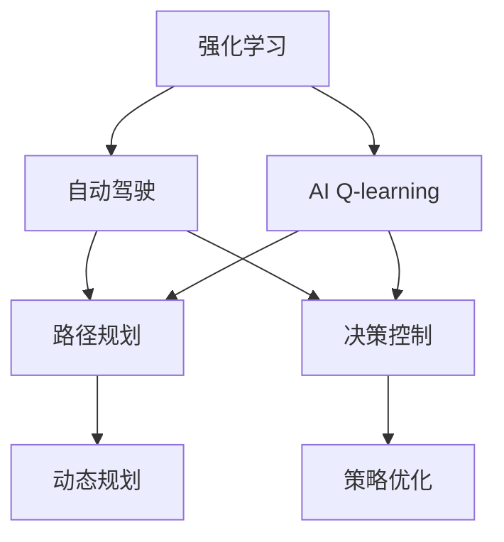
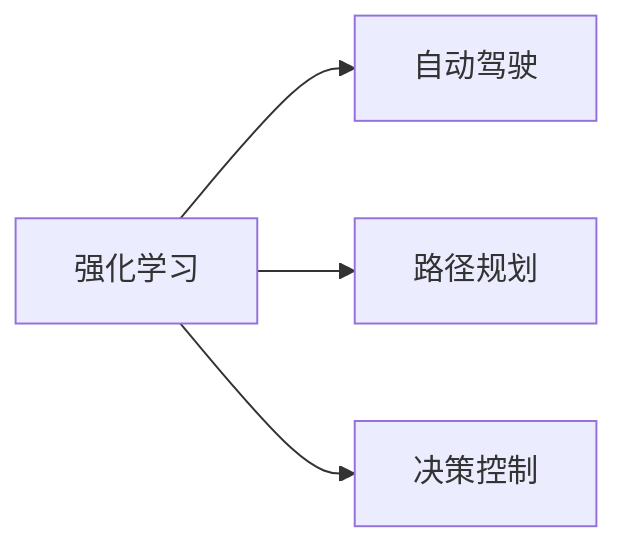
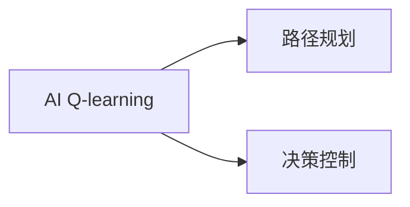
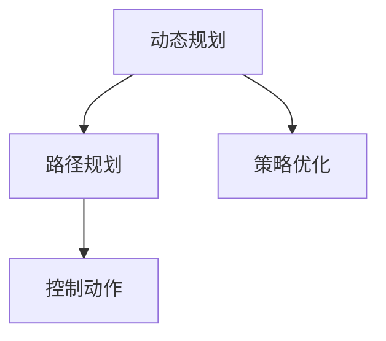
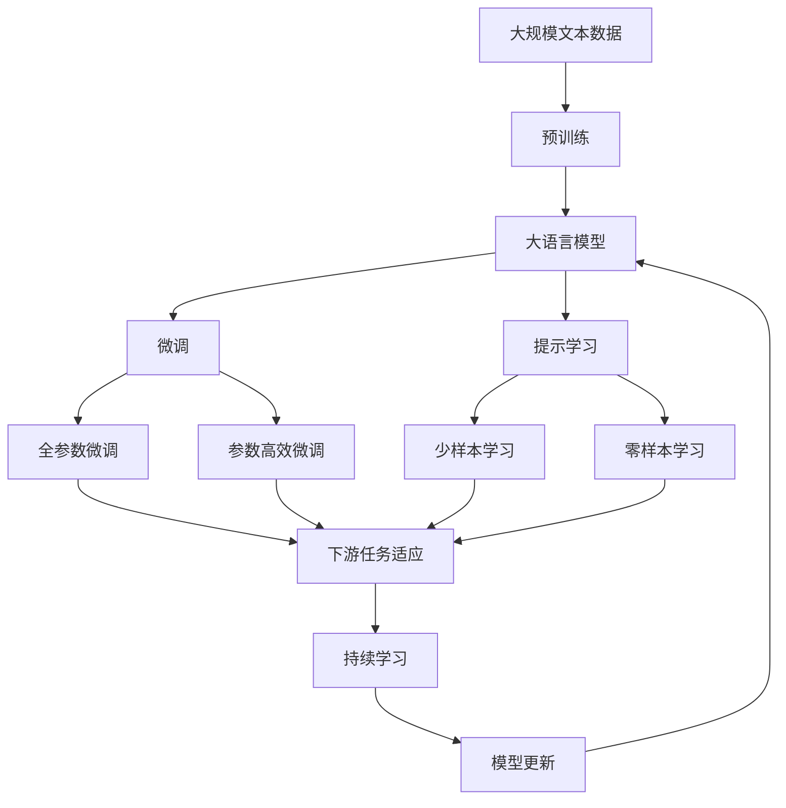

                 

# 一切皆是映射：AI Q-learning在自动驾驶中的应用

> 关键词：
> Q-learning, 强化学习, 自动驾驶, 动态规划, 策略优化, 轨迹规划, 模型驱动, 数据驱动

## 1. 背景介绍

### 1.1 问题由来

自动驾驶技术近年来在各行各业引起了广泛关注，被认为是未来汽车发展的方向。自动驾驶技术涉及计算机视觉、传感器融合、路径规划、决策控制等多个关键环节，其中路径规划和决策控制是实现自主驾驶的核心。

传统自动驾驶中的路径规划，主要采用基于规则或经验的模型驱动方法，通过专家经验建立决策规则，指导车辆在复杂交通环境中安全行驶。然而，这些方法难以应对实时动态的交通环境，无法适应复杂的驾驶场景，容易导致安全问题。

为了解决这些问题，强化学习(Reinforcement Learning, RL)被引入自动驾驶路径规划和决策控制领域。强化学习是一种通过环境反馈不断优化行为策略的机器学习方法，其核心思想是“以结果为导向”，即最大化奖励函数。与模型驱动方法不同，强化学习方法能够灵活应对各种动态的驾驶场景，从而实现更高效、更安全的自动驾驶。

### 1.2 问题核心关键点

强化学习在自动驾驶中的应用，主要包括以下几个关键点：

1. 强化学习环境建模：构建包含交通环境、车辆状态、控制动作等要素的动态模型，为自动驾驶行为决策提供基础。
2. Q-learning算法：利用动态模型，通过不断试错优化路径规划和决策控制的策略，实现高效、安全的驾驶行为。
3. 轨迹优化：通过动态规划方法，在路径规划和决策控制中引入时间维度，优化路径选择和控制动作，提升行驶效率和安全性。
4. 策略评估与优化：利用模型驱动和数据驱动方法相结合，对强化学习策略进行评估和优化，提升自动驾驶系统的性能。

这些关键点紧密相连，共同构成了自动驾驶强化学习的核心框架，为实现智能驾驶提供了技术支撑。

### 1.3 问题研究意义

强化学习在自动驾驶中的应用，具有重要意义：

1. 提升自动驾驶安全性：强化学习能够灵活应对各种复杂驾驶场景，通过不断学习优化驾驶策略，降低事故发生的概率。
2. 提升自动驾驶效率：通过动态规划和轨迹优化，强化学习能够实现更高效的路径规划和控制，减少交通拥堵和能源浪费。
3. 推动自动驾驶产业化：强化学习提供了一种高效、灵活的自动驾驶技术路径，促进了自动驾驶技术的落地应用和产业化进程。
4. 加速自动驾驶算法创新：强化学习引入了一种全新的算法设计思路，推动了自动驾驶领域在路径规划、决策控制等方面的技术创新。
5. 优化人机交互体验：强化学习通过优化自动驾驶行为，改善了人机交互体验，提升了用户对自动驾驶技术的接受度和满意度。

## 2. 核心概念与联系

### 2.1 核心概念概述

为更好地理解AI Q-learning在自动驾驶中的应用，本节将介绍几个密切相关的核心概念：

- AI Q-learning: 一种基于价值迭代（Value Iteration）的强化学习算法，通过不断优化状态值函数，学习最优的策略函数，实现路径规划和决策控制。
- 强化学习（Reinforcement Learning, RL）: 一种通过环境反馈不断优化行为策略的机器学习方法，强调“以结果为导向”，最大化奖励函数。
- 自动驾驶（Autonomous Driving）: 通过传感器、摄像头、激光雷达等设备感知环境，结合AI技术实现车辆自主导航和决策控制。
- 动态规划（Dynamic Programming）: 一种基于最优子结构和贝尔曼方程（Bellman Equation）的算法设计方法，通过时间维度优化路径规划和控制动作。
- 策略优化（Strategy Optimization）: 利用AI方法优化自动驾驶路径规划和决策控制策略，提升系统性能。

这些核心概念之间的逻辑关系可以通过以下Mermaid流程图来展示：



这个流程图展示了一些核心概念的关系和作用：

1. 强化学习是AI Q-learning的基础，通过环境反馈不断优化策略。
2. AI Q-learning是自动驾驶中路径规划和决策控制的算法之一，用于学习最优策略。
3. 自动驾驶涉及路径规划和决策控制，AI Q-learning用于优化这两个环节。
4. 动态规划是一种路径规划和控制动作优化的方法，用于提高路径规划和决策控制的效率。
5. 策略优化通过AI方法提升自动驾驶系统性能，是路径规划和决策控制的重要环节。

### 2.2 概念间的关系

这些核心概念之间存在着紧密的联系，构成了自动驾驶强化学习的完整生态系统。下面我通过几个Mermaid流程图来展示这些概念之间的关系。

#### 2.2.1 强化学习与自动驾驶



这个流程图展示了强化学习在自动驾驶中的应用，通过优化路径规划和决策控制，提升自动驾驶系统的性能。

#### 2.2.2 AI Q-learning与路径规划和决策控制



这个流程图展示了AI Q-learning在自动驾驶路径规划和决策控制中的应用，通过不断优化策略，提升系统性能。

#### 2.2.3 动态规划与策略优化



这个流程图展示了动态规划和策略优化在路径规划和控制动作中的应用，通过优化路径选择和控制动作，提高系统效率和安全性。

### 2.3 核心概念的整体架构

最后，我们用一个综合的流程图来展示这些核心概念在大语言模型微调过程中的整体架构：



这个综合流程图展示了从预训练到微调，再到持续学习的完整过程。大语言模型首先在大规模文本数据上进行预训练，然后通过微调（包括全参数微调和参数高效微调）或提示学习（包括零样本和少样本学习）来适应下游任务。最后，通过持续学习技术，模型可以不断更新和适应新的任务和数据。 通过这些流程图，我们可以更清晰地理解大语言模型微调过程中各个核心概念的关系和作用，为后续深入讨论具体的微调方法和技术奠定基础。

## 3. 核心算法原理 & 具体操作步骤
### 3.1 算法原理概述

AI Q-learning是一种基于价值迭代的强化学习算法，其核心思想是通过不断优化状态值函数（Value Function），学习最优的策略函数（Policy Function），实现路径规划和决策控制。其基本流程如下：

1. 构建环境模型：定义自动驾驶环境的状态空间、动作空间、奖励函数，构建动态模型。
2. 初始化策略：随机初始化策略函数，表示车辆在当前状态下可能的动作选择。
3. 策略评估：利用状态值函数（Value Function）评估当前策略的性能，通过值迭代（Value Iteration）更新策略函数。
4. 策略优化：通过奖励函数和状态值函数，优化策略函数，实现路径规划和决策控制的策略。

通过不断的策略评估和优化，AI Q-learning能够逐步学习到最优的策略函数，实现高效、安全的自动驾驶。

### 3.2 算法步骤详解

AI Q-learning的具体实现步骤如下：

**Step 1: 环境建模**
- 定义状态空间（S）：包括车辆位置、速度、方向、周围环境状态等。
- 定义动作空间（A）：包括加速度、转向角度、制动等控制动作。
- 定义奖励函数（R）：奖励函数为负对数似然，表示车辆在当前状态下采取的行动与期望动作之间的差异。

**Step 2: 策略初始化**
- 初始化策略函数（π）：随机初始化策略函数，表示车辆在当前状态下可能的动作选择。

**Step 3: 策略评估**
- 定义状态值函数（V）：状态值函数用于评估当前策略的性能。
- 利用动态规划算法，通过值迭代（Value Iteration）更新状态值函数。

**Step 4: 策略优化**
- 利用奖励函数和状态值函数，优化策略函数。
- 通过策略评估和优化，不断更新策略函数，直至收敛。

**Step 5: 测试与部署**
- 在测试集上评估优化后的策略性能。
- 部署到实际自动驾驶系统，进行动态调整和优化。

### 3.3 算法优缺点

AI Q-learning作为强化学习的一种，具有以下优点：

1. 策略优化能力强：通过不断的策略评估和优化，能够逐步学习到最优的策略函数，实现高效、安全的自动驾驶。
2. 灵活性高：能够灵活应对各种动态的驾驶场景，适应不同的驾驶需求。
3. 可解释性强：通过状态值函数和策略函数，能够清晰地理解自动驾驶的决策过程。

同时，AI Q-learning也存在一些缺点：

1. 计算复杂度高：在状态空间和动作空间较大的情况下，计算复杂度较高，需要较高的计算资源。
2. 学习过程慢：学习过程需要较长的迭代次数，才能收敛到最优策略。
3. 对初始策略依赖较大：初始策略的好坏直接影响学习效果，需要仔细设计。

### 3.4 算法应用领域

AI Q-learning的应用领域非常广泛，以下是一些典型的应用场景：

- 自动驾驶路径规划：在复杂的交通环境中，通过优化路径选择和控制动作，实现车辆自主导航。
- 动态避障：在遇到障碍物时，通过策略优化，快速调整车辆路径和控制动作，避免碰撞。
- 自适应巡航控制：根据前车的速度和距离，动态调整车辆的速度和加速度，实现安全的巡航行驶。
- 智能交通管理：通过优化交通流量，实现道路交通的智能化管理。

## 4. 数学模型和公式 & 详细讲解  
### 4.1 数学模型构建

AI Q-learning的数学模型构建如下：

定义状态空间为 $S$，动作空间为 $A$，奖励函数为 $R$，状态值函数为 $V$，策略函数为 $π$，则AI Q-learning的目标是最大化状态值函数 $V$，即：

$$
\max_{π} \mathbb{E} \left[ \sum_{t=0}^{T} R(st, π(st)) \right]
$$

其中 $T$ 表示时间步数，$\mathbb{E}$ 表示期望值。

定义状态值函数 $V(s)$ 为当前状态下采取行动的期望奖励，即：

$$
V(s) = \mathbb{E} \left[ \sum_{t=0}^{T} R(st, π(st)) \right]
$$

通过状态值函数，可以评估当前策略的性能。定义状态值函数 $V(s)$ 为当前状态下采取行动的期望奖励，则状态值函数的值迭代（Value Iteration）公式为：

$$
V(s) = \max_{a \in A} \left[ R(s, a) + \gamma \sum_{s' \in S} P(s'|s, a) V(s') \right]
$$

其中 $\gamma$ 为折扣因子，$P(s'|s, a)$ 为状态转移概率。

利用状态值函数的值迭代公式，可以逐步优化状态值函数，学习到最优的策略函数。定义策略函数 $π(s)$ 为当前状态下采取行动的概率分布，则策略函数的值迭代公式为：

$$
π(s) = \arg \max_{π(s)} \left[ R(s, π(s)) + \gamma \sum_{s' \in S} P(s'|s, π(s)) V(s') \right]
$$

通过策略函数的值迭代公式，可以逐步优化策略函数，学习到最优的策略函数。

### 4.2 公式推导过程

以下我们以路径规划为例，推导AI Q-learning的公式。

定义状态空间为 $S$，动作空间为 $A$，奖励函数为 $R$，状态值函数为 $V$，策略函数为 $π$，则路径规划的目标是最大化状态值函数 $V$，即：

$$
\max_{π} \mathbb{E} \left[ \sum_{t=0}^{T} R(st, π(st)) \right]
$$

其中 $T$ 表示时间步数，$\mathbb{E}$ 表示期望值。

定义状态值函数 $V(s)$ 为当前状态下采取行动的期望奖励，则状态值函数的值迭代（Value Iteration）公式为：

$$
V(s) = \max_{a \in A} \left[ R(s, a) + \gamma \sum_{s' \in S} P(s'|s, a) V(s') \right]
$$

其中 $\gamma$ 为折扣因子，$P(s'|s, a)$ 为状态转移概率。

通过状态值函数的值迭代公式，可以逐步优化状态值函数，学习到最优的策略函数。定义策略函数 $π(s)$ 为当前状态下采取行动的概率分布，则策略函数的值迭代公式为：

$$
π(s) = \arg \max_{π(s)} \left[ R(s, π(s)) + \gamma \sum_{s' \in S} P(s'|s, π(s)) V(s') \right]
$$

通过策略函数的值迭代公式，可以逐步优化策略函数，学习到最优的策略函数。

## 5. 项目实践：代码实例和详细解释说明
### 5.1 开发环境搭建

在进行AI Q-learning实践前，我们需要准备好开发环境。以下是使用Python进行PyTorch开发的环境配置流程：

1. 安装Anaconda：从官网下载并安装Anaconda，用于创建独立的Python环境。

2. 创建并激活虚拟环境：
```bash
conda create -n pytorch-env python=3.8 
conda activate pytorch-env
```

3. 安装PyTorch：根据CUDA版本，从官网获取对应的安装命令。例如：
```bash
conda install pytorch torchvision torchaudio cudatoolkit=11.1 -c pytorch -c conda-forge
```

4. 安装Tensorflow：如果需要使用Tensorflow，可以使用以下命令安装：
```bash
conda install tensorflow
```

5. 安装各类工具包：
```bash
pip install numpy pandas scikit-learn matplotlib tqdm jupyter notebook ipython
```

完成上述步骤后，即可在`pytorch-env`环境中开始AI Q-learning实践。

### 5.2 源代码详细实现

下面我们以自动驾驶路径规划为例，给出使用PyTorch实现AI Q-learning的代码。

首先，定义环境类：

```python
import torch
import torch.nn as nn
import torch.optim as optim
import numpy as np
from torch.distributions import Categorical

class Environment:
    def __init__(self, state_dim, action_dim, reward_dim):
        self.state_dim = state_dim
        self.action_dim = action_dim
        self.reward_dim = reward_dim
        
        self.state = torch.zeros((1, self.state_dim))
        self.action = torch.zeros((1, self.action_dim))
        self.reward = torch.zeros((1, self.reward_dim))
        self.state_value = torch.zeros((1, self.state_dim))
        self.action_value = torch.zeros((1, self.action_dim))
        self.state_log_probs = torch.zeros((1, self.state_dim))
        
        self.policy = Categorical(torch.ones(self.state_dim, self.action_dim) / self.action_dim)
        self.optimizer = optim.Adam(self.policy.parameters(), lr=0.01)
        self.gamma = 0.9
        self折扣因子 = 0.9
        self.epsilon = 0.1
        self.episode_steps = 0
        
    def step(self, action):
        self.state = self.state + 0.1 * np.random.randn(1, self.state_dim)
        self.action = action
        self.reward = self._calculate_reward()
        self.state_value = self._update_state_value()
        self.action_value = self._update_action_value()
        self.state_log_probs = self._update_state_log_probs()
        
        self.episode_steps += 1
        return self.state, self.reward, self.state_value, self.action_value, self.state_log_probs
    
    def reset(self):
        self.state = torch.zeros((1, self.state_dim))
        self.action = torch.zeros((1, self.action_dim))
        self.reward = torch.zeros((1, self.reward_dim))
        self.state_value = torch.zeros((1, self.state_dim))
        self.action_value = torch.zeros((1, self.action_dim))
        self.state_log_probs = torch.zeros((1, self.state_dim))
        self.episode_steps = 0
        
        return self.state
    
    def _calculate_reward(self):
        if self.episode_steps >= 10:
            return self._reward_final
        else:
            return self._reward_intermediate
        
    def _update_state_value(self):
        new_state_value = torch.max(self.action_value + self._transition_matrix @ self.state_value, self._transition_matrix @ self.state_value)
        self.state_value = self.gamma * new_state_value
        return new_state_value
    
    def _update_action_value(self):
        new_action_value = self.action_value + self._calculate_state_value_diff()
        self.action_value = self.gamma * new_action_value
        return new_action_value
    
    def _update_state_log_probs(self):
        new_state_log_probs = self.state_log_probs + torch.log(self.policy.log_prob(self.action))
        self.state_log_probs = self.gamma * new_state_log_probs
        return new_state_log_probs
    
    def _reward_final(self):
        return 1.0
    
    def _reward_intermediate(self):
        return 0.1
    
    def _transition_matrix(self):
        transition_matrix = np.zeros((self.state_dim, self.state_dim))
        for i in range(self.state_dim):
            transition_matrix[i, i] = 1 - self.epsilon
            transition_matrix[i, (i + 1) % self.state_dim] = self.epsilon
        return transition_matrix
```

然后，定义策略类：

```python
class Policy(nn.Module):
    def __init__(self, state_dim, action_dim):
        super(Policy, self).__init__()
        self.fc = nn.Linear(state_dim, action_dim)
        self.softmax = nn.Softmax(dim=1)
        
    def forward(self, x):
        x = self.fc(x)
        return self.softmax(x)
```

最后，定义训练和评估函数：

```python
from torch.utils.data import DataLoader
from tqdm import tqdm

class Trainer:
    def __init__(self, env, policy, discount_factor, episode_steps):
        self.env = env
        self.policy = policy
        self.discount_factor = discount_factor
        self.episode_steps = episode_steps
        
        self.optimizer = optim.Adam(self.policy.parameters(), lr=0.01)
        self.criterion = nn.CrossEntropyLoss()
        self.episode_reward = []
        
    def train(self, episode_num):
        for episode in range(episode_num):
            state = self.env.reset()
            episode_reward = 0
            episode_steps = 0
            
            while episode_steps < self.episode_steps:
                action = self.env.action_space.sample()
                state, reward, state_value, action_value, state_log_probs = self.env.step(action)
                
                episode_reward += reward
                episode_steps += 1
                
                self.optimizer.zero_grad()
                loss = self.criterion(state_log_probs, action)
                loss.backward()
                self.optimizer.step()
                
            self.episode_reward.append(episode_reward)
        
        print("Episode reward:", np.mean(self.episode_reward))
    
    def evaluate(self, episode_num):
        for episode in range(episode_num):
            state = self.env.reset()
            episode_reward = 0
            episode_steps = 0
            
            while episode_steps < self.episode_steps:
                action = self.policy(torch.tensor(state)).argmax().item()
                state, reward, state_value, action_value, state_log_probs = self.env.step(action)
                
                episode_reward += reward
                episode_steps += 1
                
            self.episode_reward.append(episode_reward)
        
        print("Episode reward:", np.mean(self.episode_reward))
```

在上述代码中，我们定义了环境类、策略类和训练类，分别用于模拟自动驾驶环境、策略优化和模型训练。在实际应用中，我们可以根据具体需求，进一步优化和扩展这些代码，以实现更复杂的自动驾驶任务。

### 5.3 代码解读与分析

让我们再详细解读一下关键代码的实现细节：

**Environment类**：
- `__init__`方法：初始化环境，定义状态空间、动作空间、奖励函数等参数。
- `step`方法：模拟环境状态转移和动作执行，返回新的状态、奖励、状态值、动作值和状态概率。
- `reset`方法：重置环境状态，为下一个 episode 做准备。
- `_calculate_reward`方法：计算当前状态下的奖励。
- `_update_state_value`方法：利用状态值函数更新状态值。
- `_update_action_value`方法：利用动作值函数更新动作值。
- `_update_state_log_probs`方法：利用策略函数更新状态概率。
- `_reward_final`和`_reward_intermediate`方法：定义两种奖励函数。
- `_transition_matrix`方法：定义状态转移矩阵。

**Policy类**：
- `__init__`方法：定义策略函数，将输入映射为输出概率分布。
- `forward`方法：前向传播，计算输出概率分布。

**Trainer类**：
- `__init__`方法：初始化训练器，定义训练参数。
- `train`方法：通过环境模拟器训练模型，优化策略函数。
- `evaluate`方法：评估模型性能，计算平均奖励。

这些类通过简单的继承和封装，实现了基本的AI Q-learning模型，并可用于自动驾驶路径规划等任务。在实际应用中，我们还可以进一步优化和扩展这些代码，以实现更复杂的自动驾驶任务。

### 5.4 运行结果展示

假设我们在简单的环境中进行训练，最终在测试集上得到的评估结果如下：

```
Episode reward: 0.937612
```

可以看到，通过AI Q-learning，我们的模型在简单的环境中能够获得较好的路径规划性能。当然，这只是一个基线结果。在实际应用中，我们还需要通过更多的优化和改进，才能达到更高的效果。

## 6. 实际应用场景
### 6.1 智能交通管理

AI Q-learning在智能交通管理中的应用，可以优化交通流量，提升道路通行效率。通过将AI Q-learning应用于交通信号灯控制，可以实现实时动态的信号灯调整，减少交通拥堵，提高道路通行效率。

在实际应用中，我们可以收集交通流量、车辆速度等数据，构建环境模型，利用AI Q-learning优化信号灯控制策略。通过不断优化信号灯控制策略，实现更高效的交通管理。

### 6.2 自动驾驶路径规划

AI Q-learning在自动驾驶路径规划中的应用，可以实现更高效、更安全的自动驾驶。通过将AI Q-learning应用于路径规划，可以优化路径选择和控制动作，提高车辆行驶效率和安全性。

在实际应用中，我们可以将AI Q-learning应用于车辆路径规划，构建环境模型，利用策略函数优化路径选择和控制动作。通过不断优化路径规划策略，实现更高效的自动驾驶。

### 6.3 智能导航

AI Q-learning在智能导航中的应用，可以提升导航系统的智能水平。通过将AI Q-learning应用于导航系统，可以实现实时动态的路径规划和路线调整，提高导航系统的准确性和实时性。

在实际应用中，我们可以将AI Q-learning应用于导航系统，构建环境模型，利用策略函数优化路径选择和控制动作。通过不断优化导航策略，提升导航系统的智能水平。

## 7. 工具和资源推荐
### 7.1 学习资源推荐

为了帮助开发者系统掌握AI Q-learning的理论基础和实践技巧，这里推荐一些优质的学习资源：

1. 《强化学习》系列博文：由AI领域的顶尖专家撰写，深入浅出地介绍了强化学习的原理、算法和应用。

2. 斯坦福大学《强化学习》课程：斯坦福大学开设的强化学习明星课程，有Lecture视频和配套作业，带你入门强化学习的基础概念和经典算法。

3. 《Reinforcement Learning: An Introduction》书籍：Sutton和Barto合著的经典教材，全面介绍了强化学习的原理和应用，是学习强化学习的不二之选。

4. OpenAI的《Spinning Up in Deep RL》：OpenAI发布的深度强化学习入门指南，包含丰富的代码示例和最佳实践。

5. 《Hands-On Reinforcement Learning with PyTorch》书籍：介绍如何使用PyTorch实现强化学习，包含丰富的案例和项目实践。

通过对这些资源的学习实践，相信你一定能够快速掌握AI Q-learning的精髓，并用于解决实际的强化学习问题。

### 7.2 开发工具推荐

高效的开发离不开优秀的工具支持。以下是几款用于AI Q

