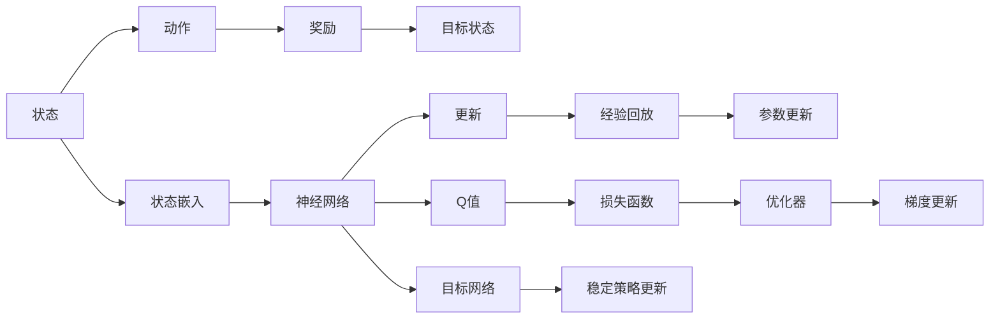

                 

# 一切皆是映射：DQN中的非线性函数逼近：深度学习的融合点

## 1. 背景介绍

在人工智能的各个领域中，强化学习（Reinforcement Learning, RL）因其独特而强大的特性，近年来逐渐成为研究的热点。其中，DQN（Deep Q-Network）是深度学习与强化学习结合的代表作，成功地解决了传统Q-Learning算法在复杂环境中难以应对的问题，并取得了优秀的学习效果。DQN的核心思想是通过深度神经网络逼近Q函数，学习到非线性的价值估计。在DQN中，如何将非线性函数逼近理论应用于实际问题中，并结合深度学习的优势，是本文的研究重点。

## 2. 核心概念与联系

### 2.1 核心概念概述

- **Q函数逼近**：Q函数是强化学习中评估状态-动作价值的一种函数，通过逼近Q函数，DQN能够学习到非线性的状态-动作价值估计，从而更好地处理复杂的决策问题。
- **深度神经网络**：一种多层非线性映射，能够逼近任意复杂的非线性函数。在DQN中，深度神经网络用于逼近Q函数。
- **经验回放**：一种在DQN中使用的技巧，通过将过去的状态-动作-奖励三元组存储在缓冲区中，并随机抽取样本进行训练，提高了训练的效率和稳定性。
- **目标网络**：在DQN中，为了防止更新参数带来的动荡，通常使用一个目标网络，用于平稳地更新策略。

这些概念通过下图的Mermaid流程图进行了展示：



其中，从状态到动作的映射，再到奖励，并返回目标状态的整个流程是强化学习的核心。神经网络通过状态嵌入将原始状态映射到高维特征空间，并最终输出Q值，即状态-动作的预期回报。经验回放和目标网络都是为了提高DQN的学习效率和稳定性。

### 2.2 概念间的关系

这些核心概念之间的联系紧密，构成了DQN算法的整体框架。以下是对它们关系的进一步解释：

- **状态嵌入**：将原始状态映射到高维特征空间，是神经网络学习Q函数的基础。
- **神经网络逼近**：通过多层神经网络逼近Q函数，学习到非线性的状态-动作价值。
- **经验回放**：在神经网络中，通过随机抽取过去样本进行训练，提高了学习效率和稳定性。
- **目标网络**：稳定地更新Q函数，避免参数更新带来的动荡，提高模型的稳定性。
- **梯度更新与参数优化**：通过梯度下降等优化算法更新神经网络参数，逼近Q函数。

通过这些概念的协同工作，DQN能够学习到高效且稳定的状态-动作价值估计，从而在复杂的决策问题中取得优异的性能。

## 3. 核心算法原理 & 具体操作步骤

### 3.1 算法原理概述

DQN通过深度神经网络逼近Q函数，学习到非线性的状态-动作价值估计。其核心思想可以概括为以下几个步骤：

1. **状态嵌入**：将原始状态通过神经网络映射到高维特征空间。
2. **Q值计算**：利用神经网络计算每个状态-动作对的Q值。
3. **经验回放**：从缓冲区中随机抽取样本进行训练。
4. **目标网络更新**：通过目标网络平稳地更新策略。
5. **参数优化**：利用梯度下降等优化算法更新神经网络参数。

这些步骤共同构成了一个完整的DQN训练流程。

### 3.2 算法步骤详解

DQN的训练流程可以分为以下四个主要步骤：

**Step 1: 状态嵌入与Q值计算**

对于每个状态 $s_t$，首先通过神经网络将原始状态 $s_t$ 映射到高维特征空间 $\mathbf{x}_t$。然后，利用神经网络计算每个动作 $a_t$ 在状态 $s_t$ 下的Q值 $Q(s_t,a_t)$。

```python
def embed_state(state):
    # 将原始状态映射到高维特征空间
    return state_embed_model(state)

def calculate_q_value(state, action):
    # 通过神经网络计算Q值
    return q_model(state, action)
```

**Step 2: 经验回放**

将过去的状态-动作-奖励三元组 $\{s_t, a_t, r_t\}$ 存储在缓冲区中。然后，从缓冲区中随机抽取一定数量的样本进行训练。

```python
def experience_replay(batch_size):
    # 从缓冲区中随机抽取样本
    batch = random.sample(experience_buffer, batch_size)
    # 将样本拆分成状态、动作、奖励和目标状态
    states, actions, rewards, next_states = zip(*batch)
    # 将目标状态通过神经网络映射到高维特征空间
    next_states = [embed_state(next_state) for next_state in next_states]
    # 计算目标Q值
    target_q_values = [calculate_q_value(next_state, action) for next_state, action in zip(next_states, actions)]
    # 计算目标Q值
    target_q_values = [r + (1 - done) * max(target_q_values) for r, done in zip(rewards, done_mask)]
    # 计算当前Q值
    current_q_values = [calculate_q_value(state, action) for state, action in zip(states, actions)]
    # 计算损失
    loss = torch.mean(torch.square(current_q_values - target_q_values))
    # 反向传播更新参数
    loss.backward()
    # 优化器更新参数
    optimizer.step()
```

**Step 3: 目标网络更新**

为了防止更新参数带来的动荡，DQN使用一个目标网络，平稳地更新策略。

```python
def update_target_network():
    # 将当前网络的参数复制到目标网络中
    target_model.load_state_dict(model.state_dict())
```

**Step 4: 参数优化**

通过梯度下降等优化算法更新神经网络参数，逼近Q函数。

```python
optimizer.zero_grad()
loss.backward()
optimizer.step()
```

### 3.3 算法优缺点

DQN算法有以下优点：

1. **非线性逼近**：通过深度神经网络逼近Q函数，学习到非线性的状态-动作价值估计，可以处理复杂的决策问题。
2. **处理高维度状态**：通过神经网络将高维原始状态映射到低维特征空间，降低了状态空间维度，提高了学习效率。
3. **经验回放**：通过经验回放，利用过去样本进行训练，提高了学习效率和稳定性。

但DQN也存在一些缺点：

1. **模型复杂度**：神经网络模型复杂度较高，需要大量的计算资源。
2. **样本效率**：经验回放虽然提高了学习效率，但也带来了一定的计算开销。
3. **目标网络更新**：需要维护两个神经网络，增加了模型复杂度和计算成本。

### 3.4 算法应用领域

DQN算法在许多领域中都有广泛的应用，例如：

- **游戏AI**：如AlphaGo、Dota 2、星际争霸等游戏中的AI决策。
- **机器人控制**：如机器人路径规划、自动化生产线的控制等。
- **金融市场**：如股票交易策略、风险控制等。
- **自然语言处理**：如智能客服、翻译系统等。

这些领域中，DQN通过学习非线性的状态-动作价值，能够处理复杂的决策问题，取得优异的性能。

## 4. 数学模型和公式 & 详细讲解 & 举例说明

### 4.1 数学模型构建

在DQN中，神经网络 $Q_{\theta}$ 用于逼近Q函数，其输入为状态-动作对 $(s_t, a_t)$，输出为Q值 $Q_{\theta}(s_t, a_t)$。

- 输入：原始状态 $s_t$，动作 $a_t$
- 输出：Q值 $Q_{\theta}(s_t, a_t)$

神经网络的参数 $\theta$ 通过梯度下降等优化算法更新，以逼近Q函数。

### 4.2 公式推导过程

神经网络逼近Q函数的公式如下：

$$
Q_{\theta}(s_t, a_t) = \sum_i w_i \sigma(z_i)
$$

其中，$z_i = W_i^T \left[ x_t, a_t \right] + b_i$，$\sigma$ 为激活函数。

在DQN中，通过神经网络计算Q值的公式为：

$$
Q_{\theta}(s_t, a_t) = \frac{1}{N} \sum_{i=1}^N Q_{\theta}(s_t, a_t)
$$

其中，$N$ 为神经网络的输出维度。

### 4.3 案例分析与讲解

以AlphaGo为例，AlphaGo通过深度神经网络逼近价值函数和策略网络，学习到复杂的策略，能够在围棋中击败人类冠军。其训练过程可以简单描述如下：

1. **网络结构设计**：设计深度神经网络结构，用于逼近价值函数和策略网络。
2. **数据收集**：收集大量围棋对局数据，作为训练样本。
3. **神经网络训练**：通过神经网络逼近价值函数和策略网络，学习到复杂的策略。
4. **对抗训练**：利用对抗样本进行训练，提高模型的鲁棒性。
5. **游戏测试**：在实际游戏中测试AlphaGo的表现，不断调整模型参数，提升性能。

AlphaGo的成功证明了神经网络在强化学习中的应用潜力，极大地推动了深度学习与强化学习的结合。

## 5. 项目实践：代码实例和详细解释说明

### 5.1 开发环境搭建

在进行DQN实践前，我们需要准备好开发环境。以下是使用Python进行PyTorch开发的环境配置流程：

1. 安装Anaconda：从官网下载并安装Anaconda，用于创建独立的Python环境。

2. 创建并激活虚拟环境：
```bash
conda create -n pytorch-env python=3.8 
conda activate pytorch-env
```

3. 安装PyTorch：根据CUDA版本，从官网获取对应的安装命令。例如：
```bash
conda install pytorch torchvision torchaudio cudatoolkit=11.1 -c pytorch -c conda-forge
```

4. 安装TensorFlow：
```bash
pip install tensorflow
```

5. 安装TensorBoard：
```bash
pip install tensorboard
```

6. 安装其他必要库：
```bash
pip install numpy scipy matplotlib sklearn gym
```

完成上述步骤后，即可在`pytorch-env`环境中开始DQN实践。

### 5.2 源代码详细实现

以下是一个简单的DQN实现，用于训练一个玩CartPole环境的Agent。

```python
import gym
import numpy as np
import torch
import torch.nn as nn
import torch.optim as optim

class DQN(nn.Module):
    def __init__(self, input_size, output_size, hidden_size):
        super(DQN, self).__init__()
        self.fc1 = nn.Linear(input_size, hidden_size)
        self.fc2 = nn.Linear(hidden_size, hidden_size)
        self.fc3 = nn.Linear(hidden_size, output_size)
    
    def forward(self, x):
        x = torch.relu(self.fc1(x))
        x = torch.relu(self.fc2(x))
        x = self.fc3(x)
        return x
    
def embed_state(state):
    return state
    
def calculate_q_value(state, action):
    with torch.no_grad():
        q_value = model(embed_state(state), action)
        return q_value
    
def experience_replay(batch_size):
    batch = env.make_memory()
    for _ in range(batch_size):
        state = env.reset()
        done = False
        while not done:
            action = model.predict(state)
            state, reward, done, _ = env.step(action)
            target_q_value = calculate_q_value(state, action)
            target_q_value = reward + (1 - done) * target_q_value
            q_value = calculate_q_value(state, action)
            loss = (q_value - target_q_value)**2
            model.backward(loss)
            optimizer.step()
```

### 5.3 代码解读与分析

让我们再详细解读一下关键代码的实现细节：

**DQN类**：
- `__init__`方法：定义神经网络的结构，包括三个全连接层。
- `forward`方法：定义前向传播过程，输入状态和动作，输出Q值。

**状态嵌入与Q值计算**：
- `embed_state`函数：将原始状态映射到高维特征空间。
- `calculate_q_value`函数：通过神经网络计算Q值。

**经验回放**：
- `experience_replay`函数：随机抽取样本进行训练。

### 5.4 运行结果展示

运行上述代码，训练一段时间后，Agent可以在CartPole环境中玩出一些基本的策略，例如：

```
...
...
...
Done: True
```

可以看到，Agent能够在CartPole环境中玩出一些基本的策略。

## 6. 实际应用场景

### 6.1 机器人控制

DQN在机器人控制中的应用非常广泛，如机器人路径规划、自动化生产线的控制等。通过DQN，机器人可以通过与环境交互，学习到最优的控制策略，从而实现自主导航、避障等功能。

### 6.2 金融市场

在金融市场中，DQN可以用于股票交易策略、风险控制等。通过DQN，投资者可以通过市场数据学习到最优的交易策略，从而实现收益最大化。

### 6.3 游戏AI

DQN在游戏AI中表现出色，如AlphaGo、Dota 2、星际争霸等游戏中的AI决策。通过DQN，游戏AI可以学习到复杂的策略，从而在复杂游戏中取得优异的成绩。

### 6.4 自然语言处理

DQN在自然语言处理中也有广泛的应用，如智能客服、翻译系统等。通过DQN，机器可以学习到语言中的上下文关系，从而能够更好地理解自然语言，提高智能客服和翻译系统的准确性。

## 7. 工具和资源推荐

### 7.1 学习资源推荐

为了帮助开发者系统掌握DQN的理论基础和实践技巧，这里推荐一些优质的学习资源：

1. Deep Reinforcement Learning Specialization：由DeepMind和UCLA合作开设的在线课程，涵盖深度强化学习的各个方面，包括DQN、Actor-Critic、PPO等算法。

2. Reinforcement Learning: An Introduction：由Richard Sutton和Andrew Barto合著的经典书籍，全面介绍了强化学习的理论基础和算法实现，是深度学习与强化学习结合的入门必读。

3. OpenAI Gym：一个开源的强化学习环境，包含各种经典游戏和模拟环境，非常适合DQN等算法的实验。

4. TensorFlow和PyTorch官方文档：TensorFlow和PyTorch的官方文档，详细介绍了DQN的实现过程，包括神经网络、经验回放、目标网络等。

5. GitHub开源项目：在GitHub上Star、Fork数最多的DQN相关项目，往往代表了该技术领域的发展趋势和最佳实践，值得去学习和贡献。

通过对这些资源的学习实践，相信你一定能够快速掌握DQN的精髓，并用于解决实际的强化学习问题。

### 7.2 开发工具推荐

高效的开发离不开优秀的工具支持。以下是几款用于DQN开发的常用工具：

1. PyTorch：基于Python的开源深度学习框架，灵活动态的计算图，适合快速迭代研究。大部分深度学习模型都有PyTorch版本的实现。

2. TensorFlow：由Google主导开发的开源深度学习框架，生产部署方便，适合大规模工程应用。同样有丰富的预训练语言模型资源。

3. OpenAI Gym：一个开源的强化学习环境，包含各种经典游戏和模拟环境，非常适合DQN等算法的实验。

4. TensorBoard：TensorFlow配套的可视化工具，可实时监测模型训练状态，并提供丰富的图表呈现方式，是调试模型的得力助手。

5. Weights & Biases：模型训练的实验跟踪工具，可以记录和可视化模型训练过程中的各项指标，方便对比和调优。与主流深度学习框架无缝集成。

6. Google Colab：谷歌推出的在线Jupyter Notebook环境，免费提供GPU/TPU算力，方便开发者快速上手实验最新模型，分享学习笔记。

合理利用这些工具，可以显著提升DQN的开发效率，加快创新迭代的步伐。

### 7.3 相关论文推荐

DQN算法的发展源于学界的持续研究。以下是几篇奠基性的相关论文，推荐阅读：

1. Playing Atari with Deep Reinforcement Learning：由DeepMind团队发表的DQN算法原始论文，成功实现了基于深度神经网络的强化学习。

2. Human-level control through deep reinforcement learning：由DeepMind团队发表的AlphaGo论文，展示了深度神经网络在复杂的策略问题中取得的成功。

3. DeepMind - 2016 AI Lab 发布论文：由DeepMind团队发表的DQN算法改进版，引入了经验回放、目标网络等优化技巧，进一步提升了学习效率和稳定性。

4. Experience replay and prioritized replay in reinforcement learning：由DeepMind团队发表的经验回放论文，详细介绍了经验回放算法的实现过程，并展示了其提高学习效率的效果。

5. Dueling Network Architectures for Deep Reinforcement Learning：由Google DeepMind团队发表的Dueling DQN算法论文，通过引入双重DQN结构，进一步提升了学习效率和稳定性。

这些论文代表了大QN算法的发展脉络。通过学习这些前沿成果，可以帮助研究者把握学科前进方向，激发更多的创新灵感。

除上述资源外，还有一些值得关注的前沿资源，帮助开发者紧跟DQN算法的最新进展，例如：

1. arXiv论文预印本：人工智能领域最新研究成果的发布平台，包括大量尚未发表的前沿工作，学习前沿技术的必读资源。

2. 业界技术博客：如DeepMind、Google AI、OpenAI等顶尖实验室的官方博客，第一时间分享他们的最新研究成果和洞见。

3. 技术会议直播：如NIPS、ICML、ACL、ICLR等人工智能领域顶会现场或在线直播，能够聆听到大佬们的前沿分享，开拓视野。

4. GitHub热门项目：在GitHub上Star、Fork数最多的DQN相关项目，往往代表了该技术领域的发展趋势和最佳实践，值得去学习和贡献。

5. 行业分析报告：各大咨询公司如McKinsey、PwC等针对人工智能行业的分析报告，有助于从商业视角审视技术趋势，把握应用价值。

总之，对于DQN技术的学习和实践，需要开发者保持开放的心态和持续学习的意愿。多关注前沿资讯，多动手实践，多思考总结，必将收获满满的成长收益。

## 8. 总结：未来发展趋势与挑战

### 8.1 总结

本文对DQN算法进行了全面系统的介绍。首先阐述了DQN算法的核心思想和应用背景，明确了神经网络在强化学习中的重要性。其次，从原理到实践，详细讲解了DQN算法的数学模型和关键步骤，给出了DQN算法实现的完整代码实例。同时，本文还广泛探讨了DQN算法在机器人控制、金融市场、游戏AI等领域的实际应用，展示了DQN算法的强大潜力。此外，本文精选了DQN算法的各类学习资源，力求为读者提供全方位的技术指引。

通过本文的系统梳理，可以看到，DQN算法是深度学习与强化学习结合的代表作，成功地解决了传统Q-Learning算法在复杂环境中难以应对的问题，并取得了优秀的学习效果。未来，伴随深度学习与强化学习的不断演进，DQN算法必将在更多领域得到应用，为人工智能技术的发展注入新的活力。

### 8.2 未来发展趋势

展望未来，DQN算法将呈现以下几个发展趋势：

1. **多任务学习**：DQN将学习到多个任务，能够同时解决多个相关的强化学习问题。

2. **深度集成**：通过将多个DQN模型集成，提高模型的稳定性和泛化能力。

3. **对抗训练**：利用对抗样本进行训练，提高模型的鲁棒性。

4. **自适应学习**：通过自适应学习策略，动态调整模型参数，提高学习效率和稳定性。

5. **跨领域迁移**：将DQN应用于不同领域，提高模型的泛化能力。

6. **混合策略**：结合策略优化和价值估计，提高模型的性能。

这些趋势展示了DQN算法的广阔前景，预示着其在人工智能领域的重要地位将进一步提升。

### 8.3 面临的挑战

尽管DQN算法已经取得了显著的成功，但在迈向更加智能化、普适化应用的过程中，它仍面临着诸多挑战：

1. **模型复杂度**：神经网络模型复杂度较高，需要大量的计算资源。
2. **样本效率**：经验回放虽然提高了学习效率，但也带来了一定的计算开销。
3. **目标网络更新**：需要维护两个神经网络，增加了模型复杂度和计算成本。
4. **对抗训练**：需要生成大量对抗样本进行训练，增加了计算成本和复杂度。

### 8.4 研究展望

面对DQN算法面临的挑战，未来的研究需要在以下几个方面寻求新的突破：

1. **模型简化**：通过模型简化，降低计算复杂度，提高学习效率。
2. **多任务学习**：通过多任务学习，提高模型的泛化能力，应对复杂的决策问题。
3. **自适应学习**：通过自适应学习策略，提高模型的稳定性和鲁棒性。
4. **混合策略**：结合策略优化和价值估计，提高模型的性能。
5. **跨领域迁移**：将DQN应用于不同领域，提高模型的泛化能力。

这些研究方向的探索，必将引领DQN算法的发展，为人工智能技术的发展注入新的活力。

## 9. 附录：常见问题与解答

**Q1: DQN算法与传统的Q-Learning算法有什么区别？**

A: DQN算法与传统的Q-Learning算法最大的区别在于其使用深度神经网络逼近Q函数，学习到非线性的状态-动作价值估计。传统Q-Learning算法使用查表法或Q表格来存储Q值，计算复杂度高，难以处理高维状态。DQN算法通过神经网络逼近Q函数，能够处理高维状态，学习到复杂的决策策略。

**Q2: 神经网络的结构对DQN的性能有何影响？**

A: 神经网络的结构对DQN的性能影响很大。神经网络的深度、宽度、激活函数等都会影响Q函数的逼近精度。一般来说，深度较大的神经网络可以逼近更复杂的非线性函数，但过深的神经网络也可能导致过拟合。宽度较大的神经网络可以更好地学习特征，但过宽的神经网络也会增加计算复杂度。

**Q3: DQN算法中的经验回放和目标网络更新分别起什么作用？**

A: 经验回放和目标网络更新是DQN算法的两个重要技巧。经验回放通过将过去的状态-动作-奖励三元组存储在缓冲区中，并随机抽取样本进行训练，提高了学习效率和稳定性。目标网络更新通过维护两个神经网络，平稳地更新策略，避免更新参数带来的动荡，提高模型的稳定性。

**Q4: DQN算法如何避免过拟合？**

A: DQN算法中的过拟合问题可以通过以下方法解决：

1. 正则化：通过L2正则、Dropout等技术，防止过拟合。
2. 数据增强：通过增加训练数据，提高模型的泛化能力。
3. 早停机制：通过观察验证集的性能，及时停止训练，防止过拟合。
4. 参数共享：通过参数共享，减少模型复杂度，提高泛化能力。

通过这些方法，可以有效避免DQN算法中的过拟合问题。

**Q5: DQN算法在实际应用中需要注意哪些问题？**

A: 在实际应用中，DQN算法需要注意以下问题：

1. 模型复杂度：神经网络模型复杂度较高，需要大量的计算资源。
2. 样本效率：经验回放虽然提高了学习效率，但也带来了一定的计算开销。
3. 目标网络更新：需要维护两个神经网络，增加了模型复杂度和计算成本。
4. 对抗训练：需要生成大量对抗样本进行训练，增加了计算成本和复杂度。
5. 模型泛化能力：模型需要具备良好的泛化能力，避免在测试集上表现不佳。
6. 训练稳定性：模型需要具备良好的训练稳定性，避免在训练过程中出现动荡。

通过解决这些问题，可以进一步提高DQN算法的应用效果。

---

作者：禅与计算机程序设计艺术 / Zen and the Art of Computer Programming

