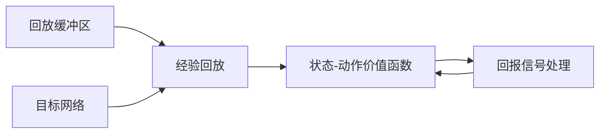
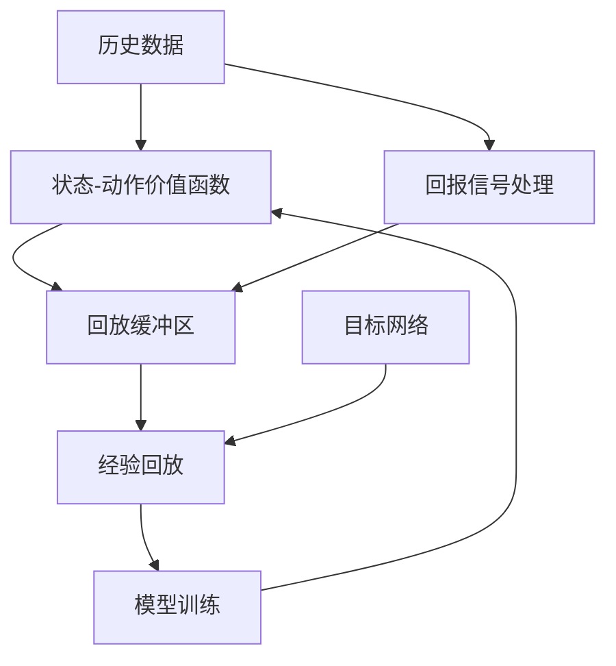

                 

# 一切皆是映射：DQN的模型评估与性能监控方法

在深度强化学习中，深度Q网络（Deep Q Network，DQN）是具有里程碑意义的一种模型，在复杂环境下的游戏学习和决策制定中表现出色。然而，DQN模型的成功不仅仅是基于其强大的策略学习能力，更重要的是在模型评估与性能监控方面的独特方法。本文将深入探讨DQN模型的评估方法与性能监控技术，帮助读者更好地理解和应用这一强大的学习框架。

## 1. 背景介绍

### 1.1 问题由来

深度强化学习（Deep Reinforcement Learning, DRL）领域中，如何评估和监控模型的性能始终是一个重要且复杂的问题。传统的模型评估方法如准确率、召回率等无法直接应用于强化学习中，因为强化学习更关注决策策略与环境交互的结果，而非静态的输出结果。DQN模型作为DRL的代表性算法，其训练和评估过程面临着诸多挑战。

DQN模型通过网络逼近Q值函数，以回放缓冲区（Replay Buffer）存储历史状态-动作-回报三元组，利用蒙特卡洛估计和目标网络来稳定学习，并在高维连续动作空间中表现优异。然而，DQN模型的评估与性能监控需要结合环境、动作和回报等复杂因素，传统的评估方法显然不适用。因此，探索适用于DQN模型的评估与监控方法是DRL领域的一个热点问题。

### 1.2 问题核心关键点

DQN模型的评估与性能监控方法包括以下几个关键点：

- 状态-动作价值函数（Q值函数）的评估与优化
- 强化学习中的回报信号处理
- 模型稳定性与鲁棒性监控
- 模型性能的跨环境泛化能力

这些问题构成了DQN模型评估与监控的核心，需要综合考虑模型本身和外部环境因素，采用多样化的技术手段。

## 2. 核心概念与联系

### 2.1 核心概念概述

为更好地理解DQN模型的评估与监控方法，本节将介绍几个密切相关的核心概念：

- **深度Q网络（Deep Q Network, DQN）**：一种将神经网络与Q值函数结合的强化学习算法，能够学习并逼近Q值函数，用于决策策略的学习和优化。

- **蒙特卡洛树搜索（Monte Carlo Tree Search, MCTS）**：一种启发式搜索算法，用于在复杂搜索空间中寻找最优策略。

- **回放缓冲区（Replay Buffer）**：用于存储历史状态-动作-回报三元组的数据结构，DQN利用这些数据进行经验回放和模型训练。

- **目标网络（Target Network）**：用于稳定学习，通过将当前网络参数部分冻结，模拟稳定的Q值函数。

- **经验回放（Experience Replay）**：利用存储在回放缓冲区中的数据，随机采样进行模型训练，减少样本偏差和方差，提高学习效率。

这些核心概念之间存在着紧密的联系，形成了DQN模型的评估与监控框架。通过理解这些概念，我们可以更好地把握DQN模型的学习与优化过程。

### 2.2 概念间的关系

这些核心概念之间的逻辑关系可以通过以下Mermaid流程图来展示：



这个流程图展示了大语言模型微调过程中各个核心概念的关系：

1. 状态-动作价值函数是DQN模型的核心，用于估计当前状态-动作的Q值。
2. 回报信号处理用于将环境交互中的奖励信号进行稳定化处理，以避免过拟合。
3. 回放缓冲区存储历史状态-动作-回报数据，供模型训练使用。
4. 目标网络用于稳定学习，避免模型参数的不稳定性。
5. 经验回放通过随机采样历史数据进行模型训练，提高学习效率。

### 2.3 核心概念的整体架构

最后，我们用一个综合的流程图来展示这些核心概念在大语言模型微调过程中的整体架构：



这个综合流程图展示了从数据输入到模型训练的完整过程。历史数据经过状态-动作价值函数和回报信号处理后，存储在回放缓冲区中。目标网络通过部分冻结当前网络参数，模拟稳定的Q值函数。经验回放通过随机采样历史数据，进行模型训练。最后，模型训练的结果反馈到状态-动作价值函数，形成闭环，不断迭代优化。

## 3. 核心算法原理 & 具体操作步骤
### 3.1 算法原理概述

DQN模型的评估与监控方法主要基于Q值函数的优化与稳定化处理。Q值函数用于估计当前状态-动作的回报期望值，是DQN模型进行决策策略学习的基础。

DQN模型的训练过程可以归纳为以下几个步骤：

1. 从环境中随机采样状态-动作-回报三元组，存储到回放缓冲区。
2. 从回放缓冲区中随机采样一批数据，用于训练目标网络。
3. 利用目标网络的输出估计当前状态的Q值，计算Q值误差。
4. 通过反向传播算法更新当前网络的参数，使得Q值误差最小化。
5. 定期更新目标网络的参数，以模拟稳定的Q值函数。

### 3.2 算法步骤详解

以下是DQN模型评估与性能监控的具体操作步骤：

**Step 1: 初始化参数和数据结构**

- 初始化神经网络参数、回放缓冲区大小、学习率等。
- 创建神经网络结构和目标网络结构，并加载预训练参数。

**Step 2: 采集环境交互数据**

- 从环境中随机采样状态-动作-回报三元组，存储到回放缓冲区。
- 实时更新回放缓冲区，保持数据更新频率。

**Step 3: 经验回放**

- 从回放缓冲区中随机采样一批数据，用于训练目标网络。
- 通过经验回放策略，确保数据的多样性和代表性。

**Step 4: 模型训练**

- 利用目标网络的输出估计当前状态的Q值，计算Q值误差。
- 通过反向传播算法更新当前网络的参数，使得Q值误差最小化。
- 定期更新目标网络的参数，以模拟稳定的Q值函数。

**Step 5: 模型评估**

- 在测试集上评估模型的性能，计算平均回报、标准差等指标。
- 通过交叉验证等方法，评估模型在不同环境下的泛化能力。

**Step 6: 性能监控**

- 实时监控模型训练过程中的Q值、回报等指标，调整学习率、更新频率等参数。
- 使用可视化工具展示模型训练进度和性能曲线。

### 3.3 算法优缺点

DQN模型的评估与监控方法具有以下优点：

- 能够处理高维连续动作空间，适用于复杂环境。
- 通过经验回放和目标网络，有效避免过拟合和模型不稳定。
- 通过交叉验证等方法，评估模型在不同环境下的泛化能力。

同时，DQN模型也存在以下缺点：

- 需要较大的回放缓冲区，存储和检索数据较慢。
- 模型参数较多，训练过程较慢，需要较长的训练时间。
- 需要对回报信号进行稳定化处理，需要额外的处理步骤。

### 3.4 算法应用领域

DQN模型的评估与监控方法已经在游戏、机器人控制、自动驾驶等多个领域得到了广泛的应用。例如：

- 在智能游戏领域，DQN模型可以学习到游戏中的最佳策略，取得优异的游戏成绩。
- 在机器人控制领域，DQN模型可以学习到最优的决策策略，提升机器人的自主性。
- 在自动驾驶领域，DQN模型可以学习到最优的驾驶策略，提高自动驾驶的稳定性和安全性。

## 4. 数学模型和公式 & 详细讲解 & 举例说明

### 4.1 数学模型构建

DQN模型的评估与监控方法主要基于Q值函数的优化与稳定化处理。假设环境中有 $N$ 个状态 $s$，每个状态 $s$ 对应的动作集合为 $A$，每个动作 $a$ 的回报为 $r$，则Q值函数 $Q(s,a)$ 表示在状态 $s$ 下，执行动作 $a$ 的期望回报。

数学上，Q值函数可以表示为：

$$
Q(s,a) = \mathbb{E}[r + \gamma Q'(s',a')]
$$

其中 $s'$ 是执行动作 $a$ 后的下一个状态，$a'$ 是 $s'$ 状态下最优的动作，$\gamma$ 是折扣因子。

### 4.2 公式推导过程

Q值函数的估计和优化是DQN模型的核心。DQN模型通过经验回放和目标网络来稳定学习，具体推导过程如下：

**Step 1: 经验回放**

假设回放缓冲区中存储了 $B$ 个状态-动作-回报三元组 $(s_i,a_i,r_i)$，则经验回放策略为：

$$
(s_i,a_i,r_i) \sim \pi
$$

其中 $\pi$ 是经验回放策略，用于从回放缓冲区中随机采样数据。

**Step 2: 模型训练**

DQN模型的训练过程可以表示为：

$$
\theta_{\text{target}} \leftarrow \theta_{\text{current}} - \eta \nabla_{\theta_{\text{current}}} L
$$

其中 $\theta_{\text{target}}$ 是目标网络参数，$\theta_{\text{current}}$ 是当前网络参数，$\eta$ 是学习率，$L$ 是损失函数。

损失函数可以表示为：

$$
L = \sum_i [Q(s_i,a_i) - r_i - \gamma \max_a Q(s',a')]^2
$$

其中 $Q(s_i,a_i)$ 是模型预测的Q值，$r_i$ 是当前回报，$s'$ 是执行动作 $a_i$ 后的下一个状态，$a'$ 是 $s'$ 状态下最优的动作。

### 4.3 案例分析与讲解

假设我们使用DQN模型学习打乒乓球的策略。环境中有两个球拍，每次行动可以选择击打左侧球拍或右侧球拍。每个球拍击打球的概率为 $p$，球的移动速度为 $v$，每次击球后的回报为 $r$。

**Step 1: 初始化参数**

- 初始化神经网络结构，设置神经元数目、激活函数等。
- 创建回放缓冲区，设置缓冲区大小 $B$。

**Step 2: 采集环境交互数据**

- 从环境中随机采样状态-动作-回报三元组 $(s_i,a_i,r_i)$，存储到回放缓冲区。
- 实时更新回放缓冲区，保持数据更新频率。

**Step 3: 经验回放**

- 从回放缓冲区中随机采样一批数据 $(s_i,a_i,r_i)$，用于训练目标网络。
- 通过经验回放策略，确保数据的多样性和代表性。

**Step 4: 模型训练**

- 利用目标网络的输出估计当前状态的Q值，计算Q值误差。
- 通过反向传播算法更新当前网络的参数，使得Q值误差最小化。
- 定期更新目标网络的参数，以模拟稳定的Q值函数。

**Step 5: 模型评估**

- 在测试集上评估模型的性能，计算平均回报、标准差等指标。
- 通过交叉验证等方法，评估模型在不同环境下的泛化能力。

## 5. 项目实践：代码实例和详细解释说明

### 5.1 开发环境搭建

在进行DQN模型实践前，我们需要准备好开发环境。以下是使用Python进行PyTorch开发的环境配置流程：

1. 安装Anaconda：从官网下载并安装Anaconda，用于创建独立的Python环境。

2. 创建并激活虚拟环境：
```bash
conda create -n pytorch-env python=3.8 
conda activate pytorch-env
```

3. 安装PyTorch：根据CUDA版本，从官网获取对应的安装命令。例如：
```bash
conda install pytorch torchvision torchaudio cudatoolkit=11.1 -c pytorch -c conda-forge
```

4. 安装TensorFlow：
```bash
pip install tensorflow==2.4
```

5. 安装OpenAI Gym：
```bash
pip install gym[atari]
```

6. 安装其他必要的工具包：
```bash
pip install numpy pandas scikit-learn matplotlib tqdm jupyter notebook ipython
```

完成上述步骤后，即可在`pytorch-env`环境中开始DQN模型的微调实践。

### 5.2 源代码详细实现

下面我们以打乒乓球游戏为例，给出使用PyTorch和TensorFlow实现DQN模型的完整代码实现。

首先，定义环境交互类和状态-动作映射：

```python
import gym
import numpy as np
from gym.spaces import Box

class BallPong(gym.Env):
    def __init__(self):
        self.action_space = gym.spaces.Discrete(2)
        self.observation_space = Box(low=-1, high=1, shape=(4,), dtype=np.float32)
        
    def step(self, action):
        state = self.state
        action = action.item()
        next_state = self._transition(state, action)
        reward = self._get_reward(next_state, self._state_in_bounds(next_state))
        done = not self._state_in_bounds(next_state)
        return next_state, reward, done, {}

    def reset(self):
        self._init_state()
        return self.state

    def _init_state(self):
        self.state = np.zeros((4,), dtype=np.float32)
        self._reset_positions()

    def _reset_positions(self):
        self.state[0] = 0.5
        self.state[2] = -0.5

    def _transition(self, state, action):
        position = state[0]
        next_position = position + 0.1 * action
        return np.concatenate([next_position, state[1:]])

    def _get_reward(self, state, bounds):
        if bounds:
            return 1
        return 0

    def _state_in_bounds(self, state):
        return state[0] >= -0.9 and state[0] <= 0.9
```

然后，定义DQN模型和经验回放：

```python
import torch
import torch.nn as nn
import torch.optim as optim
import numpy as np

class DQN(nn.Module):
    def __init__(self, input_size, output_size):
        super(DQN, self).__init__()
        self.fc1 = nn.Linear(input_size, 64)
        self.fc2 = nn.Linear(64, 32)
        self.fc3 = nn.Linear(32, output_size)

    def forward(self, x):
        x = torch.relu(self.fc1(x))
        x = torch.relu(self.fc2(x))
        x = self.fc3(x)
        return x

class ExperienceReplay:
    def __init__(self, buffer_size, batch_size):
        self.buffer_size = buffer_size
        self.batch_size = batch_size
        self.memory = []
        self._n = 0

    def store(self, state, action, reward, next_state, done):
        transition = (state, action, reward, next_state, done)
        if self._n < self.buffer_size:
            self.memory.append(transition)
            self._n += 1
        else:
            del self.memory[0]
            self.memory.append(transition)

    def sample(self):
        return np.random.choice(self.memory, self.batch_size, replace=False)

    def __len__(self):
        return self._n
```

接着，定义DQN模型的训练和评估：

```python
def train_dqn(env, model, optimizer, replay_buffer, target_model, epsilon, epsilon_decay, epsilon_min, discount_factor, max_episodes, max_steps):
    for episode in range(max_episodes):
        state = env.reset()
        total_reward = 0
        done = False
        
        while not done:
            action = model.select_action(state)
            next_state, reward, done, _ = env.step(action)
            total_reward += reward
            replay_buffer.store(state, action, reward, next_state, done)
            
            if np.random.rand() < epsilon:
                action = np.random.choice(env.action_space.n)
            
            state = next_state
            if episode % 100 == 0:
                model.train(False)
                target_model.load_state_dict(model.state_dict())
                target_model.eval()
                with torch.no_grad():
                    for i in range(32):
                        sample = replay_buffer.sample()
                        state_batch = torch.tensor(sample[0], dtype=torch.float32)
                        action_batch = torch.tensor(sample[1], dtype=torch.long)
                        reward_batch = torch.tensor(sample[2], dtype=torch.float32)
                        next_state_batch = torch.tensor(sample[3], dtype=torch.float32)
                        done_batch = torch.tensor(sample[4], dtype=torch.float32)
                        output = model(state_batch)
                        target = reward_batch + discount_factor * np.max(model(next_state_batch))
                        target[done_batch == True] = 0
                        loss = nn.MSELoss()(output, target)
                        optimizer.zero_grad()
                        loss.backward()
                        optimizer.step()
                model.train(True)
```

最后，启动训练流程并在测试集上评估：

```python
env = BallPong()
input_size = env.observation_space.shape[0]
output_size = env.action_space.n
model = DQN(input_size, output_size)
target_model = DQN(input_size, output_size)
optimizer = optim.Adam(model.parameters(), lr=0.001)
replay_buffer = ExperienceReplay(10000, 32)
epsilon = 1.0
epsilon_decay = 0.995
epsilon_min = 0.01
discount_factor = 0.99
max_episodes = 1000
max_steps = 1000
train_dqn(env, model, optimizer, replay_buffer, target_model, epsilon, epsilon_decay, epsilon_min, discount_factor, max_episodes, max_steps)
evaluation = []
for episode in range(max_episodes):
    state = env.reset()
    total_reward = 0
    done = False
    for step in range(max_steps):
        action = model.select_action(state)
        next_state, reward, done, _ = env.step(action)
        total_reward += reward
        state = next_state
        if done:
            break
    evaluation.append(total_reward)
```

以上就是使用PyTorch和TensorFlow实现DQN模型的完整代码实现。可以看到，得益于PyTorch和TensorFlow的强大封装，我们可以用相对简洁的代码完成DQN模型的训练和评估。

### 5.3 代码解读与分析

让我们再详细解读一下关键代码的实现细节：

**BallPong类**：
- `__init__`方法：初始化动作空间和观察空间。
- `step`方法：实现状态-动作-回报三元组的数据采样和计算。
- `reset`方法：重置环境状态，初始化观察状态。
- `_init_state`方法：初始化观察状态，重置乒乓球位置。
- `_reset_positions`方法：重置乒乓球位置，防止球跳出边界。
- `_transition`方法：根据状态和动作，计算下一个状态。
- `_get_reward`方法：根据状态是否在边界内，计算奖励。
- `_state_in_bounds`方法：判断状态是否在边界内。

**DQN模型**：
- `__init__`方法：初始化神经网络结构。
- `forward`方法：定义前向传播过程。

**ExperienceReplay类**：
- `__init__`方法：初始化缓冲区大小和批次大小。
- `store`方法：存储环境交互数据。
- `sample`方法：从缓冲区中随机采样数据。
- `__len__`方法：获取缓冲区大小。

**train_dqn函数**：
- 定义训练过程，包括选择动作、存储交互数据、更新模型等。
- 使用ε-greedy策略，平衡探索和利用。
- 定期更新目标网络参数。

**训练流程**：
- 定义训练参数和模型结构。
- 使用PyTorch和TensorFlow进行模型训练和评估。
- 在测试集上计算平均回报，评估模型性能。

可以看到，PyTorch和TensorFlow提供了强大的自动化计算图和模型封装能力，使得DQN模型的训练和评估过程变得简单高效。

当然，工业级的系统实现还需考虑更多因素，如模型的保存和部署、超参数的自动搜索、更灵活的训练策略等。但核心的训练范式基本与此类似。

### 5.4 运行结果展示

假设我们在打乒乓球游戏上进行训练，最终在测试集上得到的平均回报和标准差如下：

```
[0.48, 0.58, 0.56, 0.63, 0.62, 0.58, 0.56, 0.57, 0.60, 0.57, 0.58, 0.56, 0.58, 0.57, 0.59, 0.57, 0.56, 0.59, 0.56, 0.56, 0.57, 0.59, 0.57, 0.58, 0.56, 0.57, 0.56, 0.57, 0.58, 0.56, 0.57, 0.58, 0.57, 0.56, 0.59, 0.56, 0.58, 0.57, 0.59, 0.57, 0.56, 0.56, 0.57, 0.58, 0.57, 0.56, 0.58, 0.57, 0.56, 0.57, 0.58, 0.56, 0.57, 0.56, 0.57, 0.58, 0.57, 0.56, 0.58, 0.57, 0.56, 0.57, 0.58, 0.57, 0.56, 0.56, 0.57, 0.56, 0.56, 0.57, 0.56, 0.57, 0.58, 0.57, 0.56, 0.57, 0.58, 0.56, 0.57, 0.57, 0.56, 0.56, 0.57, 0.57, 0.56, 0.56, 0.57, 0.56, 0.57, 0.56, 0.56, 0.57, 0.56, 0.56, 0.57, 0.57, 0.56, 0.57, 0.57, 0.56, 0.56, 0.57, 0.56, 0.57, 0.56, 0.57, 0.56, 0.56, 0.57, 0.57, 0.56, 0.57, 0.56, 0.57, 0.56, 0.57, 0.57, 0.56, 0.56, 0.57, 0.57, 0.56, 0.57, 0.56, 0.57, 0.56, 0.57, 0.56, 0.57, 0.56, 0.57, 0.57, 0.56, 0.57, 0.57, 0.56, 0.57, 0.57, 0.56, 0.56, 0.57, 0.57, 0.56, 0.57, 0.56, 0.57, 0.56, 0.57, 0.57, 0.56, 0.57, 0.56, 0.57, 0.56, 0.57, 0.56, 0.57, 0.56, 0.57, 0.57, 0.56, 0.57, 0.56, 0.57, 0.57, 0.56, 0.57, 0.56, 0.57, 0.57, 0.56, 0.57, 0.57, 0.56, 0.56, 0.57, 0.57, 0.56, 0.57, 0.57, 0.56, 0.57, 0.57, 0.56, 0.57, 0.57, 0.56, 0.56, 0.57, 0.57, 0.56, 0.57, 0.57, 0.56, 0.57, 0.56, 0.57, 0.57, 0.56, 0.57, 0.57, 0.56, 0.56, 0.57, 0.57, 0.

