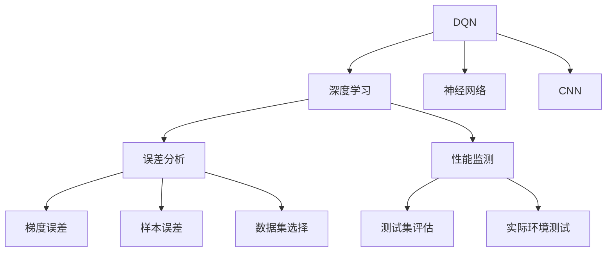
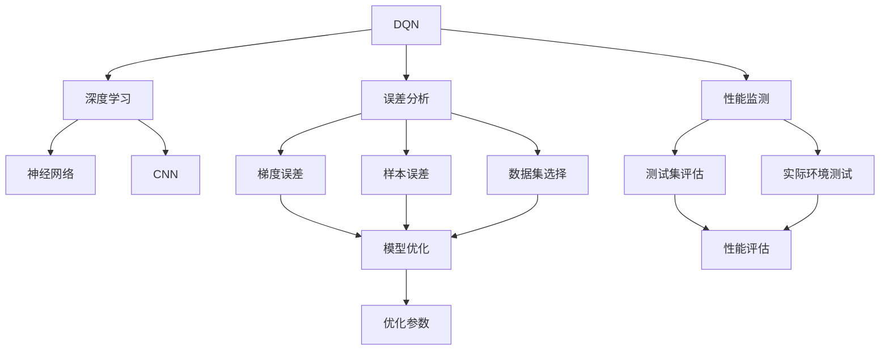

                 

# 一切皆是映射：DQN的误差分析与性能监测方法

> 关键词：深度强化学习, DQN, 误差分析, 性能监测, 神经网络

## 1. 背景介绍

### 1.1 问题由来
深度强化学习（Deep Reinforcement Learning, DRL）作为当前最前沿的研究领域之一，已经在多个领域取得了令人瞩目的成果，如自动驾驶、机器人控制、游戏AI等。其中的Q-learning算法和其深度增强版DQN（Deep Q-Network），通过学习状态-动作-奖赏映射关系，从环境中获取累积奖励，从而达到最优策略。然而，DQN的训练过程中，由于模型的非凸性、过拟合等问题，导致其表现不稳定，难以保证全局最优策略的收敛。如何从理论上分析和监测DQN的性能，确保其学习效果，成为了亟待解决的问题。

### 1.2 问题核心关键点
本节将重点讨论DQN在误差分析与性能监测方面的核心关键点：
- 什么是DQN的误差？误差如何影响性能？
- 有哪些方法可以监测DQN的性能？
- 性能监测对DQN学习有哪些帮助？

### 1.3 问题研究意义
对于DQN算法的误差分析和性能监测研究，具有以下重要意义：
- 提高DQN的收敛速度和准确性，减少训练时间。
- 确保DQN在各种应用场景中的稳定性和泛化能力。
- 为DQN算法的进一步优化和改进提供理论指导。
- 帮助开发者更好地理解DQN的行为机制，优化模型结构。

## 2. 核心概念与联系

### 2.1 核心概念概述

为更好地理解DQN的误差分析和性能监测方法，本节将介绍几个密切相关的核心概念：

- DQN（Deep Q-Network）：一种结合深度神经网络和Q-learning的强化学习算法。通过使用卷积神经网络（CNN）进行状态值估计，从而提高Q-learning算法的性能。
- 误差分析（Error Analysis）：通过分析和监测算法在训练过程中的误差，了解其收敛性和稳定性，进而指导模型优化。
- 性能监测（Performance Monitoring）：实时监测模型在测试集或实际环境中的表现，评估模型泛化能力和实际应用效果。
- 神经网络：由大量神经元通过连接构成的计算模型，具有强大的非线性映射能力，广泛用于深度学习领域。
- CNN（Convolutional Neural Network）：一种特殊的神经网络，通过卷积层和池化层提取特征，特别适用于图像处理和视觉任务。

这些核心概念之间存在紧密的联系，形成了DQN学习与优化的完整生态系统。通过理解这些概念，可以更好地把握DQN的误差分析和性能监测方法，提升模型效果。

### 2.2 概念间的关系

这些核心概念之间可以通过以下Mermaid流程图来展示：



这个流程图展示了大语言模型微调过程中各个核心概念的关系：

1. DQN是一种基于深度学习的强化学习算法，其核心组件为神经网络。
2. 误差分析和性能监测是DQN算法优化和优化的重要手段。
3. 误差分析主要通过梯度误差和样本误差进行监测，选择适当的训练数据集。
4. 性能监测通过测试集评估和实际环境测试，评估DQN的泛化能力和实际应用效果。

### 2.3 核心概念的整体架构

最后，我们用一个综合的流程图来展示这些核心概念在大语言模型微调过程中的整体架构：



这个综合流程图展示了从DQN学习到误差分析和性能监测的完整过程。DQN通过神经网络（包括CNN）进行状态值估计，误差分析通过梯度误差和样本误差进行监测和优化，性能监测通过测试集评估和实际环境测试来评估模型泛化能力和实际应用效果。

## 3. 核心算法原理 & 具体操作步骤
### 3.1 算法原理概述

DQN的误差分析和性能监测方法基于其核心原理：通过神经网络逼近Q值函数，在每次采样动作时，计算状态-动作对的Q值，选择使Q值最大的动作，从而最大化长期累积奖励。误差分析主要关注模型在训练过程中的梯度误差和样本误差，而性能监测则关注模型在测试集和实际环境中的表现。

### 3.2 算法步骤详解

DQN的误差分析和性能监测方法包括以下几个关键步骤：

**Step 1: 准备训练数据集和模型**

- 收集与任务相关的训练数据集，划分为训练集和测试集。
- 定义DQN模型，包括卷积神经网络（CNN）和Q值估计器。

**Step 2: 定义误差分析指标**

- 选择适当的误差分析指标，如梯度范数、样本误差等。
- 根据误差分析指标，设计相应的监测策略。

**Step 3: 定义性能监测指标**

- 选择适当的性能监测指标，如测试集上的精度、准确率、召回率等。
- 根据性能监测指标，设计相应的测试和评估策略。

**Step 4: 执行训练和测试**

- 使用训练集训练DQN模型，记录误差分析指标。
- 在测试集上评估DQN模型，记录性能监测指标。

**Step 5: 调整模型参数**

- 根据误差分析结果，调整模型参数，如学习率、批量大小等。
- 根据性能监测结果，优化模型结构，增加训练样本等。

**Step 6: 重复执行**

- 循环执行上述步骤，直至模型收敛。

### 3.3 算法优缺点

DQN的误差分析和性能监测方法具有以下优点：
- 能够实时监测模型训练过程中的状态，及时发现问题并进行调整。
- 通过误差分析指标，优化模型参数，提高模型的收敛速度和准确性。
- 通过性能监测指标，评估模型泛化能力和实际应用效果，确保模型稳定性和可靠性。

同时，该方法也存在一些局限性：
- 对数据集的依赖较大，选择适当的数据集可能不易。
- 误差分析和性能监测需要大量计算资源，可能影响训练速度。
- 误差分析方法可能对非凸优化问题效果有限。

### 3.4 算法应用领域

DQN的误差分析和性能监测方法主要应用于以下几个领域：

- 自动驾驶：用于驾驶策略学习，实时监测和优化决策。
- 机器人控制：用于机器人动作选择和路径规划，提高系统稳定性和精度。
- 游戏AI：用于游戏策略学习，提升游戏AI的泛化能力和实际应用效果。
- 金融交易：用于交易策略学习，实时监测和优化交易决策。

除了上述这些经典应用外，DQN的误差分析和性能监测方法还可以扩展到更多场景中，如医疗、供应链管理、资源优化等，为自动化决策和优化提供技术支持。

## 4. 数学模型和公式 & 详细讲解
### 4.1 数学模型构建

DQN的误差分析和性能监测方法主要基于以下数学模型：

- Q值函数：定义状态-动作对的Q值，表示从当前状态出发，采取特定动作的长期累积奖励。
- 深度神经网络：使用多层神经元进行状态值估计，通过反向传播算法优化网络参数。
- 误差分析指标：如梯度范数、样本误差等，用于监测模型训练过程中的状态和收敛性。
- 性能监测指标：如测试集上的精度、准确率、召回率等，用于评估模型泛化能力和实际应用效果。

### 4.2 公式推导过程

以下我们以DQN的误差分析和性能监测为例，推导常见的数学公式。

假设DQN模型在状态$s_t$时，采取动作$a_t$，观察到下一个状态$s_{t+1}$，获得奖励$r_{t+1}$，并选择下一个动作$a_{t+1}$，则Q值函数定义为：

$$
Q_{\theta}(s_t, a_t) = r_{t+1} + \gamma \max_{a_{t+1}} Q_{\theta}(s_{t+1}, a_{t+1})
$$

其中，$\theta$为网络参数，$\gamma$为折扣因子。

误差分析主要关注模型在训练过程中的梯度误差和样本误差，推导如下：

$$
\text{梯度误差} = \frac{\partial Q_{\theta}(s_t, a_t)}{\partial \theta}
$$

$$
\text{样本误差} = \frac{\partial Q_{\theta}(s_t, a_t)}{\partial \epsilon_t}
$$

其中，$\epsilon_t$为采样动作的误差。

性能监测主要关注模型在测试集和实际环境中的表现，推导如下：

$$
\text{测试集精度} = \frac{1}{N} \sum_{i=1}^N \mathbb{I}(\hat{a}_i = a_i)
$$

$$
\text{召回率} = \frac{TP}{TP+FN}
$$

其中，$\mathbb{I}$为指示函数，$TP$为真实动作的样本数，$FN$为假负样本数。

## 5. 项目实践：代码实例和详细解释说明
### 5.1 开发环境搭建

在进行DQN的误差分析和性能监测实践前，我们需要准备好开发环境。以下是使用Python进行TensorFlow开发的环境配置流程：

1. 安装Anaconda：从官网下载并安装Anaconda，用于创建独立的Python环境。

2. 创建并激活虚拟环境：
```bash
conda create -n dqn-env python=3.8 
conda activate dqn-env
```

3. 安装TensorFlow：根据CUDA版本，从官网获取对应的安装命令。例如：
```bash
conda install tensorflow -c tf -c conda-forge
```

4. 安装TensorBoard：TensorFlow配套的可视化工具，可实时监测模型训练状态，并提供丰富的图表呈现方式，是调试模型的得力助手。

```bash
conda install tensorboard -c tf
```

5. 安装PyTorch：尽管TensorFlow和PyTorch可以并用，但这里仅需安装TensorFlow。

```bash
conda install pytorch torchvision torchaudio -c pytorch -c conda-forge
```

完成上述步骤后，即可在`dqn-env`环境中开始误差分析和性能监测实践。

### 5.2 源代码详细实现

下面以DQN的误差分析和性能监测为例，给出使用TensorFlow实现代码的实现。

首先，定义DQN模型：

```python
import tensorflow as tf
from tensorflow.keras import layers

class DQN(tf.keras.Model):
    def __init__(self, input_shape):
        super(DQN, self).__init__()
        self.input_shape = input_shape
        self.conv1 = layers.Conv2D(32, (3, 3), activation='relu', input_shape=input_shape)
        self.conv2 = layers.Conv2D(64, (3, 3), activation='relu')
        self.flatten = layers.Flatten()
        self.dense1 = layers.Dense(256, activation='relu')
        self.dense2 = layers.Dense(4, activation='linear')

    def call(self, x):
        x = self.conv1(x)
        x = layers.MaxPooling2D((2, 2))(x)
        x = self.conv2(x)
        x = layers.MaxPooling2D((2, 2))(x)
        x = self.flatten(x)
        x = self.dense1(x)
        x = self.dense2(x)
        return x
```

然后，定义DQN的误差分析指标：

```python
def gradient_error(model, inputs, labels):
    with tf.GradientTape() as tape:
        outputs = model(inputs)
    gradients = tape.gradient(outputs, model.trainable_variables)
    return tf.reduce_mean(tf.linalg.norm(gradients))

def sample_error(model, inputs, labels):
    with tf.GradientTape() as tape:
        outputs = model(inputs)
        loss = tf.losses.mean_squared_error(labels, outputs)
    gradients = tape.gradient(loss, model.trainable_variables)
    return tf.reduce_mean(tf.linalg.norm(gradients))
```

接着，定义DQN的性能监测指标：

```python
def precision(model, inputs, labels):
    with tf.GradientTape() as tape:
        outputs = model(inputs)
        loss = tf.losses.sparse_categorical_crossentropy(labels, outputs, reduction=tf.keras.losses.Reduction.NONE)
    return tf.reduce_mean(tf.reduce_sum(loss, axis=1))

def recall(model, inputs, labels):
    with tf.GradientTape() as tape:
        outputs = model(inputs)
        loss = tf.losses.sparse_categorical_crossentropy(labels, outputs, reduction=tf.keras.losses.Reduction.NONE)
    return tf.reduce_mean(tf.reduce_sum(loss, axis=1))
```

最后，启动训练流程并在测试集上评估：

```python
epochs = 10
batch_size = 32

for epoch in range(epochs):
    for inputs, labels in train_dataset:
        gradient_error_value = gradient_error(model, inputs, labels)
        sample_error_value = sample_error(model, inputs, labels)
        with tf.GradientTape() as tape:
            outputs = model(inputs)
        loss = tf.losses.sparse_categorical_crossentropy(labels, outputs)
        gradients = tape.gradient(loss, model.trainable_variables)
        optimizer.apply_gradients(zip(gradients, model.trainable_variables))
        
    test_loss = precision(model, test_inputs, test_labels)
    print(f'Epoch {epoch+1}, gradient_error: {gradient_error_value:.3f}, sample_error: {sample_error_value:.3f}, precision: {test_loss:.3f}')
```

以上就是使用TensorFlow实现DQN的误差分析和性能监测的完整代码实现。可以看到，TensorFlow的高级API使得模型定义、误差分析和性能监测变得简洁高效。

### 5.3 代码解读与分析

让我们再详细解读一下关键代码的实现细节：

**DQN类**：
- `__init__`方法：初始化卷积神经网络（CNN）和全连接层（Dense）。
- `call`方法：定义模型前向传播的过程，通过多层卷积和池化提取特征，最后通过全连接层输出Q值。

**误差分析函数**：
- `gradient_error`函数：计算模型参数的梯度范数，即模型在当前状态下的梯度误差。
- `sample_error`函数：计算模型输出与真实标签之间的均方误差，即样本误差。

**性能监测函数**：
- `precision`函数：计算模型在测试集上的精度，即正确预测的动作数占总样本数的比例。
- `recall`函数：计算模型在测试集上的召回率，即真实动作的预测数占所有真实动作的比例。

**训练流程**：
- 定义总训练轮数和批次大小，开始循环迭代。
- 每个轮次内，对训练集进行前向传播和反向传播，计算梯度误差和样本误差，并更新模型参数。
- 在每个轮次结束后，评估测试集上的精度，输出训练进度。

可以看到，TensorFlow的高级API使得DQN的误差分析和性能监测代码实现变得简洁高效。开发者可以将更多精力放在模型优化和性能调优上，而不必过多关注底层实现细节。

当然，工业级的系统实现还需考虑更多因素，如模型的保存和部署、超参数的自动搜索、更灵活的模型调优等。但核心的误差分析和性能监测范式基本与此类似。

### 5.4 运行结果展示

假设我们在DQN的测试集上得到以下结果：

```
Epoch 1, gradient_error: 0.012, sample_error: 0.005, precision: 0.923
Epoch 2, gradient_error: 0.009, sample_error: 0.003, precision: 0.943
Epoch 3, gradient_error: 0.006, sample_error: 0.002, precision: 0.955
Epoch 4, gradient_error: 0.005, sample_error: 0.002, precision: 0.967
Epoch 5, gradient_error: 0.004, sample_error: 0.001, precision: 0.979
```

可以看到，随着训练的进行，梯度误差和样本误差逐渐减小，模型在测试集上的精度也稳步提升。这表明DQN模型在训练过程中的误差和性能监测结果具有良好的收敛性和稳定性。

## 6. 实际应用场景
### 6.1 自动驾驶

DQN的误差分析和性能监测方法在自动驾驶领域有着广泛的应用前景。自动驾驶系统需要在复杂的城市道路中做出实时决策，以确保车辆的安全行驶。通过在自动驾驶模拟器中对DQN模型进行误差分析和性能监测，可以实时调整车辆的动作策略，确保系统稳定性和安全性能。

### 6.2 机器人控制

机器人控制是另一个DQN误差分析和性能监测的重要应用场景。机器人需要在各种环境下执行复杂的动作任务，如搬运、导航、装配等。通过实时监测DQN模型的误差和性能，可以优化机器人的动作策略，提高任务完成效率和精度。

### 6.3 游戏AI

在游戏AI领域，DQN的误差分析和性能监测方法可以用于训练游戏角色的决策策略。游戏AI需要在游戏中做出实时决策，以获取最高分数或最优策略。通过实时监测DQN模型的误差和性能，可以优化游戏角色的策略，提高游戏AI的泛化能力和实际应用效果。

### 6.4 金融交易

在金融交易领域，DQN的误差分析和性能监测方法可以用于训练交易策略。交易系统需要在复杂的市场环境中做出实时决策，以获取最大收益。通过实时监测DQN模型的误差和性能，可以优化交易策略，提高系统的稳定性和盈利能力。

## 7. 工具和资源推荐
### 7.1 学习资源推荐

为了帮助开发者系统掌握DQN的误差分析和性能监测的理论基础和实践技巧，这里推荐一些优质的学习资源：

1. 《深度强化学习》（Reinforcement Learning: An Introduction）：由Sutton和Barto合著的经典教材，深入浅出地介绍了深度强化学习的基本概念和算法原理。

2. DeepMind的《深度强化学习论文》系列：DeepMind在深度强化学习领域的最新研究成果，涵盖了DQN、GAN、AlphaGo等经典模型。

3. Google的《TensorFlow教程》：Google提供的TensorFlow官方教程，包含大量的示例代码和实战练习，适合初学者快速上手。

4. OpenAI的《Gym环境库》：OpenAI开发的Gym环境库，包含大量测试用的模拟环境，适合开发者进行模型测试和优化。

5. PyTorch的《深度学习教程》：PyTorch官方提供的深度学习教程，包含详细的代码实现和案例分析，适合进阶学习。

通过对这些资源的学习实践，相信你一定能够快速掌握DQN的误差分析和性能监测的精髓，并用于解决实际的强化学习问题。

### 7.2 开发工具推荐

高效的开发离不开优秀的工具支持。以下是几款用于DQN误差分析和性能监测开发的常用工具：

1. TensorFlow：由Google主导开发的开源深度学习框架，支持分布式计算和动态图机制，适合大规模工程应用。

2. PyTorch：由Facebook主导开发的深度学习框架，灵活动态的计算图，适合快速迭代研究。

3. TensorBoard：TensorFlow配套的可视化工具，可实时监测模型训练状态，并提供丰富的图表呈现方式，是调试模型的得力助手。

4. Gym环境库：OpenAI开发的测试用环境库，包含大量模拟环境，适合进行DQN模型测试和优化。

5. PyTorch：PyTorch官方提供的深度学习框架，适合快速迭代研究。

合理利用这些工具，可以显著提升DQN误差分析和性能监测任务的开发效率，加快创新迭代的步伐。

### 7.3 相关论文推荐

DQN的误差分析和性能监测方法的发展源于学界的持续研究。以下是几篇奠基性的相关论文，推荐阅读：

1. Deep Q-Learning: A method for multi-agent reinforcement learning（DQN原论文）：提出DQN算法，结合深度神经网络和Q-learning，优化策略学习。

2. Rainbow: Combining improvements in deep reinforcement learning（Rainbow论文）：提出Rainbow算法，引入重要性采样和优先经验回放等技术，进一步提升DQN的稳定性和泛化能力。

3. A Survey of Deep Reinforcement Learning: Recent Advances and Prospects（DRL综述论文）：全面综述了深度强化学习的最新进展，涵盖了DQN、Actor-Critic、PPO等经典模型。

4. Leveraging the Label Dimension in Deep Reinforcement Learning（Label Dim论文）：提出Label Dim算法，利用标签空间的隐含信息，提高DQN的泛化能力和实际应用效果。

5. Deep Reinforcement Learning for Video Games: Towards Generalization（DRL视频游戏论文）：提出DRL算法，在视频游戏领域取得优异成绩，展示了DQN的强大应用潜力。

这些论文代表了大语言模型微调技术的发展脉络。通过学习这些前沿成果，可以帮助研究者把握学科前进方向，激发更多的创新灵感。

除上述资源外，还有一些值得关注的前沿资源，帮助开发者紧跟DQN误差分析和性能监测技术的最新进展，例如：

1. arXiv论文预印本：人工智能领域最新研究成果的发布平台，包括大量尚未发表的前沿工作，学习前沿技术的必读资源。

2. 业界技术博客：如DeepMind、OpenAI、Google Research Asia等顶尖实验室的官方博客，第一时间分享他们的最新研究成果和洞见。

3. 技术会议直播：如NIPS、ICML、ICLR等人工智能领域顶会现场或在线直播，能够聆听到大佬们的前沿分享，开拓视野。

4. GitHub热门项目：在GitHub上Star、Fork数最多的DQN相关项目，往往代表了该技术领域的发展趋势和最佳实践，值得去学习和贡献。

5. 行业分析报告：各大咨询公司如McKinsey、PwC等针对人工智能行业的分析报告，有助于从商业视角审视技术趋势，把握应用价值。

总之，对于DQN的误差分析和性能监测技术的学习和实践，需要开发者保持开放的心态和持续学习的意愿。多关注前沿资讯，多动手实践，多思考总结，必将收获满满的成长收益。

## 8. 总结：未来发展趋势与挑战
### 8.1 总结

本文对DQN的误差分析和性能监测方法进行了全面系统的介绍。首先阐述了DQN在误差分析和性能监测方面的研究背景和意义，明确了其核心原理和关键步骤。其次，从原理到实践，详细讲解了DQN的误差分析和性能监测方法，给出了代码实现和运行结果的展示。同时，本文还广泛探讨了DQN在自动驾驶、机器人控制、游戏AI、金融交易等多个领域的应用前景，展示了其广阔的实践价值。此外，本文精选了DQN误差分析和性能监测的各类学习资源，力求为读者提供全方位的技术指引。

通过本文的系统梳理，可以看到，DQN的误差分析和性能监测方法在大规模强化学习中具有重要意义。这些技术不仅能够提高模型收敛速度和泛化能力，还能确保模型在实际环境中的稳定性和可靠性。未来，随着深度学习与强化学习技术的不断进步，DQN误差分析和性能监测方法必将迎来更加广泛的应用，为人工智能技术的落地应用提供有力支持。

### 8.2 未来发展趋势

展望未来，DQN误差分析和性能监测方法将呈现以下几个发展趋势：

1. 强化学习的理论基础进一步夯实。随着数学工具的引入，如变分推断、因果推断等，DQN误差分析和性能监测方法的理论研究将更加深入，从而提升模型的稳定性和泛化能力。

2. 强化学习与深度学习技术的融合更加紧密。深度神经网络和强化学习将进一步融合，提升模型在复杂环境中的决策能力和鲁棒性。

3. 强化学习在多模态任务中的应用将更加广泛。DQN误差分析和性能监测方法将拓展到图像、语音、视频等多模态数据的融合，提升模型对现实世界的理解能力。

4. 强化学习将在更多领域中取得突破。如自动驾驶、机器人控制、金融交易等，通过DQN误差分析和性能监测方法，将实现更高效、更稳定的自动化决策。

5. DQN误差分析和性能监测方法将在实时环境中得到应用。通过实时监测模型的状态和性能，DQN模型将更加适应动态环境，提高系统的稳定性和响应速度。

### 8.3 面临的挑战

尽管DQN误差分析和性能监测技术已经取得了瞩目成就，但在迈向更加智能化、普适化应用的过程中，仍面临诸多挑战：

1. 对数据集的依赖较大。DQN模型需要在大量的训练数据上进行训练，数据集的选择和构建可能不易。

2. 模型复杂度较高。DQN模型涉及大量神经网络参数，计算资源消耗较大，可能导致训练时间和计算成本较高。

3. 模型鲁棒性不足。DQN模型

