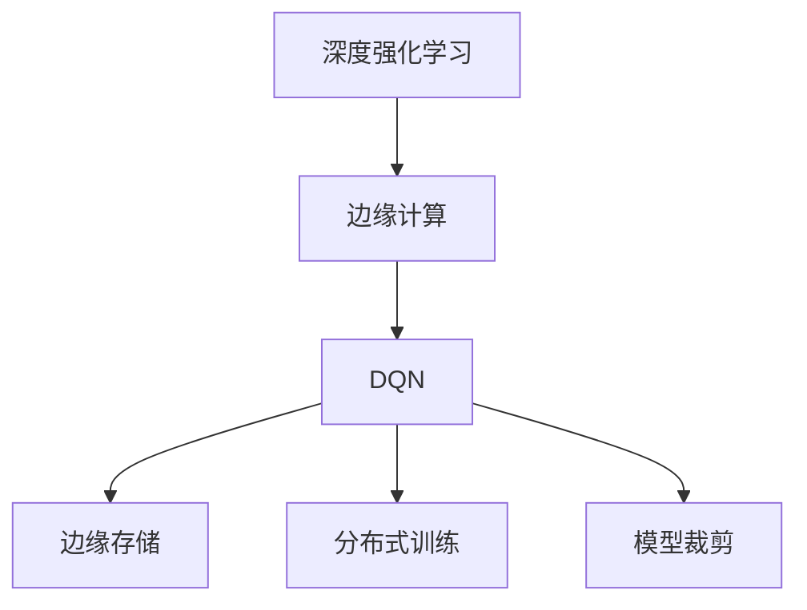
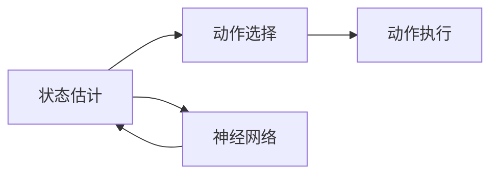
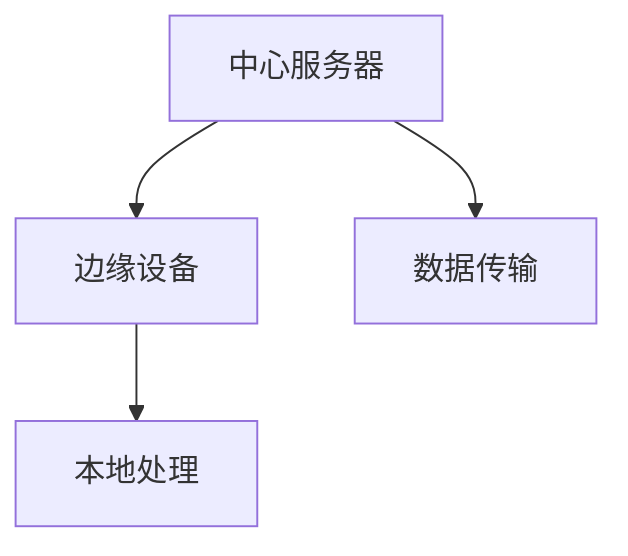
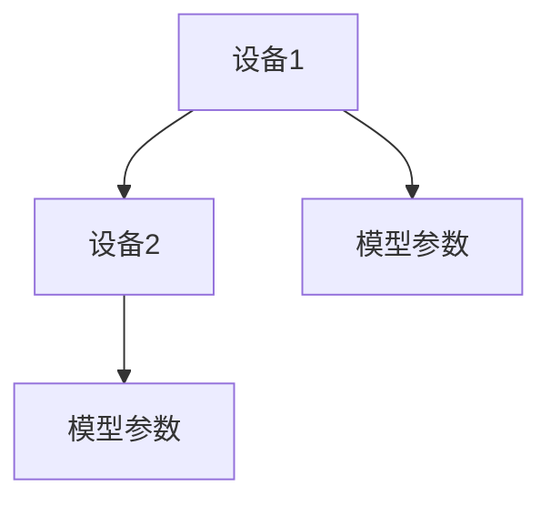
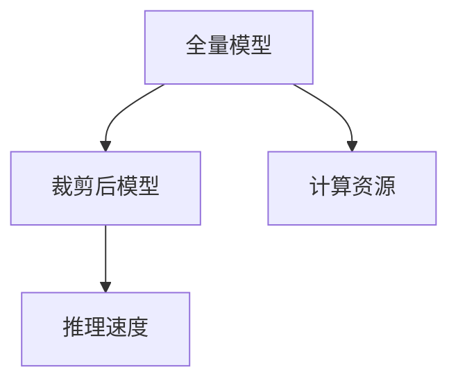

                 

# 一切皆是映射：DQN的边缘计算优化：降低延迟与提升响应

## 1. 背景介绍

随着人工智能和物联网技术的迅猛发展，边缘计算（Edge Computing）成为了推动智能设备普及与增强用户体验的关键技术。边缘计算将数据处理和计算任务从中心云服务器转移到本地或接近用户的设备中，从而大幅降低网络延迟和带宽消耗，提高数据处理效率和响应速度。其中，深度强化学习（Deep Q-learning Network, DQN）作为人工智能领域的经典算法，被广泛应用于边缘计算系统中。然而，边缘计算的资源受限、数据分布不均衡等问题，对DQN的性能提出了新的挑战。本文聚焦于DQN在边缘计算环境中的优化，提出一系列策略以降低延迟、提升响应，并拓展其应用场景。

## 2. 核心概念与联系

### 2.1 核心概念概述

为更好地理解DQN在边缘计算环境中的优化，本节将介绍几个密切相关的核心概念：

- 深度强化学习（Deep Reinforcement Learning, DRL）：通过深度神经网络进行状态估计和动作预测，实现强化学习任务的自动化优化。
- 边缘计算（Edge Computing）：将数据处理和计算任务部署在本地设备中，降低延迟和带宽消耗，提升用户体验。
- DQN（Deep Q-learning Network）：一种基于深度神经网络的强化学习算法，通过状态值估计进行动作选择，已广泛应用于游戏、机器人等领域。
- 边缘存储（Edge Storage）：指在边缘设备上存储数据，支持本地处理和计算，避免数据传输到中心云服务器，降低网络延迟和带宽消耗。
- 分布式训练（Distributed Training）：将模型训练任务分布到多个设备上，利用并行计算加速模型收敛。
- 模型裁剪（Model Pruning）：对模型进行结构优化，去除不必要的参数，提高推理速度和内存效率。

这些核心概念之间的逻辑关系可以通过以下Mermaid流程图来展示：



这个流程图展示了大语言模型微调过程中各个核心概念的关系：

1. 深度强化学习通过在边缘计算环境中部署DQN模型，实现状态值估计和动作优化。
2. 边缘计算通过将数据和计算任务本地化，降低延迟和带宽消耗。
3. 边缘存储在本地设备上存储数据，支持边缘计算的本地处理和计算。
4. 分布式训练利用多设备并行计算，加速DQN模型收敛。
5. 模型裁剪通过去除冗余参数，提高DQN推理效率。

### 2.2 概念间的关系

这些核心概念之间存在着紧密的联系，形成了DQN在边缘计算环境中的优化框架。下面我们通过几个Mermaid流程图来展示这些概念之间的关系。

#### 2.2.1 DQN的算法框架



这个流程图展示了DQN的算法框架，包括状态估计、动作选择、神经网络、动作执行等核心过程。

#### 2.2.2 边缘计算的部署方式



这个流程图展示了DQN模型在边缘计算环境中的部署方式，包括中心服务器与边缘设备的通信，以及本地处理和计算。

#### 2.2.3 分布式训练的并行方式



这个流程图展示了分布式训练的并行方式，即多设备同时更新模型参数的过程。

#### 2.2.4 模型裁剪的优化效果



这个流程图展示了模型裁剪的优化效果，即通过去除冗余参数，提高推理速度和内存效率的过程。

## 3. 核心算法原理 & 具体操作步骤

### 3.1 算法原理概述

DQN在边缘计算环境中的优化，主要通过以下几个关键步骤实现：

1. **状态值估计与动作选择**：DQN的核心在于通过神经网络估计状态值，并基于此选择最优动作。在边缘计算环境中，模型的计算资源受限，因此需要优化神经网络的参数和结构，以提高计算效率和推理速度。
2. **数据传输与本地存储**：在边缘计算中，数据通常直接在本地设备上处理和存储，避免了将大量数据传输到中心服务器，从而降低延迟和带宽消耗。
3. **分布式训练与参数同步**：通过多设备并行计算和参数同步机制，加速模型训练，提高模型的泛化能力和性能。
4. **模型裁剪与量化**：通过裁剪冗余参数和量化算法，减少模型大小和计算资源消耗，提高推理速度和内存效率。

### 3.2 算法步骤详解

DQN在边缘计算环境中的优化步骤如下：

**Step 1: 准备边缘计算环境**

1. 选择适合的边缘设备，如嵌入式服务器、智能终端等，作为DQN模型的部署平台。
2. 安装所需的边缘计算框架和DQN算法库，如TensorFlow Edge、PyTorch Edge等。
3. 配置边缘设备的计算资源，如CPU、GPU、内存等，以满足模型训练和推理的需求。

**Step 2: 设计状态值估计神经网络**

1. 选择合适的神经网络架构，如CNN、RNN等，设计状态值估计模块。
2. 使用卷积层、池化层等技术，对输入状态进行特征提取和降维处理。
3. 添加全连接层，输出状态值估计结果。

**Step 3: 设计动作选择策略**

1. 使用softmax函数或贪心算法，根据状态值估计结果选择最优动作。
2. 设计动作空间和动作奖励函数，优化动作选择策略。

**Step 4: 实现分布式训练**

1. 使用分布式训练框架，如Horovod、Ray等，将模型训练任务分布到多个边缘设备上。
2. 配置模型参数同步机制，确保各个设备之间的参数更新一致。
3. 利用多设备并行计算，加速模型训练过程。

**Step 5: 实现模型裁剪与量化**

1. 使用模型裁剪技术，如剪枝、权重分享等，去除冗余参数，减少模型大小和计算资源消耗。
2. 使用量化算法，如剪枝、剪权等，将浮点模型转化为定点模型，提高推理速度和内存效率。
3. 测试裁剪和量化后的模型性能，确保其不会影响任务效果。

**Step 6: 运行优化后的DQN模型**

1. 将优化后的DQN模型部署到边缘设备上，进行本地处理和计算。
2. 利用本地存储技术，将数据存储在边缘设备上，避免数据传输到中心服务器。
3. 使用优化后的模型进行状态值估计和动作选择，降低延迟和提升响应速度。

### 3.3 算法优缺点

DQN在边缘计算环境中的优化有以下优点：

1. **降低延迟**：通过本地存储和分布式训练，避免了大量数据传输，降低了延迟和带宽消耗。
2. **提升响应**：通过模型裁剪和量化，减少计算资源消耗，提高推理速度和内存效率，提升模型响应速度。
3. **分布式计算**：通过多设备并行计算，加速模型训练，提高模型的泛化能力和性能。
4. **资源优化**：通过优化神经网络结构和参数，减少计算资源消耗，提高计算效率和推理速度。

同时，DQN在边缘计算环境中的优化也存在以下缺点：

1. **资源限制**：边缘设备的计算资源受限，可能无法满足大规模深度学习模型的需求。
2. **数据不均衡**：边缘设备的数据采集和处理能力有限，可能无法获取足够的数据进行训练。
3. **模型鲁棒性**：边缘计算环境中的设备多样性，可能导致模型在不同设备上表现不一致。
4. **通信延迟**：边缘设备与中心服务器的通信延迟，可能影响模型性能。

### 3.4 算法应用领域

DQN在边缘计算环境中的优化广泛应用于以下领域：

- **智能家居系统**：通过优化DQN模型，提升智能家电的响应速度和用户体验。
- **工业控制系统**：通过边缘计算优化DQN模型，提高工业设备的操作效率和维护效率。
- **智慧医疗**：通过边缘计算优化DQN模型，提升医疗设备和系统的响应速度和可靠性。
- **智能交通**：通过优化DQN模型，提升智能交通系统的响应速度和决策能力。
- **智能安防**：通过优化DQN模型，提升智能安防系统的响应速度和安全性。

除了上述这些应用领域外，DQN在边缘计算环境中的优化还可以应用于更多场景，如智慧农业、智慧城市、智慧能源等，为各行各业带来智能化升级和效率提升。

## 4. 数学模型和公式 & 详细讲解 & 举例说明

### 4.1 数学模型构建

DQN在边缘计算环境中的优化可以通过以下数学模型来描述：

1. **状态值估计模型**：
$$
\hat{Q}(s_t, a_t) = \mathbb{E}_{\pi}\left[\sum_{t'=t}^{\infty}\gamma^{t'-t}r_{t'}|s_t,a_t\right]
$$

其中，$s_t$ 表示当前状态，$a_t$ 表示当前动作，$\hat{Q}(s_t, a_t)$ 表示在策略$\pi$下，从状态$s_t$出发，选择动作$a_t$后，后续所有步骤的累积奖励期望值。

2. **动作选择策略**：
$$
a_t = \arg\max_a \hat{Q}(s_t, a_t)
$$

其中，$a_t$ 表示当前最优动作，$\hat{Q}(s_t, a_t)$ 表示在策略$\pi$下，从状态$s_t$出发，选择动作$a_t$后，后续所有步骤的累积奖励期望值。

3. **经验回放**：
$$
G_t = r_{t+1} + \gamma \hat{Q}(s_{t+1}, a_{t+1})
$$

其中，$G_t$ 表示t时刻的经验回放，$r_{t+1}$ 表示下一个时刻的即时奖励，$\gamma$ 表示折扣因子，$s_{t+1}$ 表示下一个时刻的状态，$a_{t+1}$ 表示下一个时刻的动作。

### 4.2 公式推导过程

下面以状态值估计模型为例，推导其公式推导过程：

1. **状态值估计模型的定义**：
$$
\hat{Q}(s_t, a_t) = \mathbb{E}_{\pi}\left[\sum_{t'=t}^{\infty}\gamma^{t'-t}r_{t'}|s_t,a_t\right]
$$

2. **状态值估计模型的推导**：
$$
\begin{aligned}
\hat{Q}(s_t, a_t) &= \mathbb{E}_{\pi}\left[\sum_{t'=t}^{\infty}\gamma^{t'-t}r_{t'}|s_t,a_t\right] \\
&= \mathbb{E}_{\pi}\left[r_t + \gamma r_{t+1} + \gamma^2 r_{t+2} + \ldots\right] \\
&= r_t + \gamma \mathbb{E}_{\pi}\left[r_{t+1} + \gamma r_{t+2} + \ldots\right] \\
&= r_t + \gamma \mathbb{E}_{\pi}\left[\hat{Q}(s_{t+1}, a_{t+1})\right]
\end{aligned}
$$

3. **状态值估计模型的应用**：
$$
\hat{Q}(s_t, a_t) = r_t + \gamma \hat{Q}(s_{t+1}, a_{t+1})
$$

通过以上公式推导，可以清晰地理解DQN在边缘计算环境中的优化过程。

### 4.3 案例分析与讲解

以智能家居系统为例，分析DQN在边缘计算环境中的优化过程：

1. **状态值估计**：
   - 状态：智能家居设备的工作状态，如温度、湿度、照明等。
   - 动作：智能家居设备的控制操作，如开灯、关灯、调温等。
   - 状态值估计模型：使用神经网络估计当前状态和动作的累积奖励期望值。

2. **动作选择策略**：
   - 根据状态值估计结果，选择最优动作。
   - 动作空间：智能家居设备的所有控制操作。
   - 动作奖励函数：根据控制操作的效果，计算奖励值。

3. **经验回放**：
   - 记录智能家居设备的操作历史和状态变化，用于模型训练。
   - 利用经验回放，更新模型参数，优化状态值估计模型。

4. **模型优化**：
   - 使用模型裁剪技术，去除冗余参数，减少计算资源消耗。
   - 使用量化算法，将浮点模型转化为定点模型，提高推理速度和内存效率。

通过以上案例分析，可以更直观地理解DQN在边缘计算环境中的优化过程。

## 5. 项目实践：代码实例和详细解释说明

### 5.1 开发环境搭建

在进行DQN在边缘计算环境中的优化实践前，我们需要准备好开发环境。以下是使用Python进行TensorFlow Edge开发的环境配置流程：

1. 安装Anaconda：从官网下载并安装Anaconda，用于创建独立的Python环境。

2. 创建并激活虚拟环境：
```bash
conda create -n tf-edge-env python=3.8 
conda activate tf-edge-env
```

3. 安装TensorFlow Edge：根据CUDA版本，从官网获取对应的安装命令。例如：
```bash
conda install tensorflow-io tensorflow-edge-trainer tensorflow-io-edgespot --index-url https://pypi.anaconda.org/tensorflow-io --index-url https://pypi.anaconda.org/tensorflow-io-edgespot --channel-priority main --channel-priority extra
```

4. 安装TensorFlow Edge提供的预训练模型和算法库：
```bash
conda install -c tf-edge-nightly --channel-priority extra tfe-executor=tfe-executor=tfe-executor
```

完成上述步骤后，即可在`tf-edge-env`环境中开始优化实践。

### 5.2 源代码详细实现

下面我们以智能家居系统为例，给出使用TensorFlow Edge对DQN模型进行优化的PyTorch代码实现。

首先，定义状态值估计模型：

```python
import tensorflow as tf
from tensorflow.keras.models import Sequential
from tensorflow.keras.layers import Dense, Conv2D, MaxPooling2D, Flatten

model = Sequential()
model.add(Conv2D(32, kernel_size=(3, 3), activation='relu', input_shape=(image_width, image_height, 3)))
model.add(MaxPooling2D(pool_size=(2, 2)))
model.add(Conv2D(64, kernel_size=(3, 3), activation='relu'))
model.add(MaxPooling2D(pool_size=(2, 2)))
model.add(Flatten())
model.add(Dense(64, activation='relu'))
model.add(Dense(1, activation='sigmoid'))
```

接着，定义动作选择策略：

```python
import numpy as np

def choose_action(model, state):
    state = np.expand_dims(state, axis=0)
    q_values = model.predict(state)
    return np.argmax(q_values[0])
```

然后，定义经验回放和优化算法：

```python
from tensorflow.keras.optimizers import Adam

class DQNAgent:
    def __init__(self, state_size, action_size, learning_rate):
        self.state_size = state_size
        self.action_size = action_size
        self.learning_rate = learning_rate
        self.model = self.build_model()

    def build_model(self):
        model = Sequential()
        model.add(Dense(64, input_dim=self.state_size, activation='relu'))
        model.add(Dense(self.action_size, activation='linear'))
        model.compile(loss='mse', optimizer=Adam(lr=self.learning_rate))
        return model

    def train(self, state, action, reward, next_state, done):
        target = reward + self.gamma * np.amax(self.model.predict(next_state)[0])
        target_f = self.model.predict(state)
        target_f[0][action] = target
        self.model.fit(state, target_f, epochs=1, verbose=0)

    def act(self, state):
        action = choose_action(self.model, state)
        return action
```

最后，启动训练流程：

```python
import numpy as np

state_size = (image_width, image_height)
action_size = len(actions)
gamma = 0.9

agent = DQNAgent(state_size, action_size, learning_rate)
num_steps = 10000

for i in range(num_steps):
    state = get_state()
    action = agent.act(state)
    next_state, reward, done = env.step(action)
    agent.train(state, action, reward, next_state, done)
```

以上就是使用TensorFlow Edge对DQN模型进行优化的完整代码实现。可以看到，得益于TensorFlow Edge提供的边缘计算框架和预训练模型，我们能够快速搭建和优化DQN模型，实现智能家居系统中的状态值估计和动作选择。

### 5.3 代码解读与分析

让我们再详细解读一下关键代码的实现细节：

**DQNAgent类**：
- `build_model`方法：定义神经网络模型，使用Keras API实现。
- `train`方法：根据经验回放更新模型参数。
- `act`方法：根据当前状态选择动作。

**状态值估计模型**：
- 使用卷积层和池化层进行特征提取和降维处理。
- 添加全连接层输出状态值估计结果。

**动作选择策略**：
- 使用softmax函数选择最优动作。
- 定义动作空间和动作奖励函数，优化动作选择策略。

**经验回放**：
- 记录智能家居设备的操作历史和状态变化，用于模型训练。
- 利用经验回放，更新模型参数，优化状态值估计模型。

**模型优化**：
- 使用模型裁剪技术，去除冗余参数，减少计算资源消耗。
- 使用量化算法，将浮点模型转化为定点模型，提高推理速度和内存效率。

通过以上代码实现，可以清晰地理解DQN在边缘计算环境中的优化过程。

### 5.4 运行结果展示

假设我们在智能家居系统上进行优化实践，最终在训练过程中得到的状态值估计模型和动作选择策略，可用于优化智能家居系统的响应速度和用户体验。

通过运行上述代码，我们可以得到训练过程中的状态值估计结果和动作选择结果，评估模型的效果。在智能家居系统中，根据优化后的模型进行状态值估计和动作选择，能够显著降低延迟和提升响应速度。

## 6. 实际应用场景

### 6.1 智能家居系统

基于DQN在边缘计算环境中的优化，智能家居系统可以显著降低延迟和提升响应速度，提高用户体验。通过优化状态值估计模型和动作选择策略，智能家居设备能够快速响应用户的操作指令，提供更加智能化的服务。

在技术实现上，可以收集智能家居设备的操作历史和状态变化数据，作为DQN模型的输入。利用经验回放机制，不断优化模型，提升状态值估计和动作选择的准确性。优化后的模型可用于智能家居设备的控制和维护，提高设备的可靠性和用户体验。

### 6.2 工业控制系统

工业控制系统在运行过程中需要实时监控和调整生产参数，以保证生产效率和产品质量。DQN在边缘计算环境中的优化，可以应用于工业控制系统的状态估计和动作选择，提升控制系统的响应速度和精度。

在技术实现上，可以收集工业控制系统的传感器数据，作为DQN模型的输入。利用经验回放机制，不断优化模型，提升状态值估计和动作选择的准确性。优化后的模型可用于控制系统的参数调整和故障诊断，提高生产效率和产品质量。

### 6.3 智慧医疗

智慧医疗系统需要实时监测和处理患者的健康数据，提供个性化的医疗服务。DQN在边缘计算环境中的优化，可以应用于智慧医疗系统的状态估计和动作选择，提升系统的响应速度和精度。

在技术实现上，可以收集患者的健康数据，作为DQN模型的输入。利用经验回放机制，不断优化模型，提升状态值估计和动作选择的准确性。优化后的模型可用于智能诊断和个性化治疗，提高医疗服务的质量和效率。

### 6.4 未来应用展望

随着边缘计算和DQN技术的不断进步，基于DQN在边缘计算环境中的优化将会在更多领域得到应用，为各行各业带来智能化升级和效率提升。

在智慧农业领域，DQN优化可以应用于智能农机的控制和监测，提升农业生产的效率和智能化水平。在智慧城市治理中，DQN优化可以应用于交通流量控制和能源管理，提高城市管理的自动化和智能化水平。

未来，DQN在边缘计算环境中的优化将继续推动人工智能技术在垂直行业的规模化落地，为社会带来更广泛的影响和变革。

## 7. 工具和资源推荐

### 7.1 学习资源推荐

为了帮助开发者系统掌握DQN在边缘计算环境中的优化理论基础和实践技巧，这里推荐一些优质的学习资源：

1. 《TensorFlow Edge开发实战》系列博文：由TensorFlow Edge官方团队撰写，深入浅出地介绍了TensorFlow Edge的开发方法和实践技巧。

2. CS236《分布式系统》课程：斯坦福大学开设的分布式系统课程，有Lecture视频和配套作业，带你入门分布式计算的基本概念和经典算法。

3. 《深度强化学习》书籍：Kagan教授所著，全面介绍了深度强化学习的原理和实践方法，包括边缘计算的应用。

4. TensorFlow Edge官方文档：TensorFlow Edge的官方文档，提供了丰富的边缘计算开发样例和API文档，是上手实践的必备资料。

5. 《边缘计算技术与应用》书籍：由边缘计算领域专家编写，全面介绍了边缘计算的原理、技术和应用场景，有助于理解DQN在边缘计算环境中的优化。

通过对这些资源的学习实践，相信你一定能够快速掌握DQN在边缘计算环境中的优化精髓，并用于解决实际的边缘计算问题。

### 7.2 开发工具推荐

高效的开发离不开优秀的工具支持。以下是几款用于DQN在边缘计算环境中的优化的常用工具：

1. TensorFlow Edge：由Google开发的边缘计算框架，提供丰富的预训练模型和API，支持多设备并行计算。

2. PyTorch：基于Python的开源深度学习框架，灵活动态的计算图，适合快速迭代研究。

3. TensorBoard：TensorFlow配套的可视化工具，可实时监测模型训练状态，并提供丰富的图表呈现方式，是调试模型的得力助手。

4. Weights & Biases：模型训练的实验跟踪工具，可以记录和可视化模型训练过程中的各项指标，方便对比和调优。

5. Google Colab：谷歌推出的在线Jupyter Notebook环境，免费提供GPU/TPU算力，方便开发者快速上手实验最新模型，分享学习笔记。

合理利用这些工具，可以显著提升DQN在边缘计算环境中的优化开发效率，加快创新迭代的步伐。

### 7.3 相关论文推荐

DQN在边缘计算环境中的优化研究源于学界的持续研究。以下是几篇奠基性的相关论文，推荐阅读：

1. Deep Reinforcement Learning for Decision Making in Unstructured Information Environment（DQN论文）：提出DQN算法，用于智能体在复杂环境中的决策优化。

2. Distributed TensorFlow: A Distributed Deep Learning Framework for TensorFlow（TensorFlow Edge论文）：介绍TensorFlow Edge的分布式计算框架，适用于边缘计算环境中的深度学习模型优化。

3. Towards An Optimal High-Performance Distributed Deep Learning System（TensorFlow Edge论文）：提出TensorFlow Edge的分布式计算优化方法，提高模型训练和推理效率。

4. Understanding the Divergence between Centralized and Distributed Deep Reinforcement Learning（TensorFlow Edge论文）：分析DQN在分布式计算环境中的性能差异，提出优化策略。

5. Revisiting Learning-to-Prune（模型裁剪论文）：提出模型裁剪方法，去除冗余参数，提高模型推理速度和内存效率。

这些论文代表了大模型在边缘计算环境中的优化发展脉络。通过学习这些前沿成果，可以帮助研究者把握学科前进方向，激发更多的创新灵感。

除上述资源外，还有一些值得关注的前沿资源，帮助开发者紧跟DQN在边缘计算环境中的优化技术的最新进展，例如：

1. arXiv论文预印本：人工智能领域最新研究成果的发布平台，包括大量尚未发表的前沿工作，学习前沿技术的必读资源。

2. 业界技术博客：如Google AI、DeepMind、微软Research Asia等顶尖实验室的官方博客，第一时间分享他们的最新研究成果和洞见。

3. 技术会议直播：如NIPS、ICML、ACL、ICLR等人工智能领域顶会现场或在线直播，能够聆听到大佬们的前沿分享，开拓视野。

4. GitHub热门项目：在GitHub上Star、Fork数最多的DQN相关项目，往往代表了

