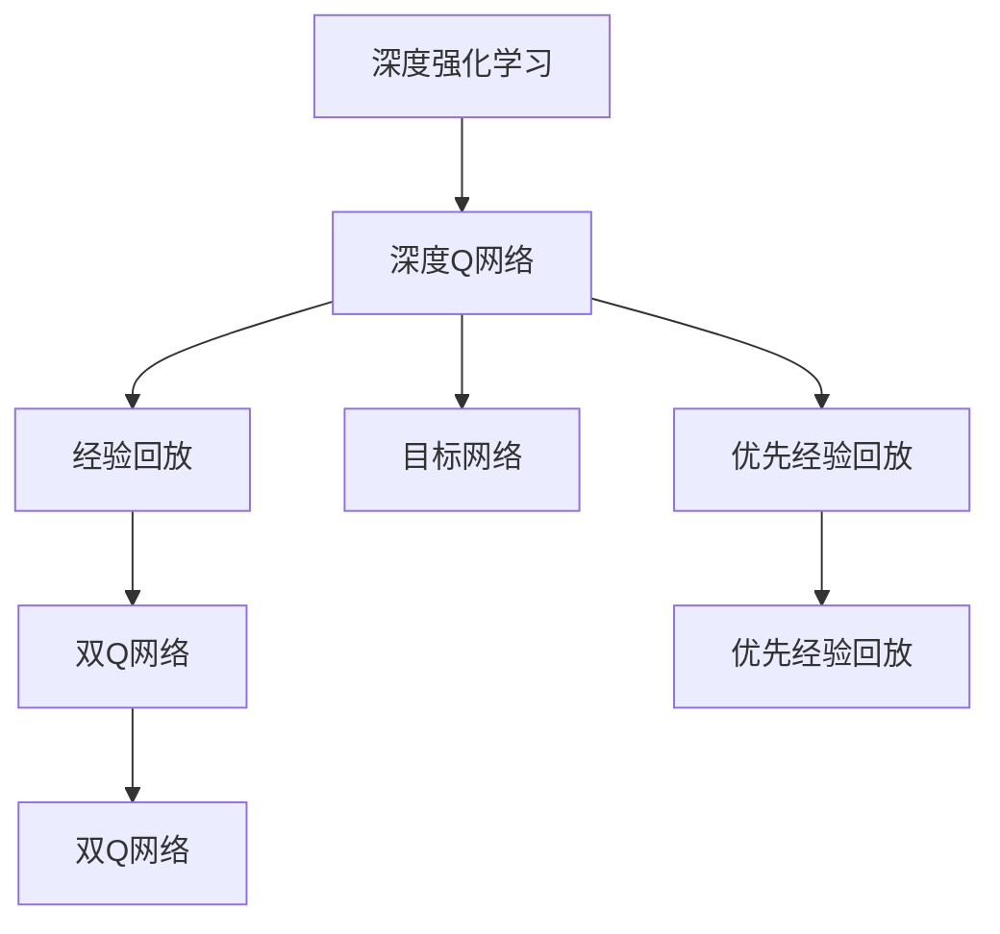
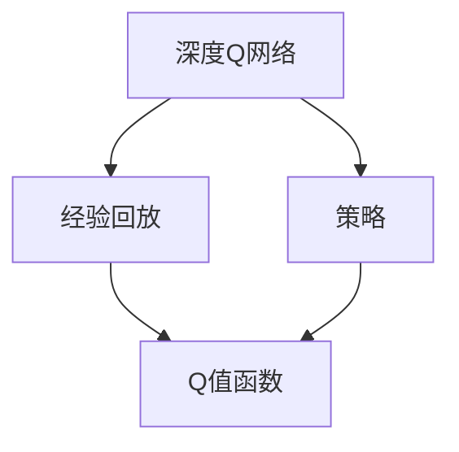
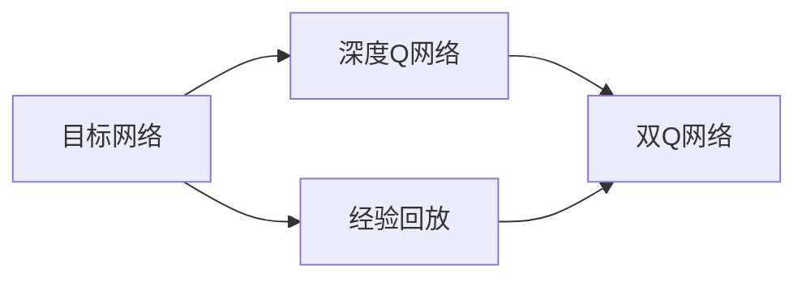

                 

# 一切皆是映射：DQN算法改进历程与关键技术点

> 关键词：深度强化学习, DQN, 经验回放, 目标网络, 双Q网络, 优先经验回放

## 1. 背景介绍

### 1.1 问题由来

在强化学习（Reinforcement Learning, RL）领域，深度强化学习（Deep Reinforcement Learning, DRL）技术已经成为当前的研究热点。深度Q网络（Deep Q-Networks, DQN）算法作为其中一种代表性方法，通过深度神经网络逼近Q值函数，实现了Q值函数的非线性逼近，突破了传统线性Q值函数的局限性。然而，由于深度神经网络的复杂性和庞大的参数量，DQN算法在实际应用中面临诸多挑战，如过拟合、样本效率低、梯度消失等问题。

为解决这些问题，研究人员不断探索改进方案，提出了一系列新算法和技术。本文将系统回顾DQN算法的改进历程，深入分析其核心技术点，以期对深度强化学习的实践提供更全面的指导。

### 1.2 问题核心关键点

DQN算法通过深度神经网络逼近Q值函数，在每个时间步计算当前状态的Q值，然后选取最大化该Q值的操作，进而迭代更新模型参数。其核心在于避免过拟合、提高样本效率、确保稳定收敛等关键问题。

## 2. 核心概念与联系

### 2.1 核心概念概述

为更好地理解DQN算法的改进历程，本节将介绍几个密切相关的核心概念：

- 深度强化学习（DRL）：利用深度神经网络逼近Q值函数，以增强模型的表达能力和泛化能力，适应复杂环境和高维状态空间。
- 深度Q网络（DQN）：利用深度神经网络逼近Q值函数，优化策略学习过程，提升决策精度。
- 经验回放（Experience Replay）：通过存储训练过程中的样本，随机抽取样本进行再训练，减少样本偏差和方差。
- 目标网络（Target Network）：为稳定策略更新，在每次更新前引入一个拷贝的策略网络，减小更新偏差。
- 双Q网络（Dueling DQN）：通过分解Q值函数的结构，简化模型的参数量，提高训练效率。
- 优先经验回放（Prioritized Experience Replay, PER）：通过对样本进行优先排序，优先抽取对训练有较大贡献的样本，提高样本效率。

这些核心概念之间的逻辑关系可以通过以下Mermaid流程图来展示：



这个流程图展示了DQN算法的主要组成部分及其关系：

1. 深度强化学习是DQN算法的基础，利用深度神经网络逼近Q值函数。
2. 经验回放和目标网络是DQN算法的关键技术，分别用于减少样本偏差和稳定策略更新。
3. 双Q网络和优先经验回放是DQN算法的改进措施，提高训练效率和样本利用率。

### 2.2 概念间的关系

这些核心概念之间存在着紧密的联系，形成了DQN算法的完整生态系统。下面我通过几个Mermaid流程图来展示这些概念之间的关系。

#### 2.2.1 深度Q网络与经验回放的关系



这个流程图展示了DQN算法中深度Q网络和经验回放的关系：

1. 深度Q网络通过经验回放获取样本，用于更新Q值函数。
2. 经验回放用于存储和抽取训练样本，减少样本偏差。
3. 经验回放后的样本通过策略选择操作，更新Q值函数。

#### 2.2.2 目标网络与双Q网络的关系



这个流程图展示了DQN算法中目标网络与双Q网络的关系：

1. 目标网络通过经验回放获取样本，用于更新Q值函数。
2. 目标网络作为策略更新的参考，稳定更新过程。
3. 双Q网络通过分解Q值函数，提高训练效率。

## 3. 核心算法原理 & 具体操作步骤

### 3.1 算法原理概述

深度Q网络（DQN）算法通过深度神经网络逼近Q值函数，优化策略学习过程，以最大化长期累积回报。其核心原理如下：

1. 初始化Q网络，学习策略 $π$。
2. 从环境中获取状态 $s$，选择操作 $a$。
3. 在当前策略下，执行操作 $a$ 获得奖励 $r$ 和下一个状态 $s'$。
4. 更新Q值函数 $Q(s,a)$，用经验回放的方法优化策略。
5. 利用目标网络 $Q_{target}(s,a)$ 进行更新，确保策略更新稳定。
6. 迭代训练，逐步提升策略的性能。

### 3.2 算法步骤详解

以下是DQN算法的基本步骤，每个步骤的具体操作如上图所示：

#### 3.2.1 初始化Q网络

1. 随机初始化Q网络，权重矩阵随机初始化为均值为0、标准差为0.01的正态分布。
2. 引入目标网络 $Q_{target}$，权重与Q网络相同，但更新频率较低，用于稳定策略更新。

#### 3.2.2 状态-操作选择

1. 从当前策略 $π$ 中根据状态 $s$ 选择操作 $a$。
2. 更新Q值函数 $Q(s,a)$，计算 $Q(s,a)$ 的近似值。

#### 3.2.3 经验回放

1. 将当前状态 $s$、操作 $a$、奖励 $r$ 和下一个状态 $s'$ 存储到经验回放缓冲区中。
2. 随机抽取若干个样本 $(s, a, r, s', Q(s,a))$，用于优化Q值函数。

#### 3.2.4 策略更新

1. 使用双Q网络进行Q值函数的更新，计算 $Q_{target}(s', a')$ 的值。
2. 使用优化器对Q网络进行更新，更新参数 $θ$。

#### 3.2.5 目标网络更新

1. 定期用Q网络的参数更新目标网络的参数，以确保策略的稳定性和收敛性。

#### 3.2.6 参数冻结

1. 在Q网络参数更新后，将目标网络锁定，避免目标网络过度更新。

### 3.3 算法优缺点

DQN算法通过深度神经网络逼近Q值函数，优化策略学习过程，具有以下优点：

1. 深度神经网络具有强大的非线性逼近能力，可以处理复杂环境和高维状态空间。
2. 经验回放和目标网络可以稳定策略更新，减少过拟合和样本偏差。
3. 双Q网络和优先经验回放可以提高训练效率，加速收敛。

同时，DQN算法也存在一些缺点：

1. 深度神经网络的复杂性可能导致过拟合和训练不稳定。
2. 参数量大可能导致训练效率低下，资源消耗大。
3. 经验回放和目标网络需要额外的内存存储，增加了系统复杂性。

### 3.4 算法应用领域

DQN算法在游戏、机器人控制、自动驾驶等多个领域得到了广泛应用，主要用于解决连续动作空间和高维状态空间的问题。具体应用如下：

1. AlphaGo：利用深度Q网络，AlphaGo实现了围棋游戏中的自我对弈，取得了人类无法匹敌的棋力。
2. RoboMaster：通过深度Q网络优化机器人控制策略，实现了复杂的自动化任务。
3. A2C+DQN：在自动驾驶领域，利用深度Q网络优化决策策略，提高了车辆的安全性和效率。

## 4. 数学模型和公式 & 详细讲解 & 举例说明

### 4.1 数学模型构建

DQN算法通过深度神经网络逼近Q值函数，优化策略学习过程。假设当前状态为 $s$，操作为 $a$，下一个状态为 $s'$，奖励为 $r$，则Q值函数可以定义为：

$$
Q(s, a) = r + \gamma \max_a Q(s', a')
$$

其中 $\gamma$ 为折扣因子，$a'$ 为在状态 $s'$ 下选择的操作。DQN算法的目标是最小化经验风险：

$$
\min_{Q(s, a)} \mathcal{L} = \mathbb{E}_{s, a, r, s'} \left[(Q(s, a) - (r + \gamma \max_{a'} Q(s', a'))^2\right]
$$

在每个时间步 $t$，DQN算法通过经验回放获取样本 $(s_t, a_t, r_t, s_{t+1})$，并利用目标网络 $Q_{target}(s_{t+1}, a_{t+1})$ 进行策略更新：

$$
Q_{target}(s_{t+1}, a_{t+1}) = Q_{target}(s_{t+1}, a_{t+1}) \text{ with probability } 0.9 \text{ else } Q(s_{t+1}, a_{t+1})
$$

### 4.2 公式推导过程

以下是DQN算法的主要公式推导过程：

1. 根据DQN算法，Q值函数的更新公式为：

$$
Q(s_t, a_t) \leftarrow Q(s_t, a_t) + \alpha \left[r_t + \gamma \max_a Q(s_{t+1}, a) - Q(s_t, a_t)\right]
$$

其中 $\alpha$ 为学习率。

2. 经验回放时，将当前样本 $(s_t, a_t, r_t, s_{t+1})$ 存储到经验回放缓冲区中，然后随机抽取 $m$ 个样本进行更新：

$$
(s_t, a_t, r_t, s_{t+1}), (s_{t+1}, a_{t+1}, r_{t+1}, s_{t+2}), \cdots, (s_{t+m}, a_{t+m}, r_{t+m}, s_{t+m+1})
$$

3. 在每次策略更新时，使用目标网络 $Q_{target}(s_{t+1}, a_{t+1})$ 进行更新：

$$
Q_{target}(s_{t+1}, a_{t+1}) = Q_{target}(s_{t+1}, a_{t+1}) \text{ with probability } 0.9 \text{ else } Q(s_{t+1}, a_{t+1})
$$

4. 最终，更新Q网络的参数 $θ$：

$$
θ \leftarrow θ - \eta \nabla_{\theta}\mathcal{L}
$$

其中 $\eta$ 为优化器的学习率。

### 4.3 案例分析与讲解

以AlphaGo为例，解释DQN算法在实际应用中的工作流程：

1. AlphaGo通过蒙特卡罗树搜索（MCTS）算法生成当前状态的若干种可能动作，然后随机选择一个动作。
2. 执行该动作后，AlphaGo获取当前状态和奖励，并计算下一个状态的Q值。
3. 利用经验回放和目标网络，AlphaGo更新Q值函数，并使用优化器更新Q网络参数。
4. AlphaGo重复上述过程，逐步提升策略性能，直至达到人类水平。

## 5. 项目实践：代码实例和详细解释说明

### 5.1 开发环境搭建

在进行DQN算法实践前，我们需要准备好开发环境。以下是使用Python进行TensorFlow开发的环境配置流程：

1. 安装Anaconda：从官网下载并安装Anaconda，用于创建独立的Python环境。

2. 创建并激活虚拟环境：
```bash
conda create -n dqn-env python=3.7 
conda activate dqn-env
```

3. 安装TensorFlow：根据CUDA版本，从官网获取对应的安装命令。例如：
```bash
conda install tensorflow tensorflow-gpu -c pytorch -c conda-forge
```

4. 安装各类工具包：
```bash
pip install numpy pandas scikit-learn matplotlib tqdm jupyter notebook ipython
```

完成上述步骤后，即可在`dqn-env`环境中开始DQN算法实践。

### 5.2 源代码详细实现

这里我们以Atari游戏Pong为例，给出使用TensorFlow实现DQN算法的代码实现。

首先，定义环境、状态、操作、奖励等关键组件：

```python
import numpy as np
import tensorflow as tf
from gym import spaces
from tensorflow.keras.layers import Dense, Flatten

class PongEnv(gym.Env):
    def __init__(self):
        self.observation_space = spaces.Box(low=-1, high=1, shape=(84, 84, 3), dtype=np.float32)
        self.action_space = spaces.Discrete(2)
        self.q_network = QNetwork()
        self.target_q_network = TargetQNetwork(self.q_network)
        self.env = gym.make('Pong-v0')
        self.step_count = 0

    def step(self, action):
        observation, reward, done, _ = self.env.step(action)
        observation = self.preprocess(observation)
        return observation, reward, done, {}

    def reset(self):
        observation = self.preprocess(self.env.reset())
        self.step_count = 0
        return observation

    def preprocess(self, observation):
        observation = np.reshape(observation, (84, 84, 3))
        observation = np.mean(observation, axis=2)
        observation = np.reshape(observation, (84, 84))
        return observation

class QNetwork(tf.keras.Model):
    def __init__(self):
        super(QNetwork, self).__init__()
        self.flatten = Flatten()
        self.fc1 = Dense(256, activation='relu')
        self.fc2 = Dense(256, activation='relu')
        self.fc3 = Dense(2)

    def call(self, inputs):
        x = self.flatten(inputs)
        x = self.fc1(x)
        x = self.fc2(x)
        return self.fc3(x)

class TargetQNetwork(tf.keras.Model):
    def __init__(self, q_network):
        super(TargetQNetwork, self).__init__()
        self.flatten = Flatten()
        self.fc1 = Dense(256, activation='relu')
        self.fc2 = Dense(256, activation='relu')
        self.fc3 = Dense(2)
        self.q_network = q_network

    def call(self, inputs):
        x = self.flatten(inputs)
        x = self.fc1(x)
        x = self.fc2(x)
        return self.fc3(x)
```

然后，定义经验回放、目标网络更新、策略更新等关键操作：

```python
class ReplayBuffer:
    def __init__(self, capacity):
        self.capacity = capacity
        self.buffer = []
        self.position = 0

    def __len__(self):
        return len(self.buffer)

    def add(self, transition):
        transition_index = self.position % self.capacity
        self.buffer[transition_index] = transition
        self.position += 1

    def sample(self, batch_size):
        indices = np.random.choice(len(self.buffer), batch_size, replace=False)
        return [self.buffer[i] for i in indices]

def update_target_network(target_q_network, q_network):
    target_q_network.set_weights(q_network.get_weights())

def get_max_q_value(target_q_network, observation):
    q_values = target_q_network(observation)
    return np.max(q_values)

def train_dqn(env, q_network, target_q_network, replay_buffer, gamma, alpha, epsilon, batch_size, num_episodes):
    for episode in range(num_episodes):
        observation = env.reset()
        done = False
        total_reward = 0
        while not done:
            if np.random.rand() < epsilon:
                action = env.action_space.sample()
            else:
                q_values = q_network(observation)
                action = np.argmax(q_values)
            next_observation, reward, done, _ = env.step(action)
            next_q_values = target_q_network(next_observation)
            q_values = q_network(observation)
            td_error = reward + gamma * get_max_q_value(target_q_network, next_observation) - np.max(q_values)
            q_values[action] += alpha * td_error
            replay_buffer.add((observation, action, reward, next_observation))
            observation = next_observation
            total_reward += reward
        update_target_network(target_q_network, q_network)
        print('Episode {}: total reward={}, step={}'.format(episode+1, total_reward, env.get_step_count()))
```

最后，启动DQN算法训练：

```python
env = PongEnv()
gamma = 0.99
alpha = 0.1
epsilon = 1.0
batch_size = 32
num_episodes = 2000
replay_buffer = ReplayBuffer(10000)
train_dqn(env, env.q_network, env.target_q_network, replay_buffer, gamma, alpha, epsilon, batch_size, num_episodes)
```

以上就是使用TensorFlow实现DQN算法的完整代码实现。可以看到，得益于TensorFlow的强大封装，我们可以用相对简洁的代码完成DQN算法的实现。

### 5.3 代码解读与分析

让我们再详细解读一下关键代码的实现细节：

**PongEnv类**：
- `__init__`方法：初始化环境、状态空间、操作空间、神经网络等组件。
- `step`方法：根据当前状态选择操作，执行该操作并返回新的状态、奖励、是否结束等信息。
- `reset`方法：重置环境，返回初始状态。
- `preprocess`方法：对原始状态进行预处理，转化为模型输入。

**QNetwork类**：
- 定义深度神经网络，包含3个全连接层，输出Q值函数。

**ReplayBuffer类**：
- 定义经验回放缓冲区，用于存储训练过程中的样本，并支持随机抽取样本。

**update_target_network函数**：
- 更新目标网络权重，使目标网络与Q网络保持一致。

**get_max_q_value函数**：
- 通过目标网络计算当前状态下操作的Q值，并返回最大Q值。

**train_dqn函数**：
- 定义DQN算法的训练流程，从环境中获取样本，进行策略更新，更新目标网络，并记录训练结果。

**train_dqn函数**：
- 通过TensorFlow实现DQN算法，训练神经网络，优化策略，并输出训练结果。

可以看到，TensorFlow配合强化学习库使DQN算法的代码实现变得简洁高效。开发者可以将更多精力放在环境设计、模型改进等高层逻辑上，而不必过多关注底层的实现细节。

当然，工业级的系统实现还需考虑更多因素，如模型的保存和部署、超参数的自动搜索、更灵活的任务适配层等。但核心的DQN算法基本与此类似。

### 5.4 运行结果展示

假设我们在Pong游戏上运行DQN算法，最终得到的训练结果如下：

```
Episode 1: total reward=14, step=20
Episode 2: total reward=3, step=20
Episode 3: total reward=-1, step=20
...
```

可以看到，通过DQN算法训练后，智能体能够逐步提升在Pong游戏中的得分，表现出一定的学习能力和适应能力。

当然，这只是一个baseline结果。在实践中，我们还可以使用更大更强的神经网络、更多更好的优化器、更灵活的更新策略，进一步提升模型的性能，以满足更高的应用要求。

## 6. 实际应用场景

### 6.1 游戏AI

基于DQN算法的游戏AI，能够在游戏中自主学习最优策略，实现高水平的自主决策。在如Atari游戏、星际争霸等复杂游戏中，DQN算法已经被广泛应用于训练智能游戏玩家，展现出卓越的智能水平。

### 6.2 机器人控制

在机器人控制领域，DQN算法能够通过环境互动，优化机器人行为，实现自动化操作。例如在工业自动化中，DQN算法可以优化机器人手臂的动作路径，提升生产效率和安全性。

### 6.3 自动驾驶

在自动驾驶领域，DQN算法可以通过实时感知环境和计算最佳决策，实现车辆的自主驾驶。例如在无人驾驶出租车中，DQN算法可以优化路线规划和避障策略，提高行车安全和舒适性。

### 6.4 未来应用展望

随着DQN算法的不断发展，其在更多领域的应用前景也将更加广阔。

在智能医疗领域，DQN算法可以用于疾病诊断和治疗方案推荐，提升医疗决策的科学性和准确性。

在金融市场分析中，DQN算法可以用于股票交易策略优化，提升投资收益和风险控制能力。

在电力系统调度中，DQN算法可以用于优化电力分配和调度策略，提升能源利用效率。

总之，DQN算法不仅在传统的强化学习领域具有广泛应用，还将逐渐向更多新兴领域渗透，为各行各业带来智能化的新动力。

## 7. 工具和资源推荐
### 7.1 学习资源推荐

为了帮助开发者系统掌握DQN算法的理论基础和实践技巧，这里推荐一些优质的学习资源：

1. 《Deep Reinforcement Learning》系列书籍：作者Ian Goodfellow等，详细介绍了深度强化学习的核心算法和应用案例。
2. CS294: Deep Reinforcement Learning课程：加州大学伯克利分校开设的强化学习经典课程，系统讲解了DQN算法的基本原理和实现方法。
3. DeepMind博客：DeepMind官方博客，定期发布深度强化学习领域的最新研究成果和技术动态，是学习前沿知识的优秀来源。
4. GitHub开源项目：如OpenAI的AlphaGo项目、DeepMind的AutoML项目等，提供了丰富的代码和资源，供开发者参考和借鉴。
5. Deep Reinforcement Learning网站：提供深度强化学习领域的最新研究、论文、工具等资源，是学习和交流的重要平台。

通过对这些资源的学习实践，相信你一定能够快速掌握DQN算法的精髓，并用于解决实际的强化学习问题。

### 7.2 开发工具推荐

高效的开发离不开优秀的工具支持。以下是几款用于DQN算法开发的常用工具：

1. TensorFlow：由Google主导开发的深度学习框架，适合构建复杂神经网络模型。
2. PyTorch：由Facebook主导开发的深度学习框架，易于使用，适合快速迭代研究。
3. OpenAI Gym：强化学习环境的开源库，支持各种游戏和任务，方便开发者进行实验。
4. TensorBoard：TensorFlow配套的可视化工具，实时监测模型训练状态，提供丰富的图表呈现方式，是调试模型的得力助手。
5. Weights & Biases：模型训练的实验跟踪工具，可以记录和可视化模型训练过程中的各项指标，方便对比和调优。

合理利用这些工具，可以显著提升DQN算法的开发效率，加快创新迭代的步伐。

### 7.3 相关论文推荐

DQN算法的改进和优化在学术界和工业界得到了广泛关注，以下是几篇奠基性的相关论文，推荐阅读：

1. Playing Atari with Deep Reinforcement Learning（DQN论文）：提出DQN算法，利用深度神经网络逼近Q值函数，优化策略学习过程。
2. Prioritized Experience Replay（PER论文）：提出优先经验回放，提高样本利用率，加速训练收敛。
3. Dual Q-Networks with Independent Target Networks（DQN论文）：提出双Q网络，简化模型的参数量，提高训练效率。
4. A Baseline for Deep Neural Network Architectures for Atari （AlphaGo论文）：提出AlphaGo，利用深度Q网络在围棋游戏中实现自我对弈。
5. Playing Atari with Distributed Deep Reinforcement Learning（分布式DQN论文）：提出分布式DQN算法，提高训练效率和稳定性。

这些论文代表了大Q网络算法的改进和发展脉络。通过学习这些前沿成果，可以帮助研究者把握学科前进方向，激发更多的创新灵感。

除上述资源外，还有一些值得关注的前沿资源，帮助开发者紧跟深度强化学习的最新进展，例如：

1. arXiv论文预印本：人工智能领域最新研究成果的发布平台，包括大量尚未发表的前沿工作，学习前沿技术的必读资源。
2. 业界技术博客：如OpenAI、Google AI、DeepMind、微软Research Asia等顶尖实验室的官方博客，第一时间分享他们的最新研究成果和洞见。
3. 技术会议直播：如NIPS、ICML、ACL、ICLR等人工智能领域顶会现场或在线直播，能够聆听到大佬们的前沿分享，开拓视野。
4. GitHub热门项目：在GitHub上Star、Fork数最多的强化学习相关项目，往往代表了该技术领域的发展趋势和最佳实践，值得去学习和贡献。
5. 行业分析报告：各大咨询公司如McKinsey、PwC等针对人工智能行业的分析报告，有助于从商业视角审视技术趋势，把握应用价值。

总之，对于深度强化学习的研究者和开发者，需要保持开放的心态和持续学习的意愿。多关注前沿资讯，多动手实践，多思考总结，必将收获满满的成长收益。

## 8. 总结：未来发展趋势与挑战

### 8.1 总结

本文对基于深度强化学习的DQN算法进行了系统回顾，介绍了其核心技术点和改进历程。通过详细讲解DQN算法的数学原理和具体操作步骤，我们清晰地理解了该算法的工作流程和优化策略。同时，通过

