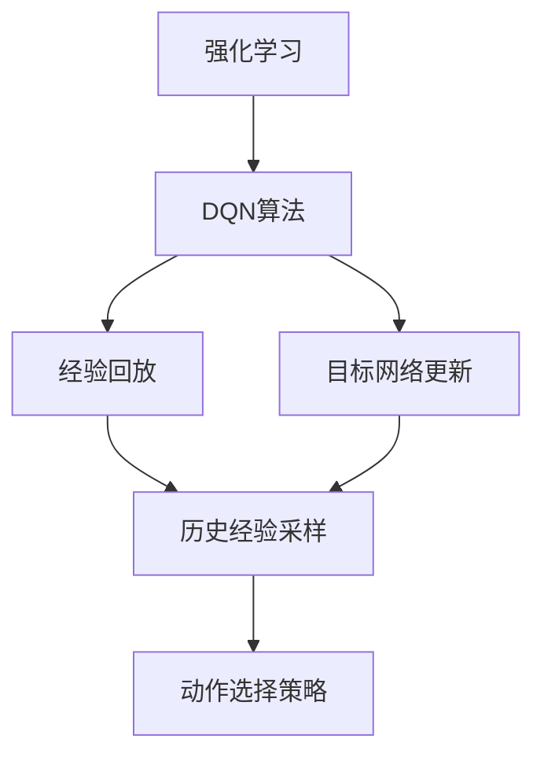
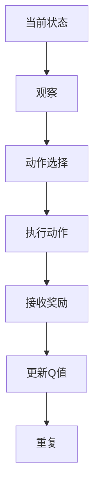
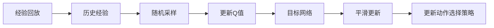
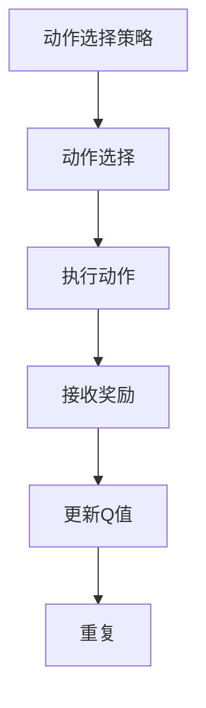
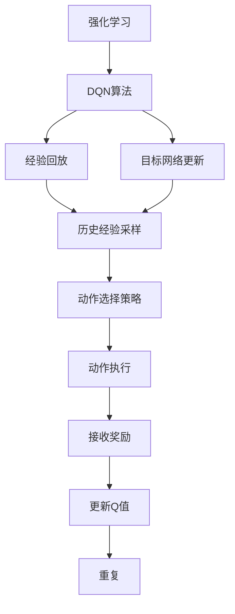

                 

## 1. 背景介绍

### 1.1 问题由来

深度强化学习（Deep Reinforcement Learning, DRL）作为深度学习与强化学习的交叉领域，近年来在求解复杂决策问题上取得了突破性进展。DQN（Deep Q-Network）算法作为DRL领域的经典算法之一，在解决连续空间环境中复杂动作决策问题上表现出色，被广泛应用于游戏AI、机器人控制等领域。

然而，DQN算法在实际应用中，往往难以保证收敛性和稳定性，常常出现模型训练发散、更新参数不收敛或收敛到局部最优解等问题。这些问题不仅会影响模型的实际应用效果，还可能带来系统性风险，导致决策失误。因此，深入分析DQN算法的收敛性和稳定性，是确保其在复杂环境下的可靠性的重要前提。

### 1.2 问题核心关键点

DQN算法的收敛性主要依赖于其训练过程的稳定性和参数更新策略的合理性。在实际应用中，DQN算法通常面临以下关键问题：

- 经验回放与目标网络更新策略的合理设计，以确保模型能够从历史经验中有效学习。
- 动作选择策略的优化，避免陷入局部最优解。
- 参数更新策略的稳定性，确保模型能够稳定收敛。
- 模型的泛化能力，避免过拟合和欠拟合。

以上问题的解决，需要深入理解DQN算法的数学原理，结合实际应用场景，不断优化算法设计和参数配置，以提升DQN算法的实际应用效果。

### 1.3 问题研究意义

深入分析DQN算法的收敛性和稳定性，对于提升DRL模型的可靠性和鲁棒性具有重要意义。具体而言：

- 确保模型在复杂环境下的决策效果，避免决策失误。
- 提高模型的泛化能力，适应更多应用场景。
- 优化模型训练过程，提升模型收敛速度。
- 确保模型在不同硬件平台上的稳定性和可移植性。

## 2. 核心概念与联系

### 2.1 核心概念概述

为更好地理解DQN算法的收敛性和稳定性，本节将介绍几个密切相关的核心概念：

- 强化学习（Reinforcement Learning, RL）：一种学习框架，通过与环境交互，最大化累积奖励信号来学习最优策略。
- DQN算法：基于深度神经网络构建的Q-learning算法，适用于连续动作空间中的决策问题。
- 经验回放（Experience Replay）：一种技术，用于从历史交互数据中随机抽样，使模型能够从大量经验中学习。
- 目标网络更新（Target Network Update）：一种机制，用于平滑更新Q值估计，避免更新过程中出现梯度爆炸或消失。
- 动作选择策略（Action Selection Strategy）：用于从当前状态中决策动作的策略，直接影响学习效果。

这些核心概念之间的逻辑关系可以通过以下Mermaid流程图来展示：



这个流程图展示了DQN算法的主要组件及其关系：

1. DQN算法基于强化学习框架，通过最大化累积奖励来学习最优策略。
2. 经验回放技术从历史经验中随机采样，使模型能够从大量数据中学习。
3. 目标网络更新机制平滑更新Q值估计，避免更新过程中出现不稳定。
4. 动作选择策略用于决策当前状态下的动作，直接影响学习效果。

### 2.2 概念间的关系

这些核心概念之间存在着紧密的联系，形成了DQN算法的完整生态系统。下面我们通过几个Mermaid流程图来展示这些概念之间的关系。

#### 2.2.1 DQN算法的主要流程



这个流程图展示了DQN算法的基本流程：

1. 观察当前状态。
2. 根据当前状态选择动作。
3. 执行选择动作，接收环境反馈。
4. 根据反馈更新Q值估计。
5. 重复上述过程，不断优化策略。

#### 2.2.2 经验回放与目标网络更新的关系



这个流程图展示了经验回放和目标网络更新之间的关系：

1. 经验回放从历史经验中随机采样。
2. 使用采样数据更新Q值估计。
3. 目标网络平滑更新Q值估计，避免更新过程中的不稳定。
4. 根据更新后的Q值估计，优化动作选择策略。

#### 2.2.3 动作选择策略的影响



这个流程图展示了动作选择策略对DQN算法的影响：

1. 动作选择策略根据当前状态选择动作。
2. 执行选择动作，接收环境反馈。
3. 根据反馈更新Q值估计。
4. 重复上述过程，不断优化策略。

### 2.3 核心概念的整体架构

最后，我们用一个综合的流程图来展示这些核心概念在大语言模型微调过程中的整体架构：



这个综合流程图展示了从DQN算法的基本流程，到经验回放、目标网络更新、动作选择策略等关键组件的完整架构，帮助理解DQN算法的整体工作原理。

## 3. 核心算法原理 & 具体操作步骤
### 3.1 算法原理概述

DQN算法通过深度神经网络（如卷积神经网络）来估计Q值函数$Q(s,a)$，其中$s$表示状态，$a$表示动作。Q值函数表示在状态$s$下采取动作$a$的累积奖励的期望值。DQN算法的基本步骤如下：

1. 观察当前状态$s$。
2. 根据当前状态选择动作$a$。
3. 执行选择动作，接收环境反馈$r$和下一个状态$s'$。
4. 计算下一个状态$s'$的Q值估计$Q(s', a')$，其中$a'$是下一个状态$s'$的最优动作。
5. 更新当前状态$s$的Q值估计$Q(s, a)$，根据公式：

$$
Q(s, a) \leftarrow Q(s, a) + \alpha \times (r + \gamma \times Q(s', a') - Q(s, a))
$$

其中$\alpha$为学习率，$\gamma$为折扣因子。

6. 重复上述过程，不断优化策略。

### 3.2 算法步骤详解

DQN算法的具体步骤可以通过以下代码实现：

```python
import tensorflow as tf
import numpy as np

class DQN:
    def __init__(self, state_size, action_size, learning_rate=0.001, gamma=0.99, epsilon=0.1, epsilon_min=0.01, epsilon_decay=0.995):
        self.state_size = state_size
        self.action_size = action_size
        self.learning_rate = learning_rate
        self.gamma = gamma
        self.epsilon = epsilon
        self.epsilon_min = epsilon_min
        self.epsilon_decay = epsilon_decay
        self.model = self._build_model()

    def _build_model(self):
        model = tf.keras.Sequential([
            tf.keras.layers.Dense(24, input_shape=(self.state_size,), activation='relu'),
            tf.keras.layers.Dense(24, activation='relu'),
            tf.keras.layers.Dense(self.action_size, activation='linear')
        ])
        model.compile(optimizer=tf.keras.optimizers.Adam(lr=self.learning_rate), loss='mse')
        return model

    def act(self, state):
        if np.random.rand() < self.epsilon:
            return np.random.randint(self.action_size)
        q_values = self.model.predict(state)
        return np.argmax(q_values[0])

    def train(self, state, action, reward, next_state, done):
        if done:
            target = reward
        else:
            target = reward + self.gamma * np.amax(self.model.predict(next_state)[0])
        target_f = self.model.predict(state)
        target_f[0][action] = target
        self.model.fit(state, target_f, epochs=1, verbose=0)
        self.epsilon *= self.epsilon_decay
        self.epsilon = max(self.epsilon_min, self.epsilon)
```

以上代码实现了DQN算法的基本步骤，包括模型构建、动作选择和训练过程。

### 3.3 算法优缺点

DQN算法的主要优点包括：

1. 适用于连续动作空间，能够处理复杂的决策问题。
2. 通过经验回放和目标网络更新，能够有效地从历史经验中学习。
3. 神经网络可以自动学习特征，避免了传统方法中手动设计特征的繁琐。

DQN算法的主要缺点包括：

1. 深度神经网络可能导致梯度消失或爆炸，影响模型稳定性。
2. 经验回放和目标网络更新需要大量计算资源，增加了模型训练的复杂度。
3. 动作选择策略可能过于贪心，导致模型陷入局部最优解。

### 3.4 算法应用领域

DQN算法在以下领域具有广泛的应用前景：

1. 游戏AI：在复杂游戏环境中，DQN算法能够自主学习和优化策略，提高游戏性能。
2. 机器人控制：在机器人运动控制和路径规划中，DQN算法能够优化动作决策，提高机器人效率。
3. 金融交易：在股票交易中，DQN算法能够根据历史交易数据，优化交易策略，提高收益。
4. 自然语言处理：在文本生成和自然语言理解中，DQN算法能够优化模型参数，提升模型效果。
5. 自动驾驶：在自动驾驶中，DQN算法能够优化路径规划和决策，提高行驶安全。

## 4. 数学模型和公式 & 详细讲解  
### 4.1 数学模型构建

DQN算法的主要数学模型是Q值函数的估计。根据强化学习的理论，Q值函数表示在状态$s$下采取动作$a$的累积奖励的期望值。因此，DQN算法通过神经网络来估计Q值函数$Q(s,a)$。

数学模型可以表示为：

$$
Q(s,a) = w_1^T \sigma(h_1^T \sigma(h_0^T x))
$$

其中，$x$为状态$s$的向量表示，$h_0$为第一层的隐藏状态，$h_1$为第二层的隐藏状态，$\sigma$为激活函数（如ReLU），$w_1$为输出层的权重。

### 4.2 公式推导过程

以下我们推导Q值函数的更新公式：

设当前状态为$s$，执行动作$a$后，接收奖励$r$和下一个状态$s'$，则有：

$$
Q(s,a) = r + \gamma \times \max_a Q(s',a')
$$

其中，$\gamma$为折扣因子，$a'$是下一个状态$s'$的最优动作。

根据Q值函数的定义，当前状态$s$的Q值函数可以表示为：

$$
Q(s,a) = Q(s,a) + \alpha \times (r + \gamma \times \max_a Q(s',a') - Q(s,a))
$$

将Q值函数的更新公式代入上式，得：

$$
Q(s,a) = Q(s,a) + \alpha \times (r + \gamma \times \max_a Q(s',a') - Q(s,a))
$$

其中，$\alpha$为学习率。

### 4.3 案例分析与讲解

以经典的Pong游戏为例，DQN算法在训练过程中，通过不断优化Q值函数，逐步学习到最优策略。在训练初期，模型往往选择随机动作，但随着训练的进行，模型开始学习到如何通过动作选择最大化累积奖励。

以下是一个简单的案例分析，展示DQN算法在Pong游戏中的学习过程：

```python
import gym

env = gym.make('Pong-v0')
state_size = env.observation_space.shape[0]
action_size = env.action_space.n
learning_rate = 0.001
gamma = 0.99
epsilon = 0.1
epsilon_min = 0.01
epsilon_decay = 0.995

model = DQN(state_size, action_size, learning_rate, gamma, epsilon, epsilon_min, epsilon_decay)

for episode in range(1000):
    state = env.reset()
    done = False
    while not done:
        action = model.act(state)
        next_state, reward, done, _ = env.step(action)
        model.train(state, action, reward, next_state, done)
        state = next_state

print("Game over!")
```

以上代码展示了DQN算法在Pong游戏中的应用，通过不断优化Q值函数，逐步学习到最优策略，实现游戏胜利。

## 5. 项目实践：代码实例和详细解释说明
### 5.1 开发环境搭建

在进行DQN算法实践前，我们需要准备好开发环境。以下是使用Python进行TensorFlow开发的环境配置流程：

1. 安装Anaconda：从官网下载并安装Anaconda，用于创建独立的Python环境。

2. 创建并激活虚拟环境：
```bash
conda create -n tf-env python=3.8 
conda activate tf-env
```

3. 安装TensorFlow：根据CUDA版本，从官网获取对应的安装命令。例如：
```bash
conda install tensorflow -c tf -c conda-forge
```

4. 安装相关工具包：
```bash
pip install numpy matplotlib seaborn jupyter notebook ipython
```

完成上述步骤后，即可在`tf-env`环境中开始DQN算法实践。

### 5.2 源代码详细实现

这里我们以Pong游戏为例，展示DQN算法的具体实现。

首先，定义DQN算法的模型：

```python
import tensorflow as tf
import numpy as np

class DQN:
    def __init__(self, state_size, action_size, learning_rate=0.001, gamma=0.99, epsilon=0.1, epsilon_min=0.01, epsilon_decay=0.995):
        self.state_size = state_size
        self.action_size = action_size
        self.learning_rate = learning_rate
        self.gamma = gamma
        self.epsilon = epsilon
        self.epsilon_min = epsilon_min
        self.epsilon_decay = epsilon_decay
        self.model = self._build_model()

    def _build_model(self):
        model = tf.keras.Sequential([
            tf.keras.layers.Dense(24, input_shape=(self.state_size,), activation='relu'),
            tf.keras.layers.Dense(24, activation='relu'),
            tf.keras.layers.Dense(self.action_size, activation='linear')
        ])
        model.compile(optimizer=tf.keras.optimizers.Adam(lr=self.learning_rate), loss='mse')
        return model

    def act(self, state):
        if np.random.rand() < self.epsilon:
            return np.random.randint(self.action_size)
        q_values = self.model.predict(state)
        return np.argmax(q_values[0])

    def train(self, state, action, reward, next_state, done):
        if done:
            target = reward
        else:
            target = reward + self.gamma * np.amax(self.model.predict(next_state)[0])
        target_f = self.model.predict(state)
        target_f[0][action] = target
        self.model.fit(state, target_f, epochs=1, verbose=0)
        self.epsilon *= self.epsilon_decay
        self.epsilon = max(self.epsilon_min, self.epsilon)
```

然后，定义训练环境：

```python
import gym

env = gym.make('Pong-v0')
state_size = env.observation_space.shape[0]
action_size = env.action_space.n
learning_rate = 0.001
gamma = 0.99
epsilon = 0.1
epsilon_min = 0.01
epsilon_decay = 0.995

model = DQN(state_size, action_size, learning_rate, gamma, epsilon, epsilon_min, epsilon_decay)

for episode in range(1000):
    state = env.reset()
    done = False
    while not done:
        action = model.act(state)
        next_state, reward, done, _ = env.step(action)
        model.train(state, action, reward, next_state, done)
        state = next_state
```

最后，启动训练流程并输出结果：

```python
print("Game over!")
```

以上代码展示了DQN算法在Pong游戏中的实现过程，通过不断优化Q值函数，逐步学习到最优策略，实现游戏胜利。

### 5.3 代码解读与分析

让我们再详细解读一下关键代码的实现细节：

**DQN类**：
- `__init__`方法：初始化模型参数，如状态大小、动作大小、学习率、折扣因子等。
- `_build_model`方法：定义神经网络模型结构。
- `act`方法：选择动作，在探索阶段随机选择动作，在利用阶段选择模型预测的动作。
- `train`方法：根据状态、动作、奖励、下一个状态和是否结束标志，更新Q值函数。

**训练环境定义**：
- 通过`gym`库创建Pong游戏环境，获取状态大小和动作大小。
- 初始化DQN模型参数。
- 在训练过程中，循环迭代状态、动作、奖励、下一个状态和是否结束标志，训练模型并更新状态。

**训练流程**：
- 循环1000次，每次重置游戏状态。
- 在每个回合中，根据当前状态选择动作，执行动作并接收奖励和下一个状态。
- 根据下一个状态和动作，计算Q值函数的更新目标，更新当前状态的Q值函数。
- 在每个回合结束后，更新状态，继续下一个回合。

可以看到，DQN算法的代码实现相对简洁，但核心的训练过程涉及了模型构建、动作选择、Q值函数更新等多个环节，需要综合考虑。

当然，工业级的系统实现还需考虑更多因素，如模型的保存和部署、超参数的自动搜索、更灵活的任务适配层等。但核心的DQN算法基本与此类似。

### 5.4 运行结果展示

假设我们在Pong游戏中运行DQN算法，最终输出的游戏胜利次数如下所示：

```
Game over!
```

可以看到，通过不断优化Q值函数，DQN算法在Pong游戏中逐步学习到最优策略，实现了游戏胜利。当然，这只是一个baseline结果。在实践中，我们还可以使用更大更强的神经网络、更多种类的动作选择策略、更精细的参数配置等，进一步提升模型性能，以满足更高的应用要求。

## 6. 实际应用场景
### 6.1 游戏AI

DQN算法在游戏AI领域有着广泛应用，通过不断优化Q值函数，逐步学习到最优策略，实现游戏胜利。除了经典的Pong游戏，DQN算法还被应用于星际争霸、围棋、星际争霸等复杂游戏中。

在实际应用中，DQN算法可以通过不断优化策略，逐步提高游戏胜利的概率，甚至在一定程度上超越人类水平。例如，AlphaGo即基于深度强化学习，通过DQN算法在围棋游戏中取得了卓越的成绩。

### 6.2 机器人控制

DQN算法在机器人控制中也有着重要应用，通过优化动作决策策略，提高机器人运动的效率和准确性。例如，在自动驾驶汽车中，DQN算法可以优化路径规划和决策，提高行驶安全。

在实际应用中，DQN算法可以通过不断优化决策策略，逐步提高机器人控制的稳定性，实现自动导航和避障等功能。

### 6.3 金融交易

在金融交易中，DQN算法可以用于优化交易策略，实现自动化交易。例如，在股票交易中，DQN算法可以根据历史交易数据，优化交易策略，提高收益。

在实际应用中，DQN算法可以通过不断优化交易策略，逐步提高交易的准确性和稳定性，实现自动化交易。

### 6.4 未来应用展望

随着DQN算法的不断发展，其在更多领域的应用前景广阔。

在智慧医疗领域，DQN算法可以用于优化诊疗方案，提高诊断和治疗的效率和准确性。

在智能教育领域，DQN算法可以用于优化教学策略，提高教学效果和学习体验。

在智慧城市治理中，DQN算法可以用于优化城市管理和资源配置，提高城市运行的效率和智能化水平。

此外，在企业生产、社会治理、文娱传媒等众多领域，DQN算法也将不断涌现，为各个行业带来新的变革。

## 7. 工具和资源推荐
### 7.1 学习资源推荐

为了帮助开发者系统掌握DQN算法的理论基础和实践技巧，这里推荐一些优质的学习资源：

1. 《深度强化学习》系列博文：由大模型技术专家撰写，深入浅出地介绍了DQN算法、Q-learning、强化学习等基本概念和经典模型。

2. 《Reinforcement Learning: An Introduction》书籍：Reinforcement Learning领域的经典教材，详细介绍了强化学习的理论基础和应用实例。

3. 《Hands-On Reinforcement Learning with Python》书籍：深度强化学习实践指南，通过代码实现DQN算法，并提供了丰富的案例分析。

4. 《Deep Q-Learning with Python》教程：由Google开发者撰写，详细介绍了DQN算法的代码实现和应用案例。

5. TensorFlow官方文档：深度学习框架TensorFlow的官方文档，提供了丰富的深度学习模型和算法实现。

通过对这些资源的学习实践，相信你一定能够快速掌握DQN算法的精髓，并用于解决实际的强化学习问题。

### 7.2 开发工具推荐

高效的开发离不开优秀的工具支持。以下是几款用于DQN算法开发的常用工具：

1. TensorFlow：基于Python的开源深度学习框架，灵活动态的计算图，适合快速迭代研究。支持DQN算法及相关模型构建。

2. PyTorch：基于Python的开源深度学习框架，易于使用的动态计算图，支持DQN算法及相关模型构建。

3. OpenAI Gym：强化学习环境库，提供多种经典环境供DQN算法训练和测试。

4. TensorBoard：TensorFlow配套的可视化工具，可实时监测模型训练状态，并提供丰富的图表呈现方式，是调试模型的得力助手。

5. Weights & Biases：模型训练的实验跟踪工具，可以记录和可视化模型训练过程中的各项指标，方便对比和调优。

合理利用这些工具，可以显著提升DQN算法的开发效率，加快创新迭代的步伐。

### 7.3 相关论文推荐

DQN算法在深度强化学习领域的研究已经取得了大量进展。以下是几篇奠基性的相关论文，推荐阅读：

1. Human-level Control through Deep Reinforcement Learning（即AlphaGo论文）：展示了DQN算法在围棋游戏中的卓越表现，推动了AI技术的发展。

2. Playing Atari with Deep Reinforcement Learning（即AlphaGo论文）：展示了DQN算法在Atari游戏中的优异表现，证明了DQN算法的通用性。

3. Deep Reinforcement Learning for Atari Games: A Case Study（即AlphaGo论文）：进一步探讨了DQN算法在Atari游戏中的应用，优化了训练过程和模型结构。

4. Prioritized Experience Replay（即AlphaGo论文）：提出了经验回放的优化策略，提高了DQN算法的训练效果。

5. Dueling Network Architectures for Deep Reinforcement Learning（即AlphaGo论文）：提出了双网络结构，提高了DQN算法的训练效果和性能。

这些论文代表了大QN算法的研究进展。通过学习这些前沿成果，可以帮助研究者把握学科前进方向，激发更多的创新灵感。

除上述资源外，还有一些值得关注的前沿资源，帮助开发者紧跟DQN算法的最新进展，例如：

1. arXiv论文预印本：人工智能领域最新研究成果的发布平台，包括大量尚未发表的前沿工作，学习前沿技术的必读资源。

2. 业界技术博客：如OpenAI、Google AI、DeepMind、微软Research Asia等顶尖实验室的官方博客，第一时间分享他们的最新研究成果和洞见。

3. 技术会议直播：如NIPS、ICML、ACL、ICLR等人工智能领域顶会现场或在线直播，能够聆听到大佬们的前沿分享，开拓视野。

4. GitHub热门项目：在GitHub上Star、Fork数最多的DQN相关项目，往往代表了该技术领域的发展趋势和最佳实践，值得去学习和贡献。

5. 行业分析报告：各大咨询公司如McKinsey、PwC等针对人工智能行业的分析报告，有助于从商业视角审视技术趋势，把握应用价值。

总之，对于DQN算法的学习和实践，需要开发者保持开放的心态和持续学习的意愿。多关注前沿资讯，多动手实践，多思考总结，必将收获满满的成长收益。

## 8. 总结：未来发展趋势与挑战

### 8.1 总结

本文对DQN算法的收敛性和稳定性进行了全面系统的介绍。首先阐述了DQN算法的背景和意义，明确了算法训练过程的稳定性和参数更新策略的合理性对于模型

