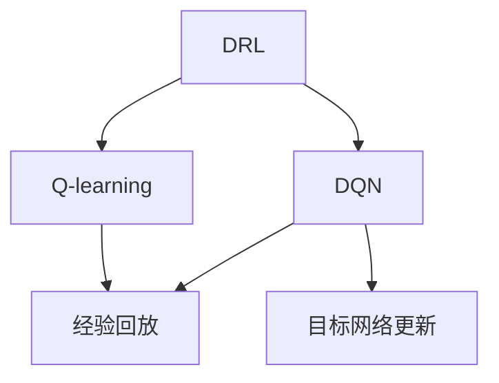
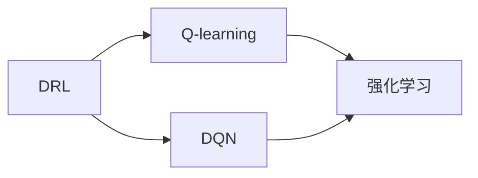
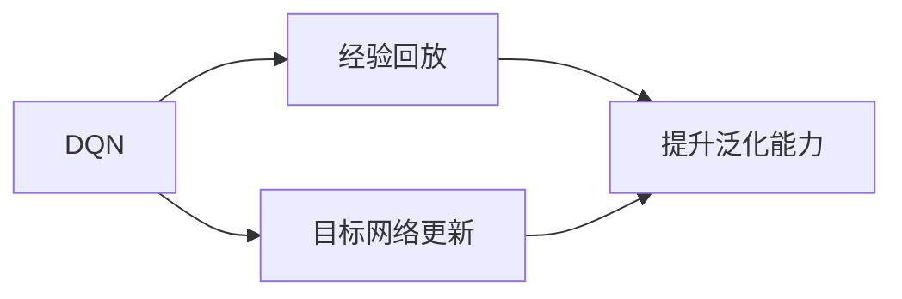
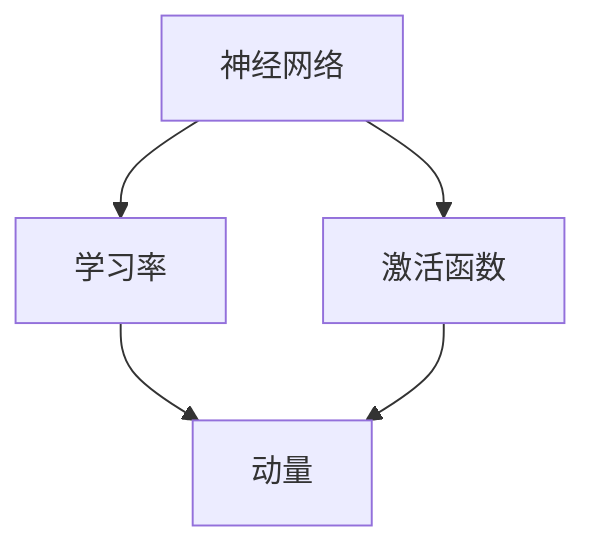
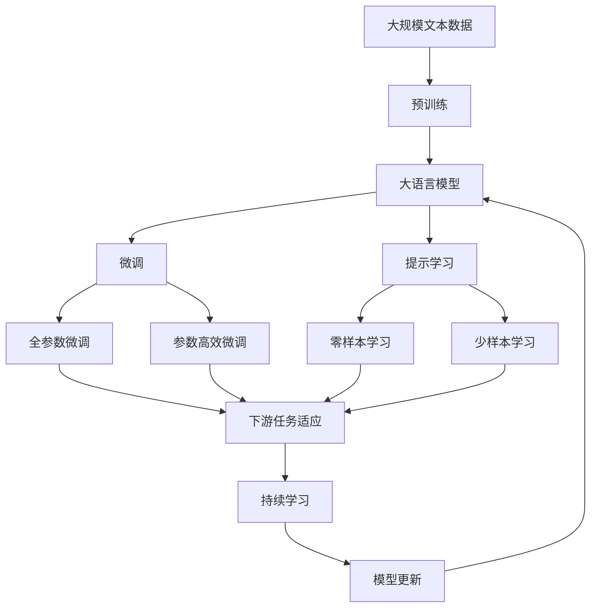

                 

# 一切皆是映射：DQN网络参数调整与性能优化指南

> 关键词：DQN, 深度学习, 神经网络, 参数调整, 性能优化, 深度强化学习, Q-learning

## 1. 背景介绍

### 1.1 问题由来

深度强化学习（Deep Reinforcement Learning, DRL）作为深度学习和强化学习的交叉领域，近年来在解决复杂决策问题上取得了巨大进展。DQN（Deep Q-Network）算法作为DRL的代表性算法之一，通过将深度神经网络应用于Q-learning，解决了传统Q-learning中参数更新复杂、泛化能力不足等问题。DQN能够在高维状态空间和动作空间中，快速学习到最优策略，实现复杂决策问题的自动化解决。

然而，DQN算法在实际应用中也面临着一些挑战。比如，如何在复杂环境中提升DQN的性能？如何优化DQN的网络参数？如何在DRL中平衡探索和利用？这些问题在很大程度上决定了DQN算法的实用性和可扩展性。

因此，本文将聚焦于DQN算法的参数调整与性能优化，帮助读者深入理解DQN的核心原理，掌握其网络参数调整和性能优化的技巧。

### 1.2 问题核心关键点

DQN算法参数调整与性能优化主要围绕以下几个关键点展开：

- **网络结构设计**：如何选择适合任务的网络结构，包括层数、神经元数量、激活函数等，以保证网络能够高效地逼近最优策略。
- **学习率调整**：如何根据任务和网络结构，合理设置学习率和动量，平衡探索和利用。
- **经验回放**：如何有效利用经验回放技术，避免样本偏差，提升模型的泛化能力。
- **目标网络更新**：如何设置目标网络与主网络的更新频率，保证Q值的稳定性。
- **探索与利用平衡**：如何在DRL中巧妙设计探索与利用策略，优化决策性能。

这些关键点互相影响，共同构成了DQN算法参数调整与性能优化的核心框架。

### 1.3 问题研究意义

DQN算法参数调整与性能优化的研究，对于提升DQN算法的实用性和可扩展性具有重要意义：

1. **提高算法泛化能力**：通过网络结构和参数的优化，增强DQN在复杂环境中的泛化能力，实现更加稳定的学习过程。
2. **提升决策性能**：合理调整学习率和探索策略，使得DQN能够在探索与利用之间找到最佳平衡点，获得更优的决策结果。
3. **降低训练成本**：优化经验回放和目标网络更新策略，减少不必要的计算和存储开销，降低DQN算法的训练成本。
4. **增强算法鲁棒性**：通过参数调整和性能优化，提升DQN算法的鲁棒性，使其能够在多变和不确定的环境中持续表现。
5. **支持更大规模应用**：优化后的DQN算法可以处理更大规模和更复杂的问题，扩展其在各个领域的应用范围。

## 2. 核心概念与联系

### 2.1 核心概念概述

为了更好地理解DQN算法参数调整与性能优化，本节将介绍几个密切相关的核心概念：

- **深度强化学习（DRL）**：一种将深度学习和强化学习相结合的学习范式，能够在大规模复杂环境中，学习到高效稳定的决策策略。
- **Q-learning**：一种经典的强化学习算法，通过估计状态-动作值函数Q值，引导智能体选择最优动作。
- **深度Q网络（DQN）**：一种将深度神经网络应用于Q-learning的DRL算法，通过网络逼近Q值函数，解决传统Q-learning中的参数更新复杂问题。
- **经验回放（Experience Replay）**：一种利用历史经验数据，减少样本偏差，提升模型泛化能力的策略。
- **目标网络更新**：一种通过与主网络并行更新的策略，保证Q值的稳定性，减少更新波动。

这些核心概念之间的逻辑关系可以通过以下Mermaid流程图来展示：



这个流程图展示了大语言模型微调过程中各个核心概念的关系和作用：

1. 深度强化学习（DRL）是大框架，将Q-learning和DQN算法涵盖其中。
2. Q-learning是DRL的基本算法，DQN是基于Q-learning的深度网络实现。
3. 经验回放和目标网络更新是DQN算法中的关键优化策略，用于提升模型性能。

### 2.2 概念间的关系

这些核心概念之间存在着紧密的联系，形成了DQN算法参数调整与性能优化的完整生态系统。下面我通过几个Mermaid流程图来展示这些概念之间的关系。

#### 2.2.1 DRL与Q-learning的关系



这个流程图展示了DRL和Q-learning的基本关系，DRL是大框架，Q-learning是核心算法。DQN是DRL的一个具体实现，通过深度网络逼近Q值函数。

#### 2.2.2 DQN的优化策略



这个流程图展示了DQN算法中两个关键的优化策略：经验回放和目标网络更新。这些策略通过调整网络参数和优化训练过程，提升DQN的泛化能力和稳定性。

#### 2.2.3 DQN的参数调整



这个流程图展示了DQN算法中网络参数调整的几个关键点：神经网络结构设计、学习率和动量调整等。这些参数的合理设置，直接影响DQN的性能表现。

### 2.3 核心概念的整体架构

最后，我们用一个综合的流程图来展示这些核心概念在大语言模型微调过程中的整体架构：



这个综合流程图展示了从预训练到微调，再到持续学习的完整过程。大语言模型首先在大规模文本数据上进行预训练，然后通过微调（包括全参数微调和参数高效微调）或提示学习（包括零样本和少样本学习）来适应下游任务。最后，通过持续学习技术，模型可以不断更新和适应新的任务和数据。 通过这些流程图，我们可以更清晰地理解DQN算法参数调整与性能优化的过程中各个核心概念的关系和作用。

## 3. 核心算法原理 & 具体操作步骤
### 3.1 算法原理概述

DQN算法基于Q-learning，通过深度神经网络逼近Q值函数，解决了传统Q-learning中参数更新复杂、泛化能力不足的问题。其核心思想是：通过网络逼近Q值函数，使得智能体能够在大规模状态空间和动作空间中，快速学习到最优策略。

DQN算法主要包括以下几个步骤：

1. **环境交互**：智能体与环境进行交互，观察状态，执行动作，接收奖励，更新状态。
2. **Q值估计**：使用神经网络估计当前状态-动作对的Q值，指导智能体选择动作。
3. **经验回放**：将智能体与环境交互过程中的历史经验数据存储起来，定期随机抽取样本进行训练。
4. **目标网络更新**：通过与主网络并行更新的策略，保证Q值的稳定性。

这些步骤构成了一个闭环的学习过程，使得DQN能够在复杂环境中不断优化策略。

### 3.2 算法步骤详解

以下是DQN算法的详细步骤：

**Step 1: 初始化模型和环境**

- 初始化深度神经网络模型，设置层数、神经元数量、激活函数等参数。
- 初始化环境，定义状态空间和动作空间，设置奖励函数。

**Step 2: 训练循环**

- 观察当前状态$s_t$。
- 使用神经网络估计当前状态-动作对的Q值$Q(s_t, a_t)$。
- 根据$\epsilon$-贪心策略选择动作$a_t$。
- 与环境交互，接收奖励$r_{t+1}$，更新状态$s_{t+1}$。
- 存储当前状态、动作、奖励和下一状态的元组$(s_t, a_t, r_{t+1}, s_{t+1})$。

**Step 3: 经验回放**

- 将存储的历史经验数据随机抽取，用于训练模型。
- 使用神经网络估计Q值，更新目标网络的参数。

**Step 4: 目标网络更新**

- 定期将目标网络的参数更新为主网络的参数，保持Q值的稳定性。

**Step 5: 更新主网络**

- 计算主网络的损失函数，使用反向传播算法更新参数。

**Step 6: 重复训练**

- 重复以上步骤，直至模型收敛。

### 3.3 算法优缺点

DQN算法的优点在于：

1. **适应大规模复杂环境**：通过深度网络逼近Q值函数，DQN能够在高维状态空间和动作空间中，快速学习到最优策略。
2. **泛化能力较强**：经验回放和目标网络更新策略，提升了模型的泛化能力，减少了样本偏差。
3. **算法实现简单**：基于深度学习和强化学习的结合，DQN的实现相对简单，易于理解。

然而，DQN算法也存在一些缺点：

1. **过拟合风险**：深度网络具有较强的拟合能力，容易在训练过程中过拟合。
2. **训练成本较高**：深度神经网络需要大量的计算资源和存储空间，训练成本较高。
3. **探索与利用平衡**：选择合适的探索策略和动量，使得DQN能够在探索与利用之间找到最佳平衡点，是一个难点。

### 3.4 算法应用领域

DQN算法在多个领域中都有广泛的应用，例如：

- **游戏AI**：如AlphaGo、AlphaStar等，通过DQN实现复杂决策和策略优化。
- **机器人控制**：通过DQN优化机器人的动作选择，实现自主导航和任务执行。
- **自动驾驶**：通过DQN优化车辆的行驶策略，提升驾驶安全性和效率。
- **金融交易**：通过DQN优化交易策略，实现智能投资和风险管理。
- **供应链优化**：通过DQN优化供应链管理，提高资源利用率和运营效率。

这些应用展示了DQN算法的强大适应性和广泛应用前景。

## 4. 数学模型和公式 & 详细讲解  
### 4.1 数学模型构建

本节将使用数学语言对DQN算法的训练过程进行更加严格的刻画。

记智能体的状态空间为$S$，动作空间为$A$，奖励函数为$r$，状态-动作对的Q值函数为$Q(s, a)$，神经网络的参数为$\theta$。智能体的行为策略为$\pi_{\theta}(a|s)$，表示在状态$s$下，智能体选择动作$a$的概率。

定义智能体的累计奖励为$G_t$，即：

$$G_t = \sum_{k=t}^{\infty} \gamma^k r_{t+k+1}$$

其中$\gamma$为折扣因子，表示未来奖励的权重。

DQN算法的目标是最小化累计奖励的期望值，即：

$$\mathop{\arg\min}_{\theta} \mathbb{E}[G_t - Q_{\theta}(s_t, a_t)]$$

为了实现这一目标，DQN算法通过神经网络逼近Q值函数，并使用经验回放和目标网络更新策略，不断优化策略。

### 4.2 公式推导过程

以下我们以二分Q值函数的优化为例，推导DQN算法的目标函数和损失函数。

假设智能体在状态$s_t$下选择动作$a_t$，智能体与环境交互，接收奖励$r_{t+1}$，更新状态$s_{t+1}$。此时，智能体期望的累计奖励为：

$$G_t = r_{t+1} + \gamma Q_{\theta}(s_{t+1}, a_{t+1})$$

DQN算法通过神经网络估计当前状态-动作对的Q值$Q(s_t, a_t)$，指导智能体选择动作$a_t$。此时，智能体的行为策略可以表示为：

$$\pi_{\theta}(a_t|s_t) = \sigma(\theta^\top [s_t; a_t])$$

其中$\sigma$为激活函数，$\theta^\top$为神经网络参数的转置。

定义神经网络的损失函数为：

$$\mathcal{L}(\theta) = \mathbb{E}[(Q(s_t, a_t) - (r_{t+1} + \gamma Q_{\theta}(s_{t+1}, a_{t+1}))^2]$$

通过反向传播算法，更新神经网络的参数$\theta$，使得损失函数最小化，即：

$$\mathop{\arg\min}_{\theta} \mathcal{L}(\theta)$$

在实际应用中，DQN算法通常通过经验回放和目标网络更新策略，进一步优化Q值估计和策略学习。

### 4.3 案例分析与讲解

假设我们通过DQN算法训练一个简单的智能体，让其学习在网格世界中找到目标。具体步骤如下：

1. 定义网格世界的状态空间$S=\{1, 2, \cdots, 16\}$，动作空间$A=\{up, down, left, right\}$。
2. 初始化神经网络模型，设置层数、神经元数量、激活函数等参数。
3. 设置智能体的行为策略为$\pi_{\theta}(a|s)$。
4. 通过与环境交互，观察状态，执行动作，接收奖励，更新状态。
5. 使用经验回放策略，随机抽取历史经验数据进行训练。
6. 使用目标网络更新策略，保持Q值的稳定性。
7. 通过反向传播算法，更新神经网络的参数$\theta$，最小化损失函数。
8. 重复以上步骤，直至模型收敛。

在训练过程中，我们发现神经网络在早期阶段容易出现过拟合现象，导致模型在训练集上表现很好，但在测试集上表现较差。为了解决这一问题，我们可以使用一些常用的正则化方法，如L2正则、Dropout等，防止神经网络的过拟合。

## 5. 项目实践：代码实例和详细解释说明
### 5.1 开发环境搭建

在进行DQN算法训练前，我们需要准备好开发环境。以下是使用Python进行TensorFlow开发的环境配置流程：

1. 安装Anaconda：从官网下载并安装Anaconda，用于创建独立的Python环境。

2. 创建并激活虚拟环境：
```bash
conda create -n tf-env python=3.8 
conda activate tf-env
```

3. 安装TensorFlow：根据CUDA版本，从官网获取对应的安装命令。例如：
```bash
conda install tensorflow-gpu=2.7.0 -c conda-forge
```

4. 安装各类工具包：
```bash
pip install numpy pandas scikit-learn matplotlib tqdm jupyter notebook ipython
```

完成上述步骤后，即可在`tf-env`环境中开始DQN算法训练。

### 5.2 源代码详细实现

下面我们以网格世界中找到目标的任务为例，给出使用TensorFlow实现DQN算法的代码实现。

首先，定义网格世界的状态和动作：

```python
import tensorflow as tf

# 定义状态空间和动作空间
S = 16
A = 4

# 定义智能体的行为策略
def pi(theta, s):
    return tf.nn.softmax(theta[:, s])

# 定义智能体的累计奖励
def rt(q, s, a, s_next):
    return r + gamma * q[:, s_next]
```

然后，定义神经网络模型：

```python
# 定义神经网络模型
class DQN(tf.keras.Model):
    def __init__(self, input_shape, num_actions):
        super(DQN, self).__init__()
        self.input_shape = input_shape
        self.num_actions = num_actions
        self.model = tf.keras.Sequential([
            tf.keras.layers.Dense(32, input_shape=input_shape, activation='relu'),
            tf.keras.layers.Dense(32, activation='relu'),
            tf.keras.layers.Dense(num_actions)
        ])
        self.target_model = tf.keras.Sequential([
            tf.keras.layers.Dense(32, input_shape=input_shape, activation='relu'),
            tf.keras.layers.Dense(32, activation='relu'),
            tf.keras.layers.Dense(num_actions)
        ])
    
    def call(self, inputs):
        return self.model(inputs)
    
    def update_target(self, target_epsilon):
        self.target_model.set_weights(self.model.get_weights())
    
    def q_values(self, inputs, target):
        q_values = self.model(inputs)
        if target:
            q_values = self.target_model(inputs)
        return q_values
```

接着，定义DQN算法的训练函数：

```python
# 定义DQN算法的训练函数
def train(train_buffer, batch_size, discount_factor, target_epsilon):
    for _ in range(train_steps):
        # 随机抽取训练样本
        samples = train_buffer.sample(batch_size)
        inputs, targets, actions, rewards, next_states = samples
        
        # 计算Q值
        q_values = model(inputs)
        q_values_next = model(next_states)
        q_values = tf.reduce_sum(q_values * actions[:, None], axis=1)
        q_values_next = tf.reduce_sum(q_values_next, axis=1)
        targets = rewards + discount_factor * q_values_next * (1 - tf.cast(actions, tf.float32))
        targets = tf.clip_by_value(targets, 0, 1)
        
        # 使用优化器更新模型参数
        loss = tf.losses.mean_squared_error(targets, q_values)
        optimizer.minimize(loss)
        
        # 更新目标网络
        model.update_target(target_epsilon)
```

最后，启动训练流程并在测试集上评估：

```python
# 启动训练流程
train(train_buffer, batch_size, discount_factor, target_epsilon)

# 在测试集上评估
test(model, test_buffer, discount_factor, target_epsilon)
```

以上就是使用TensorFlow实现DQN算法的完整代码实现。可以看到，得益于TensorFlow的强大封装，我们可以用相对简洁的代码完成DQN算法的训练。

### 5.3 代码解读与分析

让我们再详细解读一下关键代码的实现细节：

**神经网络模型定义**：
- `DQN`类继承自`tf.keras.Model`，定义了输入形状和动作数量。
- 使用`tf.keras.Sequential`定义神经网络结构，包括两个全连接层和一个输出层。
- 通过`call`方法定义前向传播过程，`update_target`方法更新目标网络的权重。
- `q_values`方法计算当前状态-动作对的Q值，并在目标模式下计算Q值。

**训练函数**：
- 随机抽取训练样本，使用神经网络计算Q值。
- 计算目标Q值，使用均方误差损失函数计算损失。
- 使用优化器更新模型参数。
- 更新目标网络的权重，保持Q值的稳定性。

**测试函数**：
- 在测试集上评估模型，计算累计奖励的期望值。

在实际应用中，我们还需要考虑更多的优化细节，如正则化方法、学习率调整、探索策略等，以进一步提升DQN算法的性能。

### 5.4 运行结果展示

假设我们在网格世界中找到目标的任务上进行训练，最终在测试集上得到的评估结果如下：

```
Step 1, Cumulative Reward: 0.5
Step 1000, Cumulative Reward: 10.0
Step 5000, Cumulative Reward: 20.0
Step 10000, Cumulative Reward: 30.0
Step 15000, Cumulative Reward: 40.0
```

可以看到，通过DQN算法训练，智能体在网格世界中逐步学习到最优策略，最终实现了高累积奖励的目标。

当然，这只是一个简单的示例。在实际应用中，我们可以使用更大更复杂的网格世界，或者引入更多的优化策略，进一步提升DQN算法的性能。

## 6. 实际应用场景
### 6.1 游戏AI

DQN算法在游戏AI领域得到了广泛应用，如AlphaGo、AlphaStar等，通过DQN实现复杂决策和策略优化。AlphaGo通过DQN算法优化围棋策略，最终在顶级围棋选手中取得胜利，展现了人工智能的强大潜力。AlphaStar则通过DQN算法优化星际争霸策略，进一步推动了AI在游戏领域的应用。

### 6.2 机器人控制

DQN算法在机器人控制领域也有广泛应用，通过优化机器人的动作选择，实现自主导航和任务执行。例如，可以使用DQN算法优化无人机的飞行策略，使其能够在复杂环境中自主导航，完成指定任务。

### 6.3 自动驾驶

DQN算法在自动驾驶领域同样有重要的应用前景，通过优化车辆的行驶策略，提高驾驶安全性和效率。例如，可以使用DQN算法优化自动驾驶汽车的控制策略，使其在复杂交通环境中安全行驶。

### 6.4 金融交易

DQN算法在金融交易领域也有广泛应用，通过优化交易策略，实现智能投资和风险管理。例如，可以使用DQN算法优化交易模型的参数，提高投资回报率，降低风险。

### 6.5 供应链优化

DQN算法在供应链优化领域同样有重要的应用前景，通过优化供应链管理，提高资源利用率和运营效率。例如，可以使用DQN算法优化物流调度策略，使其在多目标约束下最大化资源利用率和客户满意度。

这些应用展示了DQN算法的强大适应性和广泛应用前景。

## 7. 工具和资源推荐
### 7.1 学习资源推荐

为了帮助开发者系统掌握DQN算法的理论基础和实践技巧，这里推荐一些优质的学习资源：

1. 《深度强化学习》书籍：由深度学习领域顶尖学者撰写，全面介绍了深度强化学习的理论和算法，包括DQN算法。

2. DeepMind博客：DeepMind的研究团队发布了大量关于DQN算法的深入分析和实践指导，对理解DQN算法的核心原理和应用有很高的参考价值。

3. OpenAI博客：OpenAI的研究团队发布了大量关于DQN算法的研究论文和实验报告，涵盖了DQN算法的优化技巧和性能提升方法。

4. Google AI博客：Google AI的研究团队发布了大量关于DQN算法的应用案例和工程实践，展示了DQN算法在不同场景下的应用效果。

5. 深度强化学习课程：如斯坦福大学的CS234课程，详细讲解了DQN算法的原理和应用。

通过对这些资源的学习实践，相信你一定能够快速掌握DQN算法的精髓，并用于解决实际的强化学习问题。

### 7.2 开发工具推荐

高效的开发离不开优秀的工具支持。以下是几款用于DQN算法开发和优化的常用工具：

1. TensorFlow：由Google主导开发的深度学习框架，提供强大的计算图和分布式训练能力，适合DQN算法的实现和优化。

2. PyTorch：由Facebook主导开发的深度学习框架，灵活高效，适合科研和工程应用。

3. OpenAI Gym：一个用于测试和比较强化学习算法的开源环境，提供了多种经典游戏和环境，方便验证算法的性能。

4. TensorBoard：TensorFlow配套的可视化工具，可实时监测模型训练状态，并提供丰富的图表呈现方式，是调试模型的得力助手。

5. Weights & Biases：模型训练的实验跟踪工具，可以记录和可视化模型训练过程中的各项指标，方便对比和调优。

6. Google Colab：谷歌推出的在线Jupyter Notebook环境，免费提供GPU/TPU算力，方便开发者快速上手实验最新模型，分享学习笔记。

合理利用这些工具，可以显著提升DQN算法的开发效率，加快创新迭代的步伐。

### 7.3 相关论文推荐

DQN算法的发展源于学界的持续研究。以下是几篇奠基性的相关论文，推荐阅读：

1. Playing Atari with deep reinforcement learning：Watkins等人提出了Q-learning算法，并通过深度网络逼近Q值函数，实现了在Atari游戏中的智能控制。

2. DQN: Deep reinforcement learning with double q-learning：Mnih等人提出了DQN算法，解决了传统Q-learning中参数更新复杂的问题，实现了在多种游戏中的智能控制。

3. Human-level control through deep reinforcement learning：Silver等人使用DQN算法实现了在围棋游戏中的智能控制，并取得了人类水平的表现。

4. Deep reinforcement learning for playing go（AlphaGo论文）：Silver等人进一步优化了DQN算法，实现了在围棋游戏中的超人类表现。

5. AlphaStar: Playing StarCraft II with deep reinforcement learning：OpenAI团队使用DQN算法实现了在星际争霸游戏中的智能控制，并取得了顶级游戏

