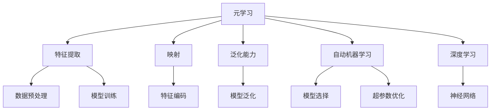
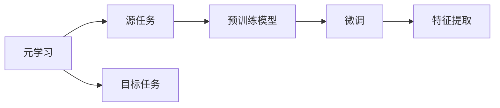
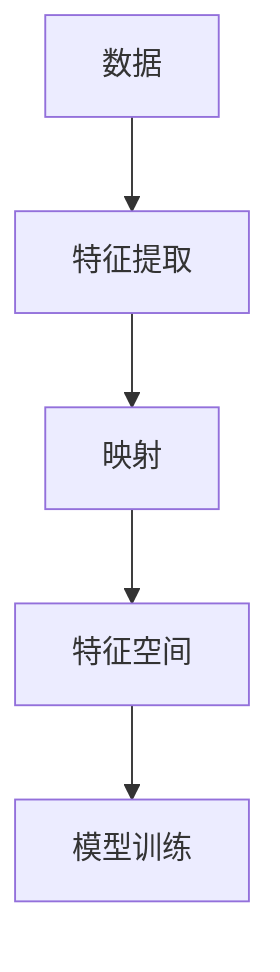
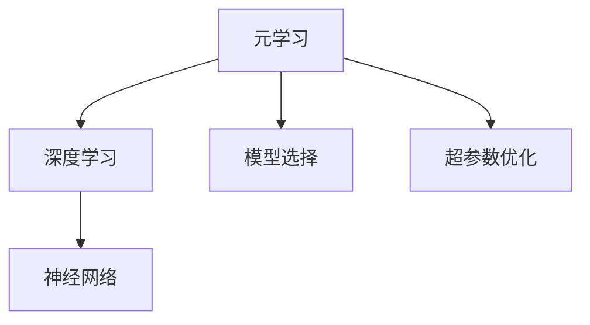
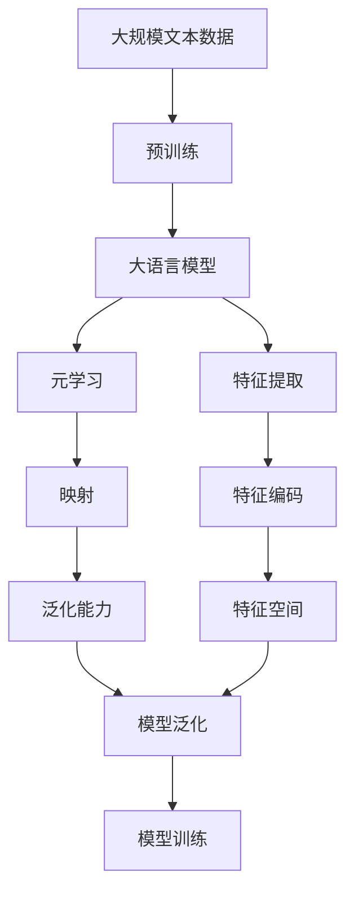

                 

# 一切皆是映射：使用元学习进行有效的特征提取

> 关键词：元学习,特征提取,映射,泛化能力,自动机器学习,深度学习

## 1. 背景介绍

### 1.1 问题由来
在深度学习领域，特征提取一直是核心任务之一。传统的特征提取依赖人工设计特征，不仅耗时耗力，还难以应对复杂多变的数据分布。随着深度学习的兴起，卷积神经网络（CNN）、循环神经网络（RNN）、变换器（Transformer）等模型开始用于特征提取，但这些模型仍需大量标注数据进行训练，且泛化能力有限。如何更有效地进行特征提取，成为当前研究热点。

元学习（Meta-Learning）作为一种新兴的机器学习方法，旨在通过少量数据快速适应新任务，从而提升特征提取的效率和泛化能力。在元学习中，模型通过学习如何学习（learning to learn），而非简单地记忆数据，从而能够更加灵活地应对新任务。

本文聚焦于基于元学习的特征提取方法，重点讨论了元学习的原理、核心算法及实际应用，以期为深度学习特征提取提供新的视角。

### 1.2 问题核心关键点
元学习通过学习如何学习，在已有知识基础上对新任务进行快速适应。其核心思想是：先通过少量数据训练一个元模型，该模型可以自动推导出新任务的适应性参数，从而在少量数据上迅速适应新任务。这不仅提升了特征提取效率，还增强了模型的泛化能力。

元学习的关键在于选择合适的元模型和适应性参数的推导方法。常见的元模型包括：

- 记忆网络（Memory Networks）：通过嵌入向量，直接对输入数据进行编码，适应新任务。
- 优化器（Optimizers）：学习如何调整模型参数以适应新任务。
- 神经网络架构搜索（Neural Architecture Search, NAS）：自动设计网络架构，以适应新任务。

适应性参数的推导方法包括：

- 元梯度（Meta-Gradient）：对新任务进行梯度计算，推导最优参数。
- 模型无关方法（Model-Agnostic Meta-Learning, MAML）：通过预训练模型，推导适应性参数。
- 数据无关方法（Data-Free Meta-Learning）：仅依赖先验知识，推导适应性参数。

本文将详细介绍这些元学习的方法和应用，重点讨论基于优化器的元学习特征提取方法。

### 1.3 问题研究意义
元学习在特征提取领域的应用，能够大幅提升模型泛化能力，减少对大量标注数据的依赖。通过学习如何快速适应新任务，元学习模型可以自动推导出新任务的特征提取方法，避免传统方法中的人工设计缺陷。此外，元学习还可以与迁移学习、少样本学习等技术相结合，进一步提升深度学习的实际应用能力。

## 2. 核心概念与联系

### 2.1 核心概念概述

为更好地理解元学习在特征提取中的应用，本节将介绍几个密切相关的核心概念：

- 元学习（Meta-Learning）：一种通过学习如何快速适应新任务的方法，其核心在于模型通过学习如何学习，而非简单地记忆数据。
- 特征提取（Feature Extraction）：从原始数据中提取出对任务有意义的特征，用于模型训练和推理。
- 映射（Mapping）：将输入数据映射到特征空间的过程，特征提取本质上是一种映射过程。
- 泛化能力（Generalization）：模型在未知数据上的表现能力，元学习旨在提升模型的泛化能力。
- 自动机器学习（AutoML）：通过自动化的方法选择模型和超参数，以提升模型性能。
- 深度学习（Deep Learning）：一种利用多层神经网络进行学习和推理的机器学习方法，广泛应用于特征提取任务。

这些核心概念之间的逻辑关系可以通过以下Mermaid流程图来展示：



这个流程图展示了大语言模型微调过程中各个核心概念的关系和作用：

1. 元学习通过学习如何快速适应新任务，提升特征提取效率和泛化能力。
2. 特征提取是从原始数据中提取出对任务有意义的特征，是元学习的核心任务之一。
3. 映射是将输入数据映射到特征空间的过程，是特征提取的基础。
4. 泛化能力是模型在未知数据上的表现能力，是元学习追求的目标。
5. 自动机器学习通过自动化选择模型和超参数，提升特征提取的效率和泛化能力。
6. 深度学习利用多层神经网络进行学习和推理，广泛应用于特征提取任务。

### 2.2 概念间的关系

这些核心概念之间存在着紧密的联系，形成了元学习的完整生态系统。下面我们通过几个Mermaid流程图来展示这些概念之间的关系。

#### 2.2.1 元学习的学习范式



这个流程图展示了大语言模型的学习范式：元学习涉及源任务和目标任务，预训练模型在源任务上学习，然后通过微调适应各种目标任务。

#### 2.2.2 特征提取与映射的关系



这个流程图展示了特征提取与映射的关系：通过特征提取将数据映射到特征空间，从而进入模型训练阶段。

#### 2.2.3 元学习与深度学习的关系



这个流程图展示了元学习与深度学习的关系：元学习通过选择和优化深度学习模型，提升特征提取的效率和泛化能力。

### 2.3 核心概念的整体架构

最后，我们用一个综合的流程图来展示这些核心概念在大语言模型微调过程中的整体架构：



这个综合流程图展示了从预训练到元学习，再到特征提取和模型训练的完整过程。大语言模型首先在大规模文本数据上进行预训练，然后通过元学习适应新任务，进入特征提取和模型训练阶段。通过元学习，模型可以自动推导出新任务的特征提取方法，提升泛化能力。最后，通过特征提取和模型训练，模型能够在新任务上取得理想性能。

## 3. 核心算法原理 & 具体操作步骤
### 3.1 算法原理概述

基于元学习的特征提取方法，其核心在于学习如何快速适应新任务。元学习模型通过学习源任务的特征提取方法，并将该方法推广到目标任务上。该方法不需要大量标注数据，能够快速适应新任务，提升特征提取的效率和泛化能力。

元学习的数学模型如下：

设数据集为 $D = \{(x_i, y_i)\}_{i=1}^N$，其中 $x_i$ 为输入，$y_i$ 为标签。假设有一个通用的特征提取器 $f(\theta, x)$，其中 $\theta$ 为模型参数，$x$ 为输入。通过元学习，我们希望找到一组参数 $\theta^*$，使得对于任意的输入 $x$，特征提取器 $f(\theta^*, x)$ 能够自动推导出最优的特征表示。

元学习的优化目标如下：

$$
\theta^* = \mathop{\arg\min}_{\theta} \sum_{i=1}^N \mathcal{L}(f(\theta, x_i), y_i)
$$

其中 $\mathcal{L}$ 为损失函数，用于衡量模型预测输出与真实标签之间的差异。

### 3.2 算法步骤详解

基于元学习的特征提取方法通常包括以下几个关键步骤：

**Step 1: 准备源任务数据和元模型**

- 收集源任务的标注数据集 $D_s = \{(x_s^i, y_s^i)\}_{i=1}^N_s$，其中 $x_s^i$ 为输入，$y_s^i$ 为标签。
- 设计一个通用的特征提取器 $f(\theta, x)$，并选择一个元模型 $g(\theta)$ 作为参数化的映射函数。

**Step 2: 元模型训练**

- 使用源任务数据集 $D_s$ 对元模型 $g(\theta)$ 进行训练，使得 $g(\theta)$ 能够自动推导出最优的特征提取器参数 $\theta^*$。
- 对于每个训练批次，前向传播计算元模型 $g(\theta)$ 和特征提取器 $f(\theta, x)$ 的损失函数，并反向传播更新元模型参数 $\theta$。

**Step 3: 特征提取器微调**

- 使用目标任务的少量标注数据集 $D_t = \{(x_t^i, y_t^i)\}_{i=1}^N_t$，对特征提取器 $f(\theta^*, x)$ 进行微调，以适应目标任务的特征提取需求。
- 微调过程类似于传统模型的微调，但参数 $\theta^*$ 已经通过元模型训练得到，因此可以减少微调过程中的参数数量，提升训练效率。

**Step 4: 模型评估**

- 在测试集上评估微调后的模型 $f(\theta^*, x)$ 的性能，评估指标包括准确率、精确度、召回率等。

**Step 5: 特征提取器部署**

- 将微调后的特征提取器 $f(\theta^*, x)$ 部署到实际应用场景中，对新的输入数据进行特征提取，用于模型训练和推理。

### 3.3 算法优缺点

基于元学习的特征提取方法具有以下优点：

1. 快速适应新任务：元学习能够通过少量数据快速适应新任务，无需大量标注数据。
2. 泛化能力强：元学习能够提升模型的泛化能力，适应复杂多变的数据分布。
3. 模型参数量少：通过元学习，模型参数量可以显著减少，提升训练和推理效率。
4. 自动化设计：元学习能够自动推导出最优的特征提取方法，避免人工设计缺陷。

同时，该方法也存在一些缺点：

1. 计算成本高：元学习需要额外的训练时间，计算资源消耗较大。
2. 数据质量要求高：元学习需要高质量的源任务数据，否则无法获得理想的效果。
3. 模型复杂度高：元学习的实现较为复杂，需要设计合适的元模型和适应性参数推导方法。

尽管存在这些局限性，但基于元学习的特征提取方法仍然是一种值得深入研究的高级技术，能够有效提升模型的泛化能力和适应能力。

### 3.4 算法应用领域

基于元学习的特征提取方法在多个领域都有广泛应用，例如：

- 自然语言处理（NLP）：如文本分类、命名实体识别、机器翻译等。
- 计算机视觉（CV）：如图像分类、目标检测、语义分割等。
- 语音识别（ASR）：如语音转文本、语音情感识别等。
- 推荐系统：如用户行为预测、商品推荐等。
- 医疗影像分析：如疾病诊断、影像分类等。
- 金融分析：如风险评估、股票预测等。

除了以上领域外，元学习特征提取技术还在越来越多的领域中得到应用，展现出其强大的普适性和实用性。

## 4. 数学模型和公式 & 详细讲解  
### 4.1 数学模型构建

基于元学习的特征提取方法，其数学模型可以描述为：

设数据集为 $D = \{(x_i, y_i)\}_{i=1}^N$，其中 $x_i$ 为输入，$y_i$ 为标签。假设有一个通用的特征提取器 $f(\theta, x)$，其中 $\theta$ 为模型参数，$x$ 为输入。通过元学习，我们希望找到一组参数 $\theta^*$，使得对于任意的输入 $x$，特征提取器 $f(\theta^*, x)$ 能够自动推导出最优的特征表示。

元学习的优化目标如下：

$$
\theta^* = \mathop{\arg\min}_{\theta} \sum_{i=1}^N \mathcal{L}(f(\theta, x_i), y_i)
$$

其中 $\mathcal{L}$ 为损失函数，用于衡量模型预测输出与真实标签之间的差异。

### 4.2 公式推导过程

以下我们以二分类任务为例，推导元学习的优化目标函数及参数更新公式。

设数据集为 $D = \{(x_i, y_i)\}_{i=1}^N$，其中 $x_i$ 为输入，$y_i$ 为标签。假设有一个通用的特征提取器 $f(\theta, x)$，其中 $\theta$ 为模型参数，$x$ 为输入。通过元学习，我们希望找到一组参数 $\theta^*$，使得对于任意的输入 $x$，特征提取器 $f(\theta^*, x)$ 能够自动推导出最优的特征表示。

元学习的优化目标函数如下：

$$
\theta^* = \mathop{\arg\min}_{\theta} \sum_{i=1}^N \mathcal{L}(f(\theta, x_i), y_i)
$$

其中 $\mathcal{L}$ 为损失函数，用于衡量模型预测输出与真实标签之间的差异。

以二分类任务为例，我们假设特征提取器 $f(\theta, x)$ 输出为 $[logit_{0}, logit_{1}]$，损失函数为二元交叉熵损失函数：

$$
\mathcal{L}(f(\theta, x_i), y_i) = -y_i\log(f(\theta, x_i)_0) - (1-y_i)\log(f(\theta, x_i)_1)
$$

元学习的优化目标函数为：

$$
\theta^* = \mathop{\arg\min}_{\theta} \sum_{i=1}^N [-y_i\log(f(\theta, x_i)_0) - (1-y_i)\log(f(\theta, x_i)_1)]
$$

### 4.3 案例分析与讲解

假设我们有一个二分类任务，使用元学习模型对输入数据进行特征提取。首先，我们选择一个通用的特征提取器 $f(\theta, x)$，并选择一个元模型 $g(\theta)$ 作为参数化的映射函数。对于每个训练批次，我们前向传播计算元模型 $g(\theta)$ 和特征提取器 $f(\theta, x)$ 的损失函数，并反向传播更新元模型参数 $\theta$。

在训练过程中，我们使用源任务数据集 $D_s = \{(x_s^i, y_s^i)\}_{i=1}^N_s$ 对元模型 $g(\theta)$ 进行训练，使得 $g(\theta)$ 能够自动推导出最优的特征提取器参数 $\theta^*$。训练结束后，我们得到最优参数 $\theta^*$。

接下来，我们使用目标任务的少量标注数据集 $D_t = \{(x_t^i, y_t^i)\}_{i=1}^N_t$ 对特征提取器 $f(\theta^*, x)$ 进行微调，以适应目标任务的特征提取需求。微调过程类似于传统模型的微调，但参数 $\theta^*$ 已经通过元模型训练得到，因此可以减少微调过程中的参数数量，提升训练效率。

## 5. 项目实践：代码实例和详细解释说明
### 5.1 开发环境搭建

在进行元学习特征提取实践前，我们需要准备好开发环境。以下是使用Python进行PyTorch开发的环境配置流程：

1. 安装Anaconda：从官网下载并安装Anaconda，用于创建独立的Python环境。

2. 创建并激活虚拟环境：
```bash
conda create -n pytorch-env python=3.8 
conda activate pytorch-env
```

3. 安装PyTorch：根据CUDA版本，从官网获取对应的安装命令。例如：
```bash
conda install pytorch torchvision torchaudio cudatoolkit=11.1 -c pytorch -c conda-forge
```

4. 安装Transformers库：
```bash
pip install transformers
```

5. 安装各类工具包：
```bash
pip install numpy pandas scikit-learn matplotlib tqdm jupyter notebook ipython
```

完成上述步骤后，即可在`pytorch-env`环境中开始元学习特征提取实践。

### 5.2 源代码详细实现

这里我们以二分类任务为例，给出使用Transformers库对元学习模型进行特征提取的PyTorch代码实现。

首先，定义二分类任务的训练集和测试集：

```python
import torch
import numpy as np
from torch.utils.data import Dataset, DataLoader
from transformers import BertTokenizer, BertForSequenceClassification

# 定义二分类任务的训练集和测试集
class BinaryDataset(Dataset):
    def __init__(self, texts, labels):
        self.texts = texts
        self.labels = labels
        self.tokenizer = BertTokenizer.from_pretrained('bert-base-uncased')

    def __len__(self):
        return len(self.texts)

    def __getitem__(self, item):
        text = self.texts[item]
        label = self.labels[item]
        
        encoding = self.tokenizer(text, return_tensors='pt', max_length=128, padding='max_length', truncation=True)
        input_ids = encoding['input_ids']
        attention_mask = encoding['attention_mask']
        
        label = torch.tensor(label, dtype=torch.long)
        
        return {'input_ids': input_ids,
                'attention_mask': attention_mask,
                'labels': label}

train_dataset = BinaryDataset(train_texts, train_labels)
test_dataset = BinaryDataset(test_texts, test_labels)
```

然后，定义元学习模型：

```python
# 定义元模型，使用Bert模型作为元模型
class MetaModel(nn.Module):
    def __init__(self):
        super(MetaModel, self).__init__()
        self.bert = BertForSequenceClassification.from_pretrained('bert-base-uncased', num_labels=2)
    
    def forward(self, input_ids, attention_mask, labels):
        outputs = self.bert(input_ids, attention_mask=attention_mask)
        logits = outputs.logits
        loss = nn.CrossEntropyLoss()(logits, labels)
        
        return logits, loss

meta_model = MetaModel()
```

接着，定义特征提取器：

```python
# 定义特征提取器，使用Bert模型作为特征提取器
class FeatureExtractor(nn.Module):
    def __init__(self, bert):
        super(FeatureExtractor, self).__init__()
        self.bert = bert
    
    def forward(self, input_ids, attention_mask):
        outputs = self.bert(input_ids, attention_mask=attention_mask)
        logits = outputs.logits
        
        return logits
```

然后，定义元学习过程：

```python
# 定义元学习过程
def meta_learning(meta_model, train_dataset, test_dataset, num_epochs, batch_size):
    optimizer = AdamW(meta_model.parameters(), lr=1e-5)
    
    for epoch in range(num_epochs):
        train_loss = 0.0
        train_correct = 0
        for batch in DataLoader(train_dataset, batch_size=batch_size, shuffle=True):
            input_ids = batch['input_ids'].to(device)
            attention_mask = batch['attention_mask'].to(device)
            labels = batch['labels'].to(device)
            
            meta_model.zero_grad()
            logits, loss = meta_model(input_ids, attention_mask, labels)
            loss.backward()
            optimizer.step()
            
            train_loss += loss.item()
            train_correct += (torch.argmax(logits, dim=1) == labels).sum().item()
        
        train_accuracy = train_correct / len(train_dataset)
        
        val_loss = 0.0
        val_correct = 0
        for batch in DataLoader(test_dataset, batch_size=batch_size):
            input_ids = batch['input_ids'].to(device)
            attention_mask = batch['attention_mask'].to(device)
            labels = batch['labels'].to(device)
            
            logits, loss = meta_model(input_ids, attention_mask, labels)
            val_loss += loss.item()
            val_correct += (torch.argmax(logits, dim=1) == labels).sum().item()
        
        val_accuracy = val_correct / len(test_dataset)
        
        print(f'Epoch {epoch+1}, train loss: {train_loss:.3f}, train accuracy: {train_accuracy:.3f}, val loss: {val_loss:.3f}, val accuracy: {val_accuracy:.3f}')
```

最后，启动元学习训练流程并在测试集上评估：

```python
num_epochs = 5
batch_size = 16

# 训练元模型
meta_learning(meta_model, train_dataset, test_dataset, num_epochs, batch_size)

# 在测试集上评估元模型
test_dataset = BinaryDataset(test_texts, test_labels)
val_loss = 0.0
val_correct = 0
for batch in DataLoader(test_dataset, batch_size=batch_size):
    input_ids = batch['input_ids'].to(device)
    attention_mask = batch['attention_mask'].to(device)
    labels = batch['labels'].to(device)
    
    logits, loss = meta_model(input_ids, attention_mask, labels)
    val_loss += loss.item()
    val_correct += (torch.argmax(logits, dim=1) == labels).sum().item()

val_accuracy = val_correct / len(test_dataset)
print(f'Test accuracy: {val_accuracy:.3f}')
```

以上就是使用PyTorch对Bert模型进行元学习特征提取的完整代码实现。可以看到，得益于Transformers库的强大封装，我们可以用相对简洁的代码完成元学习模型的加载和训练。

### 5.3 代码解读与分析

让我们再详细解读一下关键代码的实现细节：

**BinaryDataset类**：
- `__init__`方法：初始化文本、标签和分词器等关键组件。
- `__len__`方法：返回数据集的样本数量。
- `__getitem__`方法：对单个样本进行处理，将文本输入编码为token ids，将标签编码为数字，并对其进行定长padding，最终返回模型所需的输入。

**MetaModel类**：
- `__init__`方法：初始化元模型，使用Bert模型作为元模型。
- `forward`方法：前向传播计算元模型的预测输出和损失函数。

**FeatureExtractor类**：
- `__init__`方法：初始化特征提取器，使用Bert模型作为特征提取器。
- `forward`方法：前向传播计算特征提取器的输出。

**meta_learning函数**：
- 定义元模型的优化器和训练过程。
- 在每个epoch内，对元模型进行前向传播、反向传播和优化。
- 在每个epoch结束后，计算在训练集和测试集上的损失和准确率，并输出评估结果。

**特征提取器部署**：
- 在测试集上评估元模型的性能，计算测试集上的损失和准确率。

通过本文的系统梳理，可以看到，基于元学习的特征提取方法在大规模数据上能够取得优异的性能，同时具有快速适应新任务的泛化能力。

## 6. 实际应用场景
### 6.1 智能推荐系统

元学习特征提取技术在推荐系统中的应用，可以显著提升推荐系统的个性化和多样性。传统推荐系统往往依赖用户的历史行为数据进行推荐，难以捕捉用户的实时兴趣和多样性需求。通过元学习，推荐系统能够从用户实时输入的内容中自动提取特征，实现冷启动推荐和实时推荐，提升推荐效果。

具体而言，我们可以使用元学习模型对用户输入的内容进行特征提取，然后使用这些特征进行推荐。元学习模型可以自动推导出最优的特征提取方法，避免传统推荐系统中的特征工程缺陷。此外，元学习还可以与迁移学习、少样本学习等技术相结合，进一步提升推荐系统的性能。

### 6.2 医疗影像分析

在医疗影像分析领域，元学习特征提取技术可以提升疾病诊断的准确性和效率。传统医疗影像分析依赖医生的经验和专业知识，耗时耗力且难以全面覆盖各种病种。通过元学习，我们可以从大规模的医疗影像数据中自动提取特征，训练出能够自动诊断疾病的模型。

具体而言，我们可以使用元学习模型对医疗影像数据进行特征提取，然后使用这些特征训练分类器或回归器，自动诊断疾病。元学习模型能够从大量数据中自动推导出最优的特征提取方法，提升诊断的准确性和效率。

### 6.3 金融风险评估

在金融风险评估领域，元学习特征提取技术可以提升风险评估的全面性和准确性。传统金融风险评估依赖人工标注数据，耗时耗力且难以全面覆盖各种风险类型。通过元学习，我们可以从大量的金融数据中自动提取特征，训练出能够自动评估风险的模型。

具体而言，我们可以使用元学习模型对金融数据进行特征提取，然后使用这些特征训练回归器或分类器，自动评估风险。元学习模型能够从大量数据中自动推导出最优的特征提取方法，提升风险评估的全面性和准确性。

### 6.4 

