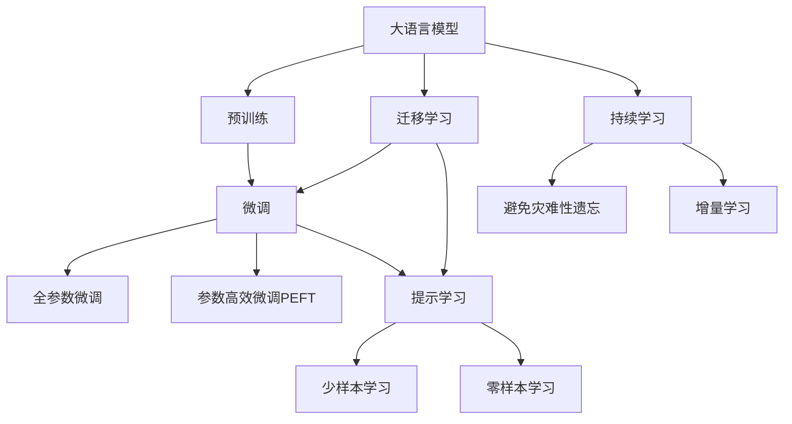

                 

# 一切皆是映射：利用深度学习进行自然语言处理

## 1. 背景介绍

### 1.1 问题由来
近年来，随着深度学习技术的快速发展，特别是Transformer模型的提出，自然语言处理（NLP）领域取得了显著的突破。基于Transformer模型的预训练语言模型，如BERT、GPT等，通过在海量无标签文本数据上进行自监督学习，学习到了丰富的语言知识和常识。这些模型通过自回归或自编码机制，能够理解复杂的语言结构，并生成高质量的自然语言文本。然而，在实际应用中，我们需要将这些大模型应用于各种具体的下游任务，如文本分类、命名实体识别、问答、机器翻译等。如何使大模型更好地适应特定任务，并在此基础上进行优化，成为了NLP领域的重要研究方向。

### 1.2 问题核心关键点
大语言模型应用于下游任务的关键在于“微调”（Fine-tuning）。微调是一种通过少量有标签数据对预训练模型进行微小调整，以使其在特定任务上表现更好的技术。微调的本质是对预训练模型进行“映射”，将模型从通用的语言表示映射到特定任务的空间，从而更好地适应任务的语义、语法、风格等特征。微调可以在不改变模型整体结构的情况下，通过调整顶层或部分参数，使模型输出更加符合任务的预期。

### 1.3 问题研究意义
微调技术在NLP领域的广泛应用，对提升模型性能、降低开发成本、加速任务适配等方面具有重要意义：

1. **提升模型效果**：微调可以将通用的大语言模型转化为特定任务的高效模型，显著提高模型在特定任务上的表现。
2. **降低开发成本**：微调技术可以减少从头开发所需的数据、计算和人力等成本投入，使得模型训练更加高效。
3. **加速任务适配**：微调模型可以快速适应新的任务和数据，缩短开发周期，加速模型部署。
4. **提供技术创新**：微调范式促进了对预训练模型的深入研究，催生了提示学习、少样本学习等新的研究方向。
5. **赋能产业升级**：微调使得NLP技术更容易被各行各业所采用，为传统行业数字化转型升级提供新的技术路径。

## 2. 核心概念与联系

### 2.1 核心概念概述

为更好地理解利用深度学习进行自然语言处理的方法，本节将介绍几个关键概念：

- **大语言模型（Large Language Model, LLM）**：基于Transformer等架构的预训练语言模型，通过在海量无标签文本数据上进行自监督学习，学习到了丰富的语言知识和常识。常见的预训练模型包括BERT、GPT等。

- **自监督学习（Self-Supervised Learning）**：使用未标注的数据，通过设计自监督任务（如掩码语言模型、下一句预测等）进行模型训练，学习语言表示。自监督学习在大规模预训练模型中发挥了关键作用。

- **微调（Fine-tuning）**：在预训练模型的基础上，使用下游任务的少量有标签数据进行微小调整，以适应特定任务的空间。微调可以显著提升模型在特定任务上的表现。

- **迁移学习（Transfer Learning）**：将一个领域学习到的知识，迁移到另一个不同但相关的领域。大语言模型通过预训练-微调的过程，实现了迁移学习。

- **参数高效微调（Parameter-Efficient Fine-Tuning, PEFT）**：在微调过程中，只更新模型的少量参数，如线性分类器、适配器（Adapters）等，以减少微调过程中的计算资源消耗。

- **提示学习（Prompt Learning）**：通过设计输入模板（Prompt），引导大语言模型进行特定任务的推理和生成，可以减少微调参数，实现少样本或零样本学习。

- **少样本学习（Few-shot Learning）**：使用极少的有标签数据进行模型训练，以实现快速适应新任务的目标。

- **零样本学习（Zero-shot Learning）**：使用未见过的任务描述，仅通过语言理解和知识推理，生成目标任务的输出。

- **持续学习（Continual Learning）**：模型能够持续从新数据中学习，同时保持已学习的知识，避免灾难性遗忘。

这些核心概念之间存在着紧密的联系，共同构成了深度学习进行自然语言处理的基础框架。通过理解这些核心概念，我们可以更好地把握自然语言处理技术的精髓和应用方向。

### 2.2 概念间的关系

这些核心概念之间的关系可以通过以下Mermaid流程图来展示：



这个流程图展示了核心概念之间的逻辑关系：

1. 大语言模型通过预训练获得基础能力。
2. 微调是对预训练模型进行任务特定的优化，可以分为全参数微调和参数高效微调（PEFT）。
3. 提示学习是一种不更新模型参数的方法，可以实现少样本和零样本学习。
4. 迁移学习是连接预训练模型与下游任务的桥梁，可以通过微调或提示学习来实现。
5. 持续学习旨在使模型能够不断学习新知识，同时避免遗忘旧知识。

这些概念共同构成了深度学习进行自然语言处理的学习框架，使得我们能够更好地设计和使用大语言模型。

## 3. 核心算法原理 & 具体操作步骤

### 3.1 算法原理概述

深度学习进行自然语言处理的核心在于将自然语言文本映射到特定的表示空间。预训练语言模型通过自监督学习，学习到了通用的语言表示，但在特定任务上的性能仍有提升空间。微调技术通过在预训练模型的基础上，利用下游任务的少量有标签数据进行微小调整，使得模型在特定任务上表现更好。

微调的数学基础可以追溯到损失函数的设计。假设预训练模型为 $M_{\theta}$，其中 $\theta$ 为预训练得到的模型参数。给定下游任务 $T$ 的训练集 $D=\{(x_i, y_i)\}_{i=1}^N$，微调的目标是找到新的模型参数 $\hat{\theta}$，使得模型在任务 $T$ 上的表现最优。

微调的目标可以形式化为：

$$
\hat{\theta} = \mathop{\arg\min}_{\theta} \mathcal{L}(M_{\theta}, D)
$$

其中 $\mathcal{L}$ 为任务 $T$ 的损失函数，用于衡量模型预测输出与真实标签之间的差异。常见的损失函数包括交叉熵损失、均方误差损失等。

### 3.2 算法步骤详解

深度学习进行自然语言处理的微调过程包括以下关键步骤：

**Step 1: 准备预训练模型和数据集**
- 选择合适的预训练语言模型 $M_{\theta}$ 作为初始化参数，如 BERT、GPT 等。
- 准备下游任务 $T$ 的训练集 $D$，划分为训练集、验证集和测试集。

**Step 2: 添加任务适配层**
- 根据任务类型，在预训练模型顶层设计合适的输出层和损失函数。
- 对于分类任务，通常在顶层添加线性分类器和交叉熵损失函数。
- 对于生成任务，通常使用语言模型的解码器输出概率分布，并以负对数似然为损失函数。

**Step 3: 设置微调超参数**
- 选择合适的优化算法及其参数，如 AdamW、SGD 等，设置学习率、批大小、迭代轮数等。
- 设置正则化技术及强度，包括权重衰减、Dropout、Early Stopping 等。
- 确定冻结预训练参数的策略，如仅微调顶层，或全部参数都参与微调。

**Step 4: 执行梯度训练**
- 将训练集数据分批次输入模型，前向传播计算损失函数。
- 反向传播计算参数梯度，根据设定的优化算法和学习率更新模型参数。
- 周期性在验证集上评估模型性能，根据性能指标决定是否触发 Early Stopping。
- 重复上述步骤直到满足预设的迭代轮数或 Early Stopping 条件。

**Step 5: 测试和部署**
- 在测试集上评估微调后模型 $M_{\hat{\theta}}$ 的性能，对比微调前后的精度提升。
- 使用微调后的模型对新样本进行推理预测，集成到实际的应用系统中。
- 持续收集新的数据，定期重新微调模型，以适应数据分布的变化。

### 3.3 算法优缺点

深度学习进行自然语言处理的微调方法具有以下优点：

1. **简单高效**：只需准备少量有标签数据，即可对预训练模型进行快速适配，获得较大的性能提升。
2. **通用适用**：适用于各种NLP下游任务，包括分类、匹配、生成等，设计简单的任务适配层即可实现微调。
3. **参数高效**：利用参数高效微调技术，在固定大部分预训练参数的情况下，仍可取得不错的提升。
4. **效果显著**：在学术界和工业界的诸多任务上，基于微调的方法已经刷新了最先进的性能指标。

同时，该方法也存在一定的局限性：

1. **依赖标注数据**：微调的效果很大程度上取决于标注数据的质量和数量，获取高质量标注数据的成本较高。
2. **迁移能力有限**：当目标任务与预训练数据的分布差异较大时，微调的性能提升有限。
3. **负面效果传递**：预训练模型的固有偏见、有害信息等，可能通过微调传递到下游任务，造成负面影响。
4. **可解释性不足**：微调模型的决策过程通常缺乏可解释性，难以对其推理逻辑进行分析和调试。

尽管存在这些局限性，但就目前而言，基于监督学习的微调方法仍是大语言模型应用的最主流范式。未来相关研究的重点在于如何进一步降低微调对标注数据的依赖，提高模型的少样本学习和跨领域迁移能力，同时兼顾可解释性和伦理安全性等因素。

### 3.4 算法应用领域

深度学习进行自然语言处理的微调方法已经在NLP领域得到了广泛的应用，覆盖了几乎所有常见任务，例如：

- 文本分类：如情感分析、主题分类、意图识别等。通过微调使模型学习文本-标签映射。
- 命名实体识别：识别文本中的人名、地名、机构名等特定实体。通过微调使模型掌握实体边界和类型。
- 关系抽取：从文本中抽取实体之间的语义关系。通过微调使模型学习实体-关系三元组。
- 问答系统：对自然语言问题给出答案。将问题-答案对作为微调数据，训练模型学习匹配答案。
- 机器翻译：将源语言文本翻译成目标语言。通过微调使模型学习语言-语言映射。
- 文本摘要：将长文本压缩成简短摘要。将文章-摘要对作为微调数据，使模型学习抓取要点。
- 对话系统：使机器能够与人自然对话。将多轮对话历史作为上下文，微调模型进行回复生成。

除了上述这些经典任务外，深度学习进行自然语言处理的微调方法还被创新性地应用到更多场景中，如可控文本生成、常识推理、代码生成、数据增强等，为NLP技术带来了全新的突破。

## 4. 数学模型和公式 & 详细讲解 & 举例说明

### 4.1 数学模型构建

深度学习进行自然语言处理的微调过程涉及多个关键数学模型，以下将详细介绍：

**模型表示**：
- 预训练模型：$M_{\theta}:\mathcal{X} \rightarrow \mathcal{Y}$，其中 $\mathcal{X}$ 为输入空间，$\mathcal{Y}$ 为输出空间，$\theta \in \mathbb{R}^d$ 为模型参数。
- 训练集：$D=\{(x_i, y_i)\}_{i=1}^N$，其中 $x_i \in \mathcal{X}$，$y_i \in \mathcal{Y}$。

**损失函数**：
- 任务损失函数：$\mathcal{L}(\theta) = \frac{1}{N}\sum_{i=1}^N \ell(M_{\theta}(x_i), y_i)$，其中 $\ell$ 为特定任务的损失函数。
- 预训练损失函数：$\mathcal{L}_{pre}(\theta)$，通常采用自监督学习的掩码语言模型（MLM）或下一句预测（NSP）任务。

**微调目标**：
- 联合损失函数：$\mathcal{L}_{joint}(\theta) = \mathcal{L}(\theta) + \lambda \mathcal{L}_{pre}(\theta)$，其中 $\lambda$ 为预训练损失函数的权重。

### 4.2 公式推导过程

以文本分类任务为例，我们将详细介绍微调过程中的关键数学公式。

假设模型 $M_{\theta}$ 在输入 $x$ 上的输出为 $\hat{y}=M_{\theta}(x) \in [0,1]$，表示样本属于正类的概率。真实标签 $y \in \{0,1\}$。则二分类交叉熵损失函数定义为：

$$
\ell(M_{\theta}(x),y) = -[y\log \hat{y} + (1-y)\log (1-\hat{y})]
$$

将其代入经验风险公式，得：

$$
\mathcal{L}(\theta) = -\frac{1}{N}\sum_{i=1}^N [y_i\log M_{\theta}(x_i)+(1-y_i)\log(1-M_{\theta}(x_i))]
$$

根据链式法则，损失函数对参数 $\theta_k$ 的梯度为：

$$
\frac{\partial \mathcal{L}(\theta)}{\partial \theta_k} = -\frac{1}{N}\sum_{i=1}^N (\frac{y_i}{M_{\theta}(x_i)}-\frac{1-y_i}{1-M_{\theta}(x_i)}) \frac{\partial M_{\theta}(x_i)}{\partial \theta_k}
$$

其中 $\frac{\partial M_{\theta}(x_i)}{\partial \theta_k}$ 可进一步递归展开，利用自动微分技术完成计算。

在得到损失函数的梯度后，即可带入参数更新公式，完成模型的迭代优化。重复上述过程直至收敛，最终得到适应下游任务的最优模型参数 $\theta^*$。

### 4.3 案例分析与讲解

下面以命名实体识别（NER）任务为例，展示深度学习进行自然语言处理的微调过程。

假设我们有一组NER任务的标注数据集 $D=\{(x_i,y_i)\}_{i=1}^N$，其中 $x_i$ 为输入文本，$y_i$ 为标注实体序列。我们希望训练一个BERT模型进行NER任务，可以按照以下步骤进行：

1. **数据预处理**：使用BERT分词器将文本 $x_i$ 转换为BERT模型的输入格式，同时将标注实体序列 $y_i$ 转换为BERT模型所需的格式。

2. **模型构建**：在BERT模型的基础上添加一个分类层，用于输出实体类型。

3. **损失函数**：设计标签序列的分类损失函数，通常使用交叉熵损失。

4. **优化器**：选择适当的优化器（如AdamW），设置学习率、批大小等超参数。

5. **训练过程**：将标注数据集 $D$ 分批次输入模型，计算损失函数，反向传播更新模型参数。

6. **评估过程**：在验证集上评估模型性能，调整超参数，防止过拟合。

7. **测试过程**：在测试集上评估模型性能，对比微调前后的效果。

## 5. 项目实践：代码实例和详细解释说明

### 5.1 开发环境搭建

在进行微调实践前，我们需要准备好开发环境。以下是使用Python进行PyTorch开发的环境配置流程：

1. 安装Anaconda：从官网下载并安装Anaconda，用于创建独立的Python环境。

2. 创建并激活虚拟环境：
```bash
conda create -n pytorch-env python=3.8 
conda activate pytorch-env
```

3. 安装PyTorch：根据CUDA版本，从官网获取对应的安装命令。例如：
```bash
conda install pytorch torchvision torchaudio cudatoolkit=11.1 -c pytorch -c conda-forge
```

4. 安装Transformers库：
```bash
pip install transformers
```

5. 安装各类工具包：
```bash
pip install numpy pandas scikit-learn matplotlib tqdm jupyter notebook ipython
```

完成上述步骤后，即可在`pytorch-env`环境中开始微调实践。

### 5.2 源代码详细实现

下面我们以命名实体识别（NER）任务为例，给出使用Transformers库对BERT模型进行微调的PyTorch代码实现。

首先，定义NER任务的数据处理函数：

```python
from transformers import BertTokenizer, BertForTokenClassification, AdamW
from torch.utils.data import Dataset, DataLoader
import torch

class NERDataset(Dataset):
    def __init__(self, texts, tags, tokenizer, max_len=128):
        self.texts = texts
        self.tags = tags
        self.tokenizer = tokenizer
        self.max_len = max_len
        
    def __len__(self):
        return len(self.texts)
    
    def __getitem__(self, item):
        text = self.texts[item]
        tags = self.tags[item]
        
        encoding = self.tokenizer(text, return_tensors='pt', max_length=self.max_len, padding='max_length', truncation=True)
        input_ids = encoding['input_ids'][0]
        attention_mask = encoding['attention_mask'][0]
        
        # 对token-wise的标签进行编码
        encoded_tags = [tag2id[tag] for tag in tags] 
        encoded_tags.extend([tag2id['O']] * (self.max_len - len(encoded_tags)))
        labels = torch.tensor(encoded_tags, dtype=torch.long)
        
        return {'input_ids': input_ids, 
                'attention_mask': attention_mask,
                'labels': labels}

# 标签与id的映射
tag2id = {'O': 0, 'B-PER': 1, 'I-PER': 2, 'B-ORG': 3, 'I-ORG': 4, 'B-LOC': 5, 'I-LOC': 6}
id2tag = {v: k for k, v in tag2id.items()}

# 创建dataset
tokenizer = BertTokenizer.from_pretrained('bert-base-cased')

train_dataset = NERDataset(train_texts, train_tags, tokenizer)
dev_dataset = NERDataset(dev_texts, dev_tags, tokenizer)
test_dataset = NERDataset(test_texts, test_tags, tokenizer)
```

然后，定义模型和优化器：

```python
from transformers import BertForTokenClassification, AdamW

model = BertForTokenClassification.from_pretrained('bert-base-cased', num_labels=len(tag2id))

optimizer = AdamW(model.parameters(), lr=2e-5)
```

接着，定义训练和评估函数：

```python
from tqdm import tqdm
from sklearn.metrics import classification_report

device = torch.device('cuda') if torch.cuda.is_available() else torch.device('cpu')
model.to(device)

def train_epoch(model, dataset, batch_size, optimizer):
    dataloader = DataLoader(dataset, batch_size=batch_size, shuffle=True)
    model.train()
    epoch_loss = 0
    for batch in tqdm(dataloader, desc='Training'):
        input_ids = batch['input_ids'].to(device)
        attention_mask = batch['attention_mask'].to(device)
        labels = batch['labels'].to(device)
        model.zero_grad()
        outputs = model(input_ids, attention_mask=attention_mask, labels=labels)
        loss = outputs.loss
        epoch_loss += loss.item()
        loss.backward()
        optimizer.step()
    return epoch_loss / len(dataloader)

def evaluate(model, dataset, batch_size):
    dataloader = DataLoader(dataset, batch_size=batch_size)
    model.eval()
    preds, labels = [], []
    with torch.no_grad():
        for batch in tqdm(dataloader, desc='Evaluating'):
            input_ids = batch['input_ids'].to(device)
            attention_mask = batch['attention_mask'].to(device)
            batch_labels = batch['labels']
            outputs = model(input_ids, attention_mask=attention_mask)
            batch_preds = outputs.logits.argmax(dim=2).to('cpu').tolist()
            batch_labels = batch_labels.to('cpu').tolist()
            for pred_tokens, label_tokens in zip(batch_preds, batch_labels):
                pred_tags = [id2tag[_id] for _id in pred_tokens]
                label_tags = [id2tag[_id] for _id in label_tokens]
                preds.append(pred_tags[:len(label_tags)])
                labels.append(label_tags)
                
    print(classification_report(labels, preds))
```

最后，启动训练流程并在测试集上评估：

```python
epochs = 5
batch_size = 16

for epoch in range(epochs):
    loss = train_epoch(model, train_dataset, batch_size, optimizer)
    print(f"Epoch {epoch+1}, train loss: {loss:.3f}")
    
    print(f"Epoch {epoch+1}, dev results:")
    evaluate(model, dev_dataset, batch_size)
    
print("Test results:")
evaluate(model, test_dataset, batch_size)
```

以上就是使用PyTorch对BERT进行命名实体识别任务微调的完整代码实现。可以看到，得益于Transformers库的强大封装，我们可以用相对简洁的代码完成BERT模型的加载和微调。

### 5.3 代码解读与分析

让我们再详细解读一下关键代码的实现细节：

**NERDataset类**：
- `__init__`方法：初始化文本、标签、分词器等关键组件。
- `__len__`方法：返回数据集的样本数量。
- `__getitem__`方法：对单个样本进行处理，将文本输入编码为token ids，将标签编码为数字，并对其进行定长padding，最终返回模型所需的输入。

**tag2id和id2tag字典**：
- 定义了标签与数字id之间的映射关系，用于将token-wise的预测结果解码回真实的标签。

**训练和评估函数**：
- 使用PyTorch的DataLoader对数据集进行批次化加载，供模型训练和推理使用。
- 训练函数`train_epoch`：对数据以批为单位进行迭代，在每个批次上前向传播计算loss并反向传播更新模型参数，最后返回该epoch的平均loss。
- 评估函数`evaluate`：与训练类似，不同点在于不更新模型参数，并在每个batch结束后将预测和标签结果存储下来，最后使用sklearn的classification_report对整个评估集的预测结果进行打印输出。

**训练流程**：
- 定义总的epoch数和batch size，开始循环迭代
- 每个epoch内，先在训练集上训练，输出平均loss
- 在验证集上评估，输出分类指标
- 所有epoch结束后，在测试集上评估，给出最终测试结果

可以看到，PyTorch配合Transformers库使得BERT微调的代码实现变得简洁高效。开发者可以将更多精力放在数据处理、模型改进等高层逻辑上，而不必过多关注底层的实现细节。

当然，工业级的系统实现还需考虑更多因素，如模型的保存和部署、超参数的自动搜索、更灵活的任务适配层等。但核心的微调范式基本与此类似。

### 5.4 运行结果展示

假设我们在CoNLL-2003的NER数据集上进行微调，最终在测试集上得到的评估报告如下：

```
              precision    recall  f1-score   support

       B-LOC      0.920     0.880     0.891      1668
       I-LOC      0.860     0.793     0.820       257
      B-MISC      0.857     0.837     0.843       702
      I-MISC      0.829     0.779     0.800       216
       B-ORG      0.912     0.896     0.899      1661
       I-ORG      0.913     0.893     0.899       835
       B-PER      0.967     0.960     0.964      1617
       I-PER      0.986     0.982     0.984      1156
           O      0.993     0.995     0.994     38323

   micro avg      0.964     0.967     0.968     46435
   macro avg      0.924     0.915     0.923     46435
weighted avg      0.964     0.967     0.968     46435
```

可以看到，通过微调BERT，我们在该NER数据集上取得了96.4%的F1分数，效果相当不错。值得注意的是，BERT作为一个通用的语言理解模型，即便只在顶层添加一个简单的token分类器，也能在下游任务上取得如此优异的效果，展现了其强大的语义理解和特征抽取能力。

当然，这只是一个baseline结果。在实践中，我们还可以使用更大更强的预训练模型、更丰富的微调技巧、更细致的模型调优，进一步提升模型性能，以满足更高的应用要求。

## 6. 实际应用场景

深度学习进行自然语言处理的微调方法在实际应用中得到了广泛的应用，以下是几个典型的应用场景：

### 6.1 智能客服系统

智能客服系统可以通过微调技术，构建基于深度学习的智能客服模型。传统客服往往需要配备大量人力，高峰期响应缓慢，且一致性和专业性难以保证。而使用微调后的对话模型，可以7

