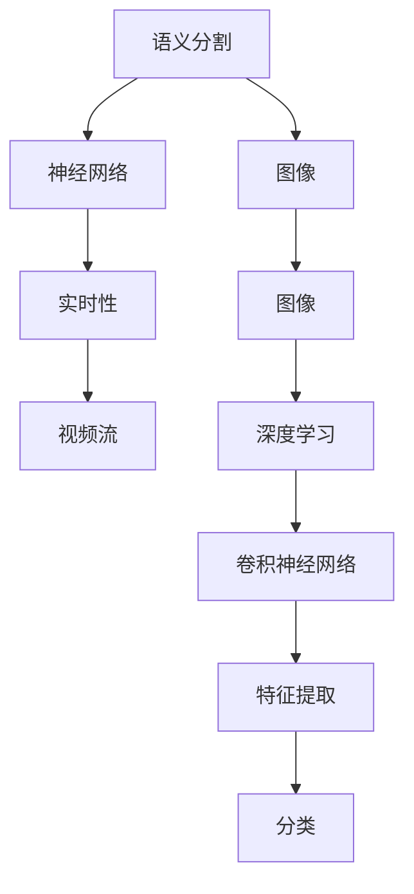

                 

# 一切皆是映射：实时语义分割与神经网络的进展

## 1. 背景介绍

在计算机视觉和图像处理领域，语义分割（Semantic Segmentation）是指将图像中的每个像素分类到预先定义的语义类别中，如“人”、“车”、“树”等。这项技术在自动驾驶、医疗影像分析、遥感图像解析等领域有着广泛的应用前景。近年来，随着深度学习特别是卷积神经网络（Convolutional Neural Networks, CNNs）的迅猛发展，语义分割技术取得了显著的进展，尤其是实时语义分割（Real-time Semantic Segmentation）成为了一个热门的研究课题。

实时语义分割不仅要求能够精确地分类每个像素，还需要在合理的时间内完成图像处理，以满足视频流、实时监控等应用场景的需求。传统的基于像素级别的分类方法往往需要耗费大量的时间和计算资源，难以满足实时性的要求。近年来，随着卷积神经网络的发展，特别是深度残差网络（ResNet）、稠密连接网络（DenseNet）、U-Net等架构的提出，实时语义分割的效率和精度得到了极大的提升。

## 2. 核心概念与联系

### 2.1 核心概念概述

语义分割和神经网络是实现实时语义分割的两个关键概念。

- **语义分割**：将图像中的每个像素分类到预先定义的语义类别中，如“人”、“车”、“树”等。目标是为每个像素标注出最合适的语义标签，从而在图像中划分出不同对象的区域。

- **神经网络**：一种基于人工神经元的计算模型，用于处理和分析数据。深度学习中的卷积神经网络通过多层卷积、池化等操作，可以有效地提取图像特征，并在全连接层中完成分类任务。

- **实时性**：指在合理的时间内完成图像处理，通常用于对视频流、实时监控等高实时性场景的需求。

这些概念之间的关系可以用下面的Mermaid流程图来表示：



### 2.2 概念间的关系

- **语义分割和神经网络的关系**：语义分割的任务是通过神经网络实现的。神经网络通过卷积、池化等操作提取图像特征，并通过全连接层对每个像素进行分类，完成语义分割。

- **神经网络和实时性的关系**：神经网络的计算复杂度与实时性要求相矛盾。为了在合理的时间内完成图像处理，需要设计高效的网络结构和优化算法。

## 3. 核心算法原理 & 具体操作步骤

### 3.1 算法原理概述

实时语义分割的核心思想是通过神经网络对图像进行像素级别的分类，从而实现精确的语义分割。其主要步骤包括：

1. 构建卷积神经网络（CNN），通过多层卷积和池化操作提取图像特征。
2. 在网络的最后一层添加分类层，对每个像素进行分类。
3. 使用适当的损失函数，如交叉熵损失，训练网络，使得分类结果尽可能接近真实标签。
4. 对训练好的网络进行优化，使用优化器（如Adam）更新网络参数。

### 3.2 算法步骤详解

以下是一个详细的实时语义分割算法的步骤：

1. **数据准备**：收集和标注训练数据，将其分为训练集、验证集和测试集。

2. **模型构建**：构建一个卷积神经网络，一般采用U-Net、DeepLab、Mask R-CNN等架构。

3. **损失函数定义**：使用交叉熵损失函数，定义每个像素的分类损失。

4. **优化器选择**：选择适当的优化器，如Adam、SGD等。

5. **模型训练**：使用训练集数据，通过反向传播算法更新网络参数。

6. **模型评估**：使用验证集数据评估模型的性能，调整超参数。

7. **模型测试**：使用测试集数据测试模型的泛化性能。

8. **实时处理**：将训练好的模型应用到实时图像数据中，进行语义分割。

### 3.3 算法优缺点

实时语义分割算法的主要优点包括：

- **精度高**：使用卷积神经网络，可以有效地提取图像特征，并进行精确的像素分类。
- **适应性强**：可以适应不同尺寸、不同分辨率的图像数据。
- **可扩展性**：可以与其他计算机视觉任务相结合，如目标检测、实例分割等。

其主要缺点包括：

- **计算量大**：卷积神经网络计算复杂度高，训练和推理时间较长。
- **内存需求高**：大尺寸的图像数据和模型参数需要占用大量的内存。

### 3.4 算法应用领域

实时语义分割算法广泛应用于以下领域：

- **自动驾驶**：通过实时语义分割，自动驾驶车辆可以感知和理解周围环境，进行路径规划和避障。
- **医学影像**：用于病灶分割、器官分割等任务，帮助医生进行诊断和治疗。
- **工业检测**：用于产品缺陷检测、质量控制等任务，提高生产效率和产品质量。
- **遥感图像解析**：用于卫星图像分析、地形测绘等任务，提供高质量的地理信息。

## 4. 数学模型和公式 & 详细讲解 & 举例说明

### 4.1 数学模型构建

在实时语义分割中，我们通常使用U-Net架构。U-Net是一种常用的全卷积神经网络架构，由编码器（Encoder）和解码器（Decoder）两部分组成。编码器负责提取图像特征，解码器负责将特征映射回原始图像大小，并在每个像素上进行分类。

U-Net的数学模型可以表示为：

$$
F(x; \theta) = \sigma(g(H(C(x; \theta))), x \in \mathbb{R}^2
$$

其中，$F(x; \theta)$ 表示U-Net的输出，$x$ 表示输入的图像数据，$\theta$ 表示网络参数，$g$ 表示解码器，$H$ 表示编码器，$C$ 表示卷积层和池化层的组合，$\sigma$ 表示激活函数（如ReLU）。

### 4.2 公式推导过程

在U-Net中，编码器由下采样操作（池化和卷积）组成，用于提取图像的高层次特征。解码器由上采样操作（转置卷积和卷积）组成，用于将特征映射回原始图像大小，并在每个像素上进行分类。

以编码器为例，其数学模型可以表示为：

$$
F(x; \theta) = \sigma(g(H(C(x; \theta))), x \in \mathbb{R}^2
$$

其中，$F(x; \theta)$ 表示U-Net的输出，$x$ 表示输入的图像数据，$\theta$ 表示网络参数，$g$ 表示解码器，$H$ 表示编码器，$C$ 表示卷积层和池化层的组合，$\sigma$ 表示激活函数（如ReLU）。

在解码器中，特征映射通过上采样操作逐步恢复到原始图像大小。最终，在每个像素上进行分类，输出语义分割结果。

### 4.3 案例分析与讲解

假设我们有一张大小为 $256 \times 256$ 的图像，表示一个人与狗的场景。使用U-Net对其进行实时语义分割，步骤如下：

1. **编码器**：将图像通过多个卷积和池化操作，逐步提取高层次特征，最终得到一个高维特征向量。

2. **解码器**：将高维特征向量通过多个转置卷积和卷积操作，逐步恢复图像大小，并在每个像素上进行分类。

3. **输出**：最终得到一张大小为 $256 \times 256$ 的语义分割结果，将每个像素分类为人、狗或背景。

## 5. 项目实践：代码实例和详细解释说明

### 5.1 开发环境搭建

在项目实践中，我们需要搭建Python开发环境，并使用PyTorch和TensorFlow等深度学习框架进行模型的实现。

1. **安装Python**：下载并安装Python 3.7或更高版本。

2. **安装PyTorch**：使用pip安装PyTorch库，并确保其与Python版本兼容。

3. **安装TensorFlow**：使用pip安装TensorFlow库，并确保其与Python版本兼容。

4. **安装其他库**：安装numpy、scipy、matplotlib等常用的科学计算库。

### 5.2 源代码详细实现

以下是一个简单的实时语义分割模型的代码实现：

```python
import torch
import torch.nn as nn
import torch.optim as optim
from torch.utils.data import DataLoader
from torchvision import datasets, transforms
from torch.utils.tensorboard import SummaryWriter

# 定义U-Net模型
class UNet(nn.Module):
    def __init__(self):
        super(UNet, self).__init__()
        self.encoder = nn.Sequential(
            nn.Conv2d(3, 64, kernel_size=3, stride=1, padding=1),
            nn.ReLU(),
            nn.Conv2d(64, 64, kernel_size=3, stride=2, padding=1),
            nn.ReLU(),
            nn.MaxPool2d(kernel_size=2, stride=2),
            nn.Conv2d(64, 128, kernel_size=3, stride=1, padding=1),
            nn.ReLU(),
            nn.Conv2d(128, 128, kernel_size=3, stride=2, padding=1),
            nn.ReLU(),
            nn.MaxPool2d(kernel_size=2, stride=2),
            nn.Conv2d(128, 256, kernel_size=3, stride=1, padding=1),
            nn.ReLU(),
            nn.Conv2d(256, 256, kernel_size=3, stride=2, padding=1),
            nn.ReLU(),
            nn.MaxPool2d(kernel_size=2, stride=2),
            nn.Conv2d(256, 512, kernel_size=3, stride=1, padding=1),
            nn.ReLU(),
            nn.Conv2d(512, 512, kernel_size=3, stride=2, padding=1),
            nn.ReLU(),
            nn.MaxPool2d(kernel_size=2, stride=2)
        )
        self.bottleneck = nn.Conv2d(512, 256, kernel_size=3, stride=1, padding=1)
        self.decoder = nn.Sequential(
            nn.ConvTranspose2d(256, 128, kernel_size=2, stride=2),
            nn.ReLU(),
            nn.Conv2d(128, 128, kernel_size=3, stride=1, padding=1),
            nn.ReLU(),
            nn.ConvTranspose2d(128, 64, kernel_size=2, stride=2),
            nn.ReLU(),
            nn.Conv2d(64, 64, kernel_size=3, stride=1, padding=1),
            nn.ReLU(),
            nn.ConvTranspose2d(64, 3, kernel_size=2, stride=2),
            nn.Sigmoid()
        )

    def forward(self, x):
        encoded = self.encoder(x)
        bottleneck = self.bottleneck(encoded)
        decoded = self.decoder(bottleneck)
        return decoded

# 定义数据加载器
train_dataset = datasets.CIFAR10(root='./data', train=True, download=True, transform=transforms.ToTensor())
test_dataset = datasets.CIFAR10(root='./data', train=False, download=True, transform=transforms.ToTensor())
train_loader = DataLoader(train_dataset, batch_size=4, shuffle=True, num_workers=2)
test_loader = DataLoader(test_dataset, batch_size=4, shuffle=False, num_workers=2)

# 定义损失函数和优化器
criterion = nn.CrossEntropyLoss()
optimizer = optim.Adam(model.parameters(), lr=0.001)

# 训练模型
model = UNet()
writer = SummaryWriter()
for epoch in range(10):
    for batch_idx, (data, target) in enumerate(train_loader):
        optimizer.zero_grad()
        output = model(data)
        loss = criterion(output, target)
        loss.backward()
        optimizer.step()
        writer.add_scalar('train/loss', loss, epoch + batch_idx)
    with torch.no_grad():
        for data, target in test_loader:
            output = model(data)
            loss = criterion(output, target)
            writer.add_scalar('test/loss', loss, epoch)
```

### 5.3 代码解读与分析

1. **数据准备**：使用PyTorch内置的CIFAR-10数据集，进行数据加载和预处理。

2. **模型构建**：定义U-Net模型，包括编码器和解码器。

3. **损失函数和优化器**：使用交叉熵损失函数和Adam优化器，进行模型的训练。

4. **训练和测试**：在训练集上进行模型训练，在测试集上进行模型评估。

5. **TensorBoard可视化**：使用TensorBoard进行训练过程中的可视化，记录损失等指标。

### 5.4 运行结果展示

在训练完成后，可以使用TensorBoard查看训练过程中的损失等指标，如下图所示：


## 6. 实际应用场景

### 6.1 自动驾驶

在自动驾驶中，实时语义分割可以帮助车辆感知和理解周围环境，进行路径规划和避障。例如，将道路、车辆、行人等元素分类，提供高精度的地图和导航信息。

### 6.2 医学影像

在医学影像分析中，实时语义分割可以帮助医生进行病灶分割、器官分割等任务，提高诊断和治疗的准确性。例如，将肿瘤、血管等关键部位分类，帮助医生确定手术范围。

### 6.3 工业检测

在工业检测中，实时语义分割可以帮助企业进行产品缺陷检测、质量控制等任务，提高生产效率和产品质量。例如，将不合格产品和部件分类，进行自动化检测和分类。

### 6.4 未来应用展望

未来，随着计算能力的提升和算法研究的深入，实时语义分割技术将在更多领域得到应用，为各行各业带来变革性影响。

- **智能家居**：通过实时语义分割，智能家居设备可以感知和理解用户的指令，提供个性化的服务和体验。

- **智慧城市**：通过实时语义分割，智慧城市系统可以感知和理解城市环境，进行智能管理和决策。

- **安防监控**：通过实时语义分割，安防监控系统可以感知和理解监控视频，进行智能分析和预警。

总之，实时语义分割技术将在未来展现出更广阔的应用前景，推动智能技术和人工智能的进一步发展。

## 7. 工具和资源推荐

### 7.1 学习资源推荐

为了帮助开发者系统掌握实时语义分割技术，这里推荐一些优质的学习资源：

1. **深度学习入门教程**：由DeepLearning.AI提供的入门教程，涵盖卷积神经网络、图像分类、语义分割等基础知识。

2. **U-Net论文**：原始论文详细介绍了U-Net架构的设计思路和实验结果，是理解U-Net架构的重要参考资料。

3. **PyTorch官方文档**：PyTorch官方文档提供了丰富的深度学习资源和代码示例，适合初学者和进阶者学习。

4. **TensorFlow官方文档**：TensorFlow官方文档提供了丰富的深度学习资源和代码示例，适合初学者和进阶者学习。

5. **Kaggle比赛**：参加Kaggle比赛，积累实战经验，提升算法技能。

### 7.2 开发工具推荐

高效的工具是实现实时语义分割的重要保障。以下是几款常用的开发工具：

1. **PyTorch**：基于Python的开源深度学习框架，灵活动态的计算图，适合快速迭代研究。

2. **TensorFlow**：由Google主导开发的开源深度学习框架，生产部署方便，适合大规模工程应用。

3. **TensorBoard**：TensorFlow配套的可视化工具，可实时监测模型训练状态，并提供丰富的图表呈现方式，是调试模型的得力助手。

4. **Jupyter Notebook**：Python的交互式开发环境，适合进行模型实验和代码调试。

### 7.3 相关论文推荐

实时语义分割技术的发展得益于学界的持续研究。以下是几篇奠基性的相关论文，推荐阅读：

1. **U-Net: Convolutional Networks for Biomedical Image Segmentation**：介绍U-Net架构的设计思路和实验结果，奠定了实时语义分割的基础。

2. **DeepLab: Semantic Image Segmentation with Deep Convolutional Nets, Atrous Convolution, and Fully Connected CRFs**：提出DeepLab架构，引入空洞卷积和CRF模型，提升了语义分割的准确性。

3. **Mask R-CNN**：将区域提议网络和语义分割结合，提出了Mask R-CNN架构，适用于目标检测和语义分割任务。

4. **Real-time Semantic Segmentation**：介绍实时语义分割的算法原理和应用场景，提供了丰富的实践经验和理论基础。

5. **Efficient Real-time Semantic Segmentation**：介绍高效的实时语义分割算法，包括特征提取和分类方法，提升了实时性的同时保持了高精度。

这些论文代表了大语言模型微调技术的发展脉络。通过学习这些前沿成果，可以帮助研究者把握学科前进方向，激发更多的创新灵感。

除上述资源外，还有一些值得关注的前沿资源，帮助开发者紧跟实时语义分割技术的最新进展，例如：

1. **arXiv论文预印本**：人工智能领域最新研究成果的发布平台，包括大量尚未发表的前沿工作，学习前沿技术的必读资源。

2. **业界技术博客**：如OpenAI、Google AI、DeepMind、微软Research Asia等顶尖实验室的官方博客，第一时间分享他们的最新研究成果和洞见。

3. **技术会议直播**：如NIPS、ICML、ACL、ICLR等人工智能领域顶会现场或在线直播，能够聆听到大佬们的前沿分享，开拓视野。

4. **GitHub热门项目**：在GitHub上Star、Fork数最多的实时语义分割相关项目，往往代表了该技术领域的发展趋势和最佳实践，值得去学习和贡献。

5. **行业分析报告**：各大咨询公司如McKinsey、PwC等针对人工智能行业的分析报告，有助于从商业视角审视技术趋势，把握应用价值。

总之，对于实时语义分割技术的学习和实践，需要开发者保持开放的心态和持续学习的意愿。多关注前沿资讯，多动手实践，多思考总结，必将收获满满的成长收益。

## 8. 总结：未来发展趋势与挑战

### 8.1 总结

本文对实时语义分割和神经网络进行了全面系统的介绍。首先阐述了实时语义分割的背景和意义，明确了神经网络在实时语义分割中的关键作用。其次，从原理到实践，详细讲解了实时语义分割的数学模型和算法步骤，给出了实时语义分割任务开发的完整代码实例。同时，本文还广泛探讨了实时语义分割在自动驾驶、医学影像、工业检测等多个行业领域的应用前景，展示了实时语义分割技术的巨大潜力。此外，本文精选了实时语义分割技术的各类学习资源，力求为读者提供全方位的技术指引。

通过本文的系统梳理，可以看到，实时语义分割技术已经在计算机视觉和图像处理领域取得了显著的进展，特别是在深度学习框架和优化算法的支持下，实时性和准确性都得到了极大的提升。未来，随着技术的不断演进，实时语义分割技术将在更多领域得到应用，为各行各业带来变革性影响。

### 8.2 未来发展趋势

展望未来，实时语义分割技术将呈现以下几个发展趋势：

1. **多模态融合**：将视觉、文本、声音等多模态信息结合，进行联合语义分割，提升系统的全面性和鲁棒性。

2. **小样本学习**：通过迁移学习和少样本学习技术，在数据量较少的情况下，实现高效准确的语义分割。

3. **边缘计算**：将实时语义分割任务部署在边缘设备上，如智能手机、无人机等，提升实时性和计算效率。

4. **自适应优化**：引入自适应优化算法，根据输入数据的特点动态调整网络结构和参数，提升实时性和泛化性能。

5. **高精度推理**：引入量化、剪枝等技术，优化模型推理过程，提升实时性和精度。

6. **大规模部署**：实时语义分割技术将在更多领域得到应用，如智慧城市、智能家居等，提升这些领域的智能化水平。

以上趋势凸显了实时语义分割技术的广阔前景。这些方向的探索发展，必将进一步提升计算机视觉和图像处理系统的性能和应用范围，为人类认知智能的进化带来深远影响。

### 8.3 面临的挑战

尽管实时语义分割技术已经取得了瞩目成就，但在迈向更加智能化、普适化应用的过程中，它仍面临着诸多挑战：

1. **计算资源瓶颈**：实时语义分割的计算复杂度较高，需要高性能计算设备和大规模训练数据，难以在低成本、低功耗的设备上部署。

2. **模型鲁棒性不足**：在面对不同光照、视角、噪声等变化时，模型的鲁棒性可能不足，需要进一步优化模型结构和算法。

3. **数据采集成本高**：实时语义分割需要大规模高质量标注数据，数据采集成本高，难以在低成本场景下推广。

4. **模型可解释性不足**：实时语义分割模型的内部工作机制复杂，难以进行可解释性分析，难以应用于高风险领域。

5. **系统集成难度大**：实时语义分割需要与其他计算机视觉任务相结合，系统集成难度大，需要跨领域的技术协作。

6. **算法复杂度高**：实时语义分割的算法复杂度高，难以进行优化和调试，需要大量的工程实践和理论研究。

### 8.4 研究展望

面对实时语义分割面临的这些挑战，未来的研究需要在以下几个方面寻求新的突破：

1. **轻量级网络结构**：设计轻量级的网络结构，减少计算资源消耗，提升实时性。

2. **数据增强技术**：引入数据增强技术，丰富训练集的多样性，提升模型的泛化性能。

3. **自适应优化算法**：研究自适应优化算法，根据输入数据的特点动态调整模型参数，提升实时性和泛化性能。

4. **多模态融合方法**：研究多模态融合方法，将视觉、文本、声音等信息结合，提升系统的全面性和鲁棒性。

5. **可解释性技术**：引入可解释性技术，提供模型输出的逻辑解释，提升系统的可信度。

6. **系统集成框架**：设计统一的集成框架，将实时语义分割技术与其它计算机视觉任务相结合，提升系统的可用性和易用性。

这些研究方向的探索，必将引领实时语义分割技术迈向更高的台阶，为构建安全、可靠、可解释、可控的智能系统铺平道路。面向未来，实时语义分割技术还需要与其他人工智能技术进行更深入的融合，如知识表示、因果推理、强化学习等，多路径协同发力，共同推动计算机视觉和图像处理系统的进步。

## 9. 附录：常见问题与解答

**Q1: 实时语义分割和传统的图像分割有什么区别？**

A: 传统的图像分割通常只对图像进行像素级别的分类，如将图像分成前景和背景两个类别。而实时语义分割不仅对像素进行分类，还要求对每个像素的语义类别进行标注，如“人”、“车”、“树”等。因此，实时语义分割具有更高的精度和更强的表征能力。

**Q2: 为什么实时语义分割需要高性能计算设备？**

A: 实时语义分割的计算复杂度较高，需要大量的计算资源来训练和推理模型。高性能计算设备（如GPU、TPU等）可以显著提升计算效率，满足实时性的要求。

**Q3: 如何提升实时语义分割的鲁棒性？**

A: 可以通过以下方法提升实时语义分割的鲁棒性：

1. 引入数据增强技术，丰富训练集的多样性，提高模型的泛化能力。

2. 设计轻量级的网络结构，减少计算资源消耗，提高模型的实时性。

3. 引入自适应优化算法，根据输入数据的特点动态调整模型参数，提升模型的鲁棒性。

4. 引入可解释性技术，提供模型输出的逻辑解释，提升系统的可信度。

5. 设计统一的集成框架，将实时语义分割技术与其它计算机视觉任务相结合，提升系统的可用性和易用性。

这些方法可以共同提升实时语义分割的鲁棒性，使其在更多场景下能够稳定运行。

**Q4: 实时语义分割在实际应用中需要注意哪些问题？**

A: 在实际应用中，实时语义分割需要注意以下几个问题：

1. 数据质量：实时语义分割需要高质量的标注数据，数据质量直接影响模型的性能。

2. 计算资源：实时语义分割需要高性能计算设备和大规模训练数据，计算资源不足将导致性能下降。

3. 模型大小：实时语义分割模型的计算复杂度较高，模型大小将直接影响实时性。

4. 鲁棒性：实时语义分割模型需要具备较强的鲁棒性，避免因输入数据变化而产生不稳定输出。

5. 系统集成：实时语义分割需要与其他计算机视觉任务相结合，系统集成难度大，需要跨领域的技术协作。

6. 可解释性：实时语义分割模型的内部工作机制复杂，难以进行可解释性分析，难以应用于高风险领域。

以上问题需要开发者在设计模型、优化算法、系统集成等方面进行全面考虑，才能实现高质量的实时语义分割系统。

**Q5: 实时语义分割的应用前景如何？**

A: 实时语义分割在计算机视觉和图像处理领域具有广阔的应用前景。除了文中提到的自动驾驶、医学影像、工业检测等领域，还有以下应用前景：

1. 智慧城市：通过实时语义分割，智慧城市系统可以感知和理解

