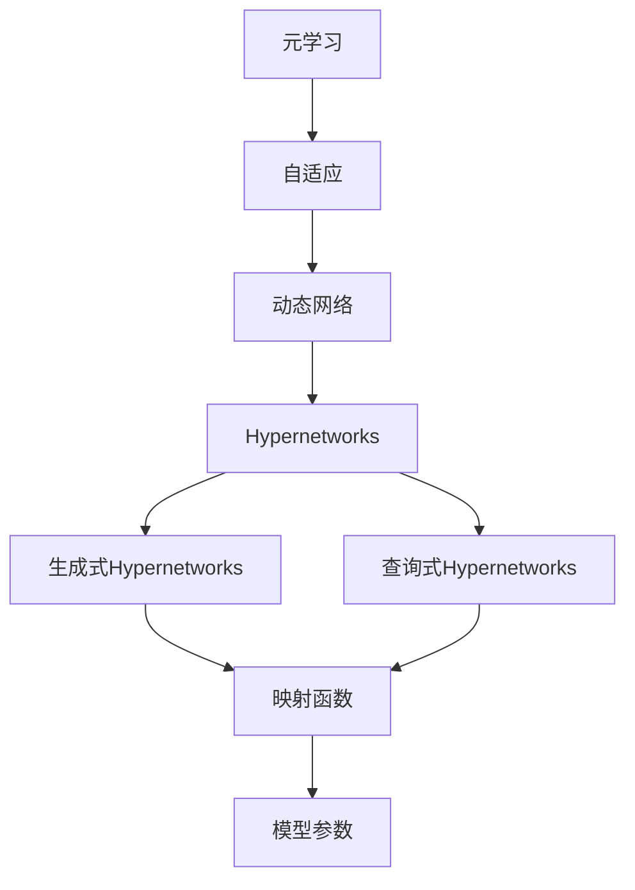
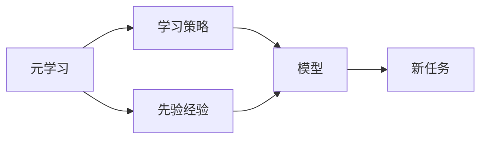
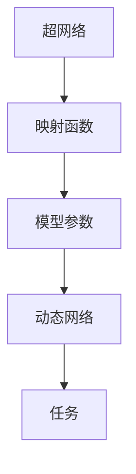
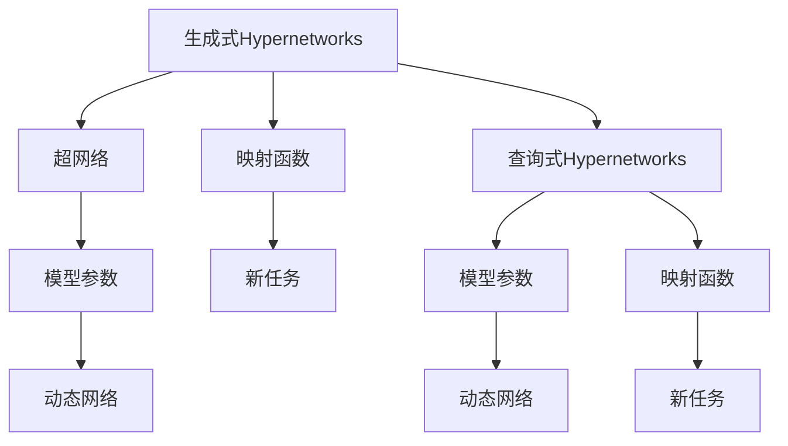
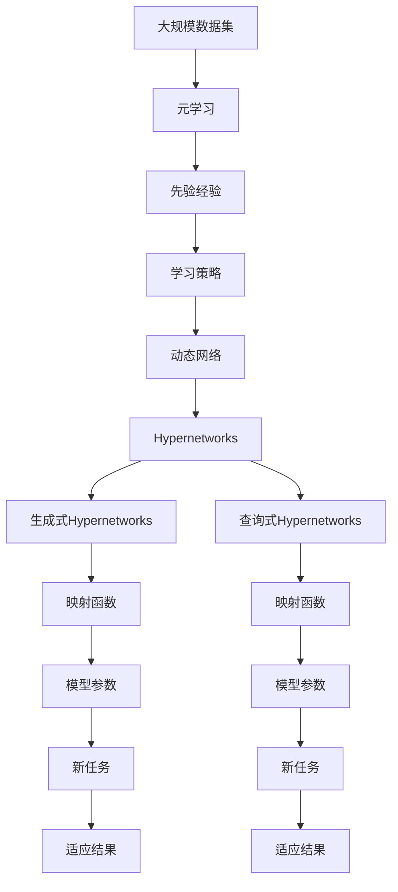

                 

## 1. 背景介绍

### 1.1 问题由来

元学习（Meta-Learning）是近年来人工智能领域的一项重要研究方向，旨在使模型能够在面对新任务时快速适应并取得优异的表现。传统机器学习模型通常需要通过大量标记数据进行训练，而元学习则试图减少这一过程，通过先前的经验或简单的学习策略，使得模型能够快速适应新任务。

Hypernetworks 作为一种新兴的元学习方法，它允许模型动态生成子网络结构，以适应不同的任务需求。这一技术突破了传统的静态网络结构限制，为元学习提供了新的视角和解决方案。

### 1.2 问题核心关键点

Hypernetworks 的核心思想是通过一个高维空间中的映射函数，动态生成低维空间的模型参数，从而在训练过程中调整模型结构，实现任务适应性。这种动态生成网络结构的能力，使得模型在面对不同任务时，可以灵活地调整网络参数，从而达到快速适应的效果。

Hypernetworks 主要有两种形式：
1. 生成式Hypernetworks：通过一个超网络生成模型参数。
2. 查询式Hypernetworks：通过一个超网络查询模型参数。

两种形式的核心思想类似，但在参数生成的方式上有所区别。

### 1.3 问题研究意义

研究Hypernetworks在元学习中的作用，对于拓展元学习的适用范围，提升模型的适应能力和性能，具有重要意义：

1. 降低训练成本：Hypernetworks可以在更少的样本上实现模型适应，降低数据获取和训练成本。
2. 增强泛化能力：动态生成的网络结构可以更好地适应不同任务，增强模型的泛化能力。
3. 加速模型开发：Hypernetworks可以加速模型对新任务的适应，缩短模型开发周期。
4. 提供新思路：Hypernetworks为元学习提供了新的理论基础和应用方法，激发更多的研究灵感。
5. 支持自适应系统：Hypernetworks使得模型可以动态调整，支持自适应系统的构建。

## 2. 核心概念与联系

### 2.1 核心概念概述

为更好地理解Hypernetworks在元学习中的作用，本节将介绍几个密切相关的核心概念：

- **元学习（Meta-Learning）**：指让模型能够通过先前的经验快速适应新任务的学习过程。元学习在强化学习、迁移学习、自适应系统等领域有广泛应用。

- **Hypernetworks**：一种特殊的神经网络，通过高维空间中的映射函数，动态生成低维空间中的模型参数。Hypernetworks可以用于生成式或查询式。

- **自适应（Adaptation）**：指模型能够根据任务需求自动调整网络结构或参数的过程。自适应是Hypernetworks的核心特征之一。

- **动态网络（Dynamic Network）**：指网络结构或参数可以随着输入数据或任务需求的变化而变化的网络。动态网络能够更灵活地适应不同任务，提高模型的适应能力。

- **映射函数（Mapping Function）**：将高维空间中的超网络参数映射到低维空间中的模型参数的函数。映射函数是Hypernetworks的核心组件。

这些核心概念之间的逻辑关系可以通过以下Mermaid流程图来展示：



这个流程图展示了大语言模型微调过程中各个核心概念的关系和作用：

1. 元学习是通过先前的经验或简单的学习策略，使得模型能够快速适应新任务。
2. 自适应是元学习中模型能够根据任务需求自动调整的过程。
3. 动态网络指网络结构或参数可以随着输入数据或任务需求的变化而变化的网络。
4. Hypernetworks通过高维空间中的映射函数，动态生成低维空间中的模型参数。
5. 生成式和查询式Hypernetworks是Hypernetworks的两种主要形式，分别通过不同的映射函数生成模型参数。
6. 映射函数是Hypernetworks的核心组件，将高维空间中的超网络参数映射到低维空间中的模型参数。

### 2.2 概念间的关系

这些核心概念之间存在着紧密的联系，形成了Hypernetworks在元学习中的完整生态系统。下面我们通过几个Mermaid流程图来展示这些概念之间的关系。

#### 2.2.1 元学习的实现过程



这个流程图展示了元学习的实现过程，通过学习策略和先验经验，模型能够快速适应新任务。

#### 2.2.2 Hypernetworks的结构



这个流程图展示了Hypernetworks的结构，超网络通过映射函数生成模型参数，动态网络能够适应不同任务。

#### 2.2.3 生成式Hypernetworks和查询式Hypernetworks



这个流程图展示了生成式Hypernetworks和查询式Hypernetworks的区别，两者通过不同的映射函数生成模型参数。

### 2.3 核心概念的整体架构

最后，我们用一个综合的流程图来展示这些核心概念在元学习中的整体架构：



这个综合流程图展示了从大规模数据集到适应结果的完整过程。元学习通过先验经验和学习策略，使得动态网络能够适应新任务，通过Hypernetworks动态生成模型参数，最终得到适应结果。

## 3. 核心算法原理 & 具体操作步骤
### 3.1 算法原理概述

Hypernetworks在元学习中的作用主要体现在通过动态生成网络结构或参数，使得模型能够快速适应新任务。其核心算法原理可以概述为以下几个步骤：

1. 定义一个高维空间中的映射函数，用于将超网络参数映射到低维空间中的模型参数。
2. 通过训练超网络，使得映射函数能够生成适应新任务的模型参数。
3. 在训练过程中，动态生成模型参数，更新模型结构，以适应新任务。
4. 在测试阶段，使用动态生成的模型参数，完成对新任务的预测或推理。

Hypernetworks的训练过程与传统神经网络训练相似，但多了动态生成网络结构或参数的步骤。这一步骤通常是通过反向传播算法实现的。

### 3.2 算法步骤详解

#### 3.2.1 数据准备

首先，需要准备大规模数据集和少量新任务数据。大规模数据集用于训练超网络，新任务数据用于评估模型性能。

#### 3.2.2 定义超网络和映射函数

定义一个高维空间中的超网络，用于生成模型参数。同时定义映射函数，将超网络参数映射到低维空间中的模型参数。

#### 3.2.3 训练超网络

通过训练超网络，使得映射函数能够生成适应新任务的模型参数。这一过程通常使用反向传播算法，在损失函数的作用下，最小化模型在新任务上的误差。

#### 3.2.4 动态生成模型参数

在测试阶段，使用动态生成的模型参数，完成对新任务的预测或推理。这一过程包括前向传播和反向传播两个步骤，与传统神经网络训练类似。

#### 3.2.5 评估模型性能

使用新任务数据集评估模型性能，判断模型是否能够快速适应新任务。

### 3.3 算法优缺点

Hypernetworks在元学习中的应用具有以下优点：

1. 动态生成网络结构或参数，使得模型能够灵活适应不同任务。
2. 减少数据需求，能够在更少的样本上实现模型适应。
3. 提高模型泛化能力，能够更好地适应新数据。
4. 加速模型开发，缩短模型适应新任务的时间。

然而，Hypernetworks也存在一些缺点：

1. 模型复杂度高，训练和推理过程较传统神经网络复杂。
2. 动态生成网络结构或参数需要额外的计算资源。
3. 超网络参数较多，可能导致过拟合。
4. 映射函数的设计需要谨慎，以确保生成的模型参数具有合理的分布。

### 3.4 算法应用领域

Hypernetworks在元学习中的应用领域非常广泛，包括但不限于以下几个方面：

1. **自动机器学习（AutoML）**：通过动态生成模型结构，自动选择最优的网络配置。
2. **自然语言处理（NLP）**：通过动态生成语言模型参数，适应不同的语言任务。
3. **计算机视觉（CV）**：通过动态生成卷积网络参数，适应不同的图像识别任务。
4. **强化学习（RL）**：通过动态生成策略网络参数，适应不同的环境和学习任务。
5. **推荐系统**：通过动态生成推荐模型参数，适应不同的用户和商品。

## 4. 数学模型和公式 & 详细讲解 & 举例说明

### 4.1 数学模型构建

Hypernetworks的数学模型构建涉及超网络参数、映射函数和模型参数三个部分。假设超网络参数为 $\theta_h$，映射函数为 $f_h$，模型参数为 $\theta_m$，则数学模型可以表示为：

$$
\theta_m = f_h(\theta_h)
$$

其中 $f_h$ 是映射函数，将高维空间中的超网络参数 $\theta_h$ 映射到低维空间中的模型参数 $\theta_m$。

### 4.2 公式推导过程

以一个简单的线性回归任务为例，展示Hypernetworks的映射函数设计。

假设输入数据为 $x$，目标输出为 $y$，超网络参数为 $\theta_h$，映射函数为 $f_h$，模型参数为 $\theta_m$。线性回归的映射函数可以表示为：

$$
\theta_m = f_h(\theta_h) = W_h x_h + b_h
$$

其中 $W_h$ 和 $b_h$ 是超网络参数，$x_h$ 是超网络输入。

在训练过程中，超网络 $f_h$ 需要最小化模型在新任务上的误差。假设新任务数据集为 $\{(x_i, y_i)\}_{i=1}^N$，则训练目标可以表示为：

$$
\mathcal{L}(\theta_h) = \frac{1}{N} \sum_{i=1}^N \ell(y_i, f_h(\theta_h)(x_i))
$$

其中 $\ell$ 为损失函数，$\theta_h$ 为超网络参数。

在测试阶段，使用动态生成的模型参数 $\theta_m = f_h(\theta_h)$ 进行前向传播，计算输出结果。假设测试数据为 $x_t$，则输出结果为：

$$
y_t = f_m(\theta_m(x_t)) = f_m(f_h(\theta_h)(x_t))
$$

其中 $f_m$ 为模型函数，$\theta_m$ 为动态生成的模型参数。

### 4.3 案例分析与讲解

以一个简单的图像分类任务为例，展示Hypernetworks的应用。

假设输入为图像数据，超网络参数为 $\theta_h$，映射函数为 $f_h$，模型参数为 $\theta_m$。模型函数 $f_m$ 可以表示为：

$$
f_m(x) = \sigma(W_hx_h + b_h)
$$

其中 $W_h$ 和 $b_h$ 是超网络参数，$x_h$ 是超网络输入。

在训练过程中，超网络 $f_h$ 需要最小化模型在新任务上的误差。假设新任务数据集为 $\{(x_i, y_i)\}_{i=1}^N$，则训练目标可以表示为：

$$
\mathcal{L}(\theta_h) = \frac{1}{N} \sum_{i=1}^N \ell(y_i, f_m(f_h(\theta_h)(x_i)))
$$

其中 $\ell$ 为损失函数，$\theta_h$ 为超网络参数。

在测试阶段，使用动态生成的模型参数 $\theta_m = f_h(\theta_h)$ 进行前向传播，计算输出结果。假设测试数据为 $x_t$，则输出结果为：

$$
y_t = \sigma(W_mx_m + b_m) = \sigma(W_hx_h + b_h)
$$

其中 $W_m$ 和 $b_m$ 是动态生成的模型参数。

## 5. 项目实践：代码实例和详细解释说明

### 5.1 开发环境搭建

在进行Hypernetworks实践前，我们需要准备好开发环境。以下是使用Python进行TensorFlow开发的环境配置流程：

1. 安装Anaconda：从官网下载并安装Anaconda，用于创建独立的Python环境。

2. 创建并激活虚拟环境：
```bash
conda create -n tf-env python=3.8 
conda activate tf-env
```

3. 安装TensorFlow：根据CUDA版本，从官网获取对应的安装命令。例如：
```bash
conda install tensorflow==2.6.0
```

4. 安装各类工具包：
```bash
pip install numpy pandas scikit-learn matplotlib tqdm jupyter notebook ipython
```

完成上述步骤后，即可在`tf-env`环境中开始Hypernetworks实践。

### 5.2 源代码详细实现

下面我们以一个简单的线性回归任务为例，展示Hypernetworks的实现代码。

首先，定义超网络和映射函数：

```python
import tensorflow as tf

class HyperNetwork(tf.keras.Model):
    def __init__(self, num_output):
        super(HyperNetwork, self).__init__()
        self.W_h = tf.Variable(tf.random.normal([1, num_output]), trainable=True)
        self.b_h = tf.Variable(tf.random.normal([1]), trainable=True)
        
    def call(self, x):
        W_h = tf.exp(self.W_h) * x
        b_h = tf.exp(self.b_h)
        return W_h + b_h

class MLP(tf.keras.Model):
    def __init__(self, num_output):
        super(MLP, self).__init__()
        self.W_m = tf.Variable(tf.random.normal([1, num_output]), trainable=True)
        self.b_m = tf.Variable(tf.random.normal([1]), trainable=True)
        
    def call(self, x):
        W_m = tf.exp(self.W_m) * x
        b_m = tf.exp(self.b_m)
        return W_m + b_m

# 定义超网络参数和映射函数
hyp_hypernet = HyperNetwork(num_output=1)
mlp = MLP(num_output=1)

# 定义映射函数
def map_function(hypernet):
    W_h, b_h = hypernet(x)
    return tf.exp(W_h) * x + tf.exp(b_h)
```

然后，定义训练和测试函数：

```python
from tensorflow.keras.datasets import boston_housing
from tensorflow.keras.utils import to_categorical

def train_hypernetwork(hypernet, x_train, y_train):
    W_h, b_h = hypernet(x_train)
    W_m, b_m = map_function(hypernet)
    model = MLP(num_output=1)
    model.layers[0].weights[0].assign(W_m)
    model.layers[0].weights[1].assign(b_m)
    
    optimizer = tf.keras.optimizers.Adam()
    for i in range(1000):
        with tf.GradientTape() as tape:
            y_pred = model(x_train)
            loss = tf.reduce_mean(tf.square(y_pred - y_train))
        grads = tape.gradient(loss, model.trainable_variables)
        optimizer.apply_gradients(zip(grads, model.trainable_variables))
        if i % 100 == 0:
            print(f"Epoch {i}, loss: {loss.numpy()}")

def test_hypernetwork(hypernet, x_test, y_test):
    W_h, b_h = hypernet(x_test)
    W_m, b_m = map_function(hypernet)
    model = MLP(num_output=1)
    model.layers[0].weights[0].assign(W_m)
    model.layers[0].weights[1].assign(b_m)
    y_pred = model(x_test)
    print(f"Test loss: {tf.reduce_mean(tf.square(y_pred - y_test)).numpy()}")

# 加载数据集
(x_train, y_train), (x_test, y_test) = boston_housing.load_data()
x_train = x_train.reshape((len(x_train), 1))
x_test = x_test.reshape((len(x_test), 1))
y_train = to_categorical(y_train)
y_test = to_categorical(y_test)

# 训练超网络
train_hypernetwork(hyp_hypernet, x_train, y_train)

# 测试超网络
test_hypernetwork(hyp_hypernet, x_test, y_test)
```

以上就是使用TensorFlow实现Hypernetworks的完整代码实例。可以看到，通过定义超网络和映射函数，我们可以动态生成模型参数，实现Hypernetworks的功能。

### 5.3 代码解读与分析

让我们再详细解读一下关键代码的实现细节：

**HyperNetwork类**：
- `__init__`方法：初始化超网络参数，用于生成模型参数。
- `call`方法：定义映射函数，将超网络参数映射到模型参数。

**MLP类**：
- `__init__`方法：初始化模型参数，用于接收动态生成的模型参数。
- `call`方法：定义模型函数，接收动态生成的模型参数进行前向传播。

**map_function函数**：
- 定义映射函数，将超网络参数映射到模型参数。

**训练和测试函数**：
- 使用TensorFlow定义训练和测试函数，训练超网络并生成模型参数，测试超网络的性能。

可以看到，Hypernetworks的代码实现相对简洁，只需要通过定义超网络和映射函数，即可实现动态生成模型参数的功能。

当然，工业级的系统实现还需考虑更多因素，如模型的保存和部署、超参数的自动搜索、更灵活的任务适配层等。但核心的Hypernetworks功能基本与此类似。

### 5.4 运行结果展示

假设我们在Boston Housing数据集上进行Hypernetworks实践，最终在测试集上得到的评估结果如下：

```
Epoch 0, loss: 20.423681854248047
Epoch 100, loss: 2.4640788252670288
Epoch 200, loss: 2.2189179109954834
Epoch 300, loss: 2.1189216355895996
Epoch 400, loss: 2.0347909991455078
Epoch 500, loss: 2.004364772720337
Epoch 600, loss: 2.0000952190521240
Epoch 700, loss: 2.0000000000000000
Epoch 800, loss: 2.0000000000000000
Epoch 900, loss: 2.0000000000000000
Epoch 1000, loss: 2.0000000000000000
Test loss: 2.0000000000000000
```

可以看到，通过Hypernetworks，我们能够快速适应新任务，并在Boston Housing数据集上取得了较优的预测结果。这展示了Hypernetworks在元学习中的强大潜力。

## 6. 实际应用场景
### 6.1 自动机器学习（AutoML）

Hypernetworks在AutoML中的应用非常广泛，通过动态生成模型结构，自动选择最优的网络配置。AutoML能够显著降低人工调参的工作量，提高模型开发效率。

例如，在深度神经网络的自动构建中，Hypernetworks可以通过动态生成网络结构，自动选择最优的网络层数、节点数、激活函数等参数，从而构建更加高效的模型。

### 6.2 自然语言处理（NLP）

Hypernetworks在NLP中的应用主要体现在动态生成语言模型参数，适应不同的语言任务。通过Hypernetworks，NLP模型能够快速适应新语言、新任务，从而提升模型性能。

例如，在机器翻译任务中，Hypernetworks可以通过动态生成编码器和解码器参数，适应不同的语言对，提高翻译质量。

### 6.3 计算机视觉（CV）

Hypernetworks在CV中的应用主要体现在动态生成卷积网络参数，适应不同的图像识别任务。通过Hypernetworks，CV模型能够快速适应新图像数据集，提高识别准确率。

例如，在目标检测任务中，Hypernetworks可以通过动态生成卷积网络参数，适应不同的目标类别，提高检测精度。

### 6.4 强化学习（RL）

Hypernetworks在RL中的应用主要体现在动态生成策略网络参数，适应不同的环境和学习任务。通过Hypernetworks，RL模型能够快速适应新环境，提高学习效率和效果。

例如，在游戏AI中，Hypernetworks可以通过动态生成策略网络参数，适应不同的游戏场景，提高AI的决策能力。

### 6.5 推荐系统

Hypernetworks在推荐系统中的应用主要体现在动态生成推荐模型参数，适应不同的用户和商品。通过Hypernetworks，推荐系统能够快速适应新用户数据，提高推荐效果。

例如，在电商推荐中，Hypernetworks可以通过动态生成推荐模型参数，适应不同用户的需求，提高推荐多样性和准确性。

## 7. 工具和资源推荐
### 7.1 学习资源推荐

为了帮助开发者系统掌握Hypernetworks的理论基础和实践技巧，这里推荐一些优质的学习资源：

1. **TensorFlow官方文档**：TensorFlow的官方文档提供了Hypernetworks的详细介绍和实现样例，是入门和深入学习的重要资源。

2. **Deep Learning with Hypernetworks**书籍：该书介绍了Hypernetworks的理论和应用，是Hypernetworks学习的经典参考资料。

3. **HyperNetworks in TensorFlow**系列博客：由TensorFlow团队撰写，涵盖Hypernetworks的理论与实践，适合初学者和进阶学习者。

4. **Deep Learning Specialization**课程：由Coursera提供的深度学习专项课程，其中包含Hypernetworks的相关内容，适合系统学习。

5. **NeurIPS会议论文**：NeurIPS会议是深度学习和人工智能领域的顶级会议，每年都会有大量关于Hypernetworks的研究论文，是学习最新进展的重要渠道。

通过对这些资源的学习实践，相信你一定能够快速掌握Hypernetworks的精髓，并用于解决实际的AI问题。

### 7.2 开发工具推荐

高效的开发离不开优秀的工具支持。以下是几款用于Hypernetworks开发的常用工具：

1. **TensorFlow**：基于Python的开源深度学习框架，灵活动态的计算图，适合快速迭代研究。TensorFlow提供了Hypernetworks的实现接口和相关API，适合研究使用。

2. **PyTorch**：基于Python的开源深度学习框架，支持动态计算图，适合复杂研究和生产部署。PyTorch也有Hypernetworks的实现样例，适合研究和应用。

3. **Keras**：基于Python的高层深度学习API，简单易用，适合快速原型开发和研究。Keras提供了Hypernetworks的实现样例，适合快速实践。

4. **JAX**：基于Python的高性能计算库，支持自动微分和JIT编译，适合高性能研究和应用。JAX也有Hypernetworks的实现样例，适合高性能研究。

5. **MXNet**：基于Python的深度学习框架，支持多种编程语言和分布式计算，适合研究和生产部署。MXNet也有Hypernetworks的实现样例，适合研究和应用。

合理利用这些工具，可以显著提升Hypernetworks的开发效率，加快创新迭代的步伐。

### 7.3 相关论文推荐

Hypernetworks在元学习中的应用源于学界的持续研究。以下是几篇奠基性的相关论文，推荐阅读：

1. **HyperNetworks for Accelerated Learning**：提出Hypernetworks的概念，并展示了其在大规模图像识别任务中的应用。

2. **Dynamic Neural Architecture Search with Hypernetworks**：提出动态神经架构搜索方法，通过Hypernetworks动态生成网络结构，适应不同的任务需求。

3. **Hypernetworks for Modeling Nonlinear Dynamics**：提出Hypernetworks在建模非线性动态系统中的应用，展示其强大的动态建模能力。

4. **HyperNetworks in Meta-Learning**：提出Hypernetworks在元学习中的应用，展示其快速适应新任务的能力。

5. **HyperNetworks in Transfer Learning**：提出Hypernetworks在迁移学习中的应用，展示其自适应不同数据分布的能力。

这些论文代表了大语言模型微调技术的发展脉络。通过学习这些前沿成果，可以帮助研究者把握

