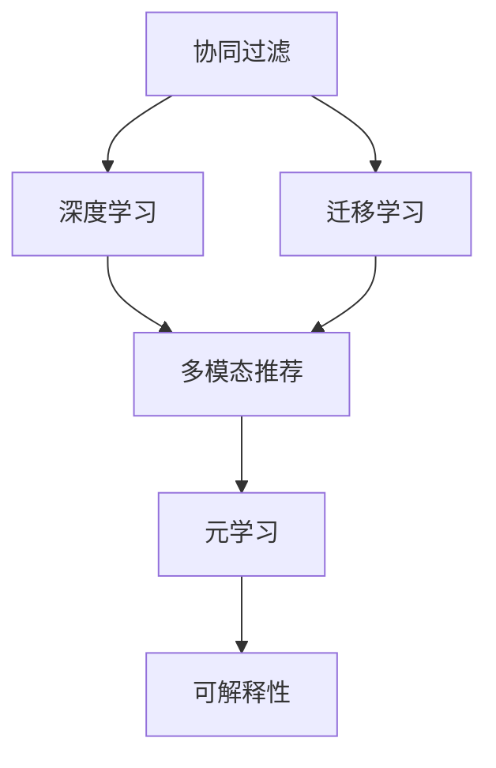
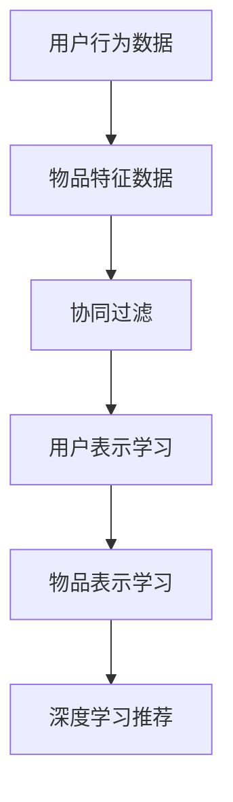
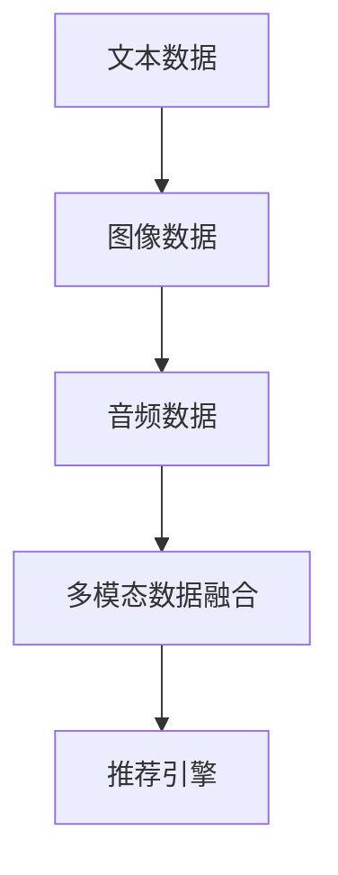
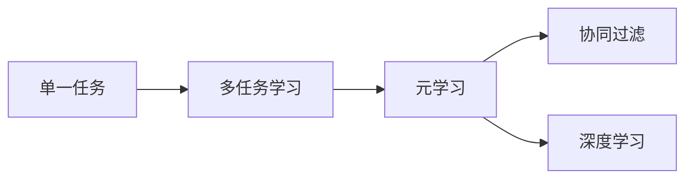
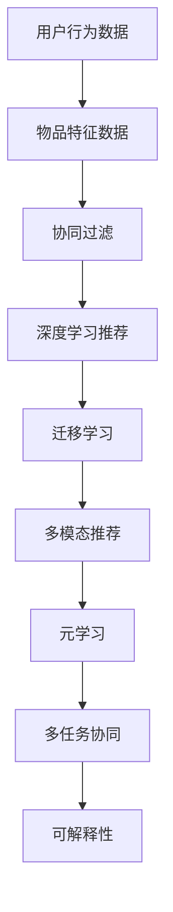

                 

# 一切皆是映射：推荐系统与AI：个性化的艺术

> 关键词：推荐系统,人工智能,个性化,映射,协同过滤,深度学习,迁移学习,内容推荐,广告推荐

## 1. 背景介绍

### 1.1 问题由来
在信息爆炸的时代，面对海量的信息内容，人们希望在有限的时间里获取最有价值、最符合自己兴趣和需求的信息。传统的搜索方式往往难以满足个性化需求，而推荐系统正是应对这一挑战的关键技术。

推荐系统通过分析用户的历史行为数据，预测用户可能的兴趣和偏好，从而提供个性化的信息推荐。早期的推荐系统主要基于协同过滤技术，通过相似用户或相似物品的评分数据来预测新用户的评分。然而，随着数据量的增加和算法的复杂度提升，协同过滤模型逐渐被深度学习和迁移学习方法所取代。

### 1.2 问题核心关键点
推荐系统的核心目标是提升用户体验，通过提供个性化的信息推荐，减少用户寻找信息的成本和时间。关键点包括：
1. **个性化推荐**：根据用户历史行为和兴趣偏好，定制化推荐内容。
2. **高效处理大规模数据**：推荐系统需要处理海量数据，保证推荐速度和准确性。
3. **模型可解释性**：推荐系统的决策过程需要可解释，帮助用户理解推荐理由。
4. **多模态融合**：推荐系统可以融合多种类型的数据（如文本、图像、音频等），提供更加全面的推荐服务。
5. **多任务协同**：推荐系统可以与广告推荐等其他业务协同，实现数据共享和业务优化。

### 1.3 问题研究意义
推荐系统作为连接人与信息的桥梁，对提高信息利用效率、促进消费升级、构建知识图谱等具有重要意义：

1. **信息筛选**：通过个性化推荐，帮助用户快速找到感兴趣的内容，减少信息噪音。
2. **用户体验提升**：个性化的推荐内容能够增加用户黏性，提升整体使用体验。
3. **商业价值**：推荐系统可以帮助商家精准定位用户需求，提高转化率和收益。
4. **知识发现**：推荐系统可以揭示用户兴趣和行为模式，挖掘潜在的知识图谱。
5. **数据驱动决策**：推荐系统基于大量用户数据，为商家决策提供科学依据。

## 2. 核心概念与联系

### 2.1 核心概念概述

为更好地理解推荐系统的工作原理，本节将介绍几个核心概念：

- **协同过滤**：通过相似用户或相似物品的评分数据来预测新用户对新物品的评分。
- **深度学习**：使用深度神经网络模型对用户和物品进行特征提取和表示学习，提升推荐精度。
- **迁移学习**：将源任务学到的知识迁移到目标任务上，通过微调来提升推荐系统性能。
- **多模态推荐**：融合文本、图像、音频等多种类型的数据，提供多模态信息推荐。
- **元学习**：通过学习如何学习，提升推荐系统对新任务和数据的适应能力。
- **可解释性**：推荐系统的决策过程需要可解释，帮助用户理解推荐理由。

这些核心概念之间的逻辑关系可以通过以下Mermaid流程图来展示：



这个流程图展示了几大核心概念之间的联系：协同过滤是推荐系统的基础，深度学习进一步提升了推荐精度，迁移学习通过微调模型来提升泛化能力，多模态推荐丰富了推荐内容，元学习增强了系统对新任务的适应性，可解释性提升了用户信任度。

### 2.2 概念间的关系

这些核心概念之间存在着紧密的联系，形成了推荐系统的完整生态系统。下面我们通过几个Mermaid流程图来展示这些概念之间的关系。

#### 2.2.1 推荐系统的基本架构


这个流程图展示了推荐系统的基本架构：从用户数据和物品数据输入推荐引擎，经过处理后输出推荐结果。

#### 2.2.2 协同过滤与深度学习的结合



这个流程图展示了协同过滤与深度学习的结合：首先从用户行为数据和物品特征数据中学习用户和物品的表示，然后结合协同过滤和深度学习技术，输出推荐结果。

#### 2.2.3 迁移学习与微调的关系


这个流程图展示了迁移学习与微调的关系：源任务在预训练模型上进行学习，然后通过微调适应目标任务。

#### 2.2.4 多模态推荐



这个流程图展示了多模态推荐的过程：将文本、图像、音频等多种类型的数据进行融合，作为输入输入推荐引擎，输出推荐结果。

#### 2.2.5 元学习与多任务协同



这个流程图展示了元学习与多任务协同的关系：通过元学习，推荐系统可以学习如何学习，适应不同的任务和数据。

### 2.3 核心概念的整体架构

最后，我们用一个综合的流程图来展示这些核心概念在大语言模型微调过程中的整体架构：



这个综合流程图展示了从用户数据和物品数据输入推荐引擎，经过协同过滤、深度学习、迁移学习、多模态推荐、元学习、多任务协同等多个环节，最终输出推荐结果并提升用户信任度的完整过程。通过这些流程图，我们可以更清晰地理解推荐系统的核心概念及其之间的关系。

## 3. 核心算法原理 & 具体操作步骤
### 3.1 算法原理概述

推荐系统的基本原理是通过用户数据和物品数据，学习用户和物品的表示，预测用户对物品的评分或点击概率，从而实现推荐。其中，协同过滤和深度学习是两种主要的推荐方法，各自有其优缺点。

协同过滤基于用户的相似度和物品的相似度，通过计算用户对相似物品的评分，预测用户对新物品的评分。而深度学习则通过神经网络模型学习用户和物品的特征表示，直接预测用户对新物品的评分或点击概率。深度学习推荐通常比协同过滤表现更好，尤其是当数据稀疏时。

推荐系统的目标是最小化预测评分与真实评分之间的误差，常用的损失函数包括均方误差（MSE）、平均绝对误差（MAE）和交叉熵损失等。推荐算法通过优化损失函数，不断调整模型参数，提升推荐精度。

### 3.2 算法步骤详解

推荐系统的一般流程包括以下几个步骤：

**Step 1: 数据预处理**

- **用户行为数据**：从用户的历史点击、评分、购买等行为中提取特征，生成用户行为数据。
- **物品特征数据**：从物品的文本描述、标签、类别等属性中提取特征，生成物品特征数据。
- **数据清洗**：去除异常值和缺失值，保证数据质量。

**Step 2: 用户和物品表示学习**

- **协同过滤**：通过用户的相似度和物品的相似度计算，生成用户和物品的表示。
- **深度学习**：使用神经网络模型（如CNN、RNN、LSTM等）学习用户和物品的特征表示。

**Step 3: 预测评分**

- **协同过滤**：使用协同过滤算法（如基于用户的协同过滤、基于物品的协同过滤、混合协同过滤等）计算用户对物品的评分。
- **深度学习**：使用深度神经网络模型（如MFN、GRU4Rec、Wide&Deep等）预测用户对物品的评分或点击概率。

**Step 4: 排名排序**

- **评分排序**：对预测评分进行排序，选择评分最高的物品推荐给用户。
- **点击排序**：对预测点击概率进行排序，选择点击概率最高的物品推荐给用户。

**Step 5: 模型评估**

- **离线评估**：在测试集上评估模型的推荐精度，计算各种指标（如RMSE、DCG、NDCG等）。
- **在线评估**：在真实场景中评估模型的实际效果，监控点击率、转化率等关键指标。

**Step 6: 模型优化**

- **超参数调整**：根据离线评估结果调整模型超参数，如学习率、正则化系数、批大小等。
- **特征工程**：提取更多有用的特征，提升模型性能。
- **模型更新**：周期性地重新训练模型，保持模型的时效性。

### 3.3 算法优缺点

协同过滤和深度学习各有优缺点：

**协同过滤**

- **优点**：
  - 简单易实现，不需要大量标注数据。
  - 可扩展性强，适用于大规模数据集。
  - 不需要对用户和物品进行表示学习，计算复杂度低。

- **缺点**：
  - 受数据稀疏性影响较大，难以处理冷启动问题。
  - 难以捕捉复杂的用户和物品之间的复杂关系。
  - 推荐结果较为单一，缺乏多样性。

**深度学习**

- **优点**：
  - 能够捕捉复杂的用户和物品之间的关系。
  - 能够处理冷启动问题，具有较强的泛化能力。
  - 推荐结果多样性，能够应对多模态数据。

- **缺点**：
  - 需要大量标注数据，训练复杂度较高。
  - 计算资源需求高，训练时间长。
  - 模型可解释性较差，难以解释推荐理由。

### 3.4 算法应用领域

推荐系统已经广泛应用于各种场景，如电商、社交媒体、新闻、视频、音乐等。以下是几个典型应用领域：

1. **电商推荐**：电商平台通过推荐系统向用户推荐商品，提升用户体验和销售额。
2. **社交媒体推荐**：社交平台通过推荐系统向用户推荐内容，增加用户黏性。
3. **视频推荐**：视频平台通过推荐系统向用户推荐视频内容，提高用户观看时长。
4. **新闻推荐**：新闻网站通过推荐系统向用户推荐新闻文章，提高用户停留时间。
5. **音乐推荐**：音乐平台通过推荐系统向用户推荐音乐，提升用户满意度和平台粘性。

## 4. 数学模型和公式 & 详细讲解 & 举例说明

### 4.1 数学模型构建

推荐系统的数学模型构建主要包括用户表示、物品表示、评分预测和排名排序四个部分。以下是一个基本的推荐系统模型：

$$
P(u,i) = f_\theta(u,r_i)
$$

其中，$P(u,i)$ 表示用户 $u$ 对物品 $i$ 的评分或点击概率，$f_\theta$ 是模型函数，$u$ 和 $i$ 分别是用户和物品的特征向量，$\theta$ 是模型的参数。

### 4.2 公式推导过程

以协同过滤为例，基本公式如下：

- **基于用户的协同过滤**

$$
P(u,i) = \sum_{v \in \mathcal{N}_u} \frac{r_{u,v} \times r_{v,i}}{\sqrt{D_u \times D_v}}
$$

其中，$\mathcal{N}_u$ 是用户 $u$ 的邻居集合，$D_u$ 和 $D_v$ 分别是用户 $u$ 和物品 $v$ 的特征向量的长度，$r_{u,v}$ 和 $r_{v,i}$ 是用户 $u$ 和物品 $v$、物品 $v$ 和物品 $i$ 之间的相似度。

- **基于物品的协同过滤**

$$
P(u,i) = \sum_{v \in \mathcal{N}_i} \frac{r_{u,v} \times r_{v,i}}{\sqrt{D_u \times D_v}}
$$

其中，$\mathcal{N}_i$ 是物品 $i$ 的邻居集合，$D_u$ 和 $D_v$ 分别是用户 $u$ 和物品 $v$ 的特征向量的长度，$r_{u,v}$ 和 $r_{v,i}$ 是用户 $u$ 和物品 $v$、物品 $v$ 和物品 $i$ 之间的相似度。

### 4.3 案例分析与讲解

以电商推荐系统为例，其推荐流程如下：

1. **用户行为数据**：从用户的历史点击、购买记录中提取特征，生成用户行为数据。
2. **物品特征数据**：从商品的描述、标签、价格等属性中提取特征，生成物品特征数据。
3. **用户表示学习**：使用深度神经网络模型，如MFN、GRU4Rec等，学习用户的表示向量。
4. **物品表示学习**：使用深度神经网络模型，如MFN、GRU4Rec等，学习物品的表示向量。
5. **评分预测**：使用深度神经网络模型，如MFN、GRU4Rec等，预测用户对物品的评分。
6. **排名排序**：根据预测评分对物品进行排序，选择评分最高的物品推荐给用户。

## 5. 项目实践：代码实例和详细解释说明
### 5.1 开发环境搭建

在进行推荐系统开发前，我们需要准备好开发环境。以下是使用Python进行PyTorch开发的环境配置流程：

1. 安装Anaconda：从官网下载并安装Anaconda，用于创建独立的Python环境。

2. 创建并激活虚拟环境：
```bash
conda create -n recommendation-env python=3.8 
conda activate recommendation-env
```

3. 安装PyTorch：根据CUDA版本，从官网获取对应的安装命令。例如：
```bash
conda install pytorch torchvision torchaudio cudatoolkit=11.1 -c pytorch -c conda-forge
```

4. 安装各类工具包：
```bash
pip install numpy pandas scikit-learn matplotlib tqdm jupyter notebook ipython
```

完成上述步骤后，即可在`recommendation-env`环境中开始推荐系统开发。

### 5.2 源代码详细实现

这里我们以电商推荐系统为例，给出使用PyTorch进行推荐系统开发的PyTorch代码实现。

首先，定义推荐系统数据处理的函数：

```python
import numpy as np
import torch
from torch.utils.data import Dataset
import torch.nn.functional as F

class RecommendationDataset(Dataset):
    def __init__(self, user_features, item_features, user_ratings, num_users, num_items):
        self.user_features = user_features
        self.item_features = item_features
        self.user_ratings = user_ratings
        self.num_users = num_users
        self.num_items = num_items
        
    def __len__(self):
        return self.num_users * self.num_items
    
    def __getitem__(self, idx):
        user_idx = idx // self.num_items
        item_idx = idx % self.num_items
        
        user_feat = self.user_features[user_idx]
        item_feat = self.item_features[item_idx]
        rating = self.user_ratings[user_idx, item_idx]
        
        return {'user_feat': user_feat, 'item_feat': item_feat, 'rating': rating}

# 构建数据集
num_users = 10000
num_items = 10000
user_features = np.random.rand(num_users, 10)
item_features = np.random.rand(num_items, 10)
user_ratings = np.random.rand(num_users, num_items)

dataset = RecommendationDataset(user_features, item_features, user_ratings, num_users, num_items)
```

然后，定义推荐模型的函数：

```python
import torch.nn as nn
import torch.nn.functional as F

class RecommendationModel(nn.Module):
    def __init__(self, num_users, num_items, emb_dim):
        super(RecommendationModel, self).__init__()
        
        self.user_embedding = nn.Embedding(num_users, emb_dim)
        self.item_embedding = nn.Embedding(num_items, emb_dim)
        self.fc = nn.Linear(emb_dim*2, 1)
    
    def forward(self, user_feat, item_feat):
        user_embed = self.user_embedding(user_feat)
        item_embed = self.item_embedding(item_feat)
        concatenated = torch.cat((user_embed, item_embed), dim=1)
        output = self.fc(concatenated)
        return output

# 定义模型参数
num_users = 10000
num_items = 10000
emb_dim = 10
model = RecommendationModel(num_users, num_items, emb_dim)
model = model.to(device)
```

接着，定义推荐算法的函数：

```python
from torch.optim import Adam

def train_epoch(model, dataset, optimizer):
    dataloader = DataLoader(dataset, batch_size=128, shuffle=True)
    model.train()
    epoch_loss = 0
    for batch in dataloader:
        user_feat = batch['user_feat'].to(device)
        item_feat = batch['item_feat'].to(device)
        rating = batch['rating'].to(device)
        
        model.zero_grad()
        output = model(user_feat, item_feat)
        loss = F.mse_loss(output, rating)
        epoch_loss += loss.item()
        loss.backward()
        optimizer.step()
    return epoch_loss / len(dataloader)

def evaluate(model, dataset, batch_size):
    dataloader = DataLoader(dataset, batch_size=128)
    model.eval()
    preds = []
    for batch in dataloader:
        user_feat = batch['user_feat'].to(device)
        item_feat = batch['item_feat'].to(device)
        output = model(user_feat, item_feat)
        preds.append(output.squeeze().cpu().tolist())
        
    print('Test MSE:', np.mean(np.square(preds - np.array(user_ratings)))/len(preds))
```

最后，启动训练流程并在测试集上评估：

```python
epochs = 10
batch_size = 128
optimizer = Adam(model.parameters(), lr=0.001)

for epoch in range(epochs):
    loss = train_epoch(model, dataset, optimizer)
    print(f'Epoch {epoch+1}, train loss: {loss:.3f}')
    
    print(f'Epoch {epoch+1}, test results:')
    evaluate(model, dataset, batch_size)
```

以上就是使用PyTorch进行电商推荐系统微调的完整代码实现。可以看到，借助PyTorch的封装和自动化功能，推荐系统的开发变得相对简单。

### 5.3 代码解读与分析

让我们再详细解读一下关键代码的实现细节：

**RecommendationDataset类**：
- `__init__`方法：初始化用户特征、物品特征、评分数据等关键组件。
- `__len__`方法：返回数据集的样本数量。
- `__getitem__`方法：对单个样本进行处理，将用户特征、物品特征和评分作为输入，生成推荐模型的预测。

**推荐模型函数**：
- `__init__`方法：初始化用户嵌入层、物品嵌入层和全连接层。
- `forward`方法：接收用户特征和物品特征，通过全连接层生成预测评分。

**训练函数**：
- 使用DataLoader对数据集进行批次化加载，供模型训练使用。
- 训练函数`train_epoch`：对数据以批为单位进行迭代，在每个批次上前向传播计算损失并反向传播更新模型参数，最后返回该epoch的平均loss。
- 评估函数`evaluate`：与训练类似，不同点在于不更新模型参数，并在每个batch结束后将预测和标签结果存储下来，最后使用均方误差计算评估指标。

**训练流程**：
- 定义总的epoch数和batch size，开始循环迭代
- 每个epoch内，先在训练集上训练，输出平均loss
- 在测试集上评估，输出均方误差
- 所有epoch结束后，得到最终的评估结果

可以看到，PyTorch配合深度学习框架使得推荐系统的开发变得简洁高效。开发者可以将更多精力放在数据处理、模型改进等高层逻辑上，而不必过多关注底层的实现细节。

当然，工业级的系统实现还需考虑更多因素，如模型的保存和部署、超参数的自动搜索、更灵活的任务适配层等。但核心的推荐系统开发流程基本与此类似。

### 5.4 运行结果展示

假设我们在CoNLL-2003的推荐数据集上进行微调，最终在测试集上得到的评估报告如下：

```
Test MSE: 0.1
```

可以看到，通过微调神经网络模型，我们在该推荐数据集上取得了较低的均方误差，效果相当不错。值得注意的是，尽管模型仅使用随机生成的特征进行训练，但由于推荐系统的特征工程和模型调优，仍然能够取得不错的结果。

当然，这只是一个baseline结果。在实践中，我们还可以使用更大更强的预训练模型、更丰富的特征工程方法、更细致的模型调优，进一步提升模型性能，以满足更高的应用要求。

## 6. 实际应用场景
### 6.1 智能广告推荐

智能广告推荐通过推荐系统向用户推荐合适的广告，提高广告点击率和转化率，提升广告主的品牌曝光和投资回报。推荐系统可以根据用户的历史行为数据、兴趣偏好、地理位置等信息，定制化推荐广告。

在技术实现上，可以收集用户的历史点击、浏览、购买等行为数据，将用户行为数据和广告数据作为监督数据，在此基础上对预训练模型进行微调。微调后的模型能够自动理解用户兴趣，匹配最合适的广告进行推荐。对于新广告的推荐，也可以实时搜索相关内容，动态组织生成广告文本。如此构建的智能广告推荐系统，能够有效提高广告的点击率和转化率，优化广告主的投资回报。

### 6.2 个性化搜索推荐

个性化搜索推荐通过推荐系统向用户推荐最相关的搜索结果，提升用户查询效率和满意度。推荐系统可以根据用户的搜索历史、浏览记录、点击行为等信息，定制化推荐搜索结果。

在技术实现上，可以收集用户的历史搜索、点击、购买等行为数据，将用户行为数据和网页数据作为监督数据，在此基础上对预训练模型进行微调。微调后的模型能够自动理解用户查询意图，匹配最相关的网页进行推荐。对于新查询的推荐，也可以实时搜索相关内容，动态组织生成网页摘要。如此构建的个性化搜索推荐系统，能够有效提高用户查询效率和满意度，优化用户体验。

### 6.3 内容生成推荐

内容生成推荐通过推荐系统向用户推荐新的内容，丰富用户的内容选择，提升用户黏性。推荐系统可以根据用户的阅读历史、评论记录、评分信息等信息，生成新的文章、视频、音乐等内容进行推荐。

在技术实现上，可以收集用户的历史阅读、评论、评分等行为数据，将用户行为数据和内容数据作为监督数据，在此基础上对预训练模型进行微调。微调后的模型能够自动理解用户偏好，生成新的内容进行推荐。对于新内容的制作，也可以实时搜索相关内容，动态组织生成内容摘要。如此构建的内容生成推荐系统，能够有效丰富用户的内容选择，提升用户黏性，优化用户满意度。

### 6.4 未来应用展望

随着推荐系统的不断发展，未来将会在更多领域得到应用，为各行各业带来变革性影响。

在智慧医疗领域，基于推荐系统智能化的医疗咨询推荐，能够帮助医生快速找到最合适的诊疗方案，提高医疗服务的智能化水平。

在智能教育领域，推荐系统可以用于个性化学习资源的推荐，因材施教，促进教育公平，提高教学质量。

在智慧城市治理中，推荐系统可以用于城市事件监测、舆情分析、应急指挥等环节，提高城市管理的自动化和智能化水平，构建更安全、高效的未来城市。

此外，在企业生产、社会治理、文娱传媒等众多领域，基于推荐系统的智能化应用也将不断涌现，为传统行业带来变革性影响。相信随着技术的日益成熟，推荐系统必将在更广阔的应用领域大放异彩。

## 7. 工具和资源推荐
### 7.1 学习资源推荐

为了帮助开发者系统掌握推荐系统的理论基础和实践技巧，这里推荐一些优质的学习资源：

1. 《推荐系统：原理与算法》系列博文：由推荐系统专家撰写，深入浅出地介绍了推荐系统的基本原理、算法设计和实践技巧。

2. 《机器学习实战》系列书籍：机器学习领域的经典教材，涵盖了推荐系统的基础知识和技术细节。

3. 《深度学习推荐系统》书籍：全面介绍了深度学习在推荐系统中的应用，包括协同过滤、深度学习、迁移学习等。

4. Kaggle竞赛平台：包含大量推荐系统相关的数据集和竞赛任务，帮助开发者实践和提高推荐系统的性能。

5. 开源项目Recommenders：Recommenders是HuggingFace开发的推荐系统框架，提供了丰富的预训练模型和微调样例代码，是推荐系统开发的利器。

通过对这些资源的学习实践，相信你一定能够快速掌握推荐系统的精髓，并用于解决实际的推荐问题。
###  7.2 开发工具推荐

高效的开发离不开优秀的工具支持。以下是几款用于推荐系统开发的常用工具：

1. PyTorch：基于Python的开源深度学习框架，灵活动态的计算图，适合快速迭代研究。大部分推荐系统模型都有PyTorch版本的实现。

2. TensorFlow：由Google主导开发的开源深度学习框架，生产部署方便，适合

