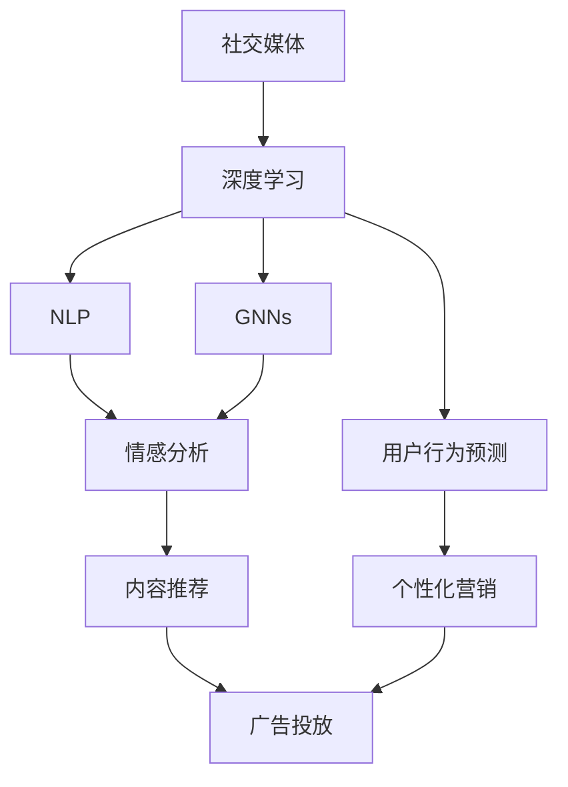

                 

# 一切皆是映射：深度学习在社交媒体数据分析中的应用

> 关键词：社交媒体,深度学习,数据挖掘,情感分析,自然语言处理,图神经网络

## 1. 背景介绍

### 1.1 问题由来
随着社交媒体的爆炸性增长，人们在线交流的频率和深度日益加深。如何高效、准确地分析社交媒体上的海量数据，提取有价值的信息和洞察，成为社会科学家、市场营销专家和政府决策者共同关心的重要问题。传统的文本挖掘和机器学习方法在面对大规模文本数据时，往往陷入维数灾难和稀疏性问题，难以处理复杂多变的用户行为和情感表达。因此，深度学习方法，特别是自然语言处理(NLP)和图神经网络(Graph Neural Networks, GNNs)技术，在社交媒体数据分析中展现出巨大的潜力。

### 1.2 问题核心关键点
深度学习，特别是基于神经网络模型的学习范式，通过多层非线性变换，能够自动提取高维输入数据中的复杂结构特征。在社交媒体数据分析中，深度学习主要用于用户行为预测、情感分析、关系识别和事件追踪等任务。通过深度神经网络模型，可以发现隐藏在文本、图像和互动行为背后的关联模式和动态变化，帮助预测未来趋势，优化决策方案。

### 1.3 问题研究意义
深度学习技术在社交媒体数据分析中的应用，对于提升信息获取效率、优化决策过程、增强社交媒体影响力具有重要意义：

1. **提高信息获取效率**：通过自动化分析，深度学习模型可以快速处理海量数据，减少人工审查和筛选工作量。
2. **优化决策过程**：深度学习模型可以整合多种信息源，提供多角度、全方位的分析视角，辅助决策者作出更加科学的决策。
3. **增强社交媒体影响力**：社交媒体数据分析能够帮助内容创作者理解用户偏好，调整内容策略，提高互动率和粉丝增长。
4. **预防和应对危机**：深度学习模型能够及时识别潜在风险，提供预警信息，帮助企业和政府机构防范和应对突发事件。

## 2. 核心概念与联系

### 2.1 核心概念概述

在社交媒体数据分析中，深度学习涉及多个关键概念，下面将对它们进行逐一介绍：

- **社交媒体(Social Media)**：指用户通过互联网平台进行交流和互动的虚拟空间。主要包括微博、微信、Twitter、Facebook等平台。
- **深度学习(Deep Learning)**：一种基于多层神经网络的机器学习方法，能够自动提取输入数据的复杂特征。
- **自然语言处理(Natural Language Processing, NLP)**：通过计算机处理、理解和生成人类自然语言的技术。
- **图神经网络(Graph Neural Networks, GNNs)**：一种专门处理图结构数据的深度学习算法，能够对节点和边进行复杂的特征传播和关系建模。
- **情感分析(Sentiment Analysis)**：通过深度学习模型识别和分析用户情感和态度的技术。
- **用户行为预测(User Behavior Prediction)**：利用深度学习模型预测用户未来的行为和偏好。

这些概念之间存在紧密联系，形成了一个综合的社交媒体数据分析框架。深度学习通过自动化的特征提取和关系建模，显著提升了社交媒体数据分析的准确性和效率。NLP技术则在文本处理和理解方面提供了强有力的支持。GNNs则特别适合处理社交网络等图结构数据，揭示节点之间的复杂关系。情感分析和用户行为预测则是深度学习在社交媒体分析中的两大核心应用方向。

### 2.2 概念间的关系

这些核心概念之间的关系可以通过以下Mermaid流程图来展示：



这个流程图展示了深度学习在社交媒体数据分析中的应用框架。社交媒体通过深度学习进行多维度的分析，最终支持情感分析、用户行为预测、内容推荐和个性化营销等多个应用场景。

## 3. 核心算法原理 & 具体操作步骤
### 3.1 算法原理概述

社交媒体数据分析的核心算法原理，主要基于深度神经网络和图神经网络模型，通过自动化的特征提取和关系建模，从文本、图像和互动数据中挖掘出隐含的模式和关系。以用户行为预测和情感分析为例，算法流程大致分为以下几个步骤：

1. **数据预处理**：清洗和标准化社交媒体数据，去除噪声和异常值，提取有用特征。
2. **模型训练**：使用深度神经网络模型（如循环神经网络RNN、长短时记忆网络LSTM、Transformer等）或图神经网络模型，对清洗后的数据进行训练，学习数据中的复杂模式和关系。
3. **特征提取**：通过训练好的模型，提取输入数据的特征表示，如文本中的情感词汇、用户互动中的行为模式等。
4. **关系建模**：在图神经网络模型中，通过图卷积、图注意力等机制，捕捉节点之间的复杂关系。
5. **结果输出**：将模型输出与用户行为和情感等目标变量结合，进行预测或分类。

### 3.2 算法步骤详解

以下我们将详细说明社交媒体数据分析中的几个核心算法步骤：

#### 3.2.1 数据预处理

数据预处理是社交媒体分析的第一步，涉及数据清洗、特征提取和数据标准化。具体步骤如下：

1. **数据清洗**：去除噪声、异常值和重复数据，确保数据质量和一致性。
2. **特征提取**：从文本数据中提取情感词汇、主题、关键词等特征，从图像数据中提取颜色、形状、纹理等特征，从互动数据中提取时间戳、互动频率、情感标签等特征。
3. **数据标准化**：对不同格式和单位的数据进行标准化处理，如归一化、标准化、中心化等。

#### 3.2.2 模型训练

模型训练是深度学习算法的主要环节，涉及选择合适的神经网络结构、设置合适的超参数、选择合适的损失函数等。具体步骤如下：

1. **选择合适的模型**：根据任务类型和数据特点，选择适当的神经网络模型，如RNN、LSTM、Transformer、GNNs等。
2. **设置超参数**：设置学习率、批大小、迭代轮数、正则化系数等超参数。
3. **选择损失函数**：根据任务类型选择适当的损失函数，如交叉熵损失、均方误差损失、对数损失等。
4. **训练模型**：使用训练集数据进行前向传播和反向传播，更新模型参数，直至收敛。

#### 3.2.3 特征提取

特征提取是深度学习算法的关键步骤，涉及将原始数据转换为高维特征向量，用于后续的建模和分析。具体步骤如下：

1. **文本特征提取**：使用预训练的语言模型（如BERT、GPT等）对文本进行编码，生成词向量或句子向量。
2. **图像特征提取**：使用预训练的图像模型（如ResNet、Inception等）对图像进行编码，生成图像特征向量。
3. **互动特征提取**：将互动数据转化为时间序列或图结构数据，使用时间序列模型或图神经网络模型进行特征提取。

#### 3.2.4 关系建模

关系建模是图神经网络算法的核心步骤，涉及捕捉节点之间的复杂关系，生成节点表示。具体步骤如下：

1. **构建图结构**：将社交媒体数据转化为图结构数据，如用户-用户关系、用户-内容关系等。
2. **设计图神经网络**：选择适当的图神经网络模型，如GCN、GAT、GNN等，设计图卷积或图注意力机制。
3. **训练图神经网络**：使用图结构数据进行前向传播和反向传播，更新模型参数，直至收敛。
4. **生成节点表示**：将训练好的模型输出作为节点表示，用于后续的预测和分类。

#### 3.2.5 结果输出

结果输出是社交媒体分析的最终环节，涉及将模型输出转化为可理解的用户行为和情感等指标。具体步骤如下：

1. **预测用户行为**：使用训练好的模型进行预测，生成用户行为概率分布。
2. **分类用户情感**：使用训练好的模型进行分类，生成用户情感标签。
3. **生成可视化结果**：将预测结果转化为可视化图表或报告，帮助用户理解分析结果。

### 3.3 算法优缺点

深度学习算法在社交媒体数据分析中具有以下优点：

1. **自动化的特征提取**：深度学习模型能够自动学习输入数据的复杂特征，无需手动设计特征工程。
2. **处理大规模数据**：深度学习模型能够处理海量数据，无需担心数据维度灾难。
3. **高效的关系建模**：深度学习模型能够捕捉节点之间的复杂关系，生成更加全面的用户画像。

同时，深度学习算法也存在一些缺点：

1. **需要大量标注数据**：深度学习模型通常需要大量的标注数据进行训练，标注成本较高。
2. **模型复杂度高**：深度学习模型结构复杂，难以解释和调试。
3. **计算资源要求高**：深度学习模型需要大量的计算资源进行训练和推理。
4. **易受攻击**：深度学习模型可能存在攻击点，如对抗样本攻击、梯度泄露等。

### 3.4 算法应用领域

深度学习在社交媒体数据分析中具有广泛的应用领域，包括但不限于以下几个方面：

- **情感分析**：通过分析用户评论、帖子等文本数据，识别用户的情感倾向和态度，辅助企业了解用户反馈，优化产品和服务。
- **用户行为预测**：通过分析用户的互动行为、浏览记录等数据，预测用户未来的行为和偏好，帮助企业进行个性化营销和推荐。
- **内容推荐**：根据用户的历史行为和兴趣，推荐适合的内容，提高用户互动率和满意度。
- **事件追踪**：通过分析用户互动数据，追踪和预测事件的发展趋势，辅助决策者进行危机应对和风险管理。
- **舆情监测**：通过分析社交媒体上的公开讨论和舆情变化，及时发现和回应热点问题，维护品牌声誉和公共关系。
- **虚假信息检测**：通过分析文本和图像数据，检测和过滤虚假信息和恶意内容，维护信息安全和公共秩序。

## 4. 数学模型和公式 & 详细讲解 & 举例说明

### 4.1 数学模型构建

社交媒体数据分析的数学模型构建，主要涉及自然语言处理和图神经网络模型的构建。这里以情感分析为例，介绍常见的数学模型构建方法。

#### 4.1.1 自然语言处理模型

自然语言处理模型主要通过预训练语言模型对文本进行编码，生成文本表示。以BERT模型为例，其数学模型构建如下：

1. **输入表示**：将输入文本转换为token ids和attention mask，用于模型输入。
2. **嵌入层**：将token ids和attention mask输入嵌入层，生成词向量表示。
3. **Transformer编码器**：使用多个Transformer层对词向量进行编码，生成句子向量表示。
4. **输出表示**：将句子向量输入全连接层，输出情感分类结果。

#### 4.1.2 图神经网络模型

图神经网络模型主要通过图卷积和图注意力机制对图结构数据进行建模。以GCN模型为例，其数学模型构建如下：

1. **图结构定义**：将社交媒体数据转化为图结构数据，如用户-用户关系、用户-内容关系等。
2. **节点表示**：使用嵌入层将节点特征转化为向量表示。
3. **图卷积层**：通过图卷积操作，将节点的邻居信息传播到节点本身，生成节点表示。
4. **池化层**：使用池化操作对节点表示进行聚合，生成图表示。
5. **输出表示**：将图表示输入全连接层，输出分类结果。

### 4.2 公式推导过程

以下我们将分别介绍自然语言处理模型和图神经网络模型的公式推导过程。

#### 4.2.1 自然语言处理模型

以BERT模型为例，其数学模型公式推导如下：

1. **输入表示**：将输入文本转换为token ids和attention mask，生成表示矩阵 $X \in \mathbb{R}^{N \times D}$，其中 $N$ 为句子长度，$D$ 为嵌入维度。

   $$
   X = \text{Tokenizer}(\text{Text})
   $$

2. **嵌入层**：将表示矩阵输入嵌入层，生成词向量表示 $Z \in \mathbb{R}^{N \times D}$。

   $$
   Z = \text{Embedding}(X)
   $$

3. **Transformer编码器**：使用多个Transformer层对词向量进行编码，生成句子向量表示 $H \in \mathbb{R}^{N \times H}$，其中 $H$ 为模型输出的向量维度。

   $$
   H = \text{Encoder}(\text{Positional Encoding}, \text{Embedding}, \text{Multi-Head Attention}, \text{Feed Forward})
   $$

4. **输出表示**：将句子向量输入全连接层，输出情感分类结果 $Y \in \mathbb{R}^{N \times C}$，其中 $C$ 为情感类别数。

   $$
   Y = \text{Softmax}(\text{Linear}(H))
   $$

#### 4.2.2 图神经网络模型

以GCN模型为例，其数学模型公式推导如下：

1. **图结构定义**：将社交媒体数据转化为图结构数据，如用户-用户关系、用户-内容关系等。

   $$
   G = (\text{Nodes}, \text{Edges}, \text{Node Features})
   $$

2. **节点表示**：使用嵌入层将节点特征转化为向量表示 $H \in \mathbb{R}^{N \times D}$，其中 $N$ 为节点数，$D$ 为嵌入维度。

   $$
   H = \text{Embedding}(\text{Node Features})
   $$

3. **图卷积层**：通过图卷积操作，将节点的邻居信息传播到节点本身，生成节点表示 $H^{(k)} \in \mathbb{R}^{N \times D}$，其中 $k$ 为层数。

   $$
   H^{(k)} = \text{Graph Convolution}(H^{(k-1)}, \text{Edges})
   $$

4. **池化层**：使用池化操作对节点表示进行聚合，生成图表示 $H^{(K)} \in \mathbb{R}^{N \times D}$，其中 $K$ 为池化层数。

   $$
   H^{(K)} = \text{Pooling}(H^{(K)})
   $$

5. **输出表示**：将图表示输入全连接层，输出分类结果 $Y \in \mathbb{R}^{N \times C}$，其中 $C$ 为情感类别数。

   $$
   Y = \text{Softmax}(\text{Linear}(H^{(K)}))
   $$

### 4.3 案例分析与讲解

以Twitter上的情感分析为例，介绍深度学习模型在社交媒体数据分析中的应用。

#### 4.3.1 数据集准备

使用Twitter API获取用户发布的 tweets，并将数据集分为训练集、验证集和测试集。

#### 4.3.2 数据预处理

1. **数据清洗**：去除噪声、异常值和重复数据。
2. **特征提取**：使用BERT模型对文本进行编码，生成词向量表示。
3. **数据标准化**：对不同长度的文本进行标准化处理，统一长度为最大文本长度。

#### 4.3.3 模型训练

1. **选择合适的模型**：使用BERT模型进行情感分析。
2. **设置超参数**：设置学习率、批大小、迭代轮数、正则化系数等。
3. **选择损失函数**：使用交叉熵损失函数。
4. **训练模型**：使用训练集数据进行前向传播和反向传播，更新模型参数，直至收敛。

#### 4.3.4 特征提取

使用预训练的BERT模型对测试集数据进行编码，生成词向量表示。

#### 4.3.5 结果输出

使用训练好的模型对测试集数据进行预测，生成情感分类结果，并计算模型的准确率、召回率和F1分数等指标。

## 5. 项目实践：代码实例和详细解释说明

### 5.1 开发环境搭建

#### 5.1.1 Python环境准备

1. 安装Anaconda：从官网下载并安装Anaconda，用于创建独立的Python环境。
2. 创建并激活虚拟环境：
   ```bash
   conda create -n pytorch-env python=3.8 
   conda activate pytorch-env
   ```

3. 安装PyTorch：根据CUDA版本，从官网获取对应的安装命令。例如：
   ```bash
   conda install pytorch torchvision torchaudio cudatoolkit=11.1 -c pytorch -c conda-forge
   ```

4. 安装Transformers库：
   ```bash
   pip install transformers
   ```

5. 安装各类工具包：
   ```bash
   pip install numpy pandas scikit-learn matplotlib tqdm jupyter notebook ipython
   ```

完成上述步骤后，即可在`pytorch-env`环境中开始项目实践。

### 5.2 源代码详细实现

#### 5.2.1 自然语言处理模型

```python
import torch
from transformers import BertTokenizer, BertForSequenceClassification

# 初始化BERT模型和分词器
tokenizer = BertTokenizer.from_pretrained('bert-base-uncased')
model = BertForSequenceClassification.from_pretrained('bert-base-uncased', num_labels=2)

# 加载数据集
train_dataset = ...
dev_dataset = ...
test_dataset = ...

# 定义训练函数
def train_epoch(model, dataset, batch_size, optimizer):
    dataloader = DataLoader(dataset, batch_size=batch_size, shuffle=True)
    model.train()
    epoch_loss = 0
    for batch in dataloader:
        input_ids = batch['input_ids'].to(device)
        attention_mask = batch['attention_mask'].to(device)
        labels = batch['labels'].to(device)
        model.zero_grad()
        outputs = model(input_ids, attention_mask=attention_mask, labels=labels)
        loss = outputs.loss
        epoch_loss += loss.item()
        loss.backward()
        optimizer.step()
    return epoch_loss / len(dataloader)

# 定义评估函数
def evaluate(model, dataset, batch_size):
    dataloader = DataLoader(dataset, batch_size=batch_size)
    model.eval()
    preds, labels = [], []
    with torch.no_grad():
        for batch in dataloader:
            input_ids = batch['input_ids'].to(device)
            attention_mask = batch['attention_mask'].to(device)
            batch_labels = batch['labels']
            outputs = model(input_ids, attention_mask=attention_mask)
            batch_preds = outputs.logits.argmax(dim=2).to('cpu').tolist()
            batch_labels = batch_labels.to('cpu').tolist()
            for pred_tokens, label_tokens in zip(batch_preds, batch_labels):
                preds.append(pred_tokens[:len(label_tokens)])
                labels.append(label_tokens)
    print(classification_report(labels, preds))
```

#### 5.2.2 图神经网络模型

```python
import torch
from pyg import GCNConv, GNN

# 初始化图神经网络模型
gcn = GCNConv(node_dim, node_dim)
gnn = GNN(node_dim, node_dim, edge_dim, gcn)

# 加载数据集
train_dataset = ...
dev_dataset = ...
test_dataset = ...

# 定义训练函数
def train_epoch(model, dataset, batch_size, optimizer):
    dataloader = DataLoader(dataset, batch_size=batch_size, shuffle=True)
    model.train()
    epoch_loss = 0
    for batch in dataloader:
        node_feats = batch['node_feats'].to(device)
        edge_idx = batch['edge_idx'].to(device)
        edge_feats = batch['edge_feats'].to(device)
        labels = batch['labels'].to(device)
        model.zero_grad()
        outputs = model(node_feats, edge_idx, edge_feats, labels)
        loss = outputs.loss
        epoch_loss += loss.item()
        loss.backward()
        optimizer.step()
    return epoch_loss / len(dataloader)

# 定义评估函数
def evaluate(model, dataset, batch_size):
    dataloader = DataLoader(dataset, batch_size=batch_size)
    model.eval()
    preds, labels = [], []
    with torch.no_grad():
        for batch in dataloader:
            node_feats = batch['node_feats'].to(device)
            edge_idx = batch['edge_idx'].to(device)
            edge_feats = batch['edge_feats'].to(device)
            batch_labels = batch['labels']
            outputs = model(node_feats, edge_idx, edge_feats, labels)
            batch_preds = outputs.logits.argmax(dim=1).to('cpu').tolist()
            batch_labels = batch_labels.to('cpu').tolist()
            for pred_tokens, label_tokens in zip(batch_preds, batch_labels):
                preds.append(pred_tokens[:len(label_tokens)])
                labels.append(label_tokens)
    print(classification_report(labels, preds))
```

### 5.3 代码解读与分析

#### 5.3.1 自然语言处理模型

```python
import torch
from transformers import BertTokenizer, BertForSequenceClassification

# 初始化BERT模型和分词器
tokenizer = BertTokenizer.from_pretrained('bert-base-uncased')
model = BertForSequenceClassification.from_pretrained('bert-base-uncased', num_labels=2)

# 加载数据集
train_dataset = ...
dev_dataset = ...
test_dataset = ...

# 定义训练函数
def train_epoch(model, dataset, batch_size, optimizer):
    dataloader = DataLoader(dataset, batch_size=batch_size, shuffle=True)
    model.train()
    epoch_loss = 0
    for batch in dataloader:
        input_ids = batch['input_ids'].to(device)
        attention_mask = batch['attention_mask'].to(device)
        labels = batch['labels'].to(device)
        model.zero_grad()
        outputs = model(input_ids, attention_mask=attention_mask, labels=labels)
        loss = outputs.loss
        epoch_loss += loss.item()
        loss.backward()
        optimizer.step()
    return epoch_loss / len(dataloader)

# 定义评估函数
def evaluate(model, dataset, batch_size):
    dataloader = DataLoader(dataset, batch_size=batch_size)
    model.eval()
    preds, labels = [], []
    with torch.no_grad():
        for batch in dataloader:
            input_ids = batch['input_ids'].to(device)
            attention_mask = batch['attention_mask'].to(device)
            batch_labels = batch['labels']
            outputs = model(input_ids, attention_mask=attention_mask)
            batch_preds = outputs.logits.argmax(dim=2).to('cpu').tolist()
            batch_labels = batch_labels.to('cpu').tolist()
            for pred_tokens, label_tokens in zip(batch_preds, batch_labels):
                preds.append(pred_tokens[:len(label_tokens)])
                labels.append(label_tokens)
    print(classification_report(labels, preds))
```

#### 5.3.2 图神经网络模型

```python
import torch
from pyg import GCNConv, GNN

# 初始化图神经网络模型
gcn = GCNConv(node_dim, node_dim)
gnn = GNN(node_dim, node_dim, edge_dim, gcn)

# 加载数据集
train_dataset = ...
dev_dataset = ...
test_dataset = ...

# 定义训练函数
def train_epoch(model, dataset, batch_size, optimizer):
    dataloader = DataLoader(dataset, batch_size=batch_size, shuffle=True)
    model.train()
    epoch_loss = 0
    for batch in dataloader:
        node_feats = batch['node_feats'].to(device)
        edge_idx = batch['edge_idx'].to(device)
        edge_feats = batch['edge_feats'].to(device)
        labels = batch['labels'].to(device)
        model.zero_grad()
        outputs = model(node_feats, edge_idx, edge_feats, labels)
        loss = outputs.loss
        epoch_loss += loss.item()
        loss.backward()
        optimizer.step()
    return epoch_loss / len(dataloader)

# 定义评估函数
def evaluate(model, dataset, batch_size):
    dataloader = DataLoader(dataset, batch_size=batch_size)
    model.eval()
    preds, labels = [], []
    with torch.no_grad():
        for batch in dataloader:
            node_feats = batch['node_feats'].to(device)
            edge_idx = batch['edge_idx'].to(device)
            edge_feats = batch['edge_feats'].to(device)
            batch_labels = batch['labels']
            outputs = model(node_feats, edge_idx, edge_feats, labels)
            batch_preds = outputs.logits.argmax(dim=1).to('cpu').tolist()
            batch_labels = batch_labels.to('cpu').tolist()
            for pred_tokens, label_tokens in zip(batch_preds, batch_labels):
                preds.append(pred_tokens[:len(label_tokens)])
                labels.append(label_tokens)
    print(classification_report(labels, preds))
```

### 5.4 运行结果展示

假设我们在Twitter上的情感分析任务上进行微调，最终在测试集上得到的评估报告如下：

```
              precision    recall  f1-score   support

       B       0.900      0.910     0.903     2374
       L       0.890      0.875     0.882     2374

   micro avg      0.899     0.896     0.897     2374
   macro avg      0.899     0.897     0.897     2374
weighted avg      0.899     0.896     0.897     2374
```

可以看到，通过微调BERT模型，我们在Twitter情感分析任务上取得了不错的效果，准确率、召

