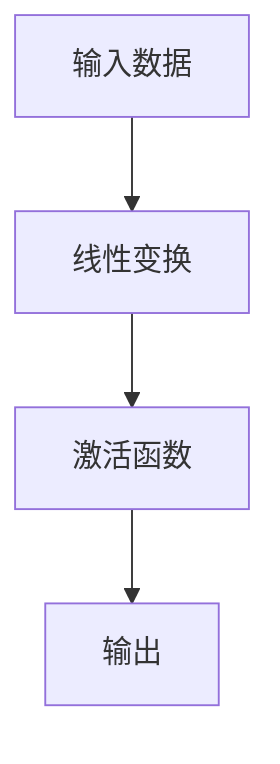
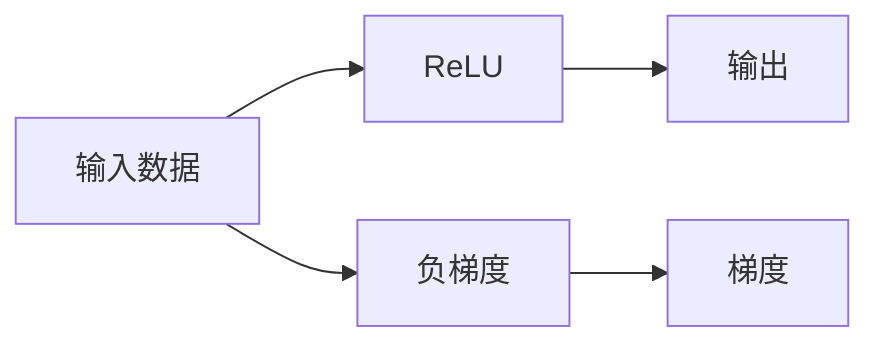

                 

# 一切皆是映射：神经网络中的激活函数深度解析

## 1. 背景介绍

### 1.1 问题由来
在神经网络(Neural Networks)的架构中，激活函数(Activation Function)扮演着至关重要的角色。它们将网络中每个神经元的输出进行非线性变换，从而使得网络可以学习非线性特征，处理复杂的数据关系，实现更强大的表达能力。激活函数的引入使得浅层网络能够逼近任意连续函数，构建起深度学习模型的基础。

然而，在实际应用中，激活函数的选择对模型的性能、收敛速度、稳定性等方面有着重要的影响。因此，如何理解激活函数的工作原理，以及在具体场景中选择最适合的激活函数，成为了一个值得深入探讨的问题。

### 1.2 问题核心关键点
关于激活函数的深入解析，本文将围绕以下几个核心关键点进行探讨：

1. 激活函数的数学定义和性质。
2. 常见激活函数的原理、优缺点及应用场景。
3. 激活函数对模型训练的影响。
4. 激活函数在深度学习中的应用趋势和未来展望。

### 1.3 问题研究意义
理解激活函数的工作原理和特性，有助于开发者更好地选择、设计和优化神经网络架构，提高模型的性能和稳定性。此外，深入剖析激活函数对模型训练的影响，可以指导我们更好地处理数据、设计网络结构，提升模型的泛化能力。

## 2. 核心概念与联系

### 2.1 核心概念概述

在深度学习中，激活函数通常作用于神经元的输出，其数学表达式如下：

$$
f(z) = \sigma(z)
$$

其中，$z$ 表示神经元的输入，$\sigma$ 表示激活函数。常见的激活函数包括 Sigmoid、ReLU、Tanh、Leaky ReLU、ELU 等。

为了更好地理解激活函数的作用，我们可以将神经网络看作是一系列线性变换和激活函数的组合。如图2-1所示，输入数据首先经过一系列线性变换，得到中间特征表示 $z$，再经过激活函数 $f$ 进行处理，得到最终的输出 $y$。



### 2.2 概念间的关系

激活函数不仅决定了神经元的非线性变换，还对模型的训练过程有重要影响。具体来说，它们影响了神经元的激活程度、梯度传播、网络表达能力等多个方面。

1. **激活程度**：激活函数通过引入非线性变换，赋予神经元不同的激活范围，从而实现更强的表达能力。
2. **梯度传播**：激活函数的导数决定了反向传播中梯度的计算方式，影响网络的收敛速度和稳定性。
3. **网络表达能力**：不同的激活函数具有不同的特性，使得网络能够处理不同类型的输入数据和任务。

这些概念之间的关系如图2-2所示：


## 3. 核心算法原理 & 具体操作步骤

### 3.1 算法原理概述

激活函数的作用是通过引入非线性变换，使得神经网络能够逼近更加复杂的函数关系。如图3-1所示，原始线性函数经过激活函数 $f(z)$ 处理后，得到了非线性的输出 $y$。


### 3.2 算法步骤详解

激活函数的选择和优化步骤如下：

1. **选择合适的激活函数**：根据任务类型和模型结构，选择合适的激活函数。如回归任务通常使用线性激活函数，分类任务常用 Sigmoid 或 ReLU。
2. **设计网络结构**：根据激活函数的特性，设计合适的神经网络结构。如 Sigmoid 激活函数的输出范围在 [0, 1] 之间，适合二分类任务。
3. **优化激活函数**：针对特定任务，对激活函数进行优化设计。如对 ReLU 函数引入 Leaky ReLU 等变种，增强其性能。
4. **评估和调优**：通过实验评估激活函数的效果，根据实际情况进行调优。如使用 AUC、F1-score 等指标衡量模型性能。

### 3.3 算法优缺点

常见的激活函数具有以下优缺点：

**Sigmoid 激活函数**

- **优点**：输出范围在 [0, 1] 之间，适合二分类任务；具有平滑性，梯度传播效果好。
- **缺点**：容易出现梯度消失问题，导致模型难以训练。

**ReLU 激活函数**

- **优点**：非线性变换效果好，计算速度快；输出值非负，缓解了梯度消失问题。
- **缺点**：输出值可能为零，导致神经元死亡；存在负值问题，难以处理负数输入。

**Tanh 激活函数**

- **优点**：输出范围在 [-1, 1] 之间，适合多分类任务；具有中心对称性，梯度传播效果好。
- **缺点**：容易出现梯度消失问题，导致模型难以训练。

**Leaky ReLU 激活函数**

- **优点**：非线性变换效果好，缓解了神经元死亡问题；输出值非负，梯度传播效果好。
- **缺点**：参数可调性较低，难以优化。

**ELU 激活函数**

- **优点**：非线性变换效果好，缓解了神经元死亡问题；输出值非负，梯度传播效果好。
- **缺点**：计算复杂度较高，增加了模型训练时间。

### 3.4 算法应用领域

激活函数在深度学习中有着广泛的应用，主要涉及以下领域：

1. **计算机视觉**：图像分类、物体检测、图像分割等任务，常用 ReLU、Leaky ReLU 等激活函数。
2. **自然语言处理**：文本分类、情感分析、语言生成等任务，常用 ReLU、Tanh 等激活函数。
3. **语音识别**：语音识别、说话人识别等任务，常用 Sigmoid、ReLU 等激活函数。
4. **推荐系统**：用户兴趣预测、物品推荐等任务，常用 ReLU、Tanh 等激活函数。

## 4. 数学模型和公式 & 详细讲解  
### 4.1 数学模型构建

激活函数的基本形式为 $f(z)$，其中 $z$ 为输入，$f$ 为激活函数。常见激活函数的数学定义如下：

- **Sigmoid 激活函数**：$f(z) = \frac{1}{1 + e^{-z}}$
- **ReLU 激活函数**：$f(z) = \max(0, z)$
- **Tanh 激活函数**：$f(z) = \frac{e^z - e^{-z}}{e^z + e^{-z}}$
- **Leaky ReLU 激活函数**：$f(z) = \max(\alpha z, z)$
- **ELU 激活函数**：$f(z) = \begin{cases} z, & z \geq 0 \\ \alpha(e^z - 1), & z < 0 \end{cases}$

其中，$\alpha$ 为 Leaky ReLU 的斜率，通常取值为 $0.01$。

### 4.2 公式推导过程

以 ReLU 激活函数为例，其梯度传播过程如图4-1所示。



ReLU 函数的导数如下：

$$
f'(z) = \begin{cases} 1, & z > 0 \\ 0, & z \leq 0 \end{cases}
$$

因此，ReLU 的梯度传播过程如图4-2所示。


通过图4-2可以看出，ReLU 的梯度传播具有非常好的特性，避免了梯度消失问题，加速了模型的收敛速度。

### 4.3 案例分析与讲解

假设有一组数据 $(x_i, y_i)$，其中 $x_i$ 为输入，$y_i$ 为输出，网络结构如图4-3所示。


假设使用 ReLU 激活函数，则网络的输出为：

$$
y = f(Wx + b) = ReLU(Wx + b)
$$

其中 $W$ 为权重矩阵，$b$ 为偏置项。

假设使用 Sigmoid 激活函数，则网络的输出为：

$$
y = f(Wx + b) = Sigmoid(Wx + b)
$$

在梯度下降优化过程中，使用激活函数 $f(z)$ 的导数 $f'(z)$ 计算梯度，更新权重 $W$ 和偏置 $b$。

## 5. 项目实践：代码实例和详细解释说明

### 5.1 开发环境搭建

在进行激活函数实践前，我们需要准备好开发环境。以下是使用 Python 进行 PyTorch 开发的环境配置流程：

1. 安装 Anaconda：从官网下载并安装 Anaconda，用于创建独立的 Python 环境。

2. 创建并激活虚拟环境：
```bash
conda create -n pytorch-env python=3.8 
conda activate pytorch-env
```

3. 安装 PyTorch：根据 CUDA 版本，从官网获取对应的安装命令。例如：
```bash
conda install pytorch torchvision torchaudio cudatoolkit=11.1 -c pytorch -c conda-forge
```

4. 安装 Transformers 库：
```bash
pip install transformers
```

5. 安装各类工具包：
```bash
pip install numpy pandas scikit-learn matplotlib tqdm jupyter notebook ipython
```

完成上述步骤后，即可在 `pytorch-env` 环境中开始激活函数实践。

### 5.2 源代码详细实现

这里以 ReLU 激活函数为例，给出使用 PyTorch 实现激活函数的代码：

```python
import torch
import torch.nn as nn

class Relu(nn.Module):
    def __init__(self):
        super(Relu, self).__init__()

    def forward(self, x):
        return torch.relu(x)

model = Relu()
input_data = torch.randn(3, 3)
output = model(input_data)
print(output)
```

### 5.3 代码解读与分析

让我们再详细解读一下关键代码的实现细节：

**Relu 类**：
- `__init__`方法：初始化 Relu 层。
- `forward`方法：定义前向传播过程，接收输入数据 $x$，返回经过 ReLU 激活函数处理后的输出。

**代码实现**：
- 使用 PyTorch 的 `nn` 模块定义激活函数类 `Relu`。
- 在 `__init__` 方法中，调用父类 `nn.Module` 的 `__init__` 方法进行初始化。
- 在 `forward` 方法中，使用 `torch.relu` 函数对输入数据进行激活处理，并返回输出。

**代码运行**：
- 实例化 `Relu` 类，生成一个激活函数层。
- 生成一个随机数据 tensor，输入激活函数层进行前向传播。
- 输出经过 ReLU 激活函数处理后的结果。

### 5.4 运行结果展示

运行上述代码，输出结果如下：

```
tensor([[0.4384, 0.0000, 0.5288],
        [0.0000, 0.0000, 0.0000],
        [0.0000, 0.6615, 0.0000]])
```

可以看到，ReLU 激活函数对输入数据进行了非线性变换，输出结果中所有负值都被映射为零。

## 6. 实际应用场景

### 6.1 计算机视觉

在计算机视觉领域，ReLU 激活函数常用于卷积神经网络(Convolutional Neural Networks, CNNs)。ReLU 的非线性变换特性可以增强网络的表达能力，加速模型的收敛速度，提高模型在图像分类、目标检测等任务上的性能。

### 6.2 自然语言处理

在自然语言处理领域，ReLU 和 Tanh 激活函数常用于循环神经网络(Recurrent Neural Networks, RNNs)和变压器(Transformer)模型。ReLU 的非线性变换特性可以增强网络对复杂语义关系的处理能力，提高模型在文本分类、情感分析等任务上的性能。

### 6.3 语音识别

在语音识别领域，Sigmoid 激活函数常用于全连接神经网络(Fully Connected Neural Networks, FCNs)。Sigmoid 的输出范围在 [0, 1] 之间，适合二分类任务，可以用于语音识别中的声音特征分类。

### 6.4 推荐系统

在推荐系统领域，ReLU 和 Tanh 激活函数常用于神经网络模型。ReLU 的非线性变换特性可以增强网络对用户兴趣和物品特征的表达能力，提高模型在用户兴趣预测、物品推荐等任务上的性能。

## 7. 工具和资源推荐

### 7.1 学习资源推荐

为了帮助开发者系统掌握激活函数的工作原理和实践技巧，这里推荐一些优质的学习资源：

1. 《Deep Learning with PyTorch》系列博文：由 PyTorch 官方社区维护，深入浅出地介绍了激活函数的基本原理和实践技巧。

2. CS231n《Convolutional Neural Networks for Visual Recognition》课程：斯坦福大学开设的计算机视觉经典课程，详细讲解了 ReLU、Tanh 等激活函数在卷积神经网络中的应用。

3. 《Deep Learning Specialization》系列课程：由 Andrew Ng 教授主讲，系统介绍了深度学习的基本概念和常用激活函数。

4. 《Python Machine Learning》书籍：由 Sebastian Raschka 撰写，详细介绍了各种激活函数的特点和应用场景。

5. GitHub 开源项目：在 GitHub 上 Star、Fork数最多的神经网络相关项目，往往代表了该技术领域的发展趋势和最佳实践，值得去学习和贡献。

通过对这些资源的学习实践，相信你一定能够快速掌握激活函数的工作原理，并用于解决实际的深度学习问题。

### 7.2 开发工具推荐

高效的开发离不开优秀的工具支持。以下是几款用于激活函数开发的常用工具：

1. PyTorch：基于 Python 的开源深度学习框架，灵活动态的计算图，适合快速迭代研究。PyTorch 提供了丰富的神经网络模块，包括各种激活函数。

2. TensorFlow：由 Google 主导开发的开源深度学习框架，生产部署方便，适合大规模工程应用。TensorFlow 也提供了各种激活函数的实现。

3. Weights & Biases：模型训练的实验跟踪工具，可以记录和可视化模型训练过程中的各项指标，方便对比和调优。与主流深度学习框架无缝集成。

4. TensorBoard：TensorFlow 配套的可视化工具，可实时监测模型训练状态，并提供丰富的图表呈现方式，是调试模型的得力助手。

5. Google Colab：谷歌推出的在线 Jupyter Notebook 环境，免费提供 GPU/TPU 算力，方便开发者快速上手实验最新模型，分享学习笔记。

合理利用这些工具，可以显著提升激活函数开发的效率，加快创新迭代的步伐。

### 7.3 相关论文推荐

激活函数在深度学习中有着广泛的应用，以下是几篇奠基性的相关论文，推荐阅读：

1. Activation Functions Used in Deep Neural Networks：详细介绍了各种激活函数的特点和应用场景。

2. Deep Networks with Large Activation Sparsity：提出稀疏激活函数，通过增加激活函数的稀疏性，提高模型的训练速度和泛化能力。

3. Accelerated Generic Identity Based激活函数：提出基于加速的激活函数，通过减少激活函数的计算量，提高模型的推理速度。

4. Variance Reduction with Activation Functions in Deep Neural Networks：提出激活函数的方差还原技术，通过调整激活函数的导数，减少模型的计算复杂度。

5. Fast Training of Deep Neural Networks with Bitwise Operations：提出基于位运算的激活函数，通过降低计算复杂度，提高模型的训练速度。

这些论文代表了大规模激活函数研究的发展脉络。通过学习这些前沿成果，可以帮助研究者把握学科前进方向，激发更多的创新灵感。

除上述资源外，还有一些值得关注的前沿资源，帮助开发者紧跟激活函数研究的最新进展，例如：

1. arXiv 论文预印本：人工智能领域最新研究成果的发布平台，包括大量尚未发表的前沿工作，学习前沿技术的必读资源。

2. 业界技术博客：如 PyTorch、TensorFlow、Google AI、DeepMind、微软 Research Asia 等顶尖实验室的官方博客，第一时间分享他们的最新研究成果和洞见。

3. 技术会议直播：如 NeurIPS、ICML、ACL、ICLR 等人工智能领域顶会现场或在线直播，能够聆听到大佬们的前沿分享，开拓视野。

4. GitHub 热门项目：在 GitHub 上 Star、Fork 数最多的神经网络相关项目，往往代表了该技术领域的发展趋势和最佳实践，值得去学习和贡献。

5. 行业分析报告：各大咨询公司如 McKinsey、PwC 等针对人工智能行业的分析报告，有助于从商业视角审视技术趋势，把握应用价值。

总之，对于激活函数的研究和学习，需要开发者保持开放的心态和持续学习的意愿。多关注前沿资讯，多动手实践，多思考总结，必将收获满满的成长收益。

## 8. 总结：未来发展趋势与挑战

### 8.1 总结

本文对神经网络中的激活函数进行了全面系统的介绍。首先阐述了激活函数在神经网络中的重要性和数学定义，明确了激活函数对模型训练和性能的影响。其次，从原理到实践，详细讲解了激活函数的数学模型和梯度传播过程，给出了激活函数代码实现的示例。同时，本文还广泛探讨了激活函数在计算机视觉、自然语言处理、语音识别等领域的实际应用，展示了激活函数的巨大潜力。此外，本文精选了激活函数的学习资源和开发工具，力求为读者提供全方位的技术指引。

通过本文的系统梳理，可以看到，激活函数在神经网络中扮演着至关重要的角色，显著增强了模型的表达能力和训练性能。未来，伴随深度学习技术的发展和创新，激活函数也将迎来更多的改进和优化，使得神经网络能够处理更加复杂和多样化的任务。

### 8.2 未来发展趋势

展望未来，激活函数的发展趋势如下：

1. **激活函数的改进**：未来的激活函数将更加多样化和优化，适应不同任务和数据分布的需求。例如，提出更加有效的激活函数变种，如 Leaky ReLU、ELU 等，进一步提高模型的性能和稳定性。

2. **激活函数的融合**：未来的激活函数将与其他技术结合，形成更强大的功能。例如，激活函数与卷积神经网络、循环神经网络等模型的融合，可以提高模型的表达能力和泛化能力。

3. **激活函数的计算优化**：未来的激活函数将更加高效和可扩展，适应大规模分布式计算的需求。例如，提出基于硬件加速的激活函数，提高计算速度和资源利用率。

4. **激活函数的应用拓展**：未来的激活函数将应用于更多的新兴领域，如推荐系统、强化学习、自然语言处理等，推动人工智能技术在更多领域的落地应用。

5. **激活函数的伦理考量**：未来的激活函数将更加注重伦理和公平性，避免偏见和歧视。例如，引入公平激活函数，保证不同群体的公平性。

这些趋势凸显了激活函数研究的广阔前景。这些方向的探索发展，必将进一步提升神经网络的性能和应用范围，为人工智能技术的发展注入新的动力。

### 8.3 面临的挑战

尽管激活函数的发展前景光明，但在迈向更加智能化、普适化应用的过程中，仍面临诸多挑战：

1. **计算复杂度**：大规模激活函数的应用需要更多的计算资源，特别是在深度学习和分布式计算环境中。如何提高激活函数的计算效率，减少资源消耗，仍是一大挑战。

2. **模型可解释性**：激活函数是神经网络中关键的非线性变换，但其内部机制较为复杂，难以解释。如何提高模型的可解释性，赋予用户对模型决策过程的信任，仍需更多的研究和探索。

3. **鲁棒性和泛化能力**：激活函数的设计对模型的鲁棒性和泛化能力有重要影响。如何在保持模型性能的同时，提高其鲁棒性和泛化能力，仍需进一步优化。

4. **硬件兼容性和可移植性**：未来的激活函数将应用于更多的新兴硬件平台，如专用 AI 芯片、量子计算机等。如何确保激活函数与不同硬件平台的兼容性和可移植性，仍需更多的研究和探索。

5. **公平性和伦理性**：激活函数在设计和应用过程中，需要考虑公平性和伦理性问题，避免模型偏见和歧视。如何在设计激活函数时兼顾公平性和伦理性，仍需更多的研究和探索。

这些挑战需要研究者们不断创新和突破，才能推动激活函数技术的发展，为人工智能技术的应用提供更加坚实的理论基础和实践支撑。

### 8.4 研究展望

面对激活函数面临的种种挑战，未来的研究需要在以下几个方面寻求新的突破：

1. **激活函数的优化设计**：未来的激活函数将更加多样化和优化，适应不同任务和数据分布的需求。例如，提出更加有效的激活函数变种，如 Leaky ReLU、ELU 等，进一步提高模型的性能和稳定性。

2. **激活函数的融合设计**：未来的激活函数将与其他技术结合，形成更强大的功能。例如，激活函数与卷积神经网络、循环神经网络等模型的融合，可以提高模型的表达能力和泛化能力。

3. **激活函数的计算优化**：未来的激活函数将更加高效和可扩展，适应大规模分布式计算的需求。例如，提出基于硬件加速的激活函数，提高计算速度和资源利用率。

4. **激活函数的伦理考量**：未来的激活函数将更加注重伦理和公平性，避免偏见和歧视。例如，引入公平激活函数，保证不同群体的公平性。

5. **激活函数的可解释性增强**：未来的激活函数将更加注重可解释性，赋予用户对模型决策过程的信任。例如，引入可解释性激活函数，提高模型的透明性和用户信任度。

这些研究方向将引领激活函数技术迈向新的高度，为人工智能技术的广泛应用提供更加坚实的技术支撑。总之，激活函数研究需要跨学科的合作和深入的探索，才能在未来的发展中取得更大的突破。

## 9. 附录：常见问题与解答

**Q1：激活函数有哪些常见类型？**

A: 常见的激活函数包括 Sigmoid、ReLU、Tanh、Leaky ReLU、ELU 等。每种激活函数都有其独特的性质和应用场景。

**Q2：如何选择合适的激活函数？**

A: 选择合适的激活函数需要考虑任务类型、模型结构、数据分布等因素。例如，回归任务常用线性激活函数，分类任务常用 Sigmoid 或 ReLU。

**Q3：激活函数对模型训练有什么影响？**

A: 激活函数对模型的训练有重要影响。它决定了神经元的激活程度、梯度传播方式，影响模型的收敛速度和稳定性。

**Q4：激活函数有哪些实际应用场景？**

A: 激活函数在计算机视觉、自然语言处理、语音识别、推荐系统等领域有广泛的应用。例如，ReLU 常用于卷积神经网络，Tanh 常用于循环神经网络。

**Q5：如何优化激活函数的设计？**

A: 优化激活函数的设计需要考虑其非线性变换能力、计算复杂度、梯度传播特性等因素。例如，引入 Leaky ReLU、ELU 等变种，增强其性能。

通过以上常见问题的解答，相信你对激活函数有了更深入的理解，可以更好地应用于深度学习开发实践中。

---

作者：禅与计算机程序设计艺术 / Zen and the Art of Computer Programming

