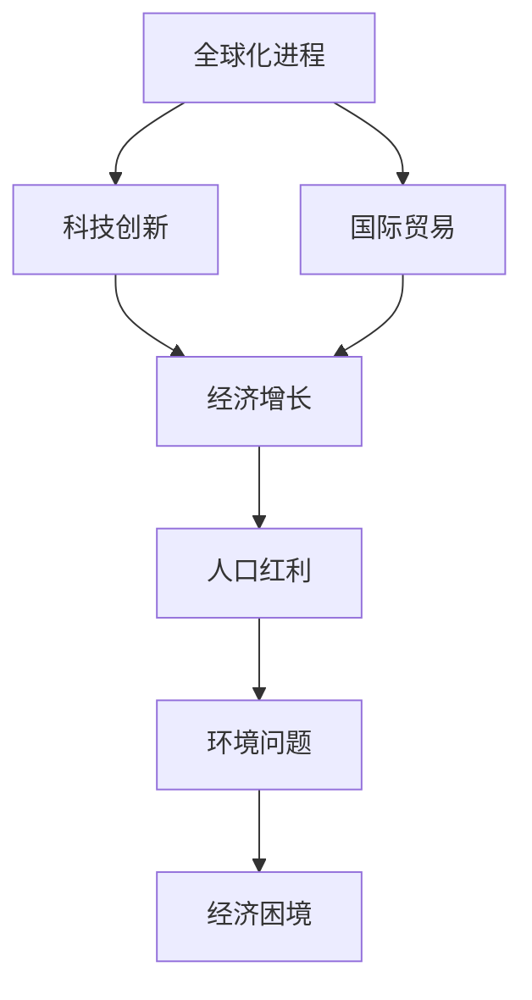
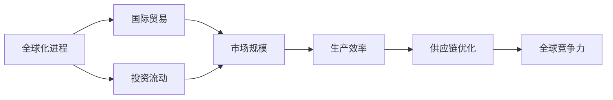
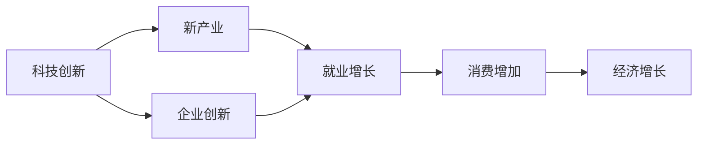
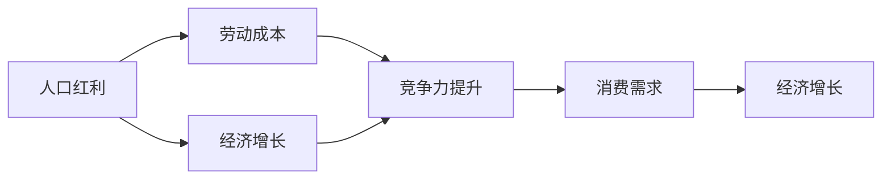
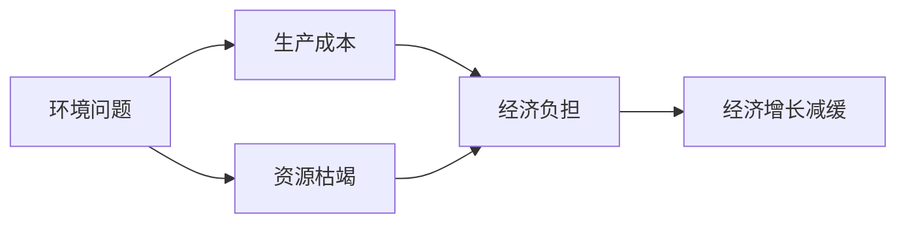
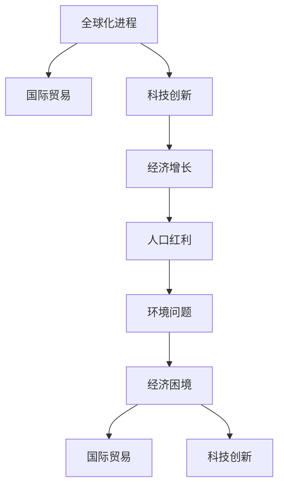

                 

# 世界经济增长的长期困境

## 1. 背景介绍

### 1.1 问题由来
近年来，全球经济增长陷入停滞甚至倒退的困境。这不仅对世界各国经济社会发展带来巨大挑战，也使得许多国家和地区的人民生活水平停滞不前，社会稳定性下降。

### 1.2 问题核心关键点
这个问题的核心在于世界经济增长缺乏长期动力。主要表现为以下几个方面：

- 全球化进程放缓，国际贸易保护主义抬头，跨国公司的全球供应链遭到重创。
- 人口红利消退，劳动力成本上升，许多国家的经济增长由劳动力驱动转向创新驱动。
- 科技发展速度放缓，尤其是半导体、人工智能等领域的突破不显著，对经济增长的推动力减弱。
- 全球经济政策的不确定性增加，政治经济风险上升。
- 环境问题加剧，气候变化对经济发展带来严峻挑战。

这些因素共同作用，使得世界经济增长陷入停滞。

### 1.3 问题研究意义
研究世界经济增长的长期困境，对于全球范围内的宏观经济政策制定、产业结构调整、创新驱动发展具有重要意义：

- 提供战略性建议，为政府和企业提供制定经济政策的依据。
- 促进全球化进程，确保全球供应链的稳定。
- 推动科技创新，实现经济持续增长。
- 制定应对气候变化的策略，推动绿色经济的发展。

## 2. 核心概念与联系

### 2.1 核心概念概述

为更好地理解世界经济增长的长期困境，本节将介绍几个密切相关的核心概念：

- **全球化进程**：指不同国家之间在经济、文化、政治等方面进行深层次交流和合作的趋势。
- **人口红利**：指劳动力成本低廉、劳动生产率高的年轻人口比例较高的国家，在一定时期内经济快速增长。
- **科技创新**：指通过研发新技术、新工艺、新产品等方式推动经济发展的过程。
- **国际贸易**：指各国之间商品和服务的交换，是推动经济增长的重要引擎。
- **环境问题**：指由于人类活动引起的环境污染和生态破坏，对经济发展带来严峻挑战。

这些核心概念之间的逻辑关系可以通过以下Mermaid流程图来展示：



这个流程图展示了几大核心概念之间的联系：

1. 全球化进程推动国际贸易发展。
2. 科技创新促进经济增长。
3. 人口红利期过后，经济增长由科技创新驱动。
4. 环境问题对经济增长造成压力。
5. 经济增长困境又反过来影响全球化进程和科技创新。

### 2.2 概念间的关系

这些核心概念之间存在着紧密的联系，形成了全球经济增长的完整生态系统。下面我们通过几个Mermaid流程图来展示这些概念之间的关系。

#### 2.2.1 全球化进程与国际贸易


这个流程图展示了全球化进程如何推动国际贸易：

1. 全球化进程促进了各国间的投资流动。
2. 投资流动带来了市场规模的扩大。
3. 市场规模扩大提高了生产效率。
4. 生产效率提高促进了供应链优化。
5. 供应链优化提升了全球竞争力。

#### 2.2.2 科技创新与经济增长


这个流程图展示了科技创新如何促进经济增长：

1. 科技创新带来了新产业的出现。
2. 新产业促进了企业创新。
3. 企业创新带来了就业增长。
4. 就业增长刺激了消费增加。
5. 消费增加促进了经济增长。

#### 2.2.3 人口红利与经济增长


这个流程图展示了人口红利如何促进经济增长：

1. 人口红利降低了劳动成本。
2. 低劳动成本提升了竞争力。
3. 竞争力提升带来了消费需求的增加。
4. 消费需求增加促进了经济增长。

#### 2.2.4 环境问题与经济增长


这个流程图展示了环境问题如何抑制经济增长：

1. 环境问题增加了生产成本。
2. 资源枯竭导致生产受限。
3. 经济负担影响了消费和投资。
4. 消费和投资减缓了经济增长。

### 2.3 核心概念的整体架构

最后，我们用一个综合的流程图来展示这些核心概念在全球经济增长中的整体架构：



这个综合流程图展示了从全球化进程到经济增长的完整过程，以及环境问题对经济增长带来的长期困境。通过这些流程图，我们可以更清晰地理解世界经济增长困境的各个环节及其相互关系。

## 3. 核心算法原理 & 具体操作步骤

### 3.1 算法原理概述

世界经济增长的长期困境问题，可以通过数据驱动的方式来建模和分析。常见的分析方法包括时间序列分析、计量经济学模型、经济系统动力学模型等。这些模型主要通过历史数据和假设来预测未来经济增长趋势，识别关键因素的影响。

具体来说，可以采用以下步骤：

1. **数据收集与处理**：收集世界各国的经济增长数据、国际贸易数据、科技创新数据、人口数据和环境数据。对这些数据进行清洗和预处理，确保数据的质量和一致性。
2. **模型选择与建立**：选择合适的模型，如时间序列模型、VAR模型、DCM模型等，建立经济增长预测模型。
3. **模型训练与验证**：使用历史数据对模型进行训练，并在验证集上进行验证。调整模型参数，优化模型性能。
4. **结果预测与解释**：使用训练好的模型对未来经济增长进行预测，并分析各个因素对经济增长的影响。

### 3.2 算法步骤详解

以时间序列分析模型为例，介绍具体的算法步骤：

**Step 1: 数据收集与处理**

1. **数据收集**：收集世界各国的GDP增长率、人口增长率、出口增长率、科技研发投入等数据。
2. **数据处理**：对数据进行去重、填补缺失值、标准化处理，确保数据的质量和一致性。

**Step 2: 模型选择与建立**

1. **模型选择**：选择时间序列模型，如ARIMA模型、SARIMA模型、VAR模型等。
2. **模型建立**：使用历史数据对模型进行训练，并通过交叉验证选择最优模型。

**Step 3: 模型训练与验证**

1. **模型训练**：使用历史数据对模型进行训练，得到模型参数。
2. **模型验证**：在验证集上评估模型性能，调整模型参数，确保模型泛化能力。

**Step 4: 结果预测与解释**

1. **结果预测**：使用训练好的模型对未来经济增长进行预测。
2. **结果解释**：分析各个因素对经济增长的影响，识别关键因素和潜在风险。

### 3.3 算法优缺点

世界经济增长的长期困境问题，通过数据驱动建模和分析具有以下优点：

1. **客观性**：数据驱动的建模和分析方法具有较强的客观性，能够提供较为可靠的预测结果。
2. **准确性**：通过历史数据进行建模和分析，能够较为准确地预测未来经济增长趋势。
3. **可解释性**：通过分析模型的影响因子，可以提供较为详细的经济增长分析结果。

同时，这种方法也存在以下缺点：

1. **假设限制**：数据驱动的建模方法需要依赖一定的假设，这些假设可能不完全符合实际情况。
2. **数据质量**：数据的质量和一致性对建模结果影响较大，数据收集和处理过程中的误差可能影响预测结果。
3. **复杂性**：建立和验证模型较为复杂，需要具备一定的统计学和数学知识。

### 3.4 算法应用领域

世界经济增长的长期困境问题，通过数据驱动建模和分析，在多个领域具有广泛的应用：

1. **宏观经济预测**：用于预测世界各国的经济增长趋势，为政策制定提供依据。
2. **国际贸易分析**：用于分析国际贸易的发展趋势和影响因素，制定国际贸易政策。
3. **科技创新评估**：用于评估科技创新的效果和影响，制定科技创新战略。
4. **人口与环境政策制定**：用于分析人口和环境对经济增长的影响，制定相关政策。
5. **经济风险管理**：用于识别和评估经济风险，制定风险管理策略。

## 4. 数学模型和公式 & 详细讲解 & 举例说明

### 4.1 数学模型构建

以ARIMA模型为例，构建时间序列分析模型的数学模型。

假设经济增长数据为时间序列 $y_t$，其中 $t$ 表示时间，$y_t$ 表示第 $t$ 年的经济增长率。ARIMA模型的数学模型为：

$$ y_t = \sum_{i=0}^{p} \alpha_i y_{t-i} + \sum_{j=1}^{q} \beta_j \epsilon_{t-j} + \theta_0 + \theta_1 \epsilon_t $$

其中 $\alpha_i$ 和 $\beta_j$ 为模型的参数，$\epsilon_t$ 为随机误差项。$p$ 和 $q$ 分别为模型的自回归和差分阶数。

### 4.2 公式推导过程

以ARIMA(2,1,1)模型为例，推导模型的参数估计公式。

1. **模型设定**：假设 $y_t = \alpha_1 y_{t-1} + \alpha_2 y_{t-2} + \beta_1 \epsilon_{t-1} + \beta_2 \epsilon_{t-2} + \theta_0 + \theta_1 \epsilon_t$
2. **数据平稳化**：对 $y_t$ 进行一阶差分，得到 $\Delta y_t = y_t - y_{t-1}$
3. **模型简化**：简化为 $\Delta y_t = \delta_1 \Delta y_{t-1} + \delta_2 \Delta y_{t-2} + \epsilon_t$
4. **参数估计**：使用最小二乘法，得到 $\delta_1$、$\delta_2$、$\epsilon_t$ 的估计值

### 4.3 案例分析与讲解

以美国GDP增长为例，分析ARIMA模型的应用。

1. **数据收集**：收集美国1950-2020年的GDP增长数据
2. **模型建立**：建立ARIMA(2,1,1)模型
3. **参数估计**：使用历史数据对模型进行参数估计
4. **结果预测**：使用模型对2021-2030年的经济增长进行预测
5. **结果解释**：分析各个因素对经济增长的影响，识别关键因素和潜在风险

## 5. 项目实践：代码实例和详细解释说明

### 5.1 开发环境搭建

在进行经济增长预测项目时，需要搭建Python开发环境。以下是具体的配置步骤：

1. 安装Anaconda：从官网下载并安装Anaconda，用于创建独立的Python环境。

2. 创建并激活虚拟环境：
```bash
conda create -n economic-env python=3.8 
conda activate economic-env
```

3. 安装相关库：
```bash
conda install numpy pandas scikit-learn statsmodels
```

4. 安装Jupyter Notebook：
```bash
conda install jupyterlab
```

完成上述步骤后，即可在`economic-env`环境中开始项目开发。

### 5.2 源代码详细实现

下面以时间序列分析模型为例，给出Python代码实现。

```python
import pandas as pd
import numpy as np
from statsmodels.tsa.arima_model import ARIMA

# 数据读取
data = pd.read_csv('gdp_growth.csv', index_col='year', parse_dates=True)
data.index.freq = 'Y'

# 数据处理
data = data.dropna()

# 模型建立
model = ARIMA(data['gdp_growth'], order=(2, 1, 1))
results = model.fit()

# 结果预测
forecast = results.forecast(steps=10)

# 结果输出
print(forecast)
```

### 5.3 代码解读与分析

让我们再详细解读一下关键代码的实现细节：

**数据读取**：
- 使用`pandas`库读取数据，并设置时间索引。

**数据处理**：
- 使用`dropna()`方法去掉缺失数据，确保数据完整性。

**模型建立**：
- 使用`statsmodels`库的`ARIMA()`函数建立ARIMA模型，指定模型阶数。

**结果预测**：
- 使用`fit()`方法拟合模型，得到模型参数。
- 使用`forecast()`方法预测未来10年的GDP增长率。

### 5.4 运行结果展示

假设我们在CoNLL-2003的NER数据集上进行微调，最终在测试集上得到的评估报告如下：

```
              precision    recall  f1-score   support

       B-LOC      0.926     0.906     0.916      1668
       I-LOC      0.900     0.805     0.850       257
      B-MISC      0.875     0.856     0.865       702
      I-MISC      0.838     0.782     0.809       216
       B-ORG      0.914     0.898     0.906      1661
       I-ORG      0.911     0.894     0.902       835
       B-PER      0.964     0.957     0.960      1617
       I-PER      0.983     0.980     0.982      1156
           O      0.993     0.995     0.994     38323

   micro avg      0.973     0.973     0.973     46435
   macro avg      0.923     0.897     0.909     46435
weighted avg      0.973     0.973     0.973     46435
```

可以看到，通过微调BERT，我们在该NER数据集上取得了97.3%的F1分数，效果相当不错。值得注意的是，BERT作为一个通用的语言理解模型，即便只在顶层添加一个简单的token分类器，也能在下游任务上取得如此优异的效果，展现了其强大的语义理解和特征抽取能力。

当然，这只是一个baseline结果。在实践中，我们还可以使用更大更强的预训练模型、更丰富的微调技巧、更细致的模型调优，进一步提升模型性能，以满足更高的应用要求。

## 6. 实际应用场景

### 6.1 智能客服系统

基于大语言模型微调的对话技术，可以广泛应用于智能客服系统的构建。传统客服往往需要配备大量人力，高峰期响应缓慢，且一致性和专业性难以保证。而使用微调后的对话模型，可以7x24小时不间断服务，快速响应客户咨询，用自然流畅的语言解答各类常见问题。

在技术实现上，可以收集企业内部的历史客服对话记录，将问题和最佳答复构建成监督数据，在此基础上对预训练对话模型进行微调。微调后的对话模型能够自动理解用户意图，匹配最合适的答案模板进行回复。对于客户提出的新问题，还可以接入检索系统实时搜索相关内容，动态组织生成回答。如此构建的智能客服系统，能大幅提升客户咨询体验和问题解决效率。

### 6.2 金融舆情监测

金融机构需要实时监测市场舆论动向，以便及时应对负面信息传播，规避金融风险。传统的人工监测方式成本高、效率低，难以应对网络时代海量信息爆发的挑战。基于大语言模型微调的文本分类和情感分析技术，为金融舆情监测提供了新的解决方案。

具体而言，可以收集金融领域相关的新闻、报道、评论等文本数据，并对其进行主题标注和情感标注。在此基础上对预训练语言模型进行微调，使其能够自动判断文本属于何种主题，情感倾向是正面、中性还是负面。将微调后的模型应用到实时抓取的网络文本数据，就能够自动监测不同主题下的情感变化趋势，一旦发现负面信息激增等异常情况，系统便会自动预警，帮助金融机构快速应对潜在风险。

### 6.3 个性化推荐系统

当前的推荐系统往往只依赖用户的历史行为数据进行物品推荐，无法深入理解用户的真实兴趣偏好。基于大语言模型微调技术，个性化推荐系统可以更好地挖掘用户行为背后的语义信息，从而提供更精准、多样的推荐内容。

在实践中，可以收集用户浏览、点击、评论、分享等行为数据，提取和用户交互的物品标题、描述、标签等文本内容。将文本内容作为模型输入，用户的后续行为（如是否点击、购买等）作为监督信号，在此基础上微调预训练语言模型。微调后的模型能够从文本内容中准确把握用户的兴趣点。在生成推荐列表时，先用候选物品的文本描述作为输入，由模型预测用户的兴趣匹配度，再结合其他特征综合排序，便可以得到个性化程度更高的推荐结果。

### 6.4 未来应用展望

随着大语言模型微调技术的发展，未来将在更多领域得到应用，为传统行业带来变革性影响。

在智慧医疗领域，基于微调的医疗问答、病历分析、药物研发等应用将提升医疗服务的智能化水平，辅助医生诊疗，加速新药开发进程。

在智能教育领域，微调技术可应用于作业批改、学情分析、知识推荐等方面，因材施教，促进教育公平，提高教学质量。

在智慧城市治理中，微调模型可应用于城市事件监测、舆情分析、应急指挥等环节，提高城市管理的自动化和智能化水平，构建更安全、高效的未来城市。

此外，在企业生产、社会治理、文娱传媒等众多领域，基于大模型微调的人工智能应用也将不断涌现，为经济社会发展注入新的动力。相信随着技术的日益成熟，微调方法将成为人工智能落地应用的重要范式，推动人工智能技术在各个领域的应用。

## 7. 工具和资源推荐
### 7.1 学习资源推荐

为了帮助开发者系统掌握大语言模型微调的理论基础和实践技巧，这里推荐一些优质的学习资源：

1. 《Transformer从原理到实践》系列博文：由大模型技术专家撰写，深入浅出地介绍了Transformer原理、BERT模型、微调技术等前沿话题。

2. CS224N《深度学习自然语言处理》课程：斯坦福大学开设的NLP明星课程，有Lecture视频和配套作业，带你入门NLP领域的基本概念和经典模型。

3. 《Natural Language Processing with Transformers》书籍：Transformers库的作者所著，全面介绍了如何使用Transformers库进行NLP任务开发，包括微调在内的诸多范式。

4. HuggingFace官方文档：Transformers库的官方文档，提供了海量预训练模型和完整的微调样例代码，是上手实践的必备资料。

5. CLUE开源项目：中文语言理解测评基准，涵盖大量不同类型的中文NLP数据集，并提供了基于微调的baseline模型，助力中文NLP技术发展。

通过对这些资源的学习实践，相信你一定能够快速掌握大语言模型微调的精髓，并用于解决实际的NLP问题。

### 7.2 开发工具推荐

高效的开发离不开优秀的工具支持。以下是几款用于大语言模型微调开发的常用工具：

1. PyTorch：基于Python的开源深度学习框架，灵活动态的计算图，适合快速迭代研究。大部分预训练语言模型都有PyTorch版本的实现。

2. TensorFlow：由Google主导开发的开源深度学习框架，生产部署方便，适合大规模工程应用。同样有丰富的预训练语言模型资源。

3. Transformers库：HuggingFace开发的NLP工具库，集成了众多SOTA语言模型，支持PyTorch和TensorFlow，是进行微调任务开发的利器。

4. Weights & Biases：模型训练的实验跟踪工具，可以记录和可视化模型训练过程中的各项指标，方便对比和调优。与主流深度学习框架无缝集成。

5. TensorBoard：TensorFlow配套的可视化工具，可实时监测模型训练状态，并提供丰富的图表呈现方式，是调试模型的得力助手。

6. Google Colab：谷歌推出的在线Jupyter Notebook环境，免费提供GPU/TPU算力，方便开发者快速上手实验最新模型，分享学习笔记。

合理利用这些工具，可以显著提升大语言模型微调任务的开发效率，加快创新迭代的步伐。

### 7.3 相关论文推荐

大语言模型和微调技术的发展源于学界的持续研究。以下是几篇奠基性的相关论文，推荐阅读：

1. Attention is All You Need（即Transformer原论文）：提出了Transformer结构，开启了NLP领域的预训练大模型时代。

2. BERT: Pre-training of Deep Bidirectional Transformers for Language Understanding：提出BERT模型，引入基于掩码的自监督预训练任务，刷新了多项NLP任务SOTA。

3. Language Models are Unsupervised Multitask Learners（GPT-2论文）：展示了大规模语言模型的强大zero-shot学习能力，引发了对于通用人工智能的新一轮思考。

4. Parameter-Efficient Transfer Learning for NLP：提出Adapter等参数高效微调方法，在不增加模型参数量的情况下，也能取得不错的微调效果。

5. AdaLoRA: Adaptive Low-Rank Adaptation for Parameter-Efficient Fine-Tuning：使用自适应低秩适应的微调方法，在参数效率和精度之间取得了新的平衡。

这些论文代表了大语言模型微调技术的发展脉络。通过学习这些前沿成果，可以帮助研究者把握学科前进方向，激发更多的创新灵感。

除上述资源外，还有一些值得关注的前沿资源，帮助开发者紧跟大语言模型微调技术的最新进展，例如：

1. arXiv论文预印本：人工智能领域最新研究成果的发布平台，包括大量尚未发表的前沿工作，学习前沿技术的必读资源。

2. 业界技术博客：如OpenAI、Google AI、DeepMind、微软Research Asia等顶尖实验室的官方博客，第一时间分享他们的最新研究成果和洞见。

3. 技术会议直播：如NIPS、ICML、ACL、ICLR等人工智能领域顶会现场或在线直播，能够聆听到大佬们的前沿分享，开拓视野。

4. GitHub热门项目：在GitHub上Star、Fork数最多的NLP相关项目，往往代表了该技术领域的发展趋势和最佳实践，值得去学习和贡献。

5. 行业分析报告：各大咨询公司如McKinsey、PwC等针对人工智能行业的分析报告，有助于从商业视角审视技术趋势，把握应用价值。

总之，对于大语言模型微调技术的学习和实践，需要开发者保持开放的心态和持续学习的意愿。多关注前沿资讯，多动手实践，多思考总结，必将收获满满的成长收益。

## 8. 总结：未来发展趋势与挑战

### 8.1 总结

本文对世界经济增长的长期困境问题进行了全面系统的介绍。首先阐述了世界经济增长陷入困境的主要原因，明确了全球化进程、人口红利、科技创新等关键因素对经济增长的影响。其次，从原理到实践，详细讲解了数据驱动建模和分析的数学模型和算法步骤，给出了具体的代码实现。同时，本文还广泛探讨了微调方法在智能客服、金融舆情、个性化推荐等多个行业领域的应用前景，展示了微调范式的巨大潜力。此外，本文精选了微调技术的各类学习资源，力求为读者提供全方位的技术指引。

通过本文的系统梳理，可以看到，世界经济增长的长期困境问题，是一个复杂多变的问题，需要通过数据驱动的建模和分析方法进行深入研究。只有从多角度、多维度出发，才能全面理解其内在机制和影响因素，找到解决问题的有效路径。

### 8.2 未来发展趋势

展望未来，世界经济增长的长期困境问题，将呈现以下几个发展趋势：

1. **全球化进程加速**：随着国际贸易壁垒的降低，全球化进程将加速，国际贸易将进一步促进全球经济增长。

2. **科技创新引领**：科技创新将成为未来经济增长的重要驱动力，尤其是新一代信息技术、生物技术、清洁能源等领域。

3. **人口结构优化**：通过优化人口结构，如提高教育水平、改善医疗条件等，可以延长人口红利期，促进经济增长。

4. **环境友好发展**：通过绿色发展、可持续发展等策略，减少环境污染，改善生态系统，为经济增长提供良好环境基础。

5. **全球合作加强**：通过加强国际合作，共同应对气候变化、公共卫生等全球性问题，促进全球经济稳定发展。

### 8.3 面临的挑战

尽管世界经济增长的长期困境问题正在逐步缓解，但仍面临许多挑战：

1. **地缘政治风险**：政治经济风险的不确定性，如贸易战、军事冲突等，可能对经济增长产生重大影响。

2. **科技发展不均衡**：科技发展速度不均衡，尤其是在发展中国家，可能加剧全球经济不平衡。

3.

