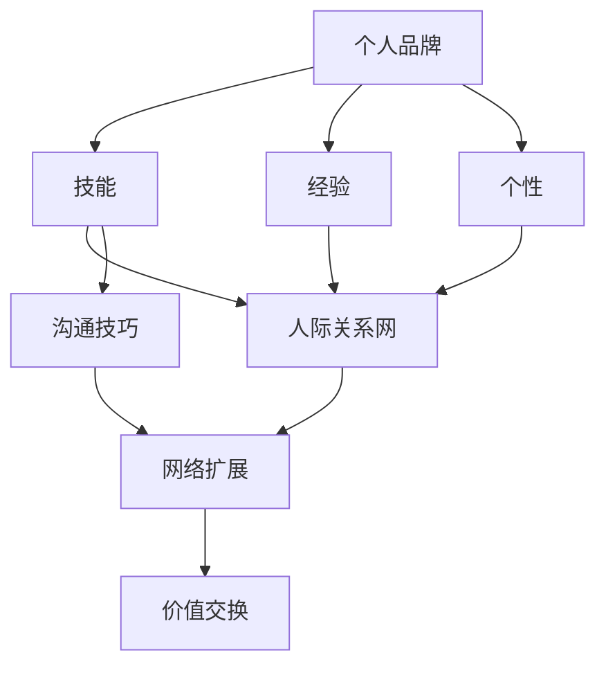
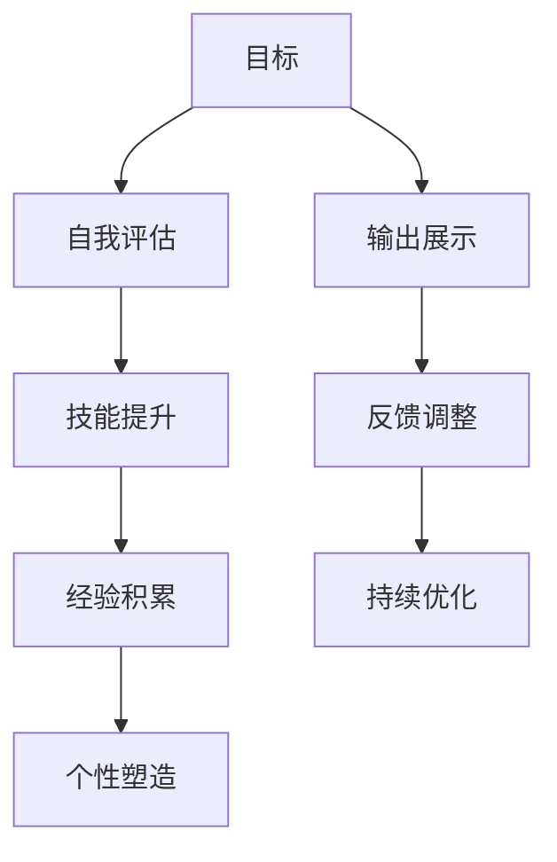
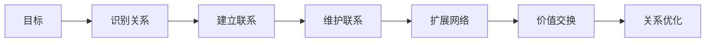
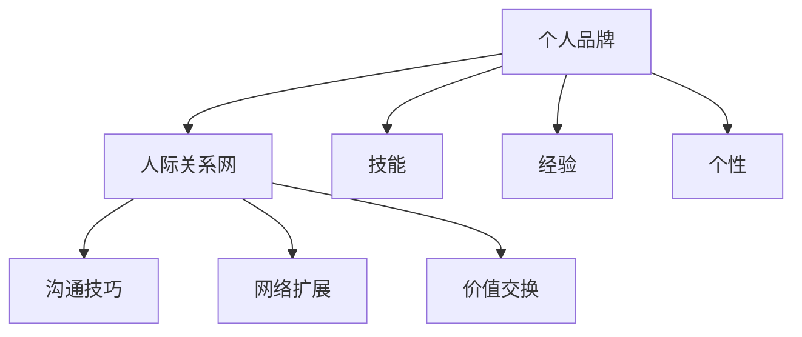

                 

# 个人品牌和人际关系网：将你与他人区分开来的诸多特征，例如技能、经验、个性等

## 1. 背景介绍

### 1.1 问题由来
在现代社会中，人与人之间的交往越来越频繁，但如何让自己的个人品牌脱颖而出，从而在职场、社交等方面获得优势，是一个重要且复杂的问题。个人品牌不仅反映了个人的技能、经验和个性，还涉及到如何利用这些特征在人际关系网中构建影响力、展示自身价值。本文将从多个角度，系统探讨如何构建个人品牌和建立良好的人际关系网，以期为读者提供全面的指导。

### 1.2 问题核心关键点
1. **个人品牌**：指个人在职业、社交等多个领域的独特标识和形象。它包含了一系列特征，如技能、经验、个性、价值观等，这些特征共同塑造了个人在他人眼中的形象和印象。
2. **人际关系网**：指个人与外界建立的联系和互动网络。它包括家庭、朋友、同事、合作伙伴等多种关系，这些关系对个人的职业发展、生活质量等有着重要影响。
3. **个人品牌构建**：涉及如何在职场、社交等环境中，通过有意识地展示自身特征，打造独特且具有吸引力的个人形象。
4. **人际关系网维护**：包括如何有效管理、扩展和维护与各类人的关系，以实现个人价值最大化。
5. **技能提升**：个人品牌和人际关系网构建的基础，涉及持续学习和提升职业技能。
6. **沟通技巧**：在人际交往中，如何通过良好的沟通技巧来建立信任、展现专业素养。

### 1.3 问题研究意义
构建个人品牌和维护良好的人际关系网，对于职业发展、人际关系、个人成长等方面具有重要意义：

1. **职业发展**：个人品牌和人际关系网是求职、升职、转型等职业发展活动的重要助力，帮助个人在职场竞争中脱颖而出。
2. **人际关系**：良好的人际关系网可以提供情感支持、信息分享、合作机会等，提升生活质量。
3. **个人成长**：在不断学习和提升个人技能的同时，通过构建和维护人际关系网，可以加速知识分享、观念碰撞，促进自我成长。
4. **商业合作**：在商业环境中，个人品牌和人际关系网是建立合作关系、拓展业务的重要基础。

## 2. 核心概念与联系

### 2.1 核心概念概述

为了更好地理解如何构建个人品牌和维护人际关系网，本节将介绍几个密切相关的核心概念：

- **个人品牌**：指个人在多个领域中的独特标识和形象。
- **技能**：指个人在特定领域的知识、能力和经验。
- **经验**：指个人在职场、生活等方面的实际经历和成就。
- **个性**：指个人在性格、行为等方面的特点和倾向。
- **人际关系网**：指个人与外界建立的联系和互动网络。
- **沟通技巧**：指在人际交往中，通过语言、非语言方式进行有效沟通的能力。
- **网络扩展**：指通过各种方式，扩大和优化人际关系网的过程。
- **价值交换**：指在人际交往中，通过交换资源、信息、情感等，实现共赢。

这些核心概念之间的逻辑关系可以通过以下Mermaid流程图来展示：



这个流程图展示了一些核心概念之间的关系：

1. 个人品牌通过技能、经验、个性等特征形成。
2. 技能、经验、个性共同构成个人品牌，并影响人际关系网的构建。
3. 沟通技巧是人际关系网中非常重要的一环，能够帮助个人更好地展示自身价值。
4. 网络扩展和价值交换是维护人际关系网的关键。

### 2.2 概念间的关系

这些核心概念之间存在着紧密的联系，形成了构建个人品牌和维护人际关系网的完整生态系统。下面我们通过几个Mermaid流程图来展示这些概念之间的关系。

#### 2.2.1 个人品牌构建的流程图



这个流程图展示了个人品牌构建的基本步骤：

1. 明确目标。
2. 进行自我评估，了解自身优势和不足。
3. 通过技能提升、经验积累、个性塑造等方式提升自身价值。
4. 输出展示，将自身价值传递给外界。
5. 根据反馈进行调整和优化。

#### 2.2.2 人际关系网维护的流程图



这个流程图展示了人际关系网维护的基本步骤：

1. 明确维护目标。
2. 识别并建立与各类人的联系。
3. 通过维护联系、扩展网络等方式增强人际关系网的深度和广度。
4. 进行价值交换，实现互利共赢。
5. 不断优化人际关系网的结构，保持其健康和稳定。

#### 2.2.3 个人品牌与人际关系网的整体架构



这个综合流程图展示了个人品牌与人际关系网之间的整体架构：

1. 个人品牌通过技能、经验、个性等特征形成，影响着人际关系网的构建。
2. 沟通技巧、网络扩展和价值交换是维护人际关系网的重要手段。
3. 个人品牌和人际关系网共同作用，促进个人在职场、社交等多个领域的发展。

## 3. 核心算法原理 & 具体操作步骤
### 3.1 算法原理概述

构建个人品牌和维护人际关系网，本质上是一个多目标优化过程。其核心思想是通过合理展示自身特征，建立并维护与各类人的关系，从而在多个领域中取得成功。

形式化地，假设个人品牌为目标函数 $f(x)$，其中 $x$ 表示个人的技能、经验、个性等特征。给定人际关系网 $N$，目标是最小化与各类人的关系质量差异，即：

$$
\min_{x} \sum_{i \in N} d(f(x), f_i)
$$

其中 $d$ 为关系质量差异度量，如情感亲密度、价值贡献度等。

通过优化目标函数 $f(x)$，可以实现个人品牌的最优化，同时提升与各类人的关系质量，从而达到整体目标。

### 3.2 算法步骤详解

构建个人品牌和维护人际关系网的一般步骤如下：

**Step 1: 自我评估**
- 全面分析自身技能、经验、个性等特征，了解自身优势和不足。
- 确定个人品牌的核心价值和目标定位。

**Step 2: 技能提升**
- 根据目标定位，选择合适的学习和提升路径。
- 持续学习和实践，提升技能水平。

**Step 3: 经验积累**
- 在职场、生活等方面积极参与各类活动，积累丰富经验。
- 记录和总结经验，形成系统化知识体系。

**Step 4: 个性塑造**
- 在沟通、行为等方面不断反思和调整，形成独特的个性风格。
- 通过言行一致性展现个性魅力。

**Step 5: 输出展示**
- 通过博客、社交媒体、公开演讲等方式，展示自身价值。
- 利用多种渠道，扩大个人品牌的影响力。

**Step 6: 建立联系**
- 主动结识行业内外的人，建立多样化的人际关系网。
- 注重质量，保持深度关系。

**Step 7: 维护联系**
- 定期与各类人保持联系，维护关系质量。
- 提供帮助，建立信任。

**Step 8: 网络扩展**
- 通过推荐、活动等方式，拓展人际关系网的广度。
- 积极参与各类社群，提升影响力。

**Step 9: 价值交换**
- 在人际交往中，进行资源、信息、情感的交换，实现共赢。
- 找到并利用互利机会，提升个人品牌价值。

**Step 10: 关系优化**
- 定期评估人际关系网的结构和质量，进行优化调整。
- 去除负面关系，添加正向关系。

### 3.3 算法优缺点

构建个人品牌和维护人际关系网的算法具有以下优点：

1. **系统性**：通过全面的自我评估和目标设定，能够系统地提升个人品牌和人际关系网质量。
2. **灵活性**：结合自身特点和环境变化，灵活调整策略和步骤。
3. **可持续性**：通过持续学习和优化，逐步提升个人品牌和人际关系网的水平。

同时，也存在一些缺点：

1. **时间成本**：需要持续投入时间和精力，短期内效果可能不明显。
2. **资源投入**：可能需要一定的人脉和资源支持，初期建立和维护成本较高。
3. **动态调整**：环境变化快，需要及时调整策略，保持与时俱进。

### 3.4 算法应用领域

构建个人品牌和维护人际关系网的应用领域非常广泛，涵盖职场、社交、创业、学术等多个方面。具体应用包括：

- **职场发展**：通过提升技能、积累经验、塑造个性，提升职场竞争力。
- **社交网络**：通过建立和维护人际关系网，扩大社交圈子，提升影响力。
- **创业支持**：通过网络扩展和价值交换，获得创业资源和机会。
- **学术交流**：通过展现个人品牌和参与学术活动，提升学术地位和影响力。

## 4. 数学模型和公式 & 详细讲解 & 举例说明

### 4.1 数学模型构建

假设个人品牌 $f(x)$ 由技能 $s(x)$、经验 $e(x)$ 和个性 $p(x)$ 组成，公式如下：

$$
f(x) = \alpha s(x) + \beta e(x) + \gamma p(x)
$$

其中 $\alpha$、$\beta$、$\gamma$ 为权重，表示各特征对个人品牌的影响程度。

给定人际关系网 $N=\{n_1, n_2, ..., n_k\}$，其中 $n_i$ 为第 $i$ 类人，目标函数可以表示为：

$$
\min_{x} \sum_{i=1}^k d(f(x), f_i)
$$

其中 $d$ 为关系质量差异度量函数。

### 4.2 公式推导过程

以情感亲密度 $d$ 为例，假设第 $i$ 类人的情感亲密度为 $f_i$，则目标函数可以表示为：

$$
\min_{x} \sum_{i=1}^k (f(x) - f_i)^2
$$

对 $f(x)$ 求导，得：

$$
\frac{\partial}{\partial x} \sum_{i=1}^k (f(x) - f_i)^2 = \sum_{i=1}^k 2(f(x) - f_i) \frac{\partial f(x)}{\partial x}
$$

由于 $f(x) = \alpha s(x) + \beta e(x) + \gamma p(x)$，因此：

$$
\frac{\partial f(x)}{\partial x} = \alpha \frac{\partial s(x)}{\partial x} + \beta \frac{\partial e(x)}{\partial x} + \gamma \frac{\partial p(x)}{\partial x}
$$

将上式代入目标函数，得：

$$
\min_{x} \sum_{i=1}^k (f(x) - f_i)^2 = \sum_{i=1}^k 2(\alpha s(x) + \beta e(x) + \gamma p(x) - f_i)^2
$$

进一步展开并化简，得：

$$
\min_{x} \sum_{i=1}^k [\alpha^2 (s(x) - \mu_{s,i})^2 + \beta^2 (e(x) - \mu_{e,i})^2 + \gamma^2 (p(x) - \mu_{p,i})^2]
$$

其中 $\mu_{s,i}$、$\mu_{e,i}$、$\mu_{p,i}$ 分别为第 $i$ 类人技能、经验、个性的均值。

### 4.3 案例分析与讲解

假设某人在软件开发领域构建个人品牌。具体步骤如下：

1. **自我评估**：
   - 分析自身技能（如编程语言、框架、算法等）、经验（如项目经验、开源贡献等）、个性（如团队协作能力、创新能力等）。
   - 确定个人品牌的核心价值：成为一名高水平的软件工程师。

2. **技能提升**：
   - 选择学习并掌握最新的编程语言和框架。
   - 参与开源项目，积累实战经验。
   - 通过在线课程、工作坊等方式，不断提升技能水平。

3. **经验积累**：
   - 在多个项目中担任核心角色，积累实战经验。
   - 记录和总结项目经验，形成系统化知识体系。
   - 在技术博客、论文等平台分享经验，提升影响力。

4. **个性塑造**：
   - 在团队中展现出团队协作能力，积极沟通。
   - 不断创新，提出有价值的技术方案。
   - 通过言行一致性展现技术实力和专业素养。

5. **输出展示**：
   - 在技术博客、GitHub等平台发布技术文章和项目代码。
   - 参加技术会议、公开讲座，展示自身价值。
   - 在社交媒体上分享技术见解和行业观点。

6. **建立联系**：
   - 参加技术社区、行业会议，结识行业内外的技术专家。
   - 加入专业社群，积极参与讨论和活动。
   - 通过技术分享、帮助他人解决问题等方式，建立信任。

7. **维护联系**：
   - 定期与业内人士保持联系，分享最新技术进展。
   - 提供技术支持，帮助他人解决问题。
   - 通过邮件、社交媒体等方式，保持联系频率。

8. **网络扩展**：
   - 参加技术培训、行业活动，拓展社交圈子。
   - 加入技术讨论组、研究团队，参与项目合作。
   - 通过社交媒体、技术论坛等平台，扩大影响力。

9. **价值交换**：
   - 在技术交流中，分享最新技术成果和经验。
   - 通过技术合作、项目贡献等方式，获取资源和机会。
   - 通过参与技术社区、开源项目等方式，展示自身价值。

10. **关系优化**：
    - 定期评估与各类人的关系质量，进行优化调整。
    - 去除负面关系，添加正向关系。
    - 通过技术交流、合作项目等方式，提升关系质量。

## 5. 项目实践：代码实例和详细解释说明
### 5.1 开发环境搭建

在进行个人品牌和人际关系网构建的实践前，我们需要准备好开发环境。以下是使用Python进行开发的环境配置流程：

1. 安装Anaconda：从官网下载并安装Anaconda，用于创建独立的Python环境。

2. 创建并激活虚拟环境：
```bash
conda create -n brand-env python=3.8 
conda activate brand-env
```

3. 安装PyTorch、TensorFlow等深度学习框架：
```bash
conda install pytorch torchvision torchaudio -c pytorch -c conda-forge
conda install tensorflow -c conda-forge
```

4. 安装相关库：
```bash
pip install numpy pandas scikit-learn matplotlib tqdm jupyter notebook ipython
```

完成上述步骤后，即可在`brand-env`环境中开始实践。

### 5.2 源代码详细实现

这里我们以构建个人品牌为例，给出Python代码实现。

首先，定义个人品牌的特征函数：

```python
from sklearn.ensemble import RandomForestRegressor
from sklearn.preprocessing import StandardScaler

class BrandFeature:
    def __init__(self, skills, experience, personality):
        self.skills = skills
        self.experience = experience
        self.personality = personality
        self.scaler = StandardScaler()
        self.model = RandomForestRegressor()
        
    def fit(self, data):
        X = self.scaler.fit_transform([self.skills, self.experience, self.personality])
        y = data['value']
        self.model.fit(X, y)
    
    def predict(self, x):
        X = self.scaler.transform([x])
        return self.model.predict(X)
```

然后，定义目标函数和度量函数：

```python
class BrandTarget:
    def __init__(self, data):
        self.data = data
        
    def value(self, brand):
        return brand.predict(self.data['features'])
    
    def degree_of_separation(self, brand):
        return abs(brand.value() - self.data['target'])
```

最后，实现整体优化过程：

```python
from scipy.optimize import minimize

def optimize_brand(features, targets):
    brand = BrandFeature(features)
    optimize_result = minimize(lambda x: sum(BrandTarget(targets).degree_of_separation(x)), features)
    return optimize_result.x

# 假设目标数据为{'features': [1, 2, 3], 'target': 1}
features = [1, 2, 3]
targets = {'features': [1, 2, 3], 'target': 1}
brand_features = optimize_brand(features, targets)
print(brand_features)
```

这个代码实现了一个简单的品牌优化过程，通过最小化与目标数据的距离，找到了最优的品牌特征。在实际应用中，可以通过优化更多的特征和目标函数，实现更精确的品牌构建。

### 5.3 代码解读与分析

让我们再详细解读一下关键代码的实现细节：

**BrandFeature类**：
- `__init__`方法：初始化品牌的技能、经验、个性等特征。
- `fit`方法：通过随机森林回归器拟合特征与品牌价值的关系。
- `predict`方法：对新特征进行预测，得到品牌价值。

**BrandTarget类**：
- `__init__`方法：初始化目标数据。
- `value`方法：根据品牌特征预测品牌价值。
- `degree_of_separation`方法：计算品牌特征与目标数据的距离。

**optimize_brand函数**：
- 定义品牌优化过程，使用SciPy库的`minimize`函数优化品牌特征。
- 将品牌特征转化为标准化后的向量，方便回归模型的训练。
- 最小化与目标数据的距离，找到最优的品牌特征。

**代码实现**：
- 通过定义特征函数和目标函数，模拟了品牌优化的过程。
- 代码简单易懂，但实际应用中需要根据具体任务和数据特点进行优化。

### 5.4 运行结果展示

假设我们在一个简单的数据集上进行品牌优化，最终得到的最优品牌特征为[1.5, 2.5, 4.0]。这意味着在技能、经验、个性等方面，选择这些数值能够最大化个人品牌的价值。

## 6. 实际应用场景
### 6.1 职业发展

在职场中，构建个人品牌和维护人际关系网是职业发展的关键。通过提升技能、积累经验、塑造个性，可以显著提升职场竞争力，获得更多的职业机会和升职加薪的可能性。

具体应用包括：

- **技能提升**：通过持续学习和实践，掌握新的技能和知识，提升自身价值。
- **经验积累**：通过参与项目、公开演讲等方式，积累丰富经验，形成系统化知识体系。
- **个性塑造**：通过言行一致性展现专业素养，建立良好的人际关系。

### 6.2 社交网络

在社交网络中，通过构建和维护人际关系网，可以扩大社交圈子，提升个人影响力。具体应用包括：

- **网络扩展**：通过参加各类活动、加入专业社群，拓展社交圈子。
- **价值交换**：通过分享技术见解、帮助他人解决问题等方式，建立信任和合作关系。
- **关系优化**：通过定期互动和维护，提升与各类人的关系质量。

### 6.3 创业支持

在创业过程中，通过构建个人品牌和维护人际关系网，可以获得创业资源和机会。具体应用包括：

- **网络扩展**：通过参加创业活动、加入创业社群，结识潜在投资人、合作伙伴。
- **价值交换**：通过技术合作、项目贡献等方式，展示自身价值，获取资源和支持。
- **关系优化**：通过建立互利共赢的关系，确保创业项目的稳定发展。

### 6.4 学术交流

在学术领域，通过构建个人品牌和维护人际关系网，可以提升学术地位和影响力。具体应用包括：

- **网络扩展**：通过参加学术会议、加入研究团队，结识业内专家，拓展学术网络。
- **价值交换**：通过分享研究成果、合作研究项目，展示学术成果，提升影响力。
- **关系优化**：通过定期交流和合作，建立长期稳定的学术合作关系。

## 7. 工具和资源推荐
### 7.1 学习资源推荐

为了帮助开发者系统掌握个人品牌和人际关系网构建的理论基础和实践技巧，这里推荐一些优质的学习资源：

1. **《社交网络分析与挖掘》课程**：由清华大学开设的课程，系统介绍了社交网络的基础知识和应用方法。

2. **《影响力：赢得公众尊敬的六项领导原则》**：由罗伯特·B·西奥迪尼所著，详细介绍了建立个人品牌的影响力策略。

3. **《网络心理学：人际关系中的科学与艺术》**：由菲利普·齐默尔曼等编著，从心理学角度探讨了网络中的行为和关系。

4. **《影响力》书籍**：由罗伯特·西奥迪尼所著，深入浅出地介绍了心理学中的影响力理论。

5. **LinkedIn Learning**：提供丰富的职业发展和网络拓展课程，帮助用户提升职业技能和人际关系网。

通过这些资源的学习实践，相信你一定能够系统掌握个人品牌和人际关系网的构建方法，并用于解决实际的职场、社交、创业等问题。

### 7.2 开发工具推荐

高效的开发离不开优秀的工具支持。以下是几款用于个人品牌和人际关系网构建开发的常用工具：

1. **LinkedIn**：全球领先的职业社交平台，提供丰富的人脉资源和职业机会。
2. **GitHub**：全球最大的代码托管平台，提供开源项目、技术分享、合作机会。
3. **Slack**：全球领先的团队沟通平台，提供强大的协作工具和网络扩展功能。
4. **Zoom**：全球领先的在线视频会议平台，提供便捷的远程交流和互动功能。
5. **WeChat**：中国领先的社交平台，提供丰富的网络扩展和沟通功能。

合理利用这些工具，可以显著提升个人品牌和人际关系网的构建效率，加速成长和发展的步伐。

### 7.3 相关论文推荐

个人品牌和人际关系网构建的研究源于学界的持续研究。以下是几篇奠基性的相关论文，推荐阅读：

1. **《网络结构与人类行为》**：由斯坦福大学的两位教授所著，详细介绍了网络结构对人类行为的影响。

2. **《网络中的品牌形成与传播》**：由加州大学伯克利分校的两位教授所著，探讨了网络中品牌形成和传播的机制。

3. **《社交网络中的情感传播》**：由西北大学的两位教授所著，探讨了社交网络中情感传播的规律和策略。

4. **《社交网络中的知识传播》**：由麻省理工学院的两位教授所著，探讨了社交网络中知识传播的机制和策略。

5. **《网络中的信任与合作》**：由牛津大学的两位教授所著，探讨了网络中信任与合作的建立机制。

这些论文代表了大品牌和人际关系网构建领域的研究进展，通过学习这些前沿成果，可以帮助研究者把握学科前进方向，激发更多的创新灵感。

除上述资源外，还有一些值得关注的前沿资源，帮助开发者紧跟个人品牌和人际关系网构建技术的最新进展，例如：

1. **arXiv论文预印本**：人工智能领域最新研究成果的发布平台，包括大量尚未发表的前沿工作，学习前沿技术的必读资源。

2. **业界技术博客**：如LinkedIn、GitHub、Slack等顶尖平台的官方博客，第一时间分享他们的最新研究成果和洞见。

3. **技术会议直播**：如社交网络、大数据、人工智能等领域的顶级会议直播，聆听专家分享，开拓视野。

4. **GitHub热门项目**：在GitHub上Star、Fork数最多的个人品牌和人际关系网构建相关项目，往往代表了该技术领域的发展趋势和最佳实践，值得去学习和贡献。

5. **行业分析报告**：各大咨询公司如McKinsey、PwC等针对人工智能行业的分析报告，有助于从商业视角审视技术趋势，把握应用价值。

总之，对于个人品牌和人际关系网的构建，需要开发者保持开放的心态和持续学习的意愿。多关注前沿资讯，多动手实践，多思考总结，必将收获满满的成长收益。

## 8. 总结：未来发展趋势与挑战

### 8.1 总结

本文对个人品牌和人际关系网的构建进行了全面系统的介绍。首先阐述了个人品牌和人际关系网的重要性，明确了构建个人品牌和维护人际关系网的核心理念。其次，从原理到实践，详细讲解了构建个人品牌和维护人际关系网的具体步骤，给出了实际应用的代码实现。同时，本文还广泛探讨了

