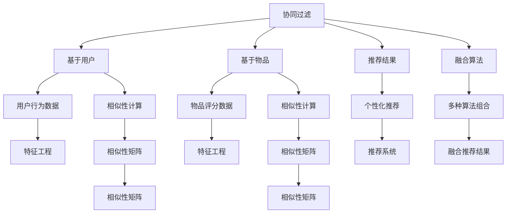
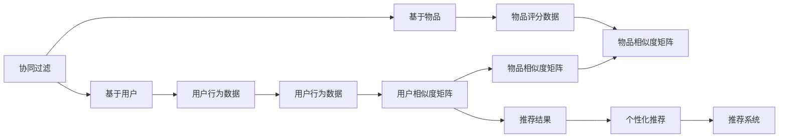
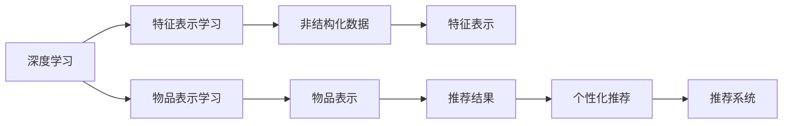
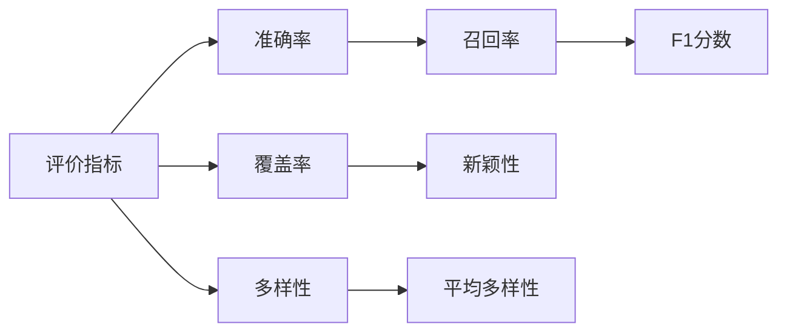
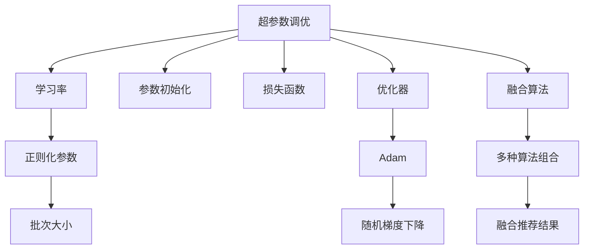
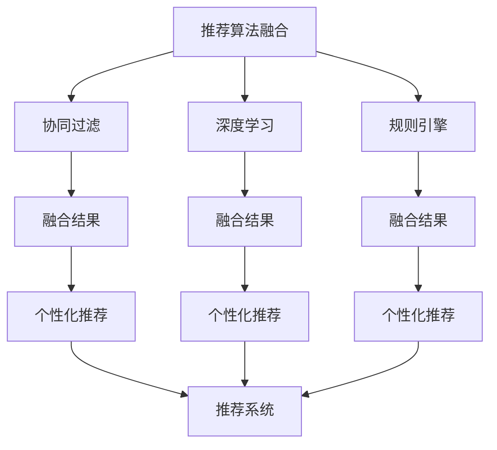

                 

# 个性化推荐在CUI中的长远发展

## 1. 背景介绍

### 1.1 问题由来
近年来，随着互联网应用的迅猛发展，用户个性化需求愈发凸显，个性化推荐系统已成为CUI（计算用户界面）的重要组成部分。个性化推荐系统通过分析用户行为数据，为用户推荐个性化的产品、服务或内容，极大地提升了用户体验和系统效率。然而，当前的个性化推荐系统多基于传统的协同过滤、内容推荐等方法，这些方法在精度、实时性、多样性等方面存在局限性。

### 1.2 问题核心关键点
为解决传统个性化推荐系统面临的问题，我们需要引入新的技术和方法。个性化推荐的核心目标是通过用户行为数据，预测用户对物品的偏好，从而推荐合适的物品。其中最关键的技术点包括：

- **用户行为建模**：如何有效刻画用户的行为模式和偏好变化，是推荐系统的基础。
- **物品表示学习**：如何利用大量非结构化数据学习物品的特征表示，是推荐系统精确度的重要保障。
- **协同过滤与深度学习结合**：如何将协同过滤的稀疏矩阵结构与深度学习模型进行结合，是推荐系统扩展性和泛化能力的关键。
- **实时性和多样性优化**：如何在保证推荐精度的同时，兼顾实时性和推荐内容的多样性，是推荐系统的难点。
- **隐私保护与数据安全**：如何在个性化推荐过程中，确保用户隐私数据的安全，是推荐系统面临的重要伦理挑战。

### 1.3 问题研究意义
研究个性化推荐在CUI中的应用，对于提升用户体验、提高业务效率、推动互联网产业升级具有重要意义。具体来说，个性化推荐系统可以帮助CUI平台实现：

- 提升用户粘性：通过个性化推荐，提高用户对平台的访问频率和使用时长。
- 精准营销：利用个性化推荐，实现定向精准的广告投放。
- 业务增长：通过推荐系统优化推荐策略，增加平台收入。
- 提升服务质量：通过个性化推荐，满足用户个性化需求，提高用户满意度。

## 2. 核心概念与联系

### 2.1 核心概念概述

为更好地理解个性化推荐系统，我们首先需要明确几个核心概念：

- **协同过滤**：基于用户的历史行为数据，通过计算相似性来推荐物品。可以分为基于用户的协同过滤和基于物品的协同过滤。
- **深度学习**：利用多层神经网络学习复杂特征表示，常用于推荐系统中的物品表示学习。
- **推荐系统评价指标**：常用的推荐系统评价指标包括精度（如准确率、召回率）、多样性、覆盖率、新颖性等。
- **A/B测试**：通过对比实验评估推荐算法的优劣，常用的对比指标包括转化率、点击率、停留时间等。
- **超参数调优**：通过调整推荐算法中的超参数，优化推荐效果。
- **推荐算法融合**：将多种推荐算法进行组合，弥补单一算法的缺陷，提升推荐性能。

这些核心概念之间存在密切联系，形成了个性化推荐系统的完整框架。下面通过几个Mermaid流程图来展示这些概念之间的联系：



这个流程图展示了个性化推荐系统的核心概念及其之间的联系：

1. 协同过滤依赖于用户行为数据和物品评分数据，通过计算相似性得到推荐结果。
2. 深度学习用于物品表示学习，提高推荐系统的精度。
3. 评价指标和A/B测试用于评估推荐效果。
4. 超参数调优用于优化推荐算法性能。
5. 推荐算法融合用于提升推荐系统的综合性能。

### 2.2 概念间的关系

这些核心概念之间存在紧密的联系，形成了个性化推荐系统的完整生态系统。下面我们通过几个Mermaid流程图来展示这些概念之间的关系。

#### 2.2.1 协同过滤算法



这个流程图展示了基于协同过滤的推荐过程，从用户行为数据到推荐结果。

#### 2.2.2 深度学习在推荐系统中的应用



这个流程图展示了深度学习在推荐系统中的主要应用，包括特征表示学习和物品表示学习。

#### 2.2.3 推荐系统评价指标



这个流程图展示了常用的推荐系统评价指标。

#### 2.2.4 超参数调优



这个流程图展示了超参数调优的具体步骤。

#### 2.2.5 推荐算法融合



这个流程图展示了推荐算法融合的过程。

## 3. 核心算法原理 & 具体操作步骤

### 3.1 算法原理概述

个性化推荐系统本质上是一个有监督学习的过程，通过用户行为数据和物品特征数据，训练模型预测用户对物品的偏好。常用的方法包括协同过滤、深度学习和融合推荐。

协同过滤依赖于用户行为数据和物品评分数据，通过计算相似性得到推荐结果。深度学习通过多层神经网络学习物品的特征表示，提高推荐系统的精度。融合推荐通过组合多种推荐算法，弥补单一算法的缺陷，提升推荐性能。

推荐系统的目标函数通常为最大化的平均用户满意度。常用优化算法包括梯度下降、Adam等。

### 3.2 算法步骤详解

1. **数据准备**：收集用户行为数据和物品特征数据，进行数据清洗和预处理。
2. **特征工程**：对用户和物品数据进行特征提取和向量化表示。
3. **模型训练**：选择合适的推荐算法和模型结构，进行模型训练。
4. **评估与调优**：通过评价指标和A/B测试评估推荐效果，调整模型超参数。
5. **部署与优化**：将训练好的模型部署到生产环境中，进行实时推荐。
6. **监控与维护**：实时监控推荐系统性能，及时发现并解决系统问题。

### 3.3 算法优缺点

**协同过滤的优点**：

- 不需要物品特征，适用于冷启动问题。
- 简单易懂，计算复杂度低。

**协同过滤的缺点**：

- 稀疏矩阵计算复杂度较高。
- 推荐结果依赖于历史评分数据，对新物品推荐效果差。

**深度学习的优点**：

- 能够学习复杂特征表示，提高推荐精度。
- 适用于处理多模态数据，如文本、图片等。

**深度学习的缺点**：

- 需要大量标注数据，训练成本高。
- 模型复杂度较高，计算资源消耗大。

**推荐算法融合的优点**：

- 互补不同算法优势，提升推荐性能。
- 能够适应多样化的推荐场景。

**推荐算法融合的缺点**：

- 融合算法选择困难，需要仔细调优。
- 需要大量计算资源，训练复杂度较高。

### 3.4 算法应用领域

个性化推荐系统在CUI中有着广泛的应用，以下是几个典型的应用领域：

- **电商推荐**：根据用户浏览、购买历史，推荐用户可能感兴趣的商品。
- **内容推荐**：根据用户阅读、观看历史，推荐用户可能感兴趣的文章、视频、音乐等。
- **社交网络**：根据用户交互数据，推荐用户可能感兴趣的人或内容。
- **金融服务**：根据用户交易行为，推荐用户可能感兴趣的产品或服务。

## 4. 数学模型和公式 & 详细讲解 & 举例说明

### 4.1 数学模型构建

假设用户行为数据为 $(x_i,y_i)$，其中 $x_i$ 表示用户行为，$y_i$ 表示物品评分。推荐系统模型的目标是最小化预测误差。

常用的目标函数为均方误差（MSE）：

$$
\min_{\theta} \frac{1}{N} \sum_{i=1}^N (y_i - \hat{y}_i)^2
$$

其中 $\hat{y}_i$ 表示模型对用户行为 $x_i$ 的预测物品评分。

### 4.2 公式推导过程

以基于深度学习的用户行为预测模型为例，其基本结构包括输入层、隐藏层和输出层。假设输入层的特征表示为 $x$，输出层的物品评分表示为 $\hat{y}$。

模型的损失函数为均方误差：

$$
L = \frac{1}{N} \sum_{i=1}^N (y_i - \hat{y}_i)^2
$$

通过反向传播算法计算梯度，更新模型参数：

$$
\theta \leftarrow \theta - \eta \nabla_{\theta}L
$$

其中 $\eta$ 为学习率，$\nabla_{\theta}L$ 为损失函数对模型参数的梯度。

### 4.3 案例分析与讲解

以电商推荐系统为例，假设有 $M$ 个物品 $x_m$，$N$ 个用户 $x_n$，用户对物品的评分数据为 $y_{nm}$。

1. **特征提取**：对物品和用户数据进行特征提取，得到向量表示 $x_{nm}$。
2. **模型训练**：通过深度学习模型训练，学习物品和用户行为之间的映射关系。
3. **推荐计算**：根据训练好的模型，计算用户对每个物品的评分预测 $\hat{y}_{nm}$。
4. **排序推荐**：根据预测评分排序，将高评分的物品推荐给用户。

## 5. 项目实践：代码实例和详细解释说明

### 5.1 开发环境搭建

以下是使用Python进行推荐系统开发的常见环境配置：

1. 安装Anaconda：从官网下载并安装Anaconda，用于创建独立的Python环境。

2. 创建并激活虚拟环境：
```bash
conda create -n pytorch-env python=3.8 
conda activate pytorch-env
```

3. 安装PyTorch和相关库：
```bash
pip install torch torchvision torchaudio numpy pandas scikit-learn scikit-learn pandas
```

4. 下载数据集：可以从公开数据集网站如Kaggle下载电商推荐数据集。

5. 搭建实验环境：
```python
import torch
import torch.nn as nn
import torch.optim as optim
from torch.utils.data import DataLoader, Dataset

# 定义模型和数据集
model = nn.Sequential(
    nn.Linear(10, 20),
    nn.ReLU(),
    nn.Linear(20, 1)
)
criterion = nn.MSELoss()
optimizer = optim.Adam(model.parameters(), lr=0.001)

dataset = MyDataset(...)
train_loader = DataLoader(dataset, batch_size=32, shuffle=True)
```

### 5.2 源代码详细实现

以深度学习模型进行电商推荐为例，以下是一个基于PyTorch的推荐系统实现：

```python
class MyDataset(Dataset):
    def __init__(self, data, labels):
        self.data = data
        self.labels = labels
        
    def __len__(self):
        return len(self.data)
    
    def __getitem__(self, index):
        return self.data[index], self.labels[index]

# 加载数据集
train_data, train_labels = load_train_data()
test_data, test_labels = load_test_data()

# 定义模型和训练函数
model = MyModel(...)
optimizer = optim.Adam(model.parameters(), lr=0.001)
criterion = nn.MSELoss()

def train_model(model, train_data, train_labels, num_epochs=10, batch_size=32):
    for epoch in range(num_epochs):
        for data, label in DataLoader(train_data, batch_size=batch_size, shuffle=True):
            optimizer.zero_grad()
            output = model(data)
            loss = criterion(output, label)
            loss.backward()
            optimizer.step()
    
    # 测试模型
    test_loss = []
    for data, label in DataLoader(test_data, batch_size=batch_size):
        output = model(data)
        loss = criterion(output, label)
        test_loss.append(loss.item())

    print("Test loss:", sum(test_loss) / len(test_labels))
    
# 训练模型
train_model(model, train_data, train_labels)
```

### 5.3 代码解读与分析

**数据集定义**：
- 定义数据集类 `MyDataset`，实现 `__len__` 和 `__getitem__` 方法。
- 加载数据集，构建训练集和测试集。

**模型定义**：
- 定义深度学习模型 `MyModel`，使用 `nn.Sequential` 构建一个简单的线性层和ReLU激活函数。
- 定义损失函数和优化器，用于训练模型。

**训练函数**：
- 使用 `DataLoader` 加载训练数据，在每个epoch中迭代训练。
- 计算损失函数，反向传播更新模型参数。
- 在测试集上评估模型性能。

**训练过程**：
- 设置训练参数，如epoch数、batch size。
- 在训练集中训练模型。
- 在测试集上评估模型性能。

## 6. 实际应用场景

### 6.1 智能客服系统

智能客服系统通过个性化推荐技术，能够提供更加精准的服务。系统根据用户历史对话内容，推荐可能感兴趣的问题和解决方案，提高用户满意度。

在技术实现上，可以收集用户对话历史，构建用户行为数据集。通过深度学习模型学习用户对话特征，预测用户意图。根据预测结果推荐最合适的对话内容，构建智能客服系统。

### 6.2 金融产品推荐

金融产品推荐系统通过个性化推荐技术，能够为用户提供更合适的金融产品。系统根据用户历史交易行为，推荐可能感兴趣的产品和策略。

在技术实现上，可以收集用户历史交易数据，构建用户行为数据集。通过深度学习模型学习用户交易特征，预测用户偏好。根据预测结果推荐最适合的金融产品，提升用户粘性和交易量。

### 6.3 个性化视频推荐

视频推荐系统通过个性化推荐技术，能够为用户推荐更感兴趣的视频内容。系统根据用户历史观看数据，推荐可能感兴趣的视频。

在技术实现上，可以收集用户历史观看数据，构建用户行为数据集。通过深度学习模型学习用户观看特征，预测用户偏好。根据预测结果推荐最适合的视频，提高用户停留时间和观看体验。

### 6.4 未来应用展望

未来，个性化推荐系统将在大数据、人工智能等技术支持下，进一步拓展应用场景，提升推荐性能。

**大数据技术**：通过海量数据挖掘，发现用户隐性需求，提升推荐精度。

**人工智能技术**：利用深度学习、自然语言处理等技术，提高推荐系统的智能水平。

**个性化推荐算法**：引入多模态融合、协同过滤、自适应推荐等算法，提升推荐系统的多样性和泛化能力。

**用户隐私保护**：在推荐系统设计中，引入隐私保护技术，确保用户数据安全。

## 7. 工具和资源推荐

### 7.1 学习资源推荐

1. 《推荐系统》书籍：介绍推荐系统理论基础和常用算法，是推荐系统入门的经典教材。
2. Kaggle推荐系统竞赛：通过实际竞赛项目，学习推荐系统实现和优化。
3. Coursera推荐系统课程：由斯坦福大学开设的推荐系统课程，涵盖推荐系统基础和实际应用。
4. arXiv论文预印本：人工智能领域最新研究成果的发布平台，推荐系统相关论文和代码资源。

### 7.2 开发工具推荐

1. PyTorch：基于Python的深度学习框架，适用于推荐系统模型训练和优化。
2. TensorFlow：谷歌开发的深度学习框架，适用于大规模推荐系统部署。
3. Scikit-learn：Python机器学习库，适用于推荐系统特征工程和模型评估。
4. Weights & Biases：模型训练的实验跟踪工具，记录和可视化模型训练过程。

### 7.3 相关论文推荐

1. "Collaborative Filtering for Implicit Feedback Datasets"：介绍协同过滤算法的基本原理和应用。
2. "Deep Neural Networks for Collaborative Filtering"：讨论深度学习在协同过滤中的应用。
3. "A Comprehensive Survey of Recommender Systems"：综述推荐系统的发展和前沿技术。
4. "Adaptive Neural Factorization Machines"：介绍自适应神经因子机算法，提升推荐系统性能。

## 8. 总结：未来发展趋势与挑战

### 8.1 总结

本文对个性化推荐系统在CUI中的应用进行了全面系统的介绍。首先阐述了推荐系统的背景和意义，明确了推荐系统在提高用户体验、推动业务发展等方面的重要价值。其次，从原理到实践，详细讲解了推荐系统的核心算法和技术细节，给出了推荐系统开发的完整代码实例。同时，本文还广泛探讨了推荐系统在智能客服、金融服务、视频推荐等领域的实际应用，展示了推荐系统的强大潜力和广泛前景。最后，本文精选了推荐系统的学习资源和开发工具，力求为读者提供全方位的技术指引。

通过本文的系统梳理，可以看到，个性化推荐系统已经成为CUI不可或缺的一部分，极大地提升了用户体验和系统效率。未来，伴随深度学习、大数据、人工智能等技术的不断发展，推荐系统必将在更广阔的应用领域发挥更大作用，为CUI平台带来更多的创新和突破。

### 8.2 未来发展趋势

展望未来，个性化推荐系统将呈现以下几个发展趋势：

1. **多模态融合**：结合文本、图片、视频等多种数据模态，提升推荐系统的智能水平。
2. **自适应推荐**：根据用户实时行为，动态调整推荐策略，提升推荐效果。
3. **联邦学习**：通过联邦学习技术，保护用户隐私的同时，实现个性化推荐。
4. **对抗性推荐**：引入对抗性样本，提高推荐系统的鲁棒性，抵御恶意攻击。
5. **实时推荐**：利用流数据处理技术，实现实时个性化推荐。
6. **可解释性推荐**：通过可解释性技术，增强推荐系统的可信度，提升用户体验。

以上趋势凸显了个性化推荐系统的广阔前景。这些方向的探索发展，必将进一步提升推荐系统的性能和应用范围，为CUI平台带来更多的创新和突破。

### 8.3 面临的挑战

尽管个性化推荐系统已经取得了瞩目成就，但在迈向更加智能化、普适化应用的过程中，它仍面临着诸多挑战：

1. **数据质量和多样性**：推荐系统的精度依赖于高质量和多样化的数据，数据获取和处理成本高。
2. **计算资源消耗**：深度学习模型需要大量计算资源，训练和推理效率低。
3. **隐私保护和伦理问题**：用户数据隐私保护和推荐系统的公平性、透明性需要进一步加强。
4. **推荐多样性**：推荐系统容易陷入“过滤气泡”，用户只能接触到单一的信息源。
5. **模型复杂性**：深度学习模型结构复杂，训练和部署难度高。

### 8.4 研究展望

面对个性化推荐系统面临的挑战，未来的研究需要在以下几个方面寻求新的突破：

1. **模型压缩与优化**：通过模型压缩、剪枝等技术，减少计算资源消耗，提高推荐系统效率。
2. **推荐算法融合**：将多种推荐算法进行组合，弥补单一算法的缺陷，提升推荐性能。
3. **隐私保护技术**：引入联邦学习、差分隐私等技术，保护用户数据隐私。
4. **推荐系统公平性**：引入公平性评估指标，确保推荐系统对所有用户公平。
5. **推荐系统可解释性**：引入可解释性技术，增强推荐系统的可信度。

这些研究方向的探索，必将引领个性化推荐系统技术迈向更高的台阶，为CUI平台带来更多的创新和突破。只有勇于创新、敢于突破，才能真正实现个性化推荐系统的价值。

## 9. 附录：常见问题与解答

**Q1：推荐系统有哪些评价指标？**

A: 推荐系统的评价指标包括精度（如准确率、召回率）、多样性、覆盖率、新颖性等。常用指标如下：

- **准确率**：预测结果与真实结果一致的比例。
- **召回率**：实际结果出现在预测结果中的比例。
- **F1分数**：准确率和召回率的调和平均数。
- **覆盖率**：推荐结果中不同物品的比例。
- **新颖性**：推荐结果中未被用户访问的比例。

**Q2：推荐系统如何实现冷启动？**

A: 推荐系统实现冷启动的常用方法包括基于协同过滤和基于深度学习的方法。

- **基于协同过滤**：利用用户行为数据，通过计算相似性推荐物品。
- **基于深度学习**：利用非结构化数据，通过深度学习模型学习物品特征，进行推荐。

**Q3：推荐系统如何避免“过滤气泡”？**

A: 推荐系统可以通过引入多样性损失、生成对抗网络等技术，避免“过滤气泡”现象。

- **多样性损失**：在推荐结果中引入多样性约束，避免推荐结果过于集中。
- **生成对抗网络**：通过生成对抗网络生成对抗样本，丰富推荐结果。

**Q4：推荐系统如何处理用户历史数据？**

A: 推荐系统可以通过特征工程、时间序列分析等方法，处理用户历史数据。

- **特征工程**：对用户行为数据进行特征提取和向量化表示。
- **时间序列分析**：分析用户历史行为的时序规律，预测未来行为。

**Q5：推荐系统如何实现实时推荐？**

A: 推荐系统可以通过流数据处理、增量学习等技术，实现实时推荐。

- **流数据处理**：对实时数据进行流处理，动态更新推荐策略。
- **增量学习**：利用在线学习技术，实时更新推荐模型。

总之，个性化推荐系统在CUI中的应用前景广阔，但其发展仍面临诸多挑战。只有不断创新和优化，才能真正实现个性化推荐系统的价值，为用户带来更好的体验和服务。

