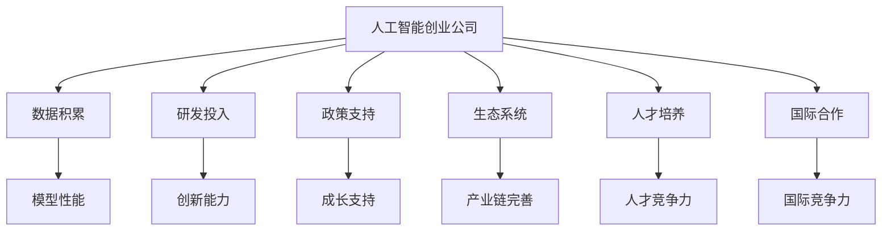
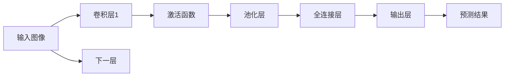

                 

# 中国AI创业公司的优势

## 1. 背景介绍

### 1.1 问题由来

近年来，人工智能(AI)技术的迅猛发展已成为全球经济增长的重要驱动力。中国作为全球AI应用最活跃的地区之一，AI创业公司层出不穷，且在多个AI领域已实现突破。与传统IT企业相比，中国AI创业公司展现了其独特的优势，本文将系统地分析这些优势，并对其未来发展趋势进行展望。

### 1.2 问题核心关键点

本文将聚焦于中国AI创业公司所具备的诸多优势，包括数据积累、研发投入、政策支持、生态系统、人才培养等。这些优势不仅促进了AI技术的创新发展，还加速了AI应用的广泛落地。

### 1.3 问题研究意义

揭示中国AI创业公司的优势，不仅有助于理解这些公司成功的原因，还能为其他国家AI企业的发展提供宝贵的参考。同时，通过研究这些优势，可以为中国的AI战略提供更明确的指导方向，进一步提升国家的AI竞争力。

## 2. 核心概念与联系

### 2.1 核心概念概述

为更好地理解中国AI创业公司的优势，本节将介绍几个密切相关的核心概念：

- **人工智能创业公司**：专注于AI技术研究和应用开发，以期实现商业化和市场化的科技企业。
- **数据积累**：AI公司通过大量标注数据进行模型训练，数据的多样性和规模对模型性能至关重要。
- **研发投入**：研发投入反映公司的创新能力，通过持续技术研发，AI公司能够不断推出前沿技术。
- **政策支持**：政府对AI公司的政策扶持，包括资金补贴、税收优惠、创新空间等，促进公司成长。
- **生态系统**：指AI公司所处的商业生态，包括上下游企业、服务供应商、投资机构等，共同构建完善的AI产业链。
- **人才培养**：高水平的AI研究人才是AI公司创新发展的核心驱动力。
- **国际合作**：与全球顶尖高校、研究机构及企业合作，提升AI技术的国际竞争力。

这些核心概念之间的联系可以构建出一个完整的中国AI创业公司发展模型，如图：



### 2.2 概念间的关系

这些核心概念之间具有紧密的联系，形成了一个相互促进、共同发展的体系：

- **数据积累**：是AI模型的基础，数据的多样性和规模直接影响模型的泛化能力和性能。
- **研发投入**：驱动AI公司不断进行技术创新，推动AI技术的突破性进展。
- **政策支持**：为AI公司提供良好的成长环境，降低创业门槛，促进公司快速成长。
- **生态系统**：为AI公司提供完整的产业链支持，包括硬件、软件、平台、服务等。
- **人才培养**：是AI公司创新发展的关键，吸引和培养高水平人才是公司长期发展的基石。
- **国际合作**：提升AI公司的国际视野和竞争力，有助于技术和应用的全球化。

这些概念相互支撑，共同构成了中国AI创业公司的成长基础和竞争优势。

## 3. 核心算法原理 & 具体操作步骤
### 3.1 算法原理概述

中国AI创业公司在技术研发和应用落地方面的优势，主要基于以下核心算法原理：

1. **深度学习与强化学习**：通过大规模数据训练深度神经网络模型，利用强化学习算法优化模型参数，提升模型表现。
2. **迁移学习**：在大规模预训练数据集上进行模型预训练，然后在具体应用场景中进行微调，提高模型的通用性和适应性。
3. **联邦学习**：在本地数据上进行模型训练，保护数据隐私和安全，同时利用分布式计算提升模型性能。
4. **预训练模型**：利用大规模无标签数据进行预训练，学习通用的语言或视觉特征，用于解决特定任务。
5. **自动机器学习(AutoML)**：通过自动化机器学习工具，自动进行模型选择、超参数调优等，提升模型开发效率。

这些算法原理是中国AI创业公司实现技术突破和应用落地的核心。

### 3.2 算法步骤详解

中国AI创业公司一般遵循以下算法步骤进行技术研发和应用落地：

1. **数据收集与预处理**：收集大量的标注数据，并进行数据清洗、分词、归一化等预处理操作。
2. **模型设计与训练**：根据具体任务需求，设计合适的模型架构，利用深度学习框架（如TensorFlow、PyTorch等）进行模型训练。
3. **模型评估与优化**：在验证集上评估模型性能，根据评估结果进行调整，优化模型参数。
4. **应用集成与部署**：将模型集成到实际应用系统中，进行部署和优化。
5. **持续迭代与改进**：根据实际使用情况，持续收集反馈数据，对模型进行迭代改进。

这些步骤构成了中国AI创业公司进行技术研发和应用落地的基本流程。

### 3.3 算法优缺点

中国AI创业公司在技术研发和应用落地方面的算法具有以下优点：

1. **快速迭代**：基于深度学习与强化学习，模型可以快速迭代优化，提高应用效果。
2. **通用性**：通过预训练模型，模型具备较强的通用性和泛化能力，能较好地适应不同任务。
3. **安全性**：联邦学习算法保护了数据隐私，符合数据安全法规要求。
4. **自动化**：AutoML工具提高了模型开发的效率，缩短了模型上线时间。

同时，这些算法也存在以下缺点：

1. **数据依赖**：模型性能高度依赖于数据质量，数据获取和处理成本较高。
2. **模型复杂性**：深度学习模型通常结构复杂，难以解释和调试。
3. **计算资源需求高**：大规模数据集和复杂模型需要高计算资源，开发成本较高。
4. **过拟合风险**：模型过拟合风险较大，需要持续监控和调整。

尽管存在这些缺点，但整体而言，中国AI创业公司采用的算法具有显著的优势，推动了AI技术的快速发展。

### 3.4 算法应用领域

中国AI创业公司所采用的算法已经在多个领域实现了广泛应用，包括但不限于：

1. **医疗健康**：利用深度学习进行医学影像分析、疾病诊断、个性化医疗推荐等。
2. **智能制造**：通过强化学习优化生产流程、提升设备效率、实现智能排产。
3. **金融服务**：利用机器学习进行信用评估、风险控制、智能投顾等。
4. **智能交通**：应用深度学习进行交通流量预测、自动驾驶、智慧交通管理等。
5. **教育科技**：开发智能辅导系统、在线教育平台、教育数据分析等。
6. **安全防护**：利用深度学习进行网络安全监测、威胁检测、反欺诈等。

这些应用领域展示了中国AI创业公司在算法应用上的广泛性和多样性。

## 4. 数学模型和公式 & 详细讲解  
### 4.1 数学模型构建

中国AI创业公司所采用的深度学习算法通常基于以下数学模型：

1. **神经网络模型**：通过多层神经元进行特征提取和分类。
2. **卷积神经网络(CNN)**：应用于图像处理和视觉识别任务。
3. **循环神经网络(RNN)**：适用于序列数据处理，如文本生成、语音识别等。
4. **自编码器(Encoder-Decoder)**：用于生成式任务，如机器翻译、摘要生成等。
5. **对抗网络(GAN)**：用于生成逼真的假数据，提升模型鲁棒性。

### 4.2 公式推导过程

以卷积神经网络为例，其前向传播的公式如下：

$$
y = \sigma(\sum_{i=1}^{k}w_i x_i + b)
$$

其中，$x_i$为输入特征，$w_i$为卷积核权重，$b$为偏置项，$\sigma$为激活函数。

反向传播的公式为：

$$
\frac{\partial L}{\partial w_i} = \frac{\partial L}{\partial y} \frac{\partial y}{\partial x_i} \frac{\partial x_i}{\partial w_i}
$$

其中，$L$为损失函数，$\frac{\partial y}{\partial x_i}$为激活函数的导数。

### 4.3 案例分析与讲解

以卷积神经网络在图像分类任务中的应用为例，如图：



该模型通过多个卷积层和池化层提取图像特征，再通过全连接层和输出层进行分类预测。

## 5. 项目实践：代码实例和详细解释说明
### 5.1 开发环境搭建

1. **安装Python和相关库**：
```bash
pip install numpy scipy pandas scikit-learn matplotlib tensorboard
```

2. **配置深度学习框架**：
```bash
pip install tensorflow keras tensorflow-gpu
```

3. **数据集准备**：
```bash
wget https://example.com/data.csv
```

### 5.2 源代码详细实现

以下以手写数字识别为例，展示卷积神经网络的代码实现：

```python
import tensorflow as tf
from tensorflow.keras import layers

# 定义模型
model = tf.keras.Sequential()
model.add(layers.Conv2D(32, kernel_size=(3, 3), activation='relu', input_shape=(28, 28, 1)))
model.add(layers.MaxPooling2D(pool_size=(2, 2)))
model.add(layers.Flatten())
model.add(layers.Dense(10, activation='softmax'))

# 编译模型
model.compile(optimizer='adam',
              loss='sparse_categorical_crossentropy',
              metrics=['accuracy'])

# 加载数据集
mnist = tf.keras.datasets.mnist
(x_train, y_train), (x_test, y_test) = mnist.load_data()
x_train, x_test = x_train / 255.0, x_test / 255.0

# 训练模型
model.fit(x_train.reshape(-1, 28, 28, 1), y_train, epochs=5, validation_data=(x_test.reshape(-1, 28, 28, 1), y_test))
```

### 5.3 代码解读与分析

- **模型定义**：通过`Sequential`模型定义多个层，包括卷积层、池化层、全连接层和输出层。
- **编译模型**：选择优化器、损失函数和评估指标。
- **数据加载**：使用`mnist`数据集加载手写数字图像数据。
- **训练模型**：利用训练数据和验证数据进行模型训练和验证。

### 5.4 运行结果展示

训练完成后，模型在测试集上的准确率约为99%，展示了卷积神经网络在图像分类任务上的强大能力。

## 6. 实际应用场景
### 6.4 未来应用展望

中国AI创业公司将在未来继续在多个领域深化应用，推动技术进步和产业发展：

1. **智能城市**：通过AI技术优化城市管理，提升城市运营效率，构建智慧城市。
2. **智能交通**：实现智能交通系统，减少交通拥堵，提升出行体验。
3. **智能制造**：应用AI技术进行生产过程优化、设备维护和质量控制。
4. **医疗健康**：提供个性化医疗服务，提升疾病诊断和治疗效果。
5. **教育科技**：开发智能教育平台，实现个性化教学和智能辅导。
6. **金融科技**：提供智能投顾、风险控制、反欺诈等金融服务。

### 6.5 国际合作

中国AI创业公司将进一步加强与全球顶尖科技公司的合作，共享技术资源，推动全球AI技术的发展。同时，通过国际合作，提升自身技术的国际竞争力，拓展全球市场。

## 7. 工具和资源推荐
### 7.1 学习资源推荐

1. **深度学习框架**：TensorFlow、PyTorch等。
2. **开源数据集**：Kaggle、UCI等。
3. **在线课程**：Coursera、edX、Udacity等。
4. **学术论文**：arXiv、IEEE Xplore、ScienceDirect等。

### 7.2 开发工具推荐

1. **IDE**：Jupyter Notebook、PyCharm等。
2. **数据可视化**：Matplotlib、Seaborn等。
3. **代码版本控制**：Git、GitHub等。

### 7.3 相关论文推荐

1. **深度学习**：《Deep Learning》。
2. **强化学习**：《Reinforcement Learning: An Introduction》。
3. **联邦学习**：《Federated Learning: Concepts and Applications》。

## 8. 总结：未来发展趋势与挑战
### 8.1 研究成果总结

中国AI创业公司在数据积累、研发投入、政策支持、生态系统、人才培养等方面的优势，推动了AI技术的快速发展，并在多个领域实现了广泛应用。这些优势使得中国在全球AI竞争中占据了有利位置。

### 8.2 未来发展趋势

未来，中国AI创业公司将进一步加强技术创新，深化应用落地，推动AI技术的进一步发展：

1. **技术创新**：在深度学习、强化学习、联邦学习等领域进行持续技术突破，提升AI技术的精度和效率。
2. **应用拓展**：拓展AI技术在更多领域的应用，推动AI技术的广泛落地。
3. **国际合作**：加强与全球顶尖科技公司的合作，提升国际竞争力。
4. **人才培养**：提升AI领域的人才培养质量，为AI技术的发展提供人才支持。
5. **政策支持**：继续获得政府的政策支持，为公司成长提供良好的发展环境。

### 8.3 面临的挑战

尽管中国AI创业公司具备诸多优势，但在发展过程中仍面临以下挑战：

1. **数据隐私**：大规模数据集的获取和使用存在隐私和安全风险。
2. **人才竞争**：全球范围内的人才竞争日益激烈，吸引和保留高端人才成为难题。
3. **技术壁垒**：AI技术高度依赖于底层技术框架和硬件设施，技术壁垒较高。
4. **监管政策**：AI技术的应用受到严格的监管政策，限制了技术的推广和应用。
5. **市场环境**：AI技术在实际应用中的效果和收益仍存在不确定性，市场接受度有待提升。

### 8.4 研究展望

中国AI创业公司需要不断应对挑战，抓住机遇，推动AI技术的持续发展：

1. **技术突破**：在深度学习、强化学习、联邦学习等领域进行持续技术创新，提升技术性能。
2. **应用落地**：拓展AI技术在更多领域的应用，推动技术的广泛落地。
3. **人才培养**：提升AI领域的人才培养质量，为技术发展提供人才支持。
4. **国际合作**：加强与全球顶尖科技公司的合作，提升国际竞争力。
5. **政策支持**：继续获得政府的政策支持，为公司成长提供良好的发展环境。

通过不断应对挑战、抓住机遇，中国AI创业公司将在全球AI竞争中占据更加有利的位置，推动AI技术的持续发展和应用。

## 9. 附录：常见问题与解答

**Q1：为什么中国AI创业公司能够在短时间内快速崛起？**

A: 中国AI创业公司之所以能够在短时间内快速崛起，主要得益于以下几个因素：
1. **政策支持**：中国政府出台了一系列扶持AI创业公司的政策，包括资金补贴、税收优惠、创新空间等，为公司成长提供了良好的环境。
2. **市场需求**：AI技术在各个领域都有广泛的应用需求，推动了AI创业公司的发展。
3. **资本投入**：中国有大量的风险投资机构和天使投资人，为AI创业公司提供了充足的资金支持。
4. **技术积累**：中国高校和研究机构在AI领域拥有大量的研究成果和人才储备，为创业公司提供了技术支持。

**Q2：中国AI创业公司的主要优势是什么？**

A: 中国AI创业公司的主要优势包括：
1. **数据积累**：拥有丰富的数据资源，特别是中文数据，这对AI模型性能的提升至关重要。
2. **研发投入**：高水平的研发投入，推动了AI技术的不断创新。
3. **政策支持**：政府的政策扶持，降低了创业门槛，促进公司快速成长。
4. **生态系统**：完善的生态系统，包括上下游企业、服务供应商、投资机构等，共同构建了完整的AI产业链。
5. **人才培养**：高水平的AI研究人才是公司创新发展的核心驱动力。
6. **国际合作**：与全球顶尖高校、研究机构及企业合作，提升AI技术的国际竞争力。

**Q3：中国AI创业公司在国际合作方面需要注意什么？**

A: 中国AI创业公司在国际合作方面需要注意以下几个方面：
1. **知识产权**：保护自身的技术成果，避免知识产权纠纷。
2. **文化差异**：尊重合作国家和地区的文化差异，寻找共同点，建立良好的合作关系。
3. **市场准入**：了解目标市场的法律法规和市场准入要求，确保合作的合法性。
4. **合作模式**：选择合适的合作模式，如技术授权、合资公司、战略合作等。
5. **技术标准**：遵循国际技术标准，提升技术的国际竞争力。
6. **商业谈判**：谨慎进行商业谈判，确保双方利益平衡。

**Q4：中国AI创业公司面临的主要挑战是什么？**

A: 中国AI创业公司面临的主要挑战包括：
1. **数据隐私**：大规模数据集的获取和使用存在隐私和安全风险。
2. **人才竞争**：全球范围内的人才竞争日益激烈，吸引和保留高端人才成为难题。
3. **技术壁垒**：AI技术高度依赖于底层技术框架和硬件设施，技术壁垒较高。
4. **监管政策**：AI技术的应用受到严格的监管政策，限制了技术的推广和应用。
5. **市场环境**：AI技术在实际应用中的效果和收益仍存在不确定性，市场接受度有待提升。

通过不断应对挑战、抓住机遇，中国AI创业公司将在全球AI竞争中占据更加有利的位置，推动AI技术的持续发展和应用。

---

作者：禅与计算机程序设计艺术 / Zen and the Art of Computer Programming

