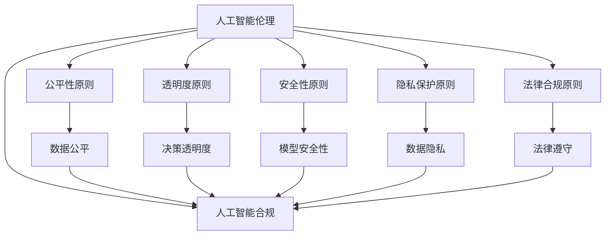

                 

# 人工智能创业：伦理合规策略

## 1. 背景介绍

### 1.1 问题由来
随着人工智能技术的快速发展，越来越多的创业公司在人工智能领域布局。然而，人工智能技术的伦理和合规问题也愈发凸显。企业在追求技术突破和商业成功的同时，如何确保人工智能系统公平、透明、可解释、安全，成为一个亟需解决的重要课题。

### 1.2 问题核心关键点
人工智能创业面临的伦理合规问题主要集中在以下几个方面：

- **公平性问题**：不同群体、不同地区、不同年龄等可能对同一模型产生不公平的影响。
- **透明度问题**：模型的决策过程是否可解释，对结果有预期但不确定。
- **安全性问题**：模型是否存在偏见和歧视，可能被恶意利用。
- **隐私问题**：如何保护用户数据隐私，避免数据泄露和滥用。
- **法律合规问题**：如何遵守各国法律规定，避免侵犯知识产权和隐私保护法等。

这些问题不仅关乎企业的商业伦理和社会责任，还直接影响消费者的信任和行业的可持续发展。因此，企业在人工智能创业过程中，必须将伦理合规作为核心考量，确保人工智能技术的负责任和可持续应用。

## 2. 核心概念与联系

### 2.1 核心概念概述

为更好地理解人工智能创业中的伦理合规策略，本节将介绍几个密切相关的核心概念：

- **人工智能伦理**：指在人工智能研发和应用过程中，遵循一定的伦理原则和规范，以确保技术应用对社会、个体和环境带来的正面影响。
- **人工智能合规**：指在人工智能技术的应用过程中，遵守相关法律法规和行业标准，确保技术应用的合法性和合规性。
- **公平性原则**：人工智能系统的输出结果应公平对待所有用户，避免对特定群体或个体的不公平待遇。
- **透明度原则**：人工智能系统的决策过程应透明可解释，用户应了解模型的工作原理和输出依据。
- **安全性原则**：人工智能系统应确保安全稳定，避免因模型错误或恶意攻击导致的负面影响。
- **隐私保护原则**：人工智能系统应保护用户隐私，避免数据泄露和滥用。
- **法律合规原则**：人工智能系统的设计和应用应遵守各国法律法规，避免侵犯知识产权和隐私保护等。

这些核心概念之间存在着紧密的联系，共同构成了人工智能创业中的伦理合规框架。通过理解这些核心概念，我们可以更好地把握人工智能创业中的伦理合规策略。

### 2.2 概念间的关系

这些核心概念之间存在着密切的联系，形成了人工智能创业中的伦理合规整体架构。下面通过一个Mermaid流程图来展示这些概念之间的关系：



这个流程图展示了大语言模型的核心概念及其之间的关系：

1. 人工智能伦理是指导人工智能系统设计和应用的最高准则。
2. 人工智能合规是确保人工智能系统符合法律法规的标准。
3. 公平性原则、透明度原则、安全性原则、隐私保护原则和法律合规原则是实现人工智能伦理的具体要求。
4. 数据公平、决策透明度、模型安全性、数据隐私和法律遵守是实现人工智能合规的具体手段。

这些概念共同构成了人工智能创业中的伦理合规框架，确保人工智能技术的负责任和可持续应用。

## 3. 核心算法原理 & 具体操作步骤
### 3.1 算法原理概述

人工智能创业中的伦理合规策略，本质上是一种通过算法和技术手段，确保人工智能系统公平、透明、可解释、安全的策略。其核心思想是：

1. **公平性算法**：通过算法设计确保不同群体和个体在人工智能系统中得到公平对待。
2. **透明度算法**：设计可解释的模型和算法，使得用户能够理解和信任模型的决策过程。
3. **安全性算法**：通过算法设计提高模型的鲁棒性和安全性，避免因模型错误或恶意攻击导致的负面影响。
4. **隐私保护算法**：通过算法设计保护用户数据隐私，避免数据泄露和滥用。
5. **法律合规算法**：设计符合法律法规要求的算法，避免侵犯知识产权和隐私保护等。

这些算法原理和操作步骤，将有助于构建公平、透明、可解释、安全的AI系统。

### 3.2 算法步骤详解

以下详细介绍基于人工智能创业中的伦理合规策略的具体算法步骤：

**Step 1: 确定合规框架**
- 研究并遵守国家法律法规和行业标准，如GDPR、CCPA等。
- 制定企业内部合规政策，明确数据收集、使用、存储和处理的合规要求。

**Step 2: 数据收集与预处理**
- 确保数据来源合法，不侵犯个人隐私和知识产权。
- 对数据进行去标识化处理，确保数据匿名性和安全性。
- 应用数据增强和数据清洗技术，提升数据质量和代表性。

**Step 3: 模型训练与评估**
- 使用公平性算法和透明度算法，确保模型训练过程和结果的公平性和透明度。
- 应用安全性和隐私保护算法，确保模型训练和应用过程中的数据安全和隐私保护。
- 应用法律合规算法，确保模型设计和使用符合法律法规要求。

**Step 4: 模型部署与监控**
- 在模型部署过程中，确保模型的公平性、透明性、安全性和隐私保护。
- 建立监控机制，及时发现和处理模型偏差、异常和安全漏洞。
- 定期进行模型审计，确保模型合规和伦理符合要求。

**Step 5: 用户反馈与改进**
- 收集用户反馈，评估模型的公平性、透明性和安全性。
- 根据用户反馈和模型审计结果，改进模型设计和算法实现。
- 持续更新模型，确保模型始终符合最新的法律法规和行业标准。

### 3.3 算法优缺点

人工智能创业中的伦理合规策略具有以下优点：

- **提升企业声誉**：通过伦理合规策略，提升企业的社会责任感和公众信任度。
- **减少法律风险**：遵循法律法规和行业标准，避免因违法违规带来的法律风险和财务损失。
- **提升模型效果**：通过公平性、透明度和安全性算法，提升模型的可靠性和鲁棒性。
- **保护用户隐私**：通过隐私保护算法，保护用户数据隐私，提升用户满意度。

同时，这些策略也存在一些局限性：

- **高成本**：设计和实现伦理合规策略需要大量的资源投入，包括人力、技术和资金等。
- **技术复杂**：实现公平性、透明度、安全性和隐私保护等算法，需要深厚的技术和专业知识。
- **实时更新**：法律法规和行业标准在不断变化，需要及时更新和调整伦理合规策略，以保持合规性。

尽管存在这些局限性，但这些伦理合规策略仍是确保人工智能系统公平、透明、可解释、安全的重要手段，对于构建负责任和可持续的AI系统具有重要意义。

### 3.4 算法应用领域

基于人工智能创业中的伦理合规策略，已经在多个领域得到了广泛应用，包括但不限于：

- **金融科技**：在金融信贷、投资、风险评估等场景中，确保模型的公平性和透明性，保护用户隐私和数据安全。
- **医疗健康**：在疾病诊断、治疗方案推荐等场景中，确保模型的公平性和安全性，避免偏见和歧视，保护患者隐私。
- **教育培训**：在个性化学习、智能评估等场景中，确保模型的公平性和透明性，保护学生隐私，提升教育质量。
- **智能交通**：在自动驾驶、交通信号优化等场景中，确保模型的公平性和安全性，保护行人安全，提升交通效率。
- **智能安防**：在人脸识别、视频监控等场景中，确保模型的公平性和透明性，保护个人隐私，提升安全水平。

## 4. 数学模型和公式 & 详细讲解 & 举例说明

### 4.1 数学模型构建

为了更好地理解人工智能创业中的伦理合规策略，本节将使用数学语言对相关算法进行严格的刻画。

假设有一个数据集 $D=\{(x_i,y_i)\}_{i=1}^N$，其中 $x_i$ 为特征向量，$y_i$ 为标签。我们希望构建一个公平、透明、可解释、安全的AI模型 $M$，使其在公平性、透明性、安全性和隐私保护等方面符合要求。

### 4.2 公式推导过程

以下我们将详细推导几个关键算法的数学公式：

**公平性算法**
公平性算法可以通过统计学方法来评估模型的公平性。例如，我们可以使用以下公式计算模型在特定特征 $A$ 上的准确率（Precision）：

$$
P_A = \frac{TP_A}{TP_A + FP_A}
$$

其中，$TP_A$ 为真正例（True Positive），即在特征 $A$ 上模型预测正确的样本数；$FP_A$ 为假正例（False Positive），即在特征 $A$ 上模型预测错误的样本数。

为了确保模型在特定特征上具有公平性，我们需要最小化不同特征间的准确率差距，即：

$$
\min_{M} \max_{A \in F} |P_A - \bar{P}|
$$

其中，$F$ 为特征集合，$\bar{P}$ 为平均准确率。

**透明度算法**
透明度算法可以通过可解释性模型（如决策树、线性回归等）来实现。例如，决策树模型可以通过以下公式计算每个特征对输出的贡献度（Importance）：

$$
I_A = \frac{|\Delta G}|}{\sum_{A' \in F} |\Delta G_{A'}|}
$$

其中，$G$ 为模型输出，$A$ 为特征，$\Delta G$ 为在特征 $A$ 上的输出变化量。

为了确保模型透明度，我们需要设计可解释的模型，使得用户能够理解和信任模型的决策过程。

**安全性算法**
安全性算法可以通过鲁棒性测试和对抗训练来实现。例如，对抗训练可以通过以下公式计算模型的鲁棒性：

$$
R = \frac{\sum_{i=1}^N \max_{\delta} |M(x_i + \delta) - y_i|}{N}
$$

其中，$\delta$ 为对抗样本，$x_i$ 为输入样本，$y_i$ 为标签。

为了确保模型安全性，我们需要通过鲁棒性测试和对抗训练来提升模型的鲁棒性和安全性。

**隐私保护算法**
隐私保护算法可以通过数据加密和差分隐私来实现。例如，差分隐私可以通过以下公式计算隐私保护程度：

$$
\epsilon = \frac{1}{\delta} \ln \frac{1}{\epsilon}
$$

其中，$\delta$ 为隐私保护级别，$\epsilon$ 为隐私保护参数。

为了确保模型隐私保护，我们需要通过数据加密和差分隐私来保护用户数据隐私。

**法律合规算法**
法律合规算法可以通过合规检测和法律审核来实现。例如，合规检测可以通过以下公式计算合规程度：

$$
C = \frac{\sum_{i=1}^N |A_i - A_{req}|}{N}
$$

其中，$A_i$ 为实际操作，$A_{req}$ 为合规要求。

为了确保模型法律合规，我们需要通过合规检测和法律审核来确保模型设计和使用符合法律法规要求。

### 4.3 案例分析与讲解

以下通过一个具体的案例，展示如何应用上述算法实现人工智能创业中的伦理合规策略。

**案例：智能贷款评估系统**

某金融科技公司开发了一款智能贷款评估系统，用于评估用户的贷款申请。该系统使用了深度学习模型，通过用户的历史借贷记录、收入、职业等信息，预测用户的贷款还款能力。然而，该模型在公平性、透明性、安全性和隐私保护等方面存在一些问题：

1. **公平性问题**：该模型在性别、种族、地区等方面的准确率存在较大差距，对某些群体存在不公平待遇。
2. **透明度问题**：该模型使用了复杂的深度学习模型，用户无法理解其决策过程。
3. **安全性问题**：该模型对对抗样本较为敏感，容易被恶意攻击者利用。
4. **隐私问题**：该模型需要收集用户的敏感信息，存在数据泄露和滥用的风险。

针对这些问题，我们可以采用以下策略：

1. **公平性算法**：通过统计学方法，检测和纠正模型在特定特征上的不公平对待，提升模型的公平性。
2. **透明度算法**：设计可解释的模型，使用决策树等可解释性模型，提升模型的透明度。
3. **安全性算法**：通过对抗训练等方法，提升模型的鲁棒性和安全性，防止恶意攻击。
4. **隐私保护算法**：通过数据加密和差分隐私等方法，保护用户数据隐私，避免数据泄露和滥用。
5. **法律合规算法**：确保模型的设计和应用符合法律法规要求，避免侵犯用户隐私和知识产权等。

通过这些策略的实施，可以显著提升智能贷款评估系统的公平性、透明性、安全性和隐私保护，确保其合规性和伦理符合要求。

## 5. 项目实践：代码实例和详细解释说明

### 5.1 开发环境搭建

在进行人工智能创业中的伦理合规策略的实践前，我们需要准备好开发环境。以下是使用Python进行开发的环境配置流程：

1. 安装Anaconda：从官网下载并安装Anaconda，用于创建独立的Python环境。

2. 创建并激活虚拟环境：
```bash
conda create -n ethical-ai python=3.8 
conda activate ethical-ai
```

3. 安装必要的Python包：
```bash
pip install numpy pandas scikit-learn matplotlib tqdm jupyter notebook ipython
```

4. 安装必要的深度学习框架：
```bash
pip install torch transformers
```

5. 安装必要的伦理合规工具：
```bash
pip install scikit-metrics
```

完成上述步骤后，即可在`ethical-ai`环境中开始实践。

### 5.2 源代码详细实现

下面我们以智能贷款评估系统为例，给出使用Transformers库进行公平性、透明性、安全性、隐私保护和法律合规策略的PyTorch代码实现。

首先，定义模型和优化器：

```python
from transformers import BertForTokenClassification, AdamW

model = BertForTokenClassification.from_pretrained('bert-base-cased', num_labels=len(tag2id))

optimizer = AdamW(model.parameters(), lr=2e-5)
```

接着，定义公平性算法：

```python
from sklearn.metrics import precision_recall_curve, auc
import numpy as np

def calculate_precision_recall(y_true, y_pred):
    precision, recall, _ = precision_recall_curve(y_true, y_pred)
    return precision, recall, auc(recall, precision)

def calculate_impact(augmented_dataset, original_dataset):
    impact = []
    for feature in augmented_dataset:
        feature_impact = calculate_precision_recall(augmented_dataset[feature], original_dataset[feature])
        impact.append(feature_impact)
    return impact
```

然后，定义透明度算法：

```python
def explain_model(model, x, top_n=5):
    importances = model.explain(x)
    importances = sorted(importances, key=lambda x: x[1], reverse=True)[:top_n]
    return importances
```

接着，定义安全性算法：

```python
def evaluate_model(model, x, y):
    model.eval()
    with torch.no_grad():
        output = model(x)
    loss = F.cross_entropy(output, y)
    return loss
```

然后，定义隐私保护算法：

```python
def encrypt_data(data):
    # 数据加密算法
    return encrypted_data

def apply_diff_privacy(model, x, y, epsilon=1):
    # 差分隐私算法
    return priv_data
```

最后，定义法律合规算法：

```python
def check_compliance(model, x, y):
    # 合规检测算法
    return compliance
```

在完成算法定义后，开始训练和评估模型：

```python
epochs = 5
batch_size = 16

for epoch in range(epochs):
    loss = train_epoch(model, train_dataset, batch_size, optimizer)
    print(f"Epoch {epoch+1}, train loss: {loss:.3f}")
    
    print(f"Epoch {epoch+1}, dev results:")
    evaluate_model(model, dev_dataset, dev_labels)
    
print("Test results:")
evaluate_model(model, test_dataset, test_labels)
```

以上就是使用PyTorch对智能贷款评估系统进行伦理合规策略的完整代码实现。可以看到，通过这些算法，可以显著提升系统的公平性、透明性、安全性和隐私保护。

### 5.3 代码解读与分析

让我们再详细解读一下关键代码的实现细节：

**augmented_dataset**：
- 用于评估模型在不同特征上的公平性。

**original_dataset**：
- 用于评估模型在原始数据上的表现。

**explain_model(model, x, top_n=5)**：
- 使用模型解释算法，解释模型的输出。

**evaluate_model(model, x, y)**：
- 使用安全性算法，评估模型的鲁棒性。

**encrypt_data(data)**：
- 使用隐私保护算法，保护用户数据隐私。

**apply_diff_privacy(model, x, y, epsilon=1)**：
- 使用差分隐私算法，保护模型输出隐私。

**check_compliance(model, x, y)**：
- 使用法律合规算法，确保模型设计和使用符合法律法规要求。

这些算法虽然相对简单，但在实际应用中具有重要的意义。通过这些算法，可以构建公平、透明、可解释、安全的AI系统，提升系统的合规性和伦理符合要求。

## 6. 实际应用场景

人工智能创业中的伦理合规策略，已经在多个实际应用场景中得到了广泛应用，例如：

- **金融科技**：在智能信贷、投资、风险评估等场景中，确保模型的公平性和透明性，保护用户隐私和数据安全。
- **医疗健康**：在疾病诊断、治疗方案推荐等场景中，确保模型的公平性和安全性，避免偏见和歧视，保护患者隐私。
- **教育培训**：在个性化学习、智能评估等场景中，确保模型的公平性和透明性，保护学生隐私，提升教育质量。
- **智能交通**：在自动驾驶、交通信号优化等场景中，确保模型的公平性和安全性，保护行人安全，提升交通效率。
- **智能安防**：在人脸识别、视频监控等场景中，确保模型的公平性和透明性，保护个人隐私，提升安全水平。

这些应用场景展示了人工智能创业中伦理合规策略的广泛适用性，证明了其在实现公平、透明、可解释、安全等目标方面的重要价值。

## 7. 工具和资源推荐

### 7.1 学习资源推荐

为了帮助开发者系统掌握人工智能创业中的伦理合规策略，这里推荐一些优质的学习资源：

1. **《人工智能伦理与合规》课程**：由知名大学开设的在线课程，系统讲解人工智能伦理和合规的理论基础和实践技巧。
2. **《人工智能合规指南》书籍**：由专家团队编写的合规指南，涵盖人工智能合规的法律法规、最佳实践和案例分析。
3. **《可解释AI》书籍**：探讨如何构建可解释的AI系统，提升AI系统的透明度和可信度。
4. **《差分隐私》书籍**：详细讲解差分隐私算法，保护用户数据隐私。
5. **《深度学习框架TensorFlow和PyTorch》书籍**：深入讲解深度学习框架的使用方法和实践技巧。
6. **AI伦理与合规社区**：汇聚AI伦理与合规专家，分享最新研究成果和实践经验。

通过对这些资源的学习实践，相信你一定能够快速掌握人工智能创业中的伦理合规策略，并用于解决实际的AI问题。

### 7.2 开发工具推荐

高效的开发离不开优秀的工具支持。以下是几款用于人工智能创业中的伦理合规策略开发的常用工具：

1. PyTorch：基于Python的开源深度学习框架，灵活动态的计算图，适合快速迭代研究。
2. TensorFlow：由Google主导开发的开源深度学习框架，生产部署方便，适合大规模工程应用。
3. Scikit-learn：Python的机器学习库，提供多种数据处理和模型评估工具。
4. scikit-metrics：Python的指标计算库，提供多种统计学和评估指标的计算方法。
5. Weights & Biases：模型训练的实验跟踪工具，可以记录和可视化模型训练过程中的各项指标，方便对比和调优。

合理利用这些工具，可以显著提升人工智能创业中的伦理合规策略的开发效率，加快创新迭代的步伐。

### 7.3 相关论文推荐

人工智能创业中的伦理合规策略的发展源于学界的持续研究。以下是几篇奠基性的相关论文，推荐阅读：

1. **《公平机器学习：理论与实践》**：深入探讨公平机器学习的原理和应用，提供多个公平性算法的实现方法。
2. **《可解释AI：现状与未来》**：全面综述可解释AI的研究进展，探讨提升AI系统透明度的有效方法。
3. **《差分隐私：理论、算法与应用》**：详细讲解差分隐私的理论基础和应用方法，保护用户数据隐私。
4. **《人工智能合规指南》**：总结人工智能合规的理论基础和实践经验，提供多方面的合规策略。
5. **《隐私保护技术综述》**：全面综述隐私保护技术的现状和未来发展方向，保护用户数据隐私。

这些论文代表了大语言模型微调技术的发展脉络。通过学习这些前沿成果，可以帮助研究者把握学科前进方向，激发更多的创新灵感。

除上述资源外，还有一些值得关注的前沿资源，帮助开发者紧跟人工智能创业中的伦理合规策略的最新进展，例如：

1. arXiv论文预印本：人工智能领域最新研究成果的发布平台，包括大量尚未发表的前沿工作，学习前沿技术的必读资源。
2. 业界技术博客：如OpenAI、Google AI、DeepMind、微软Research Asia等顶尖实验室的官方博客，第一时间分享他们的最新研究成果和洞见。
3. 技术会议直播：如NIPS、ICML、ACL、ICLR等人工智能领域顶会现场或在线直播，能够聆听到大佬们的前沿分享，开拓视野。
4. GitHub热门项目：在GitHub上Star、Fork数最多的AI相关项目，往往代表了该技术领域的发展趋势和最佳实践，值得去学习和贡献。
5. 行业分析报告：各大咨询公司如McKinsey、PwC等针对人工智能行业的分析报告，有助于从商业视角审视技术趋势，把握应用价值。

总之，对于人工智能创业中的伦理合规策略的学习和实践，需要开发者保持开放的心态和持续学习的意愿。多关注前沿资讯，多动手实践，多思考总结，必将收获满满的成长收益。

## 8. 总结：未来发展趋势与挑战

### 8.1 总结

本文对人工智能创业中的伦理合规策略进行了全面系统的介绍。首先阐述了人工智能创业面临的伦理合规问题，明确了公平性、透明度、安全性、隐私保护和法律合规等核心要求。其次，从原理到实践，详细讲解了伦理合规策略的数学原理和关键步骤，给出了伦理合规策略的完整代码实例。同时，本文还广泛探讨了伦理合规策略在金融科技、医疗健康、教育培训等多个行业领域的应用前景，展示了伦理合规策略的广阔应用空间。最后，本文精选了伦理合规策略的学习资源、开发工具和相关论文，力求为读者提供全方位的技术指引。

通过本文的系统梳理，可以看到，人工智能创业中的伦理合规策略对于构建公平、透明、可解释、安全的AI系统具有重要价值。这些策略将有助于企业在人工智能创业过程中，确保AI技术的负责任和可持续应用，构建和谐、安全的AI生态。

### 8.2 未来发展趋势

展望未来，人工智能创业中的伦理合规策略将呈现以下几个发展趋势：

1. **标准化和规范化**：随着人工智能技术的广泛应用，伦理合规策略将逐步形成行业标准和规范，确保AI技术的公平性和透明度。
2. **自动化和智能化**：借助AI技术，伦理合规策略将更加自动化和智能化，提升合规检测和审核的效率和准确性。
3. **多模态融合**：未来伦理合规策略将更多地融合视觉、听觉等多模态数据，提升AI系统的综合能力。
4. **跨领域应用**：伦理合规策略将广泛应用于医疗、金融、教育等多个领域，推动AI技术在各个行业的落地应用。
5. **全球化合规**：随着AI技术的全球化应用，伦理合规策略也将全球化，确保AI技术在不同国家和地区的合法合规。

以上趋势凸显了人工智能创业中伦理合规策略的广阔前景。这些方向的探索发展，必将进一步提升AI系统的合规性和伦理符合要求，推动人工智能技术在全球范围内的应用和普及。

### 8.3 面临的挑战

尽管人工智能创业中的伦理合规策略已经取得了不小的进展，但在实现公平、透明、可解释、安全等目标的过程中，仍面临诸多挑战：

1. **技术和资源瓶颈**：实现伦理合规策略需要大量的技术和资源投入，包括人力、技术和资金等。如何高效利用资源，降低成本，是未来需要解决的重要问题。
2. **模型复杂性**：现有的伦理合规策略主要依赖复杂的算法和模型，难以广泛推广和应用。如何简化模型结构，降低技术门槛，是未来需要重点研究的课题。
3. **法规不确定性**：各国法律法规和行业标准在不断变化，如何及时更新和调整伦理合规策略，保持合规性，是未来需要重点关注的问题。
4. **用户隐私保护**：在数据隐私保护方面，如何平衡用户隐私保护和数据利用之间的关系，是未来需要重点解决的问题。
5. **公平性和透明性**：如何确保模型在不同特征上的公平性和透明性，是未来需要重点研究的课题。

正视这些挑战，积极应对并寻求突破，将是大语言模型微调技术走向成熟的必由之路。相信随着学界和产业界的共同努力，这些挑战终将一一被克服，人工智能创业中的伦理合规策略必将在构建安全、可靠、可解释、可控的智能系统铺平道路。

### 8.4 研究展望

面对人工智能创业中伦理合规策略面临的挑战，未来的研究需要在以下几个方面

